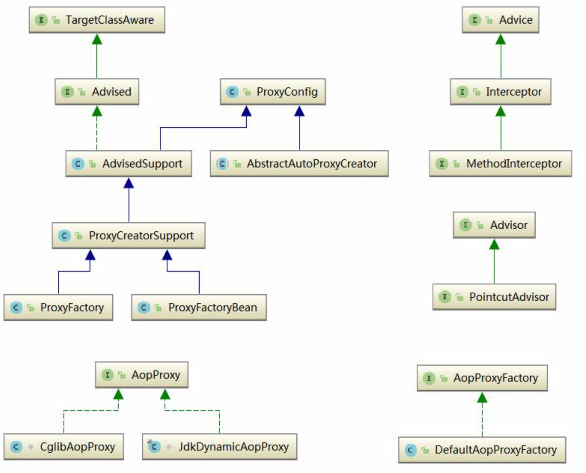

# Spring AOP-源码分析

## AOP应用场景

AOP是OOP的延续，是Aspect Oriented Programming的缩写，意思是面向切面编程。可以通过预编译方式和运行期动态代理实现在不修改源代码的情况下给程序统一添加功能的一种技术。AOP追求的是调用者和被调用者之间的解耦，AOP可以说是这种目标的一种实现。

我们现在做的一些非业务，如：日志、事务、安全等都会写在业务代码中，但是这些代码往往是重复，复制——粘贴式的代码会程序的维护带来不便，AOP就实现了把这些业务需求与系统需求分开来做。这种解决的方式也称代理机制。

## AOP的概念

### 切面（Aspect）

一个关注点的模块化，这个关注点可能会横切多个对象。”切面“在ApplicationContext中用```<aop:aspect>```来配置。

### 连接点（Joinpoint）

程序执行过程中的某一行为，例如，MemberService .get 的调用或者 MemberService .delete 抛出异常等行为。

### 通知（Advice）

”切面“对于某个”连接点“所产生的动作。其中，一个”切面“可以包含多个”Advice“。

#### 前置通知（Before Advice）

在某连接点（JoinPoint）之前执行的通知，但这个通知不能阻止连接点前的执行。ApplicationContext中```<aop:aspect>```里面使用```<aop:before>```元素进行声明。

#### 后置通知（After Advice）

当某连接点退出的时候执行的通知(不论是正常返回还是异常退出)。ApplicationContext 中在 ```<aop:aspect>```里面使用```<aop:after>```元素进行声明。

#### 返回后通知（After Return Advice）

在某连接点正常完成后执行的通知，不包括抛出异常的情况。ApplicationContext 中在```<aop:aspect> ```里面使用```<after-returning>```元素进行声明。

#### 环绕通知（Around Advice）

包围一个连接点的通知，类似 Web 中 Servlet 规范中的 Filter 的 doFilter 方法。可以在方法的调用前 后完成自定义的行为，也可以选择不执行。ApplicationContext 中在```<aop:aspect>```里面使用```<aop:around>```元素进行声明。

#### 异常通知（After Throwing Advice）

在方法抛出异常退出时执行的通知。ApplicationContext 中在```<aop:aspect>```里面使用``` <aop:after-throwing>```元素进行声明。

### 切入点（Pointcut）

匹配连接点的断言，在AOP中通知和一个切入点表达式关联。切面中的所有通知所关注的连接点，都由切入点表达式来决定。

### 目标对象（Target Object）

被一个或者多个切面所通知的对象。在实际运行时，Spring AOP采用代理实现，实际AOP操作的是TargetObject的代理对象。

### AOP代理（AOP Proxy）

在Spring AOP中又两种代理方式，JDK动态代理和CGLib代理。默认情况下，TargetObject实现了接口时，则采用JDK动态代理，反之，采用CGLib代理，强制使用CGLib代理需要将```<aop:config>```的```proxy-target-class```属性设置为true。

注:可以将多个通知应用到一个目标对象上，即可以将多个切面织入到同一目标对象。使用 Spring AOP 可以基于两种方式，一种是比较方便和强大的注解方式，另一种则是中规中矩的 xml 配置方式。

## Spring AOP源码分析

### 寻找入口

Spring 的AOP是通过接入BeanPostProcessor后置处理器开始的，它是Spring IOC容器经常使用到的一个特性，这个Bean后置处理器是一个监听器，可以监听容器触发的Bean生命周期事件。后置处理器向容器注册以后，容器中管理的Bean就具备了接收IOC容器事件回调的能力。

BeanPostProcessor的使用非常简单，只需要提供一个实现接口BeanPostProcessor的实现类，然后在Bean的配置文件中设置即可。

#### BeanPostProcessor源码

```java
public interface BeanPostProcessor {

   //为在Bean的初始化前提供回调入口
   @Nullable
   default Object postProcessBeforeInitialization(Object bean, String beanName) throws BeansException {
      return bean;
   }
   //为在Bean的初始化之后提供回调入口
   @Nullable
   default Object postProcessAfterInitialization(Object bean, String beanName) throws BeansException {
      return bean;
   }
}
```

这两个回调的入口都是和容器管理的Bean生命周期时间紧密相关，可以为用户提供在Spring IOC容器初始化Bean过程中自定义的处理操作。

#### AbstractAutowireCapableBeanFactory类对容器生成的Bean添加后置处理器

BeanPostProcessor后置处理器的调用发生在Spring IOC容器完成对Bean实例对象的创建和属性的依赖注入完成之后，在对Spring依赖注入的源码分析过程中我们知道，当应用程序第一次调用getBean()方法（lazy-init预实例化除外）向Spring IOC容器索取指定Bean时触发Spring IOC容器创建Bean实例对象并进行依赖注入的过程，其中真正的实现创建Bean对象并进行依赖注入的方法是AbstractAutowireCapableBeanFactory类的doCreateBean()方法，主要源码如下：

```java
//真正创建Bean的方法
protected Object doCreateBean(final String beanName, final RootBeanDefinition mbd, final @Nullable Object[] args)
      throws BeanCreationException {

   .......

   // Initialize the bean instance.
   //Bean对象的初始化，依赖注入在此触发
   //这个exposedObject在初始化完成之后返回作为依赖注入完成后的Bean
   Object exposedObject = bean;
   try {
      //将Bean实例对象封装，并且Bean定义中配置的属性值赋值给实例对象
      populateBean(beanName, mbd, instanceWrapper);
      //在对 Bean 实例对象生成和依赖注入完成以后，开始对 Bean 实例对象 
      //进行初始化 ，为 Bean 实例对象应用 BeanPostProcessor 后置处理器
      exposedObject = initializeBean(beanName, exposedObject, mbd);
   }
   catch (Throwable ex) {
      if (ex instanceof BeanCreationException && beanName.equals(((BeanCreationException) ex).getBeanName())) {
         throw (BeanCreationException) ex;
      }
      else {
         throw new BeanCreationException(
               mbd.getResourceDescription(), beanName, "Initialization of bean failed", ex);
      }
   }

  .....
    
	 //为应用返回所需要的实例对象
   return exposedObject;
}
```

从上面的代码中我们知道，为 Bean 实例对象添加 BeanPostProcessor 后置处理器的入口的是 initializeBean()方法。

#### initializeBean()方法为容器产生的Bean实例对象添加BeanPostProcessor后置处理器

同样在 AbstractAutowireCapableBeanFactory 类中，initializeBean()方法实现为容器创建的 Bean 实例对象添加 BeanPostProcessor 后置处理器，源码如下:

```java
//初始容器创建的Bean实例对象，为其添加BeanPostProcessor后置处理器
protected Object initializeBean(final String beanName, final Object bean, @Nullable RootBeanDefinition mbd) {
   //JDK的安全机制验证权限
   if (System.getSecurityManager() != null) {
      //实现PrivilegedAction接口的匿名内部类
      AccessController.doPrivileged((PrivilegedAction<Object>) () -> {
         invokeAwareMethods(beanName, bean);
         return null;
      }, getAccessControlContext());
   }
   else {
      //为Bean实例对象包装相关属性，如名称，类加载器，所属容器等信息
      invokeAwareMethods(beanName, bean);
   }

   Object wrappedBean = bean;
   //对BeanPostProcessor后置处理器的postProcessBeforeInitialization
   //回调方法的调用，为Bean实例初始化前做一些处理
   if (mbd == null || !mbd.isSynthetic()) {
      wrappedBean = applyBeanPostProcessorsBeforeInitialization(wrappedBean, beanName);
   }

   //调用Bean实例对象初始化的方法，这个初始化方法是在Spring Bean定义配置
   //文件中通过init-method属性指定的
   try {
      invokeInitMethods(beanName, wrappedBean, mbd);
   }
   catch (Throwable ex) {
      throw new BeanCreationException(
            (mbd != null ? mbd.getResourceDescription() : null),
            beanName, "Invocation of init method failed", ex);
   }
   //对BeanPostProcessor后置处理器的postProcessAfterInitialization
   //回调方法的调用，为Bean实例初始化之后做一些处理
   if (mbd == null || !mbd.isSynthetic()) {
      wrappedBean = applyBeanPostProcessorsAfterInitialization(wrappedBean, beanName);
   }

   return wrappedBean;
}
```

```java
@Override
//调用BeanPostProcessor后置处理器实例对象初始化之前的处理方法
public Object applyBeanPostProcessorsBeforeInitialization(Object existingBean, String beanName)
      throws BeansException {
   Object result = existingBean;
   //遍历容器为所创建的Bean添加的所有BeanPostProcessor后置处理器
   for (BeanPostProcessor beanProcessor : getBeanPostProcessors()) {
      //调用Bean实例所有的后置处理中的初始化前处理方法，为Bean实例对象在
      //初始化之前做一些自定义的处理操作
      Object current = beanProcessor.postProcessBeforeInitialization(result, beanName);
      if (current == null) {
         return result;
      }
      result = current;
   }
   return result;
}

@Override
//调用BeanPostProcessor后置处理器实例对象初始化之后的处理方法
public Object applyBeanPostProcessorsAfterInitialization(Object existingBean, String beanName)
      throws BeansException {

   Object result = existingBean;
   //遍历容器为所创建的Bean添加的所有BeanPostProcessor后置处理器
   for (BeanPostProcessor beanProcessor : getBeanPostProcessors()) {
      //调用Bean实例所有的后置处理中的初始化后处理方法，为Bean实例对象在
      //初始化之后做一些自定义的处理操作
      Object current = beanProcessor.postProcessAfterInitialization(result, beanName);
      if (current == null) {
         return result;
      }
      result = current;
   }
   return result;
}
```

BeanPostProcessor是一个接口，其初始化前的操作方法和初始化后的操作方法均委托其实现子类来实现，在Spring中，BeanPostProcessor的实现子类非常多，分别完成不同的操作，如：AOP面向切面编程的注册通知适配器、Bean对象的数据校验、Bean继承属性、方法的合并等等，我们以最简单的AOP切面织入来简单了解其主要的功能。下面我们来分析其中一个创建AOP代理对象的子类AbstractAutoProxyCreator类。该类重写了postProcessAfterInitialization()方法。

### 选择代理策略

进入 postProcessAfterInitialization()方法，我们发现调到了一个非常核心的方法 wrapIfNecessary()， 其源码如下:

```java
@Override
public Object postProcessAfterInitialization(@Nullable Object bean, String beanName) throws BeansException {
   if (bean != null) {
      Object cacheKey = getCacheKey(bean.getClass(), beanName);
      if (!this.earlyProxyReferences.contains(cacheKey)) {
         return wrapIfNecessary(bean, beanName, cacheKey);
      }
   }
   return bean;
}
```

```java
protected Object wrapIfNecessary(Object bean, String beanName, Object cacheKey) {
   if (StringUtils.hasLength(beanName) && this.targetSourcedBeans.contains(beanName)) {
      return bean;
   }
   // 判断是否不应该代理这个bean
   if (Boolean.FALSE.equals(this.advisedBeans.get(cacheKey))) {
      return bean;
   }
   /*
   *     判断是否是一些 InfrastructureClass 或者是否应该跳过这个 bean。
   *     所谓 InfrastructureClass 就是指 Advice/PointCut/Advisor 等接口的实现类。 * shouldSkip 默认实现为返回 false,由于是 protected 方法，子类可以覆盖。
   */
   if (isInfrastructureClass(bean.getClass()) || shouldSkip(bean.getClass(), beanName)) {
      this.advisedBeans.put(cacheKey, Boolean.FALSE);
      return bean;
   }

   // 获取这个 bean 的 advice
   // Create proxy if we have advice.
   Object[] specificInterceptors = getAdvicesAndAdvisorsForBean(bean.getClass(), beanName, null);
   if (specificInterceptors != DO_NOT_PROXY) {
      this.advisedBeans.put(cacheKey, Boolean.TRUE);
      // 创建代理
      Object proxy = createProxy(
            bean.getClass(), beanName, specificInterceptors, new SingletonTargetSource(bean));
      this.proxyTypes.put(cacheKey, proxy.getClass());
      return proxy;
   }

   this.advisedBeans.put(cacheKey, Boolean.FALSE);
   return bean;
}
```

```java
protected Object createProxy(Class<?> beanClass, @Nullable String beanName,
      @Nullable Object[] specificInterceptors, TargetSource targetSource) {

   if (this.beanFactory instanceof ConfigurableListableBeanFactory) {
      AutoProxyUtils.exposeTargetClass((ConfigurableListableBeanFactory) this.beanFactory, beanName, beanClass);
   }

   ProxyFactory proxyFactory = new ProxyFactory();
   proxyFactory.copyFrom(this);

   if (!proxyFactory.isProxyTargetClass()) {
      if (shouldProxyTargetClass(beanClass, beanName)) {
         proxyFactory.setProxyTargetClass(true);
      }
      else {
         evaluateProxyInterfaces(beanClass, proxyFactory);
      }
   }

   Advisor[] advisors = buildAdvisors(beanName, specificInterceptors);
   proxyFactory.addAdvisors(advisors);
   proxyFactory.setTargetSource(targetSource);
   customizeProxyFactory(proxyFactory);

   proxyFactory.setFrozen(this.freezeProxy);
   if (advisorsPreFiltered()) {
      proxyFactory.setPreFiltered(true);
   }

   return proxyFactory.getProxy(getProxyClassLoader());
}
```

整个过程跟下来，我发现最终调用的是 proxyFactory.getProxy()方法。到这里我们大概能够猜到 proxyFactory 有 JDK 和 CGLib 的，那么我们该如何选择呢?最终调用的是 DefaultAopProxyFactory 的 createAopProxy()方法:

```java
public class DefaultAopProxyFactory implements AopProxyFactory, Serializable {

   @Override
   public AopProxy createAopProxy(AdvisedSupport config) throws AopConfigException {
      if (config.isOptimize() || config.isProxyTargetClass() || hasNoUserSuppliedProxyInterfaces(config)) {
         Class<?> targetClass = config.getTargetClass();
         if (targetClass == null) {
            throw new AopConfigException("TargetSource cannot determine target class: " +
                  "Either an interface or a target is required for proxy creation.");
         }
         if (targetClass.isInterface() || Proxy.isProxyClass(targetClass)) {
            return new JdkDynamicAopProxy(config);
         }
         return new ObjenesisCglibAopProxy(config);
      }
      else {
         return new JdkDynamicAopProxy(config);
      }
   }

   private boolean hasNoUserSuppliedProxyInterfaces(AdvisedSupport config) {
      Class<?>[] ifcs = config.getProxiedInterfaces();
      return (ifcs.length == 0 || (ifcs.length == 1 && SpringProxy.class.isAssignableFrom(ifcs[0])));
   }

}
```

### 调用代理方法

分析调用逻辑之前先上类图，看看 Spring 中主要的 AOP 组件:



上面我们已经了解到 Spring 提供了两种方式来生成代理方式有 JDKProxy 和 CGLib。下面我们来研究 一下 Spring 如何使用 JDK 来生成代理对象，具体的生成代码放在 JdkDynamicAopProxy 这个类中， 直接上相关代码:

```java
/**
 * 获取代理类要实现的接口,除了Advised对象中配置的,还会加上SpringProxy, Advised(opaque=false)
 * 检查上面得到的接口中有没有定义 equals或者hashcode的接口
 * 调用Proxy.newProxyInstance创建代理对象
 */
@Override
public Object getProxy(@Nullable ClassLoader classLoader) {
   if (logger.isDebugEnabled()) {
      logger.debug("Creating JDK dynamic proxy: target source is " + this.advised.getTargetSource());
   }
   Class<?>[] proxiedInterfaces = AopProxyUtils.completeProxiedInterfaces(this.advised, true);
   findDefinedEqualsAndHashCodeMethods(proxiedInterfaces);
   return Proxy.newProxyInstance(classLoader, proxiedInterfaces, this);
}
```

通过注释我们应该已经看得非常明白代理对象的生成过程，此处不再赘述。下面的问题是，代理对象生 成了，那切面是如何织入的?
我们知道 InvocationHandler 是 JDK 动态代理的核心，生成的代理对象的方法调用都会委托到 InvocationHandler.invoke()方法。而从 JdkDynamicAopProxy 的源码我们可以看到这个类其实也实 现了 InvocationHandler，下面我们分析 Spring AOP 是如何织入切面的，直接上源码看 invoke()方法:

```java
@Override
@Nullable
public Object invoke(Object proxy, Method method, Object[] args) throws Throwable {
   MethodInvocation invocation;
   Object oldProxy = null;
   boolean setProxyContext = false;

   TargetSource targetSource = this.advised.targetSource;
   Object target = null;

   try {
      //eqauls()方法，具目标对象未实现此方法
      if (!this.equalsDefined && AopUtils.isEqualsMethod(method)) {
         // The target does not implement the equals(Object) method itself.
         return equals(args[0]);
      }
      //hashCode()方法，具目标对象未实现此方法
      else if (!this.hashCodeDefined && AopUtils.isHashCodeMethod(method)) {
         // The target does not implement the hashCode() method itself.
         return hashCode();
      }
      else if (method.getDeclaringClass() == DecoratingProxy.class) {
         // There is only getDecoratedClass() declared -> dispatch to proxy config.
         return AopProxyUtils.ultimateTargetClass(this.advised);
      }
      //Advised接口或者其父接口中定义的方法,直接反射调用,不应用通知
      else if (!this.advised.opaque && method.getDeclaringClass().isInterface() &&
            method.getDeclaringClass().isAssignableFrom(Advised.class)) {
         // Service invocations on ProxyConfig with the proxy config...
         return AopUtils.invokeJoinpointUsingReflection(this.advised, method, args);
      }

      Object retVal;

      if (this.advised.exposeProxy) {
         // Make invocation available if necessary.
         oldProxy = AopContext.setCurrentProxy(proxy);
         setProxyContext = true;
      }

      // Get as late as possible to minimize the time we "own" the target,
      // in case it comes from a pool.
      //获得目标对象的类
      target = targetSource.getTarget();
      Class<?> targetClass = (target != null ? target.getClass() : null);

      // Get the interception chain for this method.
      //获取可以应用到此方法上的Interceptor列表
      List<Object> chain = this.advised.getInterceptorsAndDynamicInterceptionAdvice(method, targetClass);

      // Check whether we have any advice. If we don't, we can fallback on direct
      // reflective invocation of the target, and avoid creating a MethodInvocation.
      //如果没有可以应用到此方法的通知(Interceptor)，此直接反射调用 method.invoke(target, args)
      if (chain.isEmpty()) {
         // We can skip creating a MethodInvocation: just invoke the target directly
         // Note that the final invoker must be an InvokerInterceptor so we know it does
         // nothing but a reflective operation on the target, and no hot swapping or fancy proxying.
         Object[] argsToUse = AopProxyUtils.adaptArgumentsIfNecessary(method, args);
         retVal = AopUtils.invokeJoinpointUsingReflection(target, method, argsToUse);
      }
      else {
         // We need to create a method invocation...
         //创建MethodInvocation
         invocation = new ReflectiveMethodInvocation(proxy, target, method, args, targetClass, chain);
         // Proceed to the joinpoint through the interceptor chain.
         retVal = invocation.proceed();
      }

      // Massage return value if necessary.
      Class<?> returnType = method.getReturnType();
      if (retVal != null && retVal == target &&
            returnType != Object.class && returnType.isInstance(proxy) &&
            !RawTargetAccess.class.isAssignableFrom(method.getDeclaringClass())) {
         // Special case: it returned "this" and the return type of the method
         // is type-compatible. Note that we can't help if the target sets
         // a reference to itself in another returned object.
         retVal = proxy;
      }
      else if (retVal == null && returnType != Void.TYPE && returnType.isPrimitive()) {
         throw new AopInvocationException(
               "Null return value from advice does not match primitive return type for: " + method);
      }
      return retVal;
   }
   finally {
      if (target != null && !targetSource.isStatic()) {
         // Must have come from TargetSource.
         targetSource.releaseTarget(target);
      }
      if (setProxyContext) {
         // Restore old proxy.
         AopContext.setCurrentProxy(oldProxy);
      }
   }
}
```

主要实现思路可以简述为:首先获取应用到此方法上的通知链(Interceptor Chain)。如果有通知，则 应用通知，并执行 JoinPoint;如果没有通知，则直接反射执行 JoinPoint。而这里的关键是通知链是如 何获取的以及它又是如何执行的呢?现在来逐一分析。首先，从上面的代码可以看到，通知链是通过 Advised.getInterceptorsAndDynamicInterceptionAdvice()这个方法来获取的，我们来看下这个方法 的实现逻辑:

```java
public List<Object> getInterceptorsAndDynamicInterceptionAdvice(Method method, @Nullable Class<?> targetClass) {
   MethodCacheKey cacheKey = new MethodCacheKey(method);
   List<Object> cached = this.methodCache.get(cacheKey);
   if (cached == null) {
      cached = this.advisorChainFactory.getInterceptorsAndDynamicInterceptionAdvice(
            this, method, targetClass);
      this.methodCache.put(cacheKey, cached);
   }
   return cached;
}
```

通过上面的源码我们可以看到，实际获取通知的实现逻辑其实是由 AdvisorChainFactory 的 getInterceptorsAndDynamicInterceptionAdvice()方法来完成的，且获取到的结果会被缓存。下面来 分析 getInterceptorsAndDynamicInterceptionAdvice()方法的实现:

```java
/**
 * 从提供的配置实例config中获取advisor列表,遍历处理这些advisor.如果是IntroductionAdvisor,
 * 则判断此Advisor能否应用到目标类targetClass上.如果是PointcutAdvisor,则判断
 * 此Advisor能否应用到目标方法method上.将满足条件的Advisor通过AdvisorAdaptor转化成Interceptor列表返回.
 */
@Override
public List<Object> getInterceptorsAndDynamicInterceptionAdvice(
      Advised config, Method method, @Nullable Class<?> targetClass) {

   // This is somewhat tricky... We have to process introductions first,
   // but we need to preserve order in the ultimate list.
   List<Object> interceptorList = new ArrayList<>(config.getAdvisors().length);
   Class<?> actualClass = (targetClass != null ? targetClass : method.getDeclaringClass());
   //查看是否包含IntroductionAdvisor
   boolean hasIntroductions = hasMatchingIntroductions(config, actualClass);
   //这里实际上注册一系列AdvisorAdapter,用于将Advisor转化成MethodInterceptor
   AdvisorAdapterRegistry registry = GlobalAdvisorAdapterRegistry.getInstance();

   for (Advisor advisor : config.getAdvisors()) {
      if (advisor instanceof PointcutAdvisor) {
         // Add it conditionally.
         PointcutAdvisor pointcutAdvisor = (PointcutAdvisor) advisor;
         if (config.isPreFiltered() || pointcutAdvisor.getPointcut().getClassFilter().matches(actualClass)) {
            //这个地方这两个方法的位置可以互换下
            //将Advisor转化成Interceptor
            MethodInterceptor[] interceptors = registry.getInterceptors(advisor);
            //检查当前advisor的pointcut是否可以匹配当前方法
            MethodMatcher mm = pointcutAdvisor.getPointcut().getMethodMatcher();
            if (MethodMatchers.matches(mm, method, actualClass, hasIntroductions)) {
               if (mm.isRuntime()) {
                  // Creating a new object instance in the getInterceptors() method
                  // isn't a problem as we normally cache created chains.
                  for (MethodInterceptor interceptor : interceptors) {
                     interceptorList.add(new InterceptorAndDynamicMethodMatcher(interceptor, mm));
                  }
               }
               else {
                  interceptorList.addAll(Arrays.asList(interceptors));
               }
            }
         }
      }
      else if (advisor instanceof IntroductionAdvisor) {
         IntroductionAdvisor ia = (IntroductionAdvisor) advisor;
         if (config.isPreFiltered() || ia.getClassFilter().matches(actualClass)) {
            Interceptor[] interceptors = registry.getInterceptors(advisor);
            interceptorList.addAll(Arrays.asList(interceptors));
         }
      }
      else {
         Interceptor[] interceptors = registry.getInterceptors(advisor);
         interceptorList.addAll(Arrays.asList(interceptors));
      }
   }

   return interceptorList;
}
```

这个方法执行完成后，Advised 中配置能够应用到连接点(JoinPoint)或者目标类(Target Object) 的 Advisor 全部被转化成了 MethodInterceptor，接下来我们再看下得到的拦截器链是怎么起作用的。

```java
// Check whether we have any advice. If we don't, we can fallback on direct
// reflective invocation of the target, and avoid creating a MethodInvocation.
//如果没有可以应用到此方法的通知(Interceptor)，此直接反射调用 method.invoke(target, args)
if (chain.isEmpty()) {
   // We can skip creating a MethodInvocation: just invoke the target directly
   // Note that the final invoker must be an InvokerInterceptor so we know it does
   // nothing but a reflective operation on the target, and no hot swapping or fancy proxying.
   Object[] argsToUse = AopProxyUtils.adaptArgumentsIfNecessary(method, args);
   retVal = AopUtils.invokeJoinpointUsingReflection(target, method, argsToUse);
}
else {
   // We need to create a method invocation...
   //创建MethodInvocation
   invocation = new ReflectiveMethodInvocation(proxy, target, method, args, targetClass, chain);
   // Proceed to the joinpoint through the interceptor chain.
   retVal = invocation.proceed();
}
```

从这段代码可以看出，如果得到的拦截器链为空，则直接反射调用目标方法，否则创建 MethodInvocation，调用其 proceed()方法，触发拦截器链的执行，来看下具体代码:

```java
@Override
@Nullable
public Object proceed() throws Throwable {
   // We start with an index of -1 and increment early.
   //如果Interceptor执行完了，则执行joinPoint
   if (this.currentInterceptorIndex == this.interceptorsAndDynamicMethodMatchers.size() - 1) {
      return invokeJoinpoint();
   }

   Object interceptorOrInterceptionAdvice =
         this.interceptorsAndDynamicMethodMatchers.get(++this.currentInterceptorIndex);
   //如果要动态匹配joinPoint
   if (interceptorOrInterceptionAdvice instanceof InterceptorAndDynamicMethodMatcher) {
      // Evaluate dynamic method matcher here: static part will already have
      // been evaluated and found to match.
      InterceptorAndDynamicMethodMatcher dm =
            (InterceptorAndDynamicMethodMatcher) interceptorOrInterceptionAdvice;
      //动态匹配：运行时参数是否满足匹配条件
      if (dm.methodMatcher.matches(this.method, this.targetClass, this.arguments)) {
         return dm.interceptor.invoke(this);
      }
      else {
         // Dynamic matching failed.
         // Skip this interceptor and invoke the next in the chain.
         //动态匹配失败时,略过当前Intercetpor,调用下一个Interceptor
         return proceed();
      }
   }
   else {
      // It's an interceptor, so we just invoke it: The pointcut will have
      // been evaluated statically before this object was constructed.
      //执行当前Intercetpor
      return ((MethodInterceptor) interceptorOrInterceptionAdvice).invoke(this);
   }
}
```

至此，通知链就完美地形成了。我们再往下来看 invokeJoinpoint()方法，其实就是反射调用:

```java
@Nullable
protected Object invokeJoinpoint() throws Throwable {
   return AopUtils.invokeJoinpointUsingReflection(this.target, this.method, this.arguments);
}
```

```java
@Nullable
public static Object invokeJoinpointUsingReflection(@Nullable Object target, Method method, Object[] args)
      throws Throwable {

   // Use reflection to invoke the method.
   try {
      ReflectionUtils.makeAccessible(method);
      return method.invoke(target, args);
   }
   catch (InvocationTargetException ex) {
      // Invoked method threw a checked exception.
      // We must rethrow it. The client won't see the interceptor.
      throw ex.getTargetException();
   }
   catch (IllegalArgumentException ex) {
      throw new AopInvocationException("AOP configuration seems to be invalid: tried calling method [" +
            method + "] on target [" + target + "]", ex);
   }
   catch (IllegalAccessException ex) {
      throw new AopInvocationException("Could not access method [" + method + "]", ex);
   }
}
```

Spring AOP 源码就分析到这儿。

### 触发通知

在为AopProxy代理对下你给配置拦截器的实现中，有一个区的拦截器的配置过程，这个过程是由DefaultAdvisorChainFactory实现的，这个工厂类负责生成拦截器链，在它的getInterceptorsAndDynamicInterceptionAdvice方法中，由一个适配器和注册过程，通过配置Spring预先设计好的拦截器，Spring加入了它对AOP实现的处理。

```java
/**
 * 从提供的配置实例config中获取advisor列表,遍历处理这些advisor.如果是IntroductionAdvisor,
 * 则判断此Advisor能否应用到目标类targetClass上.如果是PointcutAdvisor,则判断
 * 此Advisor能否应用到目标方法method上.将满足条件的Advisor通过AdvisorAdaptor转化成Interceptor列表返回.
 */
@Override
public List<Object> getInterceptorsAndDynamicInterceptionAdvice(
      Advised config, Method method, @Nullable Class<?> targetClass) {

   // This is somewhat tricky... We have to process introductions first,
   // but we need to preserve order in the ultimate list.
   List<Object> interceptorList = new ArrayList<>(config.getAdvisors().length);
   Class<?> actualClass = (targetClass != null ? targetClass : method.getDeclaringClass());
   //查看是否包含IntroductionAdvisor
   boolean hasIntroductions = hasMatchingIntroductions(config, actualClass);
   //这里实际上注册一系列AdvisorAdapter,用于将Advisor转化成MethodInterceptor
   AdvisorAdapterRegistry registry = GlobalAdvisorAdapterRegistry.getInstance();

   for (Advisor advisor : config.getAdvisors()) {
      if (advisor instanceof PointcutAdvisor) {
         // Add it conditionally.
         PointcutAdvisor pointcutAdvisor = (PointcutAdvisor) advisor;
         if (config.isPreFiltered() || pointcutAdvisor.getPointcut().getClassFilter().matches(actualClass)) {
            //这个地方这两个方法的位置可以互换下
            //将Advisor转化成Interceptor
            MethodInterceptor[] interceptors = registry.getInterceptors(advisor);
            //检查当前advisor的pointcut是否可以匹配当前方法
            MethodMatcher mm = pointcutAdvisor.getPointcut().getMethodMatcher();
            if (MethodMatchers.matches(mm, method, actualClass, hasIntroductions)) {
               if (mm.isRuntime()) {
                  // Creating a new object instance in the getInterceptors() method
                  // isn't a problem as we normally cache created chains.
                  for (MethodInterceptor interceptor : interceptors) {
                     interceptorList.add(new InterceptorAndDynamicMethodMatcher(interceptor, mm));
                  }
               }
               else {
                  interceptorList.addAll(Arrays.asList(interceptors));
               }
            }
         }
      }
      else if (advisor instanceof IntroductionAdvisor) {
         IntroductionAdvisor ia = (IntroductionAdvisor) advisor;
         if (config.isPreFiltered() || ia.getClassFilter().matches(actualClass)) {
            Interceptor[] interceptors = registry.getInterceptors(advisor);
            interceptorList.addAll(Arrays.asList(interceptors));
         }
      }
      else {
         Interceptor[] interceptors = registry.getInterceptors(advisor);
         interceptorList.addAll(Arrays.asList(interceptors));
      }
   }

   return interceptorList;
}
```

GlobalAdvisorAdapterRegistry 负责拦截器的适配和注册过程。

```java
public abstract class GlobalAdvisorAdapterRegistry {

   /**
    * Keep track of a single instance so we can return it to classes that request it.
    */
   private static AdvisorAdapterRegistry instance = new DefaultAdvisorAdapterRegistry();

   /**
    * Return the singleton {@link DefaultAdvisorAdapterRegistry} instance.
    */
   public static AdvisorAdapterRegistry getInstance() {
      return instance;
   }

   /**
    * Reset the singleton {@link DefaultAdvisorAdapterRegistry}, removing any
    * {@link AdvisorAdapterRegistry#registerAdvisorAdapter(AdvisorAdapter) registered}
    * adapters.
    */
   static void reset() {
      instance = new DefaultAdvisorAdapterRegistry();
   }

}
```

而 GlobalAdvisorAdapterRegistry 起到了适配器和单例模式的作用，提供了一个 DefaultAdvisorAdapterRegistry，它用来完成各种通知的适配和注册过程。

```java
public class DefaultAdvisorAdapterRegistry implements AdvisorAdapterRegistry, Serializable {

   private final List<AdvisorAdapter> adapters = new ArrayList<>(3);


   /**
    * Create a new DefaultAdvisorAdapterRegistry, registering well-known adapters.
    */
   public DefaultAdvisorAdapterRegistry() {
      registerAdvisorAdapter(new MethodBeforeAdviceAdapter());
      registerAdvisorAdapter(new AfterReturningAdviceAdapter());
      registerAdvisorAdapter(new ThrowsAdviceAdapter());
   }


   @Override
   public Advisor wrap(Object adviceObject) throws UnknownAdviceTypeException {
      if (adviceObject instanceof Advisor) {
         return (Advisor) adviceObject;
      }
      if (!(adviceObject instanceof Advice)) {
         throw new UnknownAdviceTypeException(adviceObject);
      }
      Advice advice = (Advice) adviceObject;
      if (advice instanceof MethodInterceptor) {
         // So well-known it doesn't even need an adapter.
         return new DefaultPointcutAdvisor(advice);
      }
      for (AdvisorAdapter adapter : this.adapters) {
         // Check that it is supported.
         if (adapter.supportsAdvice(advice)) {
            return new DefaultPointcutAdvisor(advice);
         }
      }
      throw new UnknownAdviceTypeException(advice);
   }

   @Override
   public MethodInterceptor[] getInterceptors(Advisor advisor) throws UnknownAdviceTypeException {
      List<MethodInterceptor> interceptors = new ArrayList<>(3);
      Advice advice = advisor.getAdvice();
      if (advice instanceof MethodInterceptor) {
         interceptors.add((MethodInterceptor) advice);
      }
      for (AdvisorAdapter adapter : this.adapters) {
         if (adapter.supportsAdvice(advice)) {
            interceptors.add(adapter.getInterceptor(advisor));
         }
      }
      if (interceptors.isEmpty()) {
         throw new UnknownAdviceTypeException(advisor.getAdvice());
      }
      return interceptors.toArray(new MethodInterceptor[interceptors.size()]);
   }

   @Override
   public void registerAdvisorAdapter(AdvisorAdapter adapter) {
      this.adapters.add(adapter);
   }

}
```

DefaultAdvisorAdapterRegistry 设置了一系列的是配置，正是这些适配器的实现，为 Spring AOP 提供了编织能力。下面以 MethodBeforeAdviceAdapter 为例，看具体的 实现:

```java
class MethodBeforeAdviceAdapter implements AdvisorAdapter, Serializable {

   @Override
   public boolean supportsAdvice(Advice advice) {
      return (advice instanceof MethodBeforeAdvice);
   }

   @Override
   public MethodInterceptor getInterceptor(Advisor advisor) {
      MethodBeforeAdvice advice = (MethodBeforeAdvice) advisor.getAdvice();
      return new MethodBeforeAdviceInterceptor(advice);
   }

}
```

Spring AOP 为了实现 advice 的织入，设计了特定的拦截器对这些功能进行了封装。我 们接着看 MethodBeforeAdviceInterceptor 如何完成封装的?

```java
public class MethodBeforeAdviceInterceptor implements MethodInterceptor, Serializable {

   private MethodBeforeAdvice advice;


   /**
    * Create a new MethodBeforeAdviceInterceptor for the given advice.
    * @param advice the MethodBeforeAdvice to wrap
    */
   public MethodBeforeAdviceInterceptor(MethodBeforeAdvice advice) {
      Assert.notNull(advice, "Advice must not be null");
      this.advice = advice;
   }

   @Override
   public Object invoke(MethodInvocation mi) throws Throwable {
      this.advice.before(mi.getMethod(), mi.getArguments(), mi.getThis() );
      return mi.proceed();
   }

}
```

可以看到，invoke 方法中，首先触发了 advice 的 before 回调，然后才是 proceed。 AfterReturningAdviceInterceptor 的源码:

```java
public class AfterReturningAdviceInterceptor implements MethodInterceptor, AfterAdvice, Serializable {

   private final AfterReturningAdvice advice;


   /**
    * Create a new AfterReturningAdviceInterceptor for the given advice.
    * @param advice the AfterReturningAdvice to wrap
    */
   public AfterReturningAdviceInterceptor(AfterReturningAdvice advice) {
      Assert.notNull(advice, "Advice must not be null");
      this.advice = advice;
   }

   @Override
   public Object invoke(MethodInvocation mi) throws Throwable {
      Object retVal = mi.proceed();
      this.advice.afterReturning(retVal, mi.getMethod(), mi.getArguments(), mi.getThis());
      return retVal;
   }

}
```

ThrowsAdviceInterceptor 的源码:

```java
@Override
public Object invoke(MethodInvocation mi) throws Throwable {
   try {
      return mi.proceed();
   }
   catch (Throwable ex) {
      Method handlerMethod = getExceptionHandler(ex);
      if (handlerMethod != null) {
         invokeHandlerMethod(mi, ex, handlerMethod);
      }
      throw ex;
   }
}

private void invokeHandlerMethod(MethodInvocation mi, Throwable ex, Method method) throws Throwable {
   Object[] handlerArgs;
   if (method.getParameterCount() == 1) {
      handlerArgs = new Object[] { ex };
   }
   else {
      handlerArgs = new Object[] {mi.getMethod(), mi.getArguments(), mi.getThis(), ex};
   }
   try {
      method.invoke(this.throwsAdvice, handlerArgs);
   }
   catch (InvocationTargetException targetEx) {
      throw targetEx.getTargetException();
   }
}
```

至此，我们知道了对目标对象的增强是通过拦截器实现的.