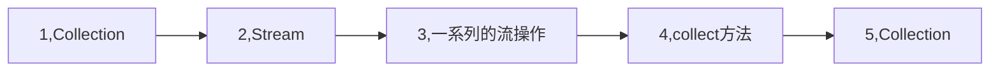
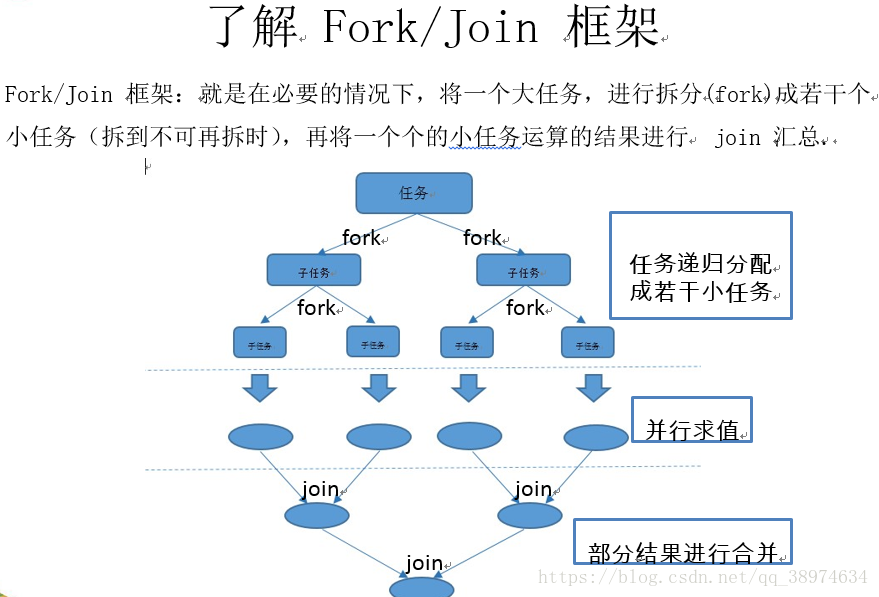

# java8的流(Stream)操作


## 函数式接口与lambda表达式

函数式接口(Functional Interface)就是一个有且仅有一个抽象方法，但是可以有多个非抽象方法的接口。

函数式接口可以被隐式转换为 lambda 表达式。

Lambda 表达式和方法引用（实际上也可认为是Lambda表达式）上。

[参考[Java 8 函数式接口]](https://www.runoob.com/java/java8-functional-interfaces.html)

这里只是抛转引玉,本篇文章主要让讲解stream的使用.

------


## 流(Stream)

流(Stream)是java8引入的api，使用它可以替换大部分集合操作，重要的是，流相对集合来说更简洁易读、更灵活，性能也更好。

- 使用Colleection接口需要做迭代,如for-each.这称为外部迭代.Stream库使用内部迭代,只要给出函数说怎么做就行了.
- 流操作有两类:中间操作和终端操作
  - filter和map等中间操作会返回一个流,并可以链接在一起.可以用它们来这只一条流水线,但并颁布会生成任何结果.
  - forEach和count等终端操作会返回一个非流的值,并处理流水线以返回结果.


-----


## Stream操作

### 集合

有了基础以后,还要有一个集合,该集合使用了<java8实战>中的菜谱.然后我们根据这个集合来演示java8中的Stream操作.

```java
    public static List<Dish> menu = Arrays.asList(
            new Dish("pork", false, 800, Type.MEAT),
            new Dish("beef", false, 700, Type.MEAT),
            new Dish("chicken", false, 400, Type.MEAT),
            new Dish("french fries", true, 530, Type.OHTER),
            new Dish("rice", true, 350, Type.OHTER),
            new Dish("season fruit", true, 120, Type.OHTER),
            new Dish("pizza", true, 550, Type.OHTER),
            new Dish("prawna", false, 300, Type.FISH),
            new Dish("salmon", false, 450, Type.FISH)
    );
```

Dish对象定义如下代码:

```java
private static class Dish {
    private final String name;
    private final boolean vegetarian;
    private final int calories;
    private final Type type;


    public Dish(String name, boolean vegetarian, int calories, Type type) {
        this.name = name;
        this.vegetarian = vegetarian;
        this.calories = calories;
        this.type = type;
    }

    public String getName() {
        return name;
    }

    public boolean isVegetarian() {
        return vegetarian;
    }

    public int getCalories() {
        return calories;
    }

    public Type getType() {
        return type;
    }

    @Override
    public String toString() {
        return "Dish{" +
                "name='" + name + '\'' +
                ", vegetarian=" + vegetarian +
                ", calories=" + calories +
                ", type=" + type +
                '}';
    }
}
```

在正式开始前先了解一下流(Stream)操作的流程:



1-2集合(Collection)通过stream()或parallelStream()方法装换为一个流(Stream).

2-3,通过流(Stream)提供的API做一系列的流操作

3-4-5,经过流操作以后通过收集器(collect方法)将流转换为集合(Collection)

这些过程在后面的每个例子中都会经历一遍.


----

### 筛选和切片

**filter**操作会接受一个谓词作为参数,并返回一个包括所有符合谓词元素的流.

```java
// filter 方法筛选出符合条件的元素,collect方法转换为新的集合
List<Dish> vegetarianMenu = menu.stream() 	// 集合转换为流
        .filter(Dish::isVegetarian)					// 流操作
        .collect(Collectors.toList());			// 通过收集器转换为集合

vegetarianMenu.forEach(dish -> System.out.println(dish.getName()));
```

执行结果:
french fries
rice
season fruit
pizza

----

**distinct**返回一个元素各异(根据流所生成元素的hashCode和equals方法实现)的流.

```java
List<Integer> numbers = Arrays.asList(1, 2, 1, 3, 3, 2, 4);

numbers.stream()
        .filter(i -> i % 2 == 0)  // 获取偶数
        .distinct()// 去除重复
        .forEach(System.out::println);
```

执行结果:

2
4

-----

**limit**方法返回一个不超过给定长度的流.所需长度作为参数传递给limit.
如果流是有序的,则会返回前n个元素.
会短路即获取到足够的limit值后流不在继续内循环

```java
List<Dish> dishes = menu.stream()
        .filter(d -> d.getCalories() > 300)
        .limit(3)
        .collect(Collectors.toList());

dishes.forEach(dish -> System.out.println(dish));
```

执行结果:

Dish{name='pork', vegetarian=false, calories=800, type=MEAT}
Dish{name='beef', vegetarian=false, calories=700, type=MEAT}
Dish{name='chicken', vegetarian=false, calories=400, type=MEAT}

----

**skip**方法,跳过元素,返回一个 扔掉前n个元素的流.如果流中元素不足n个,则返回一个空流.
limit和skip是互补的.

```java
List<Dish> dishes = menu.stream()
        .filter(d -> d.getCalories() > 300)
        .skip(2)
        .collect(Collectors.toList());
dishes.forEach(dish -> System.out.println(dish));
```

执行结果:

Dish{name='chicken', vegetarian=false, calories=400, type=MEAT}
Dish{name='french fries', vegetarian=true, calories=530, type=OHTER}
Dish{name='rice', vegetarian=true, calories=350, type=OHTER}
Dish{name='pizza', vegetarian=true, calories=550, type=OHTER}
Dish{name='salmon', vegetarian=false, calories=450, type=FISH}

---

### 映射

**map**方法,接受一个函数作为参数.这个函数会被应用到每个元素上,并将其映射成一个新的元素映射和转换类似,映射结果是创建一个新的版本,而不是去修改.

```java
List<String> dishNames = menu.stream()
        .map(Dish::getName)
        .collect(Collectors.toList());

dishNames.forEach(s -> System.out.println(s));
```

执行结果:

pork
beef
chicken
french fries
rice
season fruit
pizza
prawna
salmon

从代码可以看出map方法把List<Dish> 集合使用Dish::getName 字段转换成了List<String>. map就是转换.下面一段代码尝试使用dish对象内的数据将List<Dish>转换为List<Value>

Value类的定义:

```java
public class Value {
    String key;

    int number;


    public Value(String key, int number) {
        this.key = key;
        this.number = number;
    }

    public String getKey() {
        return key;
    }

    public void setKey(String key) {
        this.key = key;
    }

    public int getNumber() {
        return number;
    }

    public void setNumber(int number) {
        this.number = number;
    }

    @Override
    public String toString() {
        return "Value{" +
                "key='" + key + '\'' +
                ", number=" + number +
                '}';
    }
}
```

转换代码:

```java
List<Value> dishValueList = menu.stream()
        .map(dish -> new Value(dish.getName(), dish.getCalories()))
        .collect(Collectors.toList());

dishValueList.forEach(value -> System.out.println(value));
```

执行结果:

Value{key='pork', number=800}
Value{key='beef', number=700}
Value{key='chicken', number=400}
Value{key='french fries', number=530}
Value{key='rice', number=350}
Value{key='season fruit', number=120}
Value{key='pizza', number=550}
Value{key='prawna', number=300}
Value{key='salmon', number=450}

使用List元素的属性进行转换:

```java
List<String> words = Arrays.asList("Java 8", "Lambdas", "In", "Action");
List<Integer> wordLengths = words.stream()
        .map(String::length)
        .collect(Collectors.toList());

wordLengths.forEach(integer -> System.out.println(integer));
```

执行结果:

6
7
2
6

使用map方法实现给定数字列表返回列表数的平方构成的列表

```java
List<Integer> numbers = Arrays.asList(1, 2, 3, 4, 5);

List<Integer> squares = numbers.stream()
        .map(n -> n * n)
        .collect(Collectors.toList());

squares.forEach(s -> System.out.println(s));
```

### 流的扁平化flatMap方法

```java
List<String> words = Arrays.asList("Hello", "World");

List<String[]> list = words.stream()
        .map(word -> word.split(""))
        .distinct()
        .collect(Collectors.toList());
list.forEach(s -> System.out.println(s.length));
```

执行结果:

5
5

上面的代码本意是想获取words集合中的不重复的字母.所以在map方法中使用word.split("")转换成["H","e","l","l","o","W","o","r","l","d"]的形式,在使用distinct方法进行去重.但是使用map方法实际会将集合转换为[["H","e","l","l","o"],["W","o","r","l","d"]]这样个二维数组的形式.这显然是不对的.这种情况应该使用**flatMap**方法将转换后的多个流,合并成为一个如下面代码:

```java
List<String> words = Arrays.asList("Hello", "World");
List<String> list = words.stream()
        .map(w -> w.split(""))
        .flatMap(Arrays::stream)
        .distinct()
        .collect(Collectors.toList());

list.forEach(s -> System.out.println(s));
```

执行结果:

H
e
l
o
W
r
d

这样就得到了我们想要的结果.

### 查找和匹配

**anyMatch**方法可以回答"流中是否有一个元素能匹配给定的谓词"

```java
if (menu.stream().anyMatch(Dish::isVegetarian)) {
    System.out.println("存在素食");
}
```

----

**allMatch**方法看流中的元素是否都能匹配给定的谓词.

```java
if (menu.stream().allMatch(dish -> dish.getCalories() < 1000)) {
    System.out.println("所有都满足");
}
```

-----

**noneMatch**方法看流中没有任何元素与给定的谓词匹配.

```java
if (menu.stream().noneMatch(d -> d.getCalories() >= 1000)) {
    System.out.println("所有都不满足");
}
```

---

**findAny**方法将返回当前流中的任意元素.它可以与其他流操作结合使用.该方法的返回值为Optional<T>,Optional<T> 类是一个容器类.代表一个值存在或不存在.java8的库设计人员引入了Optional<T>,这样就不用返回众所周知容易出问题的null.

```java
Optional<Dish> dish = menu.stream()
        .filter(Dish::isVegetarian)
        .findAny();
/**
 * Optional<T> 类是一个容器类.代表一个值存在或不存在.
 * java8的库设计人员引入了Optional<T>,这样就不用返回众所周知容易出问题的null.
 */

// 在Optinal包含值的时候返回true,否则返回false
if (dish.isPresent()) {
    // 会再存在值的时候执行给定的代码块.
    dish.ifPresent(dish1 -> System.out.println(dish));

    Dish dish2 = dish.get(); // 值存在时返回值.否则抛出NoSuchElement异常
    System.out.println(dish2);
    // 会在值存在时返回值,否则返回一个默认值.
    Dish dish3 = dish.orElse(new Dish("pork2", false, 800, Type.MEAT));
    System.out.println(dish3);
}
```

----

**findFirst**方法找到流中第一个符合条件的元素

```java
List<Integer> someNumbers = Arrays.asList(1, 2, 3, 4, 5);
Optional<Integer> firstSquareDivis = someNumbers.stream()
        .map(x -> x * x)
        .filter(x -> x % 3 == 0)
        .findFirst();

firstSquareDivis.ifPresent(integer -> System.out.println(integer));
```

### 归约

需要将流中所有元素反复结合起来,得到一个值.这样的查询可以被归类为归约操作.用函数式编程的术语来说,这称为折叠(fold).

----

**reduce**操作是,反复使用Lambda表达式,直到流被归约成一个值.

```java
List<Integer> numbers = Arrays.asList(1, 2, 3, 4, 5);
//reduce方法的参数0为初始值.反复调用a + b, a为上次调用的和,直到流被归约成一个值.
//调用值依次为:0+1,1+2,3+3,6+4,10+5 最终结果为15
int sum = numbers.stream().reduce(0, (a, b) -> a + b);
int sum2 = numbers.stream().reduce(0, Integer::sum);
// reduce还有一个重载变体,它不接收初始值,但是会返回一个Optional对象
Optional<Integer> sum3 = numbers.stream().reduce((a, b) -> (a + b));


System.out.println("1:" + sum);
System.out.println("2:" + sum2);
System.out.println("3:" + sum3.get());
sum3.ifPresent(System.out::println);
```

输出结果:

1:15
2:15
3:15
15

**reduce**操作 的另外示例:

```java
List<Integer> numbers = Arrays.asList(1, 2, 3, 4, 5);

Optional<Integer> max = numbers.stream().reduce(Integer::max);
Optional<Integer> min = numbers.stream().reduce(Integer::min);
// 用map和reduce数一数流中有多少菜
int count = menu.stream()
        .map(d -> 1)
        .reduce(0, (a, b) -> a + b);

max.ifPresent(integer -> System.out.println("max:" + max.get()));
min.ifPresent(integer -> System.out.println("min:" + min.get()));

System.out.println("count:" + count);
```

归约方法的优势与并行化:

==相比于java8流操作之前的逐步迭代求和,使用reduce的好处在于,这里的迭代被内部迭代抽象掉了,这让内实现得以选择并行执行reduce操作.而迭代求和要并行需要更新共享变量.如果加入了同步,很可能线程竞争抵消了并行本应带来的性能提升.这种计算的并行化需要将输入分块,分块求和,最后在合并起来.但是使用fork/join方法代码结构就会复杂很多==

另外还需要注意隐含的装箱拆箱操作.对于大集合的内部迭代会有较大的性能损耗.如下面代码:

```
int calories = menu.stream()
        .map(Dish::getCalories)
        .reduce(0, Integer::sum);
System.out.println(calories);
// 上面代码暗含装箱的执行成本,每个Integer都必须拆箱成一个原始类型再进行求和.
```

### 原始类型流特化

Java 8 引入了三个原始类型特化流接口来解决拆箱问题: **IntStream,DoubleStream,LongStream**,分别将流中的元素特化为int,double,long,从而避免了暗含的装箱成本.每个接口都带来了进行常用数值归约的新方法,比如对数值流求和的sum,找到最大元素的max.

将流转换为特化版本的常用方法是mapToInt,mapToDouble,mapToLong,它们和map的使用方法一样但是返回的是一个特化流.

对于三种原始流特化,也分别有一个Optional原始类型特化版本: OptionalInt,OptionalDouble,OptionalLong

```java
int calories = menu.stream()
        .mapToInt(Dish::getCalories)
        .sum();

System.out.println("mapToInt:" + calories);

// 转换回对象流
IntStream intStream = menu.stream()
        .mapToInt(Dish::getCalories);
// 将数值流转换为对象流
Stream<Integer> stream = intStream.boxed();
stream.collect(Collectors.toList()).forEach(System.out::println);

// 对于三种原始流特化,也分别有一个Optional原始类型特化版本:
// OptionalInt,OptionalDouble,OptionalLong
OptionalInt optionalInt = menu.stream()
        .mapToInt(Dish::getCalories)
        .max();

System.out.println(optionalInt.getAsInt());
```


### 数值范围流

Java8 引入了两个可以用于IntStream和LongStream的静态方法,帮助生成数值范围流:**range和rangeClosed**.这两个方法都是第一个参数接受起始值,第二个参数接受结束值.

```java
IntStream evenNumbers = IntStream.rangeClosed(1, 100)
        .filter(n -> n % 2 == 0);

IntStream evenNumbers1 = IntStream.range(1, 100)
        .filter(n -> n % 2 == 0);

//range不包含结尾数, rangeClosed包含结束数
System.out.println(evenNumbers.count());
System.out.println(evenNumbers1.count());
```

执行结果:

50
49

----

### 构建流

可以根据值序列\数组\文件\生成函数来创建流.

```java
// 由值创建流:使用静态方法Stream.of,通过显示值创建一个流.可以接受任意数量参数.
Stream<String> stream = Stream.of("Java 8", "Lambdas", "In ", "Action");
stream.map(String::toUpperCase)
        .forEach(System.out::println);
System.out.println("------------------------");
// 由数组创建流:使用静态方法Arrays.stream从数组创建一个流.
int[] numbers = {2, 3, 5, 7, 11, 13};
int sum = Arrays.stream(numbers).sum();
System.out.println("Arrays.stream:" + sum);
System.out.println("------------------------");
// 由文件生成流
/**
 * Java中用于处理文件等I/O操作的NIO API (非阻塞 I/O)已更新.以便利用Stream API.
 * java.nio.file.Files 中很多静态方法都会返回一个流.
 */

// 使用Files.lines获得一个流,每个元素都文件中的一行.
long uniqueWords = 0;
try (Stream<String> lines = Files.lines(Paths.get("/Users/wenbin/log/awk/awk_copy.log"), Charset.defaultCharset())) {
    // 文件中有多少不重复的单词
    uniqueWords = lines
            .flatMap(line -> Arrays.stream(line.split(" ")))
            .distinct()
            .count();
} catch (IOException e) {
    e.printStackTrace();
}

System.out.println("awk_copy.log:" + uniqueWords);

/**
 * 由函数生成流:创建无限流
 * Stream API 提供了两个静态方法来从函数生成流: Stream.iterate和Stream.generate
 * 这两个操作可以创建无限流:
 * 无限流: 不像从固定集合创建流那样有固定大小的流.由iterate和generate产生的流会用给定
 * 的函数按需创建值,因此可以无穷无尽的计算下去.一般来说应该使用limit限制这种流.
 * 这是流和集合之间关键区别
 */

// iterate方法接受一个初始值,还有一个依次应用在每个产生的新值上的Lambda
Stream.iterate(0, n -> n + 2)
        .limit(10)
        .forEach(System.out::println);

System.out.println("------------------------");

// generate方法接受一个Supplier<T>类型的Lambda提供新的值
Stream.generate(Math::random)
        .limit(5)
        .forEach(System.out::println);

System.out.println("------------------------");
```

执行结果:

```verilog
JAVA 8
LAMBDAS
IN 
ACTION
------------------------
Arrays.stream:41
------------------------
awk_copy.log:16
0
2
4
6
8
10
12
14
16
18
------------------------
0.8565669350197561
0.8727689393789019
0.3207719067839073
0.30793989863248017
0.9282829688607843
------------------------
```


### 小结

- Stream API 可以表达复杂的数据处理查询.
- 可以使用filter\distinct\skip和limit对流做筛选操作.
- 可以使用map和flatmap提取或转换流中元素.
- 可以使用findFrist和findAny方法查找流中的元素.可以使用allMatch\noneMatch和anyMatch方法让流匹配个给定的谓词.
- 这些方法都利用了短路:找到结果就立即停止计算.没有必要处理整个流.
- 可以利用reduce方法将流中的所有元素迭代合并成一个结果.例如,求和或寻找最大元素.
- filter和map等操作是无状态的,它们并不存储任何状态.reduce等操作要存储状态才能计算出一个值.sorted和distinct等操作也要存储状态,因为它们需要把流中的所有元素缓存起来才能返回一个新的流.这种操作称为有状态操作.
- 流有三种基本的原始类型特化:IntStream\DoubleStream和LongStream/它们的操作也有相应的特化.
- 流不紧可以从集合创建,也可以从值\数组\文件以及iterate与generate等特定方法创建.
- 无限流是没有固定大小的流.


----

### 收集器

collect是一个归约操作,就像reduce一样可以接受各种做法作为参数,将流中的元素累积成一个汇总结果.具体的做法是通过定义新的Collector接口来定义的,因此区分**Collection,Collector,collect**是很重要的.

收集器可以简单灵活的定义collect方法用来生成集合的标准.对流调用collect方法将对流中的元素触发一个归约操作(由Collector来参数化)

Collector会对元素应用一个转换函数(很多时候是不体现任何效果的恒等转换,例如toList),并将结果累积在一个数据结构中.


#### 归约和汇总

广义的归约汇总,下面所有的收集器,都是一个可以用reducing工厂方法定义的归约过程的特殊情况.方便可读性.

```java
/**
* Collectors.reducing 需要3个参数:
* 第一个参数是归约操作的起始值,也是流中没有元素时的返回值,所以很显然对于值
* 和而言0是一个很合适的值
* 第二个参数就是需要归约的值
* 第三个参数将第一个参数和第二个参数累积成一个同类型值的操作.
*/
// 用reducing方法创建收集器计算菜单总热量
int totalCalories = menu.stream().collect(
  Collectors.reducing(0, Dish::getCalories, (i, j) -> i + j));
System.out.println("totalCalories:" + totalCalories);

long howManyDishes = menu.stream().collect(Collectors.counting());
long howManyDishes1 = menu.stream().count();

System.out.println(howManyDishes + ":" + howManyDishes1);

Comparator<Dish> dishComparator = Comparator.comparing(Dish::getCalories);
Optional<Dish> max = menu.stream().collect(Collectors.maxBy(dishComparator));
Optional<Dish> min = menu.stream().collect(Collectors.minBy(dishComparator));

System.out.println("max:" + max);
System.out.println("min:" + min);

int sum = menu.stream().collect(Collectors.summingInt(Dish::getCalories));
System.out.println("sum:" + sum);

double avg = menu.stream().collect(Collectors.averagingInt(Dish::getCalories));
System.out.println("avg:" + avg);

// 单参数形式的reducing来找到热量最高的菜
Optional<Dish> maxDish = menu.stream().collect(
  Collectors.reducing((d1, d2) -> d1.getCalories() > d2.getCalories() ? d1 : d2));
System.out.println(maxDish);

// 使用Integer::sum获得总热量
totalCalories = menu.stream().collect(
  Collectors.reducing(0, Dish::getCalories, Integer::sum));
System.out.println("使用Integer::sum获得总热量totalCalories:" + totalCalories);


// 可以通过一次summarizing操作获取,总和,平均值,最大,最小
IntSummaryStatistics menuIss = menu.stream().collect(Collectors.summarizingInt(Dish::getCalories));
System.out.println(menuIss);

// 连接字符串
String name1 = menu.stream().map(Dish::getName).collect(Collectors.joining());
System.out.println(name1);
String name2 = menu.stream().map(Dish::getName).collect(Collectors.joining(","));
System.out.println(name2);
```

执行结果:

9:9
max:Optional[Dish{name='pork', vegetarian=false, calories=800, type=MEAT}]
min:Optional[Dish{name='season fruit', vegetarian=true, calories=120, type=OHTER}]
sum:4200
avg:466.6666666666667
IntSummaryStatistics{count=9, sum=4200, min=120, average=466.666667, max=800}
porkbeefchickenfrench friesriceseason fruitpizzaprawnasalmon
pork,beef,chicken,french fries,rice,season fruit,pizza,prawna,salmon


Collectors.reducing 需要3个参数:

* 第一个参数是归约操作的起始值,也是流中没有元素时的返回值,所以很显然对于值和而言0是一个很合适的值
* 第二个参数就是需要归约的值
* 第三个参数将第一个参数和第二个参数累积成一个同类型值的操作.

```java
// 用reducing方法创建收集器计算菜单总热量
int totalCalories = menu.stream().collect(Collectors.reducing(0, Dish::getCalories, (i, j) -> i + j));
System.out.println("totalCalories:" + totalCalories);
```

执行结果:

totalCalories:4200

----

**单参数reducing**工厂方法创建的收集器看做三参数方法的特殊情况,它把流中的第一个项目作为起点,把恒等函数(即一个合数仅仅是返回其输入参数)作为一个转换函数.这也意味着,要是把单参数reducing收集器传递给空流的collect方法,收集器就没有起点.

```java
// 单参数形式的reducing来找到热量最高的菜
Optional<Dish> maxDish = menu.stream().collect(Collectors.reducing((d1, d2) -> d1.getCalories() > d2.getCalories() ? d1 : d2));
System.out.println(maxDish);
```

执行结果:

Optional[Dish{name='pork', vegetarian=false, calories=800, type=MEAT}]

----

根据实际情况选择最佳解决方案:

* 函数式编程通常提供了多种方法来执行同一个操作.收集器在某种程度上比Stream接口上直接提供的方法用起来更复杂,但是好处在于它们能提供更高水平的抽象和概括,也更容易重用和自定义.
* 尽可能的给手头的问题探索不同的解决方案,但在通用方案里面,始终选择最专门化的一个,无论从可读性还是性能上看着一般都是最好的决定.

使用前面提到的**reduce()**也可以实现和收集器一样的结果.

```java
// 使用Integer::sum获得总热量
totalCalories = menu.stream().collect(Collectors.reducing(0, Dish::getCalories, Integer::sum));
System.out.println("使用Integer::sum获得总热量totalCalories:" + totalCalories);

// 不使用收集器获得总热量
totalCalories = menu.stream().map(Dish::getCalories).reduce(Integer::sum).get();
// 注意reduce(Integer::sum) 返回的不是int而是Optional<Interger>,以便在空流的情况下安全的执行归约操作.
System.out.println("不使用收集器获得总热量totalCalories:" + totalCalories);
```

执行结果:

使用Integer::sum获得总热量totalCalories:4200
不使用收集器获得总热量totalCalories:4200

#### 分组

```java
Map<Type, List<Dish>> dishesByType = menu.stream().collect(Collectors.groupingBy(Dish::getType));
System.out.println(dishesByType);
```

执行结果:

{OHTER=[Dish{name='french fries', vegetarian=true, calories=530, type=OHTER}, Dish{name='rice', vegetarian=true, calories=350, type=OHTER}, Dish{name='season fruit', vegetarian=true, calories=120, type=OHTER}, Dish{name='pizza', vegetarian=true, calories=550, type=OHTER}], FISH=[Dish{name='prawna', vegetarian=false, calories=300, type=FISH}, Dish{name='salmon', vegetarian=false, calories=450, type=FISH}], MEAT=[Dish{name='pork', vegetarian=false, calories=800, type=MEAT}, Dish{name='beef', vegetarian=false, calories=700, type=MEAT}, Dish{name='chicken', vegetarian=false, calories=400, type=MEAT}]}

----

传入分组逻辑,按照代码定义的热量等级分组:

```java
Map<String, List<Dish>> levelMap = menu.stream().collect(Collectors.groupingBy(dish -> {
    if (dish.getCalories() <= 400) {
        return "DIET";
    } else if (dish.getCalories() <= 700) {
        return "NOMAL";
    } else {
        return "FAT";
    }
}));
System.out.println(levelMap);
```

执行结果:

{DIET=[Dish{name='chicken', vegetarian=false, calories=400, type=MEAT}, Dish{name='rice', vegetarian=true, calories=350, type=OHTER}, Dish{name='season fruit', vegetarian=true, calories=120, type=OHTER}, Dish{name='prawna', vegetarian=false, calories=300, type=FISH}], NOMAL=[Dish{name='beef', vegetarian=false, calories=700, type=MEAT}, Dish{name='french fries', vegetarian=true, calories=530, type=OHTER}, Dish{name='pizza', vegetarian=true, calories=550, type=OHTER}, Dish{name='salmon', vegetarian=false, calories=450, type=FISH}], FAT=[Dish{name='pork', vegetarian=false, calories=800, type=MEAT}]}

#### 多级分组

要实现多级分组,我们可以使用一个由双参数版本的Collector.groupingBy工厂方法创建的收集器,它除了普通的分类函数外,还可以接受collector类型的第二个参数.我们可以把一个内层groupingBy传递给外层groupingBy,并定义一个为流中项目分类的二级标准.

```java
Map<Type, Map<String, List<Dish>>> levelMap2 = menu.stream().collect(
        Collectors.groupingBy(Dish::getType,
                Collectors.groupingBy(dish -> {
                            if (dish.getCalories() <= 400) {
                                return "DIET";
                            } else if (dish.getCalories() <= 700) {
                                return "NOMAL";
                            } else {
                                return "FAT";
                            }
                        }
                )
        )
);
System.out.println(levelMap2);
```

执行结果:

{OHTER={DIET=[Dish{name='rice', vegetarian=true, calories=350, type=OHTER}, Dish{name='season fruit', vegetarian=true, calories=120, type=OHTER}], NOMAL=[Dish{name='french fries', vegetarian=true, calories=530, type=OHTER}, Dish{name='pizza', vegetarian=true, calories=550, type=OHTER}]}, FISH={DIET=[Dish{name='prawna', vegetarian=false, calories=300, type=FISH}], NOMAL=[Dish{name='salmon', vegetarian=false, calories=450, type=FISH}]}, MEAT={DIET=[Dish{name='chicken', vegetarian=false, calories=400, type=MEAT}], NOMAL=[Dish{name='beef', vegetarian=false, calories=700, type=MEAT}], FAT=[Dish{name='pork', vegetarian=false, calories=800, type=MEAT}]}}

----

传递给第一个groupingBy的第二个收集器可以是任何类型,而不一定是另一个groupingBy

```java
Map<Type, Long> typeCount = menu.stream().collect(Collectors.groupingBy(Dish::getType, Collectors.counting()));
System.out.println(typeCount);

Map<Type, Optional<Dish>> mostCaloricbyType = menu.stream().collect(Collectors.groupingBy(Dish::getType
        , Collectors.maxBy(Comparator.comparingInt(Dish::getCalories))));
System.out.println(mostCaloricbyType);
```

执行结果:

{OHTER=4, FISH=2, MEAT=3}

{OHTER=Optional[Dish{name='pizza', vegetarian=true, calories=550, type=OHTER}], FISH=Optional[Dish{name='salmon', vegetarian=false, calories=450, type=FISH}], MEAT=Optional[Dish{name='pork', vegetarian=false, calories=800, type=MEAT}]}

----

#### 把收集结果转换成另一种类型

 Collectors.collectingAndThen

```
				Map<Type, Dish> mostDishMap = menu.stream().collect(
                Collectors.groupingBy(
                        Dish::getType, Collectors.collectingAndThen(
                                Collectors.maxBy(
                                        Comparator.comparingInt(Dish::getCalories)
                                ), Optional::get
                        )
                )
        );
        System.out.println(mostDishMap);
```

mapping方法接收2个参数:一个函数对流中的元素做变换,另一个则将变换的结果对象收集起来.目的是在累加之前对每个输入元素应用一个映射函数,这样就可以接受特定类型元素的收集器适应不同类型的对象.

```
Map<Type, Set<String>> setMap = menu.stream().collect(Collectors.groupingBy(
        Dish::getType, Collectors.mapping(
                dish -> {
                    if (dish.getCalories() <= 400) {
                        return "DIET";
                    } else if (dish.getCalories() <= 700) {
                        return "NOMAL";
                    } else {
                        return "FAT";
                    }
                }, Collectors.toSet()
        )
));

System.out.println(setMap);
```

----


mapping方法可以选择指定的数据结构:

```
Map<Type, Set<String>> setMap2 = menu.stream().collect(Collectors.groupingBy(
        Dish::getType, Collectors.mapping(
                dish -> {
                    if (dish.getCalories() <= 400) {
                        return "DIET";
                    } else if (dish.getCalories() <= 700) {
                        return "NOMAL";
                    } else {
                        return "FAT";
                    }
                }, Collectors.toCollection(HashSet::new)  // 选择指定的数据结构.
        )
));
System.out.println(setMap2);
```


#### 小结

- collect是一个终端操作,它接受的参数是将流中元素累积到汇总结果的各种方式(称为收集器).
- 预定义收集器包括将流元素归约和汇总到一个值,例如计算最小值\最大值或者平均数.这些可以参考Collectors类的方法.
- 预定义的收集器可以用groupBy对流中元素进行分组,或用partitioningBy进行分区.
- 收集器可以高效的复合起来,进行多级分组\分区和归约.
- 你可以实现Collector接口中定义的方法来开发自己的收集器.


----

### 并行流

并行流就是把一个内容分成多个数据块，并用不同的线程分成多个数据块，并用不同的线程分别处理每个数据块的流。

JAVA8 中将并行进行了优化，我们可以很容易的对数据进行并行操作。Stream API 可以声明性地通过parallel() 与sequential() 在并行流与顺序流之间进行切换。但最后一次的parallel()或者sequential()调用才会影响整个流水线.其内部通过一个Boolean变量控制是否并行.


#### Fork/Join框架

其实JAVA8底层是使用JAVA7新加入的Fork/Join框架.



```java
/**
 * RecursiveTask 有返回值
 * @Auther: wenbin
 * @Date: 2019/6/4 21:36
 * @Description:
 */
public class ForkJoinSumCalulator extends RecursiveTask<Long>{

    /**
     * 要求和的数组
     */
    private final long[] numbers;
    /**
     * 子任务处理的数组的起始和终止位置
     */
    private final int start;
    private final int end;

    /**
     * 不在将任务分解为子任务的数组大小
     */
    public static final long THRESHOLD = 10_000;

    public ForkJoinSumCalulator(long[] numbers) {
        this(numbers, 0, numbers.length);
    }

    public ForkJoinSumCalulator(long[] numbers, int start, int end) {
        this.numbers = numbers;
        this.start = start;
        this.end = end;
    }

    @Override
    protected Long compute() {
        // 当前任务负责计算的大小
        int length = end - start;
        if (length <= THRESHOLD) {
            return computeSeequentially();
        }

        ForkJoinSumCalulator left =
                new ForkJoinSumCalulator(numbers, start, start + length / 2);
        // 将这个任务推送给线程池,启动线程去执行
        left.fork();
        ForkJoinSumCalulator right = new ForkJoinSumCalulator(numbers, start + length / 2, end);

        // 当前线程同步执行
        Long rightResult = right.compute();
        // 阻塞等待该线程执行完成
        Long leftResult = left.join();

        return rightResult + leftResult;
    }

    private long computeSeequentially() {
        long sum = 0;
        for (int i = start; i < end; i++) {
            sum += numbers[i];
        }
        return sum;
    }

    public static void main(String[] args) {
        long[] numbers = LongStream.rangeClosed(1, 100000).toArray();
        ForkJoinSumCalulator task = new ForkJoinSumCalulator(numbers);
        long sum = new ForkJoinPool().invoke(task);
        System.out.println(sum);

    }
}
```

输出结果:

5000050000

使用分支/合并框架应注意

- new ForkJoinPool();无参数构造方法将使用Runtime.availableProcessors的返回值来决定线程池使用的线程数.它实际返回的是可用内核的数量,包括超线程生成的虚拟内核.
- 对一个任务调用join方法会阻塞调用方,知道该任务做出结果.因此,需要注意在两个任务都开始后在调用该方法.否则每个子任务必须等待另一个完成才能开始.可能会比顺序执行更慢.
- 对子任务调用fork方法可以把它排入ForkJoinPool.同时对左边和右边调用fork方法,没有一边调用compute,一边调用fork效率高.因为compute方法重用了当前线程.
- 注意并行并不一定比顺序执行快.使用前最好的方式是测量.

----

#### Spliterator可分迭代器

Spliterator是java8中加入的另一个新接;这个名字代表"可分迭代器".和Iterator一样,Spliterator也用于遍历数据源中的元素,但是它是为了并行执行而设计的.java8已经为集合框架中包含的所有数据结构提供了一个默认的Spliterator实现.

```java
public interface Spliterator<T>  {
	boolean tryAdvance(Consumer<? super T> action);
	Spliterator<T> trySplit();
	long estimateSize();
	int characteristics();
}
```

T是Spliterator遍历的元素类型.

tryAdvance方法的行为类似于普通的Iterator,因为它会按顺序一个一个使用Spliterator中的元素,并且如果还有元素需要遍历它会返回true.

trySplit方法是专为Spliterator接口设计的,因为它可以把一些元素划出去分给第二个Spliterator(由该方法返回),让他们两个并行处理

estimateSize方法可以估计还剩下多少元素要遍历,即使不那么准确,能快速算出这个值可以使拆分的更均匀.

characteristics方法返回一个int,代表 Spliterator本身特性集的编码.可以用这些特性来更好 的控制和优化Spliterator的使用 .

- ORDERED int 型 值为16 既定的顺序，Spliterator保证拆分和遍历时是按照这一顺序。
- DISTINCT int型 值为1 表示元素都不是重复的，对于每一对元素{ x, y}，{ !x.equals(y)}。例如，这适用于基于{@link Set}的Spliterator。
- SORTED int型 值为4 表示元素顺序按照预定义的顺序，可以通过getComparator 获取排序器，若返回null ,则是按自然排序。
- SIZED int型 值为64 表示在遍历分隔之前 estimateSize() 返回的值代表一个有限的大小，在没有修改结构源的情况下，代表了一个完整遍历时所遇到的元素数量的精确计数。
- NONNULL init型 值为256 表示数据源保证元素不会为空
- IMMUTABLE int 型 值为1024 表示在遍历的过程中不能添加、替换、删除元素
- CONCURRENT int型 值为4096 表示元素可以被多个线程安全并发得修改而不需要外部的同步。
- SUBSIZED int型 值为16384 表示trySplit()返回的结果都是SIZED和SUBSIZED

#### 组合异步编程

这里实现了,多线程的拆分-合并-拆分-合并输出结果.

```java
// 组合异步
        List<String> list= menu.stream()
                // 拆分线程
                .map(s -> CompletableFuture.supplyAsync(() -> {
                    System.out.println(Thread.currentThread() + "- " + s.getName() + ":" + s.getType());
                    return s.getName() + ":" + s.getType();
                }))
                // 等待执行完成
                .map(CompletableFuture::join)
                .collect(Collectors.toList());
        
        list.stream()
                .filter(s -> s.length() > 2)
                // 拆分线程计算
                .map(s -> CompletableFuture.supplyAsync(() -> {
                    System.out.println(Thread.currentThread() + "2- " + s);
                    if (s.length() >= 5) {
                        return s + " 长度大于等于5";
                    } else {
                        return s + " 长度小于5";
                    }
                }))
                // 等待执行完成
                .map(CompletableFuture::join)
                // 收集结果
                .collect(Collectors.toList())
                .forEach(System.out::println);
```

执行结果:

Thread[ForkJoinPool.commonPool-worker-1,5,main]- pork:MEAT
Thread[ForkJoinPool.commonPool-worker-1,5,main]- beef:MEAT
Thread[ForkJoinPool.commonPool-worker-1,5,main]- chicken:MEAT
Thread[ForkJoinPool.commonPool-worker-1,5,main]- french fries:OHTER
Thread[ForkJoinPool.commonPool-worker-1,5,main]- rice:OHTER
Thread[ForkJoinPool.commonPool-worker-1,5,main]- season fruit:OHTER
Thread[ForkJoinPool.commonPool-worker-1,5,main]- pizza:OHTER
Thread[ForkJoinPool.commonPool-worker-1,5,main]- prawna:FISH
Thread[ForkJoinPool.commonPool-worker-1,5,main]- salmon:FISH
Thread[ForkJoinPool.commonPool-worker-1,5,main]2- pork:MEAT
Thread[ForkJoinPool.commonPool-worker-1,5,main]2- beef:MEAT
Thread[ForkJoinPool.commonPool-worker-1,5,main]2- chicken:MEAT
Thread[ForkJoinPool.commonPool-worker-1,5,main]2- french fries:OHTER
Thread[ForkJoinPool.commonPool-worker-1,5,main]2- rice:OHTER
Thread[ForkJoinPool.commonPool-worker-1,5,main]2- season fruit:OHTER
Thread[ForkJoinPool.commonPool-worker-1,5,main]2- pizza:OHTER
Thread[ForkJoinPool.commonPool-worker-1,5,main]2- prawna:FISH
Thread[ForkJoinPool.commonPool-worker-1,5,main]2- salmon:FISH
pork:MEAT 长度大于等于5
beef:MEAT 长度大于等于5
chicken:MEAT 长度大于等于5
french fries:OHTER 长度大于等于5
rice:OHTER 长度大于等于5
season fruit:OHTER 长度大于等于5
pizza:OHTER 长度大于等于5
prawna:FISH 长度大于等于5
salmon:FISH 长度大于等于5

------

#### 小结

- 内部迭代可以让我们很容易的并行处理一个流 ,而无需在代码中显式的使用和协调不同的线程.
- 分支 /合并框架让 我们得以用递归的方式将可以并行的 任务拆分成更小的任务,在不同的线程上执行,然后将各个子任务 的结果合并起来 生成整体结果.
- Spliterator定义了 并行流如何拆分它要遍历的数据.


----

## 总结

集合操作的痛点

- 动不动就要遍历数据，代码繁琐、可读性差、维护困难
- 内存占用大，集合是装载全部数据到内存
- 需要程序员自己实现并行处理，难度大、易出错
- 使用集合时性能优化对程序员来说也是一个难点

上述痛点Stream Api能够轻易帮我们解决。

#### 

[java8的流(Stream)操作-github地址](https://github.com/wenbin8/doc/blob/master/java8/java8的流(Stream)操作.md)