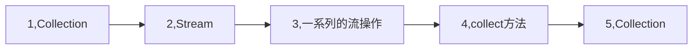

# java8的流(Stream)操作

## 函数式接口与lambda表达式

函数式接口(Functional Interface)就是一个有且仅有一个抽象方法，但是可以有多个非抽象方法的接口。

函数式接口可以被隐式转换为 lambda 表达式。

Lambda 表达式和方法引用（实际上也可认为是Lambda表达式）上。

[参考[Java 8 函数式接口]](https://www.runoob.com/java/java8-functional-interfaces.html)

这里只是抛转引玉,本篇文章主要让讲解stream的使用.还有许多如,内循环\外循环, 中间操作\终端操作等基础知识并未涉及.建议大家外部补充相关知识.

## Stream操作

### 集合

有了基础以后,还要有一个集合,该集合使用了<java8实战>中的菜谱.然后我们根据这个集合来演示java8中的Stream操作.

```java
    public static List<Dish> menu = Arrays.asList(
            new Dish("pork", false, 800, Type.MEAT),
            new Dish("beef", false, 700, Type.MEAT),
            new Dish("chicken", false, 400, Type.MEAT),
            new Dish("french fries", true, 530, Type.OHTER),
            new Dish("rice", true, 350, Type.OHTER),
            new Dish("season fruit", true, 120, Type.OHTER),
            new Dish("pizza", true, 550, Type.OHTER),
            new Dish("prawna", false, 300, Type.FISH),
            new Dish("salmon", false, 450, Type.FISH)
    );
```

Dish对象定义如下代码:

```java
private static class Dish {
    private final String name;
    private final boolean vegetarian;
    private final int calories;
    private final Type type;


    public Dish(String name, boolean vegetarian, int calories, Type type) {
        this.name = name;
        this.vegetarian = vegetarian;
        this.calories = calories;
        this.type = type;
    }

    public String getName() {
        return name;
    }

    public boolean isVegetarian() {
        return vegetarian;
    }

    public int getCalories() {
        return calories;
    }

    public Type getType() {
        return type;
    }

    @Override
    public String toString() {
        return "Dish{" +
                "name='" + name + '\'' +
                ", vegetarian=" + vegetarian +
                ", calories=" + calories +
                ", type=" + type +
                '}';
    }
}
```

在正式开始前先了解一下流(Stream)操作的流程:



1-2集合(Collection)通过stream()或parallelStream()方法装换为一个流(Stream).

2-3,通过流(Stream)提供的API做一系列的流操作

3-4-5,经过流操作以后通过收集器(collect方法)将流转换为集合(Collection)

这些过程在后面的每个例子中都会经历一遍.

----

### 筛选和切片

**filter**操作会接受一个谓词作为参数,并返回一个包括所有符合谓词元素的流.

```java
// filter 方法筛选出符合条件的元素,collect方法转换为新的集合
List<Dish> vegetarianMenu = menu.stream() 	// 集合转换为流
        .filter(Dish::isVegetarian)					// 流操作
        .collect(Collectors.toList());			// 通过收集器转换为集合

vegetarianMenu.forEach(dish -> System.out.println(dish.getName()));
```

执行结果:
french fries
rice
season fruit
pizza

----

**distinct**返回一个元素各异(根据流所生成元素的hashCode和equals方法实现)的流.

```java
List<Integer> numbers = Arrays.asList(1, 2, 1, 3, 3, 2, 4);

numbers.stream()
        .filter(i -> i % 2 == 0)  // 获取偶数
        .distinct()// 去除重复
        .forEach(System.out::println);
```

执行结果:

2
4

-----

**limit**方法返回一个不超过给定长度的流.所需长度作为参数传递给limit.
如果流是有序的,则会返回前n个元素.
会短路即获取到足够的limit值后流不在继续内循环

```java
List<Dish> dishes = menu.stream()
        .filter(d -> d.getCalories() > 300)
        .limit(3)
        .collect(Collectors.toList());

dishes.forEach(dish -> System.out.println(dish));
```

执行结果:

Dish{name='pork', vegetarian=false, calories=800, type=MEAT}
Dish{name='beef', vegetarian=false, calories=700, type=MEAT}
Dish{name='chicken', vegetarian=false, calories=400, type=MEAT}

----

**skip**方法,跳过元素,返回一个 扔掉前n个元素的流.如果流中元素不足n个,则返回一个空流.
limit和skip是互补的.

```java
List<Dish> dishes = menu.stream()
        .filter(d -> d.getCalories() > 300)
        .skip(2)
        .collect(Collectors.toList());
dishes.forEach(dish -> System.out.println(dish));
```

执行结果:

Dish{name='chicken', vegetarian=false, calories=400, type=MEAT}
Dish{name='french fries', vegetarian=true, calories=530, type=OHTER}
Dish{name='rice', vegetarian=true, calories=350, type=OHTER}
Dish{name='pizza', vegetarian=true, calories=550, type=OHTER}
Dish{name='salmon', vegetarian=false, calories=450, type=FISH}

---

### 映射

**map**方法,接受一个函数作为参数.这个函数会被应用到每个元素上,并将其映射成一个新的元素映射和转换类似,映射结果是创建一个新的版本,而不是去修改.

```java
List<String> dishNames = menu.stream()
        .map(Dish::getName)
        .collect(Collectors.toList());

dishNames.forEach(s -> System.out.println(s));
```

执行结果:

pork
beef
chicken
french fries
rice
season fruit
pizza
prawna
salmon

从代码可以看出map方法把List<Dish> 集合使用Dish::getName 字段转换成了List<String>. map就是转换.下面一段代码尝试使用dish对象内的数据将List<Dish>转换为List<Value>

Value类的定义:

```java
public class Value {
    String key;

    int number;


    public Value(String key, int number) {
        this.key = key;
        this.number = number;
    }

    public String getKey() {
        return key;
    }

    public void setKey(String key) {
        this.key = key;
    }

    public int getNumber() {
        return number;
    }

    public void setNumber(int number) {
        this.number = number;
    }

    @Override
    public String toString() {
        return "Value{" +
                "key='" + key + '\'' +
                ", number=" + number +
                '}';
    }
}
```

转换代码:

```java
List<Value> dishValueList = menu.stream()
        .map(dish -> new Value(dish.getName(), dish.getCalories()))
        .collect(Collectors.toList());

dishValueList.forEach(value -> System.out.println(value));
```

执行结果:

Value{key='pork', number=800}
Value{key='beef', number=700}
Value{key='chicken', number=400}
Value{key='french fries', number=530}
Value{key='rice', number=350}
Value{key='season fruit', number=120}
Value{key='pizza', number=550}
Value{key='prawna', number=300}
Value{key='salmon', number=450}

使用List元素的属性进行转换:

```java
List<String> words = Arrays.asList("Java 8", "Lambdas", "In", "Action");
List<Integer> wordLengths = words.stream()
        .map(String::length)
        .collect(Collectors.toList());

wordLengths.forEach(integer -> System.out.println(integer));
```

执行结果:

6
7
2
6

使用map方法实现给定数字列表返回列表数的平方构成的列表

```java
List<Integer> numbers = Arrays.asList(1, 2, 3, 4, 5);

List<Integer> squares = numbers.stream()
        .map(n -> n * n)
        .collect(Collectors.toList());

squares.forEach(s -> System.out.println(s));
```

### 流的扁平化flatMap方法

```java
List<String> words = Arrays.asList("Hello", "World");

List<String[]> list = words.stream()
        .map(word -> word.split(""))
        .distinct()
        .collect(Collectors.toList());
list.forEach(s -> System.out.println(s.length));
```

执行结果:

5
5

上面的代码本意是想获取words集合中的不重复的字母.所以在map方法中使用word.split("")转换成["H","e","l","l","o","W","o","r","l","d"]的形式,在使用distinct方法进行去重.但是使用map方法实际会将集合转换为[["H","e","l","l","o"],["W","o","r","l","d"]]这样个二维数组的形式.这显然是不对的.这种情况应该使用**flatMap**方法将转换后的多个流,合并成为一个如下面代码:

```java
List<String> words = Arrays.asList("Hello", "World");
List<String> list = words.stream()
        .map(w -> w.split(""))
        .flatMap(Arrays::stream)
        .distinct()
        .collect(Collectors.toList());

list.forEach(s -> System.out.println(s));
```

执行结果:

H
e
l
o
W
r
d

这样就得到了我们想要的结果.

### 查找和匹配

**anyMatch**方法可以回答"流中是否有一个元素能匹配给定的谓词"

```java
if (menu.stream().anyMatch(Dish::isVegetarian)) {
    System.out.println("存在素食");
}
```

----

**allMatch**方法看流中的元素是否都能匹配给定的谓词.

```java
if (menu.stream().allMatch(dish -> dish.getCalories() < 1000)) {
    System.out.println("所有都满足");
}
```

-----

**noneMatch**方法看流中没有任何元素与给定的谓词匹配.

```java
if (menu.stream().noneMatch(d -> d.getCalories() >= 1000)) {
    System.out.println("所有都不满足");
}
```

---

**findAny**方法将返回当前流中的任意元素.它可以与其他流操作结合使用.该方法的返回值为Optional<T>,Optional<T> 类是一个容器类.代表一个值存在或不存在.java8的库设计人员引入了Optional<T>,这样就不用返回众所周知容易出问题的null.

```java
Optional<Dish> dish = menu.stream()
        .filter(Dish::isVegetarian)
        .findAny();
/**
 * Optional<T> 类是一个容器类.代表一个值存在或不存在.
 * java8的库设计人员引入了Optional<T>,这样就不用返回众所周知容易出问题的null.
 */

// 在Optinal包含值的时候返回true,否则返回false
if (dish.isPresent()) {
    // 会再存在值的时候执行给定的代码块.
    dish.ifPresent(dish1 -> System.out.println(dish));

    Dish dish2 = dish.get(); // 值存在时返回值.否则抛出NoSuchElement异常
    System.out.println(dish2);
    // 会在值存在时返回值,否则返回一个默认值.
    Dish dish3 = dish.orElse(new Dish("pork2", false, 800, Type.MEAT));
    System.out.println(dish3);
}
```

----

**findFirst**方法找到流中第一个符合条件的元素

```java
List<Integer> someNumbers = Arrays.asList(1, 2, 3, 4, 5);
Optional<Integer> firstSquareDivis = someNumbers.stream()
        .map(x -> x * x)
        .filter(x -> x % 3 == 0)
        .findFirst();

firstSquareDivis.ifPresent(integer -> System.out.println(integer));
```

### 归约

需要将流中所有元素反复结合起来,得到一个值.这样的查询可以被归类为归约操作.用函数式编程的术语来说,这称为折叠(fold).

----

**reduce**操作是,反复使用Lambda表达式,直到流被归约成一个值.

```java
List<Integer> numbers = Arrays.asList(1, 2, 3, 4, 5);
//reduce方法的参数0为初始值.反复调用a + b, a为上次调用的和,直到流被归约成一个值.
//调用值依次为:0+1,1+2,3+3,6+4,10+5 最终结果为15
int sum = numbers.stream().reduce(0, (a, b) -> a + b);
int sum2 = numbers.stream().reduce(0, Integer::sum);
// reduce还有一个重载变体,它不接收初始值,但是会返回一个Optional对象
Optional<Integer> sum3 = numbers.stream().reduce((a, b) -> (a + b));


System.out.println("1:" + sum);
System.out.println("2:" + sum2);
System.out.println("3:" + sum3.get());
sum3.ifPresent(System.out::println);
```

输出结果:

1:15
2:15
3:15
15

**reduce**操作 的另外示例:

```java
List<Integer> numbers = Arrays.asList(1, 2, 3, 4, 5);

Optional<Integer> max = numbers.stream().reduce(Integer::max);
Optional<Integer> min = numbers.stream().reduce(Integer::min);
// 用map和reduce数一数流中有多少菜
int count = menu.stream()
        .map(d -> 1)
        .reduce(0, (a, b) -> a + b);

max.ifPresent(integer -> System.out.println("max:" + max.get()));
min.ifPresent(integer -> System.out.println("min:" + min.get()));

System.out.println("count:" + count);
```

归约方法的优势与并行化:

==相比于java8流操作之前的逐步迭代求和,使用reduce的好处在于,这里的迭代被内部迭代抽象掉了,这让内实现得以选择并行执行reduce操作.而迭代求和要并行需要更新共享变量.如果加入了同步,很可能线程竞争抵消了并行本应带来的性能提升.这种计算的并行化需要将输入分块,分块求和,最后在合并起来.但是使用fork/join方法代码结构就会复杂很多==

另外还需要注意隐含的装箱拆箱操作.对于大集合的内部迭代会有较大的性能损耗.如下面代码:

```
int calories = menu.stream()
        .map(Dish::getCalories)
        .reduce(0, Integer::sum);
System.out.println(calories);
// 上面代码暗含装箱的执行成本,每个Integer都必须拆箱成一个原始类型再进行求和.
```

### 原始类型流特化

Java 8 引入了三个原始类型特化流接口来解决拆箱问题: **IntStream,DoubleStream,LongStream**,分别将流中的元素特化为int,double,long,从而避免了暗含的装箱成本.每个接口都带来了进行常用数值归约的新方法,比如对数值流求和的sum,找到最大元素的max.

将流转换为特化版本的常用方法是mapToInt,mapToDouble,mapToLong,它们和map的使用方法一样但是返回的是一个特化流.

对于三种原始流特化,也分别有一个Optional原始类型特化版本: OptionalInt,OptionalDouble,OptionalLong

```java
int calories = menu.stream()
        .mapToInt(Dish::getCalories)
        .sum();

System.out.println("mapToInt:" + calories);

// 转换回对象流
IntStream intStream = menu.stream()
        .mapToInt(Dish::getCalories);
// 将数值流转换为对象流
Stream<Integer> stream = intStream.boxed();
stream.collect(Collectors.toList()).forEach(System.out::println);

// 对于三种原始流特化,也分别有一个Optional原始类型特化版本:
// OptionalInt,OptionalDouble,OptionalLong
OptionalInt optionalInt = menu.stream()
        .mapToInt(Dish::getCalories)
        .max();

System.out.println(optionalInt.getAsInt());
```


#### 数值范围流

Java8 引入了两个可以用于IntStream和LongStream的静态方法,帮助生成数值范围流:**range和rangeClosed**.这两个方法都是第一个参数接受起始值,第二个参数接受结束值.

```java
IntStream evenNumbers = IntStream.rangeClosed(1, 100)
        .filter(n -> n % 2 == 0);

IntStream evenNumbers1 = IntStream.range(1, 100)
        .filter(n -> n % 2 == 0);

//range不包含结尾数, rangeClosed包含结束数
System.out.println(evenNumbers.count());
System.out.println(evenNumbers1.count());
```

执行结果:

50
49

----

### 构建流

可以根据值序列\数组\文件\生成函数来创建流.

```java
// 由值创建流:使用静态方法Stream.of,通过显示值创建一个流.可以接受任意数量参数.
Stream<String> stream = Stream.of("Java 8", "Lambdas", "In ", "Action");
stream.map(String::toUpperCase)
        .forEach(System.out::println);
System.out.println("------------------------");
// 由数组创建流:使用静态方法Arrays.stream从数组创建一个流.
int[] numbers = {2, 3, 5, 7, 11, 13};
int sum = Arrays.stream(numbers).sum();
System.out.println("Arrays.stream:" + sum);
System.out.println("------------------------");
// 由文件生成流
/**
 * Java中用于处理文件等I/O操作的NIO API (非阻塞 I/O)已更新.以便利用Stream API.
 * java.nio.file.Files 中很多静态方法都会返回一个流.
 */

// 使用Files.lines获得一个流,每个元素都文件中的一行.
long uniqueWords = 0;
try (Stream<String> lines = Files.lines(Paths.get("/Users/wenbin/log/awk/awk_copy.log"), Charset.defaultCharset())) {
    // 文件中有多少不重复的单词
    uniqueWords = lines
            .flatMap(line -> Arrays.stream(line.split(" ")))
            .distinct()
            .count();
} catch (IOException e) {
    e.printStackTrace();
}

System.out.println("awk_copy.log:" + uniqueWords);

/**
 * 由函数生成流:创建无限流
 * Stream API 提供了两个静态方法来从函数生成流: Stream.iterate和Stream.generate
 * 这两个操作可以创建无限流:
 * 无限流: 不像从固定集合创建流那样有固定大小的流.由iterate和generate产生的流会用给定
 * 的函数按需创建值,因此可以无穷无尽的计算下去.一般来说应该使用limit限制这种流.
 * 这是流和集合之间关键区别
 */

// iterate方法接受一个初始值,还有一个依次应用在每个产生的新值上的Lambda
Stream.iterate(0, n -> n + 2)
        .limit(10)
        .forEach(System.out::println);

System.out.println("------------------------");

// generate方法接受一个Supplier<T>类型的Lambda提供新的值
Stream.generate(Math::random)
        .limit(5)
        .forEach(System.out::println);

System.out.println("------------------------");
```

执行结果:

```verilog
JAVA 8
LAMBDAS
IN 
ACTION
------------------------
Arrays.stream:41
------------------------
awk_copy.log:16
0
2
4
6
8
10
12
14
16
18
------------------------
0.8565669350197561
0.8727689393789019
0.3207719067839073
0.30793989863248017
0.9282829688607843
------------------------
```

----


