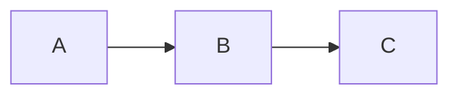
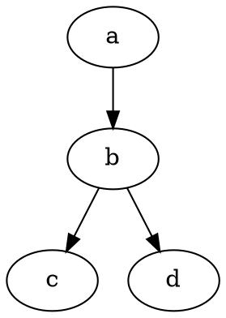
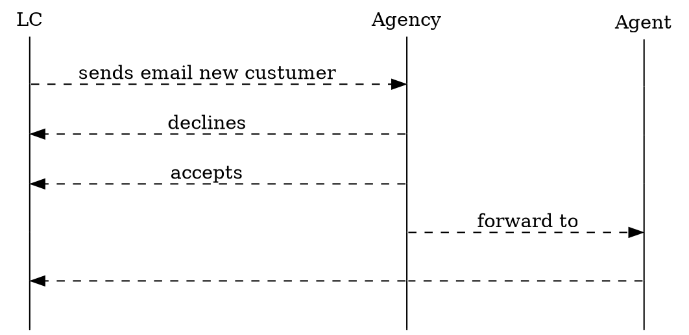

1. 标题

在行首插入 1 到 6个#，分别表示标题 1 到标题 6


# 这是标题1
## 这是标题1
###### 这是标题6
点击保存后的效果：

标题1

标题2

标题6

2. 有序列表

在行首增加 1.、2.、3.，即数字和英文句点, 注意句点与文字中间有空格。不要求数字一定要连续，可以都是1.


1. 有序列表
1. 有序列表
4. 有序列表
点击保存后的效果：

有序列表
有序列表
有序列表
3. 无序列表

在行首增加 * 或 - 与文字之间有空格


* 无序列表
* 无序列表
点击保存后的效果：

无序列表
无序列表
4. 插入图片

可直接粘贴图片，或将图片文件拖动到光标处。

也可以使用标准的Markdown语法，如：
 

5. 插入链接

[描述](链接地址) ，例如：[为知笔记](http://www.wiz.cn)，注意要使用英文符号
点击保存后的效果：
为知笔记

6. 粗体、斜体、删除线

粗体：在文字前后添加 ** (注意符号与文字间不要有空格）
斜体：在文字前后添加 *
删除线：在文字前后添加 ~~

**粗体**
*斜体*
~~删除线~~
保存后的效果：

粗体
斜体
删除线

7. 引用

在文字前 添加 >

点击保存后的效果：

如果你无法简洁的表达你的想法，那只说明你还不够了解它。 -- 阿尔伯特·爱因斯坦

8. 表格

| 为知笔记|更新 | 版本 |
|------------|-----------|--------|
| WizNote | Markdown| Latest |
点击保存后的效果：

为知笔记	更新	版本
WizNote	Markdown	Latest
9. 代码

在代码前后增加 三个反单引号：```


```java
int i = 0; i = 1;
for (int i = 0; i < 100; i++)
{
      System.out.print("hello markdown!\n");
}
```
保存后的效果：


如果需要指定语言， 在开头的``` 后紧跟具体语言，如: ```java

10. 目录

在任何你想要展示Markdown 笔记目录的地方，添加 [TOC] ， 在阅读模式下，标题1~6样式的内容会被提取出来作为目录，相当于大纲功能。

例如：

[TOC]

###Markdown 是什么

####Markdown 的好处

点击保存后的效果：


11. Mathjax 公式

可以创建行内公式，例如：$\Gamma(n) = (n-1)!\quad\forall n\in\mathbb N$
或者块级公式，
$$ x = \dfrac{-b \pm \sqrt{b^2 - 4ac}}{2a} $$
点击保存后的效果：


12. 流程图
 mermaid

GraphViz


时序图


Ditaa
```ditaa {cmd=true args=["-E"]}
  +--------+   +-------+    +-------+
  |        | --+ ditaa +--> |       |
  |  Text  |   +-------+    |diagram|
  |Document|   |!magic!|    |       |
  |     {d}|   |       |    |       |
  +---+----+   +-------+    +-------+
      :                         ^
      |       Lots of work      |
      +-------------------------+
  ```
