# Netty-组件

## Bootstrap-引导

​		引导类的层次结构包括一个抽象的父类和两个具体的引导子类，如图所示。

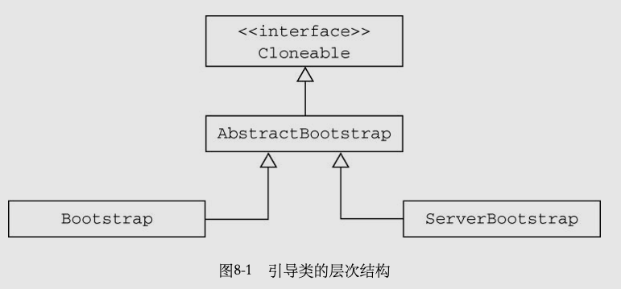

​		服务器致力于使用一个父Channel来接受来自客户端的连接，并创建子Channel以用于它们之间的通信；而客户端将最可能只需要一个单独的、没有父Channel的Channel来用于所有的网络交互。

​		两种应用程序类型之间通用的引导步骤由AbstractBootstrap处理，而特定于客户端或者服务器的引导步骤则分别由Bootstrap或ServerBootstrap处理。

**Bootstrap的API:**

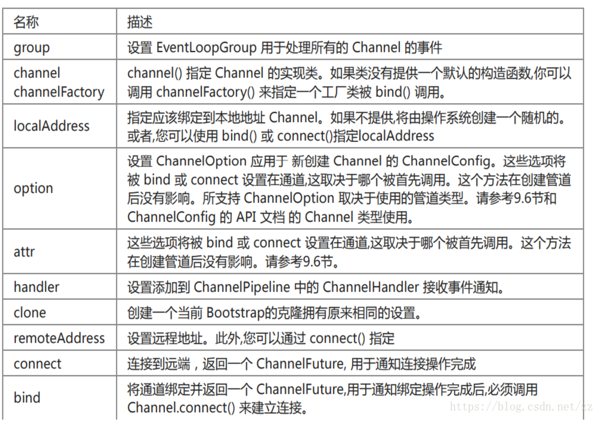


## Channel-通道

### 介绍

​		基本的I/O操作（bind()、connect()、read()和write()）依赖于底层网络传输所提供的原语。在基于Java的网络编程中，其基本的构造是Socket。Netty的Channel接口所提供的API，降低了直接使用Socket类的复杂性。此外，Channel也是拥有许多预定义的、专门化实现的广泛类层次结构的根，

下面是一个简短的部分清单：

- EmbeddedChannel；
- LocalServerChannel；
- NioDatagramChannel；
- NioSctpChannel；
- NioSocketChannel。


每个Channel都将会被分配一个ChannelPipeline和ChannelConfig。

- ChannelConfig包含了该Channel的所有配置设置，并且支持热更新。由于特定的传输可能具有独特的设置，所以它可能会实现一个ChannelConfig的子类型。

- **ChannelPipeline持有所有将应用于入站和出站数据以及事件的ChannelHandler实例**，这些ChannelHandler实现了应用程序用于处理状态变化以及数据处理的逻辑。

  

​		Channel是独一无二的，所以为了保证顺序将Channel声明为java.lang.Comparable的一个子接口。如果两个不同的Channel实例都返回了相同的散列码，那么AbstractChannel中的compareTo()方法的实现将会抛出一个Error。

### 常用方法

| 方法名            | 描述                                                         |
| ----------------- | ------------------------------------------------------------ |
| eventLoop         | 返回分配给Channel的EventLoop                                 |
| pipeline          | 返回分配给Channel的ChannelPipeline                           |
| isActive          | 如果Channel是活动的,则返回true.活动的意义可能依赖于底层的传输.例如,一个Socket传输一旦连接到了远程节点便是活动的,而一个Datagram传输一旦打开便是活跃的. |
| localAddress      | 返回本地的SocketAddress                                      |
| remoteAddress     | 返回远程的SocketAddress                                      |
| **write**         | 将数据写到远程节点.这个数据将被传递给ChannelPipeline,并且排队直到被冲刷 |
| flush             | 将之前已写的数据冲刷到底层传输,如一个Socket                  |
| **writeAndFlush** | 等同于调用write()并借着调用flush().                          |

### 内置Channel实现

| 名称     | 包                          | 描述                                                         |
| -------- | --------------------------- | ------------------------------------------------------------ |
| NIO      | io.netty.channel.socket.nio | 使用java.io.channels包作为基础,基于选择器方式的同步非阻塞IO模型. |
| Epoll    | Io.netty.channel.epoll      | 有JNI驱动的epoll()非阻塞IO.这个Channel支持只有在Linux上可用的多种特性,比NIO更快. |
| OIO      | io.netty.channel.socket.oio | 使用java.net包作为基础-使用阻塞IO                            |
| Local    | io.netty.channel.local      | 可以在JVM内部通过管道进行通信的本地传输                      |
| Embedded | io.netty.channel.embedded   | EmbeddedChannel,允许使用ChannelHandler而又不需要一个真正的基于网络的传输.通常用来支撑单元测试. |

#### NIO-同步非阻塞I/O

选择器返回的事件类型:

| 名称       | 描述                                                         |
| ---------- | ------------------------------------------------------------ |
| OP_ACCEPT  | 在接受新连接并创建Channel时获得通知.                         |
| OP_CONNECT | 在建立一个连接时获得通知                                     |
| OP_READ    | 数据已经就绪,可以从Channel中读取时获得通知.                  |
| OP_WRITE   | 可以向Channel中写更多数据时获得通知.这处理了套接字缓冲区呗完全填满时的情况,这种情况通常发生在数据发送速度比远程节点的处理速度更快的时候. |

封装处理了如下图java原生NIO的API的处理流程:


#### Epoll-Linux的本地非阻塞I/O

​		Netty的NIO传输基于Java提供的异步/非阻塞网络编程的通用抽象。虽然这保证了Netty的非阻塞API可以在任何平台上使用，但它也包含了相应的限制，因为**JDK为了在所有系统上提供相同的功能，必须做出妥协。**

​		Linux作为高性能网络编程的平台，其重要性与日俱增，这催生了大量先进特性的开发，其中包括**epoll——一个高度可扩展的I/O事件通知特性**。这个API自Linux内核版本2.5.44（2002）被引入，提供了**比旧的POSIXselect和poll系统调用[3]更好的性能**，同时现在也是***Linux上非阻塞网络编程的事实标准。***Linux JDK NIO API使用了这些epoll调用。

​		Netty为Linux提供了一组NIO API，以一种和它本身的设计更加一致的方式使用epoll，并且以一种更加轻量的方式使用中断。**如果你的应用程序旨在运行于Linux系统，那么请考虑利用这个版本的Channel；你将发现在高负载下它的性能要优于JDK的NIO实现。**

#### OIO-阻塞I/O

​		Netty是如何能够使用用于异步传输相同的API来支持OIO的呢。答案就是，Netty利用了SO_TIMEOUT这个Socket标志，它指定了等待一个I/O操作完成的最大毫秒数。如果操作在指定的时间间隔内没有完成，则将会抛出一个SocketTimeoutException。Netty将捕获这个异常并继续处理循环。在EventLoop下一次运行时，它将再次尝试。这实际上也是类似于Netty这样的异步框架能够支持OIO的唯一方式。

逻辑图:


#### Local-Jvm内部通信的Channel

​		Netty提供了一个Local传输，用于在同一个JVM中运行的客户端和服务器程序之间的异步通信。同样，这个传输也支持对于所有Netty传输实现都共同的API。

​		在这个传输中，和服务器Channel相关联的SocketAddress并没有绑定物理网络地址；相反，只要服务器还在运行，它就会被存储在注册表里，并在Channel关闭时注销。因为这个传输并不接受真正的网络流量，所以它并不能够和其他传输实现进行互操作。因此，**客户端希望连接到（在同一个JVM中）使用了这个传输的服务器端时也必须使用它。**除了这个限制，它的使用方式和其他的传输一模一样。

- #### Embedded-单元测试


​	特殊的Channel实现——**EmbeddedChannel**，它是**Netty专门为改进针对ChannelHandler的单元测试而提供的。**

### 支持的协议


### NioSocketChannel的源码分析

​		在Bootstrap中获取NioSocketChannel的实例时通过反射获取的.所以我们从NioSocketChannel的无参构造方法开始分析:

io.netty.channel.socket.nio.NioSocketChannel#NioSocketChannel()

```java
public NioSocketChannel() {
  	// DEFAULT_SELECTOR_PROVIDER是获取原生select实例的引用
    this(DEFAULT_SELECTOR_PROVIDER);
}
```

io.netty.channel.socket.nio.NioSocketChannel#NioSocketChannel(java.nio.channels.SocketChannel)

```java
public NioSocketChannel(SelectorProvider provider) {
  	// newSocket方法通过原生API获取一个socket实例
    this(newSocket(provider));
}
```

io.netty.channel.socket.nio.NioSocketChannel#NioSocketChannel(java.nio.channels.SocketChannel)

```java
public NioSocketChannel(SocketChannel socket) {
    this(null, socket);
}
```

io.netty.channel.socket.nio.NioSocketChannel#NioSocketChannel(io.netty.channel.Channel, java.nio.channels.SocketChannel)

```java
public NioSocketChannel(Channel parent, SocketChannel socket) {
    super(parent, socket);
    config = new NioSocketChannelConfig(this, socket.socket());
}
```

io.netty.channel.nio.AbstractNioByteChannel#AbstractNioByteChannel

```java
protected AbstractNioByteChannel(Channel parent, SelectableChannel ch) {
  	// SelectionKey.OP_READ原生API获取读事件状态
    super(parent, ch, SelectionKey.OP_READ);
}
```

io.netty.channel.nio.AbstractNioChannel#AbstractNioChannel

```java
protected AbstractNioChannel(Channel parent, SelectableChannel ch, int readInterestOp) {
    super(parent);
  	// 保存socket通道
    this.ch = ch;
  	// 保存读事件状态
    this.readInterestOp = readInterestOp;
    try {
      	// 设置socket通过为非阻塞
        ch.configureBlocking(false);
    } catch (IOException e) {
        try {
            ch.close();
        } catch (IOException e2) {
            if (logger.isWarnEnabled()) {
                logger.warn(
                        "Failed to close a partially initialized socket.", e2);
            }
        }

        throw new ChannelException("Failed to enter non-blocking mode.", e);
    }
}
```

io.netty.channel.AbstractChannel#AbstractChannel(io.netty.channel.Channel)

```java
protected AbstractChannel(Channel parent) {
    this.parent = parent;
  	// 保存一个通道ID
    id = newId();
  	// 保存一个NioByteUnsafe的引用
    unsafe = newUnsafe();
  	// 保存pipeline的引用,这里我们继续往下看.在事件触发,和通道注册时都会用到.
    pipeline = newChannelPipeline();
}
```


io.netty.channel.DefaultChannelPipeline

```java
protected DefaultChannelPipeline newChannelPipeline() {
    return new DefaultChannelPipeline(this);
}
```

io.netty.channel.DefaultChannelPipeline#DefaultChannelPipeline

```java
protected DefaultChannelPipeline(Channel channel) {
    this.channel = ObjectUtil.checkNotNull(channel, "channel");
    succeededFuture = new SucceededChannelFuture(channel, null);
    voidPromise =  new VoidChannelPromise(channel, true);
		// 实例化一个结尾的context
    tail = new TailContext(this);
  	// 实例化一个开头的context
    head = new HeadContext(this);

    head.next = tail;
    tail.prev = head;
}
```


## EventLoop-线程模型

EventLoop用于处理Channel的I/O和事件,EventLoop包含在EventLoopGroup中。


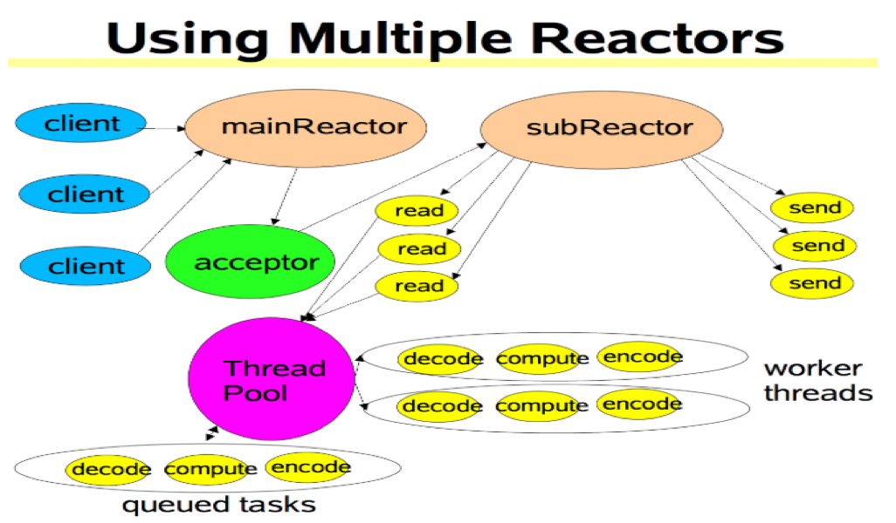

#### 异步传输

​		异步传输实现只使用了少量的EventLoop（以及和它们相关联的Thread），而且在当前的线程模型中，它们可能会被多个Channel所共享。这使得可以通过尽可能少量的Thread来支撑大量的Channel，而不是每个Channel分配一个Thread。

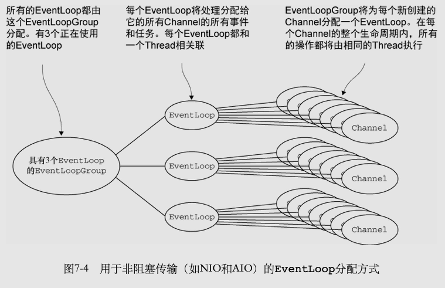

​		

​		上图表示了:

​		一个EventLoopGroup，它具有3个固定大小的EventLoop（每个EventLoop都由一个Thread支撑）。在创建EventLoopGroup时就直接分配了EventLoop（以及支撑它们的Thread），以确保在需要时它们是可用的。


#### 阻塞传输

​		在OIO(阻塞I/O)中每一个Channel都将被分配给一个EventLoop（以及它的Thread）。

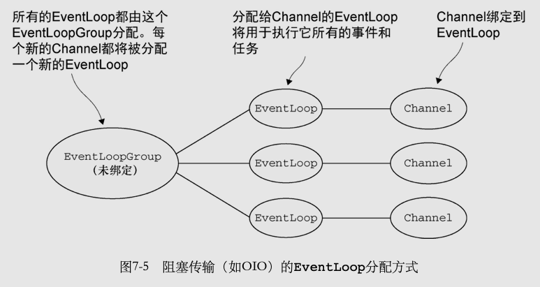


#### NioEventLoopGroup加载,代码解读:

​		io.netty.channel.nio.NioEventLoopGroup#NioEventLoopGroup()无参构造函数:

```java
public NioEventLoopGroup() {
    this(0);
}
```

​		io.netty.channel.nio.NioEventLoopGroup#NioEventLoopGroup(int)

```java
public NioEventLoopGroup(int nThreads) {
    this(nThreads, (Executor) null);
}
```

​		io.netty.channel.nio.NioEventLoopGroup#NioEventLoopGroup(int, java.util.concurrent.Executor)

```java
public NioEventLoopGroup(int nThreads, Executor executor) {
    this(nThreads, executor, SelectorProvider.provider());
}
```

​		io.netty.channel.nio.NioEventLoopGroup#NioEventLoopGroup(int, java.util.concurrent.Executor, java.nio.channels.spi.SelectorProvider)

```java
public NioEventLoopGroup(
        int nThreads, Executor executor, final SelectorProvider selectorProvider) {
    this(nThreads, executor, selectorProvider, DefaultSelectStrategyFactory.INSTANCE);
}
```

​		io.netty.channel.nio.NioEventLoopGroup#NioEventLoopGroup(int, java.util.concurrent.Executor, java.nio.channels.spi.SelectorProvider, io.netty.channel.SelectStrategyFactory)

```java
public NioEventLoopGroup(int nThreads, Executor executor, final SelectorProvider selectorProvider, final SelectStrategyFactory selectStrategyFactory) {
  	// 这里调用父类MultithreadEventLoopGroup的构造方法
    super(nThreads, executor, selectorProvider, selectStrategyFactory, RejectedExecutionHandlers.reject());
}
```

​		io.netty.channel.MultithreadEventLoopGroup#MultithreadEventLoopGroup(int, java.util.concurrent.Executor, java.lang.Object...)

```java
protected MultithreadEventLoopGroup(int nThreads, Executor executor, Object... args) {
  	// 这里DEFAULT_EVENT_LOOP_THREADS默认加载cup核心数*2的线程
    super(nThreads == 0 ? DEFAULT_EVENT_LOOP_THREADS : nThreads, executor, args);
}
```

​		io.netty.util.concurrent.MultithreadEventExecutorGroup#MultithreadEventExecutorGroup(int, java.util.concurrent.Executor, java.lang.Object...)

```java
protected MultithreadEventExecutorGroup(int nThreads, Executor executor, Object... args) {
    this(nThreads, executor, DefaultEventExecutorChooserFactory.INSTANCE, args);
}
```

​		io.netty.util.concurrent.MultithreadEventExecutorGroup#MultithreadEventExecutorGroup(int, java.util.concurrent.Executor, io.netty.util.concurrent.EventExecutorChooserFactory, java.lang.Object...)

​	

```java
protected MultithreadEventExecutorGroup(int nThreads, Executor executor,
                                        EventExecutorChooserFactory chooserFactory, Object... args) {
    if (nThreads <= 0) {
        throw new IllegalArgumentException(String.format("nThreads: %d (expected: > 0)", nThreads));
    }

    if (executor == null) {
      	// z
        executor = new ThreadPerTaskExecutor(newDefaultThreadFactory());
    }
		// 实例化一个存储线程的数组
    children = new EventExecutor[nThreads];

    for (int i = 0; i < nThreads; i ++) {
        boolean success = false;
        try {
          	// 具体线程实例化
          	// 该方法并未实际启动每个线程.实际线程启动在注册Channel时发生.这里直初始化EventLoop
            children[i] = newChild(executor, args);
            success = true;
        } catch (Exception e) {
            // TODO: Think about if this is a good exception type
            throw new IllegalStateException("failed to create a child event loop", e);
        } finally {
            if (!success) {
                for (int j = 0; j < i; j ++) {
                    children[j].shutdownGracefully();
                }

                for (int j = 0; j < i; j ++) {
                    EventExecutor e = children[j];
                    try {
                        while (!e.isTerminated()) {
                            e.awaitTermination(Integer.MAX_VALUE, TimeUnit.SECONDS);
                        }
                    } catch (InterruptedException interrupted) {
                        // Let the caller handle the interruption.
                        Thread.currentThread().interrupt();
                        break;
                    }
                }
            }
        }
    }

  	// 将初始化完成的线程组放入线程选择工厂里
  	// 这里面事项了两种线程选择方法,
  	// 如果线程数是2的幂,使用二进制&操作来分配线程
  	// 如果不是2的幂,则使用%来分配线程
    chooser = chooserFactory.newChooser(children);

    final FutureListener<Object> terminationListener = new FutureListener<Object>() {
        @Override
        public void operationComplete(Future<Object> future) throws Exception {
            if (terminatedChildren.incrementAndGet() == children.length) {
                terminationFuture.setSuccess(null);
            }
        }
    };

    for (EventExecutor e: children) {
        e.terminationFuture().addListener(terminationListener);
    }

    Set<EventExecutor> childrenSet = new LinkedHashSet<EventExecutor>(children.length);
    Collections.addAll(childrenSet, children);
    readonlyChildren = Collections.unmodifiableSet(childrenSet);
}
```

​		io.netty.channel.nio.NioEventLoopGroup#newChild

```java
@Override
protected EventLoop newChild(Executor executor, Object... args) throws Exception {
    return new NioEventLoop(this, executor, (SelectorProvider) args[0],
        ((SelectStrategyFactory) args[1]).newSelectStrategy(), (RejectedExecutionHandler) args[2]);
}
```

​		io.netty.channel.nio.NioEventLoop#NioEventLoop

```java
NioEventLoop(NioEventLoopGroup parent, Executor executor, SelectorProvider selectorProvider,
             SelectStrategy strategy, RejectedExecutionHandler rejectedExecutionHandler) {
  	// 调用父类SingleThreadEventLoop构造函数
    super(parent, executor, false, DEFAULT_MAX_PENDING_TASKS, rejectedExecutionHandler);
    if (selectorProvider == null) {
        throw new NullPointerException("selectorProvider");
    }
    if (strategy == null) {
        throw new NullPointerException("selectStrategy");
    }
  	// NIO中打开select()的引用
    provider = selectorProvider;
  	// 打开select()
    final SelectorTuple selectorTuple = openSelector();
  	// 保存原生select对象引用
    selector = selectorTuple.selector;
    unwrappedSelector = selectorTuple.unwrappedSelector;
  	// 保存选择器策略工厂引用
    selectStrategy = strategy;
}
```

​		继续查看父类实例化的源码:

​		io.netty.channel.SingleThreadEventLoop#SingleThreadEventLoop(io.netty.channel.EventLoopGroup, java.util.concurrent.Executor, boolean, int, io.netty.util.concurrent.RejectedExecutionHandler)

```java
protected SingleThreadEventLoop(EventLoopGroup parent, Executor executor,
                                boolean addTaskWakesUp, int maxPendingTasks,
                                RejectedExecutionHandler rejectedExecutionHandler) {
    super(parent, executor, addTaskWakesUp, maxPendingTasks, rejectedExecutionHandler);
    tailTasks = newTaskQueue(maxPendingTasks);
}
```

​		io.netty.util.concurrent.SingleThreadEventExecutor#SingleThreadEventExecutor(io.netty.util.concurrent.EventExecutorGroup, java.util.concurrent.Executor, boolean, int, io.netty.util.concurrent.RejectedExecutionHandler)

```java
protected SingleThreadEventExecutor(EventExecutorGroup parent, Executor executor,
                                    boolean addTaskWakesUp, int maxPendingTasks,
                                    RejectedExecutionHandler rejectedHandler) {
    super(parent);
    this.addTaskWakesUp = addTaskWakesUp;
    this.maxPendingTasks = Math.max(16, maxPendingTasks);
    this.executor = ObjectUtil.checkNotNull(executor, "executor");
  	// 实例化任务处理队列
    taskQueue = newTaskQueue(this.maxPendingTasks);
    rejectedExecutionHandler = ObjectUtil.checkNotNull(rejectedHandler, "rejectedHandler");
}
```

io.netty.util.concurrent.AbstractScheduledEventExecutor#AbstractScheduledEventExecutor(io.netty.util.concurrent.EventExecutorGroup)

```java
protected AbstractScheduledEventExecutor(EventExecutorGroup parent) {
    super(parent);
}
```

io.netty.util.concurrent.AbstractEventExecutor#AbstractEventExecutor(io.netty.util.concurrent.EventExecutorGroup)

```java
protected AbstractEventExecutor(EventExecutorGroup parent) {
    this.parent = parent;
}
```

​		到这里线程初始化完成.主要完成的工作:

1. 在NioEventLoopGroup构造中确定了:
   1. 线程的分配方式工厂
   2. 线程数
   3. 选择器策略工厂(DefaultSelectStrategyFactory)
2. 在MultithreadEventExecutorGroup根据线程数
   1. 实例化NioEventLoop
   2. 确认连接接入的线程分配方法
3. NioEventLoop实例化中主要保存了:
   1. 原生Nio的selectorProvider
   2. 已经打开的select引用
   3. 把原生select封装成了SelectorTuple
   4. 线程需要处理的任务队列(taskQueue)


#### NioEventLoop代码解读:

​		在上面的源码跟踪中我们可以看到.NioEventLoopGroup只是初始化了一个数组封装的线程池.线程池内具体的线程并未具体启动,下面我们根据客户端连接时的场景跟踪源码看看NioEventLoopGroup内的NioEventLoop在什么时候被run起来的.

源码的入口:

```java
public void start() throws InterruptedException {
        EventLoopGroup group = new NioEventLoopGroup();

        try {
            Bootstrap bootstrap = new Bootstrap();
//            OioSocketChannel  BIO

            bootstrap.group(group)
                    .channel(NioSocketChannel.class)
                    .remoteAddress(new InetSocketAddress(host, port))
                    .handler(new ChannelInitializer<SocketChannel>() {
                        @Override
                        protected void initChannel(SocketChannel socketChannel) throws Exception {
                            socketChannel.pipeline().addLast(new EchoClientHandler());
                        }
                    });
						// 从这里的connet方法进入
            ChannelFuture f = bootstrap.connect().sync();
            f.channel().closeFuture().sync();
        } finally {
            group.shutdownGracefully().sync();
        }
    }
```

​		io.netty.bootstrap.Bootstrap#connect()

```java
public ChannelFuture connect() {
    validate();
    SocketAddress remoteAddress = this.remoteAddress;
    if (remoteAddress == null) {
        throw new IllegalStateException("remoteAddress not set");
    }
		// 这里继续往下看
    return doResolveAndConnect(remoteAddress, config.localAddress());
}
```

​		io.netty.bootstrap.Bootstrap#doResolveAndConnect

```java
private ChannelFuture doResolveAndConnect(final SocketAddress remoteAddress, final SocketAddress localAddress) {
  	// 初始化并且注册Channel
    final ChannelFuture regFuture = initAndRegister();
    final Channel channel = regFuture.channel();

    if (regFuture.isDone()) {
        if (!regFuture.isSuccess()) {
            return regFuture;
        }
        return doResolveAndConnect0(channel, remoteAddress, localAddress, channel.newPromise());
    } else {
        // Registration future is almost always fulfilled already, but just in case it's not.
        final PendingRegistrationPromise promise = new PendingRegistrationPromise(channel);
        regFuture.addListener(new ChannelFutureListener() {
            @Override
            public void operationComplete(ChannelFuture future) throws Exception {
                // Directly obtain the cause and do a null check so we only need one volatile read in case of a
                // failure.
                Throwable cause = future.cause();
                if (cause != null) {
                    // Registration on the EventLoop failed so fail the ChannelPromise directly to not cause an
                    // IllegalStateException once we try to access the EventLoop of the Channel.
                    promise.setFailure(cause);
                } else {
                    // Registration was successful, so set the correct executor to use.
                    // See https://github.com/netty/netty/issues/2586
                    promise.registered();
                  	// 在这里通过异步实际绑定
                    doResolveAndConnect0(channel, remoteAddress, localAddress, promise);
                }
            }
        });
        return promise;
    }
}
```

​		io.netty.bootstrap.AbstractBootstrap#initAndRegister

```java
inal ChannelFuture initAndRegister() {
    Channel channel = null;
    try {
        // 实例化NioSocketChannel
        channel = channelFactory.newChannel();
        // 加载pipeline等,Channel相关属性
        init(channel);
    } catch (Throwable t) {
        if (channel != null) {
            // channel can be null if newChannel crashed (eg SocketException("too many open files"))
            channel.unsafe().closeForcibly();
            // as the Channel is not registered yet we need to force the usage of the GlobalEventExecutor
            return new DefaultChannelPromise(channel, GlobalEventExecutor.INSTANCE).setFailure(t);
        }
        // as the Channel is not registered yet we need to force the usage of the GlobalEventExecutor
        return new DefaultChannelPromise(new FailedChannel(), GlobalEventExecutor.INSTANCE).setFailure(t);
    }
		// 从这里继续看
  	// 这里group()方法会MultithreadEventLoopGroup的register方法,该方法会根据线程分配策略分配线程
    ChannelFuture regFuture = config().group().register(channel);
    if (regFuture.cause() != null) {
        if (channel.isRegistered()) {
            channel.close();
        } else {
            channel.unsafe().closeForcibly();
        }
    }

    // If we are here and the promise is not failed, it's one of the following cases:
    // 1) If we attempted registration from the event loop, the registration has been completed at this point.
    //    i.e. It's safe to attempt bind() or connect() now because the channel has been registered.
    // 2) If we attempted registration from the other thread, the registration request has been successfully
    //    added to the event loop's task queue for later execution.
    //    i.e. It's safe to attempt bind() or connect() now:
    //         because bind() or connect() will be executed *after* the scheduled registration task is executed
    //         because register(), bind(), and connect() are all bound to the same thread.

    return regFuture;
}
```

io.netty.bootstrap.Bootstrap#init,这个方法将bootstrap中配置的Pipeline加载列加入到的pipeline队列中.后续在Pipeline中分析p.addLast方法以及Pipeline的数据结构.

```java
void init(Channel channel) throws Exception {
    ChannelPipeline p = channel.pipeline();
    p.addLast(config.handler());

    final Map<ChannelOption<?>, Object> options = options0();
    synchronized (options) {
        setChannelOptions(channel, options, logger);
    }

    final Map<AttributeKey<?>, Object> attrs = attrs0();
    synchronized (attrs) {
        for (Entry<AttributeKey<?>, Object> e: attrs.entrySet()) {
            channel.attr((AttributeKey<Object>) e.getKey()).set(e.getValue());
        }
    }
}
```


现在继续回到initAndRegister()方法中,我们看:ChannelFuture regFuture = config().group().register(channel);

io.netty.channel.SingleThreadEventLoop#register(io.netty.channel.Channel)

```java
@Override
public ChannelFuture register(Channel channel) {
    return register(new DefaultChannelPromise(channel, this));
}
```

io.netty.channel.SingleThreadEventLoop#register(io.netty.channel.ChannelPromise)

```java
@Override
public ChannelFuture register(final ChannelPromise promise) {
    ObjectUtil.checkNotNull(promise, "promise");
    // 这里开始通过Channel的unsafe方法注册连接通道
    promise.channel().unsafe().register(this, promise);
    return promise;
}
```

io.netty.channel.AbstractChannel.AbstractUnsafe#register

```java
@Override
public final void register(EventLoop eventLoop, final ChannelPromise promise) {
    if (eventLoop == null) {
        throw new NullPointerException("eventLoop");
    }
    if (isRegistered()) {
        promise.setFailure(new IllegalStateException("registered to an event loop already"));
        return;
    }
    if (!isCompatible(eventLoop)) {
        promise.setFailure(
                new IllegalStateException("incompatible event loop type: " + eventLoop.getClass().getName()));
        return;
    }

    AbstractChannel.this.eventLoop = eventLoop;
		// 这里判断当前线程是否是分配给这个Channel的线程.如果是则可以直接执行.
  	// netty里Channel对应的事件只能是注册时分配的线程执行.
  	// 在这里当前Channel并未分配过NioEventLoopGroup中的线程.所以这个判断不成立会走else
    if (eventLoop.inEventLoop()) {
        register0(promise);
    } else {
        try {
          	// 我们这里应为是分析EventLoop线程执行所以先看register0方法.呆会就不回头看了.
            eventLoop.execute(new Runnable() {
                @Override
                public void run() {
                  	// register0方法会被异步执行. 这里会去传播注册事件/NIO的读事件
                  	//这里就是我们实际上要去做的事情被封装成一个Runnable,由eventLoop.execute执行
                    register0(promise);
                }
            });
        } catch (Throwable t) {
            logger.warn(
                    "Force-closing a channel whose registration task was not accepted by an event loop: {}",
                    AbstractChannel.this, t);
            closeForcibly();
            closeFuture.setClosed();
            safeSetFailure(promise, t);
        }
    }
}
```


io.netty.channel.AbstractChannel.AbstractUnsafe#register0

```java
private void register0(ChannelPromise promise) {
    try {
        // check if the channel is still open as it could be closed in the mean time when the register
        // call was outside of the eventLoop
        if (!promise.setUncancellable() || !ensureOpen(promise)) {
            return;
        }
        boolean firstRegistration = neverRegistered;
        // 这里会通过socket.register方法注册一个0的事件
        doRegister();
        neverRegistered = false;
        registered = true;

        // Ensure we call handlerAdded(...) before we actually notify the promise. This is needed as the
        // user may already fire events through the pipeline in the ChannelFutureListener.
        // 这里会调用pipeline中所有handler的handlerAdded方法
        pipeline.invokeHandlerAddedIfNeeded();

        safeSetSuccess(promise);
      	// 这里从head开始传播注册事件
      	// 调用ChannelInitializer#channelRegistered
      	// 在该方法内会调用Bootstrap中配置initChannel()方法将pipeline加载进去
        pipeline.fireChannelRegistered();
        // Only fire a channelActive if the channel has never been registered. This prevents firing
        // multiple channel actives if the channel is deregistered and re-registered.
        if (isActive()) {
            if (firstRegistration) {
              	// 这里传播连接事件
                pipeline.fireChannelActive();
            } else if (config().isAutoRead()) {
                // This channel was registered before and autoRead() is set. This means we need to begin read
                // again so that we process inbound data.
                //
                // See https://github.com/netty/netty/issues/4805
              	// 这里实际注册读事件
                beginRead();
            }
        }
    } catch (Throwable t) {
        // Close the channel directly to avoid FD leak.
        closeForcibly();
        closeFuture.setClosed();
        safeSetFailure(promise, t);
    }
}
```

这里就是我们实际上要去做的事情被封装成一个Runnable,由eventLoop.execute执行,我们看看execute方法是如何启动线程的:

io.netty.util.concurrent.SingleThreadEventExecutor#execute

```java
@Override
public void execute(Runnable task) {
    if (task == null) {
        throw new NullPointerException("task");
    }

  	// 当前线程为main线程,所以值应该为false
    boolean inEventLoop = inEventLoop();
    if (inEventLoop) {
        addTask(task);
    } else {
      	// 启动线程
        startThread();
      	// 将需要执行的task放入线程待执行队列.当前场景,也就是register0
        addTask(task);
        if (isShutdown() && removeTask(task)) {
            reject();
        }
    }

    if (!addTaskWakesUp && wakesUpForTask(task)) {
        wakeup(inEventLoop);
    }
}
```

先看startThread,然后在分析addTask.

io.netty.util.concurrent.SingleThreadEventExecutor#startThread

```java
private void startThread() {
  	// 判断改线程状态,是否启动过
    if (state == ST_NOT_STARTED) {
      	// 没启动过通过CAS把状态改成已启动
        if (STATE_UPDATER.compareAndSet(this, ST_NOT_STARTED, ST_STARTED)) {
            try {
              	// 启动线程,从这里继续看
                doStartThread();
            } catch (Throwable cause) {
                STATE_UPDATER.set(this, ST_NOT_STARTED);
                PlatformDependent.throwException(cause);
            }
        }
    }
}
```

​		io.netty.util.concurrent.SingleThreadEventExecutor#doStartThread

```java
private void doStartThread() {
    assert thread == null;
  	// 这里调用ThreadPerTaskExecutor的execute方法
    executor.execute(new Runnable() {
        @Override
        public void run() {
            thread = Thread.currentThread();
            if (interrupted) {
                thread.interrupt();
            }

            boolean success = false;
            updateLastExecutionTime();
            try {
              	// 这里调用NioEventLoop的run方法
                SingleThreadEventExecutor.this.run();
                success = true;
            } catch (Throwable t) {
                logger.warn("Unexpected exception from an event executor: ", t);
            } finally {
                for (;;) {
                    int oldState = state;
                    if (oldState >= ST_SHUTTING_DOWN || STATE_UPDATER.compareAndSet(
                            SingleThreadEventExecutor.this, oldState, ST_SHUTTING_DOWN)) {
                        break;
                    }
                }

                // Check if confirmShutdown() was called at the end of the loop.
                if (success && gracefulShutdownStartTime == 0) {
                    logger.error("Buggy " + EventExecutor.class.getSimpleName() + " implementation; " +
                            SingleThreadEventExecutor.class.getSimpleName() + ".confirmShutdown() must be called " +
                            "before run() implementation terminates.");
                }

                try {
                    // Run all remaining tasks and shutdown hooks.
                    for (;;) {
                        if (confirmShutdown()) {
                            break;
                        }
                    }
                } finally {
                    try {
                        cleanup();
                    } finally {
                        STATE_UPDATER.set(SingleThreadEventExecutor.this, ST_TERMINATED);
                        threadLock.release();
                        if (!taskQueue.isEmpty()) {
                            logger.warn(
                                    "An event executor terminated with " +
                                            "non-empty task queue (" + taskQueue.size() + ')');
                        }

                        terminationFuture.setSuccess(null);
                    }
                }
            }
        }
    });
}
```

io.netty.util.concurrent.ThreadPerTaskExecutor#execute 

```java
@Override
public void execute(Runnable command) {
  	// 在这里线程呗启动,command在当前就是doStartThread方法中的匿名Runnable
    threadFactory.newThread(command).start();
}
```

我们继续看SingleThreadEventExecutor.this.run();方法. 实际调用NioEventLoop的run方法

```java
@Override
protected void run() {
  	// 自旋一直处理
    for (;;) {
        try {
						// 在这里使用在NioEventLoopGroup初始化时加载的select策略
            switch (selectStrategy.calculateStrategy(selectNowSupplier, hasTasks())) {
                case SelectStrategy.CONTINUE:
                    continue;
               
                case SelectStrategy.SELECT:
                    select(wakenUp.getAndSet(false));

                    // 'wakenUp.compareAndSet(false, true)' is always evaluated
                    // before calling 'selector.wakeup()' to reduce the wake-up
                    // overhead. (Selector.wakeup() is an expensive operation.)
                    //
                    // However, there is a race condition in this approach.
                    // The race condition is triggered when 'wakenUp' is set to
                    // true too early.
                    //
                    // 'wakenUp' is set to true too early if:
                    // 1) Selector is waken up between 'wakenUp.set(false)' and
                    //    'selector.select(...)'. (BAD)
                    // 2) Selector is waken up between 'selector.select(...)' and
                    //    'if (wakenUp.get()) { ... }'. (OK)
                    //
                    // In the first case, 'wakenUp' is set to true and the
                    // following 'selector.select(...)' will wake up immediately.
                    // Until 'wakenUp' is set to false again in the next round,
                    // 'wakenUp.compareAndSet(false, true)' will fail, and therefore
                    // any attempt to wake up the Selector will fail, too, causing
                    // the following 'selector.select(...)' call to block
                    // unnecessarily.
                    //
                    // To fix this problem, we wake up the selector again if wakenUp
                    // is true immediately after selector.select(...).
                    // It is inefficient in that it wakes up the selector for both
                    // the first case (BAD - wake-up required) and the second case
                    // (OK - no wake-up required).

                    if (wakenUp.get()) {
                        selector.wakeup();
                    }
                    // fall through
                default:
            }

            cancelledKeys = 0;
            needsToSelectAgain = false;
          	// 这里获得处理任务,和处理时间的比率.这个数默认为50%
            final int ioRatio = this.ioRatio;
            if (ioRatio == 100) {
                try {
                  	// 处理远程NIO时间
                    processSelectedKeys();
                } finally {
                    // Ensure we always run tasks.
                  	// 处理所有线程待执行队列里的task
                    runAllTasks();
                }
            } else {
                final long ioStartTime = System.nanoTime();
                try {
                  	// 这里处理了原生NIO的事件
                    processSelectedKeys();
                } finally {
                    // Ensure we always run tasks.
                  	// 这里计算处理了多久的原生NIO.
                    final long ioTime = System.nanoTime() - ioStartTime;
                  	// 使用ioTime的50%的时间处理线程待执行队列的task
                    runAllTasks(ioTime * (100 - ioRatio) / ioRatio);
                }
            }
        } catch (Throwable t) {
            handleLoopException(t);
        }
        // Always handle shutdown even if the loop processing threw an exception.
        try {
            if (isShuttingDown()) {
                closeAll();
                if (confirmShutdown()) {
                    return;
                }
            }
        } catch (Throwable t) {
            handleLoopException(t);
        }
    }
}
```

NioEventLoop线程启动就到这里了.  processSelectedKeys()方法中NIO 原生事件的处理在ChannelHandler和ChannelPipeline的时间触发中分析


## ChannelHandle和ChannelPipeline

在ChannelPipeline中将ChannelHandler链接在一起以组织处理逻辑。我们将会研究涉及这些类的各种用例，以及一个重要的关系——ChannelHandlerContext。

### ChannelHandle

#### Channel的生命周期

​	Interface Channel定义了一组和ChannelInboundHandlerAPI密切相关的简单但功能强大的状态模型，下表列出了Channel的这4个状态。

| 状态                | 描述                                                         |
| ------------------- | ------------------------------------------------------------ |
| ChannelUnregistered | Channel已经被创建,但还未注册到EventLoop                      |
| ChannelRegistered   | Channel已经被注册到了EventLoop                               |
| ChannelActive       | Channel处于活动状态(已经连接到 它的远程节点).它现在可以接受和发送数据了. |
| ChannelInactive     | Channel没有连接到远程节点                                    |

生命周期变化:


​		Channel的状态发生改变时，将会生成对应的事件。这些事件将会被转发给ChannelPipeline中的ChannelHandler，其可以随后对它们做出响应。


#### ChannelHandler的生命周期

​		interface ChannelHandler定义的生命周期操作，**在ChannelHandler被添加到ChannelPipeline中或者被从ChannelPipeline中移除时会调用这些操作。这些方法中的每一个都接受一个ChannelHandlerContext参数。**

生命周期方法:

| 类型            | 描述                                               |
| --------------- | -------------------------------------------------- |
| handlerAdded    | 当把ChannelHandler添加到ChannelPipeline中时被调用. |
| handlerRemoved  | 当把ChannelHandler移除ChannelHandler时被调用       |
| exceptionCaught | 当处理过程中在ChannelPipeline中有错误产生时被调用  |

​		Netty定义了下面两个重要的ChannelHandler子接口：

1. ChannelInboundHandler——处理入站数据以及各种状态变化；
2. ChannelOutboundHandler——处理出站数据并且允许拦截所有的操作。


#### ChannelInboundHandler接口

​		ChannelInboundHandler接口处理入站事件和入站数据，提供的事件方法如下表:

| 类型                      | 描述                                                         |
| ------------------------- | ------------------------------------------------------------ |
| channelRegistered         | 当Channel已经注册到它的EventLoop并且能够处理I/O时被调用.     |
| channelUnregistered       | 当Channel从它的EventLoop注销并且无法处理任何I/O时被调用.     |
| channelActive             | 当Channel处于活动状态时被调用;Channel已经连接/绑定并且已经就绪. |
| channelInactive           | 当Channel离开活动状态并且不在连接它的远程节点时被调用.       |
| channelReadComplete       | 当Channel上的一个读操作完成时被调用.(当所有可读的字节都已经从Channel中读取之后,将会调用该回调方法;所以,在该方法被调用之前可以看到多次调用channelRead()方法) |
| channelRead               | 当从channel读取数据时被调用.                                 |
| channelWritabilityChanged | 当Channel的可写状态发生改变时被调用.用户可以确保写操作不会完成得太快(避免发生OutOfMemoryError)或者可以在Channel变为再次可写时回复写入.可以通过调用Channel的isWritable()方法来检测Channel的可写性.与可写性相关的阈值可以通过channel.config().setWriteHighWaterMark()和Channel.config().setWriteLowWaterMark()方法来设置. |
| userEventTriggered        | 当ChannelnboundHandler.fireUserEventTriggered()方法被调用时被调用，因为一个POJO被传经了ChannelPipeline |

​		这些方法将会**在数据被接收时或者与其对应的Channel状态发生改变时被调用**。这些方法和Channel的生命周期密切相关。

解释上表中的几个方法，帮助理解与学习:

1. channelReadComplete ----- Channel一次读操作完成时被触发，开始准备切换为写操作。Channel是一个数据载体，既可以写入数据，又可以读取数据。所以存在读操作和写操作切换。
2. channelWritabilityChanged ----- 帮助用户控制写操作速度，以避免发生OOM异常。通过Channel.config().setWriteHighWaterMark()设置发送数据的高水位。
3. userEventTriggered ----- 用户事件触发。Netty提供心跳机制中使用，请参考netty-private-protocol开发子项目
4.  userEventTriggered ----- 实现用户自定义事件，完成ChannelPipeline动态编排效果的实现。请参考另一个子项目中动态编排ChannelHandler案例: [博客地址](https://blog.csdn.net/thinking_fioa/article/details/81840259)

```java
public interface ChannelInboundHandler extends ChannelHandler {

    /**
     * 当Channel已经注册到它的EventLoop并且能够处理I/O时被调用.
     */
    void channelRegistered(ChannelHandlerContext ctx) throws Exception;

    /**
     * 当Channel从它的EventLoop注销并且无法处理任何I/O时被调用.
     */
    void channelUnregistered(ChannelHandlerContext ctx) throws Exception;

    /**
     * 当Channel处于活动状态时被调用;Channel已经连接/绑定并且已经就绪.
     */
    void channelActive(ChannelHandlerContext ctx) throws Exception;

    /**
     * 当Channel离开活动状态并且不在连接它的远程节点时被调用.
     * 
     */
    void channelInactive(ChannelHandlerContext ctx) throws Exception;

    /**
     * 当从channel读取数据时被调用.
     */
    void channelRead(ChannelHandlerContext ctx, Object msg) throws Exception;

    /**
     * 当Channel上的一个读操作完成时被调用.(当所有可读的字节都已经从Channel中读取之后,将会调用该回调方法;所以,在该方法被调用之前可以看到多次调用channelRead()方法)
     * {@link ChannelHandlerContext#read()} is called.
     */
    void channelReadComplete(ChannelHandlerContext ctx) throws Exception;

    /**
     * 当ChannelnboundHandler.fireUserEventTriggered()方法被调用时被调用，因为一个POJO被传经了ChannelPipeline
     */
    void userEventTriggered(ChannelHandlerContext ctx, Object evt) throws Exception;

    /**
     * 当Channel的可写状态发生改变时被调用.用户可以确保写操作不会完成得太快(避免发生OutOfMemoryError)或者可以在Channel变为再次可写时回复写入.可以通过调用Channel的isWritable()方法来检测Channel的可写性.与可写性相关的阈值可以通过channel.config().setWriteHighWaterMark()和Channel.config().setWriteLowWaterMark()方法来设置.
     */
    void channelWritabilityChanged(ChannelHandlerContext ctx) throws Exception;

    /**
     * Gets called if a {@link Throwable} was thrown.
     */
    @Override
    @SuppressWarnings("deprecation")
    void exceptionCaught(ChannelHandlerContext ctx, Throwable cause) throws Exception;
}
```


#### ChannelOutboundHandler接口

​		出站数据和事件将由ChannelOutboundHandler处理。ChannelOutboundHandler大部分方法都需要一个ChannelPromise参数，以便在操作完成时得到通知。

​		ChannelPromise是ChannelFuture的一个子类，使用setSuccess()和setFailure()方法告知操作结果。ChannelPromise设置结果后，将变成不可修改对象。

​		ChannelOutboundHandler的一个强大的功能是可以按需推迟操作或者事件，这使得可以通过一些复杂的方法来处理请求。例如，如果到远程节点的写入被暂停了，那么你可以推迟冲刷操作并在稍后继续。

提供的时间方法如:

```java
public interface ChannelOutboundHandler extends ChannelHandler {
    /**
     * Called once a bind operation is made.
     * 当请求将Channel绑定到本地地址时被调用
     * @param ctx           the {@link ChannelHandlerContext} for which the bind operation is made
     * @param localAddress  the {@link SocketAddress} to which it should bound
     * @param promise       the {@link ChannelPromise} to notify once the operation completes
     * @throws Exception    thrown if an error accour
     */
    void bind(ChannelHandlerContext ctx, SocketAddress localAddress, ChannelPromise promise) throws Exception;

    /**
     * Called once a connect operation is made.
     * 当请求将Channel连接到远程节点时被调用
     * @param ctx               the {@link ChannelHandlerContext} for which the connect operation is made
     * @param remoteAddress     the {@link SocketAddress} to which it should connect
     * @param localAddress      the {@link SocketAddress} which is used as source on connect
     * @param promise           the {@link ChannelPromise} to notify once the operation completes
     * @throws Exception        thrown if an error accour
     */
    void connect(
            ChannelHandlerContext ctx, SocketAddress remoteAddress,
            SocketAddress localAddress, ChannelPromise promise) throws Exception;

    /**
     * Called once a disconnect operation is made.
     * 当请求将Channel从远程节点段开时被调用
     * @param ctx               the {@link ChannelHandlerContext} for which the disconnect operation is made
     * @param promise           the {@link ChannelPromise} to notify once the operation completes
     * @throws Exception        thrown if an error accour
     */
    void disconnect(ChannelHandlerContext ctx, ChannelPromise promise) throws Exception;

    /**
     * Called once a close operation is made.
     * 当请求关闭Channel时被调用
     * @param ctx               the {@link ChannelHandlerContext} for which the close operation is made
     * @param promise           the {@link ChannelPromise} to notify once the operation completes
     * @throws Exception        thrown if an error accour
     */
    void close(ChannelHandlerContext ctx, ChannelPromise promise) throws Exception;

    /**
     * Called once a deregister operation is made from the current registered {@link EventLoop}.
     * 当请求将Channel从它的EventLoop注销时调用
     * @param ctx               the {@link ChannelHandlerContext} for which the close operation is made
     * @param promise           the {@link ChannelPromise} to notify once the operation completes
     * @throws Exception        thrown if an error accour
     */
    void deregister(ChannelHandlerContext ctx, ChannelPromise promise) throws Exception;

    /**
     * 当请求从Channel读取更多的数据时被调用
     */
    void read(ChannelHandlerContext ctx) throws Exception;

    /**
    * Called once a write operation is made. The write operation will write the messages through the
     * {@link ChannelPipeline}. Those are then ready to be flushed to the actual {@link Channel} once
     * {@link Channel#flush()} is called
     * 当请求通过Channel将数据写到远程节点时被调用.
     * @param ctx               the {@link ChannelHandlerContext} for which the write operation is made
     * @param msg               the message to write
     * @param promise           the {@link ChannelPromise} to notify once the operation completes
     * @throws Exception        thrown if an error accour
     */
    void write(ChannelHandlerContext ctx, Object msg, ChannelPromise promise) throws Exception;

    /**
     * Called once a flush operation is made. The flush operation will try to flush out all previous written messages
     * that are pending.
     * 当请求通过Channel将入队数据冲刷到远程节点时被调用.
     * @param ctx               the {@link ChannelHandlerContext} for which the flush operation is made
     * @throws Exception        thrown if an error accour
     */
    void flush(ChannelHandlerContext ctx) throws Exception;
}
```


#### ChannelHandler适配器

​		简化了编写ChannelHandler.

​		需要实现ChannelHandler时**可以使用ChannelInboundHandlerAdapter和ChannelOutboundHandlerAdapter类作为自己的ChannelHandler的起始点。**这两个适配器分别提供了ChannelInboundHandler和ChannelOutboundHandler的基本实现。通过扩展抽象类ChannelHandlerAdapter，它们获得了它们共同的超接口ChannelHandler的方法。

类层次结构:

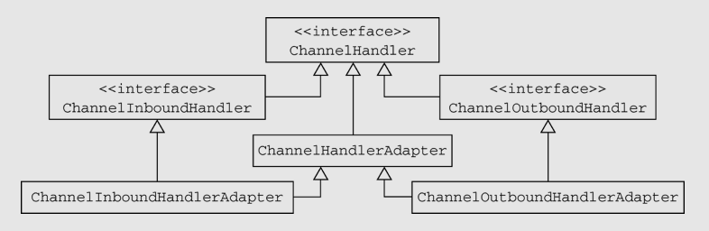


ChannelHandlerAdapter还提供了实用方法isSharable()。如果其对应的实现被标注为Sharable，那么这个方法将返回true，表示它可以被添加到多个ChannelPipeline中。


**在ChannelInboundHandlerAdapter和ChannelOutboundHandlerAdapter中**所提供的方法体调用了其相关联的ChannelHandlerContext上的等效方法，**从而将事件转发到了ChannelPipeline中的下一个ChannelHandler中。**

##### ChannelInboundHandlerAdapter和SimpleChannelInboundHandler

​		每一个Handler都一定会处理出站或者入站（也可能两者都处理）数据，例如对于入站的Handler可能会继承SimpleChannelInboundHandler或者ChannelInboundHandlerAdapter，而SimpleChannelInboundHandler又是继承于ChannelInboundHandlerAdapter，最大的区别在于SimpleChannelInboundHandler会对没有外界引用的资源进行一定的清理，并且入站的消息可以通过泛型来规定。**SimpleChannelInboundHandler如果处理里成功则不会继续在责任链中传播事件.**

### 资源管理

Netty使用的**ByteBuf采用的是引用计数机制来回收**。对于初学者非常容易造成资源泄漏。**Netty提供以下帮助定位资源泄漏代码。推荐使用Java系统属性设置方法: java -Dio.netty.leadDetectionLevel=ADVANCED**

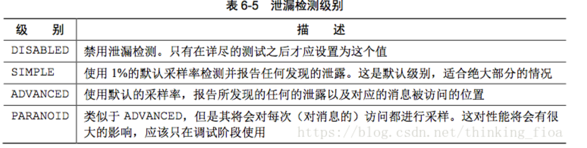

如何管理好资源:

想要管理好资源，避免资源浪费，请记住以下几点:

1. 三种ByteBuf(堆缓冲区、直接缓冲区和复合缓冲区)都采用的引用计数方式维护对象。所以都可能需要程序员参与管理资源。对于刚使用ByteBuf的程序员来说，存在误区：以为只有直接缓冲区才使用引用计数。
2. 如果当前ByteBuf被Channel调用write(...)或writeAndFlush(...)方法，则Netty会自动执行引用计数减1操作，释放该ByteBuf
3. 谁负责释放: 一般来说，是由最后访问(引用计数)对象的来负责释放该对象
4. 如果是SimpleChannelInboundHandler的子类，传入的参数msg，会被SimpleChannelInboundHandler自动释放一次

### ChannelPipeline

​		每一个新创建的Channel都将会被分配一个新的ChannelPipeline。这项关联是永久性的；Channel既不能附加另外一个ChannelPipeline，也不能分离其当前的。

##### 		Channel初始化后ChannelPipeline的数据结构:

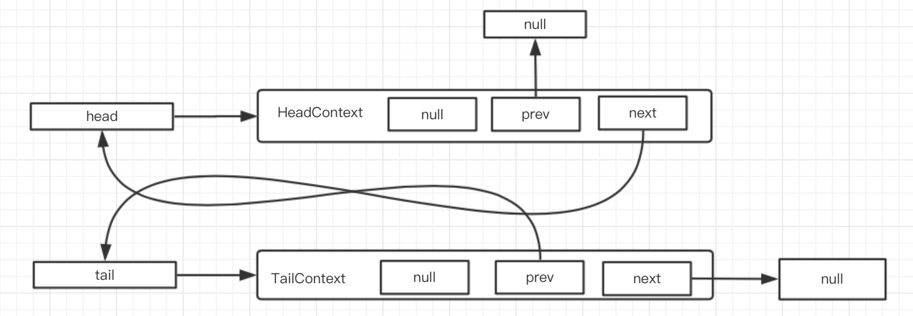

源码:

```java
protected DefaultChannelPipeline(Channel channel) {
    this.channel = ObjectUtil.checkNotNull(channel, "channel");
    succeededFuture = new SucceededChannelFuture(channel, null);
    voidPromise =  new VoidChannelPromise(channel, true);

    tail = new TailContext(this);
    head = new HeadContext(this);

    head.next = tail;
    tail.prev = head;
}
```

##### ChannelPipeline.addLast后的数据结构:

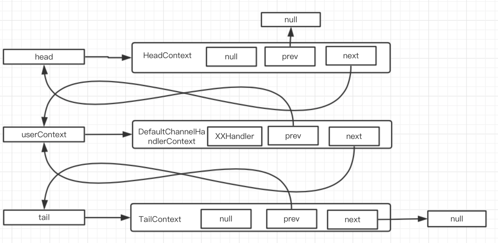

源码1,io.netty.channel.DefaultChannelPipeline#addLast(EventExecutorGroup, String, ChannelHandler):

```java
newCtx = newContext(group, filterName(name, handler), handler);

addLast0(newCtx);
```

源码2:

```java
private AbstractChannelHandlerContext newContext(EventExecutorGroup group, String name, ChannelHandler handler) {
    return new DefaultChannelHandlerContext(this, childExecutor(group), name, handler);
}
```

源码3:

```java
private void addLast0(AbstractChannelHandlerContext newCtx) {
    AbstractChannelHandlerContext prev = tail.prev;
    newCtx.prev = prev;
    newCtx.next = tail;
    prev.next = newCtx;
    tail.prev = newCtx;
}
```

​		

​		ChannelHandlerContext使得ChannelHandler能够和它的ChannelPipeline以及其他的ChannelHandler交互。ChannelHandler可以通知其所属的ChannelPipeline中的下一个ChannelHandler，甚至可以动态修改它所属的ChannelPipeline。ChannelHandlerContext具有丰富的用于处理事件和执行I/O操作的API。

##### 入站/出站

​		根据事件的起源，事件将会被ChannelInboundHandler或者ChannelOutboundHandler处理。随后，通过调用ChannelHandlerContext实现，它将被转发给同一超类型的下一个ChannelHandler。

​		如果一个入站事件被触发，它将被从ChannelPipeline的头部开始一直被传播到ChannelPipeline的尾端。，一个出站I/O事件将从ChannelPipeline的最右边开始，然后向左传播。

如下图:

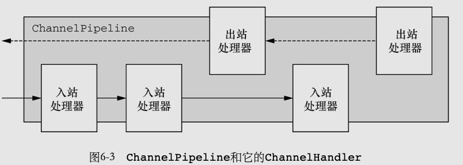


#### 修改ChannelPipeline

​		ChannelHandler可以通过添加、删除或者替换其他的ChannelHandler来实时地修改ChannelPipeline的布局。（它也可以将它自己从ChannelPipeline中移除。)

代码:

```java
public static void modifyPipeline() {
    ChannelPipeline pipeline = CHANNEL_PIPELINE_FROM_SOMEWHERE; // get reference to pipeline;
    FirstHandler firstHandler = new FirstHandler();
    pipeline.addLast("handler1", firstHandler);
    pipeline.addFirst("handler2", new SecondHandler());
    pipeline.addLast("handler3", new ThirdHandler());
    //...
    pipeline.remove("handler3");
    pipeline.remove(firstHandler);
    pipeline.replace("handler2", "handler4", new FourthHandler());

}
```


ChannelPipeline入站操作:

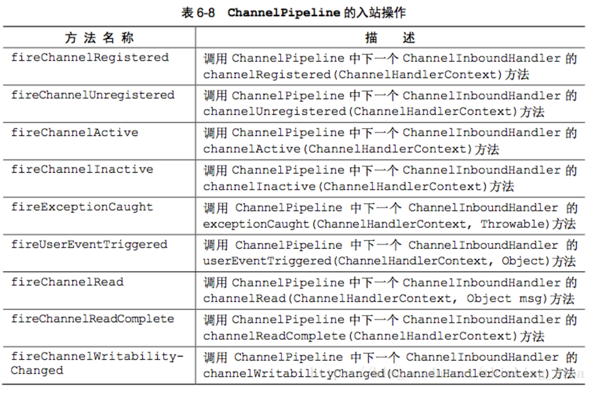

ChannelPipeline出站操作:

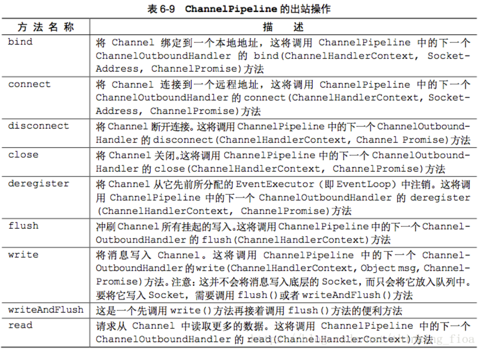


### ChannelHandlerContext

​		ChannelHandlerContext代表了ChannelHandler和ChannelPipeline之间的关联，每当有ChannelHandler添加到ChannelPipeline中时，都会创建ChannelHandlerContext。ChannelHandlerContext的主要功能是管理它所关联的ChannelHandler和在同一个ChannelPipeline中的其他ChannelHandler之间的交互。

​		ChannelHandlerContext有很多的方法，其中一些方法也存在于Channel和ChannelPipeline本身上，但是有一点重要的不同。如果调用Channel或者ChannelPipeline上的这些方法，它们将沿着整个ChannelPipeline进行传播。而调用位于ChannelHandlerContext上的相同方法，则将从当前所关联的ChannelHandler开始，并且只会传播给位于该ChannelPipeline中的下一个能够处理该事件的ChannelHandler。

注意点:

1. ChannelHandlerContext和ChannelHandler之间的关联是永远不变的，所以缓存对它的引用是安全的.
2. 相对于Channel和ChannelPipeline上的方法，ChannelHandlerContext的方法将产生更短的事件流所以性能也会更优秀。


#### 使用ChannelHandlerContext

下图充分说明了ChannelHandlerContext在ChannelPipeline充当的作用，我们可以从图中发现

1. 对于单个ChannelPipeline来看，ChannelHandlerContext和ChannelHandler的关联关系是1:1
2. ChannlePipeline中事件的传递，原来是依赖于ChannelHandlerContext实现的。
3. 图中AContext将事件(read)传递给BHandler，BContext再将事件(read)传递给了Chandler。
4. 如果想从特定的Handler传播事件，需要获取上一个ChannelHandlerContext。比如：希望事件从CHandler开始传播，跳过AHandler和BHandler，则获取到BContext即可。

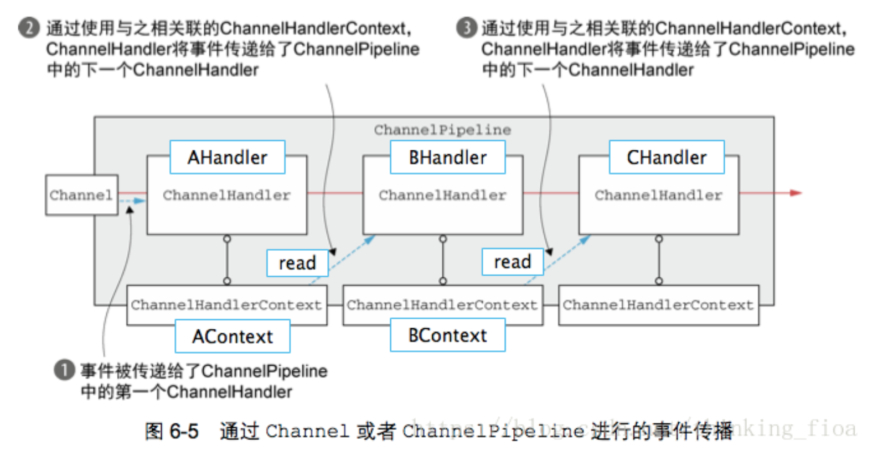


#### ChannelHandler和ChannelHandlerContext的高级用法

1.  ChannelHandler可以使用@Sharable注解标注，可以将一个ChannelHandler绑定到多个ChannelPipeline链中，也就绑定到多个ChannelhandlerContext。
2.  ChannelHandler使用@Sharable注解标注后。多个线程会访问同一个ChannelHandler，开发人员需要考虑多个线程操作同一个ChannelHandler实例，会不会存在同步互斥问题。

### 异常处理

​		Netty提供几种方式用于处理入站或者出站处理过程中所抛出的异常。

#### 处理入站异常

1.  入站事件发生异常时，从异常发生的ChannelHandler开始，沿着ChannelPipeline链向后传播。前面的ChannelHandler中的exceptionCaught(...)不会被执行。
2. 如果想处理入站异常，则需要重写方法exceptionCaught(...)
3.  建议在ChannelPipeline链的尾部，添加处理入站异常的ChannelHandler

#### 处理出站异常

1. 出站异常的处理与入站异常截然不同。出站异常通过异步通知机制实现:

2.  每个出站操作都将返回一个ChannelFuture。注册到ChannelFuture的ChannelFutureListener将在操作完成后通知调用方操作成功还是出错了
3.  几乎所有的ChannelOutboundHandler上的方法都会传入一个ChannelPromise的实例。ChannelPromise提供立即通知的可写方法:setSuccess()/setFailure(Throwable cause)，通知调用方操作完成结果。

### 源码解读-触发读事件

读事件举例:

io.netty.channel.nio.NioEventLoop#processSelectedKey(java.nio.channels.SelectionKey, io.netty.channel.nio.AbstractNioChannel) 方法处会监听NIO读事件:

```java
private void processSelectedKey(SelectionKey k, AbstractNioChannel ch) {
  // 通过Channel,获取NioUnsafe, AbstractNioByteChannel 继承了 AbstractNioChannel
  // 所以这里实际可以获得AbstractNioByteChannel的实例
  final AbstractNioChannel.NioUnsafe unsafe = ch.unsafe();
  if (!k.isValid()) {
    final EventLoop eventLoop;
    try {
      eventLoop = ch.eventLoop();
    } catch (Throwable ignored) {
      return;
    }
    if (eventLoop!= this || eventLoop == null) {
      return;
    }
    unsafe.close(unsafe.voidPromise());
    return;
  }
  try {
    int readyOps = k.readyOps();
    if ((readyOps & SelectionKey.OP_CONNECT) != 0) {
      int ops = k.interestOps();
      ops &= ~SelectionKey.OP_CONNECT;
      k.interestOps(ops);

      unsafe.finishConnect();
    }
    if ((readyOps & SelectionKey.OP_WRITE) != 0) {
      ch.unsafe().forceFlush();
    }
    // 判断是否是读事件
    if ((readyOps & (SelectionKey.OP_READ | SelectionKey.OP_ACCEPT)) != 0 || readyOps == 0) {
      // 处理读事件
      unsafe.read();
      if (!ch.isOpen()) {
        // Connection already closed - no need to handle write.
        return;
      }
    }
  } catch (CancelledKeyException ignored) {
    unsafe.close(unsafe.voidPromise());
  }
}
```

io.netty.channel.nio.AbstractNioByteChannel.NioByteUnsafe#read方法:

```java
@Override
    public final void read() {
        final ChannelConfig config = config();
      	// AbstractNioByteChannel,保存了pipeline的引用
        final ChannelPipeline pipeline = pipeline();
        final ByteBufAllocator allocator = config.getAllocator();
        final RecvByteBufAllocator.Handle allocHandle = recvBufAllocHandle();
        allocHandle.reset(config);

        ByteBuf byteBuf = null;
        boolean close = false;
        try {
            do {
                byteBuf = allocHandle.allocate(allocator);
                allocHandle.lastBytesRead(doReadBytes(byteBuf));
                if (allocHandle.lastBytesRead() <= 0) {
                    // nothing was read. release the buffer.
                    byteBuf.release();
                    byteBuf = null;
                    close = allocHandle.lastBytesRead() < 0;
                    break;
                }

                allocHandle.incMessagesRead(1);
                readPending = false;
                // 这里通过调用pipeline.fireChannelRead方法开启读事件处理链
                pipeline.fireChannelRead(byteBuf);
                byteBuf = null;
            } while (allocHandle.continueReading());

            allocHandle.readComplete();
            pipeline.fireChannelReadComplete();

            if (close) {
                closeOnRead(pipeline);
            }
        } catch (Throwable t) {
            handleReadException(pipeline, byteBuf, t, close, allocHandle);
        } finally {
            // Check if there is a readPending which was not processed yet.
            // This could be for two reasons:
            // * The user called Channel.read() or ChannelHandlerContext.read() in channelRead(...) method
            // * The user called Channel.read() or ChannelHandlerContext.read() in channelReadComplete(...) method
            //
            // See https://github.com/netty/netty/issues/2254
            if (!readPending && !config.isAutoRead()) {
                removeReadOp();
            }
        }
    }
}
```

io.netty.channel.DefaultChannelPipeline#fireChannelRead代码:

```java
@Override
public final ChannelPipeline fireChannelRead(Object msg) {
    // 调用AbstractChannelHandlerContext.invokeChannelRead静态方法,从head开始处理
    AbstractChannelHandlerContext.invokeChannelRead(head, msg);
    return this;
}
```

io.netty.channel.AbstractChannelHandlerContext#invokeChannelRead(io.netty.channel.AbstractChannelHandlerContext, java.lang.Object)代码:

```java
static void invokeChannelRead(final AbstractChannelHandlerContext next, Object msg) {
    final Object m = next.pipeline.touch(ObjectUtil.checkNotNull(msg, "msg"), next);
    EventExecutor executor = next.executor();
    if (executor.inEventLoop()) {
      	// 调用head的invokeChannelRead方法
        next.invokeChannelRead(m);
    } else {
        executor.execute(new Runnable() {
            @Override
            public void run() {
                next.invokeChannelRead(m);
            }
        });
    }
}
```

io.netty.channel.AbstractChannelHandlerContext#invokeChannelRead(java.lang.Object)代码

```java
private void invokeChannelRead(Object msg) {
  	// 判断是否是否调用了ChannelHandler#handlerAdded 如果调用了返回true,未调用返回false
    if (invokeHandler()) {
        try {
          	// 调用这里
            ((ChannelInboundHandler) handler()).channelRead(this, msg);
        } catch (Throwable t) {
            notifyHandlerException(t);
        }
    } else {
      	// 调用ChannelPipeline中下一个ChannelInboundHandler的channelRead(ChannelHandlerContext,Objectmsg)方法
        fireChannelRead(msg);
    }
}
```

io.netty.channel.DefaultChannelPipeline.HeadContext#channelRead

```java
@Override
public void channelRead(ChannelHandlerContext ctx, Object msg) throws Exception {
    ctx.fireChannelRead(msg);
}
```


io.netty.channel.AbstractChannelHandlerContext#fireChannelRead代码:

```java
@Override
public ChannelHandlerContext fireChannelRead(final Object msg) {
  	// findContextInbound()方法查找下一Inbound的ChannelHandler对应的ctx并返回
  	// invokeChannelRead() 将时间继续传播到下一个ChannelHandler
    invokeChannelRead(findContextInbound(), msg);
    return this;
}
```

io.netty.channel.AbstractChannelHandlerContext#invokeChannelRead(io.netty.channel.AbstractChannelHandlerContext, java.lang.Object)

```java
static void invokeChannelRead(final AbstractChannelHandlerContext next, Object msg) {
  final Object m = next.pipeline.touch(ObjectUtil.checkNotNull(msg, "msg"), next);
  EventExecutor executor = next.executor();
  if (executor.inEventLoop()) {
    // 这时调用的就是head的下一个Handler了
    next.invokeChannelRead(m);
  } else {
    executor.execute(new Runnable() {
      @Override
      public void run() {
        next.invokeChannelRead(m);
      }
    });
  }
}
```

```java
private void invokeChannelRead(Object msg) {
  	// 依次类推直到调用完Pipeline的inbound
    if (invokeHandler()) {
        try {
            ((ChannelInboundHandler) handler()).channelRead(this, msg);
        } catch (Throwable t) {
            notifyHandlerException(t);
        }
    } else {
        fireChannelRead(msg);
    }
}
```

以此类推处理知道处理完对应的入站Handler. 


## ByteBuf

### 介绍

​		网络数据的基本单位总是字节。JavaNIO提供了ByteBuffer作为它的字节容器，但是这个类使用起来过于复杂，而且也有些繁琐。Netty的ByteBuffer替代品是ByteBuf，一个强大的实现，既解决了JDK API的局限性，又为网络应用程序的开发者提供了更好的API。

ByteBufAPI的优点：

- 它可以被用户自定义的缓冲区类型扩展；

- 通过内置的复合缓冲区类型实现了透明的零拷贝；

- 容量可以按需增长（类似于JDK的StringBuilder）；

- 在读和写这两种模式之间切换不需要调用ByteBuffer的flip()方法；

- 读和写使用了不同的索引；

- 支持方法的链式调用；

- 支持引用计数；

- 支持池化。

  

​	ByteBuf维护了两个不同的索引：一个用于读取，一个用于写入。当你从ByteBuf读取时，它的readerIndex将会被递增已经被读取的字节数。同样地，当你写入ByteBuf时，它的writerIndex也会被递增。

下图展示了一个空ByteBuf的布局结构和状态。


1. ByteBuf维护了readerIndex和writerIndex索引
2. 当readerIndex > writerIndex时，则抛出IndexOutOfBoundsException
3. ByteBuf容量 = writerIndex。
4. ByteBuf可读容量 = writerIndex - readerIndex
5. readXXX()和writeXXX()方法将会推进其对应的索引。自动推进
6. getXXX()和setXXX()方法将对writerIndex和readerIndex无影响

### ByteBuf分配

#### 按需分配:ByteBufAllocator接口(池化)

​		降低分配和释放内存的开销，**Netty通过interface ByteBufAllocator实现了（ByteBuf的）池化**，**它可以用来分配我们所描述过的任意类型的ByteBuf实例。**使用池化,并不会以任何方式改变ByteBufAPI（的语义）。

1. ctx.channel().alloc().buffer() ----- 本质就是: ByteBufAllocator.DEFAULT
2. ByteBufAllocator.DEFAULT.buffer() ----- 返回一个基于堆或者直接内存存储的Bytebuf。默认是堆内存
3. ByteBufAllocator.DEFAULT ----- 有两种类型: UnpooledByteBufAllocator.DEFAULT(非池化)和PooledByteBufAllocator.DEFAULT(池化)。对于Java程序，默认使用PooledByteBufAllocator(池化)。对于安卓，默认使用UnpooledByteBufAllocator(非池化)
4. 可以通过BootStrap中的Config为每个Channel提供独立的ByteBufAllocator实例

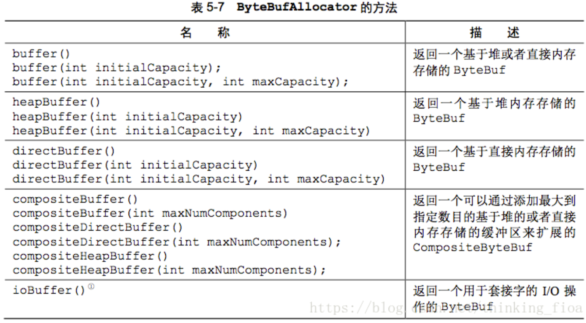

解释:

1. 上图中的buffer()方法，返回一个基于堆或者直接内存存储的Bytebuf ----- 缺省是堆内存。源码: AbstractByteBufAllocator() { this(false); }
2. ByteBufAllocator.DEFAULT ----- 可能是池化，也可能是非池化。默认是池化(PooledByteBufAllocator.DEFAULT)

#### Unpooled缓冲区(非池化)

​		Unpooled提供静态的辅助方法来创建未池化的ByteBuf。

​		Unpooled类还使得ByteBuf同样可用于那些并不需要Netty的其他组件的非网络项目，使得其能得益于高性能的可扩展的缓冲区API。

Unpooled方法:

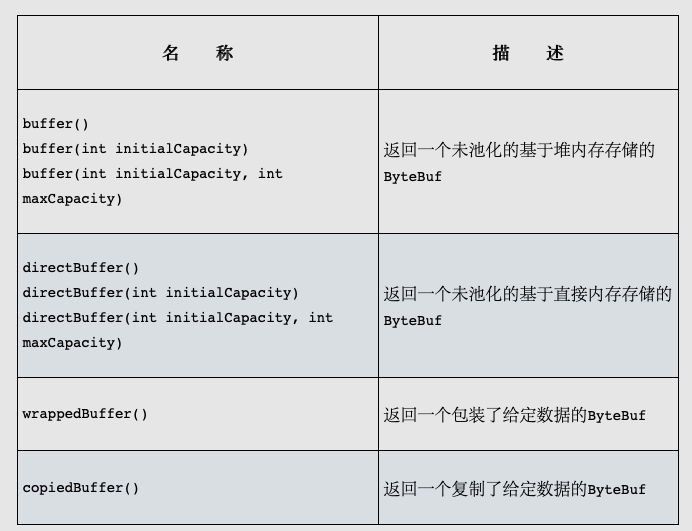

代码:

```java
public void createByteBuf(ChannelHandlerContext ctx) {
    // 1. 通过Channel创建ByteBuf
    ByteBuf buf1 = ctx.channel().alloc().buffer();
    // 2. 通过ByteBufAllocator.DEFAULT创建
    ByteBuf buf2 =  ByteBufAllocator.DEFAULT.buffer();
    // 3. 通过Unpooled创建
    ByteBuf buf3 = Unpooled.buffer();
    // 4. 创建一个视图，返回一个包装了给定数据的ByteBuf。非常实用
    ByteBuf buf4 = Unpooled.wrappedBuffer("返回一个包装了指定数据的ByteBuf".getBytes());
}
```


### ByteBuf使用模式

​		**ByteBuf本质是: 一个由不同的索引分别控制读访问和写访问的字节数组。**

​		ByteBuf共有三种模式: 堆缓冲区模式(Heap Buffer)、直接缓冲区模式(Direct Buffer)和复合缓冲区模式(Composite Buffer)

#### 堆缓冲区模式(Heap Buffer)

堆缓冲区模式又称为：支撑数组(backing array)。将数据存放在JVM的堆空间，通过将数据存储在数组中实现

- 堆缓冲的优点: 由于数据存储在Jvm堆中可以快速创建和快速释放，并且提供了数组直接快速访问的方法
- 堆缓冲的缺点: 每次数据与I/O进行传输时，都需要将数据拷贝到直接缓冲区

```java
public static void heapBuffer() {
  ByteBuf heapBuf = Unpooled.buffer(1024);
  heapBuf.writeBytes("heapBuffer".getBytes());
  // 检查ByteBuf是有支撑数组
  if (heapBuf.hasArray()) {
    // 获取支撑数组的引用
    // 当heapBuf.hasArray()返回false时,尝试访问支撑数组将处罚UnsupportedOperationException
    byte[] array = heapBuf.array();
    // 计算第一个字节的偏移量,也就是可以开始读的字节
    int offset = heapBuf.arrayOffset() + heapBuf.readerIndex();
    // 获得可读字节数
    int length = heapBuf.readableBytes();
    handleArray(array, offset, length);
  }
}

```

handleArray方法的实现:

```java
private static void handleArray(byte[] array, int offset, int length) {
    for (int i = offset; i < length; i++) {
        byte b = array[i];
        System.out.print((char) b);

    }
    System.out.println("");
    System.out.println("------------------");
}
```

执行结果:

```
heapBuffer
------------------
```


#### 直接缓冲区模式(Direct Buffer)

Direct Buffer属于堆外分配的直接内存，不会占用堆的容量。适用于套接字传输过程，避免了数据从内部缓冲区拷贝到直接缓冲区的过程，性能较好

- Direct Buffer的优点: 使用Socket传递数据时性能很好，避免了数据从Jvm堆内存拷贝到直接缓冲区的过程。提高了性能
- Direct Buffer的缺点: 相对于堆缓冲区而言，Direct Buffer分配内存空间和释放更为昂贵
- 对于涉及大量I/O的数据读写，建议使用Direct Buffer。而对于用于后端的业务消息编解码模块建议使用Heap Buffer

```java
public static void directBuffer() {
  ByteBuf directBuf = Unpooled.directBuffer();
  directBuf.writeBytes("directBuffer".getBytes());
  // 检查ByteBuf是否由数组支撑.如果不是,则这是一个直接缓存区
  if (!directBuf.hasArray()) {
    // 获取可读字节数
    int length = directBuf.readableBytes();
    // 声明一个新的数组来保存具有该长度的字节数据
    byte[] array = new byte[length];
    // 将字节复制到该数组
    directBuf.getBytes(directBuf.readerIndex(), array);
    handleArray(array, 0, length);
  }
}

```

执行结果:

```
directBuffer
------------------
```


#### 复合缓冲区模式(Composite Buffer)

Composite Buffer是Netty特有的缓冲区。**本质上类似于提供一个或多个ByteBuf的组合视图，可以根据需要添加和删除不同类型的ByteBuf。**

- 它是一个组合视图。它提供一种访问方式让使用者自由的组合多个ByteBuf，避免了拷贝和分配新的缓冲区。
- **Composite Buffer不支持访问其支撑数组。**因此如果要访问，需要先将内容拷贝到堆内存中，再进行访问
- 下图是将两个ByteBuf：头部+Body组合在一起，没有进行任何复制过程。仅仅创建了一个视图


```java
public static void byteBufComposite() {
        // Netty使用了CompositeByteBuf来优化套接字的I/O操作，
        // 尽可能地消除了由JDK的缓冲区实现所导致的性能以及内存使用率的惩罚。
        CompositeByteBuf messageBuf = Unpooled.compositeBuffer();
        ByteBuf headerBuf = Unpooled.buffer(1024); // can be backing or direct
        headerBuf.writeBytes("headerBuf".getBytes());
        ByteBuf bodyBuf = Unpooled.directBuffer();   // can be backing or direct
        bodyBuf.writeBytes("bodyBuf".getBytes());
        // 将ByteBuf实例追加到CompositeByteBuf
        messageBuf.addComponents(true, headerBuf, bodyBuf);

        // 访问CompositeByteBuf中的数据和访问直接缓冲区的模式相同,应为混合模式不支持访问支撑数组
        int length = messageBuf.readableBytes();
        byte[] array = new byte[length];
        messageBuf.getBytes(messageBuf.readerIndex(), array);
        handleArray(array, 0, length);

        // CompositeByteBuf像是一个ByteBuf的容器
        // 循环遍历所有ByteBuf
        messageBuf.removeComponent(0); // remove the header
        for (ByteBuf buf : messageBuf) {
            length = buf.readableBytes();
            byte[] array1 = new byte[length];
            messageBuf.getBytes(buf.readerIndex(), array1);
            handleArray(array1, 0, length);
        }

        // 重新写入ByteBuff
        messageBuf.writeBytes("byteBufComposite".getBytes());
  
        length = messageBuf.readableBytes();
        byte[] array1 = new byte[length];
        messageBuf.getBytes(messageBuf.readerIndex(), array1);
        handleArray(array1, 0, length);

    }
```

### 字节级操作

​		ByteBuf提供了许多超出基本读、写操作的方法用于修改它的数据。

#### 读/写操作

两种类别的读/写操作：

1. get()和set()操作，从给定的索引开始，并且保持索引不变；
2. read()和write()操作，从给定的索引开始，并且会根据已经访问过的字节数对索引进行调整。
3. get()操作，set()操作、read()操作和write()操作完整的列表可参考书籍或API

#### 更多操作

​		由ByteBuf提供的其他有用操作。

| 名称            | 描述                                                         |
| --------------- | ------------------------------------------------------------ |
| isReadable()    | 如果至少有一个字节可供读取,则返回true                        |
| isWritable()    | 如果至少有一个字节可被写入,则返回true                        |
| readableBytes() | 返回可被读取的字节数                                         |
| writableBytes() | 返回可被写入的字节数                                         |
| capacity()      | 返回ByteBuf可容纳的字节数.在此之后,它会尝试再次扩展直到达到maxCapacity() |
| maxCapacity()   | 返回ByteBuf可以容乃的最大字节数.                             |
| hasArray()      | 如果ByteBuf由一个字节数组支撑,则返回true                     |
| array()         | 如果ByteBuf由一个字节数组支撑则返回该数组;否则,它将抛出一个UnsupportedOperationException |


#### 随机访问索引

 		ByteBuf的索引是从零开始的：第一个字节的索引是0，最后一个字节的索引总是capacity() - 1。

- readXXX()和writeXXX()方法将会推进其对应的索引readerIndex和writerIndex。自动推进
- getXXX()和setXXX()方法用于访问数据，对writerIndex和readerIndex无影响

```java
public static void byteBufRelativeAccess() {
  // readXXX()和writeXXX()方法将会推进其对应的索引readerIndex和writerIndex。自动推进
  // getXXX()和setXXX()方法用于访问数据，对writerIndex和readerIndex无影响
  ByteBuf buffer = BYTE_BUF_FROM_SOMEWHERE;

  // writeXXX方法会推进writetIndex
  buffer.writeBytes("byteBufRelativeAccess".getBytes());
  buffer.writeBytes("1234".getBytes());

  // setXXX方法对writerIndex无影响
  buffer.setBytes(30, "setXXX".getBytes());
  getPrint(buffer);

  // 再次通过write方法写入. 使用set方法写入的数据被覆盖
  buffer.writeBytes("1234567890".getBytes());
  getPrint(buffer);

  // 使用read方法剩余一个未被覆盖的X字符,不应该被输出
  readPrint(buffer);
}

private static void getPrint(ByteBuf buffer) {
  for (int i = 0; i < buffer.capacity(); i++) {
    // getXXX()方法用于访问数据对readerIndex无影响
    byte b = buffer.getByte(i);
    System.out.print((char) b);
  }

  System.out.println("");
  System.out.println("------------------");
}

private static void readPrint(ByteBuf buffer) {

  while (buffer.readableBytes() >= 1) {
    byte b = buffer.readByte();
    System.out.print((char) b);
  }

  System.out.println("");
  System.out.println("------------------");
}
```

执行结果:

```
byteBufRelativeAccess1234setXXX
------------------
byteBufRelativeAccess12341234567890X
------------------
byteBufRelativeAccess12341234567890
------------------
```

#### 顺序访问索引

​		Netty的ByteBuf同时具有读索引和写索引，但JDK的ByteBuffer只有一个索引，所以JDK需要调用flip()方法在读模式和写模式之间切换。

- ByteBuf被读索引和写索引划分成3个区域：可丢弃字节区域，可读字节区域和可写字节区域


##### 可丢弃字节区

​		可丢弃字节区域是指:[0，readerIndex)之间的区域。可调用discardReadBytes()方法丢弃已经读过的字节。

1. discardReadBytes()效果 ----- 将可读字节区域(CONTENT)[readerIndex, writerIndex)往前移动readerIndex位，同时修改读索引和写索引。

2. discardReadBytes()方法会移动可读字节区域内容(CONTENT)。如果频繁调用，会有多次数据复制开销，对性能有一定的影响

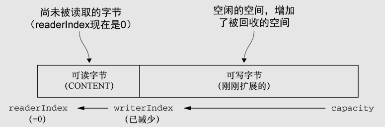

```java
public static void byteBufDiscardReadBytes() {

    ByteBuf buffer = BYTE_BUF_FROM_SOMEWHERE;
    buffer.writeBytes("1234".getBytes());
    // 使用read读取,移动readerIndex索引,
    readPrint(buffer);

    // 写入一些未被读取过的数据
    buffer.writeBytes("5678".getBytes());

    System.out.println("此时第一个1234为<可丢弃字节区域>");
    getPrint(buffer);
    System.out.println("调用discardReadBytes(),1234被清理");
    buffer.discardReadBytes();
    getPrint(buffer);
    // 写入abcd,在之前存入5678的地方会被新数据覆盖掉
    buffer.writeBytes("abcd".getBytes());
    getPrint(buffer);

}
```

执行结果:

```
1234
------------------
此时第一个1234为<可丢弃字节区域>
12345678
------------------
调用discardReadBytes(),1234被清理
56785678
------------------
5678abcd
------------------
```

##### 可读字节区

​		ByteBuf的可读字节分段存储了实际数据。新分配的、包装的或者复制的缓冲区的**默认的readerIndex值为0**。任何名称以read或者skip开头的操作都将检索或者跳过位于当前readerIndex的数据，并且将它增加已读字节数。

​	如果被调用的方法需要一个ByteBuf参数作为写入的目标，并且没有指定目标索引参数，那么该目标缓冲区的writerIndex也将被增加.

例如:


如果尝试在缓冲区的可读字节数已经耗尽时从中读取数据，那么将会引发一个IndexOutOfBoundsException。


##### 可写字节区

​		可写字节分段是指一个拥有未定义内容的、写入就绪的内存区域。新分配的缓冲区的writerIndex的默认值为0。**任何名称以write开头的操作都将从当前的writerIndex处开始写数据，并将它增加已经写入的字节数。**

​		如果写操作的目标也是ByteBuf，并且没有指定源索引的值，则源缓冲区的readerIndex也同样会被增加相同的大小。

例如:


​		如果尝试往目标写入超过目标容量的数据，将会引发一个IndexOutOfBoundException[5]。

```java
public static void writeAndGetPrint() {
    ByteBuf buffer = BYTE_BUF_FROM_SOMEWHERE;
    String str = "123456789";
    // 确定写缓冲区是否还有足够的空间
    while (buffer.writableBytes() >= 9) {
        buffer.writeBytes(str.getBytes());
    }
    getPrint(buffer);
}
```

输出结果:

```
123456789123456789123456789123456789123456789123456789
------------------
```

#### 索引管理

1. markReaderIndex()+resetReaderIndex() ----- markReaderIndex()是先备份当前的readerIndex，resetReaderIndex()则是将刚刚备份的readerIndex恢复回来。常用于dump ByteBuf的内容，又不想影响原来ByteBuf的readerIndex的值
2. readerIndex(int) ----- 设置readerIndex为固定的值
3. writerIndex(int) ----- 设置writerIndex为固定的值
4. clear() ----- 效果是: readerIndex=0, writerIndex(0)。不会清除内存
5. 调用clear()比调用discardReadBytes()轻量的多。仅仅重置readerIndex和writerIndex的值，不会拷贝任何内存，开销较小。


```java
public static void byteBufIndexManager() {
    ByteBuf buffer = BYTE_BUF_FROM_SOMEWHERE;
    buffer.writeBytes("1234567890".getBytes());
    getPrint(buffer);
    // markReaderIndex()+resetReaderIndex() ----- markReaderIndex()是先备份当前的readerIndex，
    // resetReaderIndex()则是将刚刚备份的readerIndex恢复回来。常用于dump ByteBuf的内容，又不想影响原
    // 来ByteBuf的readerIndex的值
    buffer.markReaderIndex();       // 读取前标记
    readPrint(buffer);              // 读取一次
    buffer.resetReaderIndex();      // reset复位ReaderIndex
    readPrint(buffer);              // 在读取一次


    buffer.writeBytes("123456789".getBytes());
    getPrint(buffer);
    // 设置readerIndex为固定的值
    buffer.readerIndex(12);
    readPrint(buffer);

    // clear() ----- 效果是: readerIndex=0, writerIndex(0)。不会清除内存
    buffer.clear();
    // 使用read不会独处任何数据
    readPrint(buffer);
    // 使用get方法
    getPrint(buffer);
}
```

输出结果:

```
1234567890
------------------
1234567890
------------------
1234567890
------------------
1234567890123456789
------------------
3456789
------------------

------------------
1234567890123456789
------------------
```


#### 查找操作(indexOf)

​		查找ByteBuf指定的值。类似于，String.indexOf("str")操作

1. 最简单的方法 ----- indexOf(）
2. 利用ByteProcessor作为参数来查找某个指定的值。

```java
public static void byteProcessor() {
    ByteBuf buffer = Unpooled.buffer(); //get reference form somewhere
    byte[] b = new byte[]{(byte) 8,(byte) 9,(byte) 10};
    buffer.writeBytes(b);

    // 使用indexOf()方法来查找
    int i = buffer.indexOf(buffer.readerIndex(), buffer.writerIndex(), (byte)9);
    System.out.println(i);
    // 使用ByteProcessor查找给定的值
    int index = buffer.forEachByte(ByteProcessor.FIND_CR);
    System.out.println(index);
}
```

输出结果:

```
1
-1
```

#### 派生缓冲区

​		派生缓冲区为ByteBuf提供了以专门的方式来呈现其内容的视图。

这类视图是通过以下方法被创建的：

1. duplicate()；
2. slice()；
3. slice(int,int)；
4. Unpooled.unmodifiableBuffer(…)；
5. order(ByteOrder)；
6. readSlice(int)。

​		**每个这些方法都将返回一个新的ByteBuf实例，它具有自己的读索引、写索引和标记索引。其内部存储和JDK的ByteBuffer一样也是共享的。**这使得派生缓冲区的创建成本是很低廉的，但是这也意味着，**如果你修改了它的内容，也同时修改了其对应的源实例，所以要小心。**

视图代码:

```java
public static void byteBufSlice() {
    Charset utf8 = Charset.forName("UTF-8");
    ByteBuf buf = Unpooled.copiedBuffer("Netty in Action rocks!", utf8);
    ByteBuf sliced = buf.slice(0, 15);
    System.out.println(sliced.toString(utf8));
    // 改变下标0位置的判断两个ByteBuf值是否一样
    buf.setByte(0, (byte)'J');
    // 是同一套数据,所以相等.
    System.out.println(buf.getByte(0) == sliced.getByte(0));
}
```

执行结果:

```
Netty in Action
true
```

复制代码:

```java
public static void byteBufCopy() {
    Charset utf8 = Charset.forName("UTF-8");
    ByteBuf buf = Unpooled.copiedBuffer("Netty in Action rocks!", utf8);
    ByteBuf copy = buf.copy(0, 15);
    System.out.println(copy.toString(utf8));
    // 改变下标0位置的判断两个ByteBuf值是否一样
    buf.setByte(0, (byte)'J');
    // 不是同一数据.所以为false
    System.out.println(buf.getByte(0) == copy.getByte(0));

    getPrint(buf);
    getPrint(copy);
}
```

执行结果:

```
Netty in Action
false
Jetty in Action rocks!
------------------
Netty in Action
------------------
```

#### ByteBufUtil类

​		ByteBufUtil提供了用于操作ByteBuf的静态的辅助方法。这个API是通用的，并且和池化无关.

1. hexdump() ----- 以十六进制的表示形式打印ByteBuf的内容。非常有价值 
2. equals() ----- 判断两个ByteBuf实例的相等性

### ByteBufHolder接口

ByteBufHolder为Netty的高级特性提供了支持，如缓冲区池化，可以从池中借用ByteBuf，并且在需要时自动释放。

1. ByteBufHolder是ByteBuf的容器，可以通过子类实现ByteBufHolder接口，根据自身需要添加自己需要的数据字段。可以用于自定义缓冲区类型扩展字段。
2. Netty提供了一个默认的实现DefaultByteBufHolder。

ByteBufHolder的操作

| 名称        | 描述                                                         |
| ----------- | ------------------------------------------------------------ |
| content()   | 返回由这个ByteBufHolder所持有的ByteBuf                       |
| copy()      | 返回这个ByteBufHolder的一个深拷贝,包括一个其所包含的ByteBuf的非共享拷贝. |
| duplicate() | 返回这个ByteBufHolder的一个浅拷贝，包括一个其所包含的ByteBuf的共享拷贝. |

代码:

```java
public class DefaultByteBufHolder implements ByteBufHolder {

    private final ByteBuf data;

    public DefaultByteBufHolder(ByteBuf data) {
        if (data == null) {
            throw new NullPointerException("data");
        }
        this.data = data;
    }

    @Override
    public ByteBuf content() {
        if (data.refCnt() <= 0) {
            throw new IllegalReferenceCountException(data.refCnt());
        }
        return data;
    }

    /**
     * {@inheritDoc}
     * <p>
     * This method calls {@code replace(content().copy())} by default.
     */
    @Override
    public ByteBufHolder copy() {
        return replace(data.copy());
    }

    /**
     * {@inheritDoc}
     * <p>
     * This method calls {@code replace(content().duplicate())} by default.
     */
    @Override
    public ByteBufHolder duplicate() {
        return replace(data.duplicate());
    }
    // ...
}
```


### 引用计数

Netty4.0版本中为ButeBuf和ButeBufHolder引入了引用计数技术。请区别引用计数和可达性分析算法(jvm垃圾回收)

1. 谁负责释放: 一般来说，是由最后访问(引用计数)对象的那一方来负责将它释放
2. buffer.release() ----- 引用计数减1 
3. buffer.retain() ----- 引用计数加1
4. buffer.refCnt() ----- 返回当前对象引用计数值
5. buffer.touch() ----- 记录当前对象的访问位置，主要用于调试。
6. 引用计数并非仅对于直接缓冲区(direct Buffer)。ByteBuf的三种模式: 堆缓冲区(heap Buffer)、直接缓冲区(dirrect Buffer)和复合缓冲区(Composite Buffer)都使用了引用计数，某些时候需要程序员手动维护引用数值

```java
public static void releaseReferenceCountedObject(){
    ByteBuf buffer = ByteBufAllocator.DEFAULT.buffer();
    // 输出引用计数
    System.out.println(buffer.refCnt());
    // 引用计数加1
    buffer.retain();
    // 输出引用计数
    System.out.println(buffer.refCnt());
    // 引用计数减1
    buffer.release();
    // 输出引用计数
    System.out.println(buffer.refCnt());
}
```

执行结果:

```
1
2
1
```

## 