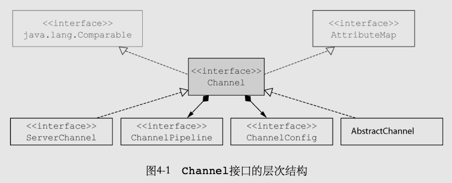
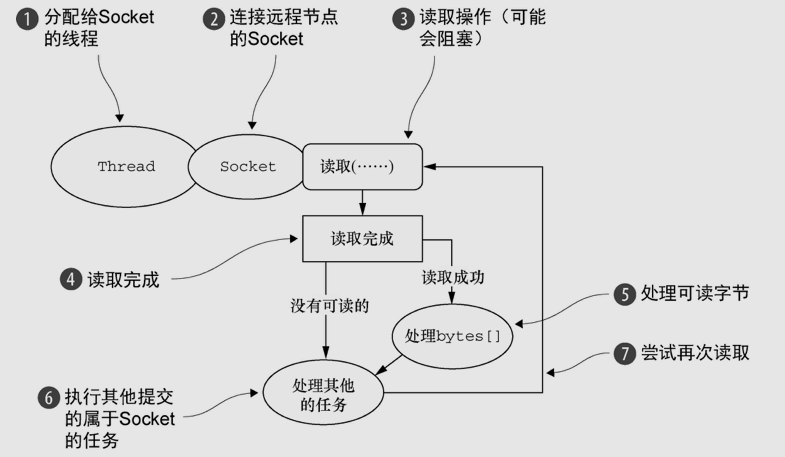
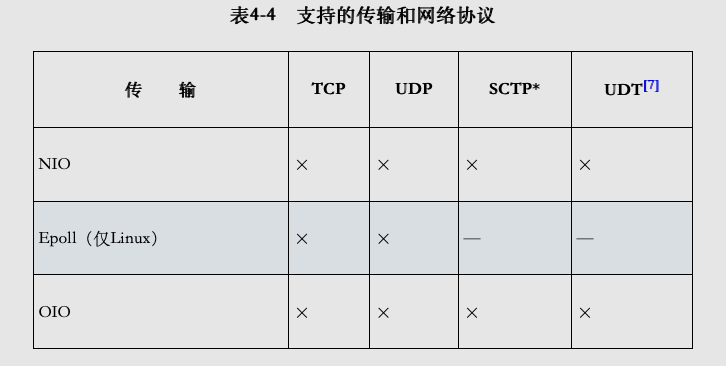
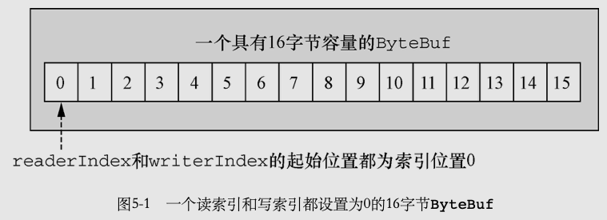
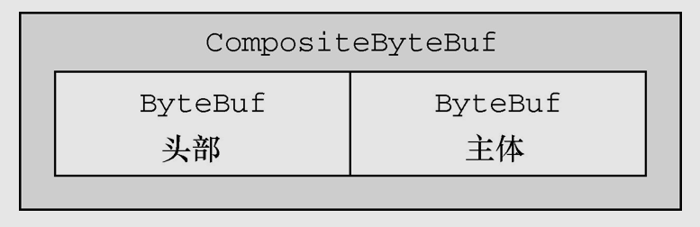
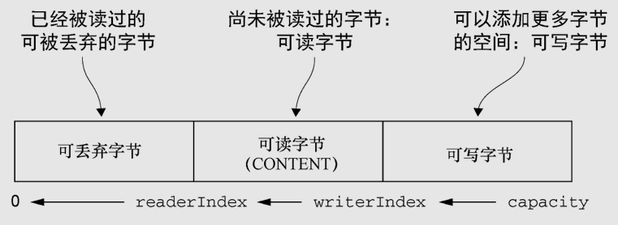

# Netty-组件

## Channel

### 介绍

​		基本的I/O操作（bind()、connect()、read()和write()）依赖于底层网络传输所提供的原语。在基于Java的网络编程中，其基本的构造是Socket。Netty的Channel接口所提供的API，降低了直接使用Socket类的复杂性。此外，Channel也是拥有许多预定义的、专门化实现的广泛类层次结构的根，

下面是一个简短的部分清单：

- EmbeddedChannel；
- LocalServerChannel；
- NioDatagramChannel；
- NioSctpChannel；
- NioSocketChannel。



每个Channel都将会被分配一个ChannelPipeline和ChannelConfig。

- ChannelConfig包含了该Channel的所有配置设置，并且支持热更新。由于特定的传输可能具有独特的设置，所以它可能会实现一个ChannelConfig的子类型。

- **ChannelPipeline持有所有将应用于入站和出站数据以及事件的ChannelHandler实例**，这些ChannelHandler实现了应用程序用于处理状态变化以及数据处理的逻辑。

  

​		Channel是独一无二的，所以为了保证顺序将Channel声明为java.lang.Comparable的一个子接口。如果两个不同的Channel实例都返回了相同的散列码，那么AbstractChannel中的compareTo()方法的实现将会抛出一个Error。

### 常用方法

| 方法名        | 描述                                                         |
| ------------- | ------------------------------------------------------------ |
| eventLoop     | 返回分配给Channel的EventLoop                                 |
| pipeline      | 返回分配给Channel的ChannelPipeline                           |
| isActive      | 如果Channel是活动的,则返回true.活动的意义可能依赖于底层的传输.例如,一个Socket传输一旦连接到了远程节点便是活动的,而一个Datagram传输一旦打开便是活跃的. |
| localAddress  | 返回本地的SocketAddress                                      |
| remoteAddress | 返回远程的SocketAddress                                      |
| write         | 将数据写到远程节点.这个数据将被传递给ChannelPipeline,并且排队直到被冲刷 |
| flush         | 将之前已写的数据冲刷到底层传输,如一个Socket                  |
| writeAndFlush | 等同于调用write()并借着调用flush().                          |

### 内置Channel实现

| 名称     | 包                          | 描述                                                         |
| -------- | --------------------------- | ------------------------------------------------------------ |
| NIO      | io.netty.channel.socket.nio | 使用java.io.channels包作为基础,基于选择器方式的同步非阻塞IO模型. |
| Epoll    | Io.netty.channel.epoll      | 有JNI驱动的epoll()非阻塞IO.这个Channel支持只有在Linux上可用的多种特性,比NIO更快. |
| OIO      | io.netty.channel.socket.oio | 使用java.net包作为基础-使用阻塞IO                            |
| Local    | io.netty.channel.local      | 可以在JVM内部通过管道进行通信的本地传输                      |
| Embedded | io.netty.channel.embedded   | EmbeddedChannel,允许使用ChannelHandler而又不需要一个真正的基于网络的传输.通常用来支撑单元测试. |


#### NIO-同步非阻塞I/O

选择器返回的时间类型:

| 名称       | 描述                                                         |
| ---------- | ------------------------------------------------------------ |
| OP_ACCEPT  | 在接受新连接并创建Channel时获得通知.                         |
| OP_CONNECT | 在建立一个连接时获得通知                                     |
| OP_READ    | 数据已经就绪,可以从Channel中读取时获得通知.                  |
| OP_WRITE   | 可以向Channel中写更多数据时获得通知.这处理了套接字缓冲区呗完全填满时的情况,这种情况通常发生在数据发送速度比远程节点的处理速度更快的时候. |

封装处理了如下图java原生NIO的API的处理流程:


#### Epoll-Linux的本地非阻塞I/O

​		Netty的NIO传输基于Java提供的异步/非阻塞网络编程的通用抽象。虽然这保证了Netty的非阻塞API可以在任何平台上使用，但它也包含了相应的限制，因为**JDK为了在所有系统上提供相同的功能，必须做出妥协。**

​		Linux作为高性能网络编程的平台，其重要性与日俱增，这催生了大量先进特性的开发，其中包括**epoll——一个高度可扩展的I/O事件通知特性**。这个API自Linux内核版本2.5.44（2002）被引入，提供了**比旧的POSIXselect和poll系统调用[3]更好的性能**，同时现在也是***Linux上非阻塞网络编程的事实标准。***Linux JDK NIO API使用了这些epoll调用。

​		Netty为Linux提供了一组NIO API，以一种和它本身的设计更加一致的方式使用epoll，并且以一种更加轻量的方式使用中断。**如果你的应用程序旨在运行于Linux系统，那么请考虑利用这个版本的Channel；你将发现在高负载下它的性能要优于JDK的NIO实现。**

#### OIO-阻塞I/O

​		Netty是如何能够使用用于异步传输相同的API来支持OIO的呢。答案就是，Netty利用了SO_TIMEOUT这个Socket标志，它指定了等待一个I/O操作完成的最大毫秒数。如果操作在指定的时间间隔内没有完成，则将会抛出一个SocketTimeoutException。Netty将捕获这个异常并继续处理循环。在EventLoop下一次运行时，它将再次尝试。这实际上也是类似于Netty这样的异步框架能够支持OIO的唯一方式。

逻辑图:



#### Local-Jvm内部通信的Channel

​		Netty提供了一个Local传输，用于在同一个JVM中运行的客户端和服务器程序之间的异步通信。同样，这个传输也支持对于所有Netty传输实现都共同的API。

​		在这个传输中，和服务器Channel相关联的SocketAddress并没有绑定物理网络地址；相反，只要服务器还在运行，它就会被存储在注册表里，并在Channel关闭时注销。因为这个传输并不接受真正的网络流量，所以它并不能够和其他传输实现进行互操作。因此，**客户端希望连接到（在同一个JVM中）使用了这个传输的服务器端时也必须使用它。**除了这个限制，它的使用方式和其他的传输一模一样。

- #### Embedded-单元测试


​	特殊的Channel实现——**EmbeddedChannel**，它是**Netty专门为改进针对ChannelHandler的单元测试而提供的。**

### 支持的协议



## ByteBuf

### 介绍

​		网络数据的基本单位总是字节。JavaNIO提供了ByteBuffer作为它的字节容器，但是这个类使用起来过于复杂，而且也有些繁琐。Netty的ByteBuffer替代品是ByteBuf，一个强大的实现，既解决了JDKAPI的局限性，又为网络应用程序的开发者提供了更好的API。

ByteBufAPI的优点：

- 它可以被用户自定义的缓冲区类型扩展；

- 通过内置的复合缓冲区类型实现了透明的零拷贝；

- 容量可以按需增长（类似于JDK的StringBuilder）；

- 在读和写这两种模式之间切换不需要调用ByteBuffer的flip()方法；

- 读和写使用了不同的索引；

- 支持方法的链式调用；

- 支持引用计数；

- 支持池化。

  

​	ByteBuf维护了两个不同的索引：一个用于读取，一个用于写入。当你从ByteBuf读取时，它的readerIndex将会被递增已经被读取的字节数。同样地，当你写入ByteBuf时，它的writerIndex也会被递增。

下图展示了一个空ByteBuf的布局结构和状态。



1. ByteBuf维护了readerIndex和writerIndex索引
2. 当readerIndex > writerIndex时，则抛出IndexOutOfBoundsException
3. ByteBuf容量 = writerIndex。
4. ByteBuf可读容量 = writerIndex - readerIndex
5. readXXX()和writeXXX()方法将会推进其对应的索引。自动推进
6. getXXX()和setXXX()方法将对writerIndex和readerIndex无影响

### ByteBuf使用模式

​		**ByteBuf本质是: 一个由不同的索引分别控制读访问和写访问的字节数组。**

​		ByteBuf共有三种模式: 堆缓冲区模式(Heap Buffer)、直接缓冲区模式(Direct Buffer)和复合缓冲区模式(Composite Buffer)

#### 堆缓冲区模式(Heap Buffer)

堆缓冲区模式又称为：支撑数组(backing array)。将数据存放在JVM的堆空间，通过将数据存储在数组中实现

- 堆缓冲的优点: 由于数据存储在Jvm堆中可以快速创建和快速释放，并且提供了数组直接快速访问的方法
- 堆缓冲的缺点: 每次数据与I/O进行传输时，都需要将数据拷贝到直接缓冲区

```java
public static void heapBuffer() {
  ByteBuf heapBuf = Unpooled.buffer(1024);
  heapBuf.writeBytes("heapBuffer".getBytes());
  // 检查ByteBuf是有支撑数组
  if (heapBuf.hasArray()) {
    // 获取支撑数组的引用
    // 当heapBuf.hasArray()返回false时,尝试访问支撑数组将处罚UnsupportedOperationException
    byte[] array = heapBuf.array();
    // 计算第一个字节的偏移量,也就是可以开始读的字节
    int offset = heapBuf.arrayOffset() + heapBuf.readerIndex();
    // 获得可读字节数
    int length = heapBuf.readableBytes();
    handleArray(array, offset, length);
  }
}

```

handleArray方法的实现:

```
private static void handleArray(byte[] array, int offset, int length) {
    for (int i = offset; i < length; i++) {
        byte b = array[i];
        System.out.print((char) b);

    }
    System.out.println("");
    System.out.println("------------------");
}
```

执行结果:

```
heapBuffer
------------------
```


#### 直接缓冲区模式(Direct Buffer)

Direct Buffer属于堆外分配的直接内存，不会占用堆的容量。适用于套接字传输过程，避免了数据从内部缓冲区拷贝到直接缓冲区的过程，性能较好

- Direct Buffer的优点: 使用Socket传递数据时性能很好，避免了数据从Jvm堆内存拷贝到直接缓冲区的过程。提高了性能
- Direct Buffer的缺点: 相对于堆缓冲区而言，Direct Buffer分配内存空间和释放更为昂贵
- 对于涉及大量I/O的数据读写，建议使用Direct Buffer。而对于用于后端的业务消息编解码模块建议使用Heap Buffer

```java
public static void directBuffer() {
  ByteBuf directBuf = Unpooled.directBuffer();
  directBuf.writeBytes("directBuffer".getBytes());
  // 检查ByteBuf是否由数组支撑.如果不是,则这是一个直接缓存区
  if (!directBuf.hasArray()) {
    // 获取可读字节数
    int length = directBuf.readableBytes();
    // 声明一个新的数组来保存具有该长度的字节数据
    byte[] array = new byte[length];
    // 将字节复制到该数组
    directBuf.getBytes(directBuf.readerIndex(), array);
    handleArray(array, 0, length);
  }
}

```

执行结果:

```
directBuffer
------------------
```


#### 复合缓冲区模式(Composite Buffer)

Composite Buffer是Netty特有的缓冲区。**本质上类似于提供一个或多个ByteBuf的组合视图，可以根据需要添加和删除不同类型的ByteBuf。**

- 想要理解Composite Buffer，请记住：它是一个组合视图。它提供一种访问方式让使用者自由的组合多个ByteBuf，避免了拷贝和分配新的缓冲区。
- **Composite Buffer不支持访问其支撑数组。**因此如果要访问，需要先将内容拷贝到堆内存中，再进行访问
- 下图是将两个ByteBuf：头部+Body组合在一起，没有进行任何复制过程。仅仅创建了一个视图



```java
public static void byteBufComposite() {
        // Netty使用了CompositeByteBuf来优化套接字的I/O操作，
        // 尽可能地消除了由JDK的缓冲区实现所导致的性能以及内存使用率的惩罚。
        CompositeByteBuf messageBuf = Unpooled.compositeBuffer();
        ByteBuf headerBuf = Unpooled.buffer(1024); // can be backing or direct
        headerBuf.writeBytes("headerBuf".getBytes());
        ByteBuf bodyBuf = Unpooled.directBuffer();   // can be backing or direct
        bodyBuf.writeBytes("bodyBuf".getBytes());
        // 将ByteBuf实例追加到CompositeByteBuf
        messageBuf.addComponents(true, headerBuf, bodyBuf);

        // 访问CompositeByteBuf中的数据和访问直接缓冲区的模式相同,应为混合模式不支持访问支撑数组
        int length = messageBuf.readableBytes();
        byte[] array = new byte[length];
        messageBuf.getBytes(messageBuf.readerIndex(), array);
        handleArray(array, 0, length);

        // CompositeByteBuf像是一个ByteBuf的容器
        // 循环遍历所有ByteBuf
        messageBuf.removeComponent(0); // remove the header
        for (ByteBuf buf : messageBuf) {
            length = buf.readableBytes();
            byte[] array1 = new byte[length];
            messageBuf.getBytes(buf.readerIndex(), array1);
            handleArray(array1, 0, length);
        }

        // 重新写入ByteBuff
        messageBuf.writeBytes("byteBufComposite".getBytes());
  
        length = messageBuf.readableBytes();
        byte[] array1 = new byte[length];
        messageBuf.getBytes(messageBuf.readerIndex(), array1);
        handleArray(array1, 0, length);

    }
```

### 字节级操作

​		ByteBuf提供了许多超出基本读、写操作的方法用于修改它的数据。

#### 随机访问索引

 		ByteBuf的索引是从零开始的：第一个字节的索引是0，最后一个字节的索引总是capacity() - 1。

- readXXX()和writeXXX()方法将会推进其对应的索引readerIndex和writerIndex。自动推进
- getXXX()和setXXX()方法用于访问数据，对writerIndex和readerIndex无影响

```java
public static void byteBufRelativeAccess() {
  // readXXX()和writeXXX()方法将会推进其对应的索引readerIndex和writerIndex。自动推进
  // getXXX()和setXXX()方法用于访问数据，对writerIndex和readerIndex无影响
  ByteBuf buffer = BYTE_BUF_FROM_SOMEWHERE;

  // writeXXX方法会推进writetIndex
  buffer.writeBytes("byteBufRelativeAccess".getBytes());
  buffer.writeBytes("1234".getBytes());

  // setXXX方法对writerIndex无影响
  buffer.setBytes(30, "setXXX".getBytes());
  getPrint(buffer);

  // 再次通过write方法写入. 使用set方法写入的数据被覆盖
  buffer.writeBytes("1234567890".getBytes());
  getPrint(buffer);

  // 使用read方法剩余一个未被覆盖的X字符,不应该被输出
  readPrint(buffer);
}

private static void getPrint(ByteBuf buffer) {
  for (int i = 0; i < buffer.capacity(); i++) {
    // getXXX()方法用于访问数据对readerIndex无影响
    byte b = buffer.getByte(i);
    System.out.print((char) b);
  }

  System.out.println("");
  System.out.println("------------------");
}

private static void readPrint(ByteBuf buffer) {

  while (buffer.readableBytes() >= 1) {
    byte b = buffer.readByte();
    System.out.print((char) b);
  }

  System.out.println("");
  System.out.println("------------------");
}
```

执行结果:

```
byteBufRelativeAccess1234setXXX
------------------
byteBufRelativeAccess12341234567890X
------------------
byteBufRelativeAccess12341234567890
------------------
```

#### 顺序访问索引

Netty的ByteBuf同时具有读索引和写索引，但JDK的ByteBuffer只有一个索引，所以JDK需要调用flip()方法在读模式和写模式之间切换。

-  ByteBuf被读索引和写索引划分成3个区域：可丢弃字节区域，可读字节区域和可写字节区域

