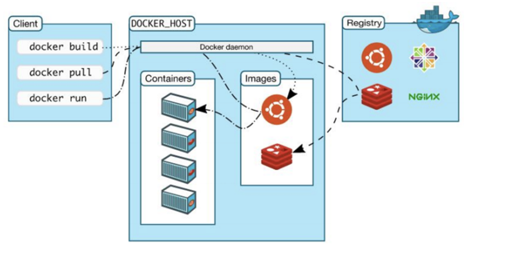
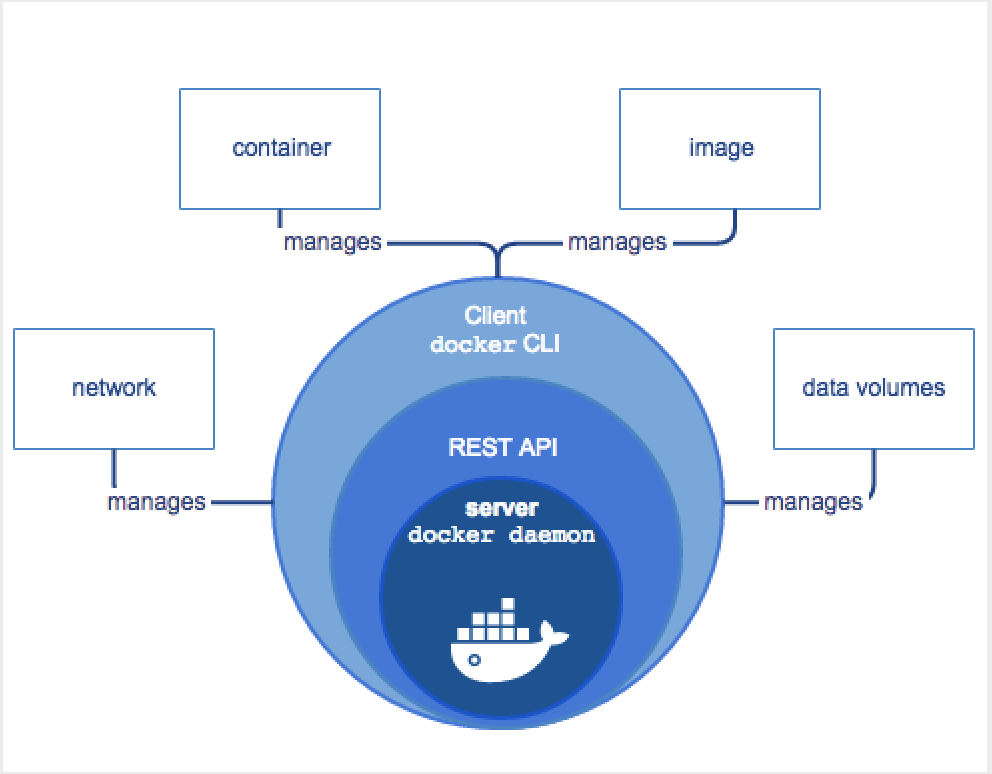

# Docker基础及安装

## Docker的基本概念

镜像（Image）、容器（Container）、仓库（Repository）、网络（network）、数据卷（data volumes），是Docker中最基本也是最核心的概念，对这些概念的掌握与理解，是学习Docker的关键。


### Docker的架构

Docker跟大部分服务端软件一样（如MySQL），都是使用C/S的架构模型，也就是通过客户端调用服务器，只是我们现在刚好服务端和客户端都在同一台机器上而已。



### Docker Engine

Docker Server为客户端提供了容器、镜像、数据卷、网络管理等功能，其实，这些功能都是由Docker Engine来实现的。

1. dockerd：服务器守护进程。
2. Client docker Cli：命令行接口
3. REST API：除了cli命令行接口，也可以通过REST API调用Docker



# Vagrant创建虚拟机，安装Docker

## 1.5.1 在Win10上准备centos7

```
和大家说明一下，我们的目的仅仅是要安装一个centos7，然后在centos7上安装docker

如果搞不定vagrant+virtualbox的方式，也可以直接使用VM搭建一个centos7

或者你可以直接使用一台云服务器，上面安装了centos7

毕竟我们的目的只是为了得到一个centos7的机器，所以不必花太多精力在这个问题上折腾

```


> `采用vagrant+virtual box`

#### 1.5.1.1 下载安装vagrant

```
01 访问Vagrant官网
https://www.vagrantup.com/

02 点击Download
Windows，MacOS，Linux等

03 选择对应的版本

04 傻瓜式安装

05 命令行输入vagrant，测试是否安装成功
```

#### 1.5.1.2 下载安装virtual box

```
01 访问VirtualBox官网
	https://www.virtualbox.org/

02 选择左侧的“Downloads”

03 选择对应的操作系统版本

04 傻瓜式安装

05 [win10中若出现]安装virtualbox快完成时立即回滚，并提示安装出现严重错误
    (1)打开服务
    (2)找到Device Install Service和Device Setup Manager，然后启动
    (3)再次尝试安装
```

#### 1.5.1.3 安装centos7

```
01 创建centos7文件夹，并进入其中[目录全路径不要有中文字符]

02 在此目录下打开cmd，运行vagrant init centos/7
   此时会在当前目录下生成Vagrantfile，同时指定使用的镜像为centos/7，关键是这个镜像在哪里，我已经提前准备好了，名称是virtualbox.box文件
   链接:https://pan.baidu.com/s/1kkl7EKuGodjfKFwjgS3IsA  密码:sgzo
   
03 将virtualbox.box文件添加到vagrant管理的镜像中
	(1)下载网盘中的virtualbox.box文件
    (2)保存到磁盘的某个目录，比如D:\virtualbox.box
    (3)添加镜像并起名叫centos/7：vagrant box add centos/7 D:\virtualbox.box
    (4)vagrant box list  查看本地的box[这时候可以看到centos/7]
    
04 centos/7镜像有了，根据Vagrantfile文件启动创建虚拟机
	来到centos7文件夹，在此目录打开cmd窗口，执行vagrant up[打开virtual box观察，可以发现centos7创建成功]
	
05 以后大家操作虚拟机，还是要在centos文件夹打开cmd窗口操作
	vagrant halt   优雅关闭
	vagrant up     正常启动
	
06 vagrant常用命令
	(1)vagrant ssh    
    	进入刚才创建的centos7中
    (2)vagrant status
    	查看centos7的状态
    (3)vagrant halt
    	停止/关闭centos7
    (4)vagrant destroy
    	删除centos7
    (5)vagrant status
    	查看当前vagrant创建的虚拟机
    (6)Vagrantfile中也可以写脚本命令，使得centos7更加丰富
    	但是要注意，修改了Vagrantfile，要想使正常运行的centos7生效，必须使用vagrant reload
```

> `至此，使用vagrant+virtualbox搭建centos7完成，后面可以修改Vagrantfile对虚拟机进行相应配置`

#### 1.5.1.4 若想通过Xshell连接centos7

```
01 使用centos7的默认账号连接
	在centos文件夹下执行vagrant ssh-config
	关注:Hostname  Port  IdentityFile
	IP:127.0.0.1
	port:2222
	用户名:vagrant
	密码:vagrant
	文件:Identityfile指向的文件private-key
	
02 使用root账户登录
	vagrant ssh   进入到虚拟机中
	sudo -i
	vi /etc/ssh/sshd_config
	修改PasswordAuthentication yes
	passwd修改密码，比如abc123
	systemctl restart sshd
	使用账号root，密码abc123进行登录
```

#### 1.5.1.5 Vagrantfile通用写法

```ruby
# -*- mode: ruby -*-
# vi: set ft=ruby :

# All Vagrant configuration is done below. The "2" in Vagrant.configure
# configures the configuration version (we support older styles for
# backwards compatibility). Please don't change it unless you know what
# you're doing.
Vagrant.configure("2") do |config|
  # The most common configuration options are documented and commented below.
  # For a complete reference, please see the online documentation at
  # https://docs.vagrantup.com.

  # Every Vagrant development environment requires a box. You can search for
  # boxes at https://vagrantcloud.com/search.
  config.vm.box = "centos/7"

  # Disable automatic box update checking. If you disable this, then
  # boxes will only be checked for updates when the user runs
  # `vagrant box outdated`. This is not recommended.
  # config.vm.box_check_update = false

  # Create a forwarded port mapping which allows access to a specific port
  # within the machine from a port on the host machine. In the example below,
  # accessing "localhost:8080" will access port 80 on the guest machine.
  # NOTE: This will enable public access to the opened port
  # config.vm.network "forwarded_port", guest: 80, host: 8080

  # Create a forwarded port mapping which allows access to a specific port
  # within the machine from a port on the host machine and only allow access
  # via 127.0.0.1 to disable public access
  # config.vm.network "forwarded_port", guest: 80, host: 8080, host_ip: "127.0.0.1"

  # Create a private network, which allows host-only access to the machine
  # using a specific IP.
  # config.vm.network "private_network", ip: "192.168.33.10"

  # Create a public network, which generally matched to bridged network.
  # Bridged networks make the machine appear as another physical device on
  # your network.
  config.vm.network "public_network"

  # Share an additional folder to the guest VM. The first argument is
  # the path on the host to the actual folder. The second argument is
  # the path on the guest to mount the folder. And the optional third
  # argument is a set of non-required options.
  # config.vm.synced_folder "../data", "/vagrant_data"

  # Provider-specific configuration so you can fine-tune various
  # backing providers for Vagrant. These expose provider-specific options.
  # Example for VirtualBox:
  #
  # config.vm.provider "virtualbox" do |vb|
  #   # Display the VirtualBox GUI when booting the machine
  #   vb.gui = true
  #
  #   # Customize the amount of memory on the VM:
  #   vb.memory = "1024"
  # end
    config.vm.provider "virtualbox" do |vb|
        vb.memory = "4000"
        vb.name= "jack-centos7"
        vb.cpus= 2
    end
  #
  # View the documentation for the provider you are using for more
  # information on available options.

  # Enable provisioning with a shell script. Additional provisioners such as
  # Puppet, Chef, Ansible, Salt, and Docker are also available. Please see the
  # documentation for more information about their specific syntax and use.
  # config.vm.provision "shell", inline: <<-SHELL
  #   apt-get update
  #   apt-get install -y apache2
  # SHELL
end

```

#### 1.5.1.6 box的打包分发

```
01 退出虚拟机
	vagrant halt

02 打包
	vagrant package --output first-docker-centos7.box
	
03 得到first-docker-centos7.box
	
04 将first-docker-centos7.box添加到其他的vagrant环境中
	vagrant box add first-docker-centos7 first-docker-centos7.box
	
05 得到Vagrantfile
	vagrant init first-docker-centos7

06 根据Vagrantfile启动虚拟机
	vagrant up [此时可以得到和之前一模一样的环境，但是网络要重新配置]
```

### 1.5.2 安装docker

> https://docs.docker.com/install/linux/docker-ce/centos/

```
01 进入centos7
	vagrant ssh
	
02 卸载之前的docker
	sudo yum remove docker \
                  docker-client \
                  docker-client-latest \
                  docker-common \
                  docker-latest \
                  docker-latest-logrotate \
                  docker-logrotate \
                  docker-engine
                  
03 安装必要的依赖
	sudo yum install -y yum-utils \
    device-mapper-persistent-data \
    lvm2
    
04 设置docker仓库  [设置阿里云镜像仓库可以先自行百度，后面课程也会有自己的docker hub讲解]	
	sudo yum-config-manager \
      --add-repo \
      https://download.docker.com/linux/centos/docker-ce.repo
      
    [访问这个地址，使用自己的阿里云账号登录，查看菜单栏左下角，发现有一个镜像加速器:https://cr.console.aliyun.com/cn-hangzhou/instances/mirrors]

05 安装docker
	sudo yum install -y docker-ce docker-ce-cli containerd.io
	
06 启动docker
	sudo systemctl start docker
	
07 测试docker安装是否成功
	sudo docker run hello-world
```

### 1.5.3 docker基本体验

```
01 创建tomcat容器
	docker pull tomcat
	docker run -d --name my-tomcat -p 9090:8080 tomcat

02 创建mysql容器
	docker run -d --name my-mysql -p 3301:3306 -e MYSQL_ROOT_PASSWORD=jack123 --privileged mysql
	
03 进入到容器里面
	docker exec -it containerid /bin/bash
```

### 1.5.4 可能有的疑惑

(1)docker pull在哪拉取的镜像？

​	默认是在hub.docker.com

(2)docker pull tomcat拉取的版本是？

​	默认是最新的版本，可以在后面指定版本":"

(3)简单先说一下命令咯

```
docker pull        拉取镜像到本地
docker run         根据某个镜像创建容器
-d                 让容器在后台运行，其实就是一个进程
--name             给容器指定一个名字
-p                 将容器的端口映射到宿主机的端口
docker exec -it    进入到某个容器中并交互式运行
```

### **常见问题解决方案**

#### 01 vagrant up时报如下错

There was an error while executing VBoxManage, a CLI used by Vagrant
for controlling VirtualBox. The command and stderr is shown below.
**【解决方案】**
开机启动时，进入BIOS设置，一般情况下按F2，但是要根据具体机型，这边可以自行百度
然后找到Configuration或者Security选项，选择Virtuallizationon或者Intel Virtual Technology，设置为Enabled，也就是开启虚拟化的支持，然后保存重启机器即可
还有一种可能性就是VirtualBox的版本过低，卸载之后下载官方最新的版本即可

#### 02 输入vagrant时出现下面的提示

Vagrant failed to initialize at a very early stage:
The version of powershell currently installed on this host is less than
the required minimum version. Please upgrade the installed version of
powershell to the minimum required version and run the command again.
Installed version: 2
Minimum required version: 3

**【解决方案】**
主要是powershell版本过低，可以百度升级powershell
如果升级失败，这时候只能使用VM或者VirtualBox，手动导入镜像的方式安装centos

#### 03 centos的网卡eth1没有ip信息

Vagrantfile文件中设置了config.vm.network “public_network”，创建centos7虚拟机之后，发现没有ip信息
**【解决方案】**
打开VirtualBox，在设置中将网卡2[eth1]从“桥接”改成“Host-Only”
或
看VIP课程中的Docker第三节课网络部分的内容

#### 04 vagrant up出现如下提示

default：Which interface should the network bridge to？
**【解决方案】**
根据出现的windows上的网卡信息，输入序号进行选择，比如“0,1,2”