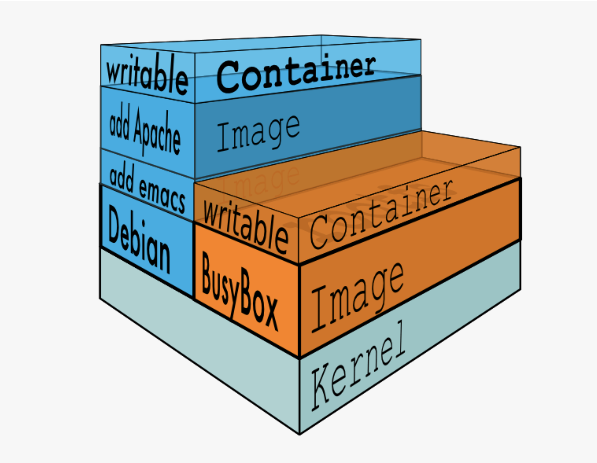
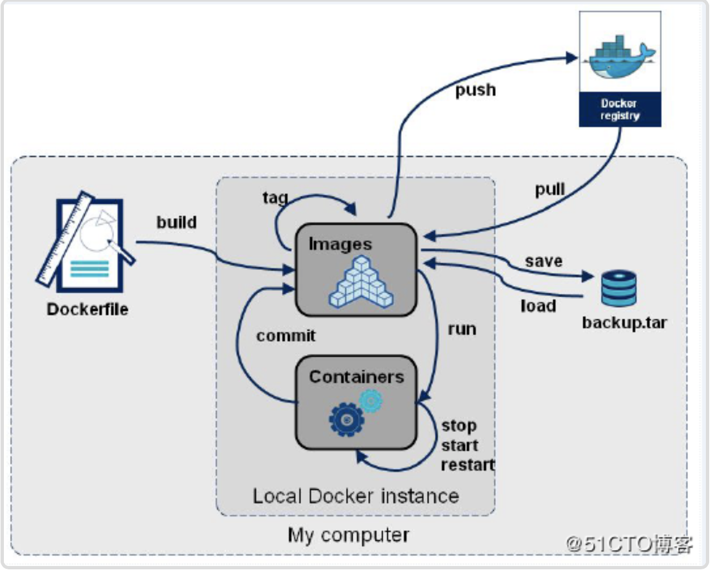
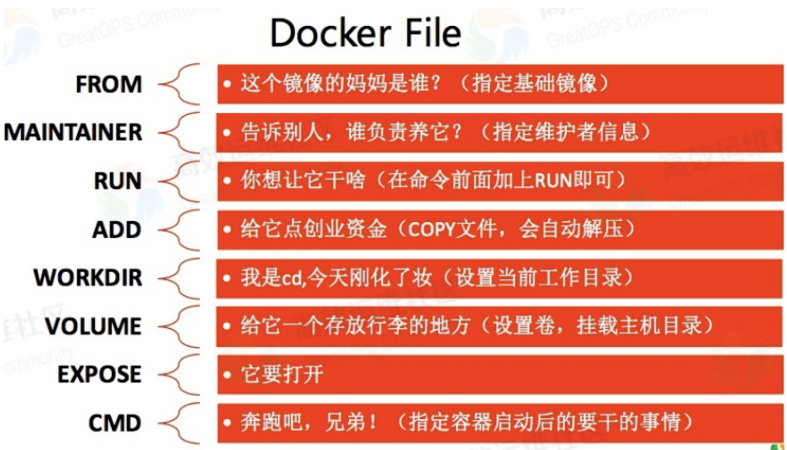
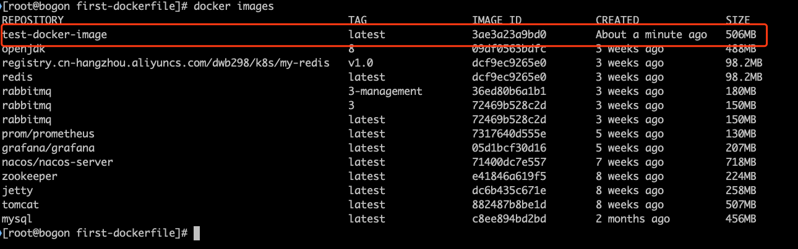
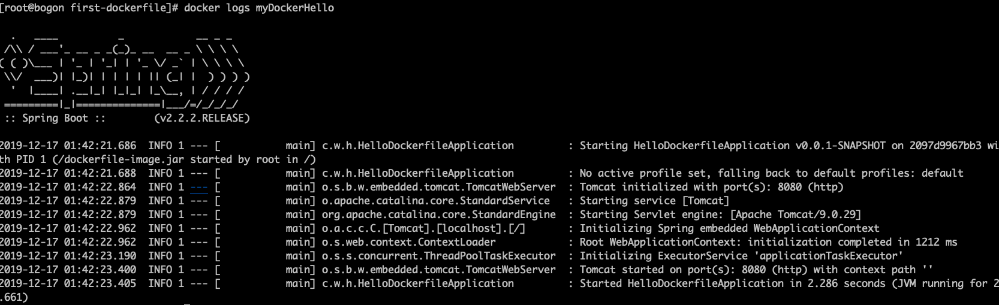
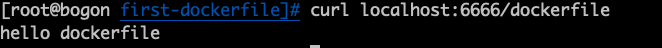
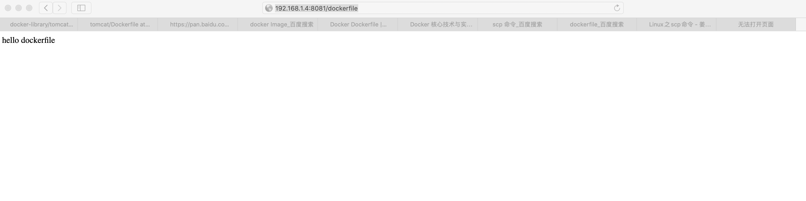
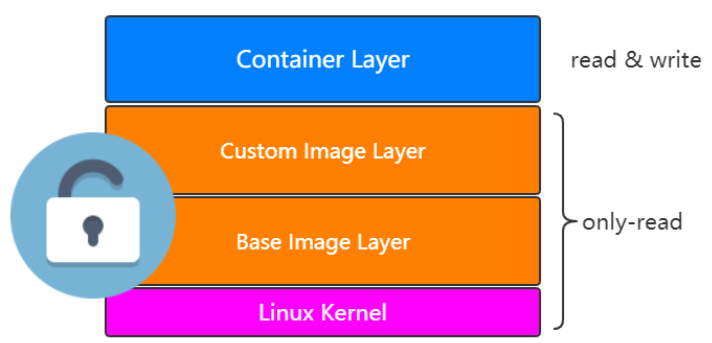

# 镜像和容器

前文介绍了镜像的原理如下图：



上面的这张图片非常好的展示了容器与镜像的关系，每一个镜像层都是建立在另一个镜像层之上的，同时所有的镜像层都是只读的，只有每个容器最顶层的容器层才可以被用户直接读写，所有的容器都建立在一些底层服务（Kernel）上，包括命名空间、控制组、rootfs 等等，这种容器的组装方式提供了非常大的灵活性，只读的镜像层通过共享也能够减少磁盘的占用。

## **Image**

### Dockerfile

在Docker中创建镜像最常用的方式，就是使用Dockerfile。Dockerfile是一个Docker镜像的描述文件，我们可以理解成火箭发射的A、B、C、D…的步骤。Dockerfile其内部**包含了一条条的指令**，**每一条指令构建一层，因此每一条指令的内容，就是描述该层应当如何构建**。



#### Dockerfile常用指令



##### FROM

指定基础镜像，比如FROM ubuntu:14.04

```dockerfile
FROM ubuntu:14.04
```

##### **RUN**

在镜像内部执行一些命令，比如安装软件，配置环境等，换行可以使用。

```dockerfile
RUN groupadd -r mysql && useradd -r -g mysql mysql
```

##### **ENV**

设置变量的值，ENV MYSQL_MA JOR 5.7，可以通过docker run --e key=value修改，后面可以直接使用${MYSQL_MA JOR}

```dockerfile
ENV MYSQL_MAJOR 5.7
```

##### **LABEL**

设置镜像标签

```dockerfile
LABEL email="itcrazy2016@163.com" 
LABEL name="itcrazy2016"
```

##### **VOLUME**

指定数据的挂在目录

```dockerfile
VOLUME /var/lib/mysql
```

##### **COPY**

将主机的文件复制到镜像内，如果目录不存在，会自动创建所需要的目录，注意只是复制，不会提取和解压

```dockerfile
COPY docker-entrypoint.sh /usr/local/bin/
```

##### **ADD**

将主机的文件复制到镜像内，和COPY类似，只是ADD会对压缩文件提取和解压

```dockerfile
ADD application.yml /etc/itcrazy2016/
```

##### **WORKDIR**

指定镜像的工作目录，之后的命令都是基于此目录工作，若不存在则创建

```dockerfile
WORKDIR /usr/local 
WORKDIR tomcat 
RUN touch test.txt
```

会在/usr/local/tomcat下创建test.txt文件

```dockerfile
WORKDIR /root 
ADD app.yml test/
```

会在/root/test下多出一个app.yml文件

##### **CMD**

容器启动的时候默认会执行的命令，若有多个CMD命令，则最后一个生效

```dockerfile
CMD ["mysqld"] 
或
CMD mysqld
```

##### **ENTRYPOINT**

和CMD的使用类似

```
ENTRYPOINT ["docker-entrypoint.sh"]
```

和CMD的不同:

docker run执行时，会覆盖CMD的命令，而ENTRYPOINT不会

##### **EXPOSE**

指定镜像要暴露的端口，启动镜像时，可以使用-p将该端口映射给宿主机

```dockerfile
EXPOSE 3306
```

#### Dockerfile实战Spring Boot项目

##### 创建一个Spring Boot项目

```xml
<dependency>
    <groupId>org.springframework.boot</groupId>
    <artifactId>spring-boot-starter-web</artifactId>
</dependency>
```

##### 写一个controller

```java
@RestController
public class DockerController {

    @GetMapping("/dockerfile")
    String dockerfile() {
        return "hello dockerfile";
    }
}
```

##### mvn clean package打成一个jar包

在target下找到`hello-dockerfile-0.0.1-SNAPSHOT.jar`,复制到docker的虚拟机环境。

```shell
scp -P 22 hello-dockerfile-0.0.1-SNAPSHOT.jar root@192.168.1.4:/root/
```

##### 在docker环境中新建一个目录"first-dockerfile"

```shell
mkdir first-dockerfile
cd first-dockerfile/
```

将jar包复制到该目录下

```shell
cp hello-dockerfile-0.0.1-SNAPSHOT.jar /root/first-dockerfile/
```

##### 创建Dockerfile文件

```shell
touch Dockerfile
```

编写内容

```dockerfile
FROM openjdk:8
MAINTAINER wenbin
LABEL name="dockerfile-demo" version="1.0" author="wenbin"
COPY hello-dockerfile-0.0.1-SNAPSHOT.jar dockerfile-image.jar
CMD ["java","-jar","dockerfile-image.jar"]
```

##### 基于Dockerfile构建镜像

```shell
docker build -t test-docker-image .
```

执行结果：

```shell
[root@bogon first-dockerfile]# docker build -t test-docker-image .
Sending build context to Docker daemon  17.62MB
Step 1/5 : FROM openjdk:8
 ---> 09df0563bdfc
Step 2/5 : MAINTAINER wenbin
 ---> Using cache
 ---> 2d6669a96805
Step 3/5 : LABEL name="dockerfile-demo" version="1.0" author="wenbin"
 ---> Using cache
 ---> aa0f2f982e25
Step 4/5 : COPY hello-dockerfile-0.0.1-SNAPSHOT.jar dockerfile-image.jar
 ---> c3bd9a6a6638
Step 5/5 : CMD ["java","-jar","dockerfile-image.jar"]
 ---> Running in d17d5d30f487
Removing intermediate container d17d5d30f487
 ---> 3ae3a23a9bd0
Successfully built 3ae3a23a9bd0
Successfully tagged test-docker-image:latest
```

image已经制作完成



##### 基于image创建container

```shell
docker run -d --name myDockerHello -p 6666:8080 test-docker-image
```

##### 查看启动日志

```shell
docker logs myDockerHello
```

输出结果：



##### 宿主机上访问

curl localhost:6666/dockerfile



##### 还可以再次启动一个

```shell
docker run -d --name myDockerHello02 -p 8081:8080 test-docker-image
```

局域网内访问：



### 镜像仓库

#### **docker hub**

hub.docker.com

```
(1)在docker机器上登录 docker login

(2)输入用户名和密码

(3)docker push dwb/test-docker-image
[注意镜像名称要和docker id一致，不然push不成功]

(4)给image重命名，并删除掉原来的
docker tag test-docker-image dwb/test-docker-image 
docker rmi -f test-docker-image

(5)再次推送，刷新hub.docker.com后台，发现成功

(6)别人下载，并且运行
docker pull dwb/test-docker-image
docker run -d --name user01 -p 6661:8080 dwb/test-docker-image
```

#### 阿里云docker hub

阿里云docker仓库

https://cr.console.aliyun.com/cn-hangzhou/instances/repositories

参考手册

https://cr.console.aliyun.com/repository/cn-hangzhou/dreamit/image-repo/details

```
(1)登录到阿里云docker仓库
docker login --username=dwb29872937343 registry.cn-beijing.aliyuncs.com
(2)输入密码 

(3)创建命名空间，比如dwb

(4)给image打tag
sudo docker tag [ImageId] registry.cn-beijing.aliyuncs.com/dwb/test-docker-image:v1.0

(5)推送镜像到docker阿里云仓库
sudo docker push registry.cn-hangzhou.aliyuncs.com/dwb/test-docker-image:v1.0

(6)别人下载，并且运行
docker pull registry.cn-hangzhou.aliyuncs.com/itcrazy2016/test-docker-image:v1.0
docker run -d --name user01 -p 6661:8080 registry.cn-hangzhou.aliyuncs.com/itcrazy2016/test-docker-image:v1.0
```

#### 搭建自己的Docker Harbor

```
(1)访问github上的harbor项目
https://github.com/goharbor/harbor
(2)下载版本，比如1.7.1 https://github.com/goharbor/harbor/releases
(3)找一台安装了docker-compose，上传并解压 tar -zxvf xxx.tar.gz
(4)进入到harbor目录 修改harbor.cfg文件，主要是ip地址的修改成当前机器的ip地址同时也可以看到Harbor的密码，默认是Harbor12345
(5)安装harbor，需要一些时间 sh install.sh
(6)浏览器访问，比如39.100.39.63，输入用户名和密码即可
```

### Image常见操作

```
(1)查看本地image列表 
docker images
docker image ls
(2)获取远端镜像 
docker pull
(3)删除镜像[注意此镜像如果正在使用，或者有关联的镜像，则需要先处理完] 
docker image 
rm imageid
docker rmi -f imageid
docker rmi -f $(docker image ls)
(4)运行镜像
docker run image
(5)发布镜像 
docker push
```

参考：https://www.runoob.com/docker/docker-images-command.html

## **Container**



其实可以理解为container只是基于image之后的layer而已，也就是可以通过docker run image 创建出一个container出来。

### container到image

既然container是基于image之上的，想想是否能够由一个container反推出image呢?

肯定是可以的，比如通过docker run运行起一个container出来，这时候对container对一些修 改，然后再生成一个新的image，这时候image的由来就不仅仅只能通过Dockerfile咯。

```
(1)拉取一个centos image
docker pull centos
(2)根据centos镜像创建出一个container
docker run -d -it --name my-centos centos
(3)进入my-centos容器中
docker exec -it my-centos bash
(4)输入vim命令
bash: vim: command not found
(5)我们要做的是对该container进行修改，也就是安装一下vim命令，然后将其生成一个新的centos
(6)在centos的container中安装vim 
yum install -y vim
(7)退出容器，将其生成一个新的centos，名称为"vim-centos-image" 
docker commit my-centos vim-centos-image
(8)查看镜像列表，并且基于"vim-centos-image"创建新的容器
docker run -d -it --name my-vim-centos vim-centos-image
(9)进入到my-vim-centos容器中，检查vim命令是否存在 
docker exec -it my-vim-centos bash
vim
```

结论 :可以通过docker commit命令基于一个container重新生成一个image，但是一般得到image的 方式不建议这么做，不然image怎么来的就全然不知咯。

### container资源限制

如果不对container的资源做限制，它就会无限制地使用物理机的资源，这样显然是不合适的。

#### 内存限制

```shell
--memory Memory limit
如果不设置 --memory-swap，其大小和memory一样
docker run -d --memory 100M --name tomcat1 tomcat
```

#### CPU限制

```
--cpu-shares 权重
docker run -d --cpu-shares 10 --name tomcat2 tomcat
```

### container常见操作

```
(1)根据镜像创建容器
docker run -d --name -p 9090:8080 my-tomcat tomcat

(2)查看运行中的container 
docker ps

(3)查看所有的container[包含退出的] 
docker ps -a

(4)删除container
docker rm containerid 
docker rm -f $(docker ps -a)

(5)进入到一个container中
docker exec -it container bash

(6)根据container生成image 
docker commit container imageName

(7)查看某个container的日志 
docker logs container

(8)查看容器资源使用情况 
docker stats

(9)查看容器详情信息
docker inspect container

(10)停止/启动容器
docker stop/start container
```

