# Docker网络

docker网络官网 https://docs.docker.com/network/

## 计算机网络模型

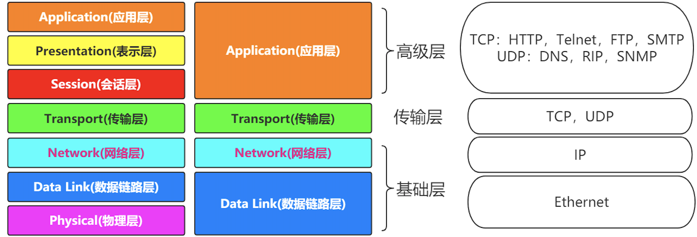

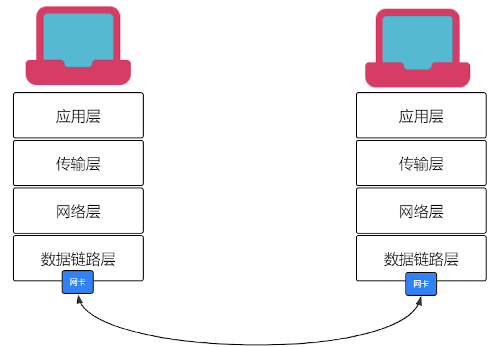

## Linux中的网卡

### 查看网卡[网络接口]

ip a 表示ip address (show)

相当于显示IP地址信息，偏向于上层。

ip link (show) 表示链路层的信息，更底层，偏向于物理层，如你可以设置网卡的up down.

那么就是 ip link set down ethX, ip link set up ethX。

ls /sys/class/net

### 网卡

#### ip a解读

状态:UP/DOWN/UNKOWN等 

link/ether:MAC地址 

inet:绑定的IP地址

#### 配置文件

在Linux中网卡对应的其实就是文件，所以找到对应的网卡文件即可

比如:cat /etc/sysconfig/network-scripts/ifcfg-eth0

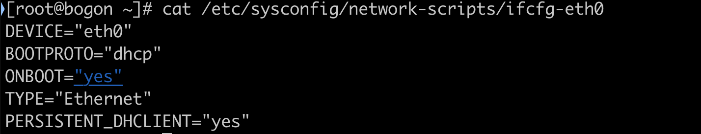

#### 给网卡添加IP地址

当然，这块可以直接修改ifcfg-*文件，但是我们通过命令添加试试

(1)添加ip地址：ip addr add 192.168.0.100/24 dev eth0

(2)删除IP地址：ip addr delete 192.168.0.100/24 dev eth0

#### 网卡启动与关闭

重启网卡 :service network restart / systemctl restart network 

启动/关闭某个网卡 :ifup/ifdown eth0 or ip link set eth0 up/down

## Network Namespace

在linux上，网络的隔离是通过network namespace来管理的，不同的network namespace是互相隔离的

==ip netns list:查看当前机器上的network namespace==

### network namespace的管理

```shell
ip netns list #查看 
ip netns add ns1 #添加 
ip netns delete ns1 #删除
```

### namespace实战

1. 创建一个network namespace

   ```shell
   ip netns add ns1
   ```

2. 查看该namespace下网卡的情况

   ```shell
   ip netns exec ns1 ip a
   ```

   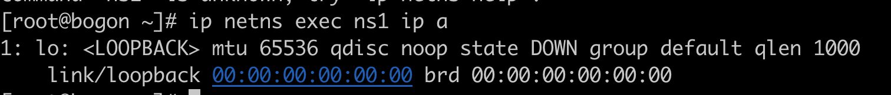

3. 启动ns1上的lo网卡

   ```sh
   ip netns exec ns1 ifup lo
   or
   ip netns exec ns1 ip link set lo up
   ```

4. 再次查看

   可以发现state变成了UNKOWN

   ```shell
   ip netns exec ns1 ip a
   ```

   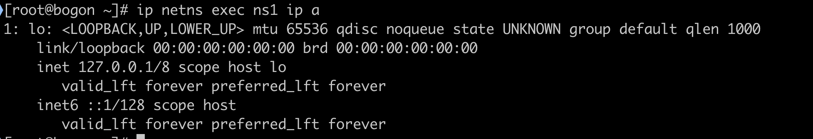

5. 再次创建一个network namespace

   ```shell
   ip netns add ns2
   ```

   现在我们有了两个命名空间

   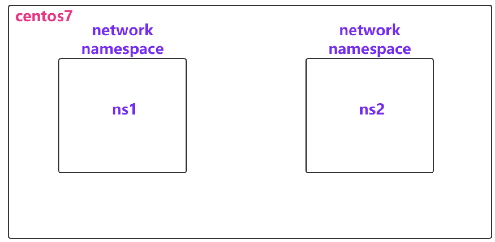

6. 此时想让两个namespace网络连通起来

   veth pair :Virtual Ethernet Pair，是一个成对的端口，可以实现上述功能

   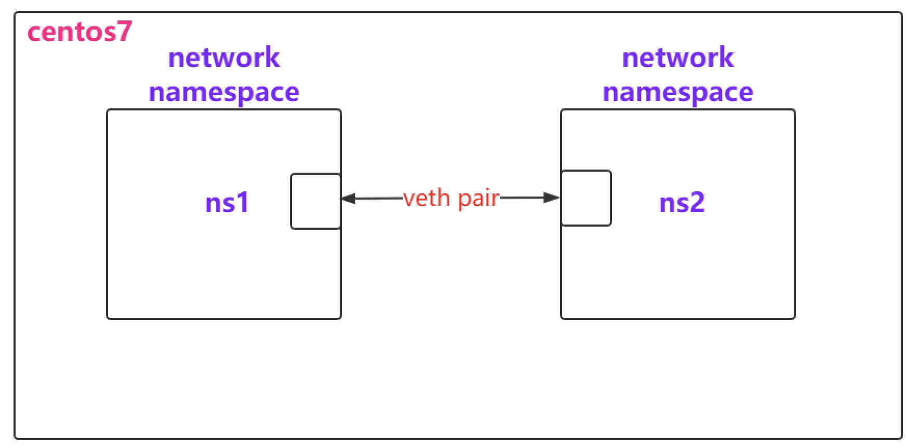

7. 创建一对link，也就是接下来要通过veth pair连接的link

   ```shell
   ip link add veth-ns1 type veth peer name veth-ns2
   ```

8. 查看link情况

   ```shell
   ip link
   ```

   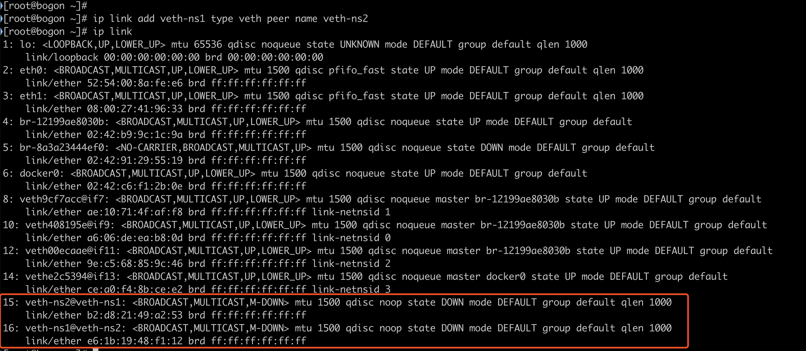

9. 将veth-ns1加入ns1中，将veth-ns2加入ns2中

   ```shell
    ip link set veth-ns1 netns ns1
    ip link set veth-ns1 netns ns2
   ```

10. 查看宿主机和ns1，ns2的link情况

    ```shell
    ip link
    ip netns exec ns1 ip link
    ip netns exec ns2 ip link
    ```

    宿主机:

    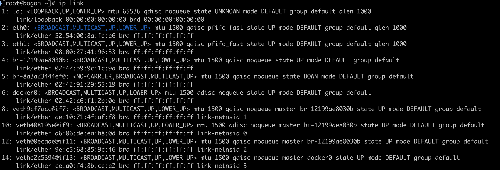

    ns1:

    

    ns2:

    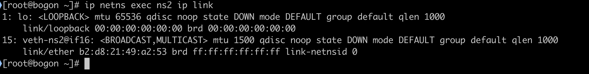

11. 此时veth-ns1和veth-ns2还没有ip地址，显然通信还缺少点条件

    ```shell
    ip netns exec ns1 ip addr add 192.168.0.11/24 dev veth-ns1 
    ip netns exec ns2 ip addr add 192.168.0.12/24 dev veth-ns2
    ```

12. 再次查看，发现state是DOWN，并且还是没有IP地址

    ```shell
    ip netns exec ns1 ip link
    ip netns exec ns2 ip link
    ```

    

13. 启动veth-ns1和veth-ns2

    ```
    ip netns exec ns1 ip link set veth-ns1 up 
    ip netns exec ns2 ip link set veth-ns2 up
    ```

14. 再次查看，发现state是UP，同时有IP

    ```
    ip netns exec ns1 ip a
    ip netns exec ns2 ip a
    ```

    

15. 此时两个network namespace互相ping一下，发现是可以ping通的

    ```
    ip netns exec ns1 ping 192.168.0.12 
    ip netns exec ns2 ping 192.168.0.11
    ```

    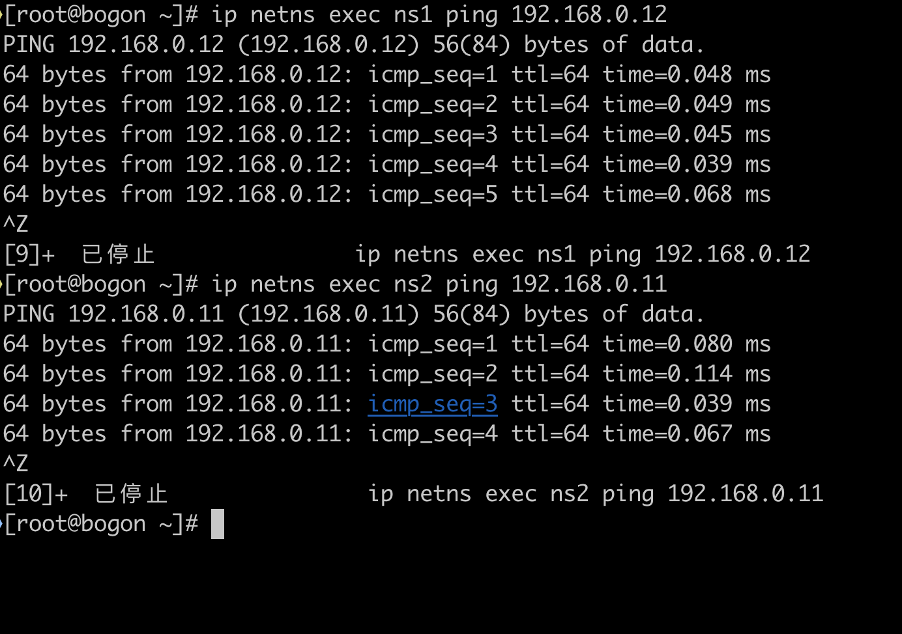


### Container的Namespace

实际上每个container，都会有自己的network namespace，并且是独立的，我们可以进入到容器中进行验证。

1. 创建两个container看看?

   ```shell
   docker run -d --name tomcat01 -p 8081:8080 tomcat
   docker run -d --name tomcat02 -p 8082:8080 tomcat
   ```

2. 进入到两个容器中，并且查看ip

   ```
   docker exec -it tomcat01 ip a 
   docker exec -it tomcat02 ip a
   ```

   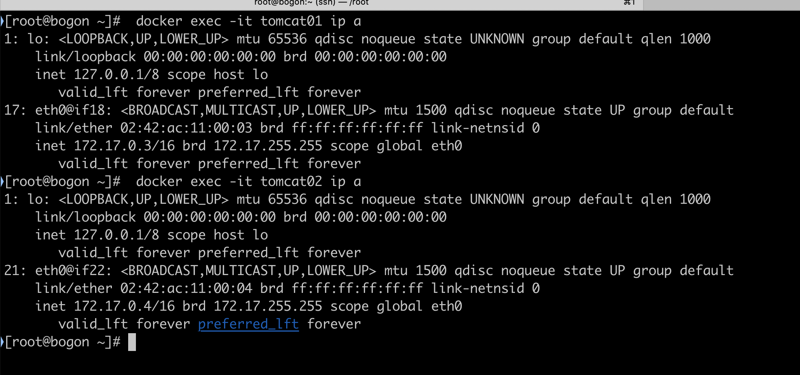

3. 互相ping一下是可以ping通

   ```
   docker exec -it tomcat01 ping 172.17.0.4
   docker exec -it tomcat02 ping 172.17.0.3
   ```

   

值得我们思考的是，此时tomcat01和tomcat02属于两个network namespace，是如何能够ping通的? 有些小伙伴可能会想，不就跟上面的namespace实战一样吗?注意这里并没有veth-pair技术

## 深入分析container网络-Bridge

### docker0默认bridge

1. 查看centos的网络:ip a，可以发现

   ```shell
   6: docker0: <BROADCAST,MULTICAST,UP,LOWER_UP> mtu 1500 qdisc noqueue state UP group default
       link/ether 02:42:c6:f1:2b:0e brd ff:ff:ff:ff:ff:ff
       inet 172.17.0.1/16 brd 172.17.255.255 scope global docker0
          valid_lft forever preferred_lft forever
       inet6 fe80::42:c6ff:fef1:2b0e/64 scope link
   18: vethc851029@if17: <BROADCAST,MULTICAST,UP,LOWER_UP> mtu 1500 qdisc noqueue master docker0 state UP group default
       link/ether 72:29:ce:c5:36:32 brd ff:ff:ff:ff:ff:ff link-netnsid 6
       inet6 fe80::7029:ceff:fec5:3632/64 scope link
          valid_lft forever preferred_lft forever
   ```

2. 查看容器tomcat01的网络:docker exec -it tomcat01 ip a，可以发现

   ```shell
   1: lo: <LOOPBACK,UP,LOWER_UP> mtu 65536 qdisc noqueue state UNKNOWN group default qlen 1000
       link/loopback 00:00:00:00:00:00 brd 00:00:00:00:00:00
       inet 127.0.0.1/8 scope host lo
          valid_lft forever preferred_lft forever
   17: eth0@if18: <BROADCAST,MULTICAST,UP,LOWER_UP> mtu 1500 qdisc noqueue state UP group default
       link/ether 02:42:ac:11:00:03 brd ff:ff:ff:ff:ff:ff link-netnsid 0
       inet 172.17.0.3/16 brd 172.17.255.255 scope global eth0
          valid_lft forever preferred_lft forever
   ```

3. 在centos中ping一下tomcat01的网络，发现可以ping通

   ```shell
   [root@bogon ~]# ping 172.17.0.3
   PING 172.17.0.3 (172.17.0.3) 56(84) bytes of data.
   64 bytes from 172.17.0.3: icmp_seq=1 ttl=64 time=0.087 ms
   64 bytes from 172.17.0.3: icmp_seq=2 ttl=64 time=0.072 ms
   64 bytes from 172.17.0.3: icmp_seq=3 ttl=64 time=0.042 ms
   64 bytes from 172.17.0.3: icmp_seq=4 ttl=64 time=0.043 ms
   ^Z
   [11]+  已停止               ping 172.17.0.3
   ```

4. 既然可以ping通，而且centos和tomcat1又属于不同的network namespace，是怎么连接的?

   很显然，跟之前的实战是一样的，画个图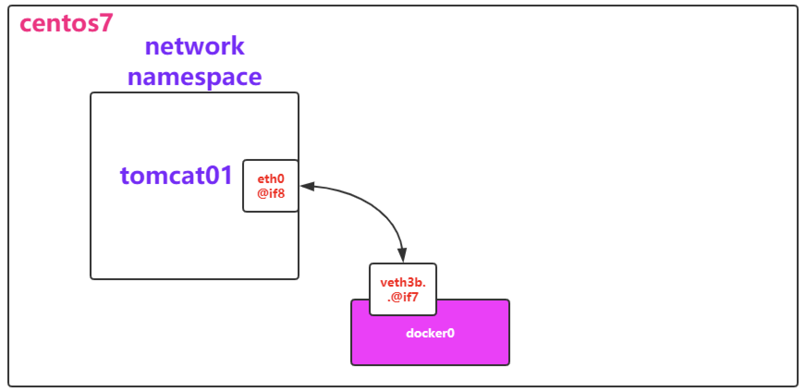

5. 也就是说，在tomcat01中有一个eth0和centos的docker0中有一个veth3是成对的，类似于之前实战中的 veth-ns1和veth-ns2，不妨再通过一个命令确认下:brctl

   ```shell
   安装一下:yum install bridge-utils 
   brctl show
   ```

   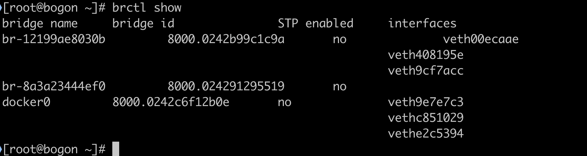

6. 那为什么tomcat01和tomcat02能ping通呢?不多说，直接上图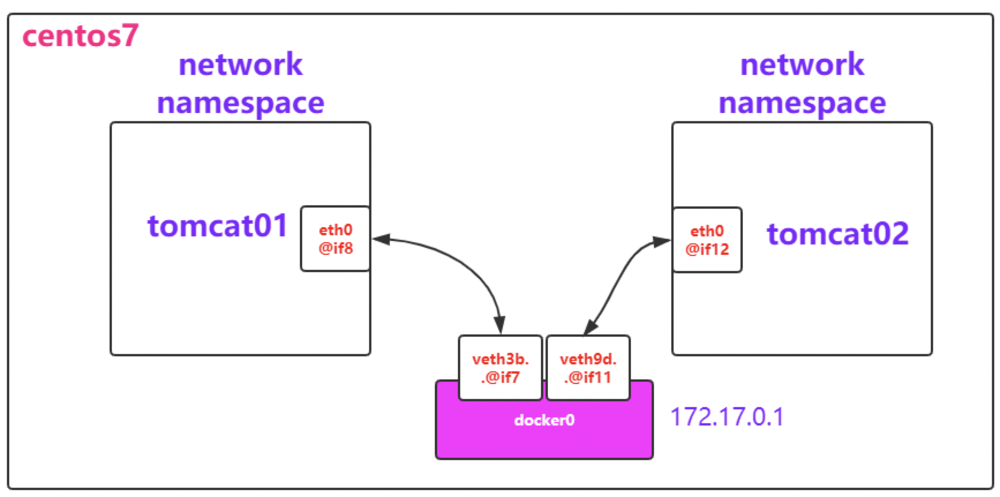

7. 这种网络连接方法我们称之为Bridge，其实也可以通过命令查看docker中的网络模式:`docker network ls bridge`也是docker中默认的网络模式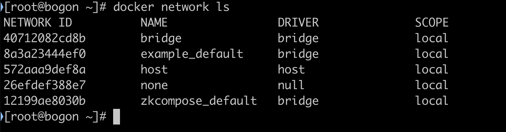

8. 不妨检查一下bridge

   ```
   docker network inspect bridge
   ```

   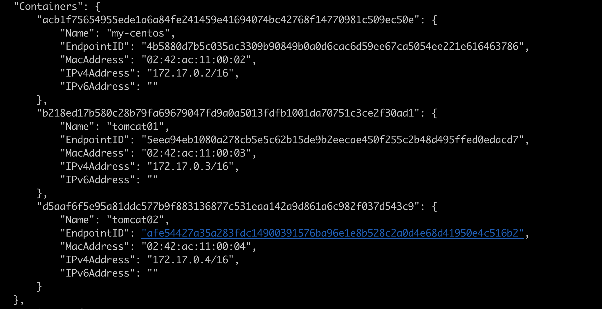

9. 在tomcat01容器中是可以访问互联网的，顺便把这张图画一下咯，NAT是通过iptables实现的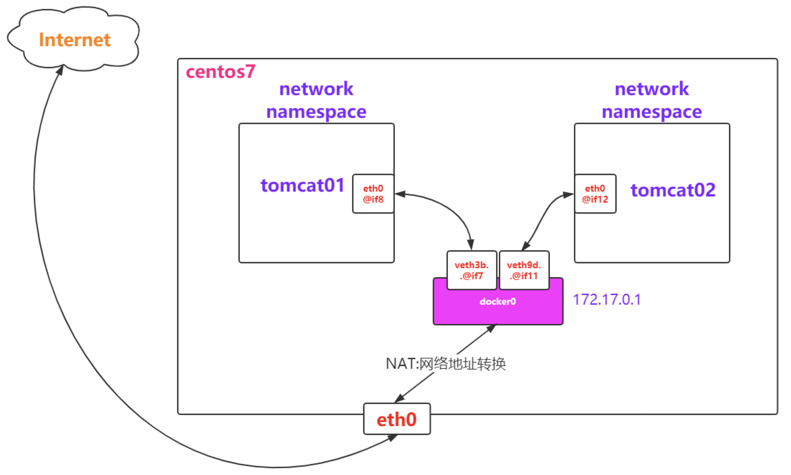

### 创建自己的network

1. 创建一个network，类型为bridge

   ```
   docker network create tomcat-net
   or
   docker network create --subnet=172.18.0.0/24 tomcat-net
   ```

2. 查看已有的network

   ```
   docker network ls
   ```

   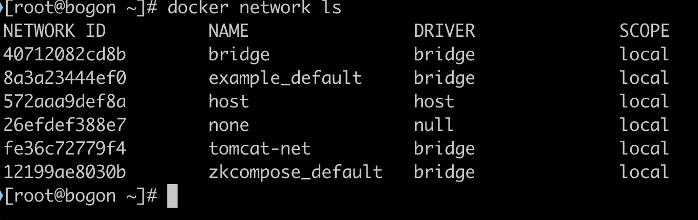

3. 查看tomcat-net详情信息

   ```
   docker network inspect tomcat-net
   ```

   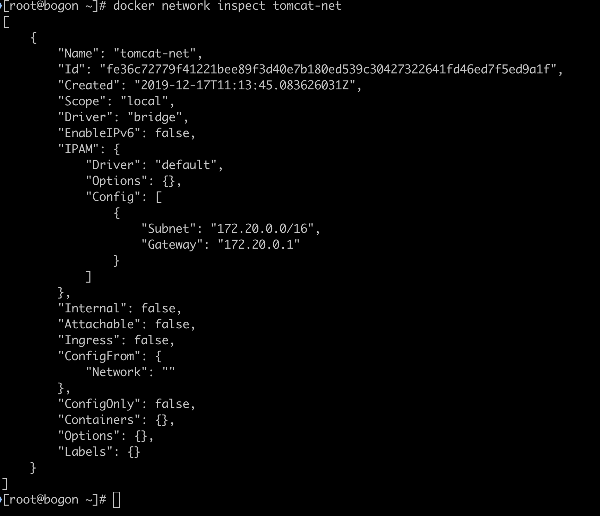

4. 创建tomcat的容器，并且指定使用tomcat-net

   ```
   docker run -d --name custom-net-tomcat --network tomcat-net tomcat
   ```

5. 查看custom-net-tomcat的网络信息

   ```
   docker exec -it custom-net-tomcat ip a
   ```

   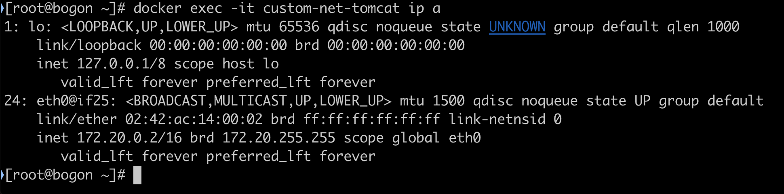

6. 查看网卡信息

   ```
   ip a
   ```

   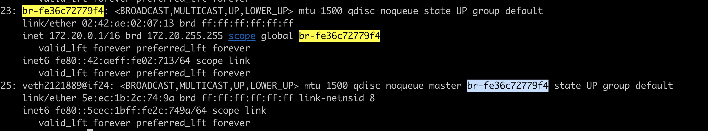

7. 查看网卡接口

   ```
   brctl show
   ```

   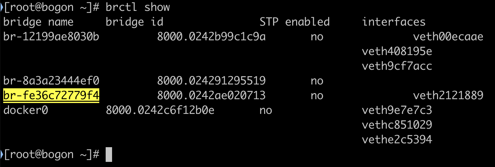

8. 此时在custom-net-tomcat容器中ping一下tomcat01的ip会如何?发现无法ping通

   ```
   docker exec -it custom-net-tomcat ping 172.17.0.3
   ```

   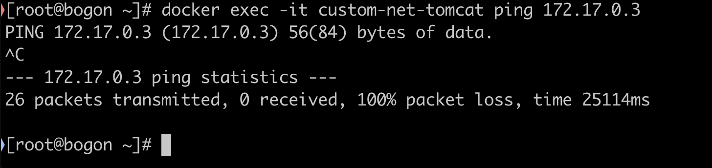

9. 此时如果tomcat01容器能够连接到tomcat-net上应该就可以咯

   ```
   docker network connect tomcat-net tomcat01
   ```

10. 查看tomcat-net网络，可以发现tomcat01这个容器也在其中

    ```
    docker network inspect tomcat-net
    ```

    

11. 此时进入到tomcat01或者custom-net-tomcat中，不仅可以通过ip地址ping通，而且可以通过名字ping到，这时候因为都连接到了用户自定义的tomcat-net bridge上

    ```
    docker exec -it tomcat01 bash
    ```

    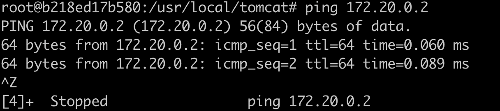

    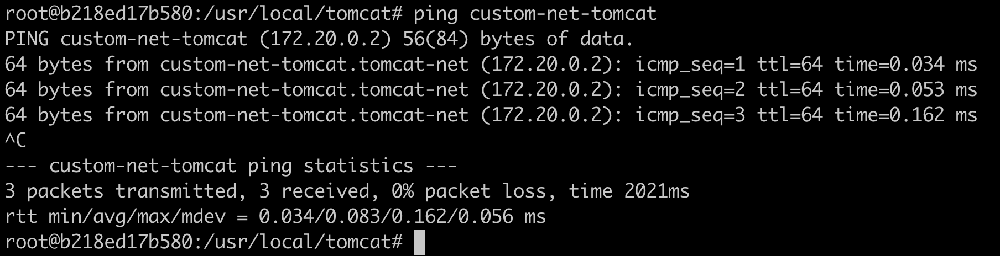


## 深入分析Container网络-Host & None

### Host

1. 创建一个tomcat容器，并且指定网络为host

   ```
   docker run -d --name my-tomcat-host --network host tomcat
   ```

2. 查看ip地址

   ```
   docker exec -it my-tomcat-host ip a 
   可以发现和centos是一样的
   ```

3. 检查host网络

   ```
   docker network inspect host
   ```

   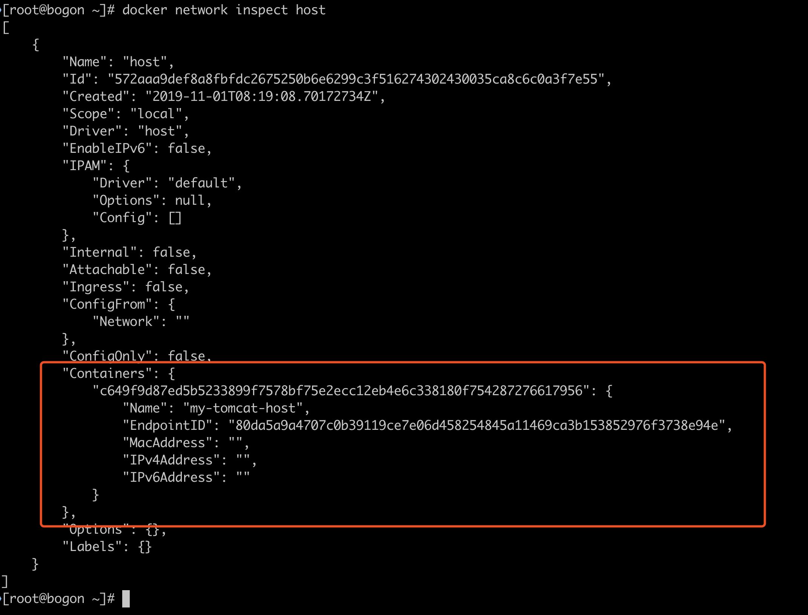

### None

1. 创建一个tomcat容器，并且指定网络为none

   ```
   docker run -d --name my-tomcat-none --network none tomcat
   ```

2. 查看ip地址

   ```
   docker exec -it my-tomcat-none ip a
   ```

   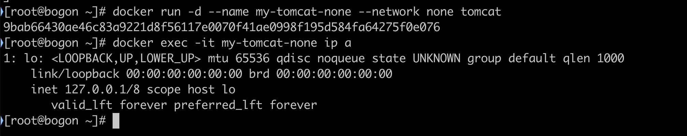

3. 检查none网络

   ```
   docker network inspect none
   ```

   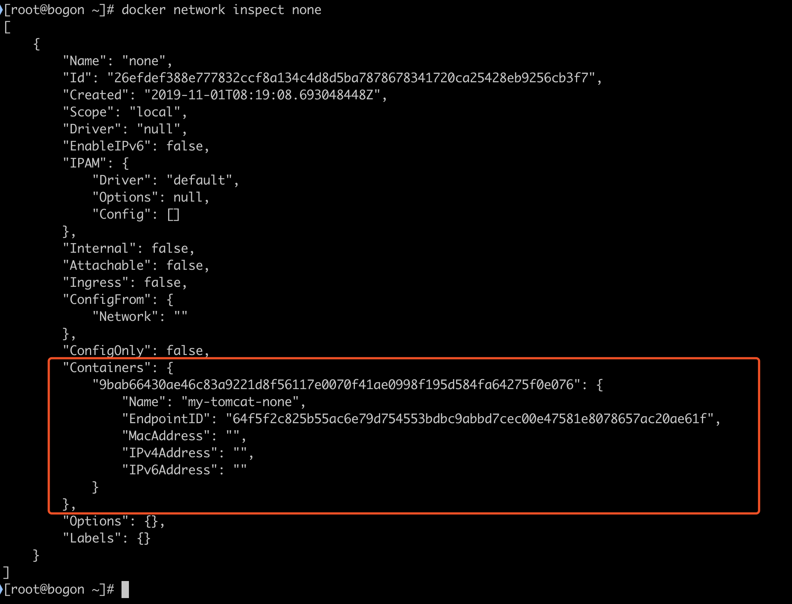

## 端口映射

1. 创建一个tomcat容器，名称为port-tomcat

   ```
   docker run -d --name port-tomcat tomcat
   ```

2. 思考一下要访问该tomcat怎么做?肯定是通过ip:port方式

   ```
    docker exec -it port-tomcat bash 
    curl localhost:8080
   ```

3. 那如果要在centos7上访问呢?

   ```
   docker exec -it port-tomcat ip a ---->得到其ip地址，比如172.17.0.4 
   curl 172.17.0.4:8080
   ```

   小结 :之所以能够访问成功，是因为centos上的docker0连接了port-tomcat的network namespace

4. 那如果要在centos7通过curl localhost方式访问呢?显然就要将port-tomcat的8080端口映射到centos上

   ```
   docker rm -f port-tomcat
   docker run -d --name port-tomcat -p 8090:8080 tomcat 
   curl localhost:8090
   ```


centos7是运行在macOS上的虚拟机，如果想要在macOS上通过ip:port方式访问呢?

```
#此时需要centos和win网络在同一个网段，所以在Vagrantfile文件中

#这种方式等同于桥接网络。也可以给该网络指定使用物理机哪一块网卡，比如 
#config.vm.network"public_network",:bridge=>'en1: Wi-Fi (AirPort)' 
config.vm.network"public_network"
centos7: ip a --->192.168.8.118 macOS:浏览器访问 192.168.8.118:9080
```

