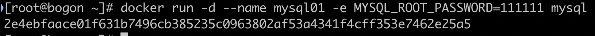
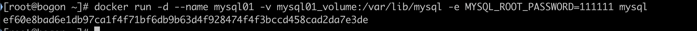
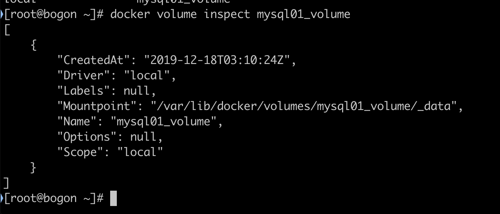
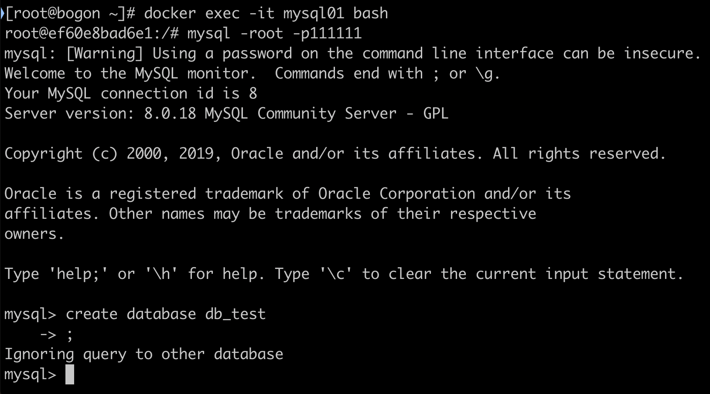
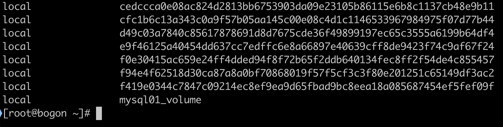
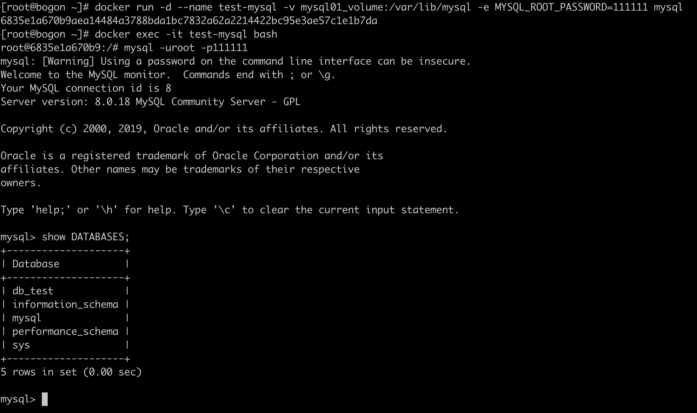
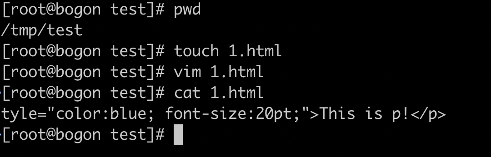
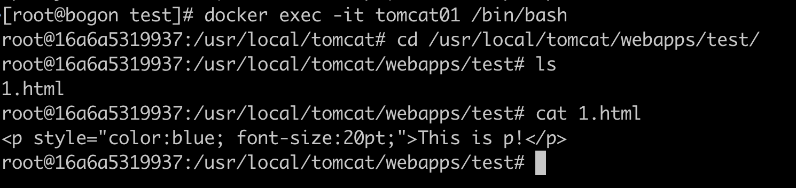
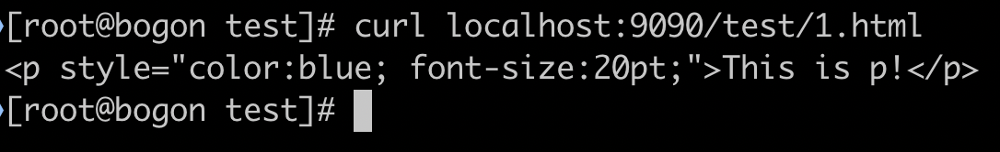
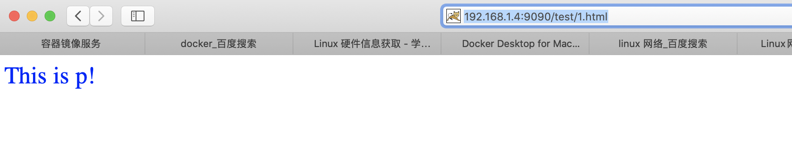

# Docker数据持久化与练习

## 数据持久化

### **Volume**

1. 创建mysql数据库的container

   ```
   docker run -d --name mysql01 -e MYSQL_ROOT_PASSWORD=111111 mysql
   ```

   

2. 查看volume

   ```
   docker volume ls
   ```

3. 具体查看该volume

   ```
   docker volume inspect 5f0cf0f385cee58175c0e748a8cb1ad4e9b4702d5a68721b472fa2b52f1850da
   ```

4. 名字不好看，name太长，修改一下

   ```
   docker run -d --name mysql01 -v mysql01_volume:/var/lib/mysql -e MYSQL_ROOT_PASSWORD=111111 mysql
   ```

   

5. 查看volume

   ```
   docker volume ls
   ```

   

   ```
   docker volume inspect mysql01_volume
   ```

   

6. 真的能够持久化保存数据吗?不妨来做个实验

   ```
   # 进入容器中
   docker exec -it mysql01 bash
   # 登录mysql服务
   mysql -uroot -pjack123
   # 创建测试库
   create database db_test;
   ```

   

   退出mysql服务，退出mysql container

   ```
   # 删除mysql容器
   docker rm -f mysql01
   # 查看volume
   docker volume ls
   ```

   

   发现volume还在

   ```
   # 新建一个mysql container，并且指定使用"mysql01_volume"
   docker run -d --name test-mysql -v mysql01_volume:/var/lib/mysql -e MYSQL_ROOT_PASSWORD=111111 mysql
   # 进入容器，登录mysql服务，查看数据库 
   docker exec -it test-mysql bash 
   mysql -uroot -p111111
   show DATABASES;
   ```

   

   可以发现db_test仍然在

### **Bind Mounting**

1. 创建一个tomcat容器

   ```
   docker run -d --name tomcat01 -p 9090:8080 -v /tmp/test:/usr/local/tomcat/webapps/test tomcat
   ```

2. 查看两个目录

   ```
   centos:cd /tmp/test
   tomcat容器:cd /usr/local/tomcat/webapps/test
   ```

3. 在centos的/tmp/test中新建1.html，并写一些内容

   ```
   <p style="color:blue; font-size:20pt;">This is p!</p>
   ```

   

   

4. 进入tomcat01的对应目录查看，发现也有一个1.html，并且也有内容

   

5. 在centos7上访问该路径:curl localhost:9090/test/1.html

   

6. 在mac浏览器中通过ip访问

   

