# Docker数据持久化与练习

## 数据持久化

### **Volume**

1. 创建mysql数据库的container

   ```
   docker run -d --name mysql01 -e MYSQL_ROOT_PASSWORD=111111 mysql
   ```

   

2. 查看volume

   ```
   docker volume ls
   ```

3. 具体查看该volume

   ```
   docker volume inspect 5f0cf0f385cee58175c0e748a8cb1ad4e9b4702d5a68721b472fa2b52f1850da
   ```

4. 名字不好看，name太长，修改一下

   ```
   docker run -d --name mysql01 -v mysql01_volume:/var/lib/mysql -e MYSQL_ROOT_PASSWORD=111111 mysql
   ```

   

5. 查看volume

   ```
   docker volume ls
   ```

   

   ```
   docker volume inspect mysql01_volume
   ```

   

6. 真的能够持久化保存数据吗?不妨来做个实验

   ```
   # 进入容器中
   docker exec -it mysql01 bash
   # 登录mysql服务
   mysql -uroot -pjack123
   # 创建测试库
   create database db_test;
   ```

   

   退出mysql服务，退出mysql container

   ```
   # 删除mysql容器
   docker rm -f mysql01
   # 查看volume
   docker volume ls
   ```

   

   发现volume还在

   ```
   # 新建一个mysql container，并且指定使用"mysql01_volume"
   docker run -d --name test-mysql -v mysql01_volume:/var/lib/mysql -e MYSQL_ROOT_PASSWORD=111111 mysql
   # 进入容器，登录mysql服务，查看数据库 
   docker exec -it test-mysql bash 
   mysql -uroot -p111111
   show DATABASES;
   ```

   

   可以发现db_test仍然在

### **Bind Mounting**

1. 创建一个tomcat容器

   ```
   docker run -d --name tomcat01 -p 9090:8080 -v /tmp/test:/usr/local/tomcat/webapps/test tomcat
   ```

2. 查看两个目录

   ```
   centos:cd /tmp/test
   tomcat容器:cd /usr/local/tomcat/webapps/test
   ```

3. 在centos的/tmp/test中新建1.html，并写一些内容

   ```
   <p style="color:blue; font-size:20pt;">This is p!</p>
   ```

   

   

4. 进入tomcat01的对应目录查看，发现也有一个1.html，并且也有内容

   

5. 在centos7上访问该路径:curl localhost:9090/test/1.html

   

6. 在mac浏览器中通过ip访问

   

## Docker 实战练习

镜像（Image）、容器（Container）、仓库（Repository）、网络（network）、数据卷（data volumes），是Docker中最基本也是最核心的概念，到现在已经都学习过了。整合这些知识做一些练习。

### MySQL高可用集群搭建

使用docker搭建一个如下图所示的mySql高可用集群

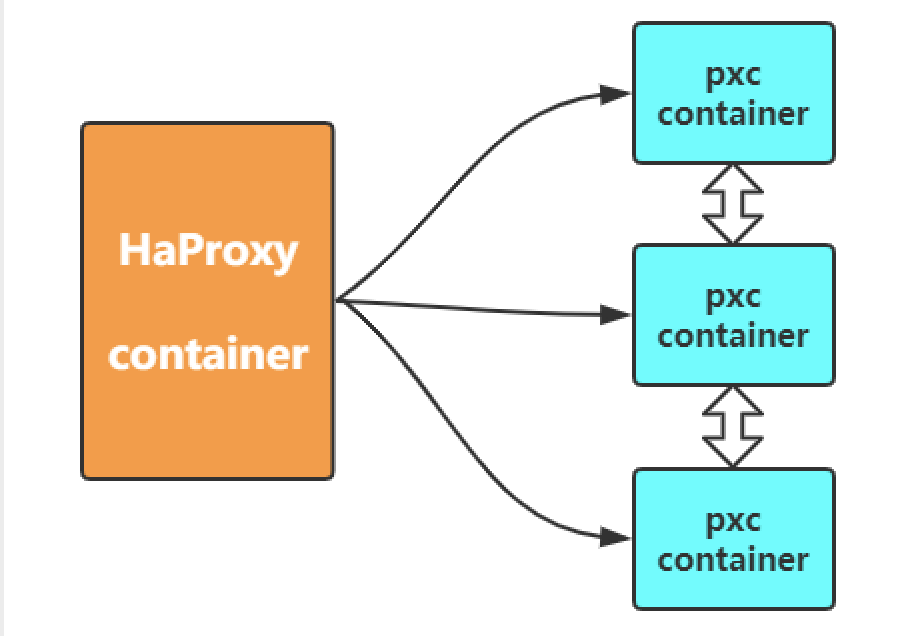

#### percona-xtradb-cluster简介

Percona XtraDB Cluster---MySQL高可用性解决方案。

项目地址： http://www.percona.com/doc/percona-xtradb-cluster/intro.html

Percona XtraDB Cluster是MySQL高可用性和可扩展性的解决方案.

Percona XtraDB Cluster提供的特性有：

1. 同步复制，事务要么在所有节点提交或不提交。
2. 多主复制，可以在任意节点进行写操作。
3. 在从服务器上并行应用事件，真正意义上的并行复制。
4. 节点自动配置。
5. 数据一致性，不再是异步复制。

Percona XtraDB Cluster完全兼容MySQL和Percona Server，表现在：

1. 数据的兼容性
2. 应用程序的兼容性：无需更改应用程序
3. 集群是有节点组成的，推荐配置至少3个节点，但是也可以运行在2个节点上。
4. 每个节点都是普通的mysql/percona服务器，可以将现有的数据库服务器组成集群，反之，也可以将集群拆分成单独的服务器。
5. 每个节点都包含完整的数据副本。


优点如下：

1. 当执行一个查询时，在本地节点上执行。因为所有数据都在本地，无需远程访问。
2. 无需集中管理。可以在任何时间点失去任何节点，但是集群将照常工作。
3. 良好的读负载扩展，任意节点都可以查询。

缺点如下：

1. 加入新节点，开销大。需要复制完整的数据。
2. 不能有效的解决写缩放问题，所有的写操作都将发生在所有节点上。
3. 有多少个节点就有多少重复的数据。

**Percona XtraDB Cluster与MySQL Replication区别在于：**

分布式系统的CAP理论。

C---一致性，所有节点的数据一致。

A---可用性，一个或多个节点失效，不影响服务请求。

P---分区容忍性，节点间的连接失效，仍然可以处理请求。

任何一个分布式系统，需要满足这三个中的两个。

MySQL Replication: 可用性和分区容忍性

Percona XtraDB Cluster: 一致性和可用性

因此MySQL Replication并不保证数据的一致性，而Percona XtraDB Cluster提供数据一致性。

Percona XtraDB Cluster组件：

Percona XtraDB Cluster基于XtraDB的Percona Server以及包含写复制集补丁。使用Galera 2.x library，事务型应用下的通用的多主同步复制插件。

Galera 2.x新特性有：

1.IST(Incremental State Transfer)增量状态传输。对于WAN特别有用。

2.RSU(Rolling Schema Update)旋转更新架构。不会阻止对表进行操作。

#### 集群搭建

percona-xtradb-cluster在dockerhub中提供了快速搭建集群环境的镜像。帮助我们快速搭建集群环境。

1. 拉取pxc镜像

   ```
   docker pull percona/percona-xtradb-cluster:5.7.21
   ```

   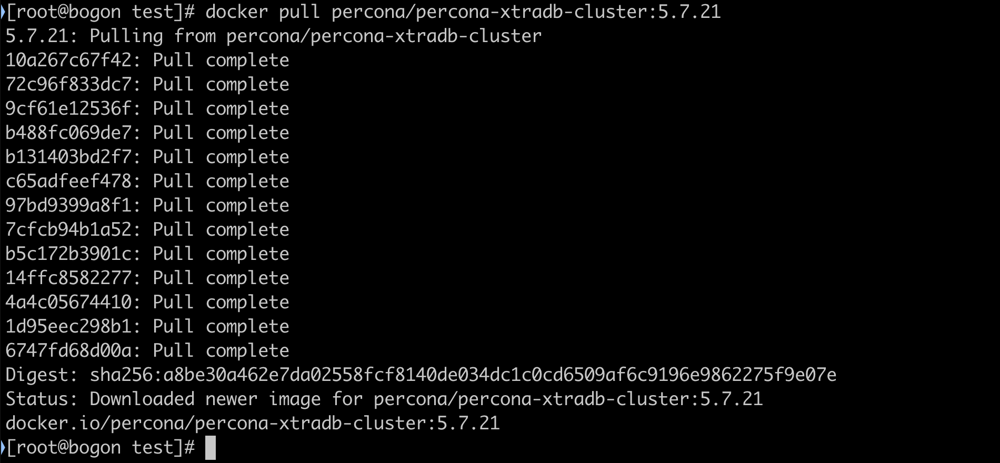

2. 复制pxc镜像(实则重命名)

   ```
   docker tag percona/percona-xtradb-cluster:5.7.21 pxc
   ```

   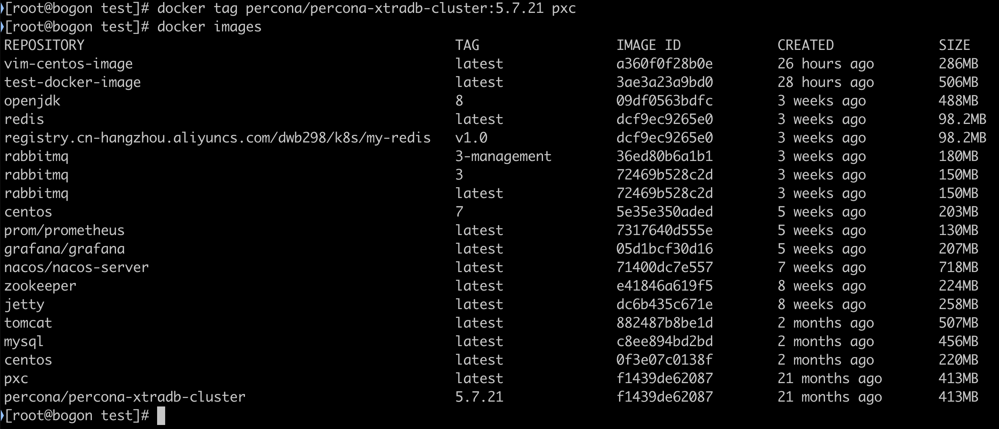

3. 删除pxc原来的镜像

   ```
   docker rmi percona/percona-xtradb-cluster:5.7.21
   ```

   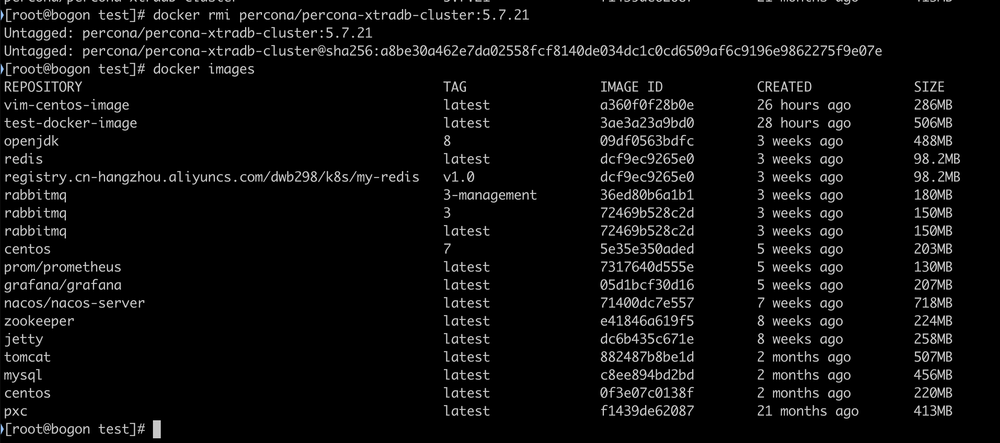

4. 创建一个单独的网段，给mysql数据库集群使用

   ```
   (1)docker network create --subnet=172.25.0.0/24 pxc-net 
   (2)docket network inspect pxc-net [查看详情]
   (3)docker network rm pxc-net [删除]
   ```

   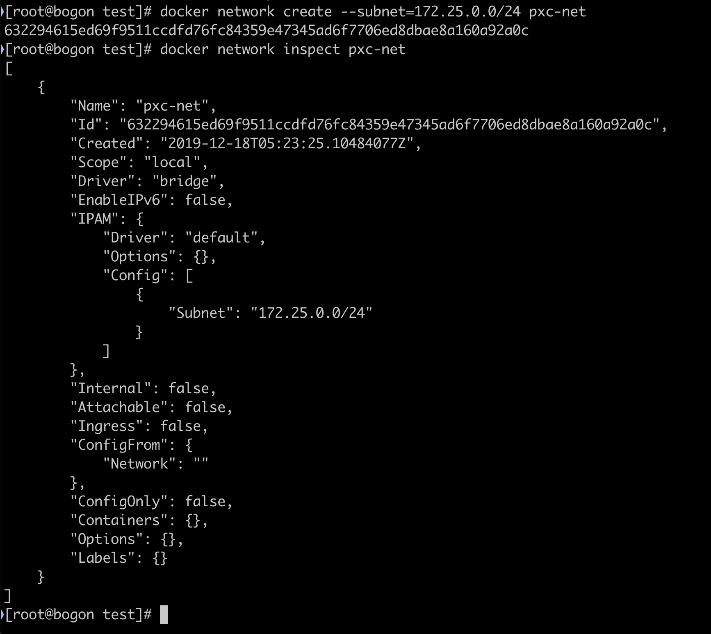

5. 创建和删除volume

   ```
   创建:docker volume create --name v1
   删除:docker volume rm v1 
   查看详情:docker volume inspect v1
   ```

6. 创建单个PXC容器demo

   ```
   [CLUSTER_NAME PXC集群名字] 
   [XTRABACKUP_PASSWORD数据库同步需要用到的密码]
   
   docker run -d -p 3301:3306
   -v v1:/var/lib/mysql
   -e MYSQL_ROOT_PASSWORD=111111
   -e CLUSTER_NAME=PXC
   -e XTRABACKUP_PASSWORD=111111
   --privileged --name=node1 --net=pxc-net --ip 172.25.0.2 pxc
   
   ```

7. 搭建PXC[MySQL]集群

   1. 准备3个数据卷

      ```
      docker volume create --name v1 
      docker volume create --name v2 
      docker volume create --name v3
      ```

      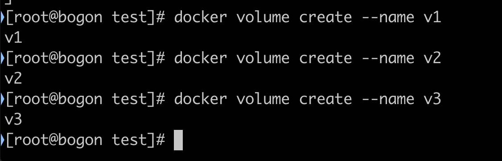

   2. 运行三个PXC容器

      ```
      docker run -d -p 3301:3306 -v v1:/var/lib/mysql -e MYSQL_ROOT_PASSWORD=111111 -e CLUSTER_NAME=PXC -e XTRABACKUP_PASSWORD=111111 --privileged --name=node1 --net=pxc-net --ip 172.25.0.2 pxc
      
      [CLUSTER_JOIN将该数据库加入到某个节点上组成集群]
      docker run -d -p 3302:3306 -v v2:/var/lib/mysql -e MYSQL_ROOT_PASSWORD=111111 -e CLUSTER_NAME=PXC -e XTRABACKUP_PASSWORD=111111 -e CLUSTER_JOIN=node1 --privileged --name=node2 --net=pxc-net --ip 172.25.0.3 pxc
      
      docker run -d -p 3303:3306 -v v3:/var/lib/mysql -e MYSQL_ROOT_PASSWORD=111111 -e CLUSTER_NAME=PXC -e XTRABACKUP_PASSWORD=111111 -e CLUSTER_JOIN=node1 --privileged --name=node3 --net=pxc-net --ip 172.25.0.4 pxc
      ```

   3. MySQL工具连接测试

      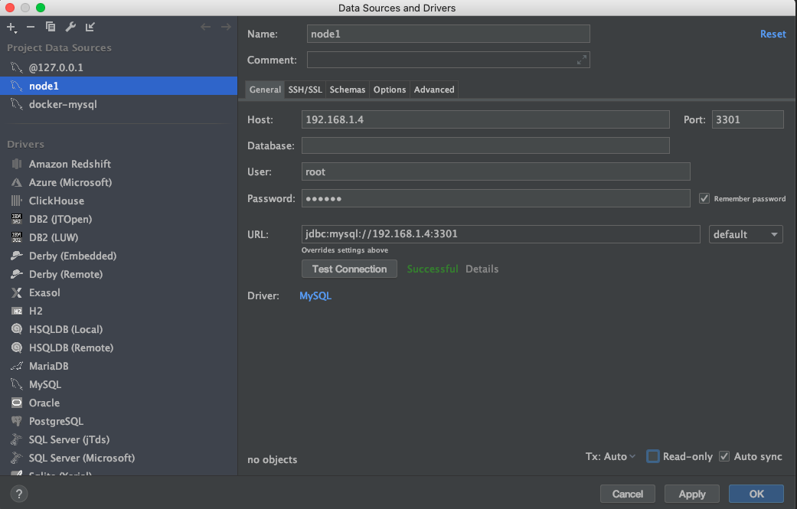

      

      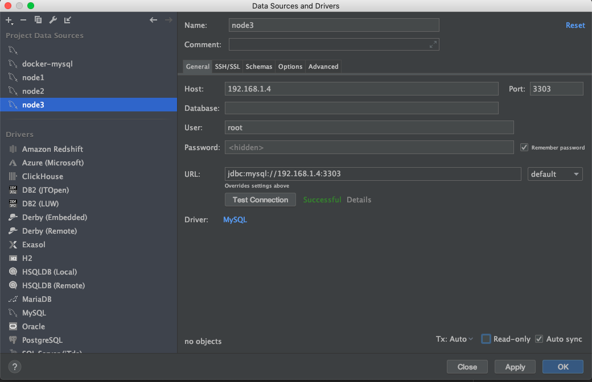

      在node2创建一个数据库在其他两个节点也会同步：

      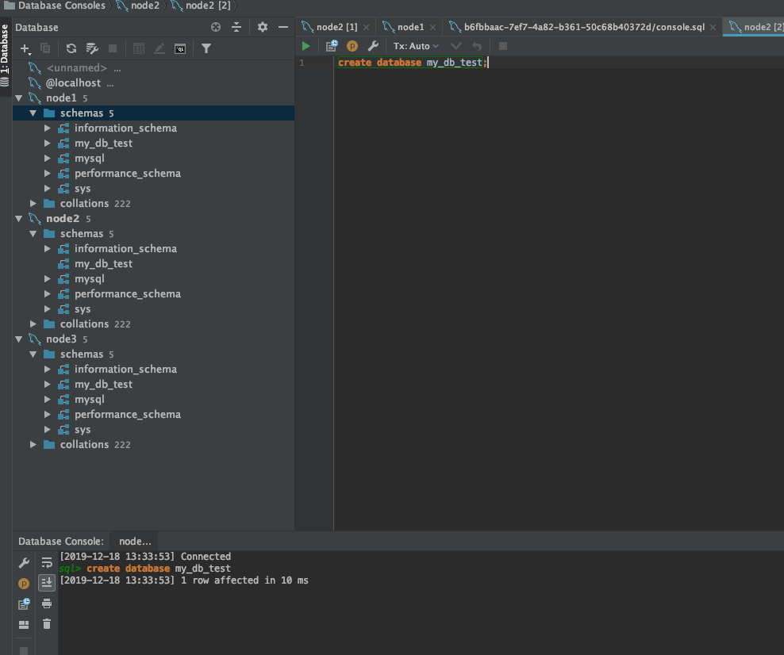

##### **数据库的负载均衡**

1. 拉取haproxy镜像

   ```
   docker pull haproxy
   ```

   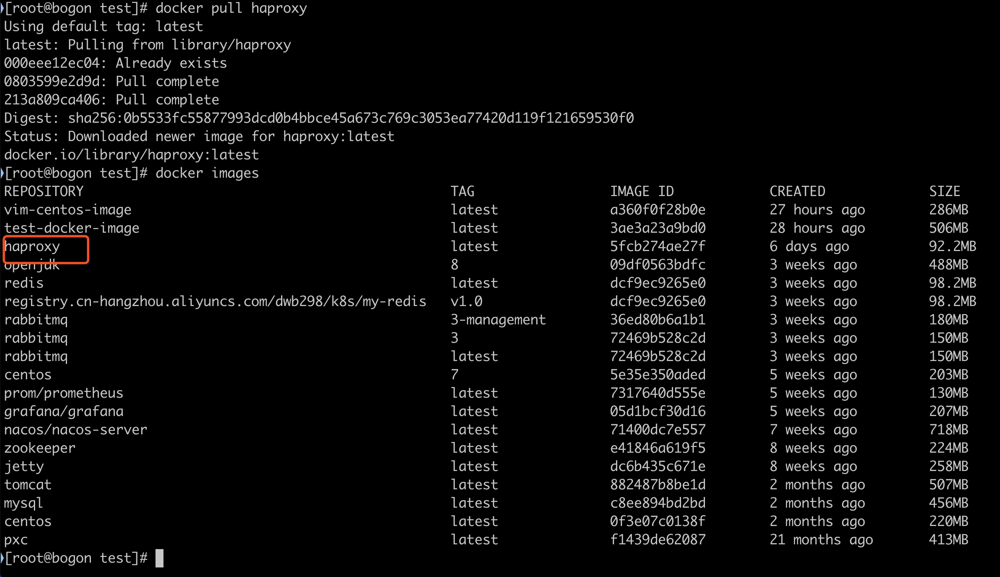

2. 创建haproxy配置文件，这里使用bind mounting的方式

   ```
   touch /tmp/haproxy/haproxy.cfg
   ```

   haproxy.cfg

   ```
   global
   	#工作目录，这边要和创建容器指定的目录对应
   	chroot /usr/local/etc/haproxy
   	#日志文件
   	log 127.0.0.1 local5 info
   	#守护进程运行
   	daemon
   
   defaults
   	log	global
   	mode	http
   	#日志格式
   	option	httplog
   	#日志中不记录负载均衡的心跳检测记录
   	option	dontlognull
    	#连接超时（毫秒）
   	timeout connect 5000
    	#客户端超时（毫秒）
   	timeout client  50000
   	#服务器超时（毫秒）
    	timeout server  50000
   
       #监控界面	
       listen  admin_stats
   	#监控界面的访问的IP和端口
   	bind  0.0.0.0:8888
   	#访问协议
    	mode        http
   	#URI相对地址
    	stats uri   /dbs_monitor
   	#统计报告格式
    	stats realm     Global\ statistics
   	#登陆帐户信息
    	stats auth  admin:admin
   	#数据库负载均衡
   	listen  proxy-mysql
   	#访问的IP和端口，haproxy开发的端口为3306
    	#假如有人访问haproxy的3306端口，则将请求转发给下面的数据库实例
   	bind  0.0.0.0:3306  
    	#网络协议
   	mode  tcp
   	#负载均衡算法（轮询算法）
   	#轮询算法：roundrobin
   	#权重算法：static-rr
   	#最少连接算法：leastconn
   	#请求源IP算法：source 
    	balance  roundrobin
   	#日志格式
    	option  tcplog
   	#在MySQL中创建一个没有权限的haproxy用户，密码为空。
   	#Haproxy使用这个账户对MySQL数据库心跳检测
    	option  mysql-check user haproxy
   	server  MySQL_1 172.25.0.2:3306 check weight 1 maxconn 2000  
    	server  MySQL_2 172.25.0.3:3306 check weight 1 maxconn 2000  
   	server  MySQL_3 172.25.0.4:3306 check weight 1 maxconn 2000 
   	#使用keepalive检测死链
    	option  tcpka
   ```

3. 创建haproxy容器，因为当前centos的网络和macOS使用的是桥接，所以直接端口映射到centos上即可，如果不想用桥接，则需要修改Vagrantfile进行端口映射

   ```
   #这样可以直接访问centos的IP:8888和3306
   docker run -it -d -p 8888:8888 -p 3306:3306 -v /tmp/haproxy:/usr/local/etc/haproxy --name haproxy01 --privileged --net=pxc-net haproxy
   ```

   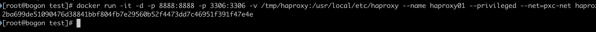

4. 根据haproxy.cfg文件启动haproxy

   ```
   docker exec -it haproxy01 bash
   haproxy -f /usr/local/etc/haproxy/haproxy.cfg
   ```

   

5. 在MySQL数据库上创建用户，用于心跳检测

   ```
   CREATE USER 'haproxy'@'%' IDENTIFIED BY '';
   [小技巧[如果创建失败，可以先输入一下命令]:
       drop user 'haproxy'@'%';
       flush privileges;
       CREATE USER 'haproxy'@'%' IDENTIFIED BY '';
   ]
   ```

6. macOS浏览器访问

   ```
   http://centos_ip:8888/dbs_monitor
   用户名密码都是:admin
   ```

   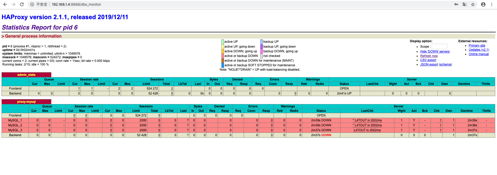

7. macOS上的datagrip连接haproxy01

   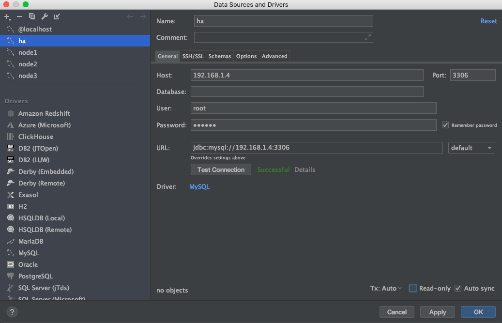

8. 在haproxy连接上进行数据操作，然后查看数据库集群各个节点

   创建表

   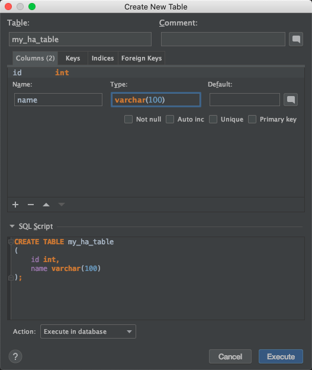

   创建以后去各个节点查看，发现都已经同步完成：

   

   插入数据：

   ha连接执行：

   ```
   INSERT INTO my_db_test.my_ha_table (id, name) VALUES (11, '2asd');
   ```

   其他节点也能同步到：

   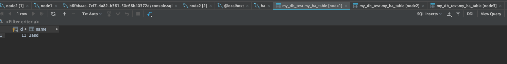

### Nginx+Spring Boot项目+MySQL

结构如下图：

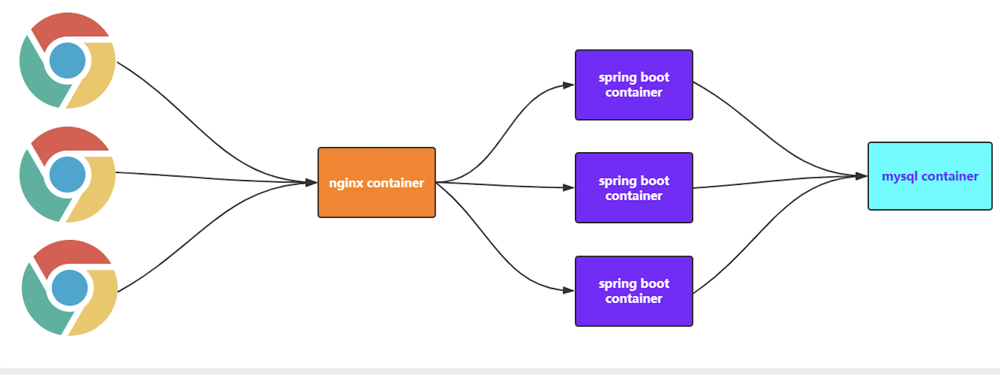

#### 集群搭建

**MySQL容器准备**

> (1)创建volume

```
docker volume create v1
```

> (2)创建mysql容器

```
docker run -d --name my-mysql -v v1:/var/lib/mysql -p 3306:3306 -e MYSQL_ROOT_PASSWORD=jack123 --net=pro-net --ip 172.18.0.6 mysql
```

> (3)datagrip连接，执行.mysql文件

```
name:my-mysql
ip:centos-ip
端口:3306
user:root
password:jack123
```

```sql
create schema db_pro collate utf8mb4_0900_ai_ci;
use db_pro;
create table t_user
(
	id int not null
		primary key,
	username varchar(50) not null,
	password varchar(50) not null,
	number varchar(100) not null
);
```


**Spring Boot项目准备**

> Spring Boot+MyBatis实现CRUD操作，名称为“springboot-mybatis”

```
(1)在本地测试该项目的功能
	主要是修改application.yml文件中数据库的相关配置

(2)在项目根目录下执行mvn clean package打成一个jar包
	[记得修改一下application.yml文件数据库配置]
	mvn clean package -Dmaven.test.skip=true
	在target下找到"springboot-mybatis-0.0.1-SNAPSHOT.jar.jar"
    
(3)在docker环境中新建一个目录"springboot-mybatis"
    
(4)安装文件传输工具yum install lrzsz，然后上传"springboot-mybatis-0.0.1-SNAPSHOT.jar"到该目录下，并且在此目录创建Dockerfile

(5)编写Dockerfile内容
	FROM openjdk:8
    MAINTAINER itcrazy2016
    LABEL name="springboot-mybatis" version="1.0" author="itcrazy2016"
    COPY springboot-mybatis-0.0.1-SNAPSHOT.jar springboot-mybatis.jar
    CMD ["java","-jar","springboot-mybatis.jar"]
    
(6)基于Dockerfile构建镜像
	docker build -t sbm-image .

(7)基于image创建container
	docker run -d --name sb01 -p 8081:8080 --net=pro-net --ip 172.18.0.11 sbm-image
	
(8)查看启动日志docker logs sb01
	
(9)在win浏览器访问http://192.168.8.118:8081/user/listall
```


**创建多个项目容器**

```
docker run -d --name sb01 -p 8081:8080 --net=pro-net --ip 172.18.0.11 sbm-image
docker run -d --name sb02 -p 8082:8080 --net=pro-net --ip 172.18.0.12 sbm-image
docker run -d --name sb03 -p 8083:8080 --net=pro-net --ip 172.18.0.13 sbm-image
```


**Nginx准备**

> (1)在centos的/tmp/nginx下新建nginx.conf文件，并进行相应的配置

```
user nginx;
worker_processes  1;
events {
    worker_connections  1024;
}
http {
    include       /etc/nginx/mime.types;
    default_type  application/octet-stream;
    sendfile        on;
    keepalive_timeout  65; 

   
    server {
        listen 80;
        location / {
         proxy_pass http://balance;
        }
    }
    
    upstream balance{  
        server 172.18.0.11:8080;
        server 172.18.0.12:8080;
        server 172.18.0.13:8080;
    }
    include /etc/nginx/conf.d/*.conf;
}
```

> (2)创建nginx容器
>
> `注意`：先在centos7上创建/tmp/nginx目录，并且创建nginx.conf文件，写上内容

```
docker run -d --name my-nginx -p 80:80 -v /tmp/nginx/nginx.conf:/etc/nginx/nginx.conf --network=pro-net --ip 172.18.0.10 nginx
```

> (3)win浏览器访问: ip[centos]/user/listall

`思考`：若将172.18.0.11/12/13改成sb01/02/03是否可以？

