# Kubernetes入门

## Kubernetes是什么

Kubernetes是一个完备的分布式系统支撑平台。Kubernetes具有完备的集群管理能力，包括多层次的安全防护和准入机制、多租户应用支撑能力、透明的服务注册和服务发现机制、内建的智能负载均衡器、强大的故障发现和自我修复能力、服务滚动升级和在线扩容能力、可扩展的资源自动调度机制，以及多粒度的资源配额管理能力。同时，Kubernetes提供了完善的管理工具，这些工具涵盖了包括开发、部署测试、运维监控在内的各个环节。因此，Kubernetes是一个全新的基于容器技术的分布式架构解决方案，并且是一个一站式的完备的分布式系统开发和支撑平台。

## Kubernetes的基本概念和术语

Kubernetes中的大部分概念如Node、Pod、ReplicationController、Service等都可以被看作一种资源对象，几乎所有资源对象都可以通过Kubernetes提供的kubectl工具（或者API编程调用）执行增、删、改、查等操作并将其保存在etcd中持久化存储。从这个角度来看，Kubernetes其实是一个高度自动化的资源控制系统，它通过跟踪对比etcd库里保存的“资源期望状态”与当前环境中的“实际资源状态”的差异来实现自动控制和自动纠错的高级功能。

我们可以采用YAML或JSON格式声明（定义或创建）一个Kubernetes资源对象，每个资源对象都有自己的特定语法格式（可以理解为数据库中一个特定的表），但随着Kubernetes版本的持续升级，一些资源对象会不断引入新的属性。

### Master

Kubernetes里的Master指的是集群控制节点，在每个Kubernetes集群里都需要有一个Master来负责整个集群的管理和控制，基本上Kubernetes的所有控制命令都发给它，它负责具体的执行过程，我们后面执行的所有命令基本都是在Master上运行的。Master通常会占据一个独立的服务器（高可用部署建议用3台服务器），主要原因是它太重要了，是整个集群的“首脑”，如果它宕机或者不可用，那么对集群内容器应用的管理都将失效。

在Master上运行着以下关键进程。

- Kubernetes API Server（kubeapiserver）：提供了HTTPRest接口的关键服务进程，是Kubernetes里所有资源的增、删、改、查等操作的唯一入口，也是集群控制的入口进程。
- Kubernetes Controller Manager（kubecontrollermanager）：Kubernetes里所有资源对象的自动化控制中心，可以将其理解为资源对象的“大总管”。
- Kubernetes Scheduler（kubescheduler）：负责资源调度（Pod调度）的进程，相当于公交公司的“调度室”。


在Master上通常还需要部署etcd服务，因为Kubernetes里的所有资源对象的数据都被保存在etcd中。

### Node

除了Master，Kubernetes集群中的其他机器被称为Node，在较早的版本中也被称为Minion。与Master一样，Node可以是一台物理主机，也可以是一台虚拟机。Node是Kubernetes集群中的工作负载节点，每个Node都会被Master分配一些工作负载（Docker容器），当某个Node宕机时，其上的工作负载会被Master自动转移到其他节点上。

除了Master，Kubernetes集群中的其他机器被称为Node，在较早的版本中也被称为Minion。与Master一样，Node可以是一台物理主机，也可以是一台虚拟机。Node是Kubernetes集群中的工作负载节点，每个Node都会被Master分配一些工作负载（Docker容器），当某个Node宕机时，其上的工作负载会被Master自动转移到其他节点上。

在每个Node上都运行着以下关键进程。

- kubelet：负责Pod对应的容器的创建、启停等任务，同时与Master密切协作，实现集群管理的基本功能。
- kubeproxy：实现KubernetesService的通信与负载均衡机制的重要组件。
- DockerEngine（docker）：Docker引擎，负责本机的容器创建和管理工作。


Node可以在运行期间动态增加到Kubernetes集群前提是在这个节点上已经正确安装、配置和启动了上述关键进程，在默认情况下kubelet会向Master注册自己，这也是Kubernetes推荐的Node管理方式。一旦Node被纳入集群管理范围，kubelet进程就会定时向Master汇报自身的情报，例如操作系统、Docker版本、机器的CPU和内存情况，以及当前有哪些Pod在运行等，这样Master就可以获知每个Node的资源使用情况，并实现高效均衡的资源调度策略。而某个Node在超过指定时间不上报信息时，会被Master判定为“失联”，Node的状态被标记为不可用（NotReady），随后Master会触发“工作负载大转移”的自动流程。

可以通过下面命令来查看集群中又多少个Node:

```
kubectl get nodes
```

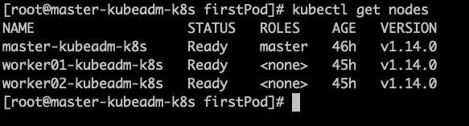

通过`kubectl describe node <node_name>`查看某个Node的详细信息：

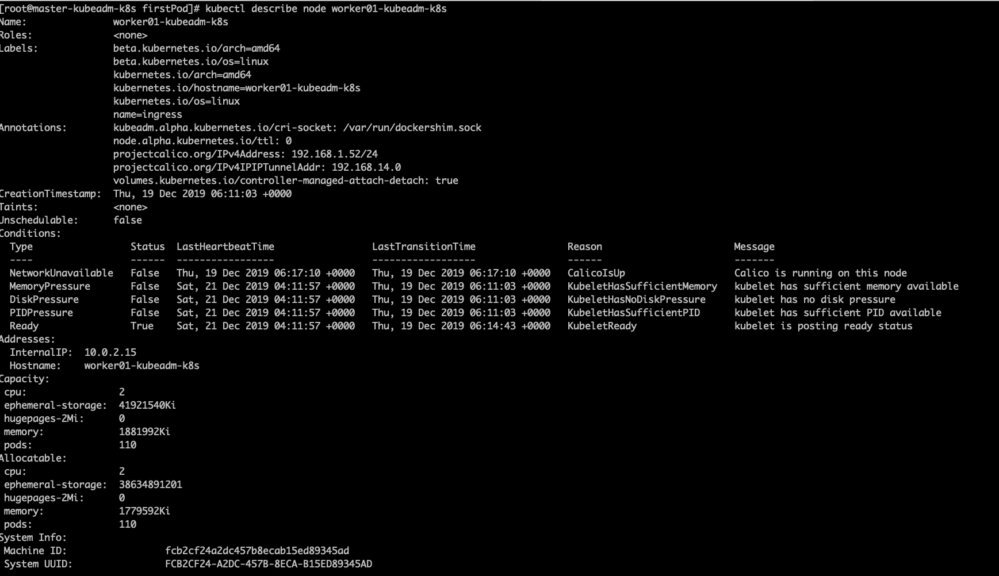

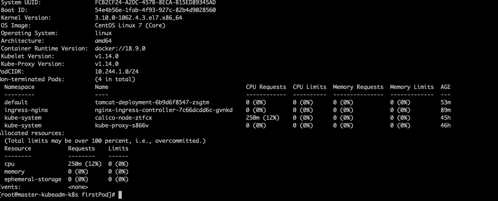

### Pod

Pod是Kubernetes最重要的基本概念，如下图所示是Pod的组成示意图，我们看到每个Pod都有一个特殊的被称为“根容器”的Pause容器。Pause容器对应的镜像属于Kubernetes平台的一部分，除了Pause容器，每个Pod还包含一个或多个紧密相关的用户业务容器。

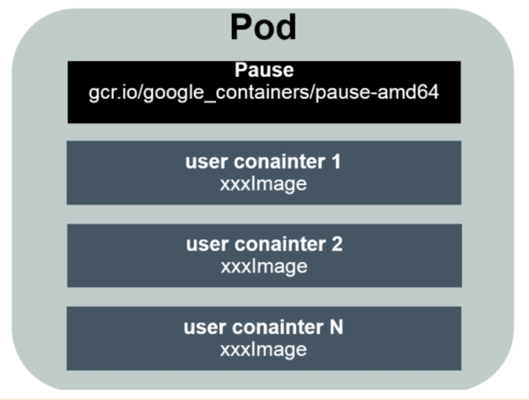

为什么Kubernetes会设计出一个全新的Pod的概念并且Pod有这样特殊的组成结构？

原因之一：在一组容器作为一个单元的情况下，我们难以简单地对“整体”进行判断及有效地行动。比如，一个容器死亡了，此时算是整体死亡么？是N/M的死亡率么？引入业务无关并且不易死亡的Pause容器作为Pod的根容器，以它的状态代表整个容器组的状态，就简单、巧妙地解决了这个难题。

原因之二：Pod里的多个业务容器共享Pause容器的IP，共享Pause容器挂接的Volume，这样既简化了密切关联的业务容器之间的通信问题，也很好地解决了它们之间的文件共享问题。

Kubernetes为每个Pod都分配了唯一的IP地址，称之为PodIP，一个Pod里的多个容器共享PodIP地址。Kubernetes要求底层网络支持集群内任意两个Pod之间的TCP/IP直接通信，这通常采用虚拟二层网络技术来实现，例如Flannel、OpenvSwitch等，因此我们需要牢记一点：在Kubernetes里，一个Pod里的容器与另外主机上的Pod容器能够直接通信。

#### 类型

Pod其实有两种类型：普通的Pod及静态Pod（StaticPod）。后者比较特殊，它并没被存放在Kubernetes的etcd存储里，而是被存放在某个具体的Node上的一个具体文件中，并且只在此Node上启动、运行。而普通的Pod一旦被创建，就会被放入etcd中存储，随后会被KubernetesMaster调度到某个具体的Node上并进行绑定（Binding），随后该Pod被对应的Node上的kubelet进程实例化成一组相关的Docker容器并启动。在默认情况下，当Pod里的某个容器停止时，Kubernetes会自动检测到这个问题并且重新启动这个Pod（重启Pod里的所有容器），如果Pod所在的Node宕机，就会将这个Node上的所有Pod重新调度到其他节点上。

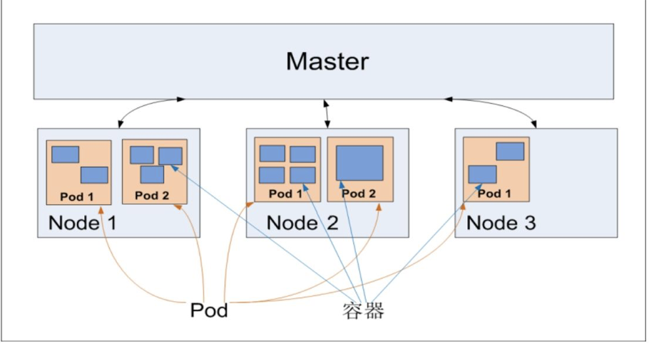

Kubernetes里的所有资源对象都可以采用YAML或者JSON格式的文件来定义或描述。

#### Volume

我们所熟悉的DockerVolume在Kubernetes里也有对应的概念—PodVolume，后者有一些扩展，比如可以用分布式文件系统GlusterFS实现后端存储功能；PodVolume是被定义在Pod上，然后被各个容器挂载到自己的文件系统中的。

#### Event

Event是一个事件的记录，记录了事件的最早产生时间、最后重现时间、重复次数、发起者、类型，以及导致此事件的原因等众多信息。Event通常会被关联到某个具体的资源对象上，是排查故障的重要参考信息，之前我们看到Node的描述信息包括了Event，而Pod同样有Event记录，当我们发现某个Pod迟迟无法创建时，可以用`kubectl describe pod xxxx`来查看它的描述信息，以定位问题的成因。

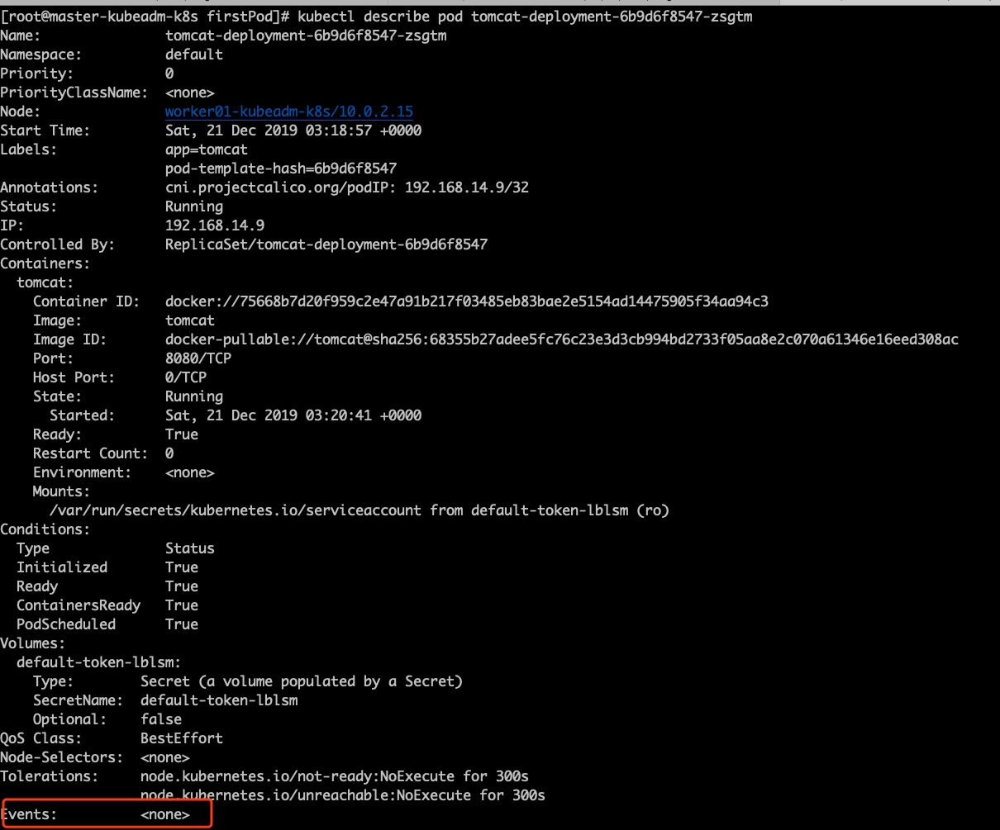

#### 资源配额

每个Pod都可以对其能使用的服务器上的计算资源设置限额，当前可以设置限额的计算资源有CPU与Memory两种，其中CPU的资源单位为CPU（Core）的数量，是一个绝对值而非相对值。

对于绝大多数容器来说，一个CPU的资源配额相当大，所以在Kubernetes里通常以千分之一的CPU配额为最小单位，用m来表示。通常一个容器的CPU配额被定义为100～300m，即占用0.1～0.3个CPU。由于CPU配额是一个绝对值，所以无论在拥有一个Core的机器上，还是在拥有48个Core的机器上，100m这个配额所代表的CPU的使用量都是一样的。与CPU配额类似，Memory配额也是一个绝对值，它的单位是内存字节数。

在Kubernetes里，一个计算资源进行配额限定时需要设定以下两个参数。

- Requests：该资源的最小申请量，系统必须满足要求。
- Limits：该资源最大允许使用的量，不能被突破，当容器试图使用超过这个量的资源时，可能会被Kubernetes“杀掉”并重启。

我们会把Requests设置为一个较小的数值，符合容器平时的工作负载情况下的资源需求，而把Limit设置为峰值负载情况下资源占用的最大量。下面这段定义表明MySQL容器申请最少0.25个CPU及64MiB内存，在运行过程中MySQL容器所能使用的资源配额为0.5个CPU及128MiB内存：


Pod及Pod周边对象的示意图作为总结

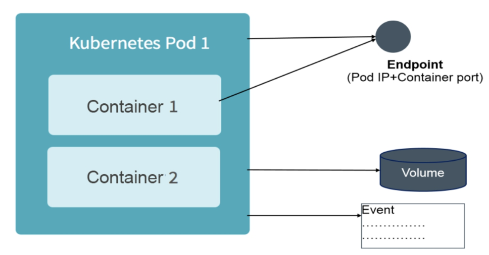

### Label

Label（标签）是Kubernetes系统中另外一个核心概念。一个Label是一个key=value的键值对，其中key与value由用户自己指定。Label可以被附加到各种资源对象上，例如Node、Pod、Service、RC等，一个资源对象可以定义任意数量的Label，同一个Label也可以被添加到任意数量的资源对象上。Label通常在资源对象定义时确定，也可以在对象创建后动态添加或者删除。

我们可以通过给指定的资源对象捆绑一个或多个不同的Label来实现多维度的资源分组管理功能，以便灵活、方便地进行资源分配、调度、配置、部署等管理工作。例如，部署不同版本的应用到不同的环境中；监控和分析应用（日志记录、监控、告警）等。

Label相当于我们熟悉的“标签”。给某个资源对象定义一个Label，就相当于给它打了一个标签，随后可以通过LabelSelector（标签选择器）查询和筛选拥有某些Label的资源对象，Kubernetes通过这种方式实现了类似SQL的简单又通用的对象查询机制。

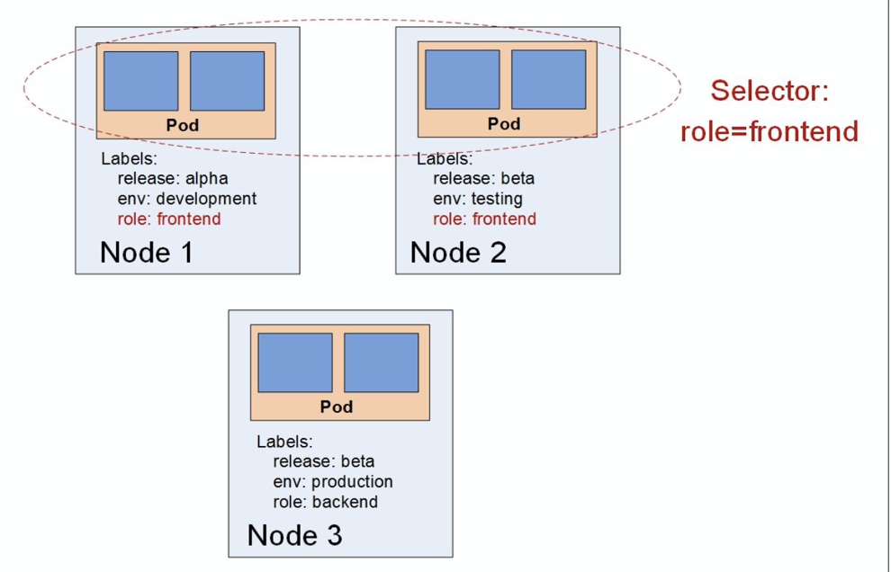

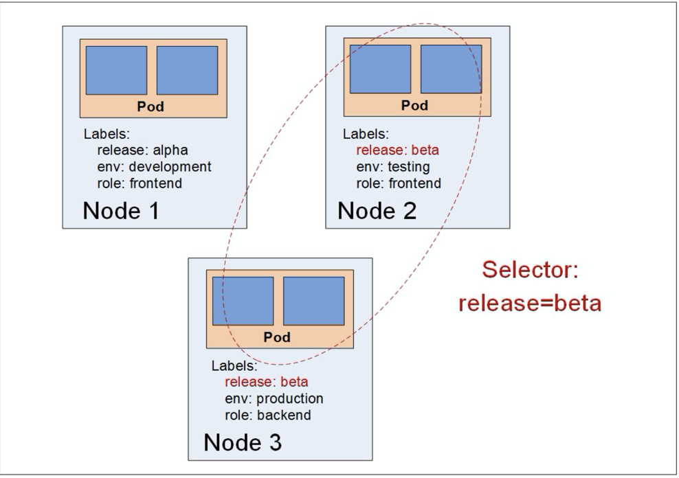

### Replication Controller

ReplicationController（简称RC），RC是Kubernetes系统中的核心概念之一，简单来说，它其实定义了一个期望的场景，即声明某种Pod的副本数量在任意时刻都符合某个预期值，所以RC的定义包括如下几个部分。

- Pod期待的副本数量
- 用于筛选目标Pod的Label Selector。
- 当Pod的副本数量小于预期数量时，用于创建新Pod的Pod模板（template）。

下面是一个完整的RC定义的例子，即确保拥有tier=frontend标签的这个Pod（运行Tomcat容器）在整个Kubernetes集群中始终只有一个副本：

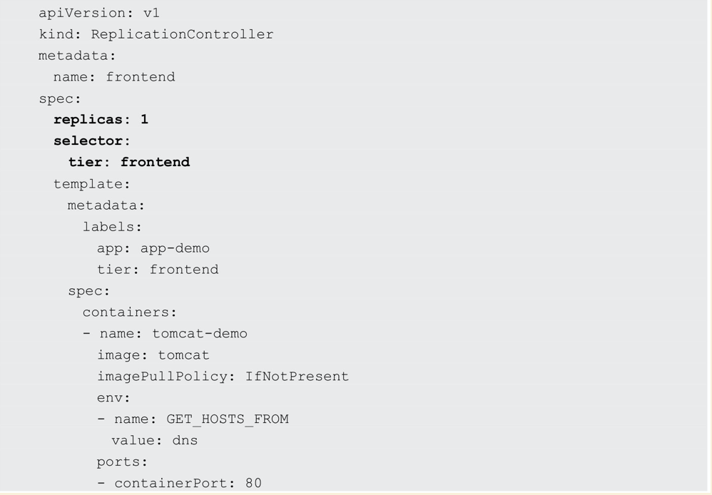

在我们定义了一个RC并将其提交到Kubernetes集群中后，Master上的ControllerManager组件就得到通知，定期巡检系统中当前存活的目标Pod，并确保目标Pod实例的数量刚好等于此RC的期望值，如果有过多的Pod副本在运行，系统就会停掉一些Pod，否则系统会再自动创建一些Pod。可以说，通过RC，Kubernetes实现了用户应用集群的高可用性，并且大大减少了系统管理员在传统IT环境中需要完成的许多手工运维工作（如主机监控脚本、应用监控脚本、故障恢复脚本等）。

下面以有3个Node的集群为例，说明Kubernetes如何通过RC来实现Pod副本数量自动控制的机制。假如在我们的RC里定义redisslave这个Pod需要保持两个副本，系统将可能在其中的两个Node上创建Pod。图1.9描述了在两个Node上创建redisslavePod的情形。

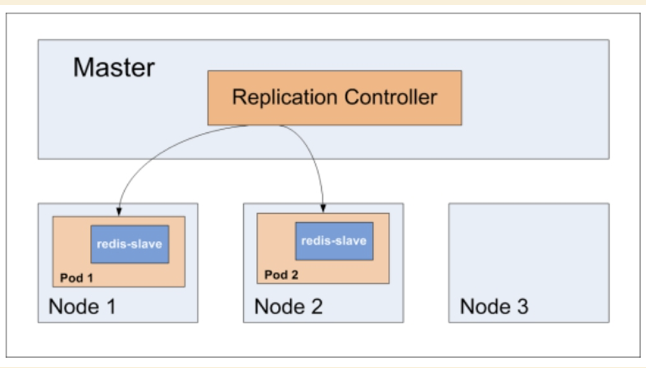

假设Node2上的Pod2意外终止，则根据RC定义的replicas数量2，Kubernetes将会自动创建并启动一个新的Pod，以保证在整个集群中始终有两个redisslavePod运行。系统可能选择Node3或者Node1来创建一个新的Pod。

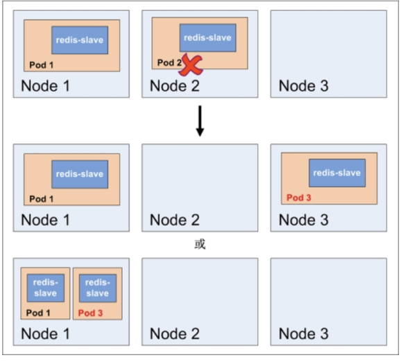

此外，在运行时，我们可以通过修改RC的副本数量，来实现Pod的动态缩放（Scaling），这可以通过执行kubectlscale命令来一键完成：

```shell
kubectl scale rc redis-slave --replicas=3
```

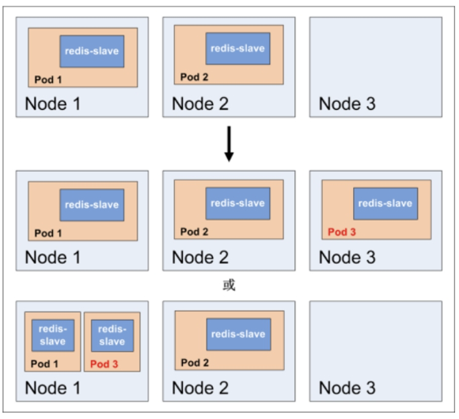

需要注意的是，删除RC并不会影响通过该RC已创建好的Pod。为了删除所有Pod，可以设置replicas的值为0，然后更新该RC。另外，kubectl提供了stop和delete命令来一次性删除RC和RC控制的全部Pod。

#### 滚动升级

应用升级时，通常会使用一个新的容器镜像版本替代旧版本。我们希望系统平滑升级，比如在当前系统中有10个对应的旧版本的Pod，则最佳的系统升级方式是旧版本的Pod每停止一个，就同时创建一个新版本的Pod，在整个升级过程中此消彼长，而运行中的Pod数量始终是10个，几分钟以后，当所有的Pod都已经是新版本时，系统升级完成。通过RC机制，Kubernetes很容易就实现了这种高级实用的特性，被称为“滚动升级”（RollingUpdate）

#### Replica Set

ReplicationController由于与Kubernetes代码中的模块ReplicationController同名，同时“ReplicationController”无法准确表达它的本意，所以在Kubernetes1.2中，升级为另外一个新概念—ReplicaSet，官方解释其为“下一代的RC”。==ReplicaSet与RC当前的唯一区别是，ReplicaSets支持基于集合的Labelselector（Setbasedselector），而RC只支持基于等式的LabelSelector（equalitybasedselector），这使得ReplicaSet的功能更强==。

kubectl命令行工具适用于RC的绝大部分命令同样适用于ReplicaSet。此外，我们当前很少单独使用ReplicaSet，它主要被Deployment这个更高层的资源对象所使用，从而形成一整套Pod创建、删除、更新的编排机制。我们在使用Deployment时，无须关心它是如何创建和维护ReplicaSet的，这一切都是自动发生的。

ReplicaSet与Deployment这两个重要的资源对象逐步替代了之前RC的作用，是Kubernetes1.3里Pod自动扩容（伸缩）这个告警功能实现的基础，也将继续在Kubernetes未来的版本中发挥重要的作用。

最后总结一下RC（ReplicaSet）的一些特性与作用。

- 在大多数情况下，我们通过定义一个RC实现Pod的创建及副本数量的自动控制。
- 在RC里包括完整的Pod定义模板。
- RC通过LabelSelector机制实现对Pod副本的自动控制。
- 通过改变RC里的Pod副本数量，可以实现Pod的扩容或缩容。
- 通过改变RC里Pod模板中的镜像版本，可以实现Pod的滚动升级。


### Deployment

Deployment是k8s 1.2之后引入的新概念，引入的目的就是为了更好的解决Pod的编排问题。为此，Deployment在内部使用了Replica Set来实现目的，可以看作是RC的一次升级。

Deployment典型使用场景有以下几个：

- 创建一个Deployment对象来生成对应的Replica Set并完成Pod副本的创建过程。
- 检查Deployment的状态来看布署动作是否完成（Pod副本的数量是否达到预期值）。
- 更新Deployment以创建新的Pod（如镜像升级）。
- 如果当前Deployment不稳定，则回滚到早先的Deployment版本。
- 挂起或恢复一个Deployment。

下面是一个实例，文件名为tomcat-deployment.yaml：

```yaml
apiVersion: apps/v1
kind: Deployment
metadata:
  name: frontend
spec:
  replicas: 1
  selector:
    matchLabels:
      tier: frontend
    matchExpressions:
      - {key: tier, operator: In, values: [frontend]}
  template:
    metadata:
      labels:
        app: app-demo
        tier: frontend
    spec:
      containers:
        - name: tomcat-demo
          image: tomcat
          imagePullPolicy: IfNotPresent
          ports:
            - containerPort: 8080
```

创建Deployment：

```
kubectl create -f tomcat-deployment.yaml
```

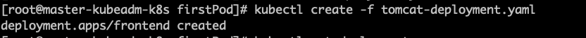

运行下述命令查看Deployment的信息：

```
kubectl get deployments
```

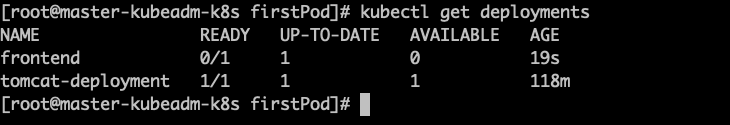

对上述输出中涉及的数量解释如下。

- UPTODATE：最新版本的Pod的副本数量，用于指示在滚动升级的过程中，有多少个Pod副本已经成功升级。
- AVAILABLE：当前集群中可用的Pod副本数量，即集群中当前存活的Pod数量。


运行下述命令查看对应的ReplicaSet，我们看到它的命名与Deployment的名称有关系：

```
kubectl get rs
```

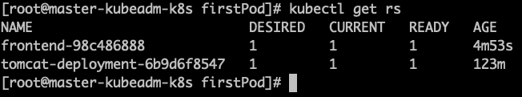

运行下述命令查看创建的Pod，我们发现Pod的命名以Deployment对应的ReplicaSet的名称为前缀，这种命名很清晰地表明了一个ReplicaSet创建了哪些Pod，对于Pod滚动升级这种复杂的过程来说，很容易排查错误：

```
kubectl get pods
```

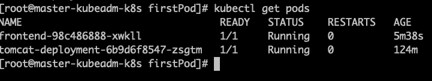

运行kubectl describe deployments，可以清楚地看到Deployment控制的Pod的水平扩展过程，

Pod的管理对象，除了RC和Deployment，还包括ReplicaSet、DaemonSet、StatefulSet、Job等，分别用于不同的应用场景中，将在第3章进行详细介绍。

### Horizontal Pod Autoscaler

HorizontalPodAutoscaling（Pod横向自动扩容，HPA）。

HPA与之前的RC、Deployment一样，也属于一种Kubernetes资源对象。通过追踪分析指定RC控制的所有目标Pod的负载变化情况，来确定是否需要有针对性地调整目标Pod的副本数量，这是HPA的实现原理。当前，HPA有以下两种方式作为Pod负载的度量指标。

- CPUUtilizationPercentage。
- 应用程序自定义的度量指标，比如服务在每秒内的相应请求数（TPS或QPS）。


### statefulSet

在Kubernetes系统中，Pod的管理对象RC、Deployment、DaemonSet和Job都面向无状态的服务。但现实中有很多服务是有状态的，特别是一些复杂的中间件集群，例如MySQL集群、MongoDB集群、Akka集群、ZooKeeper集群等，这些应用集群有4个共同点。

1. 每个节点都有固定的身份ID，通过这个ID，集群中的成员可以相互发现并通信。
2. 集群的规模是比较固定的，集群规模不能随意变动。
3. 集群中的每个节点都是有状态的，通常会持久化数据到永久存储中。
4. 如果磁盘损坏，则集群里的某个节点无法正常运行，集群功能受损。

StatefulSet从本质上来说，可以看作Deployment/RC的一个特殊变种，它有如下特性。

- StatefulSet里的每个Pod都有稳定、唯一的网络标识，可以用来发现集群内的其他成员。假设StatefulSet的名称为kafka，那么第1个Pod叫kafka0，第2个叫kafka1，以此类推。

- StatefulSet控制的Pod副本的启停顺序是受控的，操作第n个Pod时，前n1个Pod已经是运行且准备好的状态。

- StatefulSet里的Pod采用稳定的持久化存储卷，通过PV或PVC来实现，删除Pod时默认不会删除与StatefulSet相关的存储卷（为了保证数据的安全）。


StatefulSet除了要与PV卷捆绑使用以存储Pod的状态数据，还要与HeadlessService配合使用，即在每个StatefulSet定义中都要声明它属于哪个HeadlessService。HeadlessService与普通Service的关键区别在于，它没有ClusterIP，如果解析HeadlessService的DNS域名，则返回的是该Service对应的全部Pod的Endpoint列表。StatefulSet在HeadlessService的基础上又为StatefulSet控制的每个Pod实例都创建了一个DNS域名，这个域名的格式为：


比如一个3节点的Kafka的StatefulSet集群对应的HeadlessService的名称为kafka，StatefulSet的名称为kafka，则StatefulSet里的3个Pod的DNS名称分别为kafka0.kafka、kafka1.kafka、kafka3.kafka，这些DNS名称可以直接在集群的配置文件中固定下来。

### Service

Kubernetes里的每个Service其实就是我们经常提起的微服务架构中的一个微服务，之前讲解Pod、RC等资源对象其实都是为讲解KubernetesService做铺垫的。

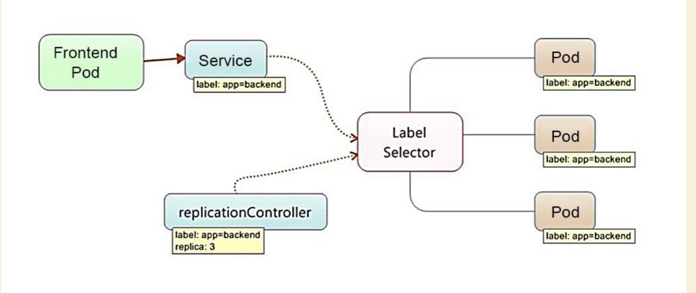

Kubernetes的Service定义了一个服务的访问入口地址，前端的应用（Pod）通过这个入口地址访问其背后的一组由Pod副本组成的集群实例，Service与其后端Pod副本集群之间则是通过LabelSelector来实现无缝对接的。RC的作用实际上是保证Service的服务能力和服务质量始终符合预期标准。

通过分析、识别并建模系统中的所有服务为微服务—KubernetesService，我们的系统最终由多个提供不同业务能力而又彼此独立的微服务单元组成的，服务之间通过TCP/IP进行通信，从而形成了强大而又灵活的弹性网格，拥有强大的分布式能力、弹性扩展能力、容错能力，程序架构也变得简单和直观许多

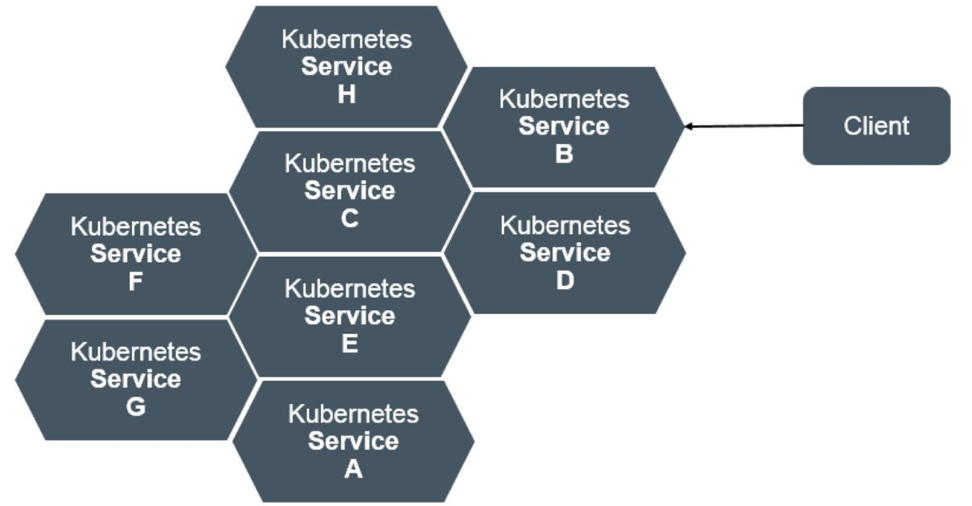

每个Service都被分配了一个全局唯一的虚拟IP地址，这个虚拟IP被称为ClusterIP。这样一来，每个服务就变成了具备唯一IP地址的通信节点，服务调用就变成了最基础的TCP网络通信问题。

Pod的Endpoint地址会随着Pod的销毁和重新创建而发生改变，因为新Pod的IP地址与之前旧Pod的不同。而Service一旦被创建，Kubernetes就会自动为它分配一个可用的ClusterIP，而且在Service的整个生命周期内，它的ClusterIP不会发生改变。于是，==服务发现这个棘手的问题在Kubernetes的架构里也得以轻松解决：只要用Service的Name与Service的ClusterIP地址做一个DNS域名映射即可完美解决问题。==


#### Kubernetes的服务发现机制

任何分布式系统都会涉及“服务发现”这个基础问题，大部分分布式系统都通过提供特定的API接口来实现服务发现功能，但这样做会导致平台的侵入性比较强，也增加了开发、测试的难度。Kubernetes则采用了直观朴素的思路去解决这个棘手的问题。

每个Kubernetes中的Service都有唯一的ClusterIP及唯一的名称，而名称是由开发者自己定义的，部署时也没必要改变，所以完全可以被固定在配置中。接下来的问题就是如何通过Service的名称找到对应的ClusterIP。

Kubernetes通过AddOn增值包引入了DNS系统，把服务名作为DNS域名，这样程序就可以直接使用服务名来建立通信连接了。目前，Kubernetes上的大部分应用都已经采用了DNS这种新兴的服务发现机制。

#### 外部系统访问Service的问题

Kubernetes里的3种IP，这3种IP分别如下：

1. NodeIP：Node的IP地址。

   NodeIP是Kubernetes集群中每个节点的物理网卡的IP地址，是一个真实存在的物理网络，所有属于这个网络的服务器都能通过这个网络直接通信，不管其中是否有部分节点不属于这个Kubernetes集群。这也表明在Kubernetes集群之外的节点访问Kubernetes集群之内的某个节点或者TCP/IP服务时，都必须通过NodeIP通信。

2. PodIP：Pod的IP地址。

   PodIP是每个Pod的IP地址，它是DockerEngine根据docker0网桥的IP地址段进行分配的，通常是一个虚拟的二层网络，前面说过，Kubernetes要求位于不同Node上的Pod都能够彼此直接通信，所以Kubernetes里一个Pod里的容器访问另外一个Pod里的容器时，就是通过PodIP所在的虚拟二层网络进行通信的，而真实的TCP/IP流量是通过NodeIP所在的物理网卡流出的。

3. ClusterIP：Service的IP地址。

   ClusterIP，它也是一种虚拟的IP，但更像一个“伪造”的IP网络，原因有以下几点。

   1. ClusterIP仅仅作用于Kubernetes Service这个对象，并由Kubernetes管理和分配IP地址（来源于ClusterIP地址池）。

   2. ClusterIP无法被Ping，因为没有一个“实体网络对象”来响应。

   3. ClusterIP只能结合Service Port组成一个具体的通信端口，单独的ClusterIP不具备TCP/IP通信的基础，并且它们属于Kubernetes集群这样一个封闭的空间，集群外的节点如果要访问这个通信端口，则需要做一些额外的工作。

   4. 在Kubernetes集群内，NodeIP网、PodIP网与ClusterIP网之间的通信，采用的是Kubernetes自己设计的一种编程方式的特殊路由规则，与我们熟知的IP路由有很大的不同。

      

   

根据上面的分析和总结，我们基本明白了：Service的ClusterIP属于Kubernetes集群内部的地址，无法在集群外部直接使用这个地址。那么矛盾来了：实际上在我们开发的业务系统中肯定多少有一部分服务是要提供给Kubernetes集群外部的应用或者用户来使用的，典型的例子就是Web端的服务模块，比如上面的tomcatservice，那么用户怎么访问它？

采用NodePort是解决上述问题的最直接、有效的常见做法。但是生产环境不建议使用这种方式。

我们还可以使用Ingress网络来解决这个问题。

### Job

批处理任务通常并行（或者串行）启动多个计算进程去处理一批工作项（workitem），在处理完成后，整个批处理任务结束。从1.2版本开始，Kubernetes支持批处理类型的应用，我们可以通过KubernetesJob这种新的资源对象定义并启动一个批处理任务Job。与RC、Deployment、ReplicaSet、DaemonSet类似，Job也控制一组Pod容器。从这个角度来看，Job也是一种特殊的Pod副本自动控制器，同时Job控制Pod副本与RC等控制器的工作机制有以下重要差别:

1. Job所控制的Pod副本是短暂运行的，可以将其视为一组Docker容器，其中的每个Docker容器都仅仅运行一次。当Job控制的所有Pod副本都运行结束时，对应的Job也就结束了。Job在实现方式上与RC等副本控制器不同，Job生成的Pod副本是不能自动重启的，对应Pod副本的RestartPoliy都被设置为Never。因此，当对应的Pod副本都执行完成时，相应的Job也就完成了控制使命，即Job生成的Pod在Kubernetes中是短暂存在的。Kubernetes在1.5版本之后又提供了类似crontab的定时任务——CronJob，解决了某些批处理任务需要定时反复执行的问题。
2. Job所控制的Pod副本的工作模式能够多实例并行计算，以TensorFlow框架为例，可以将一个机器学习的计算任务分布到10台机器上，在每台机器上都运行一个worker执行计算任务，这很适合通过Job生成10个Pod副本同时启动运算。


### Volume

Volume（存储卷）是Pod中能够被多个容器访问的共享目录。Kubernetes的Volume概念、用途和目的与Docker的Volume比较类似，但两者不能等价。首先，Kubernetes中的Volume被定义在Pod上，然后被一个Pod里的多个容器挂载到具体的文件目录下；其次，Kubernetes中的Volume与Pod的生命周期相同，但与容器的生命周期不相关，当容器终止或者重启时，Volume中的数据也不会丢失。最后，Kubernetes支持多种类型的Volume，例如GlusterFS、Ceph等先进的分布式文件系统。

Volume的使用也比较简单，在大多数情况下，我们先在Pod上声明一个Volume，然后在容器里引用该Volume并挂载（Mount）到容器里的某个目录上。举例来说，我们要给之前的TomcatPod增加一个名为datavol的Volume，并且挂载到容器的/mydatadata目录上，则只要对Pod的定义文件做如下修正即可（注意代码中的粗体部分）：

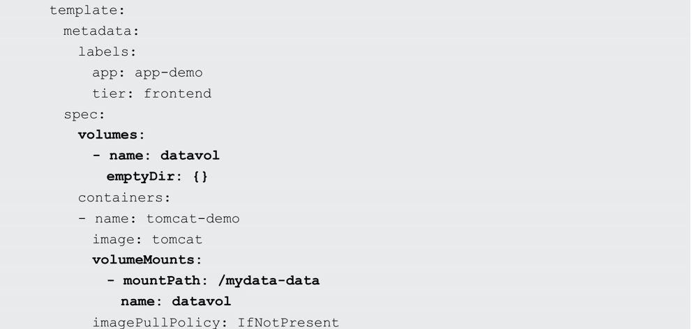

除了可以让一个Pod里的多个容器共享文件、让容器的数据写到宿主机的磁盘上或者写文件到网络存储中，Kubernetes的Volume还扩展出了一种非常有实用价值的功能，即容器配置文件集中化定义与管理，这是通过ConfigMap这种新的资源对象来实现的


### Persistent Volume

之前提到的Volume是被定义在Pod上的，属于计算资源的一部分，而实际上，网络存储是相对独立于计算资源而存在的一种实体资源。比如在使用虚拟机的情况下，我们通常会先定义一个网络存储，然后从中划出一个“网盘”并挂接到虚拟机上。PersistentVolume（PV）和与之相关联的PersistentVolumeClaim（PVC）也起到了类似的作用。

PV可以被理解成Kubernetes集群中的某个网络存储对应的一块存储，它与Volume类似，但有以下区别。

- PV只能是网络存储，不属于任何Node，但可以在每个Node上访问。
- PV并不是被定义在Pod上的，而是独立于Pod之外定义的。
- PV目前支持的类型包括：gcePersistentDisk、AWSElasticBlockStore、AzureFile、AzureDisk、FC（FibreChannel）、Flocker、NFS、iSCSI、RBD（RadosBlockDevice）、CephFS、Cinder、GlusterFS、VsphereVolume、QuobyteVolumes、VMwarePhoton、PortworxVolumes、ScaleIOVolumes和HostPath（仅供单机测试）。

下面给出了NFS类型的PV的一个YAML定义文件，声明了需要5Gi的存储空间：


比较重要的是PV的accessModes属性，目前有以下类型：

- ReadWriteOnce：读写权限，并且只能被单个Node挂载。
- ReadOnlyMany：只读权限，允许被多个Node挂载。
- ReadWriteMany：读写权限，允许被多个Node挂载。

如果某个Pod想申请某种类型的PV，则首先需要定义一个PersistentVolumeClaim对象：

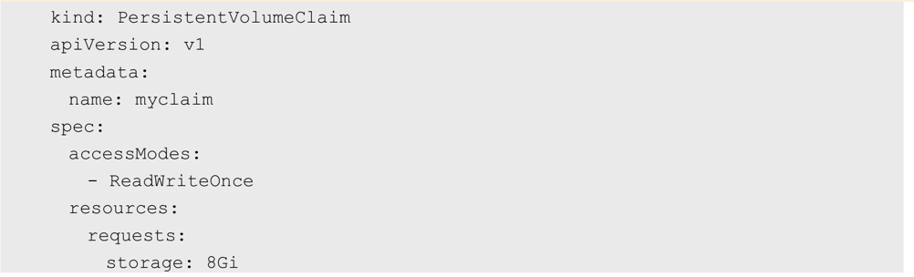

然后，在Pod的Volume定义中引用上述PVC即可：


最后说说PV的状态。PV是有状态的对象，它的状态有以下几种：

- Available：空闲状态。
- Bound：已经绑定到某个PVC上。
- Released：对应的PVC已经被删除，但资源还没有被集群收回。
- Failed：PV自动回收失败。

### Namespace

Namespace（命名空间）是Kubernetes系统中的另一个非常重要的概念，Namespace在很多情况下用于实现多租户的资源隔离。Namespace通过将集群内部的资源对象“分配”到不同的Namespace中，形成逻辑上分组的不同项目、小组或用户组，便于不同的分组在共享使用整个集群的资源的同时还能被分别管理。

Kubernetes集群在启动后会创建一个名为default的Namespace，通过kubectl可以查看：

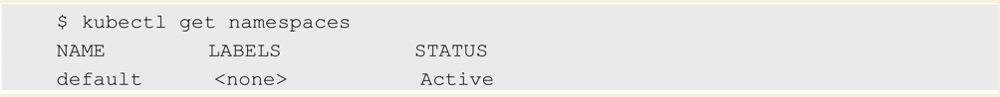

接下来，如果不特别指明Namespace，则用户创建的Pod、RC、Service都将被系统创建到这个默认的名为default的Namespace中。

Namespace的定义很简单。如下所示的YAML定义了名为development的Namespace。

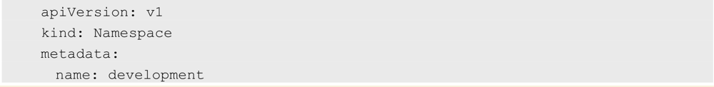

一旦创建了Namespace，我们在创建资源对象时就可以指定这个资源对象属于哪个Namespace。比如在下面的例子中定义了一个名为busybox的Pod，并将其放入development这个Namespace里：

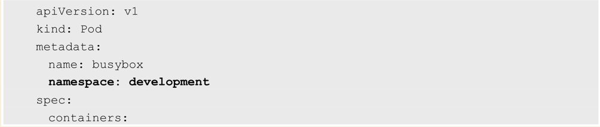

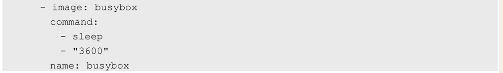

此时使用kubectlget命令查看，将无法显示：

```shell
kubectl get pods
```

这是因为如果不加参数，则kubectlget命令将仅显示属于default命名空间的资源对象。

可以在kubectl命令中加入namespace参数来查看某个命名空间中的对象：

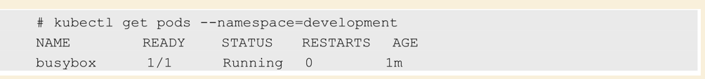

当给每个租户创建一个Namespace来实现多租户的资源隔离时，还能结合Kubernetes的资源配额管理，限定不同租户能占用的资源，例如CPU使用量、内存使用量等。关于资源配额管理的问题，在后面的章节中会详细介绍。

### Annotation

Annotation（注解）与Label类似，也使用key/value键值对的形式进行定义。不同的是Label具有严格的命名规则，它定义的是Kubernetes对象的元数据（Metadata），并且用于LabelSelector。Annotation则是用户任意定义的附加信息，以便于外部工具查找。在很多时候，Kubernetes的模块自身会通过Annotation标记资源对象的一些特殊信息。

### ConfigMap

为了能够准确和深刻理解KubernetesConfigMap的功能和价值，我们需要从Docker说起。我们知道，Docker通过将程序、依赖库、数据及配置文件“打包固化”到一个不变的镜像文件中的做法，解决了应用的部署的难题，但这同时带来了棘手的问题，即配置文件中的参数在运行期如何修改的问题。我们不可能在启动Docker容器后再修改容器里的配置文件，然后用新的配置文件重启容器里的用户主进程。为了解决这个问题，Docker提供了两种方式：

- 在运行时通过容器的环境变量来传递参数；
- 通过DockerVolume将容器外的配置文件映射到容器内。

这两种方式都有其优势和缺点，在大多数情况下，后一种方式更合适我们的系统，因为大多数应用通常从一个或多个配置文件中读取参数。但这种方式也有明显的缺陷：我们必须在目标主机上先创建好对应的配置文件，然后才能映射到容器里。

上述缺陷在分布式情况下变得更为严重，因为无论采用哪种方式，写入（修改）多台服务器上的某个指定文件，并确保这些文件保持一致，都是一个很难完成的目标。此外，在大多数情况下，我们都希望能集中管理系统的配置参数，而不是管理一堆配置文件。针对上述问题，Kubernetes给出了一个很巧妙的设计实现，如下所述。

首先，把所有的配置项都当作keyvalue字符串，当然value可以来自某个文本文件，比如配置项password=123456、user=root、host=192.168.8.4用于表示连接FTP服务器的配置参数。这些配置项可以作为Map表中的一个项，整个Map的数据可以被持久化存储在Kubernetes的Etcd数据库中，然后提供API以方便Kubernetes相关组件或客户应用CRUD操作这些数据，上述专门用来保存配置参数的Map就是KubernetesConfigMap资源对象。

接下来，Kubernetes提供了一种内建机制，将存储在etcd中的ConfigMap通过Volume映射的方式变成目标Pod内的配置文件，不管目标Pod被调度到哪台服务器上，都会完成自动映射。进一步地，==如果ConfigMap中的key/value数据被修改，则映射到Pod中的“配置文件”也会随之自动更新。==于是，KubernetesConfigMap就成了分布式系统中最为简单（使用方法简单，但背后实现比较复杂）且对应用无侵入的配置中心。ConfigMap配置集中化的一种简单方案如图所示。

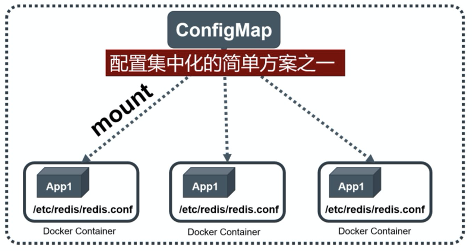


