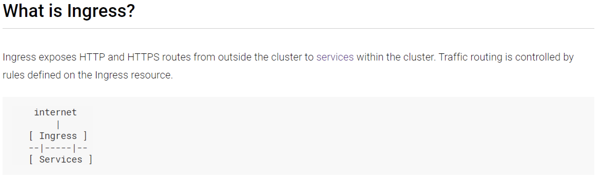

# Kubernetes常用资源使用及Ingress网络

## 01 Controllers

> `官网`：<https://kubernetes.io/docs/concepts/workloads/controllers/>

### ReplicationController(RC)

> `官网`：https://kubernetes.io/docs/concepts/workloads/controllers/replicationcontroller/
>
> ```
> A ReplicationController ensures that a specified number of pod replicas are running at any one time. In other words, a ReplicationController makes sure that a pod or a homogeneous set of pods is always up and available.
> ```

ReplicationController定义了一个期望的场景，即声明某种Pod的副本数量在任意时刻都符合某个预期值，所以RC的定义包含以下几个部分：

- Pod期待的副本数（replicas）
- 用于筛选目标Pod的Label Selector
- 当Pod的副本数量小于预期数量时，用于创建新Pod的Pod模板（template）

也就是说通过RC实现了集群中Pod的高可用，减少了传统IT环境中手工运维的工作。

**Have a try**

> kind：表示要新建对象的类型
>
> spec.selector：表示需要管理的Pod的label，这里表示包含app: nginx的label的Pod都会被该RC管理
>
> spec.replicas：表示受此RC管理的Pod需要运行的副本数
>
> spec.template：表示用于定义Pod的模板，比如Pod名称、拥有的label以及Pod中运行的应用等
>
> 通过改变RC里Pod模板中的镜像版本，可以实现Pod的升级功能
>
> kubectl apply -f nginx-pod.yaml，此时k8s会在所有可用的Node上，创建3个Pod，并且每个Pod都有一个app: nginx的label，同时每个Pod中都运行了一个nginx容器。
>
> 如果某个Pod发生问题，Controller Manager能够及时发现，然后根据RC的定义，创建一个新的Pod
>
> 扩缩容：kubectl scale rc nginx --replicas=5

> (1)创建名为nginx_replication.yaml

```yaml
apiVersion: v1
kind: ReplicationController
metadata:
  name: nginx
spec:
  replicas: 3
  selector:
    app: nginx
  template:
    metadata:
      name: nginx
      labels:
        app: nginx
    spec:
      containers:
      - name: nginx
        image: nginx
        ports:
        - containerPort: 80
```

> (2)根据nginx_replication.yaml创建pod

```
kubectl apply -f nginx_replication.yaml
```

> (3)查看pod

```
kubectl get pods -o wide

   NAME      READY     STATUS
nginx-hksg8   1/1     Running   0          44s   192.168.80.195   w2   
nginx-q7bw5   1/1     Running   0          44s   192.168.190.67   w1  
nginx-zzwzl   1/1     Running   0          44s   192.168.190.68   w1    

kubectl get rc
NAME    DESIRED   CURRENT   READY   AGE
nginx   3         3         3       2m54s
```

> (4)尝试删除一个pod

```shell
kubectl delete pods nginx-zzwzl
kubectl get pods
```

> (5)对pod进行扩缩容

```
kubectl scale rc nginx --replicas=5
kubectl get pods
nginx-8fctt   0/1     ContainerCreating   0          2s
nginx-9pgwk   0/1     ContainerCreating   0          2s
nginx-hksg8   1/1     Running             0          6m50s
nginx-q7bw5   1/1     Running             0          6m50s
nginx-wzqkf   1/1     Running             0          99s
```

> (6)删除pod

```shell
kubectl delete -f nginx_replication.yaml
```

### ReplicaSet(RS)

> `官网`：https://kubernetes.io/docs/concepts/workloads/controllers/replicaset/
>
> ```
> A ReplicaSet’s purpose is to maintain a stable set of replica Pods running at any given time. As such, it is often used to guarantee the availability of a specified number of identical Pods.
> ```
>
> 在Kubernetes v1.2时，RC就升级成了另外一个概念：Replica Set，官方解释为“下一代RC”
>
> ReplicaSet和RC没有本质的区别，kubectl中绝大部分作用于RC的命令同样适用于RS
>
> RS与RC唯一的区别是：RS支持基于集合的Label Selector（Set-based selector），而RC只支持基于等式的Label Selector（equality-based selector），这使得Replica Set的功能更强

**Have a try**

```yaml
apiVersion: extensions/v1beta1
kind: ReplicaSet
metadata:
  name: frontend
spec:
  matchLabels: 
    tier: frontend
  matchExpressions: 
    - {key:tier,operator: In,values: [frontend]}
  template:
  ...
```

`注意`：一般情况下，我们很少单独使用Replica Set，它主要是被Deployment这个更高的资源对象所使用，从而形成一整套Pod创建、删除、更新的编排机制。当我们使用Deployment时，无须关心它是如何创建和维护Replica Set的，这一切都是自动发生的。同时，无需担心跟其他机制的不兼容问题（比如ReplicaSet不支持rolling-update但Deployment支持）。

### Deployment

> `官网`：https://kubernetes.io/docs/concepts/workloads/controllers/deployment/
>
> ```
> A Deployment provides declarative updates for Pods and ReplicaSets.
> 
> You describe a desired state in a Deployment, and the Deployment Controller changes the actual state to the desired state at a controlled rate. You can define Deployments to create new ReplicaSets, or to remove existing Deployments and adopt all their resources with new Deployments.
> ```
>
> Deployment相对RC最大的一个升级就是我们可以随时知道当前Pod“部署”的进度。
>
> 创建一个Deployment对象来生成对应的Replica Set并完成Pod副本的创建过程
>
> 检查Deploymnet的状态来看部署动作是否完成（Pod副本的数量是否达到预期的值）

> (1)创建nginx_deployment.yaml文件

```yaml
apiVersion: apps/v1
kind: Deployment
metadata:
  name: nginx-deployment
  labels:
    app: nginx
spec:
  replicas: 3
  selector:
    matchLabels:
      app: nginx
  template:
    metadata:
      labels:
        app: nginx
    spec:
      containers:
      - name: nginx
        image: nginx:1.7.9
        ports:
        - containerPort: 80
```

> (2)根据nginx_deployment.yaml文件创建pod

```shell
kubectl apply -f nginx_deployment.yaml
```

> (3)查看pod
>
> kubectl get pods -o wide
>
> kubectl get deployment
>
> kubectl get rs
>
> kubectl get deployment -o wide

```
nginx-deployment-6dd86d77d-f7dxb   1/1     Running   0      22s   192.168.80.198   w2 
nginx-deployment-6dd86d77d-npqxj   1/1     Running   0      22s   192.168.190.71   w1 
nginx-deployment-6dd86d77d-swt25   1/1     Running   0      22s   192.168.190.70   w1
```

nginx-deployment[deployment]-6dd86d77d[replicaset]-f7dxb[pod] 

> (4)当前nginx的版本

```
kubectl get deployment -o wide

NAME    READY   UP-TO-DATE   AVAILABLE   AGE     CONTAINERS   IMAGES      SELECTOR
nginx-deployment   3/3         3     3  3m27s      nginx    nginx:1.7.9   app=nginx
```

> (5)更新nginx的image版本

```
kubectl set image deployment nginx-deployment nginx=nginx:1.9.1
```

## 02 Labels and Selectors

> 在前面的yaml文件中，看到很多label，顾名思义，就是给一些资源打上标签的
>
> `官网`：https://kubernetes.io/docs/concepts/overview/working-with-objects/labels/
>
> ```
> Labels are key/value pairs that are attached to objects, such as pods. 
> ```

```yaml
apiVersion: v1
kind: Pod
metadata:
  name: nginx-pod
  labels:
    app: nginx
```

表示名称为nginx-pod的pod，有一个label，key为app，value为nginx。

我们可以将具有同一个label的pod，交给selector管理

```yaml
apiVersion: apps/v1
kind: Deployment
metadata: 
  name: nginx-deployment
  labels:
    app: nginx
spec:
  replicas: 3
  selector:             # 匹配具有同一个label属性的pod标签
    matchLabels:
      app: nginx         
  template:             # 定义pod的模板
    metadata:
      labels:
        app: nginx      # 定义当前pod的label属性，app为key，value为nginx
    spec:
      containers:
      - name: nginx
        image: nginx:1.7.9
        ports:
        - containerPort: 80
```

> 查看pod的label标签：kubectl get pods --show-labels
>
> **这里可以尝试一下selector匹配不上的结果**

## 03 Namespace

> kubectl get pods
>
> kubectl get pods -n kube-system

比较一下，上述两行命令的输入是否一样，发现不一样，是因为Pod属于不同的Namespace。

> 查看一下当前的命名空间：kubectl get namespaces/ns
>
> ```
> NAME              STATUS   AGE
> default           Active   27m
> kube-node-lease   Active   27m
> kube-public       Active   27m
> kube-system       Active   27m
> ```

其实说白了，命名空间就是为了隔离不同的资源，比如：Pod、Service、Deployment等。可以在输入命令的时候指定命名空间`-n`，如果不指定，则使用默认的命名空间：default。

### 创建命名空间

> myns-namespace.yaml
>
> ```yaml
> apiVersion: v1
> kind: Namespace
> metadata:
> name: myns
> ```

kubectl apply -f myns-namespace.yaml

kubectl get namespaces/ns

```
NAME              STATUS   AGE
default           Active   38m
kube-node-lease   Active   38m
kube-public       Active   38m
kube-system       Active   38m
myns              Active   6s
```

### 指定命名空间下的资源

> 比如创建一个pod，属于myns命名空间下
>
> vi nginx-pod.yaml
>
> kubectl apply -f nginx-pod.yaml 

```yaml
apiVersion: v1
kind: Pod
metadata:
  name: nginx-pod
  namespace: myns
spec:
  containers:
  - name: nginx-container
    image: nginx
    ports:
    - containerPort: 80
```

> 查看myns命名空间下的Pod和资源
>
> kubectl get pods
>
> kubectl get pods -n myns
>
> kubectl get all -n myns
>
> kubectl get pods --all-namespaces    #查找所有命名空间下的pod

## 04 Network

### 4.1 同一个Pod中的容器通信

> 接下来就要说到跟Kubernetes网络通信相关的内容咯
>
> 我们都知道K8S最小的操作单位是Pod，先思考一下同一个Pod中多个容器要进行通信
>
> 由官网的这段话可以看出，同一个pod中的容器是共享网络ip地址和端口号的，通信显然没问题
>
> ```
> Each Pod is assigned a unique IP address. Every container in a Pod shares the network namespace, including the IP address and network ports. 
> ```

那如果是通过容器的名称进行通信呢？就需要将所有pod中的容器加入到同一个容器的网络中，我们把该容器称作为pod中的pause container。

### 4.2 集群内Pod之间的通信

> 接下来就聊聊K8S最小的操作单元，Pod之间的通信
>
> 我们都之间Pod会有独立的IP地址，这个IP地址是被Pod中所有的Container共享的
>
> 那多个Pod之间的通信能通过这个IP地址吗？
>
> 我认为需要分两个维度：一是集群中同一台机器中的Pod，二是集群中不同机器中的Pod

**准备两个pod，一个nginx，一个busybox**

> nginx_pod.yaml
>
> ```yaml
> apiVersion: v1
> kind: Pod
> metadata:
> name: nginx-pod
> labels:
>  app: nginx
> spec:
> containers:
>   - name: nginx-container
>     image: nginx
>     ports:
>     - containerPort: 80
> ```

> busybox_pod.yaml
>
> ```yaml
> apiVersion: v1
> kind: Pod
> metadata:
> name: busybox
> labels:
>  app: busybox
> spec:
> containers:
>   - name: busybox
>     image: busybox
>     command: ['sh', '-c', 'echo The app is running! && sleep 3600']
> ```

> 将两个pod运行起来，并且查看运行情况
>
> kubectl apply -f nginx_pod.yaml
>
> kubectl apply -f busy_pod.yaml
>
> kubectl get pods -o wide
>
> ```
> NAME      READY  STATUS    RESTARTS   AGE         IP                NODE  
> busybox    1/1   Running      0       49s    192.168.221.70   worker02-kubeadm-k8s   
> nginx-pod  1/1   Running      0      7m46s   192.168.14.1     worker01-kubeadm-k8s 
> ```
>
> `发现`：nginx-pod的ip为192.168.14.1     busybox-pod的ip为192.168.221.70

#### 同一个集群中同一台机器

> (1)来到worker01：ping 192.168.14.1

```shell
PING 192.168.14.1 (192.168.14.1) 56(84) bytes of data.
64 bytes from 192.168.14.1: icmp_seq=1 ttl=64 time=0.063 ms
64 bytes from 192.168.14.1: icmp_seq=2 ttl=64 time=0.048 ms
```

> (2)来到worker01：curl 192.168.14.1

```html
<!DOCTYPE html>
<html>
<head>
<title>Welcome to nginx!</title>
<style>
    body {
        width: 35em;
        margin: 0 auto;
        font-family: Tahoma, Verdana, Arial, sans-serif;
    }
</style>
```

#### 同一个集群中不同机器

> (1)来到worker02：ping 192.168.14.1

```shell
[root@worker02-kubeadm-k8s ~]# ping 192.168.14.1
PING 192.168.14.1 (192.168.14.1) 56(84) bytes of data.
64 bytes from 192.168.14.1: icmp_seq=1 ttl=63 time=0.680 ms
64 bytes from 192.168.14.1: icmp_seq=2 ttl=63 time=0.306 ms
64 bytes from 192.168.14.1: icmp_seq=3 ttl=63 time=0.688 ms
```

> (2)来到worker02：curl 192.168.14.1，同样可以访问nginx

> (3)来到master：
>
> ping/curl 192.168.14.1          访问的是worker01上的nginx-pod
>
> ping          192.168.221.70     访问的是worker02上的busybox-pod

> (4)来到worker01：ping 192.168.221.70         访问的是worker02上的busybox-pod

#### How to implement the Kubernetes Cluster networking model--Calico

> `官网`：<https://kubernetes.io/docs/concepts/cluster-administration/networking/#the-kubernetes-network-model>

- pods on a node can communicate with all pods on all nodes without NAT
- agents on a node (e.g. system daemons, kubelet) can communicate with all pods on that node
- pods in the host network of a node can communicate with all pods on all nodes without NAT

### 4.3 集群内Service-Cluster IP

> 对于上述的Pod虽然实现了集群内部互相通信，但是Pod是不稳定的，比如通过Deployment管理Pod，随时可能对Pod进行扩缩容，这时候Pod的IP地址是变化的。能够有一个固定的IP，使得集群内能够访问。也就是之前在架构描述的时候所提到的，能够把相同或者具有关联的Pod，打上Label，组成Service。而Service有固定的IP，不管Pod怎么创建和销毁，都可以通过Service的IP进行访问
>
> `Service官网`：<https://kubernetes.io/docs/concepts/services-networking/service/>
>
> ```
> An abstract way to expose an application running on a set of Pods as a network service.
> With Kubernetes you don’t need to modify your application to use an unfamiliar service discovery mechanism. Kubernetes gives Pods their own IP addresses and a single DNS name for a set of Pods, and can load-balance across them.
> ```

> (1)创建whoami-deployment.yaml文件，并且apply

```yaml
apiVersion: apps/v1
kind: Deployment
metadata:
  name: whoami-deployment
  labels:
    app: whoami
spec:
  replicas: 3
  selector:
    matchLabels:
      app: whoami
  template:
    metadata:
      labels:
        app: whoami
    spec:
      containers:
      - name: whoami
        image: jwilder/whoami
        ports:
        - containerPort: 8000
```

> (2)查看pod以及service

```
whoami-deployment-5dd9ff5fd8-22k9n   192.168.221.80   worker02-kubeadm-k8s
whoami-deployment-5dd9ff5fd8-vbwzp   192.168.14.6     worker01-kubeadm-k8s
whoami-deployment-5dd9ff5fd8-zzf4d   192.168.14.7     worker01-kubeadm-k8s
```

kubect get svc:可以发现目前并没有关于whoami的service

```
NAME         TYPE        CLUSTER-IP   EXTERNAL-IP   PORT(S)   AGE
kubernetes   ClusterIP   10.96.0.1    <none>        443/TCP   19h
```

> (3)在集群内正常访问

```
curl 192.168.221.80:8000/192.168.14.6:8000/192.168.14.7:8000
```

> (4)创建whoami的service
>
> `注意`：该地址只能在集群内部访问

```
kubectl expose deployment whoami-deployment
kubectl get svc    
删除svc   kubectl delete service whoami-deployment

[root@master-kubeadm-k8s ~]# kubectl get svc
NAME                TYPE        CLUSTER-IP       EXTERNAL-IP   PORT(S)    AGE
kubernetes          ClusterIP   10.96.0.1        <none>        443/TCP    19h
whoami-deployment   ClusterIP   10.105.147.59   <none>        8000/TCP   23s
```

**可以发现有一个Cluster IP类型的service，名称为whoami-deployment，IP地址为10.101.201.192**

> (5)通过Service的Cluster IP访问

```
[root@master-kubeadm-k8s ~]# curl 10.105.147.59:8000
I'm whoami-deployment-678b64444d-b2695
[root@master-kubeadm-k8s ~]# curl 10.105.147.59:8000
I'm whoami-deployment-678b64444d-hgdrk
[root@master-kubeadm-k8s ~]# curl 10.105.147.59:8000
I'm whoami-deployment-678b64444d-65t88
```

> (6)具体查看一下whoami-deployment的详情信息，发现有一个Endpoints连接了具体3个Pod

```
[root@master-kubeadm-k8s ~]# kubectl describe svc whoami-deployment
Name:              whoami-deployment
Namespace:         default
Labels:            app=whoami
Annotations:       <none>
Selector:          app=whoami
Type:              ClusterIP
IP:                10.105.147.59
Port:              <unset>  8000/TCP
TargetPort:        8000/TCP
Endpoints:         192.168.14.8:8000,192.168.221.81:8000,192.168.221.82:8000
Session Affinity:  None
Events:            <none>
```

> (7)不妨对whoami扩容成5个

```
kubectl scale deployment whoami-deployment --replicas=5
```

> (8)再次访问：curl 10.105.147.59:8000

> (9)再次查看service具体信息：kubectl describe svc whoami-deployment

> (10)其实对于Service的创建，不仅仅可以使用kubectl expose，也可以定义一个yaml文件

```yaml
apiVersion: v1
kind: Service
metadata:
  name: my-service
spec:
  selector:
    app: MyApp
  ports:
    - protocol: TCP
      port: 80
      targetPort: 9376
  type: Cluster
```

`conclusion`：其实Service存在的意义就是为了Pod的不稳定性，而上述探讨的就是关于Service的一种类型Cluster IP，只能供集群内访问

> 以Pod为中心，已经讨论了关于集群内的通信方式，接下来就是探讨集群中的Pod访问外部服务，以及外部服务访问集群中的Pod

### 4.4 Pod访问外部服务

比较简单，没太多好说的内容，直接访问即可

### 4.5 外部服务访问集群中的Pod

#### Service-NodePort

> 也是Service的一种类型，可以通过NodePort的方式
>
> 说白了，因为外部能够访问到集群的物理机器IP，所以就是在集群中每台物理机器上暴露一个相同的IP，比如32008

> (1)根据whoami-deployment.yaml创建pod

```yaml
apiVersion: apps/v1
kind: Deployment
metadata:
  name: whoami-deployment
  labels:
    app: whoami
spec:
  replicas: 3
  selector:
    matchLabels:
      app: whoami
  template:
    metadata:
      labels:
        app: whoami
    spec:
      containers:
      - name: whoami
        image: jwilder/whoami
        ports:
        - containerPort: 8000
```

> (2)创建NodePort类型的service，名称为whoami-deployment

```
kubectl delete svc whoami-deployment

kubectl expose deployment whoami-deployment --type=NodePort

[root@master-kubeadm-k8s ~]# kubectl get svc
NAME                TYPE        CLUSTER-IP     EXTERNAL-IP   PORT(S)          AGE
kubernetes          ClusterIP   10.96.0.1      <none>        443/TCP          21h
whoami-deployment   NodePort    10.99.108.82   <none>        8000:32041/TCP   7s
```

> (3)注意上述的端口32041，实际上就是暴露在集群中物理机器上的端口

```
lsof -i tcp:32041
netstat -ntlp|grep 32041
```

> (4)浏览器通过物理机器的IP访问

```
http://192.168.0.51:32041
curl 192.168.0.61:32041
```

`conclusion`：NodePort虽然能够实现外部访问Pod的需求，但是真的好吗？其实不好，占用了各个物理主机上的端口

#### Service-LoadBalance

通常需要第三方云提供商支持，有约束性

#### Ingress

> `官网`：<https://kubernetes.io/docs/concepts/services-networking/ingress/>
>
> ```
> An API object that manages external access to the services in a cluster, typically HTTP.
> 
> Ingress can provide load balancing, SSL termination and name-based virtual hosting.
> ```



> 可以发现，Ingress就是帮助我们访问集群内的服务的。不过在看Ingress之前，我们还是先以一个案例出发。
>
> 很简单，在K8S集群中部署tomcat

浏览器想要访问这个tomcat，也就是外部要访问该tomcat，用之前的Service-NodePort的方式是可以的，比如暴露一个32008端口，只需要访问192.168.0.61:32008即可。

vi my-tomcat.yaml

kubectl apply -f my-tomcat.yaml

kubectl get pods

kubectl get deployment

kubectl get svc

`tomcat-service   NodePort    10.105.51.97   <none>        80:31032/TCP   37s`

```yaml
apiVersion: apps/v1
kind: Deployment
metadata:
  name: tomcat-deployment
  labels:
    app: tomcat
spec:
  replicas: 1
  selector:
    matchLabels:
      app: tomcat
  template:
    metadata:
      labels:
        app: tomcat
    spec:
      containers:
      - name: tomcat
        image: tomcat
        ports:
        - containerPort: 8080
---
apiVersion: v1
kind: Service
metadata:
  name: tomcat-service
spec:
  ports:
  - port: 80   
    protocol: TCP
    targetPort: 8080
  selector:
    app: tomcat
  type: NodePort  
```

> 显然，Service-NodePort的方式生产环境不推荐使用，那接下来就基于上述需求，使用Ingress实现访问tomcat的需求。
>
> `官网Ingress`:<https://kubernetes.io/docs/concepts/services-networking/ingress/>
>
> `GitHub Ingress Nginx`:<https://github.com/kubernetes/ingress-nginx>
>
> `Nginx Ingress Controller`:<https://kubernetes.github.io/ingress-nginx/

> (1)以Deployment方式创建Pod，该Pod为Ingress Nginx Controller，要想让外界访问，可以通过Service的NodePort或者HostPort方式，这里选择HostPort，比如指定worker01运行
>
> mandatory.yaml连接：  [mandatory.yaml](assets/mandatory.yaml) 

```shell
# 确保nginx-controller运行到w1节点上
kubectl label node w1 name=ingress   

# 使用HostPort方式运行，需要增加配置
hostNetwork: true

# 搜索nodeSelector，并且要确保w1节点上的80和443端口没有被占用，镜像拉取需要较长的时间，这块注意一下哦
kubectl apply -f mandatory.yaml  

kubectl get all -n ingress-nginx
```

> (2)查看**w1**的80和443端口

```
lsof -i tcp:80
lsof -i tcp:443
```

> (3)创建tomcat的pod和service
>
> > 记得将之前的tomcat删除：kubectl delete -f my-tomcat.yaml
>
> vi tomcat.yaml
>
> kubectl apply -f tomcat.yaml
>
> kubectl get svc 
>
> kubectl get pods

```yaml
apiVersion: apps/v1
kind: Deployment
metadata:
  name: tomcat-deployment
  labels:
    app: tomcat
spec:
  replicas: 1
  selector:
    matchLabels:
      app: tomcat
  template:
    metadata:
      labels:
        app: tomcat
    spec:
      containers:
      - name: tomcat
        image: tomcat
        ports:
        - containerPort: 8080
---
apiVersion: v1
kind: Service
metadata:
  name: tomcat-service
spec:
  ports:
  - port: 80   
    protocol: TCP
    targetPort: 8080
  selector:
    app: tomcat
```

> (4)创建Ingress以及定义转发规则
>
> kubectl apply -f nginx-ingress.yaml
>
> kubectl get ingress
>
> kubectl describe ingress nginx-ingress

```yaml
#ingress
apiVersion: extensions/v1beta1
kind: Ingress
metadata:
  name: nginx-ingress
spec:
  rules:
  - host: tomcat.jack.com
    http:
      paths:
      - path: /
        backend:
          serviceName: tomcat-service
          servicePort: 80
```

> (5)修改win的hosts文件，添加dns解析

```
192.168.1.52 tomcat.wenbin.com
```

> (6)打开浏览器，访问tomcat.jack.com

`总结`：如果以后想要使用Ingress网络，其实只要定义ingress，service和pod即可，前提是要保证nginx ingress controller已经配置好了。