# Kubernetes实战

## 部署wordpress+mysql

### 创建wordpress命名空间

```shell
kubectl create namespace wordpress
```

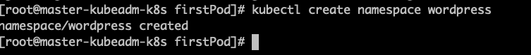

### 创建wordpress-db.yaml文件

```yaml
apiVersion: apps/v1beta1
kind: Deployment
metadata:
  name: mysql-deploy
  namespace: wordpress
  labels:
    app: mysql
spec:
  template:
    metadata:
      labels:
        app: mysql
    spec:
      containers:
      - name: mysql
        image: mysql:5.6  
        imagePullPolicy: IfNotPresent
        ports:
        - containerPort: 3306
          name: dbport
        env:
        - name: MYSQL_ROOT_PASSWORD
          value: rootPassW0rd
        - name: MYSQL_DATABASE
          value: wordpress
        - name: MYSQL_USER
          value: wordpress
        - name: MYSQL_PASSWORD
          value: wordpress
        volumeMounts:
        - name: db
          mountPath: /var/lib/mysql
      volumes:
      - name: db
        hostPath:
          path: /var/lib/mysql
---
apiVersion: v1
kind: Service
metadata:
  name: mysql
  namespace: wordpress
spec:
  selector:
    app: mysql
  ports:
  - name: mysqlport
    protocol: TCP
    port: 3306
    targetPort: dbport

```


### 根据wordpress-db.yaml创建资源[mysql数据库]

```shell
kubectl apply -f wordpress-db.yaml
kubectl get pods -n wordpress      
kubectl get svc mysql -n wordpress
kubectl describe svc mysql -n wordpress
```

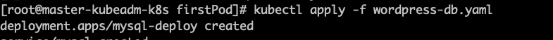.

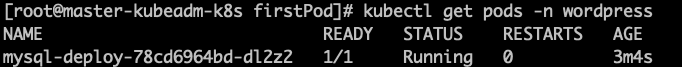

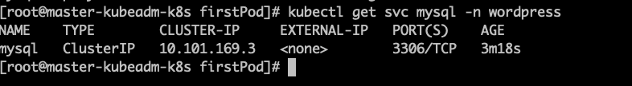

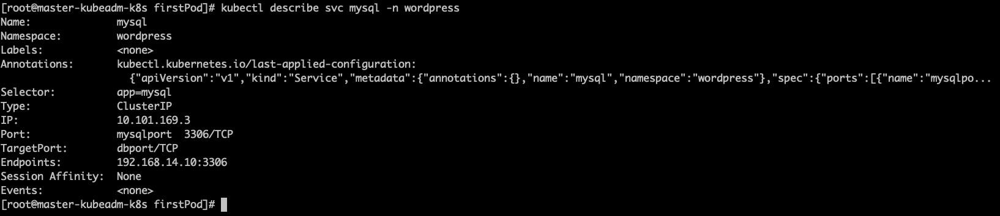

### 创建wordpress.yaml文件

```yaml
apiVersion: apps/v1beta1
kind: Deployment
metadata:
  name: wordpress-deploy
  namespace: wordpress
  labels:
    app: wordpress
spec:
  template:
    metadata:
      labels:
        app: wordpress
    spec:
      containers:
      - name: wordpress
        image: wordpress
        imagePullPolicy: IfNotPresent
        ports:
        - containerPort: 80
          name: wdport
        env:
        - name: WORDPRESS_DB_HOST
          value: mysql:3306                     
        - name: WORDPRESS_DB_USER
          value: wordpress
        - name: WORDPRESS_DB_PASSWORD
          value: wordpress
---
apiVersion: v1
kind: Service
metadata:
  name: wordpress
  namespace: wordpress
spec:
  type: NodePort
  selector:
    app: wordpress
  ports:
  - name: wordpressport
    protocol: TCP
    port: 80
    targetPort: wdport
```


### 根据wordpress.yaml创建资源[wordpress]

```shell
kubectl apply -f wordpress.yaml    
kubectl get pods -n wordpress 
kubectl get svc -n wordpress   # 获取到转发后的端口，如30063
```

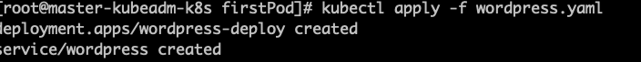

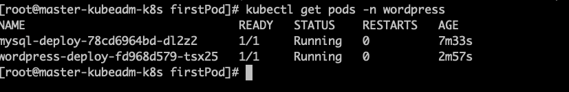


### 访问测试

mac浏览器上访问集群中任意宿主机节点的IP:31016

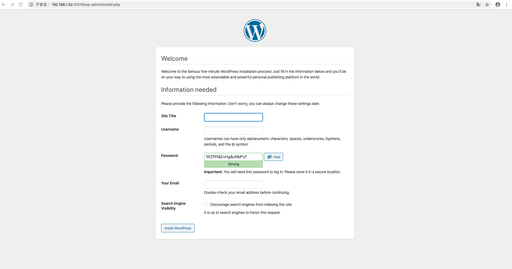

## 部署Spring Boot项目

### 流程

编写服务代码-->编写Dockerfile制作镜像-->上传镜像到仓库-->编写K8S文件-->创建

### 准备Spring Boot项目springboot-demo

创建Spring Boot项目编写如下代码：

```java
@RestController
public class K8SController {
    @RequestMapping("/k8s")
    public String k8s(){
        return "hello K8s!";
    }
}
```

### 生成xxx.jar，并且上传到springboot-demo目录

```
mvn clean pakcage
scp -P22  springboot-demo-0.0.1-SNAPSHOT.jar root@192.168.1.51:/root/springboot-demo
```

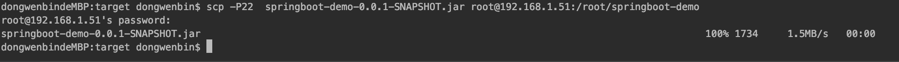

### 编写Dockerfile文件

> mkdir springboot-demo
>
> cd springboot-demo
>
> vi Dockerfile

```dockerfile
FROM openjdk:8-jre-alpine
COPY springboot-demo-0.0.1-SNAPSHOT.jar /springboot-demo.jar
ENTRYPOINT ["java","-jar","/springboot-demo.jar"]
```

### 根据Dockerfile创建image

```xshell
docker build -t springboot-demo-image .
```

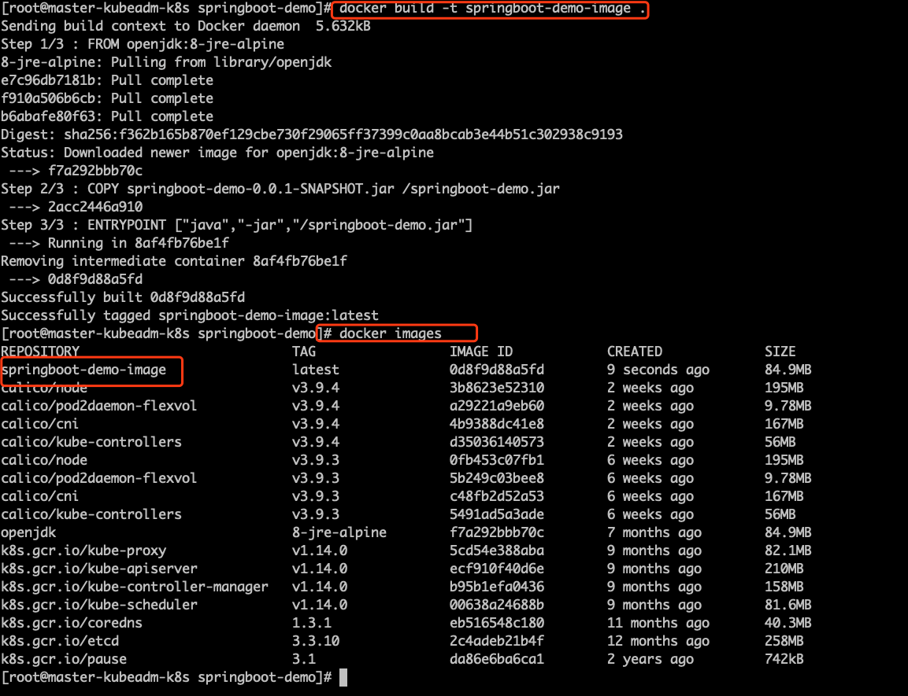

### 使用docker run创建container

```
docker run -d --name s1 springboot-demo-image
```

### 访问测试

```
docker inspect s1
curl ip:8080/k8s
```

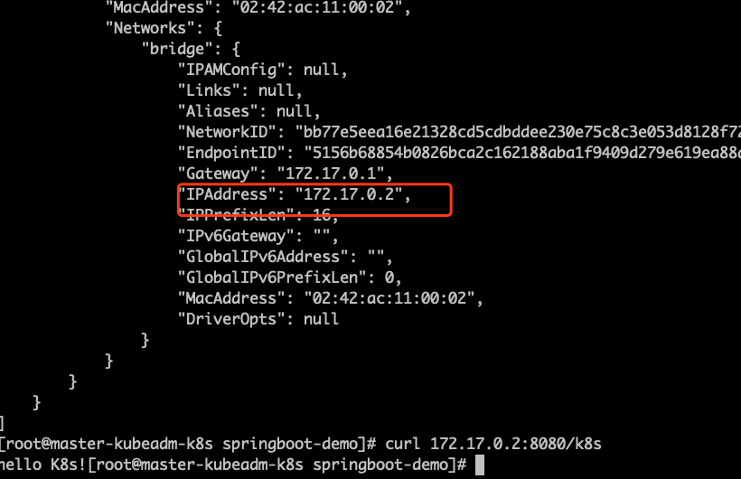

### 将镜像推送到镜像仓库

```shell
# 登录阿里云镜像仓库
# 这里注意如果是私有的仓库，集群内所有节点都需要登录。
docker login --username=dwb29872937343 registry.cn-beijing.aliyuncs.com

docker tag springboot-demo-image registry.cn-beijing.aliyuncs.com/dwb_repository/springboot-demo-image:v1.0

docker push registry.cn-beijing.aliyuncs.com/dwb_repository/springboot-demo-image:v1.0
```

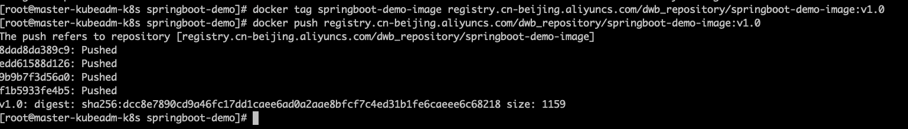

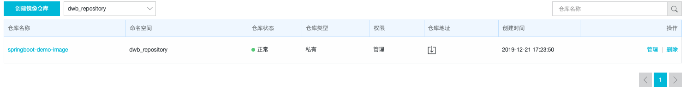

### 编写Kubernetes配置文件

> vi springboot-demo.yaml
>
> kubectl apply -f springboot-demo.yaml

```yaml
# 以Deployment部署Pod
apiVersion: apps/v1
kind: Deployment
metadata: 
  name: springboot-demo
spec: 
  selector: 
    matchLabels: 
      app: springboot-demo
  replicas: 1
  template: 
    metadata:
      labels: 
        app: springboot-demo
    spec: 
      containers: 
      - name: springboot-demo
        image: registry.cn-beijing.aliyuncs.com/dwb_repository/springboot-demo-image:v1.0
        ports: 
        - containerPort: 8080
---
# 创建Pod的Service
apiVersion: v1
kind: Service
metadata: 
  name: springboot-demo
spec: 
  ports: 
  - port: 80
    protocol: TCP
    targetPort: 8080
  selector: 
    app: springboot-demo
---
# 创建Ingress，定义访问规则，一定要记得提前创建好nginx ingress controller
apiVersion: extensions/v1beta1
kind: Ingress
metadata: 
  name: springboot-demo
spec: 
  rules: 
  - host: springboot.wenbin.com
    http: 
      paths: 
      - path: /
        backend: 
          serviceName: springboot-demo
          servicePort: 80
```

### 查看资源

```
kubectl get pods
kubectl get pods -o wide
curl pod_id:8080/k8s
kubectl get svc
kubectl scale deploy springboot-demo --replicas=5
```

### mac配置hosts文件[一定要记得提前创建好nginx ingress controller]

```
192.168.0.61 springboot.wenbin.com
```

### 浏览器访问

```
http://springboot.wenbin.com/k8s
```

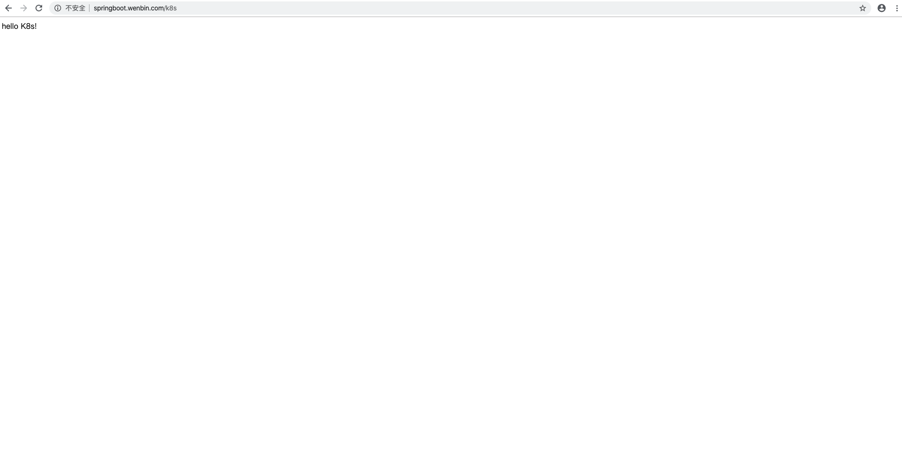

