# Kubernetes存储（Volumes PV PVC)

### 1.1 Volume

> `Volume`：https://kubernetes.io/docs/concepts/storage/volumes/
>
> ```
> On-disk files in a Container are ephemeral, which presents some problems for non-trivial applications when running in Containers. First, when a Container crashes, kubelet will restart it, but the files will be lost - the Container starts with a clean state. Second, when running Containers together in a Pod it is often necessary to share files between those Containers. The Kubernetes Volume abstraction solves both of these problems.
> ```

### 1.2 Host类型volume实战

> `背景`：定义一个Pod，其中包含两个Container，都使用Pod的Volume
>
> 

> (1)创建资源

volume-pod.yaml

```yaml
apiVersion: v1
kind: Pod
metadata:
  name: volume-pod
spec:
  containers:
  - name: nginx-container
    image: nginx
    ports:
    - containerPort: 80
    volumeMounts:
    - name: volume-pod
      mountPath: /nginx-volume
  - name: busybox-container
    image: busybox
    command: ['sh', '-c', 'echo The app is running! && sleep 3600']
    volumeMounts:
    - name: volume-pod
      mountPath: /busybox-volume
  volumes:
  - name: volume-pod
    hostPath:
      path: /tmp/volume-pod 
```

```
kubectl apply -f volume-pod.yaml
```

> (2)查看pod的运行情况

```
kubectl get pods -o wide
```

> (3)来到运行的worker节点

```shell
docker ps | grep volume
ls /tmp/volume-pod
docker exec -it containerid sh
ls /nginx-volume
ls /busybox-volume
# 折腾一下是否同步
```

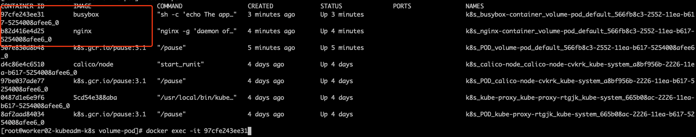

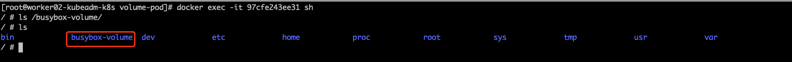

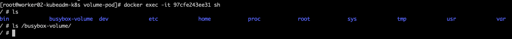

在宿主机的`/tmp/volume-pod`新建文件。

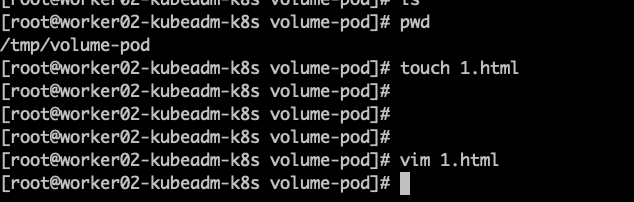

在去容器内查看

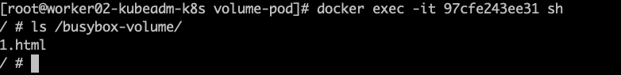

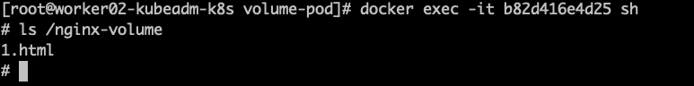

> 
>
> (4)查看pod中的容器里面的hosts文件，是否一样。
>
> 发现是一样的，并且都是由pod管理的

```
docker exec -it containerid cat /etc/hosts
```

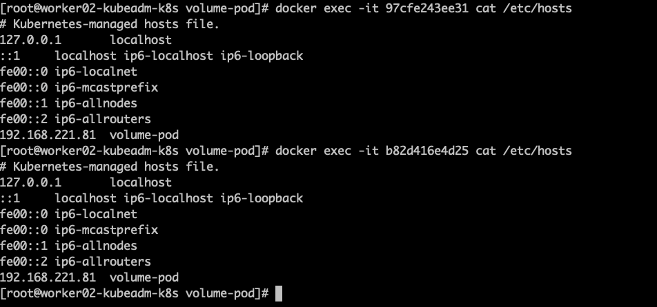

> (5)所以一般container中的存储或者网络的内容，不要在container层面修改，而是在pod中修改
>
> 比如下面修改一下网络
>
> ```yaml
> spec:
> hostNetwork: true
> hostPID: true
> hostAliases: 
>   - ip: "192.168.1.61"
>  hostnames: 
>     - "test.wenbin.com" 
> containers:
>   - name: nginx-container
>  image: nginx
> ```

### 1.3 PersistentVolume

> `官网`：https://kubernetes.io/docs/concepts/storage/persistent-volumes/

```yaml
apiVersion: v1
kind: PersistentVolume
metadata:
  name: my-pv
spec:
  capacity:
    storage: 5Gi    # 存储空间大小
  volumeMode: Filesystem
  accessModes:
    - ReadWriteOnce     # 只允许一个Pod进行独占式读写操作
  persistentVolumeReclaimPolicy: Recycle
  storageClassName: slow
  mountOptions:
    - hard
    - nfsvers=4.1
  nfs:
    path: /tmp            # 远端服务器的目录
    server: 172.17.0.2    # 远端的服务器
```

> 说白了，PV是K8s中的资源，volume的plugin实现，生命周期独立于Pod，封装了底层存储卷实现的细节。
>
> `注意`：PV的维护通常是由运维人员、集群管理员进行维护的。

### 1.4 PersistentVolumeClaim

> `官网`：<https://kubernetes.io/docs/concepts/storage/persistent-volumes/#persistentvolumeclaims>
>
> 有了PV，那Pod如何使用呢？为了方便使用，我们可以设计出一个PVC来绑定PV，然后把PVC交给Pod来使用即可，且听下面的分析。

```yaml
apiVersion: v1
kind: PersistentVolumeClaim
metadata:
  name: myclaim
spec:
  accessModes:
    - ReadWriteOnce
  volumeMode: Filesystem
  resources:
    requests:
      storage: 8Gi
  storageClassName: slow
  selector:
    matchLabels:
      release: "stable"
    matchExpressions:
      - {key: environment, operator: In, values: [dev]}
```

> 说白了，PVC会匹配满足要求的PV[**是根据size和访问模式进行匹配的**]，进行一一绑定，然后它们的状态都会变成Bound。
>
> 也就是PVC负责请求PV的大小和访问方式，然后Pod中就可以直接使用PVC咯。
>
> `注意`：PVC通常由开发小伙伴维护，开发小伙伴无需关注与存储细节。

### 1.5 Pod中如何使用PVC

> `官网`：<https://kubernetes.io/docs/concepts/storage/persistent-volumes/#claims-as-volumes>

```yaml
apiVersion: v1
kind: Pod
metadata:
  name: mypod
spec:
  containers:
    - name: myfrontend
      image: nginx
      volumeMounts:
      - mountPath: "/var/www/html"
        name: mypd
  volumes:
    - name: mypd
      persistentVolumeClaim:
        claimName: myclaim
```

### 1.6 Pod中使用PVC实战

> `背景`：使用nginx持久化存储演示
>
> ```
> (1)共享存储使用nfs，比如选择在m节点
> (2)创建pv和pvc
> (3)nginx pod中使用pvc
> ```

#### 1.6.1 master节点搭建nfs

> 在master节点上搭建一个NFS服务器，目录为/nfs/data
>
> ```shell
> nfs(network file system)网络文件系统，是FreeBSD支持的文件系统中的一种，允许网络中的计算机之间通过TCP/IP网络共享资源
> 
> 01 选择master节点作为nfs的server，所以在master节点上
> # 安装nfs
> 	yum install -y nfs-utils
> 	# 创建nfs目录
> 	mkdir -p /nfs/data/
> 	mkdir -p /nfs/data/mysql
> 	# 授予权限
> 	chmod -R 777 /nfs/data
> 	# 编辑export文件
> 	vi /etc/exports
> 	  /nfs/data *(rw,no_root_squash,sync)
> 	# 使得配置生效
> 	exportfs -r
> 	# 查看生效
> 	exportfs
> 	# 启动rpcbind、nfs服务
> 	systemctl restart rpcbind && systemctl enable rpcbind
> 	systemctl restart nfs && systemctl enable nfs
> 	# 查看rpc服务的注册情况
> 	rpcinfo -p localhost
> 	# showmount测试
> 	showmount -e master-ip
> 	
> 02 所有node上安装客户端
> 	yum -y install nfs-utils
> 	systemctl start nfs && systemctl enable nfs
> ```

#### 1.6.2 创建PV&PVC&Nginx

> (1)在nfs服务器创建所需要的目录
>
> mkdir -p /nfs/data/nginx

> (2)定义PV，PVC和Nginx的yaml文件
>
> nginx-pv-demo.yaml

```yaml
# 定义PV
apiVersion: v1
kind: PersistentVolume
metadata:
  name: nginx-pv
spec:
  accessModes:
    - ReadWriteMany
  capacity:
    storage: 2Gi    
  nfs:
    path: /nfs/data/nginx     
    server: 192.168.1.51vim
    
---
# 定义PVC，用于消费PV
apiVersion: v1
kind: PersistentVolumeClaim
metadata:
  name: nginx-pvc
spec:
  accessModes:
    - ReadWriteMany
  resources:
    requests:
      storage: 2Gi
  
---
# 定义Pod，指定需要使用的PVC
apiVersion: apps/v1beta1
kind: Deployment
metadata:
  name: nginx
spec:
  selector:
    matchLabels: 
      app: nginx
  template:
    metadata:
      labels:
        app: nginx
    spec:
      containers:
      - image: nginx
        name: mysql
        ports:
        - containerPort: 80
        volumeMounts:
        - name: nginx-persistent-storage
          mountPath: /usr/share/nginx/html
      volumes:
      - name: nginx-persistent-storage
        persistentVolumeClaim:
          claimName: nginx-pvc
```


> (3)根据yaml文件创建资源并查看资源

```shell
kubectl apply -f nginx-pv-demo.yaml
kubectl get pv,pvc
kubectl get pods -o wide
```

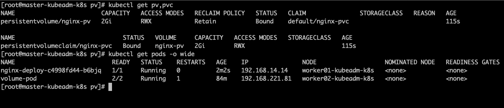


> (4)测试持久化存储

```shell
01 在/nfs/data/nginx新建文件1.html，写上内容
02 kubectl get pods -o wide   得到nginx-pod的ip地址
03 curl nginx-pod-ip/1.html
04 kubectl exec -it nginx-pod bash    进入/usr/share/nginx/html目录查看
05 kubectl delete pod nginx-pod
06 查看新nginx-pod的ip并且访问nginx-pod-ip/1.html
```

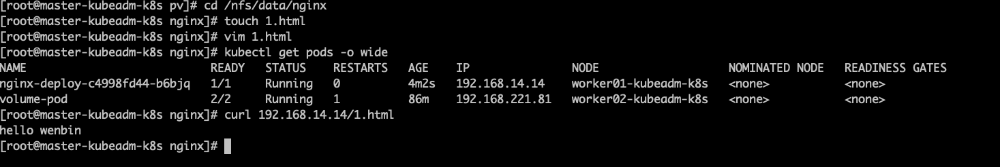


#### 1.6.3 图解理解一下


### 1.7 StorageClass

> 上面手动管理PV的方式还是有点low，能不能更加灵活一点呢？
>
> `官网`：<https://kubernetes.io/docs/concepts/storage/storage-classes/>
>
> `nfs github`：`github`：<https://github.com/kubernetes-incubator/external-storage/tree/master/nfs>
>
> ```
> A StorageClass provides a way for administrators to describe the “classes” of storage they offer. Different classes might map to quality-of-service levels, or to backup policies, or to arbitrary policies determined by the cluster administrators. Kubernetes itself is unopinionated about what classes represent. This concept is sometimes called “profiles” in other storage systems.
> ```
>
> ```
> Each StorageClass contains the fields provisioner, parameters, and reclaimPolicy, which are used when a PersistentVolume belonging to the class needs to be dynamically provisioned.
> 
> The name of a StorageClass object is significant, and is how users can request a particular class. Administrators set the name and other parameters of a class when first creating StorageClass objects, and the objects cannot be updated once they are created.
> ```
>
> StorageClass声明存储插件，用于自动创建PV。
>
> 说白了就是创建PV的模板，其中有两个重要部分：PV属性和创建此PV所需要的插件。
>
> 这样PVC就可以按“Class”来匹配PV。
>
> 可以为PV指定storageClassName属性，标识PV归属于哪一个Class。

```yaml
apiVersion: storage.k8s.io/v1
kind: StorageClass
metadata:
  name: standard
provisioner: kubernetes.io/aws-ebs
parameters:
  type: gp2
reclaimPolicy: Retain
allowVolumeExpansion: true
mountOptions:
  - debug
volumeBindingMode: Immediate
```

```
01 对于PV或者StorageClass只能对应一种后端存储
02 对于手动的情况，一般我们会创建很多的PV，等有PVC需要使用的时候就可以直接使用了
03 对于自动的情况，那么就由StorageClass来自动管理创建
04 如果Pod想要使用共享存储，一般会在创建PVC，PVC中描述了想要什么类型的后端存储、空间等，K8s从而会匹配对应的PV，如果没有匹配成功，Pod就会处于Pending状态。Pod中使用只需要像使用volumes一样，指定名字就可以使用了
05 一个Pod可以使用多个PVC，一个PVC也可以给多个Pod使用
06 一个PVC只能绑定一个PV，一个PV只能对应一种后端存储
```

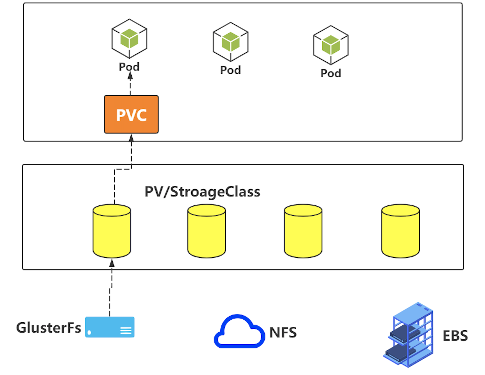

> 有了StorageClass之后的PVC可以变成这样
>
> ```yaml
> kind: PersistentVolumeClaim
> apiVersion: v1
> metadata:
> name: test-claim1
> spec:
> accessModes:
>     - ReadWriteMany
> resources:
>  requests:
>     storage: 1Mi
>   storageClassName: nfs
> ```

> StorageClass之所以能够动态供给PV，是因为Provisioner，也就是Dynamic Provisioning
>
> 但是NFS这种类型，K8s中默认是没有Provisioner插件的，需要自己创建

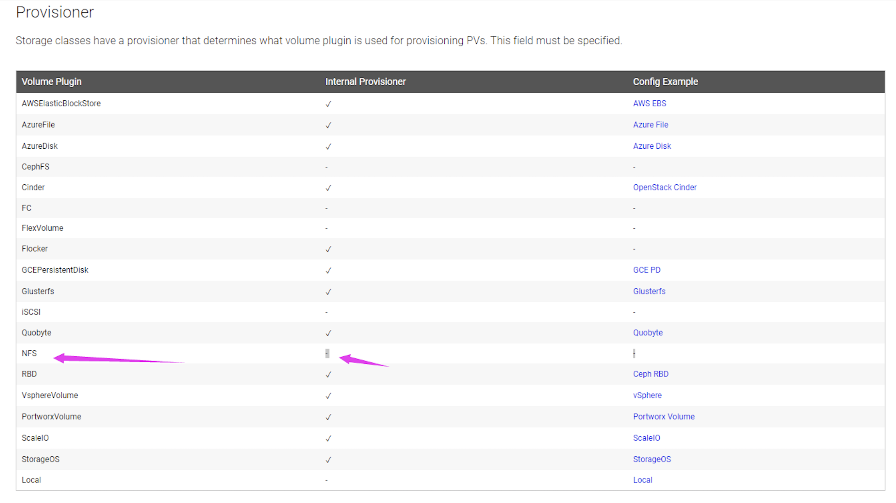

### 1.8 StorageClass实战

> `github`：<https://github.com/kubernetes-incubator/external-storage/tree/master/nfs>
>
> 

> (1)准备好NFS服务器[并且确保nfs可以正常工作]，创建持久化需要的目录
>
> path: /nfs/data/Wenbin
>
> server: 121.41.10.13  
>
> 比如mkdir -p /nfs/data/wenbin

> (2)根据rbac.yaml文件创建资源

```yaml
kind: ClusterRole
apiVersion: rbac.authorization.k8s.io/v1
metadata:
  name: nfs-provisioner-runner
rules:
  - apiGroups: [""]
    resources: ["persistentvolumes"]
    verbs: ["get", "list", "watch", "create", "delete"]
  - apiGroups: [""]
    resources: ["persistentvolumeclaims"]
    verbs: ["get", "list", "watch", "update"]
  - apiGroups: ["storage.k8s.io"]
    resources: ["storageclasses"]
    verbs: ["get", "list", "watch"]
  - apiGroups: [""]
    resources: ["events"]
    verbs: ["create", "update", "patch"]
  - apiGroups: [""]
    resources: ["services", "endpoints"]
    verbs: ["get"]
  - apiGroups: ["extensions"]
    resources: ["podsecuritypolicies"]
    resourceNames: ["nfs-provisioner"]
    verbs: ["use"]
---
kind: ClusterRoleBinding
apiVersion: rbac.authorization.k8s.io/v1
metadata:
  name: run-nfs-provisioner
subjects:
  - kind: ServiceAccount
    name: nfs-provisioner
     # replace with namespace where provisioner is deployed
    namespace: default
roleRef:
  kind: ClusterRole
  name: nfs-provisioner-runner
  apiGroup: rbac.authorization.k8s.io
---
kind: Role
apiVersion: rbac.authorization.k8s.io/v1
metadata:
  name: leader-locking-nfs-provisioner
rules:
  - apiGroups: [""]
    resources: ["endpoints"]
    verbs: ["get", "list", "watch", "create", "update", "patch"]
---
kind: RoleBinding
apiVersion: rbac.authorization.k8s.io/v1
metadata:
  name: leader-locking-nfs-provisioner
subjects:
  - kind: ServiceAccount
    name: nfs-provisioner
    # replace with namespace where provisioner is deployed
    namespace: default
roleRef:
  kind: Role
  name: leader-locking-nfs-provisioner
  apiGroup: rbac.authorization.k8s.io
```


```shell
kubectl apply -f rbac.yaml
```

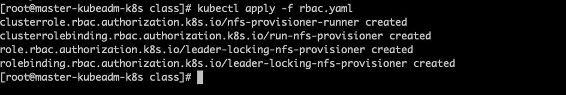


> (3)根据deployment.yaml文件创建资源

```yaml
apiVersion: v1
kind: ServiceAccount
metadata:
  name: nfs-provisioner
---
kind: Deployment
apiVersion: extensions/v1beta1
metadata:
  name: nfs-provisioner
spec:
  replicas: 1
  strategy:
    type: Recreate
  template:
    metadata:
      labels:
        app: nfs-provisioner
    spec:
      serviceAccount: nfs-provisioner
      containers:
        - name: nfs-provisioner
          image: registry.cn-hangzhou.aliyuncs.com/open-ali/nfs-client-provisioner
          volumeMounts:
            - name: nfs-client-root
              mountPath: /persistentvolumes
          env:
            - name: PROVISIONER_NAME
              value: example.com/nfs
            - name: NFS_SERVER
              value: 192.168.1.51
            - name: NFS_PATH
              value: /nfs/data/wenbin
      volumes:
        - name: nfs-client-root
          nfs:
            server: 192.168.1.51
            path: /nfs/data/wenbin
```


```shell
kubectl apply -f deployment.yaml
```

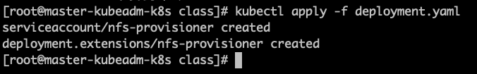

> (4)根据class.yaml创建资源

```yaml
kind: StorageClass
apiVersion: storage.k8s.io/v1
metadata:
  name: example-nfs
provisioner: example.com/nfs
```


```shell
kubectl apply -f class.yaml
```


> (5)根据pvc.yaml创建资源

```yaml
kind: PersistentVolumeClaim
apiVersion: v1
metadata:
  name: my-pvc
spec:
  accessModes:
    - ReadWriteMany
  resources:
    requests:
      storage: 1Mi
  # 这个名字要和上面创建的storageclass名称一致
  storageClassName: example-nfs
```


```shell
kubectl apply -f my-pvc.yaml
kubectl get pvc
```

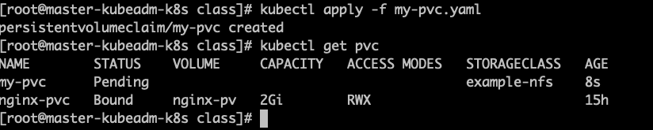

> (6)根据nginx-pod创建资源

```yaml
kind: Pod
apiVersion: v1
metadata:
  name: nginx
spec:
  containers:
  - name: nginx
    image: nginx
    volumeMounts:
      - name: my-pvc
        mountPath: "/usr/wenbin"
  restartPolicy: "Never"
  volumes:
    - name: my-pvc
      persistentVolumeClaim:
        claimName: my-pvc
```


```shell
kubectl apply -f nginx-pod.yaml
kubectl exec -it nginx bash
cd /usr/wenbin
# 进行同步数据测试
```


### 1.9 PV的状态和回收策略

- PV的状态

Available：表示当前的pv没有被绑定

Bound：表示已经被pvc挂载

Released：pvc没有在使用pv, 需要管理员手工释放pv

Failed：资源回收失败

- PV回收策略

Retain：表示删除PVC的时候，PV不会一起删除，而是变成Released状态等待管理员手动清理

Recycle：在Kubernetes新版本就不用了，采用动态PV供给来替代

Delete：表示删除PVC的时候，PV也会一起删除，同时也删除PV所指向的实际存储空间

`注意`：目前只有NFS和HostPath支持Recycle策略。AWS EBS、GCE PD、Azure Disk和Cinder支持Delete策略

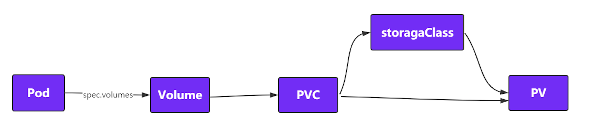