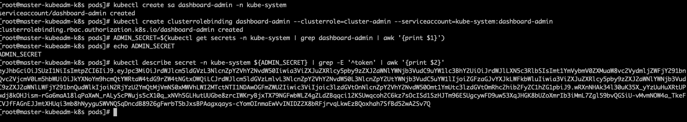

# Kubernetes深入掌握Pod

## 01 Pod进阶学习之路

### 1.1 Lifecycle

Pod的生命周期。

> `官网`：https://kubernetes.io/docs/concepts/workloads/pods/pod-lifecycle/

- 挂起（Pending）：Pod 已被 Kubernetes 系统接受，但有一个或者多个容器镜像尚未创建。等待时间包括调度 Pod 的时间和通过网络下载镜像的时间，这可能需要花点时间。
- 运行中（Running）：该 Pod 已经绑定到了一个节点上，Pod 中所有的容器都已被创建。至少有一个容器正在运行，或者正处于启动或重启状态。
- 成功（Succeeded）：Pod 中的所有容器都被成功终止，并且不会再重启。
- 失败（Failed）：Pod 中的所有容器都已终止了，并且至少有一个容器是因为失败终止。也就是说，容器以非0状态退出或者被系统终止。
- 未知（Unknown）：因为某些原因无法取得 Pod 的状态，通常是因为与 Pod 所在主机通信失败。

### 1.2 重启策略

> `官网`：<https://kubernetes.io/docs/concepts/workloads/pods/pod-lifecycle/#restart-policy>
>
> ```
> A PodSpec has a restartPolicy field with possible values Always, OnFailure, and Never. The default value is Always. restartPolicy applies to all Containers in the Pod. restartPolicy only refers to restarts of the Containers by the kubelet on the same node. Exited Containers that are restarted by the kubelet are restarted with an exponential back-off delay (10s, 20s, 40s …) capped at five minutes, and is reset after ten minutes of successful execution. As discussed in the Pods document, once bound to a node, a Pod will never be rebound to another node.
> ```

- Always：容器失效时，即重启
- OnFailure：容器终止运行且退出码不为0时重启
- Never:永远不重启

### 1.3 静态Pod

静态Pod是由kubelet进行管理的，并且存在于特定的Node上。

不能通过API Server进行管理，无法与ReplicationController,deployment或者DaemonSet进行关联，也无法进行健康检查。

### 1.4 健康检查

> `官网`：<https://kubernetes.io/docs/concepts/workloads/pods/pod-lifecycle/#container-probes>
>
> The kubelet can optionally perform and react to three kinds of probes on running Containers:
>
> - `livenessProbe`: Indicates whether the Container is running. If the liveness probe fails, the kubelet kills the Container, and the Container is subjected to its [restart policy](https://kubernetes.io/docs/concepts/workloads/pods/pod-lifecycle/#restart-policy). If a Container does not provide a liveness probe, the default state is `Success`.
> - `readinessProbe`: Indicates whether the Container is ready to service requests. If the readiness probe fails, the endpoints controller removes the Pod’s IP address from the endpoints of all Services that match the Pod. The default state of readiness before the initial delay is `Failure`. If a Container does not provide a readiness probe, the default state is `Success`.
> - `startupProbe`: Indicates whether the application within the Container is started. All other probes are disabled if a startup probe is provided, until it succeeds. If the startup probe fails, the kubelet kills the Container, and the Container is subjected to its [restart policy](https://kubernetes.io/docs/concepts/workloads/pods/pod-lifecycle/#restart-policy). If a Container does not provide a startup probe, the default state is `Success`.

LivenessProbe探针：判断容器是否存活

ReadinessProbe探针：判断容器是否启动完成

### 1.5 ConfigMap

> `官网`：<https://kubernetes.io/docs/tasks/configure-pod-container/configure-pod-configmap/>
>
> ```
> ConfigMaps allow you to decouple configuration artifacts from image content to keep containerized applications portable. 
> ```
>
> 说白了就是用来保存配置数据的键值对，也可以保存单个属性，也可以保存配置文件。
>
> 所有的配置内容都存储在etcd中，创建的数据可以供Pod使用。

#### 1.5.1 命令行创建

```shell
# 创建一个名称为my-config的ConfigMap，key值时db.port，value值是'3306'
kubectl create configmap my-config --from-literal=db.port='3306'
kubectl get configmap
```

> 详情信息：kubectl get configmap myconfig -o yaml
>
> ```yaml
> apiVersion: v1
> data:
> db.port: "3306"
> kind: ConfigMap
> metadata:
> creationTimestamp: "2019-11-22T09:50:17Z"
> name: my-config
> namespace: default
> resourceVersion: "691934"
> selfLink: /api/v1/namespaces/default/configmaps/my-config
> uid: 7d4f338b-0d0d-11ea-bb46-00163e0edcbd
> ```

#### 1.5.2 从配置文件中创建

创建一个文件，名称为app.properties

```
name=wenbin
age=18
```

```shell
kubectl create configmap app --from-file=./app.properties
kubectl get configmap
kubectl get configmap app -o yaml
```

#### 1.5.3 从目录中创建

```shell
mkdir config
cd config
mkdir a
mkdir b
cd ..
```

```
kubectl create configmap config --from-file=config/
kubectl get configmap
```

#### 1.5.4 通过yaml文件创建

configmaps.yaml

```yaml
apiVersion: v1
kind: ConfigMap
metadata:
  name: special-config
  namespace: default
data:
  special.how: very
---
apiVersion: v1
kind: ConfigMap
metadata:
  name: env-config
  namespace: default
data:
  log_level: INFO
```

```shell
kubectl apply -f configmaps.yaml
kubectl get configmap
```

#### 1.5.5 ConfigMap的使用

- 使用方式

```
(1)通过环境变量的方式，直接传递给pod
	使用configmap中指定的key
	使用configmap中所有的key
(2)通过在pod的命令行下运行的方式(启动命令中)
(3)作为volume的方式挂载到pod内
```

- 注意

```
(1)ConfigMap必须在Pod使用它之前创建
(2)使用envFrom时，将会自动忽略无效的键
(3)Pod只能使用同一个命名空间的ConfigMap
```

##### 1.5.5.1 通过环境变量使用

> 使用valueFrom、configMapKeyRef、name
>
> key的话指定要用到的key
>
> test-pod.yaml 
>
> kubectl logs pod-name

```yaml
apiVersion: v1
kind: Pod
metadata:
  name: dapi-test-pod
spec:
  containers:
    - name: test-container
      image: busybox
      command: [ "/bin/sh", "-c", "env" ]
      env:
        # Define the environment variable
        - name: SPECIAL_LEVEL_KEY
          valueFrom:
            configMapKeyRef:
              # The ConfigMap containing the value you want to assign to SPECIAL_LEVEL_KEY
              name: special-config
              # Specify the key associated with the value
              key: special.how
  restartPolicy: Never
```

##### 1.5.5.2 用作命令行参数

> 在命令行下引用时，需要先设置为环境变量，之后可以用过$(VAR_NAME)设置容器启动命令的启动参数
>
> test-pod2.yaml
>
> kubectl logs pod-name

```yaml
apiVersion: v1
kind: Pod
metadata:
  name: dapi-test-pod2
spec:
  containers:
    - name: test-container
      image: busybox
      command: [ "/bin/sh", "-c", "echo $(SPECIAL_LEVEL_KEY)" ]
      env:
        - name: SPECIAL_LEVEL_KEY
          valueFrom:
            configMapKeyRef:
              name: special-config
              key: special.how
  restartPolicy: Never
```

##### 1.5.5.3 作为volume挂载使用

> 将创建的ConfigMap直接挂载至Pod的/etc/config目录下，其中每一个key-value键值对都会生成一个文件，key为文件名，value为内容。
>
> kubectl apply -f pod-myconfigmap-v2.yml
>
> kubectl exec -it pod-name bash
>
> kubectl logs pod-name

```yaml
apiVersion: v1
kind: Pod
metadata:
  name: pod-configmap2
spec:
  containers:
    - name: test-container
      image: busybox
      command: [ "/bin/sh", "-c", "ls /etc/config/" ]
      volumeMounts:
      - name: config-volume
        mountPath: /etc/config
  volumes:
    - name: config-volume
      configMap:
        name: special-config
  restartPolicy: Never
```

#### 1.5.6 ConfigMap在Ingress Controller中实战

> 在之前ingress网络中的mandatory.yaml文件中使用了ConfigMap，于是我们可以打开
>
> 可以发现有nginx-configuration、tcp-services等名称的cm
>
> 而且也可以发现最后在容器的参数中使用了这些cm
>
> ```yaml
> containers:
>         - name: nginx-ingress-controller
>        image: quay.io/kubernetes-ingress-controller/nginx-ingress-controller:0.26.1
>        args:
>             - /nginx-ingress-controller
>             - --configmap=$(POD_NAMESPACE)/nginx-configuration
>             - --tcp-services-configmap=$(POD_NAMESPACE)/tcp-services
>             - --udp-services-configmap=$(POD_NAMESPACE)/udp-services
>             - --publish-service=$(POD_NAMESPACE)/ingress-nginx
>             - --annotations-prefix=nginx.ingress.kubernetes.io
> ```
>
> **开启证明之旅和cm的使用方式**

> (1)查看nginx ingress controller的pod部署
>
> kubectl get pods -n ingress-nginx -o wide

```
NAME                                        READY   STATUS    RESTARTS   AGE
nginx-ingress-controller-7c66dcdd6c-v8grg   1/1     Running   0          8d

NAME                                        READY   STATUS    RESTARTS   AGE   IP              NODE   NOMINATED NODE   READINESS GATES
nginx-ingress-controller-7c66dcdd6c-v8grg   1/1     Running   0          8d    172.16.31.150   w1     <none>           <none>
```

> (2)发现运行在w1节点上，说明w1上一定有对应的container，来到w1节点
>
> docker ps | grep ingress

```
ddde4b354852        quay.io/kubernetes-ingress-controller/nginx-ingress-controller   "/usr/bin/dumb-init …"   8 days ago          Up 8 days                               k8s_nginx-ingress-controller_nginx-ingress-controller-7c66dcdd6c-v8grg_ingress-nginx_b3e2f9a5-0943-11ea-b2b3-00163e0edcbd_0

b6b7412855c5        k8s.gcr.io/pause:3.1                                             "/pause"                 8 days ago          Up 8 days                               k8s_POD_nginx-ingress-controller-7c66dcdd6c-v8grg_ingress-nginx_b3e2f9a5-0943-11ea-b2b3-00163e0edcbd_0
```

> (3)不妨进入容器看看？
>
> docker exec -it ddde4b354852 bash

> (4)可以发现，就是一个nginx嘛，而且里面还有nginx.conf文件，美滋滋

```
/etc/nginx/nginx.conf
```

> (5)不妨打开nginx.conf文件看看
>
> 假如已经配置过ingress，不妨尝试搜索一下"k8s.demoxxx"/"itcrazy2016.com"

```conf
server {
	server_name k8s.itcrazy2016.com ;
```

> (6)到这里，大家应该有点感觉了，原来nginx ingress controller就是一个nginx，而所谓的ingress.yaml文件中配置的内容像itcrazy2016.com就会对应到nginx.conf中。

> (7)但是，不可能每次都进入到容器里面来修改，而且还需要手动重启nginx，很麻烦
>
> 一定会有好事之者来做这件事情，比如在K8s中有对应的方式，修改了什么就能修改nginx.conf文件

> (8)先查看一下nginx.conf文件中的内容，比如找个属性：proxy_connect_timeout 5s
>
> 我们想要将这个属性在K8s中修改成8s，可以吗？
>
> kubectl get cm -n ingress-nginx
>
> **网盘/课堂源码/nginx-config.yaml**
>
> kubectl apply -f nginx-config.yaml
>
> kubectl get cm -n ingress-nginx

```yaml
kind: ConfigMap
apiVersion: v1
metadata:
  name: nginx-configuration
  namespace: ingress-nginx
  labels:
    app: ingress-nginx
data:
  proxy-read-timeout: "208"
```

> (9)再次查看nginx.conf文件

> (10)其实定义规则都在nginx ingress controller的官网中
>
> <https://kubernetes.github.io/ingress-nginx/>
>
> <https://kubernetes.github.io/ingress-nginx/user-guide/nginx-configuration/>

### 1.6 Secret

> `官网`：<https://kubernetes.io/docs/concepts/configuration/secret/>
>
> ```
> Kubernetes secret objects let you store and manage sensitive information, such as passwords, OAuth tokens, and ssh keys.
> ```

#### 1.6.1 Secret类型

- Opaque：使用base64编码存储信息，可以通过`base64 --decode`解码获得原始数据，因此安全性弱。
- kubernetes.io/dockerconfigjson：用于存储docker registry的认证信息。
- kubernetes.io/service-account-token：用于被 serviceaccount 引用。serviceaccout 创建时 Kubernetes 会默认创建对应的 secret。Pod 如果使用了 serviceaccount，对应的 secret 会自动挂载到 Pod 的 /run/secrets/kubernetes.io/serviceaccount 目录中。

#### 1.6.2 Opaque Secret

> Opaque类型的Secret的value为base64位编码后的值

##### 1.6.2.1 从文件中创建

```
echo -n "admin" > ./username.txt
echo -n "1f2d1e2e67df" > ./password.txt
```

```shell
kubectl create secret generic db-user-pass --from-file=./username.txt --from-file=./password.txt
```

```
kubectl get secret
```

##### 1.6.2.2 使用yaml文件创建

> (1)对数据进行64位编码

```shell
echo -n 'admin' | base64
echo -n '1f2d1e2e67df' | base64

```

> (2)定义mysecret.yaml文件

```yaml
apiVersion: v1
kind: Secret
metadata:
  name: mysecret
type: Opaque
data:
  username: YWRtaW4=
  password: MWYyZDFlMmU2N2Rm
```

> (3)根据yaml文件创建资源并查看

```shell
kubectl create -f ./mysecret.yaml
kubectl get secret
kubectl get secret mysecret -o yaml
```

#### 1.6.3 Secret使用

- 以Volume方式
- 以环境变量方式

##### 1.6.3.1 将Secret挂载到Volume中

> kubectl apply -f mypod.yaml

```yaml
apiVersion: v1
kind: Pod
metadata:
  name: mypod
spec:
  containers:
  - name: mypod
    image: redis
    volumeMounts:
    - name: foo
      mountPath: "/etc/foo"
      readOnly: true
  volumes:
  - name: foo
    secret:
      secretName: mysecret
```

```shell
kubectl exec -it pod-name bash
ls /etc/foo
cat /etc/foo/username
cat /etc/foo/password
```

##### 1.6.3.2 将Secret设置为环境变量

```yaml
apiVersion: v1
kind: Pod
metadata:
  name: secret-env-pod
spec:
  containers:
  - name: mycontainer
    image: redis
    env:
      - name: SECRET_USERNAME
        valueFrom:
          secretKeyRef:
            name: mysecret
            key: username
      - name: SECRET_PASSWORD
        valueFrom:
          secretKeyRef:
            name: mysecret
            key: password
  restartPolicy: Never
```

#### 1.6.4 kubernetes.io/dockerconfigjson

> kubernetes.io/dockerconfigjson用于存储docker registry的认证信息，可以直接使用`kubectl create secret`命令创建

#### 1.6.5 kubernetes.io/service-account-token

> 用于被 serviceaccount 引用。
>
> serviceaccout 创建时 Kubernetes 会默认创建对应的 secret。Pod 如果使用了 serviceaccount，对应的 secret 会自动挂载到 Pod 的 /run/secrets/kubernetes.io/serviceaccount 目录中。

```shell
kubectl get secret   # 可以看到service-account-token
kubectl run nginx --image nginx
kubectl get pods
kubectl exec -it nginx-pod-name bash
ls /run/secrets/kubernetes.io/serviceaccount
```

```shell
kubectl get secret
kubectl get pods pod-name -o yaml   
#  找到volumes选项，定位到-name，secretName
#  找到volumeMounts选项，定位到mountPath: /var/run/secrets/kubernetes.io/serviceaccount
```

**小结**：无论是ConfigMap，Secret，还是DownwardAPI，都是通过ProjectedVolume实现的，可以通过APIServer将信息放到Pod中进行使用。

### 1.7 指定Pod所运行的Node

> (1)给node打上label

```
kubectl get nodes
kubectl label nodes worker02-kubeadm-k8s name=jack
```

> (2)查看node是否有上述label

```
kubectl describe node worker02-kubeadm-k8s
```

> (3)部署一个mysql的pod
>
> vi mysql-pod.yaml

```yaml
apiVersion: v1
kind: ReplicationController
metadata:
  name: mysql-rc
  labels:
    name: mysql-rc
spec:
  replicas: 1
  selector:
    name: mysql-pod
  template:
    metadata:
      labels: 
        name: mysql-pod
    spec:
      nodeSelector: 
        name: jack
      containers:
      - name: mysql
        image: mysql
        imagePullPolicy: IfNotPresent
        ports:
        - containerPort: 3306
        env:
        - name: MYSQL_ROOT_PASSWORD
          value: "mysql"
      
---
apiVersion: v1
kind: Service
metadata:
  name: mysql-svc
  labels: 
    name: mysql-svc
spec:
  type: NodePort
  ports:
  - port: 3306
    protocol: TCP
    targetPort: 3306
    name: http
    nodePort: 32306
  selector:
    name: mysql-pod
```

> (4)查看pod运行详情

```
kubectl apply -f mysql-pod.yaml
kubectl get pods -o wide
```

## 02 Controller进阶学习之路

> 既然学习了Pod进阶，对于管理Pod的Controller肯定也要进阶一下，之前我们已经学习过的Controller有RC、RS和Deployment，除此之外还有吗？
>
> `官网`：<https://kubernetes.io/docs/concepts/architecture/controller/>

### 2.1 Job & CronJob

#### 2.1.1 Job

> `官网`：https://kubernetes.io/docs/concepts/workloads/controllers/jobs-run-to-completion/
>
> ```
> A Job creates one or more Pods and ensures that a specified number of them successfully terminate. As pods successfully complete, the Job tracks the successful completions. When a specified number of successful completions is reached, the task (ie, Job) is complete. Deleting a Job will clean up the Pods it created.
> ```
>
> 对于RS，RC之类的控制器，能够保持Pod按照预期数目持久地运行下去，它们针对的是持久性的任务，比如web服务。
>
> 而有些操作其实不需要持久，比如压缩文件，我们希望任务完成之后，Pod就结束运行，不需要保持在系统中，此时就需要用到Job。
>
> 所以可以这样理解，Job是对RS、RC等持久性控制器的补充。
>
> 负责批量处理短暂的一次性任务，仅执行一次，并保证处理的一个或者多个Pod成功结束。

**Have a try**

Here is an example Job config. It computes π to 2000 places and prints it out. It takes around 10s to complete.

```yaml
apiVersion: batch/v1
kind: Job
metadata:
  name: job-demo
spec:
  template:
    metadata:
      name: job-demo
    spec:
      restartPolicy: Never
      containers:
      - name: counter
        image: busybox
        command:
        - "bin/sh"
        - "-c"
        - "for i in 9 8 7 6 5 4 3 2 1; do echo $i; done"
```

> kubectl apply -f job.yaml
>
> kubectl describe jobs/pi
>
> kubectl logs pod-name

- 非并行Job:
  - 通常只运行一个Pod，Pod成功结束Job就退出。
- 固定完成次数的并行Job:
  - 并发运行指定数量的Pod，直到指定数量的Pod成功，Job结束。
- 带有工作队列的并行Job:
  - 用户可以指定并行的Pod数量，当任何Pod成功结束后，不会再创建新的Pod
  - 一旦有一个Pod成功结束，并且所有的Pods都结束了，该Job就成功结束。
  - 一旦有一个Pod成功结束，其他Pods都会准备退出。

#### 2.1.2 CronJob

> `官网`：https://kubernetes.io/docs/concepts/workloads/controllers/cron-jobs/
>
> ```
> A Cron Job creates Jobs on a time-based schedule.
> 
> One CronJob object is like one line of a crontab (cron table) file. It runs a job periodically on a given schedule, written in Cron format.
> ```
>
> cronJob是基于时间进行任务的定时管理。

- 在特定的时间点运行任务
- 反复在指定的时间点运行任务：比如定时进行数据库备份，定时发送电子邮件等等。

### 2.2 StatefulSet

> `官网`：<https://kubernetes.io/docs/concepts/workloads/controllers/statefulset/>
>
> ```
> StatefulSet is the workload API object used to manage stateful applications.
> 
> Manages the deployment and scaling of a set of Pods, and provides guarantees about the ordering and uniqueness of these Pods.
> ```
>
> - Stable, unique network identifiers.
> - Stable, persistent storage.
> - Ordered, graceful deployment and scaling.
> - Ordered, automated rolling updates.
>
> ------
>
> 之前接触的Pod的管理对象比如RC、Deployment、DaemonSet和Job都是面向无状态的服务，但是现实中有很多服务是有状态的，比如MySQL集群、MongoDB集群、ZK集群等，它们都有以下共同的特点：
>
> - 每个节点都有固定的ID，通过该ID，集群中的成员可以互相发现并且通信
> - 集群的规模是比较固定的，集群规模不能随意变动
> - 集群里的每个节点都是有状态的，通常会持久化数据到永久存储中
> - 如果磁盘损坏，则集群里的某个节点无法正常运行，集群功能受损
>
> 而之前的RC/Deployment没办法满足要求，所以从Kubernetes v1.4版本就引入了PetSet资源对象，在v1.5版本时更名为StatefulSet。从本质上说，StatefulSet可以看作是Deployment/RC对象的特殊变种
>
> - StatefulSet里的每个Pod都有稳定、唯一的网络标识，可以用来发现集群内其他的成员
> - Pod的启动顺序是受控的，操作第n个Pod时，前n-1个Pod已经是运行且准备好的状态
> - StatefulSet里的Pod采用稳定的持久化存储卷，通过PV/PVC来实现，删除Pod时默认不会删除与StatefulSet相关的存储卷
> - StatefulSet需要与Headless Service配合使用

**Have a try**

> kubectl apply nginx-st.yaml
>
> watch kubectl get pods    # 观察pod的创建顺序，以及pod的名字

```yaml
# 定义Service
apiVersion: v1
kind: Service
metadata:
  name: nginx
  labels:
    app: nginx
spec:
  ports:
  - port: 80
    name: web
  clusterIP: None
  selector:
    app: nginx
---
# 定义StatefulSet
apiVersion: apps/v1
kind: StatefulSet
metadata:
  name: web
spec:
  selector:
    matchLabels:
      app: nginx 
  serviceName: "nginx"  
  replicas: 3 
  template:
    metadata:
      labels:
        app: nginx 
    spec:
      terminationGracePeriodSeconds: 10
      containers:
      - name: nginx
        image: nginx
        ports:
        - containerPort: 80
          name: web
```

### 2.3 DaemonSet

> `官网`：https://kubernetes.io/docs/concepts/workloads/controllers/daemonset/
>
> ```
> A DaemonSet ensures that all (or some) Nodes run a copy of a Pod. As nodes are added to the cluster, Pods are added to them. As nodes are removed from the cluster, those Pods are garbage collected. Deleting a DaemonSet will clean up the Pods it created.
> ```
>
> **DaemonSet应用场景**
>
> - 运行集群存储 daemon，例如在每个节点上运行 `glusterd`、`ceph`。
> - 在每个节点上运行日志收集 daemon，例如`fluentd`、`logstash`。
> - 在每个节点上运行监控 daemon，例如 [Prometheus Node Exporter](https://github.com/prometheus/node_exporter)、`collectd`、Datadog 代理、New Relic 代理，或 Ganglia `gmond`。

### 2.4 Horizontal Pod Autoscaler

> `官网`：https://kubernetes.io/docs/tasks/run-application/horizontal-pod-autoscale/
>
> ```
> The Horizontal Pod Autoscaler automatically scales the number of pods in a replication controller, deployment or replica set based on observed CPU utilization (or, with custom metrics support, on some other application-provided metrics). Note that Horizontal Pod Autoscaling does not apply to objects that can’t be scaled, for example, DaemonSets.
> ```
>
> 使用Horizontal Pod Autoscaling，Kubernetes会自动地根据观察到的CPU利用率(或者通过一些其他应用程序提供的自定义的指标)自动地缩放在replication controller、deployment或replica set上pod的数量。

> (0)前期准备
>
> kubectl apply -f nginx-deployment.yaml
>
> ```yaml
> apiVersion: apps/v1
> kind: Deployment
> metadata:
>   name: nginx-deployment
>   labels:
>     app: nginx
> spec:
>   replicas: 3
>   selector:
>     matchLabels:
>       app: nginx
>   template:
>     metadata:
>       labels:
>         app: nginx
>     spec:
>       containers:
>       - name: nginx
>         image: nginx
>         ports:
>           - containerPort: 80
> ```

> (1)创建hpa

```shell
# 使nginx pod的数量介于2和10之间，CPU使用率维持在50％
kubectl autoscale deployment nginx-deployment --min=2 --max=10 --cpu-percent=50
```

> (2)查看所有创建的资源

```shell
kubectl get pods
kubectl get deploy
kubectl get hpa
```

> (3)修改replicas值为1或者11
>
> 可以发现最终最小还是2，最大还是10

```shell
kubectl edit deployment nginx-deployment
```

> (4)再次理解什么是hpa
>
> ```
> Horizontal Pod Autoscaling可以根据CPU使用率或应用自定义metrics自动扩展Pod数量（支持replication controller、deployment和replica set）
> ```
>
> ```
> 01-控制管理器每隔30s查询metrics的资源使用情况
> 02-通过kubectl创建一个horizontalPodAutoscaler对象，并存储到etcd中
> 03-APIServer:负责接受创建hpa对象，然后存入etcd
> ```

## 03 Resource和Dashboard

### 3.1 Resource

> 因为K8S的最小操作单元是Pod，所以这里主要讨论的是Pod的资源
>
> `官网`：<https://kubernetes.io/docs/concepts/configuration/manage-compute-resources-container/>
>
> 在K8S的集群中，Node节点的资源信息会上报给APIServer

> **requests&limits**
>
> 可以通过这两个属性设置cpu和内存
>
> ```
> When Containers have resource requests specified, the scheduler can make better decisions about which nodes to place Pods on. And when Containers have their limits specified, contention for resources on a node can be handled in a specified manner.
> ```
>
> ```yaml
> apiVersion: v1
> kind: Pod
> metadata:
>   name: frontend
> spec:
>   containers:
>     - name: db
>       image: mysql
>       env:
>         - name: MYSQL_ROOT_PASSWORD
>           value: "password"
>       resources:
>         requests:
>           memory: "64Mi"     # 表示64M需要内存
>           cpu: "250m"        # 表示需要0.25核的CPU
>         limits:
>           memory: "128Mi"
>           cpu: "500m"
>     - name: wp
>       image: wordpress
>       resources:
>         requests:
>           memory: "64Mi"
>           cpu: "250m"
>         limits:
>           memory: "128Mi"
>           cpu: "500m"
> ```

### 3.2 Dashboard

> `官网`：<https://kubernetes.io/docs/tasks/access-application-cluster/web-ui-dashboard/>
>
> ```
> Dashboard is a web-based Kubernetes user interface. You can use Dashboard to deploy containerized applications to a Kubernetes cluster, troubleshoot your containerized application, and manage the cluster resources. You can use Dashboard to get an overview of applications running on your cluster, as well as for creating or modifying individual Kubernetes resources (such as Deployments, Jobs, DaemonSets, etc). For example, you can scale a Deployment, initiate a rolling update, restart a pod or deploy new applications using a deploy wizard.
> ```

> (1)根据yaml文件创建资源
>
> **dashboard.yaml**

```yaml
apiVersion: v1
kind: ConfigMap
metadata:
  labels:
    k8s-app: kubernetes-dashboard
    # Allows editing resource and makes sure it is created first.
    addonmanager.kubernetes.io/mode: EnsureExists
  name: kubernetes-dashboard-settings
  namespace: kube-system
---
apiVersion: v1
kind: ServiceAccount
metadata:
  labels:
    k8s-app: kubernetes-dashboard
    addonmanager.kubernetes.io/mode: Reconcile
  name: kubernetes-dashboard
  namespace: kube-system
---
apiVersion: apps/v1
kind: Deployment
metadata:
  name: kubernetes-dashboard
  namespace: kube-system
  labels:
    k8s-app: kubernetes-dashboard
    kubernetes.io/cluster-service: "true"
    addonmanager.kubernetes.io/mode: Reconcile
spec:
  selector:
    matchLabels:
      k8s-app: kubernetes-dashboard
  template:
    metadata:
      labels:
        k8s-app: kubernetes-dashboard
      annotations:
        scheduler.alpha.kubernetes.io/critical-pod: ''
        seccomp.security.alpha.kubernetes.io/pod: 'docker/default'
    spec:
      priorityClassName: system-cluster-critical
      containers:
      - name: kubernetes-dashboard
        image: registry.cn-hangzhou.aliyuncs.com/itcrazy2016/kubernetes-dashboard-amd64:v1.8.3
        resources:
          limits:
            cpu: 100m
            memory: 300Mi
          requests:
            cpu: 50m
            memory: 100Mi
        ports:
        - containerPort: 8443
          protocol: TCP
        args:
          # PLATFORM-SPECIFIC ARGS HERE
          - --auto-generate-certificates
        volumeMounts:
        - name: kubernetes-dashboard-certs
          mountPath: /certs
        - name: tmp-volume
          mountPath: /tmp
        livenessProbe:
          httpGet:
            scheme: HTTPS
            path: /
            port: 8443
          initialDelaySeconds: 30
          timeoutSeconds: 30
      volumes:
      - name: kubernetes-dashboard-certs
        secret:
          secretName: kubernetes-dashboard-certs
      - name: tmp-volume
        emptyDir: {}
      serviceAccountName: kubernetes-dashboard
      tolerations:
      - key: "CriticalAddonsOnly"
        operator: "Exists"
---
apiVersion: rbac.authorization.k8s.io/v1
kind: Role
metadata:
  labels:
    k8s-app: kubernetes-dashboard
    addonmanager.kubernetes.io/mode: Reconcile
  name: kubernetes-dashboard-minimal
  namespace: kube-system
rules:
  # Allow Dashboard to get, update and delete Dashboard exclusive secrets.
- apiGroups: [""]
  resources: ["secrets"]
  resourceNames: ["kubernetes-dashboard-key-holder", "kubernetes-dashboard-certs"]
  verbs: ["get", "update", "delete"]
  # Allow Dashboard to get and update 'kubernetes-dashboard-settings' config map.
- apiGroups: [""]
  resources: ["configmaps"]
  resourceNames: ["kubernetes-dashboard-settings"]
  verbs: ["get", "update"]
  # Allow Dashboard to get metrics from heapster.
- apiGroups: [""]
  resources: ["services"]
  resourceNames: ["heapster"]
  verbs: ["proxy"]
- apiGroups: [""]
  resources: ["services/proxy"]
  resourceNames: ["heapster", "http:heapster:", "https:heapster:"]
  verbs: ["get"]
---
apiVersion: rbac.authorization.k8s.io/v1
kind: RoleBinding
metadata:
  name: kubernetes-dashboard-minimal
  namespace: kube-system
  labels:
    k8s-app: kubernetes-dashboard
    addonmanager.kubernetes.io/mode: Reconcile
roleRef:
  apiGroup: rbac.authorization.k8s.io
  kind: Role
  name: kubernetes-dashboard-minimal
subjects:
- kind: ServiceAccount
  name: kubernetes-dashboard
  namespace: kube-system
---
apiVersion: v1
kind: Secret
metadata:
  labels:
    k8s-app: kubernetes-dashboard
    # Allows editing resource and makes sure it is created first.
    addonmanager.kubernetes.io/mode: EnsureExists
  name: kubernetes-dashboard-certs
  namespace: kube-system
type: Opaque
---
apiVersion: v1
kind: Secret
metadata:
  labels:
    k8s-app: kubernetes-dashboard
    # Allows editing resource and makes sure it is created first.
    addonmanager.kubernetes.io/mode: EnsureExists
  name: kubernetes-dashboard-key-holder
  namespace: kube-system
type: Opaque
---
apiVersion: v1
kind: Service
metadata:
  name: kubernetes-dashboard
  namespace: kube-system
  labels:
    k8s-app: kubernetes-dashboard
    kubernetes.io/cluster-service: "true"
    addonmanager.kubernetes.io/mode: Reconcile
spec:
  selector:
    k8s-app: kubernetes-dashboard
  ports:
  - port: 443
    targetPort: 8443
    nodePort: 30018
  type: NodePort

```


> kubectl apply -f dashboard.yaml

> (2)查看资源

```shell
kubectl get pods -n kube-system
kubectl get pods -n kube-system -o wide
kubectl get svc -n kube-system
kubectl get deploy kubernetes-dashboard -n kube-system
```

> (3)使用火狐浏览器访问 https://集群任意宿主机IP:NodePort

```
https://192.168.1.52:30018/
```

> (4)生成登录需要的token

```shell
# 创建service account
kubectl create sa dashboard-admin -n kube-system

# 创建角色绑定关系
kubectl create clusterrolebinding dashboard-admin --clusterrole=cluster-admin --serviceaccount=kube-system:dashboard-admin

# 查看dashboard-admin的secret名字
ADMIN_SECRET=$(kubectl get secrets -n kube-system | grep dashboard-admin | awk '{print $1}')
echo ADMIN_SECRET

# 打印secret的token
kubectl describe secret -n kube-system ${ADMIN_SECRET} | grep -E '^token' | awk '{print $2}'
```

## 

