# Kubernetes核心组件

## Master和Node

> 官网 :https://kubernetes.io/zh/docs/concepts/architecture/master-node-communication/

### Master

K8S集群中的控制节点，负责整个集群的管理和控制，可以做成高可用，防止一台Master宕机或者不可用。 其中有一些关键的组件:比如API Server，Controller Manager，Scheduler等

### Node

Node会被Master分配一些工作负载，当某个Node不可用时，会将工作负载转移到其他Node节点上。 Node上有一些关键的进程:kubelet，kube-proxy，docker等。

查看集群中的Node

```
kubectl get nodes
kubectl describe node node-name
```

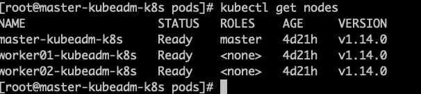

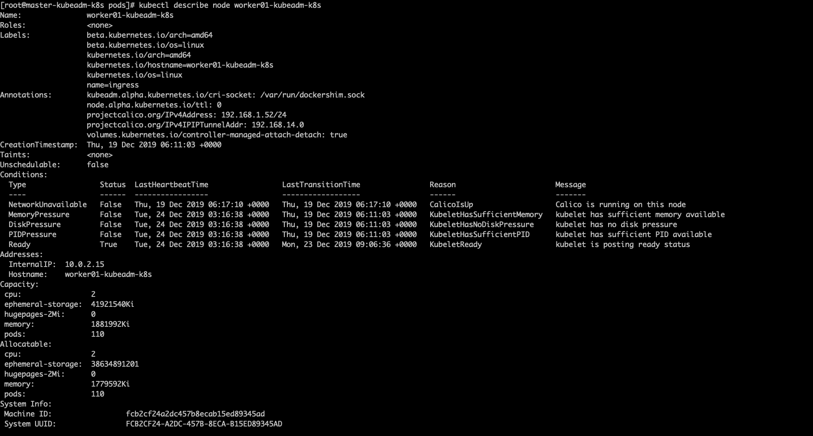

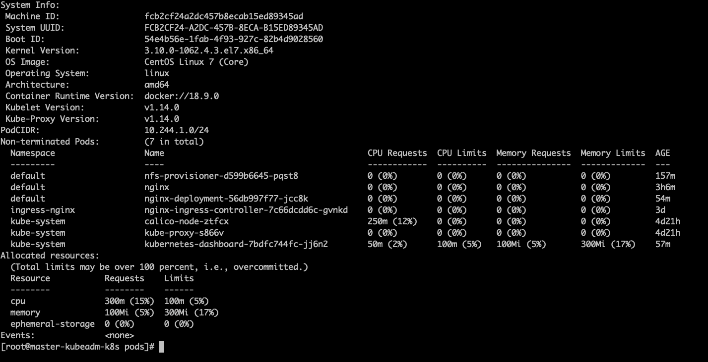

## kubeadm

### kubeadm init

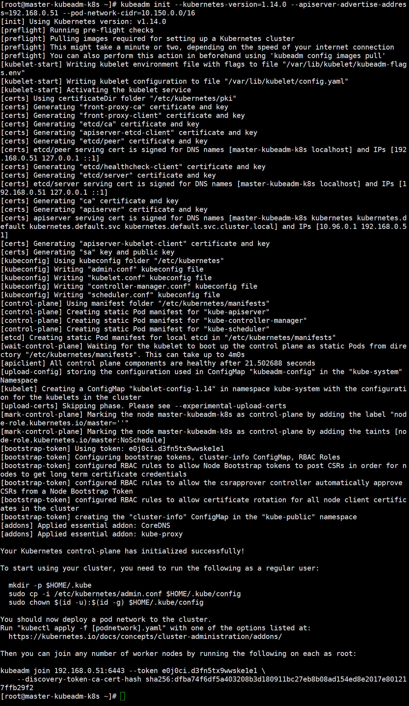

1. 进行一系列检查[init之前的检查]，以确定这台机器可以部署kubernetes

   kubeadm init pre-flight check:

   1. kubeadm版本与要安装的kubernetes版本的检查
   2. kubernetes安装的系统需求检查[centos版本、cgroup、docker等]
   3. 用户、主机、端口、swap等

2. 生成kubernetes对外提供服务所需要的各种证书可对应目录，也就是生成私钥和数字证书。

   /etc/kubernetes/pki/*

   1. 自建ca，生成ca.key和ca.crt
   2. apiserver的私钥与公钥证书
   3. apiserver访问kubelet使用的客户端私钥与证书
   4. sa.key和sa.pub
   5. etcd相关私钥和数字证书

3. 为其他组件生成访问kube-ApiServer所需的配置文件xxx.conf

   ```shell
   ls /etc/kubernetes/
   admin.conf controller-manager.conf kubelet.conf scheduler.conf
   ```

   1. 有了$HOME/.kube/config就可以使用kubectl和K8s集群打交道了，这个文件是来自于 admin.config

      ```shell
      mkdir -p $HOME/.kube
      sudo cp -i /etc/kubernetes/admin.conf $HOME/.kube/config 
      sudo chown $(id -u):$(id -g) $HOME/.kube/config
      ```

   2. kubeconfig中包含了cluster、user和context信息:kubectl config view

      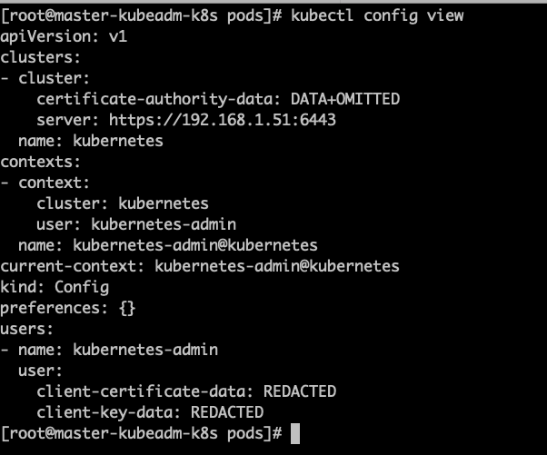

   3. 允许kubectl快速切换context，管理多集群

4. 为master生成Pod配置文件，这些组件会被master节点上的kubelet读取到，并且创建对应资源。

   ```shell
   ls /etc/kubernetes/manifests/*.yaml
   kube-apiserver.yaml
   kube-controller-manager.yaml
   kube-scheduler.yaml
   ```

   这些pod由kubelet直接管理，是静态pod，直接使用主机网络kubelet读取manifests目录并管理各控制平台组件pod的启动与停止要想修改这些pod，直接修改manifests下的yaml文件即可。

5. 下载镜像[这里的镜像我们已经提前准备好了]，等待控制平面启动。k8s.gcr.io下载不了，所以我们先提前下载并且tag好了。

6. 一旦这些YAML文件出现在被kubelet监视的`/etc/kubernetes/manifests/`目录下，kubelet就会自动 创建这些yaml文件定义的pod，即master组件的容器。master容器启动后，kubeadm会通过检查`localhost: 6443/healthz`这个master组件的健康状态检查URL，等待master组件完全运行起来。

   【 cat /etc/kubernetes/manifests/kube-apiserver.yaml里面有健康检查的配置】

   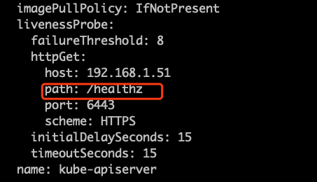

7. 为集群生成一个bootstrap token，设定当前node为master，master节点将不承担工作负载。

8. 将ca.crt等 Master节点的重要信息，通过ConfigMap的方式保存在etcd中，工后续部署node节点使用

9. 安装默认插件，kubernetes默认kube-proxy和DNS两个插件是必须安装的，dns插件安装了会出于pending状态，要等网络插件安装完成，比如calico。

   `kubectl get daemonset -n kube-system`可以看到kube-proxy和calico[或者其他网络插件]

   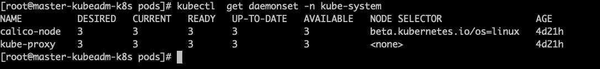

### kubeadm join

```shell
kubeadm join 192.168.1.51:6443 --token yu1ak0.2dcecvmpozsy8loh \ --discovery-token-ca-cert-hash sha256:5c4a69b3bb05b81b675db5559b0e4d7972f1d0a61195f217161522f464c307b0
```

1. join前检查

2. discovery-token-ca-cert-hash用于验证master身份

   ```shell
   # 可以计算出来，在w节点上执行
   openssl x509 -in /etc/kubernetes/pki/ca.crt -noout -pubkey | openssl rsa -pubin -outform DER 2>/dev/null | sha256sum | cut -d ' ' -f1
   ```

   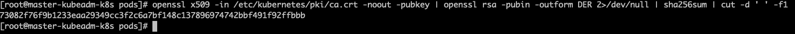

3. token用于master验证node

   ```shell
   # 在master上节点上，可以查看对应的token
   kubectl get secret -n kube-system | grep bootstrap-token
   # 得到token的值
   kubectl get secret/bootstrap-token-f6qehl -n kube-system -o yaml 
   # 对token的值进行解码
   echo ejh2ZDU1cWk1Y2VpbTFxOA==|base64 -d 
   ```

   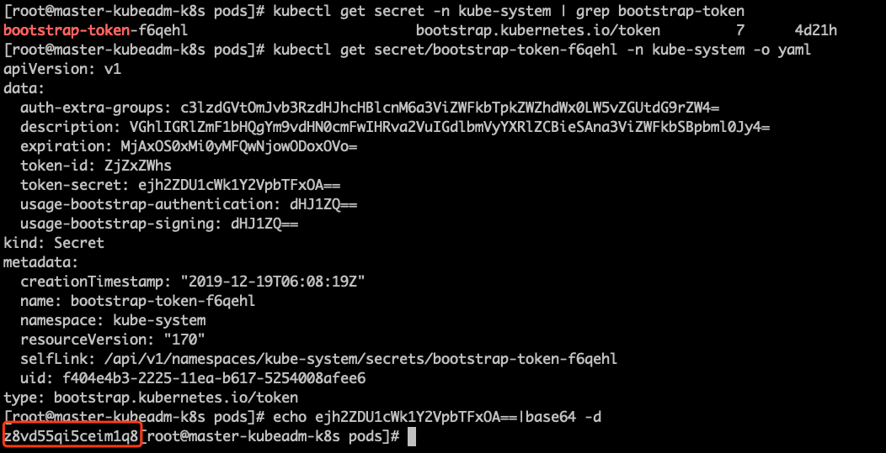

4. 重新生成join信息

   ```shell
   kubeadm join 主节点ip地址:6443 --token token填这里  --discovery-token-ca-cert-hash sha256:哈希值填这里
   ```

## 核心组件总览

看一下之前的K8s架构图

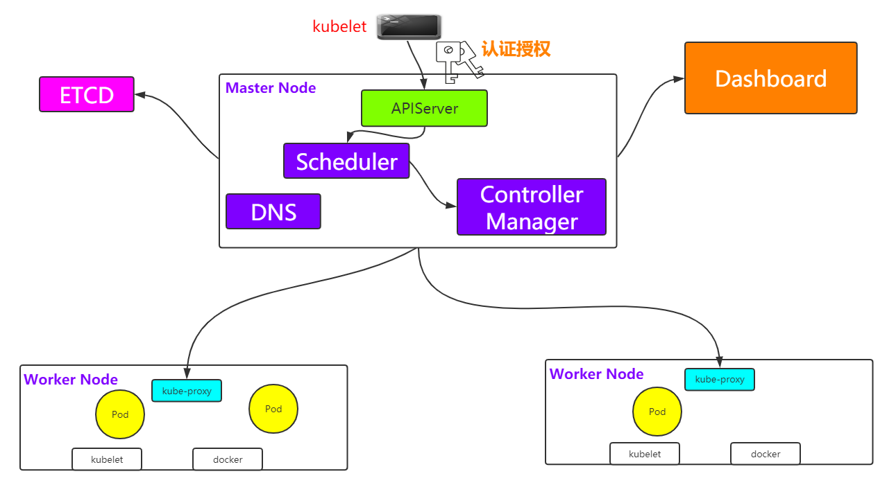

### kubectl

总得要有一个操作集群的客户端，也就是和集群打交道。

### kube-apiserver

整个集群的中枢纽带，负责的事情很多。

总体来看，KubernetesAPIServer的核心功能是提供Kubernetes各类资源对象（如Pod、RC、Service等）的增、删、改、查及Watch等HTTPRest接口，成为集群内各个功能模块之间数据交互和通信的中心枢纽，是整个系统的数据总线和数据中心。除此之外，它还有以下一些功能特性。

```shell
(1)/etc/kubernetes/manifests/kube-apiserver.yaml 		# kubelet管理的静态pod
(2)--insecure-port=0 # 默认使用http非安全协议访问 
(3)安全验证的一些文件
(4)准入策略的拦截器 
(5)--authorization-mode=Node,RBAC
(6)--etcd # 配置apiserver与etcd通信
```

### kube-scheduler

KubernetesScheduler的作用是将待调度的Pod（API新创建的Pod、ControllerManager为补足副本而创建的Pod等）按照特定的调度算法和调度策略绑定（Binding）到集群中某个合适的Node上，并将绑定信息写入etcd中。在整个调度过程中涉及三个对象，分别是待调度Pod列表、可用Node列表，以及调度算法和策略。简单地说，就是通过调度算法调度为待调度Pod列表中的每个Pod从Node列表中选择一个最适合的Node。

随后，目标节点上的kubelet通过APIServer监听到KubernetesScheduler产生的Pod绑定事件，然后获取对应的Pod清单，下载Image镜像并启动容器。

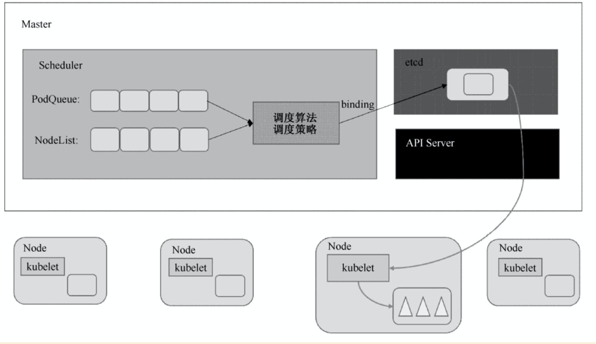

```
(1)/etc/kubernetes/manifests/kube-scheduler.yaml # kubelet管理的静态pod 
(2)--address表示只在master节点上提供服务，不对外
```


### kube-controller-manager

一般来说，智能系统和自动系统通常会通过一个“操作系统”来不断修正系统的工作状态。在Kubernetes集群中，每个Controller都是这样的一个“操作系统”，它们通过APIServer提供的（ListWatch）接口实时监控集群中特定资源的状态变化，当发生各种故障导致某资源对象的状态发生变化时，Controller会尝试将其状态调整为期望的状态。比如当某个Node意外宕机时，NodeController会及时发现此故障并执行自动化修复流程，确保集群始终处于预期的工作状态。ControllerManager是Kubernetes中各种操作系统的管理者，是集群内部的管理控制中心，也是Kubernetes自动化功能的核心。

**controller通过apiserver监视自己控制资源的状态，一旦状态发生变化就会努力改变状态，直到变成期望状态。**

```
(1)/etc/kubernetes/manifests/kube-controller-manager.yaml # kubelet管理的静态pod 
(2)参数设置ca-file
(3)多个manager，是否需要进行leader选举
```

### kubelet

在Kubernetes集群中，在每个Node（又称Minion）上都会启动一个kubelet服务进程。该进程用于处理Master下发到本节点的任务，管理Pod及Pod中的容器。每个kubelet进程都会在APIServer上注册节点自身的信息，定期向Master汇报节点资源的使用情况，并通过cAdvisor监控容器和节点资源。

```
(1)kubelet由操作系统init[systemd]进行启动
(2)ls /lib/systemd/system/kubelet.service
(3)systemctl daemon-reload & systemctl restart kubelet
```

### kubeproxy

在Kubernetes集群的每个Node上都会运行一个kubeproxy服务进程，我们可以把这个进程看作Service的透明代理兼负载均衡器，其核心功能是将到某个Service的访问请求转发到后端的多个Pod实例上。此外，Service的ClusterIP与NodePort等概念是kubeproxy服务通过iptables的NAT转换实现的，kubeproxy在运行过程中动态创建与Service相关的iptables规则，这些规则实现了将访问服务（ClusterIP或NodePort）的请求负载分发到后端Pod的功能。由于iptables机制针对的是本地的kubeproxy端口，所以在每个Node上都要运行kubeproxy组件，这样一来，在Kubernetes集群内部，我们可以在任意Node上发起对Service的访问请求。综上所述，由于kubeproxy的作用，在Service的调用过程中客户端无须关心后端有几个Pod，中间过程的通信、负载均衡及故障恢复都是透明的。

### DNS

域名解析的问题

### dashboard

需要有监控面板能够监测整个集群的状态

### etcd

整个集群的配置中心，所有集群的状态数据，对象数据都存储在etcd中。

kubeadm引导启动的K8s集群，默认只启动一个etcd节点

```
(1)/etc/kubernetes/manifests/etcd.yaml # kubelet管理的静态pod 
(2)etcd所使用的相关秘钥在/etc/kubernetes/pki/etcd里面 
(3)etcd挂载master节点本地路径/var/lib/etcd用于运行时数据存储，tree
```

## API Server

官网 :https://kubernetes.io/zh/docs/reference/command-line-tools-reference/kube-apiserver/

APIServer提供了K8S各类资源对象的操作，是集群内各个功能模块之间数据交互和通信的中心枢纽，是整个系统的数据总线和数据中心。通常我们通过kubectl与APIServer进行交互。

APIServer通过kube-apiserver的进程提供服务，运行在master节点上。

kubectl与APIServer之间是REST调用

```
The Kubernetes API server validates and configures data for the api objects which include pods, services, replicationcontrollers, and others. The API Server services REST operations and provides the frontend to the cluster’s shared state through which all other components interact.
```

### REST API设计

api官网 :https://kubernetes.io/docs/concepts/overview/kubernetes-api/

v1.14 :https://kubernetes.io/docs/reference/generated/kubernetes-api/v1.14/

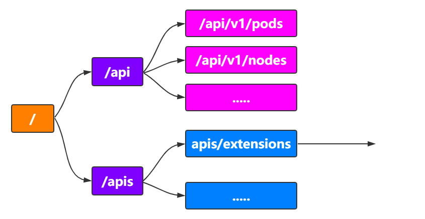

想要写Pod的yaml文件:https://kubernetes.io/docs/reference/generated/kubernetes-api/v1.14/#pod-v1-core

### 开源Client

https://github.com/kubernetes-client

Java :https://github.com/kubernetes-client/java 

Go :https://github.com/kubernetes/client-go

## 集群安全机制之API Server

官网 :https://v1-12.docs.kubernetes.io/docs/reference/access-authn-authz/controlling-access/

对于k8s集群的访问操作，都是通过api server的rest api来实现的，难道所有的操作都允许吗?当然不行，这 里就涉及到认证、授权和准入等操作。


### Authentication-认证

官网 :

https://v1-12.docs.kubernetes.io/docs/reference/access-authn-authz/controlling-access/#authentication

说白了，就是如何来识别客户端的身份，K8s集群提供了3种识别客户端身份的方式

- HTTPS证书认证:基于CA根证书签名的双向数字证书认证方式
- HTTP Token认证:通过一个Token来识别合法用户
- HTTP Base认证:通过用户名+密码的方式认证

### Authorization-授权

官网 :

https://v1-12.docs.kubernetes.io/docs/reference/access-authn-authz/controlling-access/#authorization

- ABAC授权模式 
- Webhook授权模式 
- RBRC授权模式：Role、ClusterRole、RoleBinding和ClusterRoleBinding

用户可以使用kubectl或者API调用等方式操作这些资源对象。

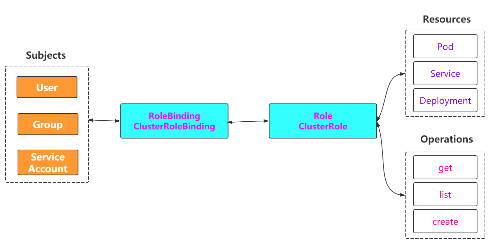

### Admission Control-准入控制

官网 :

https://v1-12.docs.kubernetes.io/docs/reference/access-authn-authz/controlling-access/#admission-control

- Always：允许所有请求
- AlwaysPullImages：在启动容器之前总是尝试重新下载镜像
- AlwaysDeny：禁止所有请求

## Scheduler

官网 :https://kubernetes.io/docs/concepts/scheduling/kube-scheduler/

```
 In Kubernetes, scheduling refers to making sure that Pods are matched to Nodes so that Kubelet can run them.
```

通过调度算法，为待调度Pod列表的每个Pod，从Node列表中选择一个最合适的Node。然后，目标节点上的kubelet通过API Server监听到Kubernetes Scheduler产生的Pod绑定事件，获取对应的Pod清单，下载Image镜像，并启动容器。

### 架构图

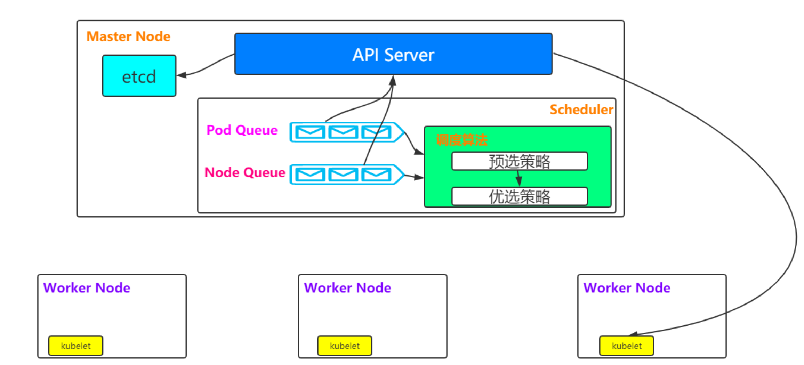

### 流程描述

https://kubernetes.io/docs/concepts/scheduling/kube-scheduler/#kube-scheduler-implementation

```
01-Filtering 
02-Scoring
```

(1)预选调度策略:遍历所有目标Node，刷选出符合Pod要求的候选节点 

(2)优选调度策略:在(1)的基础上，采用优选策略算法计算出每个候选节点的积分，积分最高者胜出

### 预选策略和优选策略

#### 预选策略

https://kubernetes.io/docs/concepts/scheduling/kube-scheduler/#filtering

- PodFitsHostPorts

  ```
  Checks if a Node has free ports (the network protocol kind) for the Pod ports the Pod is requesting.
  ```

- PodFitsHost

  ```
  Checks if a Pod specifies a specific Node by it hostname.
  ```

- PodFitsResources

  ```
  Checks if the Node has free resources (eg, CPU and Memory) to meet the requirement of the Pod.
  ```

#### 优选策略

https://kubernetes.io/docs/concepts/scheduling/kube-scheduler/#scoring

- SelectorSpreadPriority

  ```
  Spreads Pods across hosts, considering Pods that belonging to the same Service, StatefulSet or ReplicaSet
  ```

- InterPodAffinityPriority

  ```
  Computes a sum by iterating through the elements of weightedPodAffinityTerm and adding “weight” to the sum if the corresponding PodAffinityTerm is satisfied for that node; the node(s) with the highest sum are the most preferred.
  ```

  

