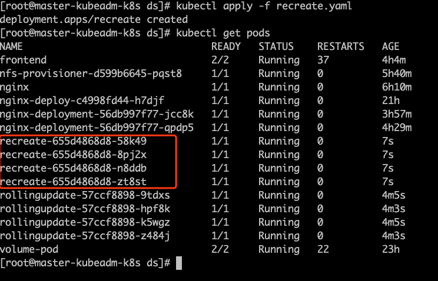
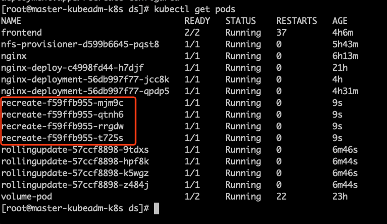
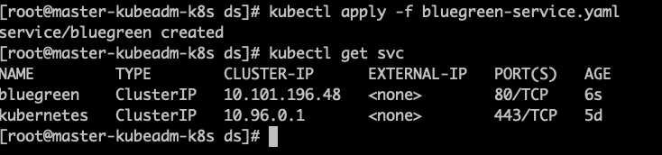
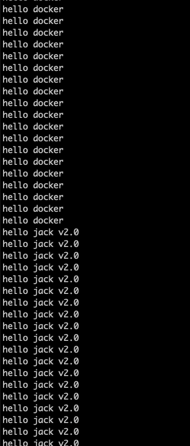
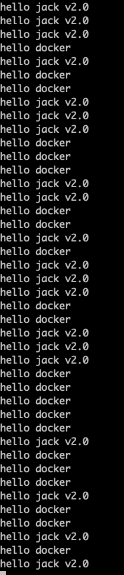

# Kubernetes部署策略

## 常见的部署方案

- 滚动更新

  服务不会停止，但是整个pod会有新旧并存的情况。

- 重新创建
  先停止旧的pod，然后再创建新的pod，这个过程服务是会间断的。

- 蓝绿

  **无需停机，风险较小**

  1. 部署v1的应用(一开始的状态)

     所有外部请求的流量都打到这个版本上.

  2. 部署版本2的应用

     版本2的代码与版本1不同(新功能、Bug修复等).

  3. 将流量从版本1切换到版本2。

  4. 如版本2测试正常，就删除版本1正在使用的资源(例如实例)，从此正式用版本2。

- 金丝雀

### 滚动更新

rollingupdate.yaml

```yaml
apiVersion: apps/v1
kind: Deployment
metadata:
  name: rollingupdate
spec:
  strategy:
    rollingUpdate:
      maxSurge: 25%
      maxUnavailable: 25%
    type: RollingUpdate
  selector:
    matchLabels:
      app: rollingupdate
  replicas: 4
  template:
    metadata:
      labels:
        app: rollingupdate
    spec:
      containers:
        - name: rollingupdate
          image: registry.cn-hangzhou.aliyuncs.com/itcrazy2016/test-docker-image:v1.0
          ports:
            - containerPort: 8080
---
apiVersion: v1
kind: Service
metadata:
  name: rollingupdate
spec:
  ports:
    - port: 80
      protocol: TCP
      targetPort: 8080
  selector:
    app: rollingupdate
  type: ClusterIP
```

maxSurge :滚动升级时先启动的pod数量

maxUnavailable :滚动升级时允许的最大unavailable的pod数量

```shell
kubectl apply -f rollingupdate.yaml 
kubectl get pods
kubectl get svc
curl cluster-ip/dockerfile
```

**修改rollingupdate.yaml文件，将镜像修改成v2.0**

```shell
# 在w1上，不断地访问观察输出
while sleep 0.2;do curl cluster-ip/dockerfile;echo "";done # 在w2上，监控pod
kubectl get pods -w
# 使得更改生效
kubectl apply -f rollingupdate.yaml
kubectl get pods
```

### 重新创建

recreate.yaml

```yaml
apiVersion: apps/v1
kind: Deployment
metadata:
  name: recreate
spec:
  strategy:
    type: Recreate
  selector:
    matchLabels:
      app: recreate
  replicas: 4
  template:
    metadata:
      labels:
        app: recreate
    spec:
      containers:
      - name: recreate
        image: registry.cn-hangzhou.aliyuncs.com/itcrazy2016/test-docker-image:v1.0
        ports:
        - containerPort: 8080
        livenessProbe:
          tcpSocket:
            port: 8080

```

```
kubectl apply -f recreate.yaml 
kubectl get pods
```



修改recreate.yaml文件

```
kubectl apply -f recreate.yaml 
kubectl get pods
```



可以看到先停止，在创建新的。

```
kubectl rollout pause deploy rollingupdate
kubectl rollout resume deploy rollingupdate
kubectl rollout undo deploy rollingupdate # 回到上一个版本
```

### 蓝绿部署

bluegreen.yaml

```yaml
#deploy
apiVersion: apps/v1
kind: Deployment
metadata:
  name: blue
spec:
  strategy:
    rollingUpdate:
      maxSurge: 25%
      maxUnavailable: 25%
    type: RollingUpdate
  selector:
    matchLabels:
      app: bluegreen
  replicas: 4
  template:
    metadata:
      labels:
        app: bluegreen
        version: v1.0
    spec:
      containers:
      - name: bluegreen
        image: registry.cn-hangzhou.aliyuncs.com/itcrazy2016/test-docker-image:v1.0
        ports:
        - containerPort: 8080
```

```
kubectl apply -f bluegreen.yaml 
kubectl get pods
```

bluegreen-service.yaml

```yaml
apiVersion: v1
kind: Service
metadata:
  name: bluegreen
spec:
  ports:
    - port: 80
      protocol: TCP
      targetPort: 8080
  selector:
    app: bluegreen
    version: v1.0
  type: ClusterIP
```

```shell
kubectl apply -f bluegreen-service.yaml
kubectl get svc
# 在w1上不断访问观察
while sleep 0.3;do curl cluster-ip/dockerfile;echo "";done
```



修改bluegreen.yaml

```yaml
01-deployment-name:blue ---> green 
02-image:v1.0---> v2.0
03-version:v1.0 ---> v2.0
```

```yaml
#deploy
apiVersion: apps/v1
kind: Deployment
metadata:
  name: green
spec:
  strategy:
    rollingUpdate:
      maxSurge: 25%
      maxUnavailable: 25%
    type: RollingUpdate
  selector:
    matchLabels:
      app: bluegreen
  replicas: 4
  template:
    metadata:
      labels:
        app: bluegreen
        version: v2.0
    spec:
      containers:
      - name: bluegreen
        image: registry.cn-hangzhou.aliyuncs.com/itcrazy2016/test-docker-image:v2.0
        ports:
        - containerPort: 8080
```

```shell
kubectl apply -f bluegreen.yaml
kubectl get pods
# 同时观察刚才访问的地址有没有变化 可以发现，两个版本就共存了，并且之前访问的地址没有变化
```

修改bluegreen-service.yaml

```yamll
# 也就是把流量切到2.0的版本中 
selector:
	app: bluegreen 
	version: v2.0
```

```shell
kubectl apply -f bluegreen-service.yaml 
kubectl get svc
# 同时观察刚才访问的地址有没有变化 发现流量已经完全切到了v2.0的版本上
```



### 金丝雀

修改上述 bluegreen-service.yaml

```yaml
selector:
app: bluegreen
version: v2.0 # 把version删除掉，只是根据bluegreen进行选择		
```

```yaml
apiVersion: v1
kind: Service
metadata:
  name: bluegreen
spec:
  ports:
    - port: 80
      protocol: TCP
      targetPort: 8080
  selector:
    app: bluegreen
  type: ClusterIP
```



两个版本交替访问。