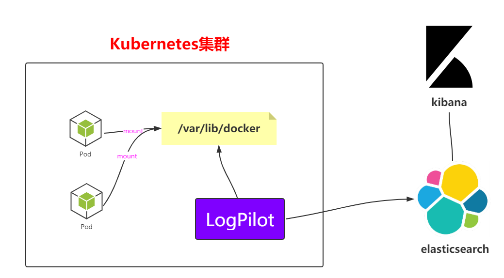
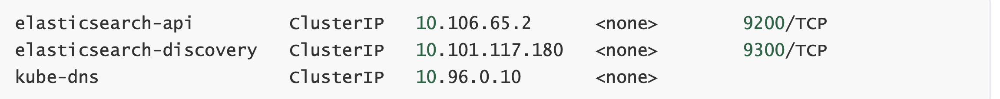
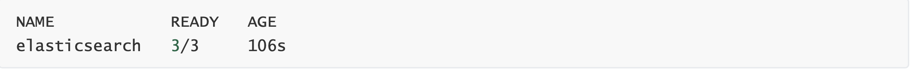
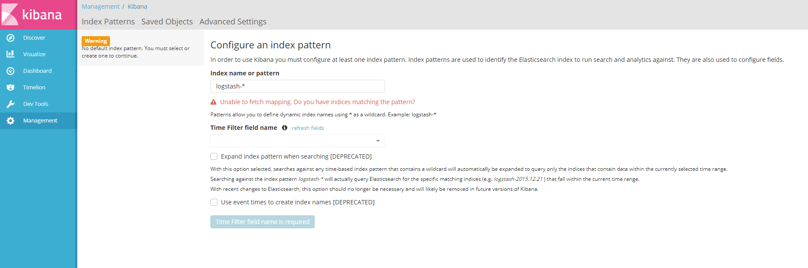
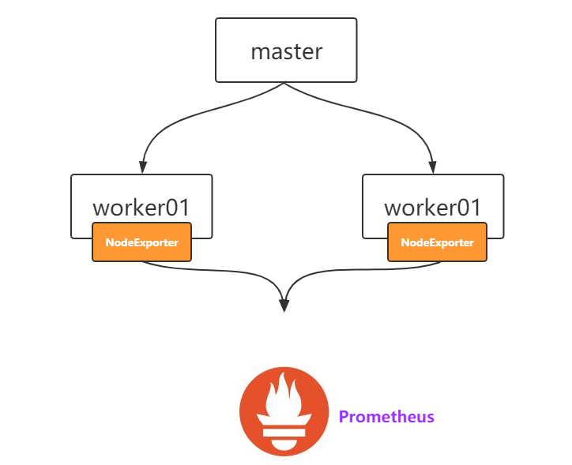
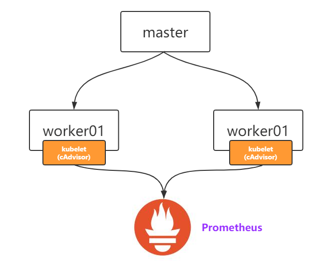

# Kubernetes日志与监控

## Log

### LogPilot+ES+Kibana

https://github.com/AliyunContainerService/log-pilot



#### 部署logpilot

根据网盘log-pilot.yaml创建资源

```yaml
---
apiVersion: extensions/v1beta1
kind: DaemonSet
metadata:
  name: log-pilot
  namespace: kube-system
  labels:
    k8s-app: log-pilot
    kubernetes.io/cluster-service: "true"
spec:
  template:
    metadata:
      labels:
        k8s-app: log-es
        kubernetes.io/cluster-service: "true"
        version: v1.22
    spec:
      tolerations:
      - key: node-role.kubernetes.io/master
        effect: NoSchedule
      containers:
      - name: log-pilot
        image: registry.cn-hangzhou.aliyuncs.com/log-monitor/log-pilot:0.9-filebeat
        resources:
          limits:
            memory: 200Mi
          requests:
            cpu: 100m
            memory: 200Mi
        env:
          - name: "FILEBEAT_OUTPUT"
            value: "elasticsearch"
          - name: "ELASTICSEARCH_HOST"
            value: "elasticsearch-api"
          - name: "ELASTICSEARCH_PORT"
            value: "9200"
          - name: "ELASTICSEARCH_USER"
            value: "elastic"
          - name: "ELASTICSEARCH_PASSWORD"
            value: "changeme"
        volumeMounts:
        - name: sock
          mountPath: /var/run/docker.sock
        - name: root
          mountPath: /host
          readOnly: true
        - name: varlib
          mountPath: /var/lib/filebeat
        - name: varlog
          mountPath: /var/log/filebeat
        securityContext:
          capabilities:
            add:
            - SYS_ADMIN
      terminationGracePeriodSeconds: 30
      volumes:
      - name: sock
        hostPath:
          path: /var/run/docker.sock
      - name: root
        hostPath:
          path: /
      - name: varlib
        hostPath:
          path: /var/lib/filebeat
          type: DirectoryOrCreate
      - name: varlog
        hostPath:
          path: /var/log/filebeat
          type: DirectoryOrCreate
```


```shell
kubectl apply -f log-pilot.yaml
```

查看pod和daemonset的信息

```
kubectl get pods -n kube-system
kubectl get pods -n kube-system -o wide | grep log
kubectl get ds -n kube-system
```

#### 部署elasticsearch

根据elasticsearch.yaml创建资源

```yaml
---
apiVersion: v1
kind: Service
metadata:
  name: elasticsearch-api
  namespace: kube-system
  labels:
    name: elasticsearch
spec:
  selector:
    app: es
  ports:
  - name: transport
    port: 9200
    protocol: TCP
---
apiVersion: v1
kind: Service
metadata:
  name: elasticsearch-discovery
  namespace: kube-system
  labels:
    name: elasticsearch
spec:
  selector:
    app: es
  ports:
  - name: transport
    port: 9300
    protocol: TCP
---
apiVersion: apps/v1beta1
kind: StatefulSet
metadata:
  name: elasticsearch
  namespace: kube-system
  labels:
    kubernetes.io/cluster-service: "true"
spec:
  replicas: 3
  serviceName: "elasticsearch-service"
  selector:
    matchLabels:
      app: es
  template:
    metadata:
      labels:
        app: es
    spec:
      tolerations:
      - effect: NoSchedule
        key: node-role.kubernetes.io/master
      initContainers:
      - name: init-sysctl
        image: busybox:1.27
        command:
        - sysctl
        - -w
        - vm.max_map_count=262144
        securityContext:
          privileged: true
      containers:
      - name: elasticsearch
        image: registry.cn-hangzhou.aliyuncs.com/log-monitor/elasticsearch:v5.5.1
        ports:
        - containerPort: 9200
          protocol: TCP
        - containerPort: 9300
          protocol: TCP
        securityContext:
          capabilities:
            add:
              - IPC_LOCK
              - SYS_RESOURCE
        resources:
          limits:
            memory: 4000Mi
          requests:
            cpu: 100m
            memory: 2000Mi
        env:
          - name: "http.host"
            value: "0.0.0.0"
          - name: "network.host"
            value: "_eth0_"
          - name: "cluster.name"
            value: "docker-cluster"
          - name: "bootstrap.memory_lock"
            value: "false"
          - name: "discovery.zen.ping.unicast.hosts"
            value: "elasticsearch-discovery"
          - name: "discovery.zen.ping.unicast.hosts.resolve_timeout"
            value: "10s"
          - name: "discovery.zen.ping_timeout"
            value: "6s"
          - name: "discovery.zen.minimum_master_nodes"
            value: "2"
          - name: "discovery.zen.fd.ping_interval"
            value: "2s"
          - name: "discovery.zen.no_master_block"
            value: "write"
          - name: "gateway.expected_nodes"
            value: "2"
          - name: "gateway.expected_master_nodes"
            value: "1"
          - name: "transport.tcp.connect_timeout"
            value: "60s"
          - name: "ES_JAVA_OPTS"
            value: "-Xms2g -Xmx2g"
        livenessProbe:
          tcpSocket:
            port: transport
          initialDelaySeconds: 20
          periodSeconds: 10
        volumeMounts:
        - name: es-data
          mountPath: /data
      terminationGracePeriodSeconds: 30
      volumes:
      - name: es-data
        hostPath:
          path: /es-data


```

```shell
kubectl apply -f elasticsearch.yaml
kubectl get pods -n kube-system
kubectl get pods -n kube-system -o wide | grep ela
```

查看kube-system下的svc

kubectl get svc -n kube-system



查看kube-system下的statefulset

kubectl get statefulset -n kube-system



#### 部署kibana

根据kibana.yaml创建资源

```yaml
---
# Deployment
apiVersion: apps/v1beta1
kind: Deployment
metadata:
  name: kibana
  namespace: kube-system
  labels:
    component: kibana
spec:
  replicas: 1
  selector:
    matchLabels:
     component: kibana
  template:
    metadata:
      labels:
        component: kibana
    spec:
      containers:
      - name: kibana
        image: registry.cn-hangzhou.aliyuncs.com/log-monitor/kibana:v5.5.1
        env:
        - name: CLUSTER_NAME
          value: docker-cluster
        - name: ELASTICSEARCH_URL
          value: http://elasticsearch-api:9200/
        resources:
          limits:
            cpu: 1000m
          requests:
            cpu: 100m
        ports:
        - containerPort: 5601
          name: http
---
# Service
apiVersion: v1
kind: Service
metadata:
  name: kibana
  namespace: kube-system
  labels:
    component: kibana
spec:
  selector:
    component: kibana
  ports:
  - name: http
    port: 80
    targetPort: http
---
# Ingress
apiVersion: extensions/v1beta1
kind: Ingress
metadata:
  name: kibana
  namespace: kube-system
spec:
  rules:
  - host: log.k8s.itcrazy2016.com
    http:
      paths:
      - path: /
        backend:
          serviceName: kibana
          servicePort: 80

```

kibana主要是对外提供访问的，所以这边需要配置Service和Ingress

前提:要有Ingress Controller的支持，比如Nginx Controller

```shell
kubectl apply -f kibana.yaml
```

查看pod和deployment的信息

```shell
kubectl get pods -n kube-system | grep ki 
kubectl get deploy -n kube-system
```

配置Ingress需要的域名

hosts文件:

```
# 注意这边是worker01的IP 
192.168.1.52 kibana.jack.com
```

访问kibana.jack.com



## Monitor

### Prometheus简介

官网 :https://prometheus.io/

github :https://github.com/kubernetes/kubernetes/tree/master/cluster/addons/prometheus

### Prometheus架构


### Prometheus知识普及

- 支持pull、push数据添加方式

- 支持k8s服务发现

- 提供查询语言PromQL

- 时序(time series)是由名字(Metric)以及一组key/value标签定义的 数据类型

### 数据采集

#### 服务器数据

通过NodeExporter:https://github.com/prometheus/node_exporter



#### 组件数据

ETCD:https://ip:2379/metrics 

APIServer:https://ip:6443/metrics 

ControllerManager:https://ip:10252/metrics 

Scheduler:https://ip:10251/metrics

#### 容器数据

#### 

### Prometheus+Grafana

在master上创建prometheus目录

yaml文件：  [prometheus.yaml](monitor/prometheus.yaml)  [grafana.yaml](monitor/grafana.yaml)  [ingress.yaml](monitor/ingress.yaml)  [namespace.yaml](monitor/namespace.yaml)  [node-exporter.yaml](monitor/node-exporter.yaml) 


#### **创建命名空间ns-monitor**

```shell
kubectl apply -f namespace.yaml 
kubectl get namespace
```

#### **创建node-exporter**

```
kubectl apply -f node-exporter.yaml
kubectl get pod -n ns-monitor
kubectl get svc -n ns-monitor
kubectl get ds -n ns-monitor

```

浏览器访问集群任意一个ip，比如http://192.168.1.52:31672 查看结果 # 这边是http协议，不能用 https


#### **部署prometheus pod**

包含rbac认证、ConfigMap等

注意 :记得修改prometheus.yaml文件中的ip为master的ip和path[PV需要使用到]

```
kubectl apply -f prometheus.yaml
kubectl get pod -n ns-monitor
kubectl get svc -n ns-monitor
浏览器访问集群任意一个ip:30222/graph 查看结果，比如http://121.41.10.126:30137
```

#### **部署grafana**

```shell
kubectl apply -f grafana.yaml
kubectl get pod -n ns-monitor
kubectl get svc -n ns-monitor
浏览器访问集群任意一个ip:32405/graph/login 比如http://121.41.10.126:32727用户名密码:admin
```

#### **增加域名访问[没有域名好像没有灵魂]**

前提 :配置好ingress controller和域名解析

```
kubectl apply - ingress.yaml
kubectl get ingress -n ns-monitor 
kubectl describe ingress -n ns-monitor
```

#### **直接通过域名访问即可**