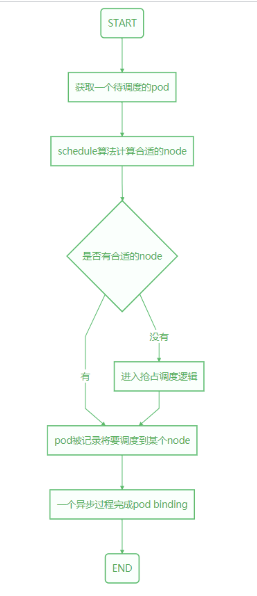
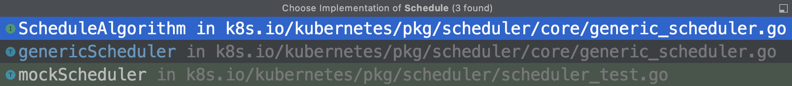
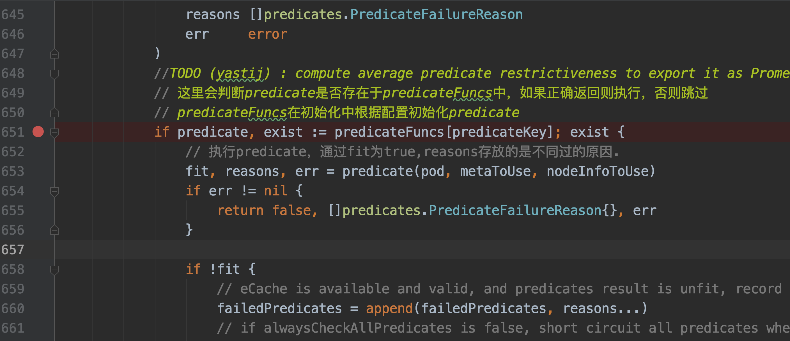
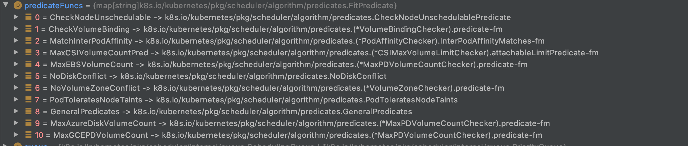
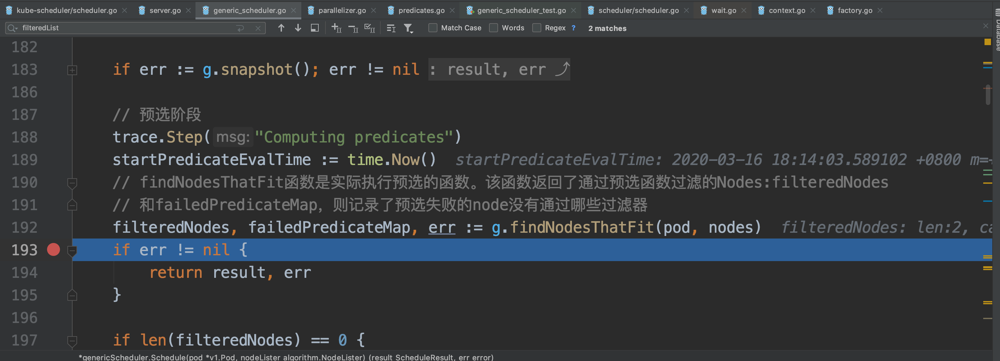
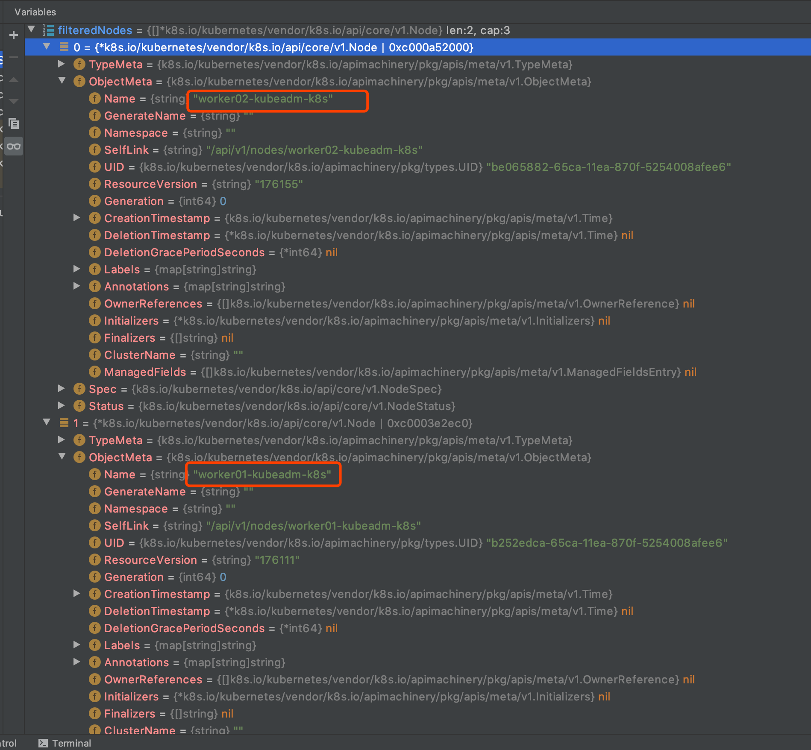
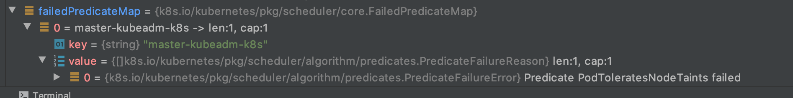
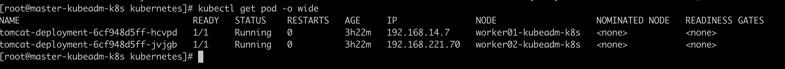

# kube-scheduler-node预选-源码分析

## 简述

pod调度的总体流程：



本文只详细分析了上图中`schedule算法计算合适的node`中的一个步骤。当然也能看到整个过程，只是其他步骤没有深入进去分析。

## 代码入口

我们在之前，环境调试的时候看到过`kube-scheduler`代码的入口:`kubernetes/cmd/kube-scheduler/scheduler.go`,代码如下：

```go
func main() {
	rand.Seed(time.Now().UnixNano())

	command := app.NewSchedulerCommand()

	// TODO: once we switch everything over to Cobra commands, we can go back to calling
	// utilflag.InitFlags() (by removing its pflag.Parse() call). For now, we have to set the
	// normalize func and add the go flag set by hand.
	pflag.CommandLine.SetNormalizeFunc(cliflag.WordSepNormalizeFunc)
	// utilflag.InitFlags()
	logs.InitLogs()
	defer logs.FlushLogs()

	if err := command.Execute(); err != nil {
		fmt.Fprintf(os.Stderr, "%v\n", err)
		os.Exit(1)
	}
}
```

很明显`command := app.NewSchedulerCommand()`，这段代码我们需要继续深入。

`cmd/kube-scheduler/app/server.go:62`

```go
func NewSchedulerCommand() *cobra.Command {
	opts, err := options.NewOptions()
	if err != nil {
		klog.Fatalf("unable to initialize command options: %v", err)
	}
	// cobra是一个创建命令行工具的框架。
	cmd := &cobra.Command{
		Use: "kube-scheduler",
		Long: `The Kubernetes scheduler is a policy-rich, topology-aware,
workload-specific function that significantly impacts availability, performance,
and capacity. The scheduler needs to take into account individual and collective
resource requirements, quality of service requirements, hardware/software/policy
constraints, affinity and anti-affinity specifications, data locality, inter-workload
interference, deadlines, and so on. Workload-specific requirements will be exposed
through the API as necessary.`,
		Run: func(cmd *cobra.Command, args []string) {
			// 一切的起点
			if err := runCommand(cmd, args, opts); err != nil {
				fmt.Fprintf(os.Stderr, "%v\n", err)
				os.Exit(1)
			}
		},
	}
	
    // ... 省略部分代码

	return cmd
}
```

在这里除了我们一会需要继续深入看的`runCommand(cmd, args, opts)`函数外，还需要题一下`cobra`。

`cobra`是一个可以帮助我们快速创建命令多级命令行的框架。有兴趣的小伙伴可以去github上了解一下。

## 资源加载

继续看``runCommand(cmd, args, opts)``函数：

`cmd/kube-scheduler/app/server.go:110`

```go
func runCommand(cmd *cobra.Command, args []string, opts *options.Options) error {
	verflag.PrintAndExitIfRequested()
	utilflag.PrintFlags(cmd.Flags())

	if len(args) != 0 {
		fmt.Fprint(os.Stderr, "arguments are not supported\n")
	}

	if errs := opts.Validate(); len(errs) > 0 {
		fmt.Fprintf(os.Stderr, "%v\n", utilerrors.NewAggregate(errs))
		os.Exit(1)
	}

	if len(opts.WriteConfigTo) > 0 {
		if err := options.WriteConfigFile(opts.WriteConfigTo, &opts.ComponentConfig); err != nil {
			fmt.Fprintf(os.Stderr, "%v\n", err)
			os.Exit(1)
		}
		klog.Infof("Wrote configuration to: %s\n", opts.WriteConfigTo)
	}

	// 配置加载从这里开始
	c, err := opts.Config()
	if err != nil {
		fmt.Fprintf(os.Stderr, "%v\n", err)
		os.Exit(1)
	}

	stopCh := make(chan struct{})

	// Get the completed config
	cc := c.Complete()

	// To help debugging, immediately log version
	klog.Infof("Version: %+v", version.Get())

	// Apply algorithms based on feature gates.
	// TODO: make configurable?
	// 调度算法初始化从这里开始
	algorithmprovider.ApplyFeatureGates()

	// Configz registration.
	if cz, err := configz.New("componentconfig"); err == nil {
		cz.Set(cc.ComponentConfig)
	} else {
		return fmt.Errorf("unable to register configz: %s", err)
	}
	// 到这里配置初始化就完成了
	return Run(cc, stopCh)
}
```

这里主要进行了`kube-scheduler`的配置和调度算法的初始化。我们在初始化的时候在详细分析。

## 实例化调度器

现在继续看`Run(cc, stopCh)`方法：

`cmd/kube-scheduler/app/server.go:162`

```go
func Run(cc schedulerserverconfig.CompletedConfig, stopCh <-chan struct{}) error {
	// To help debugging, immediately log version
	klog.V(1).Infof("Starting Kubernetes Scheduler version %+v", version.Get())

	// Create the scheduler.
	// 实例化调度器
	sched, err := scheduler.New(cc.Client,
		cc.InformerFactory.Core().V1().Nodes(),// node的监听
		cc.PodInformer,// pod的监听
		cc.InformerFactory.Core().V1().PersistentVolumes(), // pv的监听
		cc.InformerFactory.Core().V1().PersistentVolumeClaims(), // pvc的监听
		cc.InformerFactory.Core().V1().ReplicationControllers(), // rc的监听
		cc.InformerFactory.Apps().V1().ReplicaSets(),	// rs的监听
		cc.InformerFactory.Apps().V1().StatefulSets(),  // 有状态pod的监听
		cc.InformerFactory.Core().V1().Services(),      // svc的监听
		cc.InformerFactory.Policy().V1beta1().PodDisruptionBudgets(), // 策略的监听
		cc.InformerFactory.Storage().V1().StorageClasses(),
		cc.Recorder,
		cc.ComponentConfig.AlgorithmSource, // 调度算法的初始化资源
		stopCh,
		scheduler.WithName(cc.ComponentConfig.SchedulerName),
		scheduler.WithHardPodAffinitySymmetricWeight(cc.ComponentConfig.HardPodAffinitySymmetricWeight),
		scheduler.WithPreemptionDisabled(cc.ComponentConfig.DisablePreemption),
		scheduler.WithPercentageOfNodesToScore(cc.ComponentConfig.PercentageOfNodesToScore),
		scheduler.WithBindTimeoutSeconds(*cc.ComponentConfig.BindTimeoutSeconds))
	if err != nil {
		return err
	}

	// ... 这里省略的部分代码。主要是初始化资源监控的相关代码。
    // 这些代码需要先弄明白clent-go。后面在详细分析 
    
	// Prepare a reusable runCommand function.
	// 这里声明一个run函数用于执行调度任务。
	run := func(ctx context.Context) {
		// 实际执行调度任务的逻辑在这里
		sched.Run()
		<-ctx.Done()
	}

	ctx, cancel := context.WithCancel(context.TODO()) 
	defer cancel()

	// 这里启动一个协程，用于终止任务调度
	go func() {
		select {
		case <-stopCh:
			cancel()
		case <-ctx.Done():
		}
	}()

	// ...省略 选主投票的逻辑，暂时先不理会

	// Leader election is disabled, so runCommand inline until done.
	// 开始执行调度任务，注意上面是声明。这里才是调用。
	run(ctx)
	return fmt.Errorf("finished without leader elect")
}
```

## 循环调度

`wait.Until`方法：循环直到停止通道关闭，间隔周期为0。这里的意思就是不停的调用`sched.scheduleOne`函数，直到`sched.config.StopEverything`通道收到了消息。

这里`sched.scheduleOne`函数为单个pod完成整个调度工作流程。它是串行化的调度算法。

`pkg/scheduler/scheduler.go:248`

```go
func (sched *Scheduler) Run() {
   if !sched.config.WaitForCacheSync() {
      return
   }

   // 启动一个协程，持续调用sched.scheduleOne函数。
   go wait.Until(sched.scheduleOne, 0, sched.config.StopEverything)
}
```

继续看`scheduleOne`函数：

```go
// scheduleOne为单个pod完成整个调度工作流程。它是串行化的调度算法。
func (sched *Scheduler) scheduleOne() {
   plugins := sched.config.PluginSet
   // Remove all plugin context data at the beginning of a scheduling cycle.
   if plugins.Data().Ctx != nil {
      plugins.Data().Ctx.Reset()
   }

   // 获取待调度pod。
   pod := sched.config.NextPod()
   // pod could be nil when schedulerQueue is closed
   if pod == nil {
      return
   }
   if pod.DeletionTimestamp != nil {
      sched.config.Recorder.Eventf(pod, v1.EventTypeWarning, "FailedScheduling", "skip schedule deleting pod: %v/%v", pod.Namespace, pod.Name)
      klog.V(3).Infof("Skip schedule deleting pod: %v/%v", pod.Namespace, pod.Name)
      return
   }

   klog.V(3).Infof("Attempting to schedule pod: %v/%v", pod.Namespace, pod.Name)

   // Synchronously attempt to find a fit for the pod.
   start := time.Now()
   // 实际的调度算法。这里返回一个经过调度算法选择以后的node节点
   // 本函数下面的代码会根据这个结果将pod绑定到该节点上。
   scheduleResult, err := sched.schedule(pod)
   // 如果筛选过程出错
   if err != nil {
      if fitError, ok := err.(*core.FitError); ok {
         // 未启用Pod优选特性，或通过调度程序配置禁用抢占。
         if !util.PodPriorityEnabled() || sched.config.DisablePreemption {
            klog.V(3).Infof("Pod priority feature is not enabled or preemption is disabled by scheduler configuration." +
               " No preemption is performed.")
         } else {
            preemptionStartTime := time.Now()
            // 执行抢占逻辑
            sched.preempt(pod, fitError)
            metrics.PreemptionAttempts.Inc()
   
  		// ...省略部分代码

      // 将pod绑定到筛选出来的node中
      err := sched.bind(assumedPod, &v1.Binding{
         ObjectMeta: metav1.ObjectMeta{Namespace: assumedPod.Namespace, Name: assumedPod.Name, UID: assumedPod.UID},
         Target: v1.ObjectReference{
            Kind: "Node",
            Name: scheduleResult.SuggestedHost,
         },
      })
	// ...省略部分代码
}
```

这里我们省略的不少代码，不过现在先关心主线逻辑。**从剩余代码中能比较清晰的看出：获取pod-筛选节点-抢占-节点绑定。**这样一个`kube-scheduler`的核心任务的流程。

在这段代码里我们发现核心的调度逻辑是在`scheduleResult, err := sched.schedule(pod)`这段代码上。继续看`sched.schedule(pod)`函数做了什么。

```go
func (sched *Scheduler) schedule(pod *v1.Pod) (core.ScheduleResult, error) {
	// 这里根据配置中加载的调度算法进行调度
	result, err := sched.config.Algorithm.Schedule(pod, sched.config.NodeLister)
	if err != nil {
		pod = pod.DeepCopy()
		sched.recordSchedulingFailure(pod, err, v1.PodReasonUnschedulable, err.Error())
		return core.ScheduleResult{}, err
	}
	// 返回经过预选，优选后选出的node
	return result, err
}
```

这段代码中`result, err := sched.config.Algorithm.Schedule(pod, sched.config.NodeLister)`代码根据配置中加载的调度算法进行调度，返回经过预选，优选后选出的node。我们就继续从该方法往下看。

这里的`Algorithm`是一个接口，接口定义如下：

```go
type ScheduleAlgorithm interface {
	// 调度
	Schedule(*v1.Pod, algorithm.NodeLister) (scheduleResult ScheduleResult, err error)
	// Preempt receives scheduling errors for a pod and tries to create room for
	// the pod by preempting lower priority pods if possible.
	// It returns the node where preemption happened, a list of preempted pods, a
	// list of pods whose nominated node name should be removed, and error if any.
	// 抢占
	Preempt(*v1.Pod, algorithm.NodeLister, error) (selectedNode *v1.Node, preemptedPods []*v1.Pod, cleanupNominatedPods []*v1.Pod, err error)
	// Predicates() returns a pointer to a map of predicate functions. This is
	// exposed for testing.
	// 预选
	Predicates() map[string]predicates.FitPredicate
	// Prioritizers returns a slice of priority config. This is exposed for
	// testing.
	// 优选
	Prioritizers() []priorities.PriorityConfig
}
```

这个接口定义了。调度、抢占、预选、优选这4个方法。这里先有个了解。该接口有两个实现，其中一个是mock，还是`scheduler_test.go`中的直接排除。我们去看`generic_scheduler.go`中的实现。



代码如下：

```go
func (g *genericScheduler) Schedule(pod *v1.Pod, nodeLister algorithm.NodeLister) (result ScheduleResult, err error) {
   // 获得node列表
   nodes, err := nodeLister.List()
   if err != nil {
      return result, err
   }
   if len(nodes) == 0 {
      return result, ErrNoNodesAvailable
   }

   if err := g.snapshot(); err != nil {
      return result, err
   }

   // 预选阶段
   trace.Step("Computing predicates")
   startPredicateEvalTime := time.Now()
   // findNodesThatFit函数是实际执行预选的函数。该函数返回了通过预选函数过滤的Nodes:filteredNodes
   // 和failedPredicateMap，则记录了预选失败的node没有通过哪些过滤器
   filteredNodes, failedPredicateMap, err := g.findNodesThatFit(pod, nodes)
   if err != nil {
      return result, err
   }

   if len(filteredNodes) == 0 {
      return result, &FitError{
         Pod:              pod,
         NumAllNodes:      len(nodes),
         FailedPredicates: failedPredicateMap,
      }
   }
   metrics.SchedulingAlgorithmPredicateEvaluationDuration.Observe(metrics.SinceInSeconds(startPredicateEvalTime))
   metrics.DeprecatedSchedulingAlgorithmPredicateEvaluationDuration.Observe(metrics.SinceInMicroseconds(startPredicateEvalTime))
   metrics.SchedulingLatency.WithLabelValues(metrics.PredicateEvaluation).Observe(metrics.SinceInSeconds(startPredicateEvalTime))
   metrics.DeprecatedSchedulingLatency.WithLabelValues(metrics.PredicateEvaluation).Observe(metrics.SinceInSeconds(startPredicateEvalTime))

   // 预选结束进入优选
   trace.Step("Prioritizing")
   startPriorityEvalTime := time.Now()
   // When only one node after predicate, just use it.
   if len(filteredNodes) == 1 {
      metrics.SchedulingAlgorithmPriorityEvaluationDuration.Observe(metrics.SinceInSeconds(startPriorityEvalTime))
      metrics.DeprecatedSchedulingAlgorithmPriorityEvaluationDuration.Observe(metrics.SinceInMicroseconds(startPriorityEvalTime))
      return ScheduleResult{
         SuggestedHost:  filteredNodes[0].Name,
         EvaluatedNodes: 1 + len(failedPredicateMap),
         FeasibleNodes:  1,
      }, nil
   }

   metaPrioritiesInterface := g.priorityMetaProducer(pod, g.nodeInfoSnapshot.NodeInfoMap)
   priorityList, err := PrioritizeNodes(pod, g.nodeInfoSnapshot.NodeInfoMap, metaPrioritiesInterface, g.prioritizers, filteredNodes, g.extenders)
   if err != nil {
      return result, err
   }
   metrics.SchedulingAlgorithmPriorityEvaluationDuration.Observe(metrics.SinceInSeconds(startPriorityEvalTime))
   metrics.DeprecatedSchedulingAlgorithmPriorityEvaluationDuration.Observe(metrics.SinceInMicroseconds(startPriorityEvalTime))
   metrics.SchedulingLatency.WithLabelValues(metrics.PriorityEvaluation).Observe(metrics.SinceInSeconds(startPriorityEvalTime))
   metrics.DeprecatedSchedulingLatency.WithLabelValues(metrics.PriorityEvaluation).Observe(metrics.SinceInSeconds(startPriorityEvalTime))

   trace.Step("Selecting host")

   // 优选结束，获取分值最高的node并返回
   host, err := g.selectHost(priorityList)
   return ScheduleResult{
      SuggestedHost:  host,
      EvaluatedNodes: len(filteredNodes) + len(failedPredicateMap),
      FeasibleNodes:  len(filteredNodes),
   }, err
}
```

这段代码从注释中可以看出经历了：获得node列表-预选-优选-获取分值最高的node并返回这样一个过程。

### Node预选

我们这里主要关注预选阶段：`filteredNodes, failedPredicateMap, err := g.findNodesThatFit(pod, nodes)`。

其中返回参数：

- filteredNodes：是通过预选算法过滤的节点。
- failedPredicateMap：是未通过预选算法过滤的节点，并且包含了未通过哪些预选算法的列表。

我们先看`findNodesThatFit(pod, nodes)`函数的实现：

```go
func (g *genericScheduler) findNodesThatFit(pod *v1.Pod, nodes []*v1.Node) ([]*v1.Node, FailedPredicateMap, error) {
   var filtered []*v1.Node
   // 声明failedPredicateMap，记录了预选失败的node没有通过哪些过滤器
   failedPredicateMap := FailedPredicateMap{}

   // 如果没有预选函数则所有阶段通过预选
   if len(g.predicates) == 0 {
      filtered = nodes
   } else {
      // 获取进群内所有的node的数量
      allNodes := int32(g.cache.NodeTree().NumNodes())
      // numblenodestofind返回找到的可行节点数，调度程序停止搜索更多的可行节点。
      numNodesToFind := g.numFeasibleNodesToFind(allNodes)

      // Create filtered list with enough space to avoid growing it
      // and allow assigning.
      // 创建预选过滤后的列表
      filtered = make([]*v1.Node, numNodesToFind)
      errs := errors.MessageCountMap{}
      var (
         predicateResultLock sync.Mutex
         filteredLen         int32
      )

      ctx, cancel := context.WithCancel(context.Background())

      // We can use the same metadata producer for all nodes.
      meta := g.predicateMetaProducer(pod, g.nodeInfoSnapshot.NodeInfoMap)

      // 声明一个执行筛选的函数。在下面会调用
      checkNode := func(i int) {
         // 获得一个节点名
         nodeName := g.cache.NodeTree().Next()
         // 执行筛选的函数podFitsOnNode
         fits, failedPredicates, err := podFitsOnNode(
            pod, //待调度的pod
            meta,
            g.nodeInfoSnapshot.NodeInfoMap[nodeName],  // 获取node的快照
            g.predicates,  // 获取存放预选函数的集合。key为预选函数名，value为预选函数
            g.schedulingQueue, // 调度队列
            g.alwaysCheckAllPredicates,    // 是否始终执行所有预选函数
         )
         if err != nil {
            predicateResultLock.Lock()
            errs[err.Error()]++
            predicateResultLock.Unlock()
            return
         }

         // 当前节点如果预选通过，计算通过的节点数量到达numNodesToFind的数量则停止预选。
         if fits {
            length := atomic.AddInt32(&filteredLen, 1)
            if length > numNodesToFind {
               // 停止预选
               cancel()
               atomic.AddInt32(&filteredLen, -1)
            } else {
               // 将预选通过的Node快照存放到预选过滤后的列表。
               filtered[length-1] = g.nodeInfoSnapshot.NodeInfoMap[nodeName].Node()
            }
         } else { // 预选不通过则存到不通过的集合中，failedPredicates为不同过的预选函数的信息
            predicateResultLock.Lock()
            failedPredicateMap[nodeName] = failedPredicates
            predicateResultLock.Unlock()
         }
      }

      // Stops searching for more nodes once the configured number of feasible nodes
      // are found.
      // 并发执行预选函数
      workqueue.ParallelizeUntil(ctx, 16, int(allNodes), checkNode)

      // 将实际预选得到的Node信息，切片出来。因为有可能筛选通过的数量达不到预期希望得到的阶段数量
      filtered = filtered[:filteredLen]
      if len(errs) > 0 {
         return []*v1.Node{}, FailedPredicateMap{}, errors.CreateAggregateFromMessageCountMap(errs)
      }
   }
   // 若声明了 extenders 则调用 extenders 再次过滤 nodeToVictims
   if len(filtered) > 0 && len(g.extenders) != 0 {
      for _, extender := range g.extenders {
         if !extender.IsInterested(pod) {
            continue
         }
         filteredList, failedMap, err := extender.Filter(pod, filtered, g.nodeInfoSnapshot.NodeInfoMap)
         if err != nil {
            if extender.IsIgnorable() {
               klog.Warningf("Skipping extender %v as it returned error %v and has ignorable flag set",
                  extender, err)
               continue
            } else {
               return []*v1.Node{}, FailedPredicateMap{}, err
            }
         }

         for failedNodeName, failedMsg := range failedMap {
            if _, found := failedPredicateMap[failedNodeName]; !found {
               failedPredicateMap[failedNodeName] = []predicates.PredicateFailureReason{}
            }
            failedPredicateMap[failedNodeName] = append(failedPredicateMap[failedNodeName], predicates.NewFailureReason(failedMsg))
         }
         filtered = filteredList
         if len(filtered) == 0 {
            break
         }
      }
   }
   // filtered预选通过的node，failedPredicateMap预选失败的node和失败原因。
   return filtered, failedPredicateMap, nil
}
```

从函数的实现中可以看到。这里主要对predicates与extenders进行了处理，返回预选通过的节点集合和不同过的节点集合。这里这么说可能比较抽象，看一下一个配置，可能比较有感受：

```yaml
{
  "kind": "Policy",
  "apiVersion": "v1",
  "predicates": [
    {
      "name": "NoVolumeZoneConflict"
    },
    {
      "name": "MatchInterPodAffinity"
    },
    {
      "name": "NoDiskConflict"
    },
    {
      "name": "GeneralPredicates"
    },
    {
      "name": "PodToleratesNodeTaints"
    },
    {
      "name": "CheckVolumeBinding"
    }
  ],
  "priorities": [
    {
      "name": "SelectorSpreadPriority",
      "weight": 1
    },
    {
      "name": "InterPodAffinityPriority",
      "weight": 1
    },
    {
      "name": "LeastRequestedPriority",
      "weight": 1
    },
    {
      "name": "NodeAffinityPriority",
      "weight": 1
    },
    {
      "name": "BalancedResourceAllocation",
      "weight": 1
    },
    {
      "name": "NodePreferAvoidPodsPriority",
      "weight": 10000
    },
    {
      "name": "TaintTolerationPriority",
      "weight": 1
    }
  ],
  "extenders": [
    {
      "urlPrefix": "http://kube-scheduler-extender:80/scheduler",
      "filterVerb": "predicates/middleware_predicate",
      "prioritizeVerb": "",
      "preemptVerb": "",
      "bindVerb": "bind",
      "weight": 1,
      "enableHttps": false,
      "nodeCacheCapable": false
    }
  ],
  "hardPodAffinitySymmetricWeight": 10,
  "alwaysCheckAllPredicates": false
}
```

其中predicates是通过并发执行函数`workqueue.ParallelizeUntil(ctx, 16, int(allNodes), checkNode)`，调用声明为`checkNode`的匿名函数实现的。

这里先来看一下并发执行的函数：

```go
// 这是一个并发执行的函数。这个函数在其他需要列斯并发的地方会被多次使用。
// 很像java中的线程池。
func ParallelizeUntil(ctx context.Context, workers, pieces int, doWorkPiece DoWorkPieceFunc) {
   var stop <-chan struct{}
   if ctx != nil {
      stop = ctx.Done()
   }

   // 声明一个需要处理的通道，通道数量为节点数量
   toProcess := make(chan int, pieces)
   for i := 0; i < pieces; i++ {
      toProcess <- i
   }
   close(toProcess)

   // 计算得出协程启动的个数。最大是workers的数量
   if pieces < workers {
      workers = pieces
   }

   // 声明一个wait
   wg := sync.WaitGroup{}
   // 添加需要等待的数量
   wg.Add(workers)
   for i := 0; i < workers; i++ {
      go func() {
         defer utilruntime.HandleCrash()
         // 执行完成等待数量-1
         defer wg.Done()
         // 从执行通道中获取待执行任务。
         for piece := range toProcess {
            select {
            case <-stop:
               return
            default:
               doWorkPiece(piece)
            }
         }
      }()
   }
   // 阻塞等待协程执行完成。
   wg.Wait()
}
```

这段代码本身的并发逻辑并不难理解。注释也都表明了。不在赘述了。

下面我们聚焦到协程内执行的函数，也就是被声明为`checkNode`的匿名函数:

```go
// 声明一个执行筛选的函数。在下面会调用
checkNode := func(i int) {
   // 获得一个节点名
   nodeName := g.cache.NodeTree().Next()
   // 执行筛选的函数podFitsOnNode
   fits, failedPredicates, err := podFitsOnNode(
      pod, //待调度的pod
      meta,
      g.nodeInfoSnapshot.NodeInfoMap[nodeName],  // 获取node的快照
      g.predicates,  // 获取存放预选函数的集合。key为预选函数名，value为预选函数
      g.schedulingQueue, // 调度队列
      g.alwaysCheckAllPredicates,    // 是否始终执行所有预选函数
   )
   if err != nil {
      predicateResultLock.Lock()
      errs[err.Error()]++
      predicateResultLock.Unlock()
      return
   }

   // 当前节点如果预选通过，计算通过的节点数量到达numNodesToFind的数量则停止预选。
   if fits {
      length := atomic.AddInt32(&filteredLen, 1)
      if length > numNodesToFind {
         // 停止预选
         cancel()
         atomic.AddInt32(&filteredLen, -1)
      } else {
         // 将预选通过的Node快照存放到预选过滤后的列表。
         filtered[length-1] = g.nodeInfoSnapshot.NodeInfoMap[nodeName].Node()
      }
   } else { // 预选不通过则存到不通过的集合中，failedPredicates为不同过的预选函数的信息
      predicateResultLock.Lock()
      failedPredicateMap[nodeName] = failedPredicates
      predicateResultLock.Unlock()
   }
}
```

在`checkNode`函数中，筛选的任务是通过调用`podFitsOnNode`完成的。

下面终于到了实际处理预选的地方了：

```go
func podFitsOnNode(
   pod *v1.Pod,
   meta predicates.PredicateMetadata,
   info *schedulernodeinfo.NodeInfo,
   predicateFuncs map[string]predicates.FitPredicate,
   queue internalqueue.SchedulingQueue,
   alwaysCheckAllPredicates bool,
) (bool, []predicates.PredicateFailureReason, error) {
   var failedPredicates []predicates.PredicateFailureReason

   podsAdded := false

   /*
   出于某些原因考虑我们需要运行两次predicate. 如果node上有更高或者相同优先级的“指定pods”（这里的“
   指定pods”指的是通过schedule计算后指定要跑在一个node上但是还未真正运行到那个node上的pods），
   我们将这些pods加入到meta和nodeInfo后执行一次计算过程。

   如果这个过程所有的predicates都成功了，我们再假设这些“指定pods”不会跑到node上再运行一次。第二次
   计算是必须的，因为有一些predicates比如pod亲和性，也许在“指定pods”没有成功跑到node的情况下会不满足。
    */
   for i := 0; i < 2; i++ {
      metaToUse := meta
      nodeInfoToUse := info
      if i == 0 {
         podsAdded, metaToUse, nodeInfoToUse = addNominatedPods(pod, meta, info, queue)
      } else if !podsAdded || len(failedPredicates) != 0 {
         break
      }
      // 遍历所有的预选函数名。如果开发了新的predicate则需要向这个列表里新增。
      for _, predicateKey := range predicates.Ordering() {
         var (
            fit     bool
            reasons []predicates.PredicateFailureReason
            err     error
         )
         //TODO (yastij) : compute average predicate restrictiveness to export it as Prometheus metric
         // 这里会判断predicate是否存在于predicateFuncs中，如果正确返回则执行，否则跳过
         // predicateFuncs在初始化中根据配置初始化predicate
         if predicate, exist := predicateFuncs[predicateKey]; exist {
            // 执行predicate，通过fit为true,reasons存放的是不同过的原因.
            fit, reasons, err = predicate(pod, metaToUse, nodeInfoToUse)
            if err != nil {
               return false, []predicates.PredicateFailureReason{}, err
            }

            if !fit {
               // eCache is available and valid, and predicates result is unfit, record the fail reasons
               failedPredicates = append(failedPredicates, reasons...)
               // if alwaysCheckAllPredicates is false, short circuit all predicates when one predicate fails.
               if !alwaysCheckAllPredicates {
                  klog.V(5).Infoln("since alwaysCheckAllPredicates has not been set, the predicate " +
                     "evaluation is short circuited and there are chances " +
                     "of other predicates failing as well.")
                  break
               }
            }
         }
      }
   }
   // 通过len(failedPredicates) == 0判断当前节点是否存在未通过的predicate。没有的话当前node通过预选
   return len(failedPredicates) == 0, failedPredicates, nil
}
```

这里我们依然先分析主线，我们把目光聚焦到下面这段代码片段：

```go
  // 遍历所有的预选函数名。如果开发了新的predicate则需要向这个列表里新增。
  for _, predicateKey := range predicates.Ordering() {
     var (
        fit     bool
        reasons []predicates.PredicateFailureReason
        err     error
     )
     //TODO (yastij) : compute average predicate restrictiveness to export it as Prometheus metric
     // 这里会判断predicate是否存在于predicateFuncs中，如果正确返回则执行，否则跳过
     // predicateFuncs在初始化中根据配置初始化predicate
     if predicate, exist := predicateFuncs[predicateKey]; exist {
        // 执行predicate，通过fit为true,reasons存放的是不同过的原因.
        fit, reasons, err = predicate(pod, metaToUse, nodeInfoToUse)
```
从这段代码里我们可以看到先遍历：`predicates.Ordering()`这个东西。我们来看一下代码：

```go
func Ordering() []string {
   return predicatesOrdering
}

var (
	//重要提示:此列表包含predicates的顺序，如果您开发了一个新的predicates，则必须将其名称添加到此列表中。
	predicatesOrdering = []string{CheckNodeConditionPred, CheckNodeUnschedulablePred,
		GeneralPred, HostNamePred, PodFitsHostPortsPred,
		MatchNodeSelectorPred, PodFitsResourcesPred, NoDiskConflictPred,
		PodToleratesNodeTaintsPred, PodToleratesNodeNoExecuteTaintsPred, CheckNodeLabelPresencePred,
		CheckServiceAffinityPred, MaxEBSVolumeCountPred, MaxGCEPDVolumeCountPred, MaxCSIVolumeCountPred,
		MaxAzureDiskVolumeCountPred, MaxCinderVolumeCountPred, CheckVolumeBindingPred, NoVolumeZoneConflictPred,
		CheckNodeMemoryPressurePred, CheckNodePIDPressurePred, CheckNodeDiskPressurePred, MatchInterPodAffinityPred}
)
```

从这段代码可以看出，函数`Ordering()`返回的`predicatesOrdering`是一个String数组，该数组穷举了所有预选算法的名字。也就是当需要扩展预选算法的时候必须将其名称添加到此列表中。

在回过头看：`for _, predicateKey := range predicates.Ordering() {`这段代码，获取`predicateKey`后，使用`predicateKey`从`predicateFuncs[predicateKey]`获取实际需要执行的函数，`predicateFuncs`是一个map,该map在初始化的时候根据不同的配置初始化不同的预选函数放入到该map中（初始化后文分析）。

**这段代码我们可以总结成：在一个map中存放根据不同的配置初始化的预选函数。通过预定义的穷举算法名数组作为key遍历map获得预选函数。如果key在map中存在则执行，如果key在map中不存在该key则跳过不执行。**

下面我们接着看`fit, reasons, err = predicate(pod, metaToUse, nodeInfoToUse)`这段代码，执行predicate，通过fit为true,reasons存放的是不同过的原因.

我们看下面这段代码：

```go
if predicate, exist := predicateFuncs[predicateKey]; exist {
   // 执行predicate，通过fit为true,reasons存放的是不同过的原因.
   fit, reasons, err = predicate(pod, metaToUse, nodeInfoToUse)
   if err != nil {
      return false, []predicates.PredicateFailureReason{}, err
   }

   if !fit {
      // eCache is available and valid, and predicates result is unfit, record the fail reasons
      failedPredicates = append(failedPredicates, reasons...)
      // if alwaysCheckAllPredicates is false, short circuit all predicates when one predicate fails.
      if !alwaysCheckAllPredicates {
         klog.V(5).Infoln("since alwaysCheckAllPredicates has not been set, the predicate " +
            "evaluation is short circuited and there are chances " +
            "of other predicates failing as well.")
         break
      }
   }
}
```

从代码中可以看出如果不通过这直接`break`掉了。除非配置了`alwaysCheckAllPredicates`。跳出循环后会执行如下代码：

```go
// 通过len(failedPredicates) == 0判断当前节点是否存在未通过的predicate。没有的话当前node通过预选
return len(failedPredicates) == 0, failedPredicates, nil
```

返回后我们继续关注`checkNode`函数的下半段：

```go
// 声明一个执行筛选的函数。在下面会调用
checkNode := func(i int) {
   // 获得一个节点名
   nodeName := g.cache.NodeTree().Next()
   // 执行筛选的函数podFitsOnNode
   fits, failedPredicates, err := podFitsOnNode(
      pod, //待调度的pod
      meta,
      g.nodeInfoSnapshot.NodeInfoMap[nodeName],  // 获取node的快照
      g.predicates,  // 获取存放预选函数的集合。key为预选函数名，value为预选函数
      g.schedulingQueue, // 调度队列
      g.alwaysCheckAllPredicates,    // 是否始终执行所有预选函数
   )
    
   // ... 从这里往下看
   if err != nil {
      predicateResultLock.Lock()
      errs[err.Error()]++
      predicateResultLock.Unlock()
      return
   }

   // 当前节点如果预选通过，计算通过的节点数量到达numNodesToFind的数量则停止预选。
   if fits {
      length := atomic.AddInt32(&filteredLen, 1)
      if length > numNodesToFind {
         // 停止预选
         cancel()
         atomic.AddInt32(&filteredLen, -1)
      } else {
         // 将预选通过的Node快照存放到预选过滤后的列表。
         filtered[length-1] = g.nodeInfoSnapshot.NodeInfoMap[nodeName].Node()
      }
   } else { // 预选不通过则存到不通过的集合中，failedPredicates为不同过的预选函数的信息
      predicateResultLock.Lock()
      failedPredicateMap[nodeName] = failedPredicates
      predicateResultLock.Unlock()
   }
}
```

下面这半段代码，主要就是判断是否寻找够了需要的node数量。如果数量够了就结束预选。

到这里真个预选过程就分析完了。

#### 预选函数

上面的源码分析，已知预选函数存放在`predicateFuncs`这个map中（如何在家的在初始化的时候分析），那么这个map中存放了哪些预选函数呢？ 我们通过断点看一下：



内容如下：



上图中可以看到`predicateFuncs`中只有10个过滤函数。而`predicates.Ordering()`中的key则远超10个，如代码：

```go
var (
	//重要提示:此列表包含predicates的顺序，如果您开发了一个新的predicates，则必须将其名称添加到此列表中。
	predicatesOrdering = []string{CheckNodeConditionPred, CheckNodeUnschedulablePred,
		GeneralPred, HostNamePred, PodFitsHostPortsPred,
		MatchNodeSelectorPred, PodFitsResourcesPred, NoDiskConflictPred,
		PodToleratesNodeTaintsPred, PodToleratesNodeNoExecuteTaintsPred, CheckNodeLabelPresencePred,
		CheckServiceAffinityPred, MaxEBSVolumeCountPred, MaxGCEPDVolumeCountPred, MaxCSIVolumeCountPred,
		MaxAzureDiskVolumeCountPred, MaxCinderVolumeCountPred, CheckVolumeBindingPred, NoVolumeZoneConflictPred,
		CheckNodeMemoryPressurePred, CheckNodePIDPressurePred, CheckNodeDiskPressurePred, MatchInterPodAffinityPred}
)
```

从而验证了`predicates.Ordering()`是一个穷举的全量算法集合。而实际用的过函数则取决于是否在`predicateFuncs`中存在。

`predicateFuncs`如何初始化的在初始换的时候详细分析这里不在展开。

这里还有一个问题，就是这些函数到底都起到了什么作用，也不展开，不过可以参考官网：https://github.com/kubernetes/community/blob/master/contributors/design-proposals/scheduling/predicates-ordering.md

#### 预选结果

最后我们把断点打到预选结束的地方，看看预选完成后得到的结果。

断点如下图：



filteredNodes的结果：



从上图可以看到两个work节点都通过了预选。

下图是failedPredicateMap，可以看到master节点。没有通过预选，`Predicate PodToleratesNodeTaints failed`是没有通过预选的信息



放过断点，通过命令`kubectl get pod -o wide`，可以看到pod已经被调度到响应的node上。

