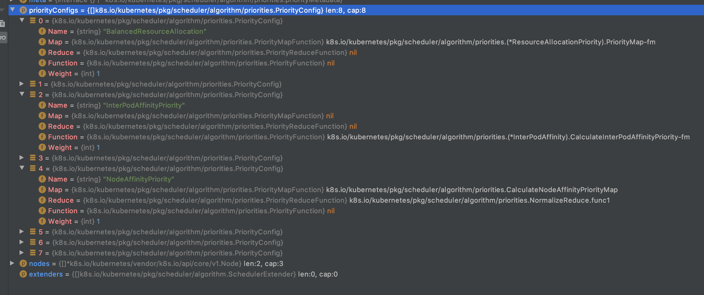
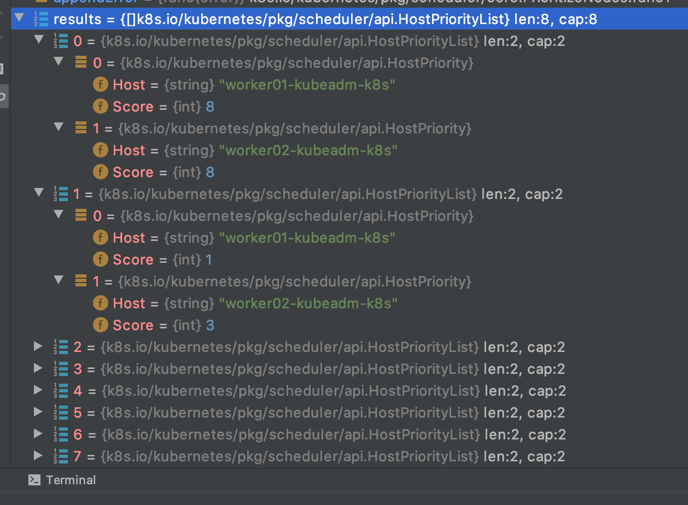
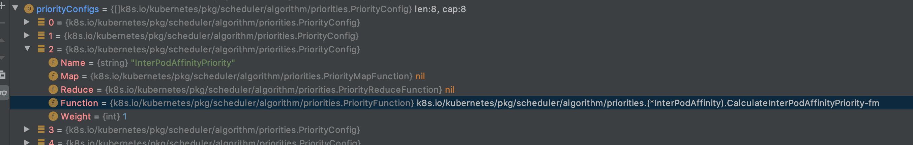
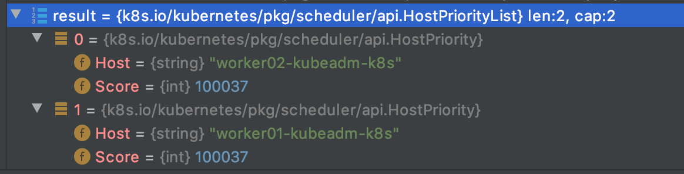
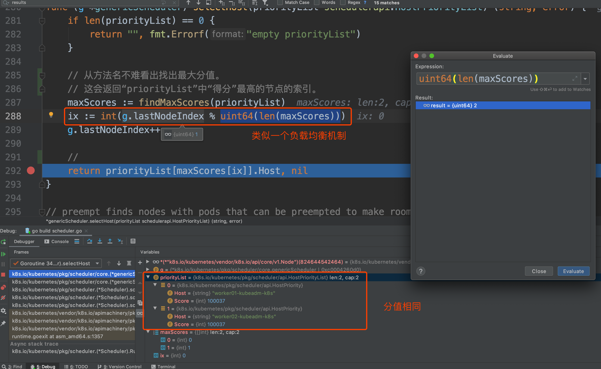
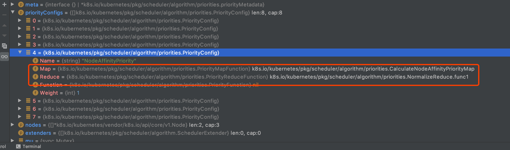

# kube-scheduler-node优选-源码分析

## Node优选

### 入口函数

前面在介绍pod调度的预选过程时，已经知道在`pkg/scheduler/core/generic_scheduler.go`的`Schedule`函数中经过`findNodesThatFit`预选函数计算后，通过预选通过的nodes会进入优选阶段。如下代码：

```go
func (g *genericScheduler) Schedule(pod *v1.Pod, nodeLister algorithm.NodeLister) (result ScheduleResult, err error) {

	// ... 省略代码
    
   // 预选阶段
   trace.Step("Computing predicates")
   startPredicateEvalTime := time.Now()
   // findNodesThatFit函数是实际执行预选的函数。该函数返回了通过预选函数过滤的Nodes:filteredNodes
   // 和failedPredicateMap，则记录了预选失败的node没有通过哪些过滤器
   filteredNodes, failedPredicateMap, err := g.findNodesThatFit(pod, nodes)
   if err != nil {
      return result, err
   }
 	// ... 省略代码

   // 优选的算法从这里开始。
   priorityList, err := PrioritizeNodes(pod, g.nodeInfoSnapshot.NodeInfoMap, metaPrioritiesInterface, g.prioritizers, filteredNodes, g.extenders)
   if err != nil {
      return result, err
   }
    // ... 省略代码

   // 优选结束，获取分值最高的node并返回
   host, err := g.selectHost(priorityList)
   return ScheduleResult{
      SuggestedHost:  host,
      EvaluatedNodes: len(filteredNodes) + len(failedPredicateMap),
      FeasibleNodes:  len(filteredNodes),
   }, err
}
```

上面的代码片段省略了不少代码。不过省略后对于整个调度过程更加清晰了。这里我们主要研究的是优选的实现逻辑，所以我们把焦点聚集到下面这段代码：

```go
priorityList, err := PrioritizeNodes(pod, g.nodeInfoSnapshot.NodeInfoMap, metaPrioritiesInterface, g.prioritizers, filteredNodes, g.extenders)
```

`PrioritizeNodes`要做的事情是给已经通过predicate的nodes赋上一个分值。该函数的注释如下：

```
PrioritizeNodes通过并发调用一个个priority函数来给node排优先级。每一个priority函数会给一个1-10之间的分值，0最低10最高。
每一个priority函数可以有自己的权重，单个函数返回的分值*权重后得到一个加权分值，最终所有的加权分值加在一起就是这个node的最终分值。
```

### 签名分析

我们先看`PrioritizeNodes`这个函数的签名，如下代码：

```go
func PrioritizeNodes(
   pod *v1.Pod,   // 需要调度的pod
   nodeNameToInfo map[string]*schedulernodeinfo.NodeInfo, // 节点信息
   meta interface{},
   priorityConfigs []priorities.PriorityConfig,   // 封装了优选算法各种信息，比较重要；
   nodes []*v1.Node,  // 所有通过预选的node
   extenders []algorithm.SchedulerExtender, // extender 这段逻辑先跳过。
) (schedulerapi.HostPriorityList, error) { // 返回值，这个结构保存的是一个node在一个priority算法计算后所得到的结果；
```

这里我们先看一下存放预选算法的`priorityConfigs`的数据结构：

```go
type PriorityConfig struct {
   Name   string  // 名字
   // 新的优选算法-map
   Map    PriorityMapFunction
   // 新的优选算法-reduce
   Reduce PriorityReduceFunction
   // TODO: Remove it after migrating all functions to
   // Map-Reduce pattern.
   // 老的优选算法，已经被DEPRECATED
   Function PriorityFunction
   Weight   int   // 权重
}
```

通过上面结构体的定义我们可以知道。`PriorityConfig`中定义了算法的名字和权重。`Function`函数中存放的老的优选算法函数，新的算法函数被分成了`map`和`reduce`。这里我们看一下实际运行时的实参是个什么样子：



从上图可以看到。实际是优选算法只有8个（这个取决于实际的配置），这里看到明细的是算法中三种情况。下标0的算法只有map函数，下标2的是一个老的优选算法只有Function中存在函数，下标4的是新的map和reduce都存在。这些函数具体是做什么我们暂时不关心（其实通过名字也差不多知道了），这里只需要对这个结构有一个认识就行。

下面我们关心一下`PrioritizeNodes`的返回值：`schedulerapi.HostPriorityList`, 代码如下：

```go
type HostPriority struct {
   // Name of the host
   // 节点名字
   Host string
   // Score associated with the host
   // 分值
   Score int
}

// HostPriorityList declares a []HostPriority type.
type HostPriorityList []HostPriority
```

后面频繁涉及到操作这个结构，着重分析一下这2个type，虽然很简单。**HostPriority**这个struct的属性是*Host*和*Score*，一个是string一个是int，所以很明显**HostPriority**所能够保存的信息是一个节点的名字和分值，再仔细一点说就是这个结构保存的是一个node在一个priority算法计算后所得到的结果；然后看**HostPriorityList**类型，这个类型是上一个类型的“集合”，**HostPriorityList**中存的是多个Host和Score的组合，所以**HostPriorityList**这个结构是要保存一个算法作用于所有node之后，得到的所有node的Score信息的。（这里我们先理解成一个算法的结果，作为函数返回值这里肯定是要保留所有算法作用后的最终node的Score，所以函数后半部分肯定有combine分值的步骤。）

### 优选的整体流程

前面我们做了一些铺垫，为的是更好的理解优选的过程。现在我们进入``PrioritizeNodes``内存看一下具体的实现。

下面我们看一下```PrioritizeNodes```函数整体的代码，后面会把`PrioritizeNodes`函数的计算过程拆开分析。代码如下：

```go
func PrioritizeNodes(
   pod *v1.Pod,   // 需要调度的pod
   nodeNameToInfo map[string]*schedulernodeinfo.NodeInfo, // 节点信息
   meta interface{},
   priorityConfigs []priorities.PriorityConfig,   // 封装了优选算法各种信息，比较重要；
   nodes []*v1.Node,  // 所有通过预选的node
   extenders []algorithm.SchedulerExtender, // extender 这段逻辑先跳过。
) (schedulerapi.HostPriorityList, error) { // 返回值，这个结构保存的是一个node在一个priority算法计算后所得到的结果；
   // If no priority configs are provided, then the EqualPriority function is applied
   // This is required to generate the priority list in the required format
   // 如果没有配置优选，则初始一个所有node分值都为1的数组返回。
   if len(priorityConfigs) == 0 && len(extenders) == 0 {
      result := make(schedulerapi.HostPriorityList, 0, len(nodes))
      for i := range nodes {
         hostPriority, err := EqualPriorityMap(pod, meta, nodeNameToInfo[nodes[i].Name])
         if err != nil {
            return nil, err
         }
         result = append(result, hostPriority)
      }
      return result, nil
   }

   // 这里只是简单定义3个变量，一把锁，一个并发等待相关的wg，一个错误集合errs；
   var (
      mu   = sync.Mutex{}
      wg   = sync.WaitGroup{}
      errs []error
   )
   // 这里定义了一个appendError小函数，逻辑很简单，并发场景下将错误信息收集到errs中；
   appendError := func(err error) {
      mu.Lock()
      defer mu.Unlock()
      errs = append(errs, err)
   }


   // 最后一个变量results也不难理解，类型是[]schedulerapi.HostPriorityList，这里需要注意这个类型
   // 的作用，它保存的是所有算法作用所有node之后得到的结果集，相当于一个二维数组，每个格子是1个算法
   // 作用于1个节点的结果，一行也就是1个算法作用于所有节点的结果；一行展成一个二维就是所有算法作用于所有节点；
   results := make([]schedulerapi.HostPriorityList, len(priorityConfigs), len(priorityConfigs))

   // DEPRECATED: we can remove this when all priorityConfigs implement the
   // Map-Reduce pattern.
   // 这里遍历优选算法集合
   for i := range priorityConfigs {
      // 这里判断priorityConfigs是否封装了老的优选算法，如果有就执行。
      if priorityConfigs[i].Function != nil {
         wg.Add(1)
         // 注意这里的参数index，这里传入的实参是上面的i；
         go func(index int) {
            defer wg.Done()
            var err error
            // 所以这里的results[index]就好理解了；后面priorityConfigs[index]的索引也是index，
            // 这里表达的是第N个优选配置里有Function，那么这个Function的计算结果保存在
            // results的第N个格子里；
            results[index], err = priorityConfigs[index].Function(pod, nodeNameToInfo, nodes)
            if err != nil {
               appendError(err)
            }
         }(i)
      } else {
         // 如果没有定义Function，其实也就是使用了Map-Reduce方式的，这里先存个空的结构占位；
         results[i] = make(schedulerapi.HostPriorityList, len(nodes))
      }
   }

   // 这个并发逻辑之前介绍过了，我们直接看ParallelizeUntil的最后一个参数就行，这里直接写了一个匿名函数；
   // 这里的任务数是len(nodes)，相当于遍历所有的nodes。也就是说匿名函数的index是[0，len(nodes)-1]
   workqueue.ParallelizeUntil(context.TODO(), 16, len(nodes), func(index int) {
      // 获取节点信息
      nodeInfo := nodeNameToInfo[nodes[index].Name]
      // 这个for循环遍历的是所有的优选配置，如果有老Fun就跳过，新逻辑就继续；
      for i := range priorityConfigs {
         if priorityConfigs[i].Function != nil {
            // 这里跳过是因为前面old已经运行过了
            continue
         }

         var err error
         // 这里的i和前面老Fun的互补，老Fun中没有赋值的results中的元素就在这里赋值了；
         // 注意到这里调用了一个Map函数就直接赋值给了results[i][index]，这里的index是第一行这个
         // 匿名函数的形参，通过ParallelizeUntil这个并发实现所有node对应一个优选算法的分值计算；
         results[i][index], err = priorityConfigs[i].Map(pod, meta, nodeInfo)
         if err != nil {
            appendError(err)
            results[i][index].Host = nodes[index].Name
         }
      }
   })

   // 这里会执行Reduce
   for i := range priorityConfigs {
      // 没有定义Reduce函数就不处理；
      if priorityConfigs[i].Reduce == nil {
         continue
      }
      wg.Add(1)
      go func(index int) {
         defer wg.Done()
         // 调用Reduce函数
         if err := priorityConfigs[index].Reduce(pod, meta, nodeNameToInfo, results[index]); err != nil {
            appendError(err)
         }
         if klog.V(10) {
            for _, hostPriority := range results[index] {
               klog.Infof("%v -> %v: %v, Score: (%d)", util.GetPodFullName(pod), hostPriority.Host, priorityConfigs[index].Name, hostPriority.Score)
            }
         }
      }(i)
   }
   // Wait for all computations to be finished.
   wg.Wait()
   if len(errs) != 0 {
      return schedulerapi.HostPriorityList{}, errors.NewAggregate(errs)
   }

   // Summarize all scores.
   // 汇总node总分，这个result和前面的results类似，result用于存储每个node的Score，到这里已经没有必要区分算法了；
   result := make(schedulerapi.HostPriorityList, 0, len(nodes))

   // 循环执行len(nodes)次
   for i := range nodes {
      // 先在result中塞满所有node的Name，Score初始化为0；
      result = append(result, schedulerapi.HostPriority{Host: nodes[i].Name, Score: 0})
      for j := range priorityConfigs {
         // 每个算法对应第i个node的结果分值加权后累加；
         result[i].Score += results[j][i].Score * priorityConfigs[j].Weight
      }
   }

   // 计算extenders
   if len(extenders) != 0 && nodes != nil {
      combinedScores := make(map[string]int, len(nodeNameToInfo))
      for i := range extenders {
         if !extenders[i].IsInterested(pod) {
            continue
         }
         wg.Add(1)
         go func(extIndex int) {
            defer wg.Done()
            prioritizedList, weight, err := extenders[extIndex].Prioritize(pod, nodes)
            if err != nil {
               // Prioritization errors from extender can be ignored, let k8s/other extenders determine the priorities
               return
            }
            mu.Lock()
            for i := range *prioritizedList {
               host, score := (*prioritizedList)[i].Host, (*prioritizedList)[i].Score
               if klog.V(10) {
                  klog.Infof("%v -> %v: %v, Score: (%d)", util.GetPodFullName(pod), host, extenders[extIndex].Name(), score)
               }
               combinedScores[host] += score * weight
            }
            mu.Unlock()
         }(i)
      }
      // wait for all go routines to finish
      wg.Wait()
      for i := range result {
         result[i].Score += combinedScores[result[i].Host]
      }
   }

   if klog.V(10) {
      for i := range result {
         klog.Infof("Host %s => Score %d", result[i].Host, result[i].Score)
      }
   }
   return result, nil
}
```

上面函数内的代码比较多，**总体流程是：准备-老优选函数执行-map\reduce函数执行-汇总node总分-计算extenders（后续分析）。**

#### 准备

我们先看一下`PrioritizeNodes`函数，在优选开始前的一些准备工作。下面的代码是`PrioritizeNodes`函数的代码片段：

```go
// 如果没有配置优选，则初始一个所有node分值都为1的数组返回。
if len(priorityConfigs) == 0 && len(extenders) == 0 {
   result := make(schedulerapi.HostPriorityList, 0, len(nodes))
   for i := range nodes {
      hostPriority, err := EqualPriorityMap(pod, meta, nodeNameToInfo[nodes[i].Name])
      if err != nil {
         return nil, err
      }
      result = append(result, hostPriority)
   }
   return result, nil
}

// 这里只是简单定义3个变量，一把锁，一个并发等待相关的wg，一个错误集合errs；
var (
   mu   = sync.Mutex{}
   wg   = sync.WaitGroup{}
   errs []error
)
// 这里定义了一个appendError小函数，逻辑很简单，并发场景下将错误信息收集到errs中；
appendError := func(err error) {
   mu.Lock()
   defer mu.Unlock()
   errs = append(errs, err)
}


// 最后一个变量results也不难理解，类型是[]schedulerapi.HostPriorityList，这里需要注意这个类型
// 的作用，它保存的是所有算法作用所有node之后得到的结果集，相当于一个二维数组，每个格子是1个算法
// 作用于1个节点的结果，一行也就是1个算法作用于所有节点的结果；一行展成一个二维就是所有算法作用于所有节点；
results := make([]schedulerapi.HostPriorityList, len(priorityConfigs), len(priorityConfigs))
```

这段代码片段，开始做了一些容错处理和锁的初始化，这里了解一下就可以了，我们重点关注一下`results`这个变量，`HostPriorityList`的数据结构我们之前介绍过，源码中注释描述的也很清晰，这里主要给出一个该变量在预选结束后的存储结构的截图，来方便理解：



对照着内存存储在看一下源码中的注释，这里并不难理解。 

#### 老优选函数执行

初始化以后下一步进行的是老优选函数的执行。

```go
// DEPRECATED: we can remove this when all priorityConfigs implement the
// Map-Reduce pattern.
// 这里遍历优选算法集合
for i := range priorityConfigs {
   // 这里判断priorityConfigs是否封装了老的优选算法，如果有就执行。
   if priorityConfigs[i].Function != nil {
      wg.Add(1)
      // 注意这里的参数index，这里传入的实参是上面的i；
      go func(index int) {
         defer wg.Done()
         var err error
         // 所以这里的results[index]就好理解了；后面priorityConfigs[index]的索引也是index，
         // 这里表达的是第N个优选配置里有Function，那么这个Function的计算结果保存在
         // results的第N个格子里；
         results[index], err = priorityConfigs[index].Function(pod, nodeNameToInfo, nodes)
         if err != nil {
            appendError(err)
         }
      }(i)
   } else {
      // 如果没有定义Function，其实也就是使用了Map-Reduce方式的，这里先存个空的结构占位；
      results[i] = make(schedulerapi.HostPriorityList, len(nodes))
   }
}
```

这段逻辑并不难，总体的意思就是遍历`priorityConfigs`，判断`priorityConfig`中是否存在`Function`函数如果存在就执行。如果不存在，其实也就是使用了Map-Reduce方式的，这里先存个空的结构占位。

从上面代码的注释中可以看到这种函数已经DEPRECATED了，默认的优选算法里其实也只有1个是这在old形式的了。

这里在关注一下`Function`这个函数：

```go
type PriorityFunction func(pod *v1.Pod, nodeNameToInfo map[string]*schedulernodeinfo.NodeInfo, nodes []*v1.Node) (schedulerapi.HostPriorityList, error)

// PriorityConfig is a config used for a priority function.
type PriorityConfig struct {
   Name   string  // 名字
   // 新的优选算法-map
   Map    PriorityMapFunction
   // 新的优选算法-reduce
   Reduce PriorityReduceFunction
   // TODO: Remove it after migrating all functions to
   // Map-Reduce pattern.
   // 老的优选算法，已经被DEPRECATED
   Function PriorityFunction
   Weight   int   // 权重
}
```

从这段代码里可以看到`Function`函数的定义。参数也不难懂。看下图：



从图中可以看到具体的实现是：`CalculateInterPodAffinityPriority`。这里记住这个函数的名字就好了。老优选函数就分析到这里。

#### map\reduce函数执行

简单说map-reduce就是：Map是映射，Reduce是归约；map是统计一本书中的一页出现了多少次k8s这个词，reduce是将这些map结果汇总在一起得到最终结果。（map一般都是将一个算法作用于一堆数据集的每一个元素，得到一个结果集，reduce有各种形式，可以是累加这些结果，或者是对这个结果集做其他复杂的f(x)操作。

看看在Scheduler里面是怎么用Map-Reduce的吧：

```go
// 这个并发逻辑之前介绍过了，我们直接看ParallelizeUntil的最后一个参数就行，这里直接写了一个匿名函数；
// 这里的任务数是len(nodes)，相当于遍历所有的nodes。也就是说匿名函数的index是[0，len(nodes)-1]
workqueue.ParallelizeUntil(context.TODO(), 16, len(nodes), func(index int) {
   // 获取节点信息
   nodeInfo := nodeNameToInfo[nodes[index].Name]
   // 这个for循环遍历的是所有的优选配置，如果有老Fun就跳过，新逻辑就继续；
   for i := range priorityConfigs {
      if priorityConfigs[i].Function != nil {
         // 这里跳过是因为前面old已经运行过了
         continue
      }

      var err error
      // 这里的i和前面老Fun的互补，老Fun中没有赋值的results中的元素就在这里赋值了；
      // 注意到这里调用了一个Map函数就直接赋值给了results[i][index]，这里的index是第一行这个
      // 匿名函数的形参，通过ParallelizeUntil这个并发实现所有node对应一个优选算法的分值计算；
      results[i][index], err = priorityConfigs[i].Map(pod, meta, nodeInfo)
      if err != nil {
         appendError(err)
         results[i][index].Host = nodes[index].Name
      }
   }
})

// 这里会执行Reduce
for i := range priorityConfigs {
   // 没有定义Reduce函数就不处理；
   if priorityConfigs[i].Reduce == nil {
      continue
   }
   wg.Add(1)
   go func(index int) {
      defer wg.Done()
      // 调用Reduce函数
      if err := priorityConfigs[index].Reduce(pod, meta, nodeNameToInfo, results[index]); err != nil {
         appendError(err)
      }
      if klog.V(10) {
         for _, hostPriority := range results[index] {
            klog.Infof("%v -> %v: %v, Score: (%d)", util.GetPodFullName(pod), hostPriority.Host, priorityConfigs[index].Name, hostPriority.Score)
         }
      }
   }(i)
}
// Wait for all computations to be finished.
wg.Wait()
if len(errs) != 0 {
   return schedulerapi.HostPriorityList{}, errors.NewAggregate(errs)
}
```

看到这里我们可以发现老Fun和Map的区别不大，都是优选函数的执行过程。那为什么会存在两种形式呢？我们看完**PrioritizeNodes**整体流程后通过具体的Fun和Map-Reduce实现来看二者的区别。

下面看一下，在看一下`results`函数的存储结构：


#### 汇总node总分

这块的代码很简单，我们先抛开extender的逻辑，剩下的代码如下：

```java
   // 循环执行len(nodes)次
   for i := range nodes {
      // 先在result中塞满所有node的Name，Score初始化为0；
      result = append(result, schedulerapi.HostPriority{Host: nodes[i].Name, Score: 0})
      for j := range priorityConfigs {
         // 每个算法对应第i个node的结果分值加权后累加；
         result[i].Score += results[j][i].Score * priorityConfigs[j].Weight
      }
   }

   // ... 省略代码   (extender的逻辑)

   return result, nil
}
```

这块逻辑很清晰，要将前面得到的二维结果results压缩成一维的加权分值集合result，最终返回这个result.

从这里我们还可以得到一个结论，不管是Fun还是Map-Reduce，处理的结果都是填充results这个二维结构，所以Map-Reduce也没有什么神秘的，下面通过具体的算法来看二者有何异同。

下面看一下计算完成后`result`的存储结构吧：



### 选定节点

分析完Node的优选后，在`pkg/scheduler/core/generic_scheduler.go`的`Schedule`函数中就只剩下`selectHost`这个函数还没分析了。这个函数在优选结束后，获取分值最高的node并返回。

源码如下：

```go
func (g *genericScheduler) selectHost(priorityList schedulerapi.HostPriorityList) (string, error) {
   if len(priorityList) == 0 {
      return "", fmt.Errorf("empty priorityList")
   }

   // 从方法名不难看出找出最大分值。
   // 这会返回“priorityList”中“得分”最高的节点的索引列表。
   maxScores := findMaxScores(priorityList)
   ix := int(g.lastNodeIndex % uint64(len(maxScores)))
   g.lastNodeIndex++

   // 返回最终确定的node
   return priorityList[maxScores[ix]].Host, nil
}

func findMaxScores(priorityList schedulerapi.HostPriorityList) []int {
	// 声明一个切片
	maxScoreIndexes := make([]int, 0, len(priorityList)/2)
	// 取到优选结果的第一个节点的分值作为当前最大分值
	maxScore := priorityList[0].Score
	for i, hp := range priorityList {
		// 如果节点的分值大于当前最大分值
		if hp.Score > maxScore {
			maxScore = hp.Score		// 重新复制最大分值
			maxScoreIndexes = maxScoreIndexes[:0]	// 相当于切片内的数据清空了。
			maxScoreIndexes = append(maxScoreIndexes, i)	// 将当前节点的所以放入切片
		} else if hp.Score == maxScore {	// 如果节点的分值等于最大分值，怎添加到切片中
			maxScoreIndexes = append(maxScoreIndexes, i)
		}
	}
	// 这里会返回一个可分配节点下标的集合
	return maxScoreIndexes
}
```

上面的两个函数结合下图，不太难理解。



### Fun和Map-Reduce分析

#### Fun

##### CalculateInterPodAffinityPriority

这个算法做的是Pod间亲和性优选，也就是亲和pod越多的节点分值越高，反亲和pod越多分值越低。

我们撇开具体的亲和性计算规则，从优选函数的形式上看一下这段代码的逻辑：

```go
func (ipa *InterPodAffinity) CalculateInterPodAffinityPriority(pod *v1.Pod, nodeNameToInfo map[string]*schedulernodeinfo.NodeInfo, nodes []*v1.Node) (schedulerapi.HostPriorityList, error) {
   affinity := pod.Spec.Affinity
   // 是否有亲和性约束；
   hasAffinityConstraints := affinity != nil && affinity.PodAffinity != nil
   // 是否有反亲和性约束；
   hasAntiAffinityConstraints := affinity != nil && affinity.PodAntiAffinity != nil

   // 这里有一段根据亲和性和反亲和性来计算一个node上匹配的pod数量的逻辑，我们先跳过这些逻辑，从优选算法实现的角度看这个算法的架子；


   // 当遍历完所有的node之后，可以得到1个最高分和1个最低分，分别记为maxCount和minCount；
   for _, node := range nodes {
      if pm.counts[node.Name] > maxCount {
         maxCount = pm.counts[node.Name]
      }
      if pm.counts[node.Name] < minCount {
         minCount = pm.counts[node.Name]
      }
   }

   // 这个result类型和前面看到的一样，都是存储单个算法的计算结果的；
   result := make(schedulerapi.HostPriorityList, 0, len(nodes))
   for _, node := range nodes {
      fScore := float64(0)
      // 如果分差大于0，也就是说不是所有的node都一样的情况，需要对分值做一个处理；
      if (maxCount - minCount) > 0 {
         // MaxPriority定义的是优选最高分10，第二个因数是当前node的count-最小count，
         // 然后除以(maxCount - minCount)；举个例子，当前node的计算结果是5，最大count是20，最小
         // count是-3，那么这里就是10*[5-(-3)/20-(-3)]
         // 这个计算的结果显然会在[0-10]之间；
         fScore = float64(schedulerapi.MaxPriority) * ((pm.counts[node.Name] - minCount) / (maxCount - minCount))
      }
      // 如果分差不大于0，这时候int(fScore)也就是0，对于各个node的结果都是0；
      result = append(result, schedulerapi.HostPriority{Host: node.Name, Score: int(fScore)})
      if klog.V(10) {
         klog.Infof("%v -> %v: InterPodAffinityPriority, Score: (%d)", pod.Name, node.Name, int(fScore))
      }
   }
   return result, nil
}
```

如上，我们可以发现最终这个函数计算出了每个node的分值，这个分值在[0-10]之间。所以说到底Function做的事情就是根据一定的规则给每个node赋一个分值，这个分值要求在[0-10]之间，然后把这个`HostPriorityList`返回就行。

#### Map

我们先看一下内存中截图：



##### CalculateNodeAffinityPriorityMap

这个算法和上一个类似，上一个是Pod的Affinity，这个是Node的Affinity。代码如下：

```go
func CalculateNodeAffinityPriorityMap(pod *v1.Pod, meta interface{}, nodeInfo *schedulernodeinfo.NodeInfo) (schedulerapi.HostPriority, error) {
   node := nodeInfo.Node()
   if node == nil {
      return schedulerapi.HostPriority{}, fmt.Errorf("node not found")
   }

   // default is the podspec.
   affinity := pod.Spec.Affinity
   if priorityMeta, ok := meta.(*priorityMetadata); ok {
      // We were able to parse metadata, use affinity from there.
      affinity = priorityMeta.affinity
   }

   var count int32
   // A nil element of PreferredDuringSchedulingIgnoredDuringExecution matches no objects.
   // An element of PreferredDuringSchedulingIgnoredDuringExecution that refers to an
   // empty PreferredSchedulingTerm matches all objects.
   if affinity != nil && affinity.NodeAffinity != nil && affinity.NodeAffinity.PreferredDuringSchedulingIgnoredDuringExecution != nil {
      // Match PreferredDuringSchedulingIgnoredDuringExecution term by term.
      for i := range affinity.NodeAffinity.PreferredDuringSchedulingIgnoredDuringExecution {
         preferredSchedulingTerm := &affinity.NodeAffinity.PreferredDuringSchedulingIgnoredDuringExecution[i]
         if preferredSchedulingTerm.Weight == 0 {
            continue
         }

         // TODO: Avoid computing it for all nodes if this becomes a performance problem.
         nodeSelector, err := v1helper.NodeSelectorRequirementsAsSelector(preferredSchedulingTerm.Preference.MatchExpressions)
         if err != nil {
            return schedulerapi.HostPriority{}, err
         }
         if nodeSelector.Matches(labels.Set(node.Labels)) {
            count += preferredSchedulingTerm.Weight
         }
      }
   }

   return schedulerapi.HostPriority{
      Host:  node.Name,
      Score: int(count),
   }, nil
}
```

撇开具体的亲和性计算细节，我们可以发现这个的count没有特定的规则，可能会加到10以上；另外这里的返回值是`HostPriority`类型，前面的Function返回了`HostPriorityList`类型。

我们在来看一个Map函数：

```go
func (s *ServiceAntiAffinity) CalculateAntiAffinityPriorityMap(pod *v1.Pod, meta interface{}, nodeInfo *schedulernodeinfo.NodeInfo) (schedulerapi.HostPriority, error) {
   var firstServiceSelector labels.Selector

   node := nodeInfo.Node()
   if node == nil {
      return schedulerapi.HostPriority{}, fmt.Errorf("node not found")
   }
   priorityMeta, ok := meta.(*priorityMetadata)
   if ok {
      firstServiceSelector = priorityMeta.podFirstServiceSelector
   } else {
      firstServiceSelector = getFirstServiceSelector(pod, s.serviceLister)
   }
   //pods matched namespace,selector on current node
   var selectors []labels.Selector
   if firstServiceSelector != nil {
      selectors = append(selectors, firstServiceSelector)
   }
   // 查找给定node在给定namespace下符合selector的pod的数量
   score := countMatchingPods(pod.Namespace, selectors, nodeInfo)

   return schedulerapi.HostPriority{
      Host:  node.Name,
      // 返回值中Score设置成上面找到的pod的数量
      Score: score,
   }, nil
}
```

这个函数比较短，可以看到在指定node上查询到匹配selector的pod越多，分值就越高。假设找到了20个，那么这里的分值就是20；假设找到的是2，那这里的分值就是2.

#### Reduce

##### CalculateNodeAffinityPriorityReduce

和`CalculateNodeAffinityPriorityMap`这个Map对应的Reduce函数其实没有单独实现，通过`NormalizeReduce`函数做了一个通用的Reduce处理：

```go
func NormalizeReduce(maxPriority int, reverse bool) PriorityReduceFunction {
   return func(
      _ *v1.Pod,
      _ interface{},
      _ map[string]*schedulernodeinfo.NodeInfo,
      result schedulerapi.HostPriorityList) error { // 注意到这个result是HostPriorityList，对应1个算法N个node的结果集

      var maxCount int
      // 遍历result将最高的Score赋值给maxCount
      for i := range result {
         if result[i].Score > maxCount {
            maxCount = result[i].Score
         }
      }

      if maxCount == 0 {
         if reverse {
            for i := range result {
               result[i].Score = maxPriority
            }
         }
         return nil
      }

      for i := range result {
         score := result[i].Score

         // 举个例子：10*(5/20)
         score = maxPriority * score / maxCount
         if reverse {
            // 如果score是3，得到7；如果score是4，得到6，结果反转；
            score = maxPriority - score
         }

         result[i].Score = score
      }
      return nil
   }
}
```

#### 小结

- Function：一个算法一次性计算出所有node的Score，这个Score的范围是规定的[0-10]；
- Map-Reduce：一个Map算法计算1个node的Score，这个Score可以灵活处理，可能是20，可能是-3；Map过程并发进行；最终得到的结果result通过Reduce归约，将这个算法对应的所有node的分值归约为[0-10]；

