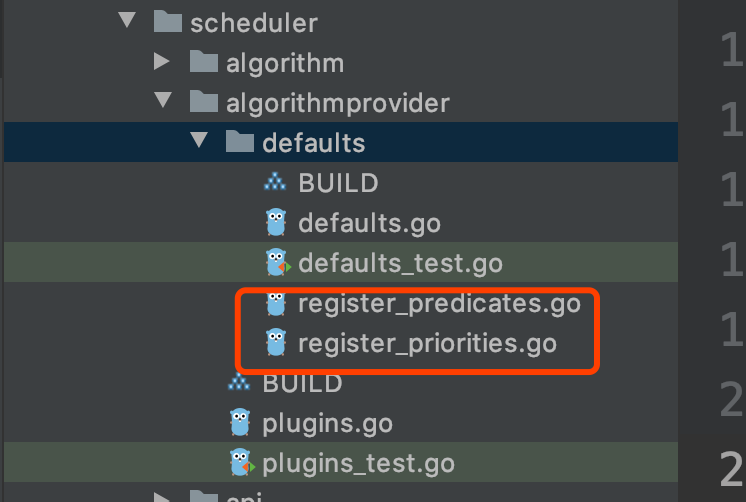
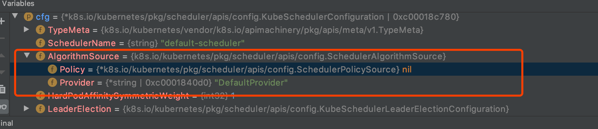

# kube-scheduler-调度算法初始化-源码分析

经过前面的分析。我们对`kube-scheduler`的调度有了比较深入的了解。

我们已知：

- 预选（predicates）：是通过预先加载好的预选函数依次过滤一个节点。
- 优选（priorities）：是通过预先加载好的`fun或者map/reduce`来对节点进行打分。

那么这些函数是如何加载的呢？我们来详细分析一下。看下图：

`pkg/scheduler/algorithmprovider/defaults`



## 算法注册

### 预选算法注册

这里很显然这两个文件就是存放预选和优选算法的文件，我们先来看`register_predicates.go`里面的实现：

```go
package defaults

import (
   "k8s.io/kubernetes/pkg/scheduler/algorithm/predicates"
   "k8s.io/kubernetes/pkg/scheduler/factory"
)

func init() {
   // Register functions that extract metadata used by predicates computations.
   factory.RegisterPredicateMetadataProducerFactory(
      func(args factory.PluginFactoryArgs) predicates.PredicateMetadataProducer {
         return predicates.NewPredicateMetadataFactory(args.PodLister)
      })

   // IMPORTANT NOTES for predicate developers:
   // Registers predicates and priorities that are not enabled by default, but user can pick when creating their
   // own set of priorities/predicates.

   // PodFitsPorts has been replaced by PodFitsHostPorts for better user understanding.
   // For backwards compatibility with 1.0, PodFitsPorts is registered as well.
   factory.RegisterFitPredicate("PodFitsPorts", predicates.PodFitsHostPorts)
   // Fit is defined based on the absence of port conflicts.
   // This predicate is actually a default predicate, because it is invoked from
   // predicates.GeneralPredicates()
   factory.RegisterFitPredicate(predicates.PodFitsHostPortsPred, predicates.PodFitsHostPorts)
   // Fit is determined by resource availability.
   // This predicate is actually a default predicate, because it is invoked from
   // predicates.GeneralPredicates()
   factory.RegisterFitPredicate(predicates.PodFitsResourcesPred, predicates.PodFitsResources)
   // Fit is determined by the presence of the Host parameter and a string match
   // This predicate is actually a default predicate, because it is invoked from
   // predicates.GeneralPredicates()
   factory.RegisterFitPredicate(predicates.HostNamePred, predicates.PodFitsHost)
   // Fit is determined by node selector query.
   factory.RegisterFitPredicate(predicates.MatchNodeSelectorPred, predicates.PodMatchNodeSelector)

   // Fit is determined by volume zone requirements.
   factory.RegisterFitPredicateFactory(
      predicates.NoVolumeZoneConflictPred,
      func(args factory.PluginFactoryArgs) predicates.FitPredicate {
         return predicates.NewVolumeZonePredicate(args.PVInfo, args.PVCInfo, args.StorageClassInfo)
      },
   )
   // Fit is determined by whether or not there would be too many AWS EBS volumes attached to the node
   factory.RegisterFitPredicateFactory(
      predicates.MaxEBSVolumeCountPred,
      func(args factory.PluginFactoryArgs) predicates.FitPredicate {
         return predicates.NewMaxPDVolumeCountPredicate(predicates.EBSVolumeFilterType, args.PVInfo, args.PVCInfo)
      },
   )
   // Fit is determined by whether or not there would be too many GCE PD volumes attached to the node
   factory.RegisterFitPredicateFactory(
      predicates.MaxGCEPDVolumeCountPred,
      func(args factory.PluginFactoryArgs) predicates.FitPredicate {
         return predicates.NewMaxPDVolumeCountPredicate(predicates.GCEPDVolumeFilterType, args.PVInfo, args.PVCInfo)
      },
   )
   // Fit is determined by whether or not there would be too many Azure Disk volumes attached to the node
   factory.RegisterFitPredicateFactory(
      predicates.MaxAzureDiskVolumeCountPred,
      func(args factory.PluginFactoryArgs) predicates.FitPredicate {
         return predicates.NewMaxPDVolumeCountPredicate(predicates.AzureDiskVolumeFilterType, args.PVInfo, args.PVCInfo)
      },
   )
   factory.RegisterFitPredicateFactory(
      predicates.MaxCSIVolumeCountPred,
      func(args factory.PluginFactoryArgs) predicates.FitPredicate {
         return predicates.NewCSIMaxVolumeLimitPredicate(args.PVInfo, args.PVCInfo)
      },
   )
   factory.RegisterFitPredicateFactory(
      predicates.MaxCinderVolumeCountPred,
      func(args factory.PluginFactoryArgs) predicates.FitPredicate {
         return predicates.NewMaxPDVolumeCountPredicate(predicates.CinderVolumeFilterType, args.PVInfo, args.PVCInfo)
      },
   )

   // Fit is determined by inter-pod affinity.
   factory.RegisterFitPredicateFactory(
      predicates.MatchInterPodAffinityPred,
      func(args factory.PluginFactoryArgs) predicates.FitPredicate {
         return predicates.NewPodAffinityPredicate(args.NodeInfo, args.PodLister)
      },
   )

   // Fit is determined by non-conflicting disk volumes.
   factory.RegisterFitPredicate(predicates.NoDiskConflictPred, predicates.NoDiskConflict)

   // GeneralPredicates are the predicates that are enforced by all Kubernetes components
   // (e.g. kubelet and all schedulers)
   factory.RegisterFitPredicate(predicates.GeneralPred, predicates.GeneralPredicates)

   // Fit is determined by node memory pressure condition.
   factory.RegisterFitPredicate(predicates.CheckNodeMemoryPressurePred, predicates.CheckNodeMemoryPressurePredicate)

   // Fit is determined by node disk pressure condition.
   factory.RegisterFitPredicate(predicates.CheckNodeDiskPressurePred, predicates.CheckNodeDiskPressurePredicate)

   // Fit is determined by node pid pressure condition.
   factory.RegisterFitPredicate(predicates.CheckNodePIDPressurePred, predicates.CheckNodePIDPressurePredicate)

   // Fit is determined by node conditions: not ready, network unavailable or out of disk.
   factory.RegisterMandatoryFitPredicate(predicates.CheckNodeConditionPred, predicates.CheckNodeConditionPredicate)

   // Fit is determined based on whether a pod can tolerate all of the node's taints
   factory.RegisterFitPredicate(predicates.PodToleratesNodeTaintsPred, predicates.PodToleratesNodeTaints)

   // Fit is determined by volume topology requirements.
   factory.RegisterFitPredicateFactory(
      predicates.CheckVolumeBindingPred,
      func(args factory.PluginFactoryArgs) predicates.FitPredicate {
         return predicates.NewVolumeBindingPredicate(args.VolumeBinder)
      },
   )
}
```

从源码中我们可以看出。整个`register_predicates.go`文件中只有一个`init()`函数。也就是说这些代码会在初始化的时候被执行。

然后我们看一个之前我们看过的预选函数名的集合：

```go
var (
   //重要提示:此列表包含predicates的顺序，如果您开发了一个新的predicates，则必须将其名称添加到此列表中。
   predicatesOrdering = []string{CheckNodeConditionPred, CheckNodeUnschedulablePred,
      GeneralPred, HostNamePred, PodFitsHostPortsPred,
      MatchNodeSelectorPred, PodFitsResourcesPred, NoDiskConflictPred,
      PodToleratesNodeTaintsPred, PodToleratesNodeNoExecuteTaintsPred, CheckNodeLabelPresencePred,
      CheckServiceAffinityPred, MaxEBSVolumeCountPred, MaxGCEPDVolumeCountPred, MaxCSIVolumeCountPred,
      MaxAzureDiskVolumeCountPred, MaxCinderVolumeCountPred, CheckVolumeBindingPred, NoVolumeZoneConflictPred,
      CheckNodeMemoryPressurePred, CheckNodePIDPressurePred, CheckNodeDiskPressurePred, MatchInterPodAffinityPred}
)
```


这里我们挑选一个`CheckNodeConditionPred`这个预选函数，去看看在`register_predicates.go`中是如何初始化的。

代码如下：

```go
factory.RegisterMandatoryFitPredicate(predicates.CheckNodeConditionPred, predicates.CheckNodeConditionPredicate)
```

我们先看看`RegisterMandatoryFitPredicate`方法的签名：

```go
func RegisterMandatoryFitPredicate(name string, predicate predicates.FitPredicate) string {
```

这里需要两个参数一个是name是string类型的，它就是预选算法的名字，领完一个是`predicates`，是一个`predicates.FitPredicate`类型。这个类型之前也看到过，是一个预选函数。代码如下：

```go
type FitPredicate func(pod *v1.Pod, meta PredicateMetadata, nodeInfo *schedulernodeinfo.NodeInfo) (bool, []PredicateFailureReason, error)
```

那么这里`RegisterMandatoryFitPredicate`方法传入的就是一个预选算法名字和一个算法的实现。

我们来看看代码的实现：

```java
func RegisterMandatoryFitPredicate(name string, predicate predicates.FitPredicate) string {
   schedulerFactoryMutex.Lock()
   defer schedulerFactoryMutex.Unlock()
   validateAlgorithmNameOrDie(name)
   fitPredicateMap[name] = func(PluginFactoryArgs) predicates.FitPredicate { return predicate }
   mandatoryFitPredicates.Insert(name)
   return name
}
```

这里可以看到实际运行的函数被封装到了`fitPredicateMap`中。这里在看一下`predicates.CheckNodeConditionPredicate`这个函数的实现，代码如下：

```go
func CheckNodeConditionPredicate(pod *v1.Pod, meta PredicateMetadata, nodeInfo *schedulernodeinfo.NodeInfo) (bool, []PredicateFailureReason, error) {
   reasons := []PredicateFailureReason{}
   if nodeInfo == nil || nodeInfo.Node() == nil {
      return false, []PredicateFailureReason{ErrNodeUnknownCondition}, nil
   }

   node := nodeInfo.Node()
   for _, cond := range node.Status.Conditions {
      // We consider the node for scheduling only when its:
      // - NodeReady condition status is ConditionTrue,
      // - NodeNetworkUnavailable condition status is ConditionFalse.
      if cond.Type == v1.NodeReady && cond.Status != v1.ConditionTrue {
         reasons = append(reasons, ErrNodeNotReady)
      } else if cond.Type == v1.NodeNetworkUnavailable && cond.Status != v1.ConditionFalse {
         reasons = append(reasons, ErrNodeNetworkUnavailable)
      }
   }

   if node.Spec.Unschedulable {
      reasons = append(reasons, ErrNodeUnschedulable)
   }

   return len(reasons) == 0, reasons, nil
}
```

这里实际就是判断一下Node的状态和网络状态。这里不继续分析。知道这是预选的具体实现函数就好了。

看的这里我们可以知道，`register_predicates.go`文件加载的时候其中的所有预选算法是都被注册到`fitPredicateMap`中。到这里有个印象就可以了。

### 优选算法注册

我们在看优选函数`register_priorities.go`，这里和预选的初始化方式原理相同。只是函数的封装形式变了，我们来看一下代码：

```go


package defaults

import (
   "k8s.io/kubernetes/pkg/scheduler/algorithm"
   "k8s.io/kubernetes/pkg/scheduler/algorithm/priorities"
   "k8s.io/kubernetes/pkg/scheduler/core"
   "k8s.io/kubernetes/pkg/scheduler/factory"
)

func init() {
   // Register functions that extract metadata used by priorities computations.
   factory.RegisterPriorityMetadataProducerFactory(
      func(args factory.PluginFactoryArgs) priorities.PriorityMetadataProducer {
         return priorities.NewPriorityMetadataFactory(args.ServiceLister, args.ControllerLister, args.ReplicaSetLister, args.StatefulSetLister)
      })

   // ServiceSpreadingPriority is a priority config factory that spreads pods by minimizing
   // the number of pods (belonging to the same service) on the same node.
   // Register the factory so that it's available, but do not include it as part of the default priorities
   // Largely replaced by "SelectorSpreadPriority", but registered for backward compatibility with 1.0
   factory.RegisterPriorityConfigFactory(
      priorities.ServiceSpreadingPriority,
      factory.PriorityConfigFactory{
         MapReduceFunction: func(args factory.PluginFactoryArgs) (priorities.PriorityMapFunction, priorities.PriorityReduceFunction) {
            return priorities.NewSelectorSpreadPriority(args.ServiceLister, algorithm.EmptyControllerLister{}, algorithm.EmptyReplicaSetLister{}, algorithm.EmptyStatefulSetLister{})
         },
         Weight: 1,
      },
   )
   // EqualPriority is a prioritizer function that gives an equal weight of one to all nodes
   // Register the priority function so that its available
   // but do not include it as part of the default priorities
   factory.RegisterPriorityFunction2(priorities.EqualPriority, core.EqualPriorityMap, nil, 1)
   // Optional, cluster-autoscaler friendly priority function - give used nodes higher priority.
   factory.RegisterPriorityFunction2(priorities.MostRequestedPriority, priorities.MostRequestedPriorityMap, nil, 1)
   factory.RegisterPriorityFunction2(
      priorities.RequestedToCapacityRatioPriority,
      priorities.RequestedToCapacityRatioResourceAllocationPriorityDefault().PriorityMap,
      nil,
      1)
   // spreads pods by minimizing the number of pods (belonging to the same service or replication controller) on the same node.
   factory.RegisterPriorityConfigFactory(
      priorities.SelectorSpreadPriority,
      factory.PriorityConfigFactory{
         MapReduceFunction: func(args factory.PluginFactoryArgs) (priorities.PriorityMapFunction, priorities.PriorityReduceFunction) {
            return priorities.NewSelectorSpreadPriority(args.ServiceLister, args.ControllerLister, args.ReplicaSetLister, args.StatefulSetLister)
         },
         Weight: 1,
      },
   )
   // pods should be placed in the same topological domain (e.g. same node, same rack, same zone, same power domain, etc.)
   // as some other pods, or, conversely, should not be placed in the same topological domain as some other pods.
   factory.RegisterPriorityConfigFactory(
      priorities.InterPodAffinityPriority,
      factory.PriorityConfigFactory{
         Function: func(args factory.PluginFactoryArgs) priorities.PriorityFunction {
            return priorities.NewInterPodAffinityPriority(args.NodeInfo, args.NodeLister, args.PodLister, args.HardPodAffinitySymmetricWeight)
         },
         Weight: 1,
      },
   )

   // Prioritize nodes by least requested utilization.
   factory.RegisterPriorityFunction2(priorities.LeastRequestedPriority, priorities.LeastRequestedPriorityMap, nil, 1)

   // Prioritizes nodes to help achieve balanced resource usage
   factory.RegisterPriorityFunction2(priorities.BalancedResourceAllocation, priorities.BalancedResourceAllocationMap, nil, 1)

   // Set this weight large enough to override all other priority functions.
   // TODO: Figure out a better way to do this, maybe at same time as fixing #24720.
   factory.RegisterPriorityFunction2(priorities.NodePreferAvoidPodsPriority, priorities.CalculateNodePreferAvoidPodsPriorityMap, nil, 10000)

   // Prioritizes nodes that have labels matching NodeAffinity
   factory.RegisterPriorityFunction2(priorities.NodeAffinityPriority, priorities.CalculateNodeAffinityPriorityMap, priorities.CalculateNodeAffinityPriorityReduce, 1)

   // Prioritizes nodes that marked with taint which pod can tolerate.
   factory.RegisterPriorityFunction2(priorities.TaintTolerationPriority, priorities.ComputeTaintTolerationPriorityMap, priorities.ComputeTaintTolerationPriorityReduce, 1)

   // ImageLocalityPriority prioritizes nodes that have images requested by the pod present.
   factory.RegisterPriorityFunction2(priorities.ImageLocalityPriority, priorities.ImageLocalityPriorityMap, nil, 1)
}
```

这里详细分析一下这段代码：

```go
factory.RegisterPriorityConfigFactory(
   priorities.ServiceSpreadingPriority,
   factory.PriorityConfigFactory{
      MapReduceFunction: func(args factory.PluginFactoryArgs) (priorities.PriorityMapFunction, priorities.PriorityReduceFunction) {
         return priorities.NewSelectorSpreadPriority(args.ServiceLister, algorithm.EmptyControllerLister{}, algorithm.EmptyReplicaSetLister{}, algorithm.EmptyStatefulSetLister{})
      },
      Weight: 1,
   },
)
```

 ，其他的都差不多。这次我们先看一下`factory.RegisterPriorityConfigFactory`函数的实现：

```go
func RegisterPriorityConfigFactory(name string, pcf PriorityConfigFactory) string {
   schedulerFactoryMutex.Lock()
   defer schedulerFactoryMutex.Unlock()
   validateAlgorithmNameOrDie(name)
   priorityFunctionMap[name] = pcf
   return name
}
```

我们可以看到参数`pcf PriorityConfigFactory`被注册到了`priorityFunctionMap`中。

我们看一下`PriorityConfigFactory`这个结构是如何定义的：

```go
type PriorityConfigFactory struct {
   Function          PriorityFunctionFactory
   MapReduceFunction PriorityFunctionFactory2
   Weight            int
}
```

通过这个定义我们可以看到和实际使用的时候不一样的一点是`MapReduceFunction`，我们在去看一下：

```go
type PriorityFunctionFactory2 func(PluginFactoryArgs) (priorities.PriorityMapFunction, priorities.PriorityReduceFunction)
```

通过代码我们可以看出这里会返回两个函数，一个是map一个是reduce。

到这里我们知道了`priorityFunctionMap`注册了所有的优选函数。


## 选择算法源

这里是根据我们的配置选择一个算法集合。在开始之前我们先认识一个类型:`SchedulerAlgorithmSource`。

```go
type SchedulerAlgorithmSource struct {
   // Policy is a policy based algorithm source.
   Policy *SchedulerPolicySource
   // Provider is the name of a scheduling algorithm provider to use.
   Provider *string
}

type SchedulerPolicySource struct {
	// File is a file policy source.
	File *SchedulerPolicyFileSource
	// ConfigMap is a config map policy source.
	ConfigMap *SchedulerPolicyConfigMapSource
}
```

里面有两个属性。Provider和Policy。现在对这个结构有个认识。

Policy，这个大家应该不陌生，之前我们贴过一个yaml结构如下：

```yaml
{
  "kind": "Policy",
  "apiVersion": "v1",
  "predicates": [
    {
      "name": "NoVolumeZoneConflict"
    },
    {
      "name": "MatchInterPodAffinity"
    }
    // ... 省略
  ],
  "priorities": [
    {
      "name": "SelectorSpreadPriority",
      "weight": 1
    },
    {
      "name": "InterPodAffinityPriority",
      "weight": 1
    }
    // ... 省略
  ],
  "extenders": [
    {
      "urlPrefix": "http://kube-scheduler-extender:80/scheduler",
      "filterVerb": "predicates/middleware_predicate",
      "prioritizeVerb": "",
      "preemptVerb": "",
      "bindVerb": "bind",
      "weight": 1,
      "enableHttps": false,
      "nodeCacheCapable": false
    }
  ],
  "hardPodAffinitySymmetricWeight": 10,
  "alwaysCheckAllPredicates": false
}
```

下面我们来看一下如何根据配置选择算法集合的。我们从`runCommand`这个函数开始。代码如下：

```go
func runCommand(cmd *cobra.Command, args []string, opts *options.Options) error {
   verflag.PrintAndExitIfRequested()
   utilflag.PrintFlags(cmd.Flags())

   if len(args) != 0 {
      fmt.Fprint(os.Stderr, "arguments are not supported\n")
   }

   if errs := opts.Validate(); len(errs) > 0 {
      fmt.Fprintf(os.Stderr, "%v\n", utilerrors.NewAggregate(errs))
      os.Exit(1)
   }

   if len(opts.WriteConfigTo) > 0 {
      if err := options.WriteConfigFile(opts.WriteConfigTo, &opts.ComponentConfig); err != nil {
         fmt.Fprintf(os.Stderr, "%v\n", err)
         os.Exit(1)
      }
      klog.Infof("Wrote configuration to: %s\n", opts.WriteConfigTo)
   }

   // 配置加载从这里开始
   c, err := opts.Config()
   if err != nil {
      fmt.Fprintf(os.Stderr, "%v\n", err)
      os.Exit(1)
   }

   stopCh := make(chan struct{})

   // Get the completed config
   cc := c.Complete()

   // To help debugging, immediately log version
   klog.Infof("Version: %+v", version.Get())

   // Apply algorithms based on feature gates.
   // TODO: make configurable?
   // 调度算法初始化从这里开始
   algorithmprovider.ApplyFeatureGates()

   // Configz registration.
   if cz, err := configz.New("componentconfig"); err == nil {
      cz.Set(cc.ComponentConfig)
   } else {
      return fmt.Errorf("unable to register configz: %s", err)
   }
   // 到这里配置初始化就完成了
   return Run(cc, stopCh)
}
```

我们先关注这段代码：  ` c, err := opts.Config()`，代码如下：

```go
// Config return a scheduler config object
func (o *Options) Config() (*schedulerappconfig.Config, error) {
   if o.SecureServing != nil {
      if err := o.SecureServing.MaybeDefaultWithSelfSignedCerts("localhost", nil, []net.IP{net.ParseIP("127.0.0.1")}); err != nil {
         return nil, fmt.Errorf("error creating self-signed certificates: %v", err)
      }
   }

   c := &schedulerappconfig.Config{}
   if err := o.ApplyTo(c); err != nil {
      return nil, err
   }
	
	// ... 省略代码

   return c, nil
}
```

上面的代码片段省略了部分不相关的代码，现在我们关注`if err := o.ApplyTo(c); err != nil {`这行代码：

```go
func (o *Options) ApplyTo(c *schedulerappconfig.Config) error {
    // 如果没有配置文件
   if len(o.ConfigFile) == 0 {
      c.ComponentConfig = o.ComponentConfig

      // only apply deprecated flags if no config file is loaded (this is the old behaviour).
      if err := o.Deprecated.ApplyTo(&c.ComponentConfig); err != nil {
         return err
      }
      if err := o.CombinedInsecureServing.ApplyTo(c, &c.ComponentConfig); err != nil {
         return err
      }
   } else {// 如果有配置文件
      cfg, err := loadConfigFromFile(o.ConfigFile)
      if err != nil {
         return err
      }

      c.ComponentConfig = *cfg

      if err := o.CombinedInsecureServing.ApplyToFromLoadedConfig(c, &c.ComponentConfig); err != nil {
         return err
      }
   }

   if err := o.SecureServing.ApplyTo(&c.SecureServing, &c.LoopbackClientConfig); err != nil {
      return err
   }
   if o.SecureServing != nil && (o.SecureServing.BindPort != 0 || o.SecureServing.Listener != nil) {
      if err := o.Authentication.ApplyTo(&c.Authentication, c.SecureServing, nil); err != nil {
         return err
      }
      if err := o.Authorization.ApplyTo(&c.Authorization); err != nil {
         return err
      }
   }

   return nil
}
```

上面这段代码首先检查有没有配置文件。如果没有配置文件则使用`if err := o.Deprecated.ApplyTo(&c.ComponentConfig); err != nil`这段代码，如果配置了直接读取配置文件。这里我们启动的时候并没有使用配置文件所有去看`o.Deprecated.ApplyTo(&c.ComponentConfig)`函数的实现：

```go
// ApplyTo sets cfg.AlgorithmSource from flags passed on the command line in the following precedence order:
//
// 1. --use-legacy-policy-config to use a policy file.
// 2. --policy-configmap to use a policy config map value.
// 3. --algorithm-provider to use a named algorithm provider.
func (o *DeprecatedOptions) ApplyTo(cfg *kubeschedulerconfig.KubeSchedulerConfiguration) error {
   if o == nil {
      return nil
   }

   switch {
   case o.UseLegacyPolicyConfig || (len(o.PolicyConfigFile) > 0 && o.PolicyConfigMapName == ""):
      cfg.AlgorithmSource = kubeschedulerconfig.SchedulerAlgorithmSource{
         Policy: &kubeschedulerconfig.SchedulerPolicySource{
            File: &kubeschedulerconfig.SchedulerPolicyFileSource{
               Path: o.PolicyConfigFile,
            },
         },
      }
   case len(o.PolicyConfigMapName) > 0:
      cfg.AlgorithmSource = kubeschedulerconfig.SchedulerAlgorithmSource{
         Policy: &kubeschedulerconfig.SchedulerPolicySource{
            ConfigMap: &kubeschedulerconfig.SchedulerPolicyConfigMapSource{
               Name:      o.PolicyConfigMapName,
               Namespace: o.PolicyConfigMapNamespace,
            },
         },
      }
   case len(o.AlgorithmProvider) > 0:
      cfg.AlgorithmSource = kubeschedulerconfig.SchedulerAlgorithmSource{
         Provider: &o.AlgorithmProvider,
      }
   }

   return nil
}
```

这段代码根据不同的配置来初始化配置源。我们主要关注`cfg.AlgorithmSource`这个参数的值。如下图：



从图中可以看出这个就是我们前面提到的`SchedulerAlgorithmSource`的结构。

到这里我们已经知道policy：是从配置文件或者configMap中获取的。但是上图中的`DefaultProvider`是从哪里来的呢？我们继续看。

### 默认Provider初始化

我们现在回到`runCommand`这个函数中，看到有如下代码：

```go
// 调度算法初始化从这里开始
algorithmprovider.ApplyFeatureGates()
```

跟进去看一下：

```go
func ApplyFeatureGates() {
   defaults.ApplyFeatureGates()
}
```

这里继续跟进，会进入到`pkg/scheduler/algorithmprovider/defaults/defaults.go`文件中。我们先关注文件中的`init()`方法，回头在来看`ApplyFeatureGates()`方法。

 `init()`方法代码如下：

```go
func init() {
   registerAlgorithmProvider(defaultPredicates(), defaultPriorities())
}
```

我们先去看一下`defaultPredicates()`函数：

```go
func defaultPredicates() sets.String {
   return sets.NewString(
      predicates.NoVolumeZoneConflictPred,
      predicates.MaxEBSVolumeCountPred,
      predicates.MaxGCEPDVolumeCountPred,
      predicates.MaxAzureDiskVolumeCountPred,
      predicates.MaxCSIVolumeCountPred,
      predicates.MatchInterPodAffinityPred,
      predicates.NoDiskConflictPred,
      predicates.GeneralPred,
      predicates.CheckNodeMemoryPressurePred,
      predicates.CheckNodeDiskPressurePred,
      predicates.CheckNodePIDPressurePred,
      predicates.CheckNodeConditionPred,
      predicates.PodToleratesNodeTaintsPred,
      predicates.CheckVolumeBindingPred,
   )
}
```

从代码可以看出这里返回了一个Set，这个Set里面存放的就是预选算法的名字。

另一个`defaultPriorities()`也是一样：

```go
func defaultPriorities() sets.String {
   return sets.NewString(
      priorities.SelectorSpreadPriority,
      priorities.InterPodAffinityPriority,
      priorities.LeastRequestedPriority,
      priorities.BalancedResourceAllocation,
      priorities.NodePreferAvoidPodsPriority,
      priorities.NodeAffinityPriority,
      priorities.TaintTolerationPriority,
      priorities.ImageLocalityPriority,
   )
}
```

下面我们在看看`registerAlgorithmProvider`这个函数是如何处理这两个set的：

```go
func registerAlgorithmProvider(predSet, priSet sets.String) {
   // Registers algorithm providers. By default we use 'DefaultProvider', but user can specify one to be used
   // by specifying flag.
   factory.RegisterAlgorithmProvider(factory.DefaultProvider, predSet, priSet)
   // Cluster autoscaler friendly scheduling algorithm.
   factory.RegisterAlgorithmProvider(ClusterAutoscalerProvider, predSet,
      copyAndReplace(priSet, priorities.LeastRequestedPriority, priorities.MostRequestedPriority))
}
```

这里可以看到通过`factory.RegisterAlgorithmProvider`注册了`factory.DefaultProvider`。

```go
const (
   // DefaultProvider defines the default algorithm provider name.
   DefaultProvider = "DefaultProvider"
)
```

我们看看`RegisterAlgorithmProvider`这个函数是如何实现的:

```go
func RegisterAlgorithmProvider(name string, predicateKeys, priorityKeys sets.String) string {
   schedulerFactoryMutex.Lock()
   defer schedulerFactoryMutex.Unlock()
   validateAlgorithmNameOrDie(name)
   algorithmProviderMap[name] = AlgorithmProviderConfig{
      FitPredicateKeys:     predicateKeys,
      PriorityFunctionKeys: priorityKeys,
   }
   return name
}
```

从这里可以看出预选和优选的两个set被封装成`AlgorithmProviderConfig`注册到了`algorithmProviderMap`这个map中了。

然后我们回头看一下`ApplyFeatureGates()`，代码如下：

```go
func ApplyFeatureGates() {
   if utilfeature.DefaultFeatureGate.Enabled(features.TaintNodesByCondition) {
      // Remove "CheckNodeCondition", "CheckNodeMemoryPressure", "CheckNodePIDPressurePred"
      // and "CheckNodeDiskPressure" predicates
      factory.RemoveFitPredicate(predicates.CheckNodeConditionPred)
      factory.RemoveFitPredicate(predicates.CheckNodeMemoryPressurePred)
      factory.RemoveFitPredicate(predicates.CheckNodeDiskPressurePred)
      factory.RemoveFitPredicate(predicates.CheckNodePIDPressurePred)
      // Remove key "CheckNodeCondition", "CheckNodeMemoryPressure" and "CheckNodeDiskPressure"
      // from ALL algorithm provider
      // The key will be removed from all providers which in algorithmProviderMap[]
      // if you just want remove specific provider, call func RemovePredicateKeyFromAlgoProvider()
      factory.RemovePredicateKeyFromAlgorithmProviderMap(predicates.CheckNodeConditionPred)
      factory.RemovePredicateKeyFromAlgorithmProviderMap(predicates.CheckNodeMemoryPressurePred)
      factory.RemovePredicateKeyFromAlgorithmProviderMap(predicates.CheckNodeDiskPressurePred)
      factory.RemovePredicateKeyFromAlgorithmProviderMap(predicates.CheckNodePIDPressurePred)

      // Fit is determined based on whether a pod can tolerate all of the node's taints
      factory.RegisterMandatoryFitPredicate(predicates.PodToleratesNodeTaintsPred, predicates.PodToleratesNodeTaints)
      // Fit is determined based on whether a pod can tolerate unschedulable of node
      factory.RegisterMandatoryFitPredicate(predicates.CheckNodeUnschedulablePred, predicates.CheckNodeUnschedulablePredicate)
      // Insert Key "PodToleratesNodeTaints" and "CheckNodeUnschedulable" To All Algorithm Provider
      // The key will insert to all providers which in algorithmProviderMap[]
      // if you just want insert to specific provider, call func InsertPredicateKeyToAlgoProvider()
      factory.InsertPredicateKeyToAlgorithmProviderMap(predicates.PodToleratesNodeTaintsPred)
      factory.InsertPredicateKeyToAlgorithmProviderMap(predicates.CheckNodeUnschedulablePred)

      klog.Infof("TaintNodesByCondition is enabled, PodToleratesNodeTaints predicate is mandatory")
   }

   // Prioritizes nodes that satisfy pod's resource limits
   if utilfeature.DefaultFeatureGate.Enabled(features.ResourceLimitsPriorityFunction) {
      klog.Infof("Registering resourcelimits priority function")
      factory.RegisterPriorityFunction2(priorities.ResourceLimitsPriority, priorities.ResourceLimitsPriorityMap, nil, 1)
      // Register the priority function to specific provider too.
      factory.InsertPriorityKeyToAlgorithmProviderMap(factory.RegisterPriorityFunction2(priorities.ResourceLimitsPriority, priorities.ResourceLimitsPriorityMap, nil, 1))
   }
}
```

这里可以看到是根据特性是否启用或者增加或者移除一些算法。这里就不在展开。

下面我们在去看看调度器实例化的时候是如何使用我们之前这些加载的数据的。

## 调度器实例化

调度器实例化的代码：

```go
// 实例化调度器
sched, err := scheduler.New(cc.Client,
   cc.InformerFactory.Core().V1().Nodes(),                       // node的监听
   cc.PodInformer,                                               // pod的监听
   cc.InformerFactory.Core().V1().PersistentVolumes(),           // pv的监听
   cc.InformerFactory.Core().V1().PersistentVolumeClaims(),      // pvc的监听
   cc.InformerFactory.Core().V1().ReplicationControllers(),      // rc的监听
   cc.InformerFactory.Apps().V1().ReplicaSets(),                 // rs的监听
   cc.InformerFactory.Apps().V1().StatefulSets(),                // 有状态pod的监听
   cc.InformerFactory.Core().V1().Services(),                    // svc的监听
   cc.InformerFactory.Policy().V1beta1().PodDisruptionBudgets(), // 策略的监听
   cc.InformerFactory.Storage().V1().StorageClasses(),
   cc.Recorder,
   cc.ComponentConfig.AlgorithmSource, // 调度算法的初始化资源
   stopCh,
   scheduler.WithName(cc.ComponentConfig.SchedulerName),
   scheduler.WithHardPodAffinitySymmetricWeight(cc.ComponentConfig.HardPodAffinitySymmetricWeight),
   scheduler.WithPreemptionDisabled(cc.ComponentConfig.DisablePreemption),
   scheduler.WithPercentageOfNodesToScore(cc.ComponentConfig.PercentageOfNodesToScore),
   scheduler.WithBindTimeoutSeconds(*cc.ComponentConfig.BindTimeoutSeconds))
```

从代码中可以看出通过new函数来获取调度器的实例。我们去看一下实现：

```go
func New(client clientset.Interface,
   nodeInformer coreinformers.NodeInformer,
   podInformer coreinformers.PodInformer,
   pvInformer coreinformers.PersistentVolumeInformer,
   pvcInformer coreinformers.PersistentVolumeClaimInformer,
   replicationControllerInformer coreinformers.ReplicationControllerInformer,
   replicaSetInformer appsinformers.ReplicaSetInformer,
   statefulSetInformer appsinformers.StatefulSetInformer,
   serviceInformer coreinformers.ServiceInformer,
   pdbInformer policyinformers.PodDisruptionBudgetInformer,
   storageClassInformer storageinformers.StorageClassInformer,
   recorder record.EventRecorder,
   schedulerAlgorithmSource kubeschedulerconfig.SchedulerAlgorithmSource,	// 之前根据配置初始化的算法源
   stopCh <-chan struct{},
   opts ...func(o *schedulerOptions)) (*Scheduler, error) {

   options := defaultSchedulerOptions
   for _, opt := range opts {
      opt(&options)
   }
   // Set up the configurator which can create schedulers from configs.
   configurator := factory.NewConfigFactory(&factory.ConfigFactoryArgs{
      SchedulerName:                  options.schedulerName,
      Client:                         client,
      NodeInformer:                   nodeInformer,
      PodInformer:                    podInformer,
      PvInformer:                     pvInformer,
      PvcInformer:                    pvcInformer,
      ReplicationControllerInformer:  replicationControllerInformer,
      ReplicaSetInformer:             replicaSetInformer,
      StatefulSetInformer:            statefulSetInformer,
      ServiceInformer:                serviceInformer,
      PdbInformer:                    pdbInformer,
      StorageClassInformer:           storageClassInformer,
      HardPodAffinitySymmetricWeight: options.hardPodAffinitySymmetricWeight,
      DisablePreemption:              options.disablePreemption,
      PercentageOfNodesToScore:       options.percentageOfNodesToScore,
      BindTimeoutSeconds:             options.bindTimeoutSeconds,
   })
   var config *factory.Config
   // 看这里
   source := schedulerAlgorithmSource
   switch {
   case source.Provider != nil:		//如果Provider不为空的话则执行这里
      // Create the config from a named algorithm provider.
      sc, err := configurator.CreateFromProvider(*source.Provider)
      if err != nil {
         return nil, fmt.Errorf("couldn't create scheduler using provider %q: %v", *source.Provider, err)
      }
      config = sc
   case source.Policy != nil: //如果Policy不为空的话则执行这里
      // Create the config from a user specified policy source.
      policy := &schedulerapi.Policy{}
      switch {
      case source.Policy.File != nil:		// 如果是文件
         if err := initPolicyFromFile(source.Policy.File.Path, policy); err != nil {
            return nil, err
         }
      case source.Policy.ConfigMap != nil:	// 如果是configMap
         if err := initPolicyFromConfigMap(client, source.Policy.ConfigMap, policy); err != nil {
            return nil, err
         }
      }
      sc, err := configurator.CreateFromConfig(*policy)
      if err != nil {
         return nil, fmt.Errorf("couldn't create scheduler from policy: %v", err)
      }
      config = sc
   default:
      return nil, fmt.Errorf("unsupported algorithm source: %v", source)
   }
   // Additional tweaks to the config produced by the configurator.
   config.Recorder = recorder
   config.DisablePreemption = options.disablePreemption
   config.StopEverything = stopCh

   // Create the scheduler.
   sched := NewFromConfig(config)

   AddAllEventHandlers(sched, options.schedulerName, nodeInformer, podInformer, pvInformer, pvcInformer, replicationControllerInformer, replicaSetInformer, statefulSetInformer, serviceInformer, pdbInformer, storageClassInformer)
   return sched, nil
}
```

这里我们可以看到`算法源`被当做参数传入进来。通过判断是否为空选择不同的执行方式。接着会走`sc, err := configurator.CreateFromProvider(*source.Provider)`这段逻辑：

```go
func (c *configFactory) CreateFromProvider(providerName string) (*Config, error) {
	klog.V(2).Infof("Creating scheduler from algorithm provider '%v'", providerName)
	// 获得算法源：AlgorithmProviderConfig。
	provider, err := GetAlgorithmProvider(providerName)
	if err != nil {
		return nil, err
	}
	// 根据算法源中的key获得实际需要的调度算法。
	return c.CreateFromKeys(provider.FitPredicateKeys, provider.PriorityFunctionKeys, []algorithm.SchedulerExtender{})
}
```

这里先看一下`GetAlgorithmProvider`函数从哪里获得的算法源：

```go
func GetAlgorithmProvider(name string) (*AlgorithmProviderConfig, error) {
   schedulerFactoryMutex.Lock()
   defer schedulerFactoryMutex.Unlock()

   provider, ok := algorithmProviderMap[name]
   if !ok {
      return nil, fmt.Errorf("plugin %q has not been registered", name)
   }

   return &provider, nil
}
```

上面代码块中的 `provider, ok := algorithmProviderMap[name]`这行代码中的`   provider, ok := algorithmProviderMap[name]`应该不陌生了。这里实际封装了两个set，一个是预选算法的，一个是优选算法的。返回值的结构定义如下：

```go
type AlgorithmProviderConfig struct {
   FitPredicateKeys     sets.String
   PriorityFunctionKeys sets.String
}
```

接着我们回到`CreateFromProvider`函数中去看`return c.CreateFromKeys(provider.FitPredicateKeys, provider.PriorityFunctionKeys, []algorithm.SchedulerExtender{})`这段代码的实现：

```go
func (c *configFactory) CreateFromKeys(predicateKeys, priorityKeys sets.String, extenders []algorithm.SchedulerExtender) (*Config, error) {
	klog.V(2).Infof("Creating scheduler with fit predicates '%v' and priority functions '%v'", predicateKeys, priorityKeys)

	if c.GetHardPodAffinitySymmetricWeight() < 1 || c.GetHardPodAffinitySymmetricWeight() > 100 {
		return nil, fmt.Errorf("invalid hardPodAffinitySymmetricWeight: %d, must be in the range 1-100", c.GetHardPodAffinitySymmetricWeight())
	}

	// 根据预选算法的keySet组装成一个预选算法map
	predicateFuncs, err := c.GetPredicates(predicateKeys)
	if err != nil {
		return nil, err
	}
	// 根据优选算法的keySet组装成一个优选算法map
	priorityConfigs, err := c.GetPriorityFunctionConfigs(priorityKeys)
	if err != nil {
		return nil, err
	}

	priorityMetaProducer, err := c.GetPriorityMetadataProducer()
	if err != nil {
		return nil, err
	}

	predicateMetaProducer, err := c.GetPredicateMetadataProducer()
	if err != nil {
		return nil, err
	}

	// TODO(bsalamat): the default registrar should be able to process config files.
	c.pluginSet = plugins.NewDefaultPluginSet(pluginsv1alpha1.NewPluginContext(), &c.schedulerCache)

	algo := core.NewGenericScheduler(
		c.schedulerCache,
		c.podQueue,
		predicateFuncs,
		predicateMetaProducer,
		priorityConfigs,
		priorityMetaProducer,
		c.pluginSet,
		extenders,
		c.volumeBinder,
		c.pVCLister,
		c.pdbLister,
		c.alwaysCheckAllPredicates,
		c.disablePreemption,
		c.percentageOfNodesToScore,
	)

	podBackoff := util.CreateDefaultPodBackoff()
	return &Config{
		SchedulerCache: c.schedulerCache,
		// The scheduler only needs to consider schedulable nodes.
		NodeLister:          &nodeLister{c.nodeLister},
		Algorithm:           algo,
		GetBinder:           getBinderFunc(c.client, extenders),
		PodConditionUpdater: &podConditionUpdater{c.client},
		PodPreemptor:        &podPreemptor{c.client},
		PluginSet:           c.pluginSet,
		WaitForCacheSync: func() bool {
			return cache.WaitForCacheSync(c.StopEverything, c.scheduledPodsHasSynced)
		},
		NextPod:         internalqueue.MakeNextPodFunc(c.podQueue), // 获得一个需要调度的pod。
		Error:           MakeDefaultErrorFunc(c.client, podBackoff, c.podQueue, c.schedulerCache, c.StopEverything),
		StopEverything:  c.StopEverything,
		VolumeBinder:    c.volumeBinder,
		SchedulingQueue: c.podQueue,
	}, nil
}
```

上面代码比较常，我们现在只需要关心这段代码：

```go
// 根据预选算法的keySet组装成一个预选算法map
predicateFuncs, err := c.GetPredicates(predicateKeys)
if err != nil {
	return nil, err
}
// 根据优选算法的keySet组装成一个优选算法map
priorityConfigs, err := c.GetPriorityFunctionConfigs(priorityKeys)
if err != nil {
	return nil, err
}
```
这里`predicateFuncs`和`priorityConfigs`这两个名字应该不陌生了。就是在实际计算中使用的map。

到这里已经可以知道：使用`algorithmProviderMap`中初始化的预选Set和优选Set中的算法名分别去`fitPredicateMap`和`priorityFunctionMap`中获取算法，然后组成实际调度中使用的`predicateFuncs`和`priorityConfigs`。