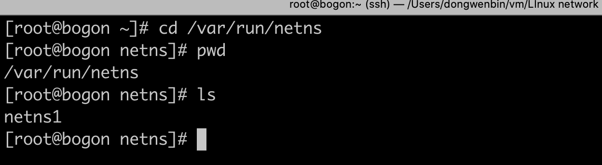
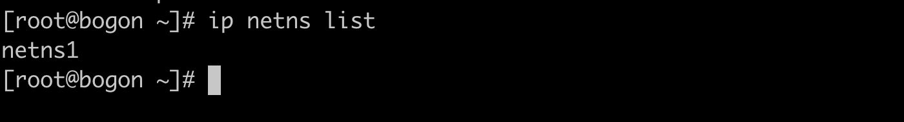
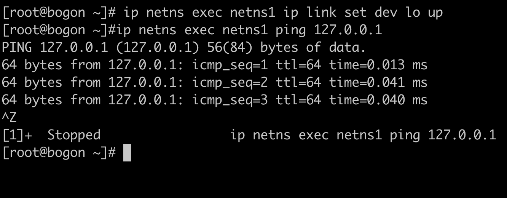

# Linux 网络基础

## Network Namespase

### 简单认识

Linux的namespace（名字空间）的作用就是“隔离内核资源”。在Linux的世界里，文件系统挂载点、主机名、POSIX进程间通信消息队列、进程PID数字空间、IP地址、userID数字空间等全局系统资源被namespace分割，装到一个个抽象的独立空间里。而隔离上述系统资源的namespace分别是Mount namespace、UTS namespace、IPC namespace、PID namespace、network namespace和user namespace。对进程来说，要想使用namespace里面的资源，首先要“进入”（具体操作方法，下文会介绍）到这个namespace，而且还无法跨namespace访问资源。

Linux的namespace给里面的进程造成了两个错觉：

（1）它是系统里唯一的进程。

（2）它独享系统的所有资源。

Docker容器作为一项轻量级的虚拟化技术，它的隔离能力来自Linux内核的namespace技术。

network namespace，它在Linux内核2.6版本引入，作用是隔离Linux系统的设备，以及IP地址、端口、路由表、防火墙规则等网络资源。因此，每个网络namespace里都有自己的网络设备（如IP地址、路由表、端口范围、/proc/net目录等）。


network namespace可以通过系统调用来创建，我们可以调用Linux的clone（）（其实是UNIX系统调用fork（）的延伸）API创建一个通用的namespace，然后传入CLONE_NEWNET参数表面创建一个network namespace。高阶读者可以参考下文的C代码创建一个network namespace。**与其他namespace需要读者自己写C语言代码调用系统API才能创建不同，network namespace的增删改查功能已经集成到Linux的ip工具的netns子命令中，因此大大降低了初学者的体验门槛。下面先介绍几条简单的网络namespace管理的命令。**

创建一个名为netns1的network namespace可以使用一下命令：

```
[root@bogon ~]# ip netns add netns1
```

当ip命令创建了一个network namespace时，系统会在/var/run/netns路径下面生成一个挂载点。挂载点的作用一方面是方便对namespace的管理，另一方面是使namespace即使没有进程运行也能继续存在。



一个networknamespace被创建出来后，可以使用ip netns exec命令进入，做一些网络查询/配置的工作。

```
ip netns exec netns1 ip link list
```


如上所示，就是进入netns1这个networknamespace查询网卡信息的命令。目前，我们没有任何配置，因此只有一块系统默认的本地回环设备lo。

想查看系统中有哪些network namespace，可以使用以下命令：

`ip netns list`



想删除networknamespace，可以通过以下命令实现：

`ip netns delete netns1`

这条命令实际上并没有删除netns1这个networknamespace，它只是移除了这个network namespace对应的挂载点（下文会解释）。只要里面还有进程运行着，networknamespace便会一直存在。

### 配置Network Namespase

当namespace里面的进程涉及网络通信时，namespace里面的（虚拟）网络设备就必不可少了。我们已经知道，一个全新的network namespace会附带创建一个本地回环地址。除此之外，没有任何其他的网络设备。而且，network namespace自带的lo设备状态还是DOWN的，因此，当尝试访问本地回环地址时，网络也是不通的。下面的小测试就说明了这一点。

`ip netns exec netns1 ping 127.0.0.1`


如果想访问本地回环地址，首先需要进入netns1这个network namespace，把设备状态设置成UP。

`ip netns exec netns1 ip link set dev lo up`

然后，尝试ping127.0.0.1，发现能够ping通。

`ip netns exec netns1 ping 127.0.0.1`



但是，仅有一个本地回环设备是没法与外界通信的。如果我们想与外界（比如主机上的网卡）进行通信，就需要在namespace里再创建一对虚拟的以太网卡，即所谓的veth pair。顾名思义，veth pair总是成对出现且相互连接，它就像Linux的双向管道（pipe），报文从veth pair一端进去就会由另一端收到。

下面的命令将创建一对虚拟以太网卡，然后把vethpair的一端放到netns1 network namespace。

```shell
ip link add veth0 type veth peer name veth1
ip link set veth1 netns netns1
```


我们创建了veth0和veth1这么一对虚拟以太网卡。在默认情况下，它们都在主机的根network namespce中，将其中一块虚拟网卡veth1通过ip link set命令移动到netns1 network namespace。那么，veth0和veth1之间能直接通信吗？还不能，因为这两块网卡刚创建出来还都是DOWN状态，如下所示：

`ip netns exec netns1 ip link list`


`ip link list`


需要手动把状态设置成UP。这个步骤的操作和上文对lo网卡的操作类似，只是多了一步绑定IP地址，如下所示：

```shell
ip netns exec netns1 ifconfig veth1 10.1.1.1/24 up
ifconfig veth0 10.1.1.2/24 up
```

上面两条命令首先进入netns1这个network namespace，为veth1绑定IP地址10.1.1.1/24，并把网卡的状态设置成UP，而仍在主机根network namespace中的网卡veth0被我们绑定了IP地址10.1.1.2/24。这样一来，我们就可以ping通veth pair的任意一头了。


进入netns1 network namespace去ping主机上的虚拟网卡，如下所示：

`ip netns exec netns1 ping 10.1.1.2`


另外，不同networknamespace之间的路由表和防火墙规则等也是隔离的，因此我们刚刚创建的netns1networknamespace没法和主机共享路由表和防火墙，这一点通过下面的测试就能说明。

`ip netns exec netns1 route`

`ip netns exec netns1 iptables -L`


我们进入netns1 network namespace，分别输入route和iptablesL命令，期望查询路由表和iptables规则，却发现空空如也。这意味着从netns1 network namespace发包到因特网也是徒劳的，因为网络还不通！不信读者可以自行尝试。想连接因特网，有若干解决方法。例如，可以在主机的根network namespace创建一个Linux网桥并绑定veth pair的一端到网桥上；也可以通过适当的NAT（网络地址转换）规则并辅以Linux的IP转发功能（配置net.ipv4.ip_forward=1）。

**用户可以随意将虚拟网络设备分配到自定义的network namespace里，而连接真实硬件的物理设备则只能放在系统的根network namesapce中。并且，任何一个网络设备最多只能存在于一个network namespace中。**

进程可以通过Linux系统调用clone（）、unshare（）和setns进入network namespace。非root进程被分配到network namespace后只能访问和配置已经存在于该network namespace的设备。当然，root进程可以在network namespace里创建新的网络设备。除此之外，network namespace里的root进程还能把本network namespace的虚拟网络设备分配到其他network namespace——这个操作路径可以从主机的根network namespace到用户自定义network namespace，反之亦可。看这条命令：

`ip netns exec netns1 ip link set veth1 netns 1`


原本在命名空间netns1中的veth1被分配到根namespace里面了。

该怎么理解上面这条看似有点复杂的命令呢？分解成两部分：

（1）ip netns exec netns1进入netns1 network namespace。

（2）ip link set veth1 netns 1把netns1 network namespace下的veth1网卡挪到PID为1的进程（即init进程）所在的networknamespace。

通常，init进程都在主机的根network namespace下运行，因此上面这条命令其实就是把veth1从netns1 network namespace移动到系统根network namespace。有两种途径索引network namespace：名字（例如netns1）或者属于该namespace的进程PID。上面用的是后者。

对namespace的root用户而言，他们都可以把其namespace里的虚拟网络设备移动到其他networknamespace，甚至包括主机根networknamespace！这就带来了潜在的安全风险。如果用户希望屏蔽这一行为，则需要结合PIDnamespace和Mountnamespace的隔离特性做到networknamespace之间的完全不可达。

### 小结

通过Linux的network namespace技术可以自定义一个独立的网络栈，简单到只有loopback设备，复杂到具备系统完整的网络能力，这就使得network namespace成为Linux网络虚拟化技术的基石——不论是虚拟机还是容器时代。network namespace的另一个隔离功能在于，系统管理员一旦禁用namespace中的网络设备，即使里面的进程拿到了一些系统特权，也无法和外界通信。最后，网络对安全较为敏感，即使network namespace能够提供网络资源隔离的机制，用户还是会结合其他类型的namespace一起使用，以提供更好的安全隔离能力。


杜军. Kubernetes网络权威指南：基础、原理与实践 (Chinese Edition) (Kindle 位置 276-278). Kindle 版本. 

## veth pair

部署过Docker或Kubernetes的读者肯定有这样的经历：在主机上输入ifconfig或ipaddr命令查询网卡信息的时候，总会出来一大堆vethxxxx之类的网卡名，这些是Docker/Kubernetes为容器而创建的虚拟网卡。

veth是虚拟以太网卡（VirtualEthernet）的缩写。veth设备总是成对的，因此我们称之为vethpair。vethpair一端发送的数据会在另外一端接收，非常像Linux的双向管道。根据这一特性，vethpair常被用于跨networknamespace之间的通信，即分别将vethpair的两端放在不同的namespace里，如图。


仅有veth pair设备，容器是无法访问外部网络的。为什么呢？因为从容器发出的数据包，实际上是直接进了veth pair设备的协议栈。如果容器需要访问网络，则需要使用网桥等技术将veth pair设备接收的数据包通过某种方式转发出去。

### 创建和使用

创建veth pair,名字分别是veth0和veth1，因为前面创建过相同名字需要先删除：`ip link del veth0`。

`ip link add veth0 type veth peer name veth1`


创建的veth pair在主机上表现为两块网卡，我们也可以通过`ip link list`命令查看：


如上所示，新创建的vethpair设备的默认mtu是1500，设备初始状态是DOWN。我们同样可以使用iplink命令将这两块网卡的状态设置为UP。

```
ip link set dev veth0 up
ip link set dev veth1 up
```


从上图可以看到设备还没有IP地址，可以使用下面命令配置IP地址：

`ifconfig veth0 10.20.30.40/24`


可以将vethpair设备放到namespace中。让我们来温习命令的使用：

`ip link set veth1 netns netns1`


veth1虚拟设备已经到了netns1命名空间下来了。 我们在通过命令`ip a`查看一下跟命名空间下的veth1是否已经不在了。


上图可以看到跟命名空间下已经没有veth1这个虚拟网卡了。

veth pair设备的原理较简单，就是向veth pair设备的一端输入数据，数据通过内核协议栈后从veth pair的另一端出来。veth pair的基本工作原理如图所示。


## bridge

两个network namespace可以通过veth pair连接，但要做到两个以上network namespace相互连接，veth pair就显得捉襟见肘了。这就需要用到Linux bridge了。

我们在计算机网络课本上学的网桥正如其字面含义所描述的，有“牵线搭桥”之意，用于连接两个不同的局域网，是网线的延伸。网桥是二层网络设备，两个端口分别有一条独立的交换信道，不共享一条背板总线，可隔离冲突域。网桥比集线器（hub）性能更好，集线器上各端口都是共享同一条背板总线的。后来，网桥被具有更多端口、可隔离冲突域的交换机（switch）所取代。

Linux bridge就是Linux系统中的网桥，但是**Linux bridge的行为更像是一台虚拟的网络交换机，任意的真实物理设备（例如eth0）和虚拟设备（例如，前面讲到的veth pair和后面即将介绍的tap设备）都可以连接到Linuxbridge上。**需要注意的是，Linuxbridge不能跨机连接网络设备。

Linux bridge与Linux上其他网络设备的区别在于，普通的网络设备只有两端，从一端进来的数据会从另一端出去。例如，物理网卡从外面网络中收到的数据会转发给内核协议栈，而从协议栈过来的数据会转发到外面的物理网络中。Linux bridge则有多个端口，数据可以从任何端口进来，进来之后从哪个口出去取决于目的MAC地址，原理和物理交换机差不多。

### 配置bridge

用iproute2软件包里的ip命令创建一个bridge：

`ip link add name br0 type bridge`

`ip link set br0 up`

除了ip命令，我们还可以使用bridgeutils软件包里的brctl工具管理网桥，例如新建一个网桥：

`brctl addbr br0`

刚创建一个bridge时，它是一个独立的网络设备，只有一个端口连着协议栈，其他端口什么都没连接，这样的bridge其实没有任何实际功能，如图所示。


创建好的br0如下图：


启动网卡eth0的混杂模式：

`ifconfig eth0 promisc`


为了充分发挥Linux bridge的作用，我们特将它和前文介绍的veth pair配合起来使用。我们将创建一对veth设备，并配置IP地址：

```shell
[root@bogon ~]# ip link add veth0 type veth peer name veth1
[root@bogon ~]# ip addr add 192.168.1.101/24 dev veth0
[root@bogon ~]# ip addr add 192.168.1.102/24 dev veth1
[root@bogon ~]# ip link set veth0 up
[root@bogon ~]# ip link set veth1 up
```


然后，通过下面的命令将veth0连接到br0上：

`ip link set dev veth0 master br0`


成功对接后，可以通过`bridge link`（bridge也是iproute2的组成部分）命令查看当前网桥上都有哪些网络设备：


执行完以上命令后，连接vethpair的bridge设备的网络拓扑如图所示。


br0和veth0相连之后发生了如下变化：

- br0和veth0之间连接起来了，并且是双向的通道；
- 协议栈和veth0之间变成了单通道，协议栈能发数据给veth0，但veth0从外面收到的数据不会转发给协议栈；
- br0的MAC地址变成了veth0的MAC地址。

这就好比Linux bridge在veth0和协议栈之间做了一次拦截，在veth0上面做了点小动作，将veth0本来要转发给协议栈的数据拦截，全部转发给bridge。同时，bridge也可以向veth0发数据。

把veth0的IP地址“让给”Linux bridge：

`ip add del 1.2.3.101/24 dev veth0`

`ip addr add 1.2.3.101/24 dev br0`


以上命令将原本分配给veth0的IP地址配置到br0上。于是，绑定IP地址的bridge设备的网络拓扑如图所示。


将协议栈和veth0之间的联系去掉了，veth0相当于一根网线。实际上，veth0和协议栈之间是有联系的，但由于veth0没有配置IP，所以协议栈在路由的时候不会将数据包发给veth0。就算强制要求数据包通过veth0发送出去，由于veth0从另一端收到的数据包只会给br0，协议栈还是没法收到相应的ARP应答包，同样会导致通信失败。

### 应用

#### 虚拟机

虚拟机通过tun/tap或者其他类似的虚拟网络设备，将虚拟机内的网卡同br0连接起来，这样就达到和真实交换机一样的效果，虚拟机发出去的数据包先到达br0，然后由br0交给eth0发送出去，数据包都不需要经过host机器的协议栈，效率高，如图18所示。如果有多个虚拟机，那么这些虚拟机通过tun/tap设备连接到网桥。tun/tap设备的详细介绍将在1.4节展开。


#### 容器

容器运行在自己单独的network namespace里，因此都有自己单独的协议栈。Linux bridge在容器场景的组网和上面的虚拟机场景差不多，但也存在一些区别。例如，容器使用的是veth pair设备，而虚拟机使用的是tun/tap设备。在虚拟机场景下，我们给主机物理网卡eth0分配了IP地址；而在容器场景下，我们一般不会对宿主机eth0进行配置。在虚拟机场景下，虚拟器一般会和主机在同一个网段；而在容器场景下，容器和物理网络不在同一个网段内。Linux bridge在容器中的应用如图19所示。


在容器中配置其网关地址为br0，在我们的例子中即1.2.3.101（容器网络网段是1.2.3.0/24）。因此，从容器发出去的数据包先到达br0，然后交给host机器的协议栈。由于目的IP是外网IP，且host机器开启了IPforward功能，数据包会通过eth0发送出去。因为容器所分配的网段一般都不在物理网络网段内（在我们的例子中，物理网络网段是10.20.30.0/24），所以一般发出去之前会先做NAT转换（NAT转换需要自己配置，可以使用iptables，下面介绍iptables）。

### 网络接口的混杂模式

混杂模式（Promiscuousmode），简称Promiscmode，俗称“监听模式”。混杂模式通常被网络管理员用来诊断网络问题，但也会被无认证的、想偷听网络通信的人利用。根据维基百科的定义，混杂模式是指一个网卡会把它接收的所有网络流量都交给CPU，而不是只把它想转交的部分交给CPU。在IEEE802定的网络规范中，每个网络帧都有一个目的MAC地址。在非混杂模式下，网卡只会接收目的MAC地址是它自己的单播帧，以及多播及广播帧；**在混杂模式下，网卡会接收经过它的所有帧**！我们可以使用ifconfig或者netstati命令查看一个网卡是否开启了混杂模式。

我们可以使用`ifconfig`或者`netstat -i`命令查看一个网卡是否开启了混杂模式。


`ifconfig eth0`，查看eth0的配置，包括混杂模式。当输出包含PROMISC时，表明该网络接口处于混杂模式。


启用网卡的混杂模式，可以使用下面这条命令：

`ifconfig eth0 promisc`


使网卡退出混杂模式，可以使用下面这条命令：

`ifconfig eth0 -promisc`


veth设备加入Linux bridge后，可以通过查看内核日志看到veth0自动进入混杂模式，而且无法退出，直到将veth0从Linux bridge中移除。


## Iptables

iptables在Docker和Kubernetes网络中应用甚广。例如，Docker容器和宿主机的端口映射、Kubernetes Service的默认模式、CNI的port map插件、Kubernetes网络策略等都是通过iptables实现的。

### Netfilter

iptables的底层实现是netfilter。netfilter是Linux内核2.4版引入的一个子系统。它作为一个通用的、抽象的框架，提供一整套hook函数的管理机制，使得数据包过滤、包处理（设置标志位、修改TTL等）、地址伪装、网络地址转换、透明代理、访问控制、基于协议类型的连接跟踪，甚至带宽限速等功能成为可能。netfilter的架构就是在整个网络流程的若干位置放置一些钩子，并在每个钩子上挂载一些处理函数进行处理。

IP层的5个钩子点的位置，对应iptables就是5条内置链，分别是PREROUTING、POSTROUTING、INPUT、OUTPUT和FORWARD。如下图：


当网卡上收到一个包送达协议栈时，最先经过的netfilter钩子是PREROUTING，如果确实有用户埋了这个钩子函数，那么内核将在这里对数据包进行目的地址转换（DNAT）。不管在PREROUTING有没有做过DNAT，内核都会通过查本地路由表决定这个数据包是发送给本地进程还是发送给其他机器。如果是发送给其他机器（或其他networknamespace），就相当于把本地当作路由器，就会经过netfilter的FORWARD钩子，用户可以在此处设置包过滤钩子函数，例如iptables的reject函数。**所有马上要发到协议栈外的包都会经过POSTROUTING钩子，用户可以在这里埋下源地址转换（SNAT）或源地址伪装（Masquerade，简称Masq）的钩子函数。**如果经过上面的路由决策，内核决定把包发给本地进程，就会经过INPUT钩子。本地进程收到数据包后，回程报文会先经过OUTPUT钩子，然后经过一次路由决策（例如，决定从机器的哪块网卡出去，下一跳地址是多少等），最后出协议栈的网络包同样会经过POSTROUTING钩子。

### iptables

iptables是用户空间的一个程序，通过netlink和内核的netfilter框架打交道，负责往钩子上配置回调函数。一般情况下用于构建Linux内核防火墙，特殊情况下也做服务负载均衡（这是Kubernetes的特色操作）。


我们常说的iptables5X5，即5张表（table）和5条链（chain）。5条链即iptables的5条内置链，对应上文介绍的netfilter的5个钩子。这5条链分别是：

- **INPUT链**：一般用于处理输入本地进程的数据包；
- **OUTPUT链**：一般用于处理本地进程的输出数据包；
- **FORWARD链**：一般用于处理转发到其他机器/network namespace的数据包；
- **PREROUTING链**：可以在此处进行**DNAT**(后面会解释)；
- **POSTROUTING链**：可以在此处进行**SNAT**（后面会解释）。

除了系统预定义的5条iptables链，用户还可以在表中定义自己的链。

5张表如下所示：

- **filter表**：用于控制到达某条链上的数据包是继续放行、直接丢弃（drop）或拒绝（reject）；
- **nat表**：用于修改数据包的源和目的地址；
- **mangle表**：用于修改数据包的IP头信息；.
- **raw表**：iptables是有状态的，即iptables对数据包有连接追踪（connectiontracking）机制，而raw是用来去除这种追踪机制的；
- **security表**：最不常用的表（通常，我们说iptables只有4张表，security表是新加入的特性），用于在数据包上应用SELinux。

这5张表的优先级从高到低是：raw、mangle、nat、filter、security。需要注意的是，iptables不支持用户自定义表。

不是每个链上都能挂表，iptables表与链的对应关系如图所示。


那么一个网络包经过iptables的处理路径如图所示：


iptables的表是来分类管理iptables规则（rule）的，系统所有的iptables规则都被划分到不同的表集合中。

iptables的规则就是挂在netfilter钩子上的函数，用来修改数据包的内容或过滤数据包，iptables的表就是所有规则的5个逻辑集合！


一条iptables规则包含两部分信息：匹配条件和动作。匹配条件很好理解，即匹配数据包被这条iptables规则“捕获”的条件，例如协议类型、源IP、目的IP、源端口、目的端口、连接状态等。每条iptables规则允许多个匹配条件任意组合，从而实现多条件的匹配，多条件之间是逻辑与（&&）关系。

数据包匹配后，常见的动作有下面几个：

- **DROP**：直接将数据包丢弃，不再进行后续的处理。应用场景是不让某个数据源意识到你的系统的存在，可以用来模拟宕机；
- **REJECT**：给客户端返回一个connectionrefused或destinationunreachable报文。应用场景是不让某个数据源访问你的系统，善意地告诉他：我这里没有你要的服务内容；
- **QUEUE**：将数据包放入用户空间的队列，供用户空间的程序处理；
- **RETURN**：跳出当前链，该链里后续的规则不再执行；
- **ACCEPT**：同意数据包通过，继续执行后续的规则；
- **JUMP**：跳转到其他用户自定义的链继续执行。

用户自定义链中的规则和系统预定义的5条链里的规则没有区别。由于自定义的链没有与netfilter里的钩子进行绑定，所以它不会自动触发，只能从其他链的规则中跳转过来，这也是JUMP动作存在的意义。

### NAT

NAT的全名是Network Address Translation,即网络地址转换。TCP/IP的网络数据包不是由IP地址吗？IP地址不是由来源与目的地吗？iptables命令就能修改IP数据报到报文头数据，目标或来源的IP地址和port都能修改。

假设有数据包需要通过Linux主机传送出去，步骤如下：

1. 先经过NAT table的PREROUTING链。
2. 经由路由判断确定这个数据包是否要进入本机，若不进入，则下一步。
3. 再经过Filter table的FORWARD链。
4. 通过NAT table的POSTROUTING链，最后传送出去。

NAT服务器的重点就在于上面的第1、4步，也就是NAT table的两条重要的链：**PREROUTING与POSTROUTING**。

两条链不同的作用：

**PREROUTING**：修改的是目标IP（Destination NAT, DNAT）

**POSTROUTING**：修改的是来源IP（Source NAT, SNAT）