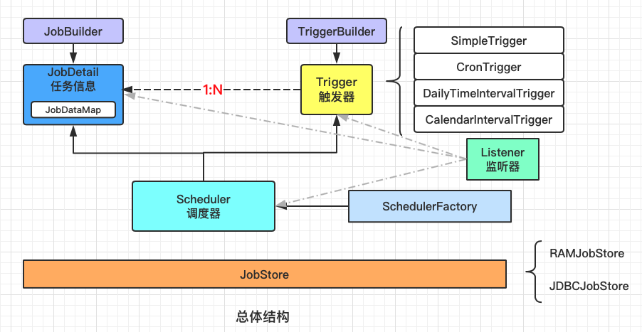
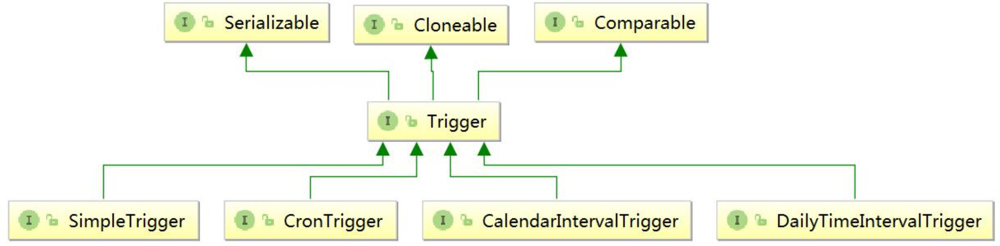
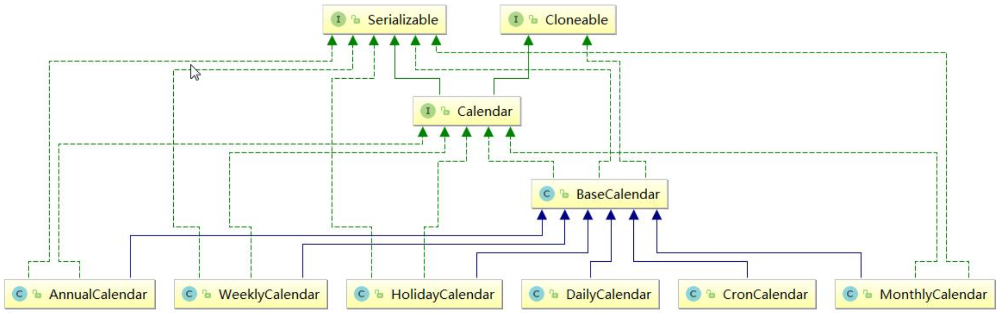
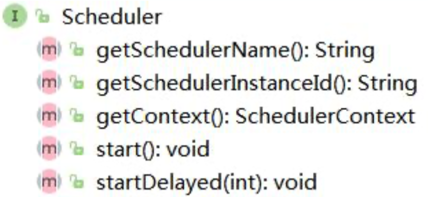
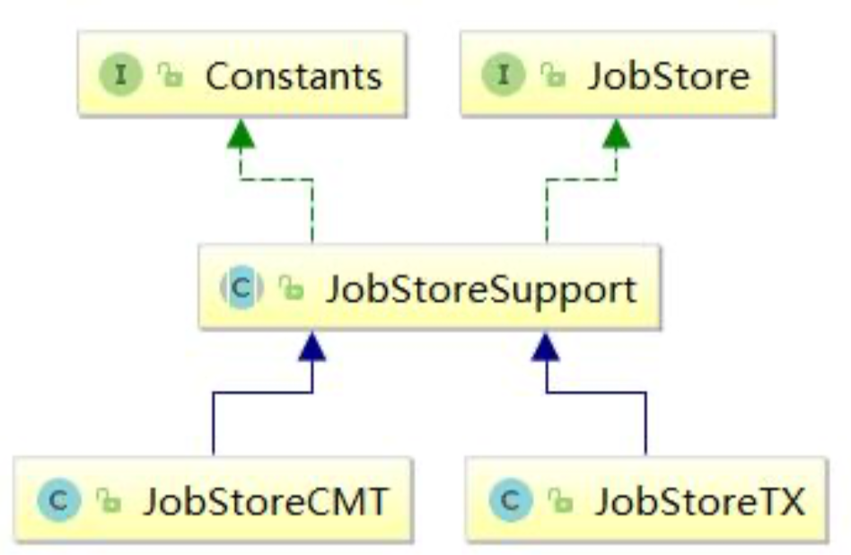

# Quarzt

## 漫谈任务调度

### 什么时候需要任务调度?

#### 任务调度的背景

 在业务系统中有很多这样的场景:

1. 账单日或者还款日上午 10 点，给每个信用卡客户发送账单通知，还款通知。如 何判断客户的账单日、还款日，完成通知的发送?
2. 银行业务系统，夜间要完成跑批的一系列流程，清理数据，下载文件，解析文件， 对账清算、切换结算日期等等。如何触发一系列流程的执行?
3. 金融机构跟人民银行二代支付系统对接，人民银行要求低于 5W 的金额(小额支付)半个小时打一次包发送，以缓解并发压力。所以，银行的跨行转账分成了多个流程: 录入、复核、发送。如何把半个小时以内的所有数据一次性发送?

类似于这种 

1. 基于准确的时刻或者固定的时间间隔触发的任务。
2. 有批量数据需要处理。
3. 要实现两个动作解耦的场景，我们都可以用任务调度来实现。

### 任务调度需求分

任务调度的实现方式有很多，如果要实现我们的调度需求，我们对这个工具有什么样的基本要求呢?

#### 基本需求

1. 可以定义触发的规则，比如基于时刻、时间间隔、表达式。
2. 可以定义需要执行的任务。比如执行一个脚本或者一段代码。任务和规则是分开的。
3. 集中管理配置，持久配置。不用把规则写在代码里面，可以看到所有的任务配置，方便维护。重启之后任务可以再次调度——配置文件或者配置中心。
4. 支持任务的串行执行，例如执行 A 任务后再执行 B 任务再执行 C 任务。
5. 支持多个任务并发执行，互不干扰(例如 ScheduledThreadPoolExecutor)。
6. 有自己的调度器，可以启动、中断、停止任务。
7. 容易集成到 Spring。

### 任务调度工具对比

| 层次       | 举例                                | 特点                                                         |
| ---------- | ----------------------------------- | ------------------------------------------------------------ |
| 操作系统   | Linux crontab <br/>Windows 计划任务 | 只能执行简单脚本或者命令                                     |
| 数据库     | MySQL、Oracle                       | 可以操作数据。不能执行 Java 代码                             |
| 工具       | Kettle                              | 可以操作数据，执行脚本。没有集中配置                         |
| 开发语言   | JDK Timer、ScheduledThreadPool      | Timer:单线程<br/>JDK1.5 之后:ScheduledThreadPool(Cache、Fiexed、 Single):没有集中配置，日程管理不够灵活 |
| 容器       | Spring Task、@Scheduled             | 不支持集群                                                   |
| 分布式框架 | XXL-JOB，Elastic-Job                |                                                              |

**@Scheduled也是用JUC的ScheduledExecutorService实现的`Scheduled(cron = “0 15 10 15 * ?”)`**

1. ScheduledAnnotationBeanPostProcessor 的 postProcessAfterInitialization 方法将@Scheduled 的方法包装为指定的 task 添加到 ScheduledTaskRegistrar 中
2. ScheduledAnnotationBeanPostProcessor 会监听 Spring 的容器初始化事件，在 Spring 容器初始化完成后进行 TaskScheduler 实现类实例的查找，若发现有 SchedulingConfigurer 的实现类实例，则跳过 3
3. 查找 TaskScheduler 的实现类实例默认是通过类型查找，若有多个实现则会查找名字为"taskScheduler"的实现 Bean， 若没有找到则在 ScheduledTaskRegistrar 调度任务的时候会创建一个 newSingleThreadScheduledExecutor，将 TaskScheduler 的实现类实例设置到 ScheduledTaskRegistrar 属性中
4. ScheduledTaskRegistrar 的 scheduleTasks 方法触发任务调度
5. 真正调度任务的类是 TaskScheduler 实现类中的 ScheduledExecutorService，由 J.U.C 提供

## Quartz基本介绍

官网:http://www.quartz-scheduler.org/ 

Quartz 的意思是石英，像石英表一样精确。

Quatz 是一个特性丰富的，开源的任务调度库，它几乎可以嵌入所有的 Java 程序，从很小的独立应用程序到大型商业系统。Quartz 可以用来创建成百上千的简单的或者复杂的任务，这些任务可以用来执行任何程序可以做的事情。 Quartz 拥有很多企业级的特性，包括支持 JTA 事务和集群。

Quartz 是一个老牌的任务调度系统，98 年构思，01 年发布到 sourceforge。现在更新比较慢，因为已经非常成熟了。

https://github.com/quartz-scheduler/quartz

Quartz 的目的就是让任务调度更加简单，开发人员只需要关注业务即可。他是用 Java 语言编写的(也有.NET 的版本)。Java 代码能做的任何事情，Quartz 都可以调度。

特点:

- 精确到毫秒级别的调度
- 可以独立运行，也可以集成到容器中
- 支持事务(JobStoreCMT )
- 支持集群
- 支持持久化

## Quartz Java 编程

http://www.quartz-scheduler.org/documentation/quartz-2.3.0/

http://www.quartz-scheduler.org/documentation/quartz-2.3.0/quick-start.html

### 引入依赖

```xml
<dependency>
   <groupId>org.quartz-scheduler</groupId>
   <artifactId>quartz</artifactId>
   <version>2.3.0</version>
</dependency>
```

### 默认配置文件

org.quartz 包下的/org/quartz/quartz.properties，是默认的配置文件，当我们没有 定义一个同名的配置文件的时候，就会使用默认配置文件里面的配置。

```properties
# Default Properties file for use by StdSchedulerFactory
# to create a Quartz Scheduler Instance, if a different
# properties file is not explicitly specified.
#

org.quartz.scheduler.instanceName: DefaultQuartzScheduler
org.quartz.scheduler.rmi.export: false
org.quartz.scheduler.rmi.proxy: false
org.quartz.scheduler.wrapJobExecutionInUserTransaction: false

org.quartz.threadPool.class: org.quartz.simpl.SimpleThreadPool
org.quartz.threadPool.threadCount: 10
org.quartz.threadPool.threadPriority: 5
org.quartz.threadPool.threadsInheritContextClassLoaderOfInitializingThread: true

org.quartz.jobStore.misfireThreshold: 60000

org.quartz.jobStore.class: org.quartz.simpl.RAMJobStore

```

### 创建Job

实现唯一的方法 execute()，方法中的代码就是任务执行的内容。

```java
public class MyJob1 implements Job {

	public void execute(JobExecutionContext context) throws JobExecutionException {
		Date date = new Date();
        SimpleDateFormat sf = new SimpleDateFormat("yyyy-MM-dd HH:mm:ss");

		JobDataMap dataMap = context.getJobDetail().getJobDataMap();
		System.out.println( " " + sf.format(date) + " 任务1执行了，" + dataMap.getString("gupao"));
		
	}

}
```

在测试类 main()方法中，把 Job 进一步包装成 JobDetail。

必须要指定 JobName 和 groupName，两个合起来是唯一标识符。

可以携带 KV 的数据(JobDataMap)，用于扩展属性，在运行的时候可以从 context获取到。

```java
// JobDetail
JobDetail jobDetail = JobBuilder.newJob(MyJob1.class)
      .withIdentity("job1", "group1")
      .usingJobData("gupao","只为更好的你")
      .usingJobData("moon",5.21F)
      .build();
```

### 创建Trigger

在测试类 main()方法中，基于 SimpleTrigger 定义了一个每 2 秒钟运行一次、不断重复的 Trigger:

```java
// Trigger
Trigger trigger = TriggerBuilder.newTrigger()
      .withIdentity("trigger1", "group1")
      .startNow()
      .withSchedule(SimpleScheduleBuilder.simpleSchedule()
            .withIntervalInSeconds(2)
            .repeatForever())
      .build();
```

### 创建Scheduler

在测试类 main()方法中，通过 Factory 获取调度器的实例，把 JobDetail 和 Trigger 绑定，注册到容器中。

Scheduler 先启动后启动无所谓，只要有 Trigger 到达触发条件，就会执行任务。

```java
// SchedulerFactory
SchedulerFactory  factory = new StdSchedulerFactory();

// Scheduler
Scheduler scheduler = factory.getScheduler();

// 绑定关系是1：N
scheduler.scheduleJob(jobDetail, trigger);
scheduler.start();
```

注意这里，调度器一定是单例的。

### 体系结构总结



#### JobDetail

我们创建一个实现 Job 接口的类，使用 JobBuilder 包装成 JobDetail，它可以携带 KV 的数据。

#### Trigger

定义任务的触发规律，Trigger，使用 TriggerBuilder 来构建。 

JobDetail 跟 Trigger 是 1:N 的关系。

Trigger 接口在 Quartz 有 4 个继承的子接口:

| 子接口                   | 描述                     | 特点                                                         |
| ------------------------ | ------------------------ | ------------------------------------------------------------ |
| SimpleTrigger            | 简单触发器               | 固定时刻或时间间隔，毫秒。                                   |
| CalendarIntervalTrigger  | 基于日历的触发器         | 比简单触发器更多时间单位，支持非固定时间的触发，例如一年可能 365/366，一个月可能 28/29/30/31 |
| DailyTimeIntervalTrigger | 基于日期的触发器         | 每天的某个时间段                                             |
| CronTrigger              | 基于 Cron 表达式的触发器 | 更灵活。                                                     |

MutableTrigger 和 CoreTrigger 最终也是用到以上四个类的实现类。



```java
public static void main(String[] args) {

    /**
     * CalendarIntervalTrigger
     */
    Trigger calendarIntervalTrigger = TriggerBuilder.newTrigger()
            .withIdentity("trigger1", "group1")
            .startNow()
            .withSchedule(CalendarIntervalScheduleBuilder.calendarIntervalSchedule()
                    .withIntervalInDays(1)) // 每天执行一次
            .build();


    /**
     * DailyTimeIntervalTrigger
     */
    Trigger dailyTimeIntervalTrigger = TriggerBuilder.newTrigger()
            .withIdentity("trigger1", "group1")
            .startNow()
            .withSchedule(DailyTimeIntervalScheduleBuilder.dailyTimeIntervalSchedule()
                    .startingDailyAt(TimeOfDay.hourAndMinuteOfDay(9, 0)) //第天9：00开始
                    .endingDailyAt(TimeOfDay.hourAndMinuteOfDay(16, 0)) //16：00 结束
                    .onDaysOfTheWeek(1,2,3,4,5) //周一至周五执行
                    .withIntervalInHours(1) //每间隔1小时执行一次
                    .withRepeatCount(100))//最多重复100次（实际执行100+1次）
                    .build();

}
```

##### SimpleTrigger

SimpleTrigger 可以定义固定时刻或者固定时间间隔的调度规则(精确到毫秒)。

例如:每天 9 点钟运行，每隔 30 分钟运行一次。

##### CalendarIntervalTrigger

CalendarIntervalTrigger 可以定义更多时间单位的调度需求，精确到秒。

好处是不需要去计算时间间隔，比如 1 个小时等于多少毫秒。

例如：每年、每个月、每周、每天、每小时、每分钟、每秒。

每年的月数和每个月的天数不是固定的，这种情况也适用。

##### DailyTimeIntervalTrigger

每天的某个时间段内，以一定的时间间隔执行任务。

例如:每天早上 9 点到晚上 9 点，每隔半个小时执行一次，并且只在周一到周六执行。

##### CronTrigger

CronTirgger 可以定义基于 Cron 表达式的调度规则，是最常用的触发器类型。

###### Cron 表达式

| 位置 | 时间域       | 取值域 | 特殊值   |
| ---- | ------------ | ------ | -------- |
| 1    | 秒           | 0-59   | ,-*/     |
| 2    | 分钟         | 0-59   | ,-*/     |
| 3    | 小时         | 0-23   | ,-*/     |
| 4    | 日期         | 1-31   | ,-*?/LWC |
| 5    | 月份         | 1-12   | ,-*/     |
| 6    | 星期         | 1-7    | ,-*?/LWC |
| 7    | 年份（可选） | 1-31   | ,-*/     |

星号(*):可用在所有字段中，表示对应时间域的每一个时刻，例如，在分钟字段时，表示“每分钟”;

问号(?):该字符只在日期和星期字段中使用，它通常指定为“无意义的值”，相当于点位符;

减号(-):表达一个范围，如在小时字段中使用“10-12”，则表示从 10 到 12 点，即 10,11,12;

逗号(,):表达一个列表值，如在星期字段中使用“MON,WED,FRI”，则表示星期一，星期三和星期五;

斜杠(/):x/y 表达一个等步长序列，x 为起始值，y 为增量步长值。如在分钟字段中使用 0/15，则表示为 0,15,30 和45 秒，而 5/15 在分钟字段中表示 5,20,35,50，你也可以使用*/y，它等同于 0/y;


L:该字符只在日期和星期字段中使用，代表“Last”的意思，但它在两个字段中意思不同。L 在日期字段中，表示这个月份的最后一天，如一月的 31 号，非闰年二月的 28 号;如果 L 用在星期中，则表示星期六，等同于 7。但是，如果 L 出现在星期字段里，而且在前面有一个数值 X，则表示“这个月的最后 X 天”，例如，6L 表示该月的最后星期五;

W:该字符只能出现在日期字段里，是对前导日期的修饰，表示离该日期最近的工作日。例如 15W 表示离该月 15 号最近的工作日，如果该月 15 号是星期六，则匹配 14 号星期五;如果 15 日是星期日，则匹配 16 号星期一;如果 15 号是星期二，那结果就是 15 号星期二。但必须注意关联的匹配日期不能够跨月，如你指定 1W，如果 1 号是星期六， 结果匹配的是 3 号星期一，而非上个月最后的那天。W 字符串只能指定单一日期，而不能指定日期范围;

LW 组合:在日期字段可以组合使用 LW，它的意思是当月的最后一个工作日;

井号(#):该字符只能在星期字段中使用，表示当月某个工作日。如 6#3 表示当月的第三个星期五(6 表示星期五， #3 表示当前的第三个)，而 4#5 表示当月的第五个星期三，假设当月没有第五个星期三，忽略不触发;


C:该字符只在日期和星期字段中使用，代表“Calendar”的意思。它的意思是计划所关联的日期，如果日期没有 被关联，则相当于日历中所有日期。例如 5C 在日期字段中就相当于日历 5 日以后的第一天。1C 在星期字段中相当于星期日后的第一天。

Cron 表达式对特殊字符的大小写不敏感，对代表星期的缩写英文大小写也不敏感。

##### 基于 Calendar 的排除规则

如果要在触发器的基础上，排除一些时间区间不执行任务，就要用到 Quartz 的 Calendar 类(注意不是 JDK 的 Calendar)。可以按年、月、周、日、特定日期、Cron 表达式排除。



调用 Trigger 的 modifiedByCalendar()添加到触发器中，并且调用调度器的 addCalendar()方法注册排除规则。

```java
public static void main(String[] args) throws Exception {
    SchedulerFactory sf = new StdSchedulerFactory();
    Scheduler scheduler = sf.getScheduler();
    scheduler.start();

    // 定义日历
    AnnualCalendar holidays = new AnnualCalendar();

    // 排除中秋节
    Calendar midAutumn = new GregorianCalendar(2019, 9, 13);
    holidays.setDayExcluded(midAutumn, true);
    // 排除圣诞节
    Calendar christmas = new GregorianCalendar(2019, 12, 25);
    holidays.setDayExcluded(christmas, true);

    // 调度器添加日历
    scheduler.addCalendar("holidays", holidays, false, false);

    JobDetail jobDetail = JobBuilder.newJob(MyJob1.class)
            .withIdentity("job1", "group1")
            .usingJobData("wenbin","2673")
            .build();

    Trigger trigger = TriggerBuilder.newTrigger()
            .withIdentity("trigger1", "group1")
            .startNow()
            .modifiedByCalendar("holidays")
            .withSchedule(SimpleScheduleBuilder.simpleSchedule()
                    .withIntervalInSeconds(2)
                    .repeatForever())
            .build();

    Date firstRunTime = scheduler.scheduleJob(jobDetail, trigger);
    System.out.println(jobDetail.getKey() + " 第一次触发： " + firstRunTime);
}
```

| Calendar名称    | 用法                                                         |
| --------------- | ------------------------------------------------------------ |
| BaseCalendar    | 为高级的 Calendar 实现了基本的功能，实现了 org.quartz.Calendar 接口 |
| AnnualCalendar  | 排除年中一天或多天                                           |
| CronCalendar    | 日历的这种实现排除了由给定的 CronExpression 表达的时间集合。 例如， 您可以使用此日历使用表达式“* * 0-7,18-23?* *”每天排除所有营业时间(上午 8 点至下午 5 点)。 如果 CronTrigger 具有给定的 cron 表达式并且与具有相同表达式的 CronCalendar 相关联，则日历将排除触发器包含的所有时间，并且它们将彼此抵消。 |
| HolidayCalendar | 特别的用于从 Trigger 中排除节假日                            |
| MonthlyCalendar | 排除月份中的指定数天，例如，可用于排除每月的最后一天         |
| WeeklyCalendar  | 排除星期中的任意周几，例如，可用于排除周末，默认周六和周日   |
| DailyCalendar   | 您可以使用此日历来排除营业时间(上午 8 点 - 5 点)每天。 每个 DailyCalendar 仅允许指定单个时间范围，并且该时间范围可能不会跨越每日边界(即，您不能指定从上午 8 点至凌晨 5 点的时间范围)。 如果属性 invertTimeRange 为 false(默认)，则时间范围定义触发器不允许触发的时间范围。 如果 invertTimeRange 为 true，则时间范围被反转 - 也就是排除在定义的时间范围之外的所有时间。 |

#### Scheduler

调度器，是 Quartz 的指挥官，由 StdSchedulerFactory 产生。它是单例的。

并且是 Quartz 中最重要的 API，默认是实现类是 StdScheduler，里面包含了一个 QuartzScheduler。QuartzScheduler 里面又包含了一个 QuartzSchedulerThread。



Scheduler 中的方法主要分为三大类:

1. 操作调度器本身，例如调度器的启动 start()、调度器的关闭 shutdown()。
2. 操作 Trigger，例如 pauseTriggers()、resumeTrigger()。
3. 操作 Job，例如 scheduleJob()、unscheduleJob()、rescheduleJob()

这些方法非常重要，可以实现任务的动态调度。

#### Listener

我们有这么一种需求，在每个任务运行结束之后发送通知给运维管理员。那是不是要在每个任务的最后添加一行代码呢?这种方式对原来的代码造成了入侵，不利于维护。 如果代码不是写在任务代码的最后一行，怎么知道任务执行完了呢?或者说，怎么监测到任务的生命周期呢?

观察者模式:定义对象间一种一对多的依赖关系，使得每当一个对象改变状态，则所有依赖它的对象都会得到通知并自动更新。

Quartz 中提供了三种 Listener，监听 Scheduler 的，监听 Trigger 的，监听 Job 的。

只需要创建类实现相应的接口，并在 Scheduler 上注册 Listener，便可实现对核心对象的监听。

##### JobListener

```java
public class MyJobListener implements JobListener {

    public String getName() {
        String name = getClass().getSimpleName();
        System.out.println( "Method 111111 :"+ "获取到监听器名称："+name);
        return name;
    }

    public void jobToBeExecuted(JobExecutionContext context) {
        String jobName = context.getJobDetail().getKey().getName();
        System.out.println("Method 222222 :"+ jobName + " ——任务即将执行 ");
    }

    public void jobExecutionVetoed(JobExecutionContext context) {
        String jobName = context.getJobDetail().getKey().getName();
        System.out.println("Method 333333 :"+ jobName + " ——任务被否决 ");
    }

    public void jobWasExecuted(JobExecutionContext context, JobExecutionException jobException) {
        String jobName = context.getJobDetail().getKey().getName();
        System.out.println("Method 444444 :"+ jobName + " ——执行完毕 ");
        System.out.println("------------------");
    }
}

```

四个方法:

| 方法                 | 作用域或执行时间                                             |
| -------------------- | ------------------------------------------------------------ |
| getName()            | 返回 JobListener 的名称                                      |
| jobToBeExecuted()    | Scheduler 在 JobDetail 将要被执行时调用这个方法              |
| jobExecutionVetoed() | Scheduler 在 JobDetail 即将被执行，但又被TriggerListener否决了时调用这个方法 |
| jobWasExecuted()     | Scheduler 在 JobDetail 被执行之后调用这个方法                |


```java
public class MyJobListenerTest {
   public static void main(String[] args) throws SchedulerException {

      // JobDetail
      JobDetail jobDetail = JobBuilder.newJob(MyJob1.class).withIdentity("job1", "group1").build();

      // Trigger
      Trigger trigger = TriggerBuilder.newTrigger().withIdentity("trigger1", "group1").startNow()
        .withSchedule(SimpleScheduleBuilder.simpleSchedule().withIntervalInSeconds(5).repeatForever()).build();

      // SchedulerFactory
      SchedulerFactory  factory = new StdSchedulerFactory();

      // Scheduler
      Scheduler scheduler = factory.getScheduler();

      scheduler.scheduleJob(jobDetail, trigger);

      // 创建并注册一个全局的Job Listener
      scheduler.getListenerManager().addJobListener(new MyJobListener(), EverythingMatcher.allJobs());

      scheduler.start();
      
   }

}
```

工具类:ListenerManager，用于添加、获取、移除监听器

工具类:Matcher，主要是基于 groupName 和 keyName 进行匹配。


##### TriggerListener

```java
public class MyTriggerListener implements TriggerListener {
    private String name;

    public MyTriggerListener(String name) {
        this.name = name;
    }

    public String getName() {
        return name;
    }

    // Trigger 被触发，Job 上的 execute() 方法将要被执行时
    public void triggerFired(Trigger trigger, JobExecutionContext context) {
        String triggerName = trigger.getKey().getName();
        System.out.println("Method 11111 " + triggerName + " was fired");
    }

    // 在 Trigger 触发后，Job 将要被执行时由 Scheduler 调用这个方法
    // 返回true时，这个任务不会被触发
    public boolean vetoJobExecution(Trigger trigger, JobExecutionContext context) {
        String triggerName = trigger.getKey().getName();
        System.out.println("Method 222222 " + triggerName + " was not vetoed");
        return false;
    }

    public void triggerMisfired(Trigger trigger) {
        String triggerName = trigger.getKey().getName();
        System.out.println("Method 333333 " + triggerName + " misfired");
    }

    public void triggerComplete(Trigger trigger, JobExecutionContext context,
                                Trigger.CompletedExecutionInstruction triggerInstructionCode) {
        String triggerName = trigger.getKey().getName();
        System.out.println("Method 444444 " + triggerName + " is complete");
        System.out.println("------------");
    }
}
```

| 方法               | 作用域或执行时间                                             |
| ------------------ | ------------------------------------------------------------ |
| getName()          | 返回监听器的名称                                             |
| triggerFired()     | Trigger 被触发，Job 上的 execute() 方法将要被执行时，Scheduler 就调用这个方法 |
| vetoJobExecution() | 在 Trigger 触发后，Job 将要被执行时由 Scheduler 调用这个方法。 TriggerListener 给了一个选择去否决 Job 的执行。假如这个方法返回 true，这个 Job 将不会为此次 Trigger 触发而得到执行 |
| triggerMisfired()  | Trigger 错过触发时调用                                       |
| triggerComplete()  | Trigger 被触发并且完成了 Job 的执行时，Scheduler 调用这个方法 |


```java
public class MyTriggerListenerTest {
   public static void main(String[] args) throws SchedulerException {

      // JobDetail
      JobDetail jobDetail = JobBuilder.newJob(MyJob1.class).withIdentity("job1", "group1").build();

      // Trigger
      Trigger trigger = TriggerBuilder.newTrigger().withIdentity("trigger1", "group1").startNow()
            .withSchedule(SimpleScheduleBuilder.simpleSchedule().withIntervalInSeconds(10).repeatForever()).build();

      // SchedulerFactory
      SchedulerFactory  factory = new StdSchedulerFactory();

      // Scheduler
      Scheduler scheduler = factory.getScheduler();

      scheduler.scheduleJob(jobDetail, trigger);


      // 创建并注册一个全局的Trigger Listener
      scheduler.getListenerManager().addTriggerListener(new MyTriggerListener("myListener1"), EverythingMatcher.allTriggers());

      // 创建并注册一个局部的Trigger Listener
      scheduler.getListenerManager().addTriggerListener(new MyTriggerListener("myListener2"), KeyMatcher.keyEquals(TriggerKey.triggerKey("trigger1", "gourp1")));

      // 创建并注册一个特定组的Trigger Listener
      GroupMatcher<TriggerKey> matcher = GroupMatcher.triggerGroupEquals("gourp1");
      scheduler.getListenerManager().addTriggerListener(new MyTriggerListener("myListener3"), matcher);

      scheduler.start();
      
   }

}
```

  

##### SchedulerListener

```java
public class MySchedulerListener implements SchedulerListener {
    
    public void jobScheduled(Trigger trigger) {
        String jobName = trigger.getJobKey().getName();
        System.out.println( jobName + " has been scheduled");
    }

    public void jobUnscheduled(TriggerKey triggerKey) {
        System.out.println(triggerKey + " is being unscheduled");
    }

    public void triggerFinalized(Trigger trigger) {
        System.out.println("Trigger is finished for " + trigger.getJobKey().getName());
    }

    public void triggerPaused(TriggerKey triggerKey) {
        System.out.println(triggerKey + " is being paused");
    }
    
    public void triggersPaused(String triggerGroup) {
        System.out.println("trigger group "+triggerGroup + " is being paused");
    }
    
    public void triggerResumed(TriggerKey triggerKey) {
        System.out.println(triggerKey + " is being resumed");
    }

    public void triggersResumed(String triggerGroup) {
        System.out.println("trigger group "+triggerGroup + " is being resumed");
    }

    
    public void jobAdded(JobDetail jobDetail) {
        System.out.println(jobDetail.getKey()+" is added");
    }
    
    public void jobDeleted(JobKey jobKey) {
        System.out.println(jobKey+" is deleted");
    }
    
    public void jobPaused(JobKey jobKey) {
        System.out.println(jobKey+" is paused");
    }

    public void jobsPaused(String jobGroup) {
        System.out.println("job group "+jobGroup+" is paused");
    }

    public void jobResumed(JobKey jobKey) {
        System.out.println(jobKey+" is resumed");
    }

    public void jobsResumed(String jobGroup) {
        System.out.println("job group "+jobGroup+" is resumed");
    }

    public void schedulerError(String msg, SchedulerException cause) {
        System.out.println(msg + cause.getUnderlyingException().getStackTrace());
    }
    
    public void schedulerInStandbyMode() {
        System.out.println("scheduler is in standby mode");
    }

    public void schedulerStarted() {
        System.out.println("scheduler has been started");
    }

    
    public void schedulerStarting() {
        System.out.println("scheduler is being started");
    }

    public void schedulerShutdown() {
        System.out.println("scheduler has been shutdown");
    }

    public void schedulerShuttingdown() {
        System.out.println("scheduler is being shutdown");
    }

    public void schedulingDataCleared() {
        System.out.println("scheduler has cleared all data");
    }
}
```

```java
public class MySchedulerListenerTest {
   public static void main(String[] args) throws SchedulerException {

      // JobDetail
      JobDetail jobDetail = JobBuilder.newJob(MyJob1.class).withIdentity("job1", "group1").build();

      // Trigger
      Trigger trigger = TriggerBuilder.newTrigger().withIdentity("trigger1", "group1").startNow()
            .withSchedule(SimpleScheduleBuilder.simpleSchedule().withIntervalInSeconds(5).repeatForever()).build();

      // SchedulerFactory
      SchedulerFactory  factory = new StdSchedulerFactory();

      // Scheduler
      Scheduler scheduler = factory.getScheduler();

      scheduler.scheduleJob(jobDetail, trigger);

      // 创建Scheduler Listener
      scheduler.getListenerManager().addSchedulerListener(new MySchedulerListener());

      scheduler.start();
      
   }

}
```

#### JobStore

Jobstore 用来存储任务和触发器相关的信息，例如所有任务的名称、数量、状态等 等。Quartz 中有两种存储任务的方式，一种在在内存，一种是在数据库。

##### RAMJobStore

Quartz ==默认==的 JobStore 是 RAMJobstore，也就是把任务和触发器信息运行的信息存储在内存中，用到了 HashMap、TreeSet、HashSet 等等数据结构。

如果程序崩溃或重启，所有存储在内存中的数据都会丢失。所以我们需要把这些数 据持久化到磁盘。

##### JDBCJobStore

JDBCJobStore 可以通过 JDBC 接口，将任务运行数据保存在



JDBC 的实现方式有两种，JobStoreSupport 类的两个子类:

- JobStoreTX:在独立的程序中使用，自己管理事务，不参与外部事务。
- JobStoreCMT:(Container Managed Transactions (CMT)，如果需要容器管理事务时，使用它。

使用 JDBCJobSotre 时，需要配置数据库信息:

```properties
org.quartz.jobStore.class:org.quartz.impl.jdbcjobstore.JobStoreTX 
org.quartz.jobStore.driverDelegateClass:org.quartz.impl.jdbcjobstore.StdJDBCDelegate
# 使用 quartz.properties，不使用默认配置
org.quartz.jobStore.useProperties:true
#数据库中 quartz 表的表名前缀
org.quartz.jobStore.tablePrefix:QRTZ_
org.quartz.jobStore.dataSource:myDS

#配置数据源
org.quartz.dataSource.myDS.driver:com.mysql.jdbc.Driver 
org.quartz.dataSource.myDS.URL:jdbc:mysql://localhost:3306/gupao?useUnicode=true&characterEncoding=utf8 org.quartz.dataSource.myDS.user:root
org.quartz.dataSource.myDS.password:123456
org.quartz.dataSource.myDS.validationQuery=select 0 from dual
```

在官网的 Downloads 链接中，提供了 11 张表的建表语句:

quartz-2.2.3-distribution\quartz-2.2.3\docs\dbTables

2.3 的版本在这个路径下:src\org\quartz\impl\jdbcjobstore

表名与作用:

| 表名                     | 作用                                                         |
| ------------------------ | ------------------------------------------------------------ |
| QRTZ_BLOB_TRIGGERS       | Trigger 作为 Blob 类型存储                                   |
| QRTZ_CALENDARS           | 存储 Quartz 的 Calendar 信息                                 |
| QRTZ_CRON_TRIGGERS       | 存储 CronTrigger，包括 Cron 表达式和时区信息                 |
| QRTZ_FIRED_TRIGGERS      | 存储与已触发的 Trigger 相关的状态信息，以及相关 Job 的执行信息 |
| QRTZ_JOB_DETAILS         | 存储每一个已配置的 Job 的详细信息                            |
| QRTZ_LOCKS               | 存储程序的悲观锁的信息                                       |
| QRTZ_PAUSED_TRIGGER_GRPS | 存储已暂停的 Trigger 组的信息                                |
| QRTZ_SCHEDULER_STATE     | 存储少量的有关 Scheduler 的状态信息，和别的 Scheduler 实例   |
| QRTZ_SIMPLE_TRIGGERS     | 存储 SimpleTrigger 的信息，包括重复次数、间隔、以及已触的次数 |
| QRTZ_SIMPROP_TRIGGERS    | 存储 CalendarIntervalTrigger 和 DailyTimeIntervalTrigger 两种类型的触发器 |
| QRTZ_TRIGGERS            | 存储已配置的 Trigger 的信息                                  |

