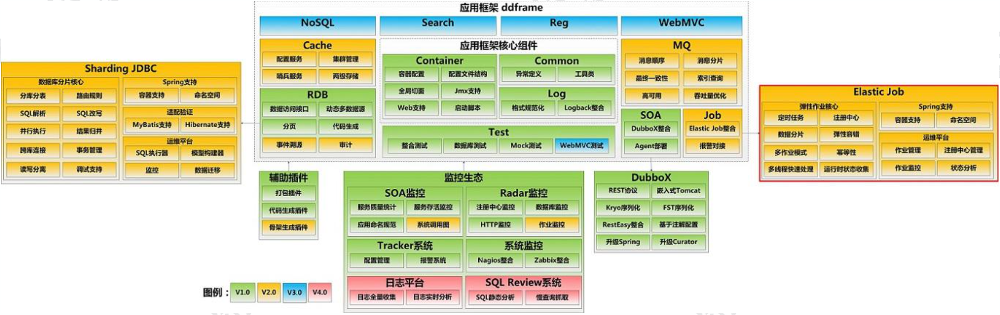
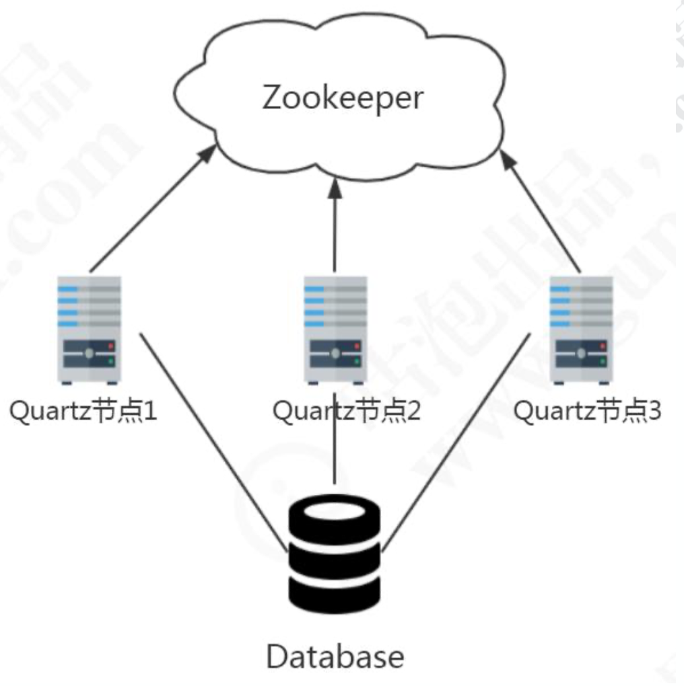
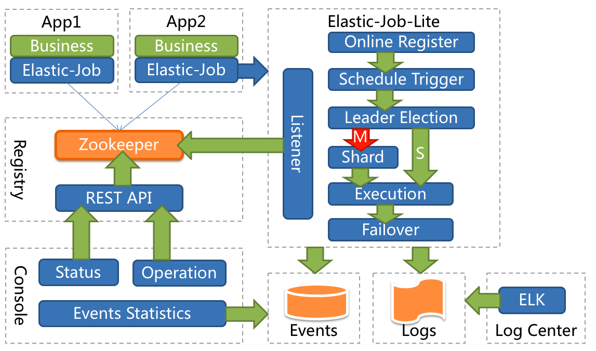
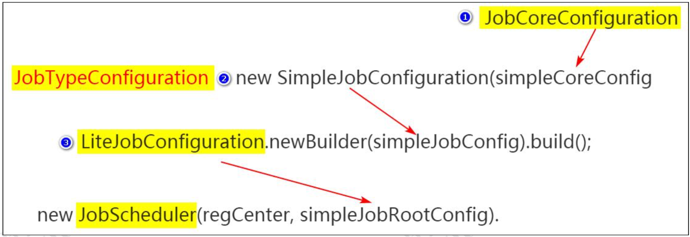
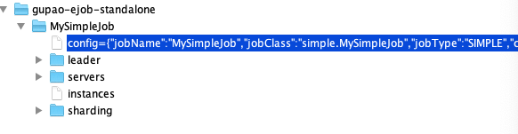
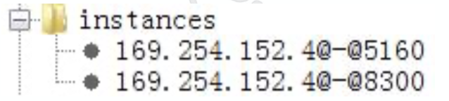
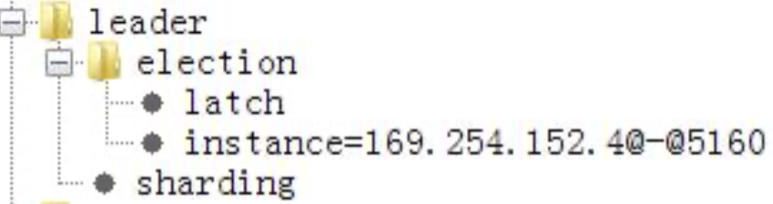
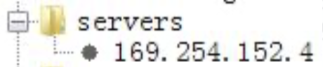
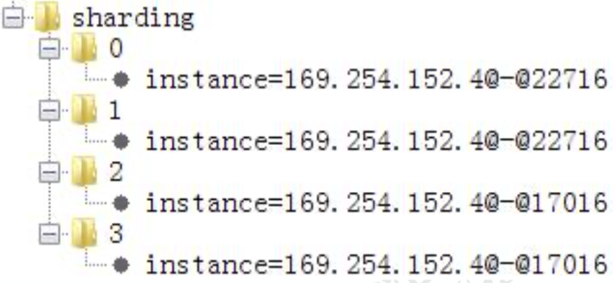

# Elastic-job

## 认识 E-Job

### 任务调度高级需求

Quartz 的不足:

1. 作业只能通过 DB 抢占随机负载，无法协调
2. 任务不能分片——单个任务数据太多了跑不完，消耗线程，负载不均
3. 作业日志可视化监控、统计

### 发展历史

E-Job 是怎么来的?

在当当的 ddframe 框架中，需要一个任务调度系统(作业系统)。



实现的话有两种思路，一个是修改开源产品，一种是基于开源产品搭建(封装)， 当当选择了后者，最开始这个调度系统叫做 dd-job。它是一个无中心化的分布式调度框架。因为数据库缺少分布式协调功能(比如选主)，替换为 Zookeeper 后，增加了弹性扩容和数据分片的功能。

Elastic-Job 是 ddframe 中的 dd-job 作业模块分离出来的作业框架，基于 Quartz 和 Curator 开发，在 2015 年开源。

轻量级，无中心化解决方案。

为什么说是去中心化呢?因为没有统一的调度中心。集群的每个节点都是对等的， 节点之间通过注册中心进行分布式协调。E-Job 存在主节点的概念，但是主节点没有调度的功能，而是用于处理一些集中式任务，如分片，清理运行时信息等。

每个任务有独立的线程池。



从官网开始

http://elasticjob.io/docs/elastic-job-lite/00-overview/ 

https://github.com/elasticjob

Elastic-Job 最开始只有一个 elastic-job-core 的项目，在 2.X 版本以后主要分为 Elastic-Job-Lite 和 Elastic-Job-Cloud 两个子项目。其中，Elastic-Job-Lite 定位为轻量级无中心化解决方案，使用 jar 包的形式提供分布式任务的协调服务。而 Elastic-Job-Cloud 使用 Mesos + Docker 的解决方案，额外提供资源治理、应用分发以及进程隔离等服务(跟 Lite 的区别只是部署方式不同，他们使用相同的 API，只要开发 一次)。

### 功能特性

- 分布式调度协调:用 ZK 实现注册中心
- 错过执行作业重触发(Misfire)
- 支持并行调度(任务分片)
- 作业分片一致性，保证同一分片在分布式环境中仅一个执行实例
- 弹性扩容缩容:将任务拆分为 n 个任务项后，各个服务器分别执行各自分配到的任务项。一旦有新的服务器加入集群，或现有服务器下线，elastic-job 将在保留本次任务执行不变的情况下，下次任务开始前触发任务重分片。
- 失效转移 failover:弹性扩容缩容在下次作业运行前重分片，但本次作业执行的过程中，下线的服务器所分配的作业将不会重新被分配。失效转移功能可以在本次作业运行中用空闲服务器抓取孤儿作业分片执行。同样失效转移功能也会牺牲部分性能。
- 支持作业生命周期操作(Listener)
- 丰富的作业类型(Simple、DataFlow、Script)
- Spring 整合以及命名空间提供
- 运维平台

### 项目架构

应用在各自的节点执行任务，通过 ZK 注册中心协调。节点注册、节点选举、任务分片、监听都在 E-Job 的代码中完成。



## Java 开发

工程:ejob-standalone

pom依赖:

```xml
<dependency>
    <groupId>com.dangdang</groupId>
    <artifactId>elastic-job-lite-core</artifactId>
    <version>2.1.5</version>
</dependency>
```

### 任务类型

standalone 工程

任务类型有三种:

#### SimpleJob

SimpleJob: 简单实现，未经任何封装的类型。需实现 SimpleJob 接口。

MySimpleJob

```java
public class MySimpleJob implements SimpleJob {
    public void execute(ShardingContext context) {
        System.out.println(String.format("分片项 ShardingItem: %s | 运行时间: %s | 线程ID: %s | 分片参数: %s ",
                context.getShardingItem(), new SimpleDateFormat("HH:mm:ss").format(new Date()),
                Thread.currentThread().getId(), context.getShardingParameter()));
    }
}
```

#### DataFlowJob

DataFlowJob:Dataflow 类型用于处理数据流，必须实现 fetchData()和 processData()的方法，一个用来获取数据，一个用来处理获取到的数据。

MyDataFlowJob

```java
public class MyDataFlowJob implements DataflowJob<String> {
    public List<String> fetchData(ShardingContext shardingContext) {
        System.out.println("开始获取数据");
        // 假装从文件或者数据库中获取到了数据
        Random random = new Random();
/*        if( random.nextInt() % 3 != 0 ){
            return null;
        }*/
        return Arrays.asList("qingshan","jack","seven");
    }

    public void processData(ShardingContext shardingContext, List<String> data) {
        for(String val : data){
            // 处理完数据要移除掉，不然就会一直跑
            System.out.println("开始处理数据："+val);
        }

    }
}

```

#### ScriptJob

Script:Script 类型作业意为脚本类型作业，支持 shell，python，perl 等所有类型 脚本。

### E-Job配置

#### 配置步骤

配置手册:http://elasticjob.io/docs/elastic-job-lite/02-guide/config-manual/

1. zk注册中心配置（后面分析）

2. 作业配置（从底层往上层:Core——Type——Lite）

   | 配置级别 | 配置类               | 配置内容                                                     |
   | -------- | -------------------- | ------------------------------------------------------------ |
   | Core     | JobCoreConfiguration | 用于提供作业核心配置信息，如:作业名称、CRON 表达式、分片总数等。 |
   | Type     | JobTypeConfiguration | 有 3 个子类分别对应 SIMPLE, DATAFLOW 和 SCRIPT 类型作业，提供 3 种作业需要的不同配置，如:DATAFLOW 类型是否流式处理或 SCRIPT 类型的命令行等。Simple 和 DataFlow 需要指定任务类的路径。 |
   | Root     | JobRootConfiguration | 有 2 个子类分别对应 Lite 和 Cloud 部署类型，提供不同部署类型所需的配 置，如:Lite 类型的是否需要覆盖本地配置或 Cloud 占用 CPU 或 Memory 数量等。<br/>可以定义分片策略。<br/>http://elasticjob.io/docs/elastic-job-lite/02-guide/job-sharding-strategy/ |

   

```java
public class SimpleJobTest {
    // TODO 如果修改了代码，跑之前清空ZK
    public static void main(String[] args) {
        // ZK注册中心
        CoordinatorRegistryCenter regCenter =
                new ZookeeperRegistryCenter(new ZookeeperConfiguration("192.168.1.4:2181"
                        , "gupao-ejob-standalone"));
        regCenter.init();

        // 定义作业核心配置
        // TODO 如果修改了代码，跑之前清空ZK
        JobCoreConfiguration coreConfig = JobCoreConfiguration
                .newBuilder("MySimpleJob", "0/2 * * * * ?", 4)
                .shardingItemParameters("0=RDP, 1=CORE, 2=SIMS, 3=ECIF").failover(true).build();
        // 定义SIMPLE类型配置
        SimpleJobConfiguration simpleJobConfig =
                new SimpleJobConfiguration(coreConfig, MySimpleJob.class.getCanonicalName());

        // 作业分片策略
        // 基于平均分配算法的分片策略
        String jobShardingStrategyClass = AverageAllocationJobShardingStrategy.class.getCanonicalName();

        // 定义Lite作业根配置
        LiteJobConfiguration simpleJobRootConfig = LiteJobConfiguration.newBuilder(simpleJobConfig).build();

        // 构建Job
        new JobScheduler(regCenter, simpleJobRootConfig).init();
        // new JobScheduler(regCenter, simpleJobRootConfig, jobEventConfig).init();
    }

}
```

作业配置分为 3 级，分别是 JobCoreConfiguration，JobTypeConfiguration 和 LiteJobConfiguration 。 LiteJobConfiguration 使 用 JobTypeConfiguration ， JobTypeConfiguration 使用 JobCoreConfiguration，层层嵌套。



JobTypeConfiguration 根 据 不 同 实 现 类 型 分 为 SimpleJobConfiguration ， DataflowJobConfiguration 和 ScriptJobConfiguration。

E-Job 使用 ZK 来做分布式协调，所有的配置都会写入到 ZK 节点。

#### ZK 注册中心数据结构

一个任务一个二级节点。

这里面有些节点是临时节点，只有任务运行的时候才能看到。

==注意:修改了任务重新运行任务不生效，是因为 ZK 的信息不会更新, 除非把overwrite 修改成 true。==



##### config 节点

JSON 格式存储。

存储任务的配置信息，包含执行类，cron 表达式，分片算法类，分片数量，分片参数等等。

```json
{
"jobName": "MySimpleJob",
"jobClass": "job.MySimpleJob",
"jobType": "SIMPLE",
"cron": "0/2 * * * * ?",
"shardingTotalCount": 1,
"shardingItemParameters": "",
"jobParameter": "",
"failover": false,
"misfire": true,
"description": "",
"jobProperties": {
"job_exception_handler": "com.dangdang.ddframe.job.executor.handler.impl.DefaultJobExceptionHandler", "executor_service_handler": "com.dangdang.ddframe.job.executor.handler.impl.DefaultExecutorServiceHandler" },
"monitorExecution": true,
"maxTimeDiffSeconds": -1,
"monitorPort": -1,
"jobShardingStrategyClass": "",
"reconcileIntervalMinutes": 10,
"disabled": false,
"overwrite": false
}
```

config 节点的数据是通过 ConfigService 持久化到 zookeeper 中去的。默认状态下， 如果你修改了 Job 的配置比如 cron 表达式、分片数量等是不会更新到 zookeeper 上去的，除非你在 Lite 级别的配置把参数 overwrite 修改成 true。

```java
LiteJobConfiguration simpleJobRootConfig = LiteJobConfiguration.newBuilder(simpleJobConfig).overwrite(true).build();
```

##### instances 节点

同一个 Job 下的 elastic-job 的部署实例。一台机器上可以启动多个 Job 实例，也就 是 Jar 包。instances 的命名是 IP+@-@+PID。只有在运行的时候能看到。



##### leader 节点



任务实例的主节点信息，通过 zookeeper 的主节点选举，选出来的主节点信息。在 elastic job 中，任务的执行可以分布在不同的实例(节点)中，但任务分片等核心控制， 需要由主节点完成。因此，任务执行前，需要选举出主节点。

下面有三个子节点:

election:主节点选举。sharding:分片。failover:失效转移。

election 下面的 instance 节点显示了当前主节点的实例 ID:jobInstanceId。

election 下面的 latch 节点也是一个永久节点用于选举时候的实现分布式锁。

sharding 节点下面有一个临时节点，necessary，是否需要重新分片的标记。如果分片总数变化，或任务实例节点上下线或启用/禁用，以及主节点选举，都会触发设置重 分片标记，主节点会进行分片计算。

##### servers 节点



任务实例的信息，主要是 IP 地址，任务实例的 IP 地址。跟 instances 不同，如果多 个任务实例在同一台机器上运行则只会出现一个 IP 子节点。可在 IP 地址节点写入 DISABLED 表示该任务实例禁用。

##### sharding 节点



任务的分片信息，子节点是分片项序号，从 0 开始。分片个数是在任务配置中设置 的。分片项序号的子节点存储详细信息。每个分片项下的子节点用于控制和记录分片运 行状态。最主要的子节点就是 instance。

| 子节点名 | 是否临时节点 | 描述                                                         |
| -------- | ------------ | ------------------------------------------------------------ |
| instance | 否           | 执行该分片项的作业运行实例主键                               |
| running  | 是           | 分片项正在运行的状态<br/>仅配置 monitorExecution 时有效      |
| failover | 是           | 如果该分片项被失效转移分配给其他作业服务器，则此节点值记录执行此分片的作业服务器 IP |
| misfire  | 否           | 是否开启错过任务重新执行                                     |
| disabled | 否           | 是否禁用此分片项                                             |

