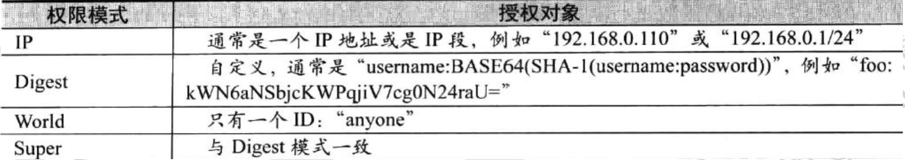
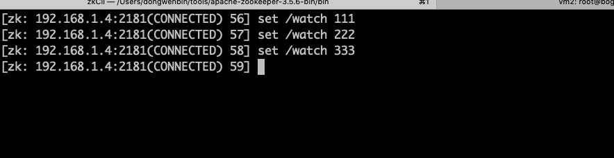
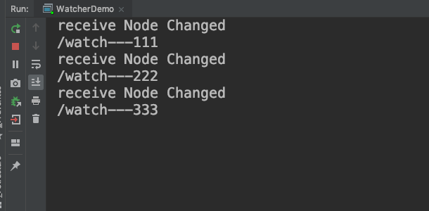

# zookeeper应用实战

针对zookeeper，比较常用的Java客户端有zkclient、curator。由于Curator对于zookeeper的抽象层次比较高，简化了zookeeper客户端的开发量。使得curator逐步被广泛应用。

1. 封装zookeeper Client于zookeeper Server之间的连接处理。
2. 提供了一套Fluent风格的操作API。
3. 提供zookeeper各种应用常见（共享锁、Leader选举）的抽象封装。


## 依赖jar包

```xml
<dependency>
    <groupId>org.apache.curator</groupId>
    <artifactId>curator-framework</artifactId>
    <version>4.0.0</version>
</dependency>
```

## 建立连接

```java
    private static String CONNECTION_STR = "192.168.1.4:2181,192.168.1.4:2182,192.168.1.4:2183";

CuratorFramework curatorFramework = CuratorFrameworkFactory.builder()
        .connectString(CONNECTION_STR)
        .sessionTimeoutMs(5000)
        .retryPolicy(new ExponentialBackoffRetry(1000, 3))
        .build();
```

### 重试策略

Curator内部实现的几种重试策略：

- ExponentialBackoffRetry:重试指定的次数，且每一次重试之间停顿的事件逐渐增加。
- RetryNTimes:指定最大重试次数的重试策略。
- RetryOneTime:仅重试一次。
- RetryUntilElapsed:一致重试知道达到规定事件。

### Namespac

值得注意的是Session2会话含有隔离命名空间，即客户端对Zookeeper上数据节点的任何操作都是相对/curator目录进行的，这有利于于实现不同的Zookeeper的业务之间的隔离。


## 节点的增删改查

```java
public class CuratorDemo {

    private static String CONNECTION_STR = "192.168.1.4:2181,192.168.1.4:2182,192.168.1.4:2183";

    public static void main(String[] args) throws Exception {

        CuratorFramework curatorFramework = CuratorFrameworkFactory.builder()
                .connectString(CONNECTION_STR)
                .sessionTimeoutMs(5000)
                .retryPolicy(new ExponentialBackoffRetry(1000, 3))
                .build();

        //ExponentialBackoffRetry
        //RetryOneTime  仅仅只重试一次
        //RetryUntilElapsed
        //RetryNTimes

        curatorFramework.start(); //启动

        //CRUD
//        curatorFramework.create();
//        curatorFramework.setData(); //修改
//        curatorFramework.delete() ;// 删除
//        curatorFramework.getData(); //查询

        createData(curatorFramework);
        updateData(curatorFramework);
        deleteData(curatorFramework);

    }

    private static void createData(CuratorFramework curatorFramework) throws Exception {
        curatorFramework.create().creatingParentsIfNeeded().withMode(CreateMode.PERSISTENT).
                forPath("/data/program", "test".getBytes());

    }

    private static void updateData(CuratorFramework curatorFramework) throws Exception {
        curatorFramework.setData().forPath("/data/program", "up".getBytes());

    }

    private static void deleteData(CuratorFramework curatorFramework) throws Exception {
        Stat stat = new Stat();
        String value = new String(curatorFramework.getData().storingStatIn(stat).forPath("/data/program"));
        curatorFramework.delete().withVersion(stat.getVersion()).forPath("/data/program");
    }
}
```

## 节点权限设置

Zookeeper作为一个分布式协调框架，内部存储了一些分布式系统运行时的状态数据，比如master选举、比如分布式锁。对这些数据的操作会直接影响到分布式系统的运行状态。因此，为了保证Zookeeper中的数据安全性，避免误操作带来的影响。Zookeeper提供了一套ACL权限控制截止来保证数据安全。

### 给节点赋权

```java
public class AclDemo {
    private static String CONNECTION_STR = "192.168.1.4:2181,192.168.1.4:2182,192.168.1.4:2183";

    public static void main(String[] args) throws Exception {

        demo1();
    }


    private static void demo1() throws Exception {
        CuratorFramework curatorFramework = CuratorFrameworkFactory.builder()
                .connectString(CONNECTION_STR)
                .sessionTimeoutMs(50000)
                .retryPolicy(new ExponentialBackoffRetry(1000, 3))
                .build();

        curatorFramework.start();

        List<ACL> aclList = new ArrayList<ACL>();

        ACL acl = new ACL(ZooDefs.Perms.READ | ZooDefs.Perms.WRITE,
                new Id("digest", DigestAuthenticationProvider.generateDigest("admin:admin")));

        aclList.add(acl);

        curatorFramework.create().withMode(CreateMode.PERSISTENT).withACL(aclList).forPath("/auth");
    }
}
```

执行后命令行客户端操作数据提示无权限：


### 访问授权的节点

```java
    public static void main(String[] args) throws Exception {
        // 访问授权节点
        demo2();
    }

    private static void demo2() throws Exception {
        CuratorFramework curatorFramework = CuratorFrameworkFactory.builder()
                .connectString(CONNECTION_STR)
                .sessionTimeoutMs(5000)
                .retryPolicy(new ExponentialBackoffRetry(1000, 3))
                .authorization("digest", "admin:admin".getBytes())
                .build();

        curatorFramework.start();

        List<ACL> aclList = new ArrayList<ACL>();
        ACL acl = new ACL(ZooDefs.Perms.READ | ZooDefs.Perms.WRITE,
                new Id("digest", DigestAuthenticationProvider.generateDigest("admin:admin")));

        aclList.add(acl);

        curatorFramework.create().withMode(CreateMode.PERSISTENT).withACL(aclList).forPath("/temp", "wenbin".getBytes());

        byte[] bytes = curatorFramework.getData().forPath("/temp");
        String s = new String(bytes);
        System.out.println(s);
        curatorFramework.delete().forPath("/temp");

    }
```

修改已经存在的节点权限使用：```curatorFramework.setACL().withACL().forPath() ```

### 权限模式

Ip：通过ip地址粒度来进行权限控制，例如配置【ip:192.168.0.1】，或者按照网段【ip:192.168.0.1/24】;

Digest：最常用的控制模式，类似于UserName:passoword；设置的时候需要```DigestAuthenticationProvider.generateDigest()```SHA-加密和base64编码。

World：最开放的控制模式，这种权限控制几乎没有任何作用，数据的访问权限对所有用户开放。wold:anyone。

Super：超级用户，可以对节点做任何操作。

### 授权对象

指权限赋予用户或一个指定的实体，不同的权限模式下，授权对象不同：



``````java
Id ipId1 = new Id("ip", "192.168.190.1");
Id ANYONE_ID_UNSAFE = new Id("world", "anyone");
``````

### 权限

指通过权限检查后可以被允许的操作，create/delete/read/write/admin。

Create：允许对子节点create操作。

Read：允许对本节点GetChildren和GetData操作。

Write：允许对本节点SetData操作。

Delete：允许对子节点Delete操作。

Admin：允许对本节点setAcl操作。

## 节点事件监听

Watcher监听机制是Zookeeper中非常重要的特性，基于zookeeper上创建的节点，可以对这些节点绑定监听事件，比如：可以监听节点数据变更、节点删除、子节点状态变更等事件，通过这个事件机制，可以基于zookeeper实现分布式锁、集群管理等功能。

| zookeeper事件                 | 事件含义                                                 |
| ----------------------------- | -------------------------------------------------------- |
| EventType.NodeCreated         | 当node-x这个节点被创建时，该事件触发。                   |
| EventType.NodeChildrenChanged | 当node-x这个节点的直接子节点被创建、删除、修改时被触发。 |
| EventType.NodeDataChanged     | 当node-x这个节点的数据发生变更时，该事件被触发。         |
| EventType.NodeDeleted         | 当node-x这个节点被删除时，该事件被触发。                 |
| EventType.None                | 当zookeeper客户端的连接状态发生变更时，该事件被触发。    |

Watcher机制有一个特性：当数据发生改变的时候，那么zookeeper会产生一个watch事件并发送到客户端，但是客户端只会受到一次这样的通知，如果以后这个数据在发生变化，那么值钱设置watch的客户端不会再次受到消息。因为它是一次性的。如果要实现永久监听，可以通过循环注册来实现。

Curator对节点事件监听提供了很完善的API，接下来简单演示一下Curator事件监听的基本使用。

引入依赖：

```xml
<dependency>
    <groupId>org.apache.curator</groupId>
    <artifactId>curator-recipes</artifactId>
    <version>4.0.0</version>
</dependency>
```

### 子节点事件监听

```java
public class WatcherDemo {
    private static String CONNECTION_STR = "192.168.1.4:2181,192.168.1.4:2182,192.168.1.4:2183";


    public static void main(String[] args) throws Exception {
        CuratorFramework curatorFramework = CuratorFrameworkFactory.builder()
                .connectString(CONNECTION_STR)
                .sessionTimeoutMs(5000)
                .retryPolicy(new ExponentialBackoffRetry(1000, 3))
                .build();

        curatorFramework.start();

        //PathChildCache  --针对于子节点的创建、删除和更新 触发事件
        //NodeCache  针对当前节点的变化触发事件
        //TreeCache  综合事件
        addListenerWithChild(curatorFramework);

        System.in.read();
    }

    //实现服务注册中心的时候，可以针对服务做动态感知
    private static void addListenerWithChild(CuratorFramework curatorFramework) throws Exception {
        PathChildrenCache nodeCache = new PathChildrenCache(curatorFramework, "/watch", true);


        PathChildrenCacheListener nodeCacheListener = (curatorFramework1, pathChildrenCacheEvent) -> {
            System.out.println(pathChildrenCacheEvent.getType() + "->" + new String(pathChildrenCacheEvent.getData().getData()));
        };

        nodeCache.getListenable().addListener(nodeCacheListener);
        nodeCache.start();
    }
}
```


### 当前节点事件监听

```java
 public static void main(String[] args) throws Exception {
        CuratorFramework curatorFramework = CuratorFrameworkFactory.builder()
                .connectString(CONNECTION_STR)
                .sessionTimeoutMs(5000)
                .retryPolicy(new ExponentialBackoffRetry(1000, 3))
                .build();

        curatorFramework.start();

        //PathChildCache  --针对于子节点的创建、删除和更新 触发事件
        //NodeCache  针对当前节点的变化触发事件
        //TreeCache  综合事件
//        addListenerWithChild(curatorFramework);

        addlistenerWithNode(curatorFramework);

        System.in.read();
    }

    //配置中心
    //创建、修改、删除
    private static void addlistenerWithNode(CuratorFramework curatorFramework) throws Exception {
        NodeCache nodeCache = new NodeCache(curatorFramework, "/watch", false);

        NodeCacheListener nodeCacheListener = () -> {
            System.out.println("receive Node Changed");
            System.out.println(nodeCache.getCurrentData().getPath()
                    + "---" + new String(nodeCache.getCurrentData().getData()));
        };
        nodeCache.getListenable().addListener(nodeCacheListener);
        nodeCache.start();
    }
```





## 基于Curator实现分布式锁

### 分布式锁的基本场景


## 使用zookeeper实现leader选举


