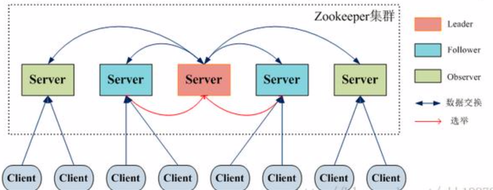
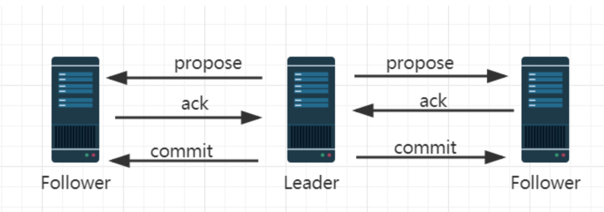
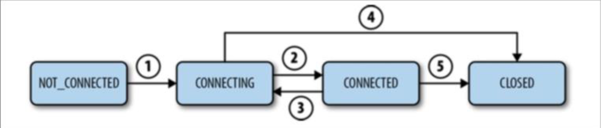
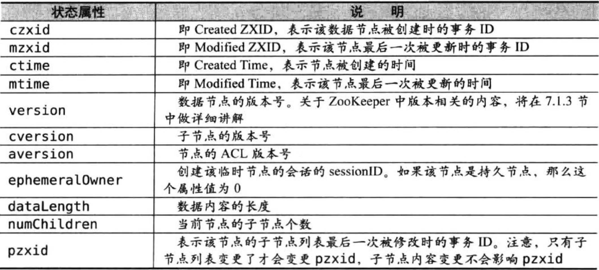

# Zookeeper总结

zookeeper主要是解决分布式环境下的服务协调问题而产生的。zookeeper用zab协议做集群Leader选举，使用分布式事务实现数据的的一致性。其实现机制的整合呈现给我们了一个实现了弱顺序一致性分布式协调服务。

### zookeeper的集群

#### 集群角色

##### Leader角色

Leader无武器是整个zookeeper集群的核心，主要的工作任务有两项：

- 事务请求的唯一调度和处理者，保证集群事务处理的顺序性。
- 集群内部各服务器的调度者。

##### Follower角色

Follower角色的主要职责是：

- 处理客户端非事务请求、转发事务请求给leader服务器。
- 参与事务请求Proposal的投票（需要半数以上服务器通过才能通知Leader Commit数据；Leader发起的提案，要求Follower投票）
- 参与Leader选举的投票

##### Observer角色

Observer是zookeeper3.3开始引入的一个全新的服务器角色，从字面来理解，该角色充当了观察者的角色。

观察zookeeper集群中的最新状态变化并将这些状态变化同步到observer服务器上。Observer的工作原理与follower角色基本一致，而它和follower角色唯一不同的在于Observer不参与任何形式的投票，包括事务请求Proposal的投票和Leader选举的投票。简单来说，Observer服务器只提供非事务请求服务，在不影响集群事务处理能力的前提下提升集群非实物处理的能力。

#### 集群组成

通常zookeeper是由2n+1台server组成，每个server都知道彼此的存在。对于2n+1台server，只要有n+1台（大多数）server可用，这个系统就保持可用。

一个zookeeper集群如果要对外提供可用的服务，那么集群中必须要有过半的机器正常工作并且批次之间能够正常通信，基于这个特性，如果搭建一个能够允许F台机器down掉的几区，那么就要部署2*F+1台服务器构成的zookeeper集群。因此3台机器构成的zookeeper集群，能够在挂掉一台机器后依然正常工作。一个5台机器集群的服务，能够在2台机器挂掉的情况下进行容灾。如果一个有6台服务器构成的集群，同样只能挂掉2台机器。因此，5台和6台在容灾能力上并没有明显优势，反而增加了网络通信负担。系统启动时，集群中的server会选举出一台server为Leader，其他就作为Follower（这里先不考虑Observer角色）。

之所以要满足这样一个等式，是因为一个节点要称为集群中的Leader，需要有超过集群中过半数的节点支持，这个涉及到Leader选举算法。同时也涉及到事务请求的提交投票。

### ZAB协议

ZAB（Zookeeper Atomic Broadcast）协议是分布式协调服务Zookeeper专门设计的一种支持崩溃恢复的原子广播协议。在Zookeeper中，主要依赖ZAB协议来实现分布式数据一致性，基于该协议，Zookeeper实现了一种主备式的系统架构来保持集群中各个副本之间的数据一致性。

#### ZAB协议介绍

ZAB协议包含两种基本模式，分别是：

1. 崩溃恢复
2. 原子广播

当整个集群在启动时，或者当Leader节点出现网络中断、崩溃等情况时，ZAB协议就会进入恢复模式并选举产生新的Leader，当Leader服务器选举出来后，并且集群中有过半机器和该Leader节点完成数据同步后（同步指的是数据同步，用来保证集群中过半的机器能够和Leader服务器数据状态保持一致），ZAB协议就会推出恢复模式。

当集群中已经有过半Follower节点完成了和Leader状态同步以后，那么整个集群就进入了消息广播模式。这个时候，在Leader节点正常工作时，启动一台新的服务器加入到集群，那这个服务器会直接进入数据恢复模式，和Leader节点进行数据同步。同步完成后即可正常对外提供非事务请求的处理。

#### 消息广播的实现原理

如果大家了解分布式事务的2pc和3pc协议的话，消息广播的过程实际上是一个简化版本的二阶段提交过程。

##### 2pc提交

（Two Phase Commitment Protocal）当一个事务操作需要跨越多个分布式节点的时候，为了保持事务处理的ACID特性，就需要引入一个“协调者”（TM）来统一调度所有分布式节点的执行逻辑，这些被调度的分布式节点被称为AP。TM负责调度AP的行为，并最终决定这些AP是否要把事务真正进行提交。因为整个事务是分为两个阶段提交，所以叫2pc。

##### 阶段一

1. 事务询问

   协调者向所有的参与者发送事务内容，询问是否可以执行事务提交操作，并开始等待各参与者的响应。

2. 执行事务

   各个参与者节点执行事务操作，并将Undo和Redo信息记录到事务日志中，尽量把提交过程中所有消耗时间的操作和准备都提前完成确保后面100%成功提交事务。

3. 各个参与者向协调者者反馈事务询问的响应

   如果各个参与者成功执行了事务操作，那么久反馈给参与者yes的响应，表示事务可以执行。如果参与者没有成功执行事务，就反馈给协调者no的响应，表示事务不可以执行，上面这个阶段有点类似协调者组织各个参与者对一次事务操作的投票表态的过程，因此2pc协议的第一个阶段称为“投票阶段”，即各参与者投票表明是否需要继续执行接下去的事务提交操作。

##### 阶段二

在这个阶段，协调者会根据各参与者的反馈情况来决定最终是否可以进行事务提交操作，正常情况下包含两种可能：执行事务、中断事务。

#### zab的2pc提交

1. Leader接收到消息请求后，将消息赋予一个全局唯64位的自增ID，叫：zxid，通过zxid的大小比较可以实现因果有序这个特性。
2. Leader为每个follower准备了一个FIFO队列（通过TCP协议来实现，以实现了全局有序这一个特点）将带有zxid的消息作为一个提案（proposal）分发给所有的follower。
3. 当follower接收到proposal，先把proposal写到磁盘，写入成功以后再向Leader恢复一个ack。
4. 当Leader接收到合法数量（超过半数节点）的ACK后，Leader就会向这些follower发送commit命令，同时会在本地执行该消息。
5. 当follower收到消息的commit命令以后，会提交该消息。

在ZAB的实现2pc提交中弱化了参与者。 只需要过半的follower返回ack就可以提交。

**Leader的投票过程，不需要Observer的ack，也就是Observer不需要参与投票过程，但是Observer必须要同步Leader的数据从而在处理请求的时候保证数据的一致性。**

#### 崩溃恢复

ZAB协议是基于原子广播协议的消息广播过程，在正常情况是是没有任何问题的，但是一旦Leader节点崩溃，或者由于网络问题导致Leader服务器失去过半的Follower节点的联系（Leader失去与过半Follower节点联系，可能是Leader节点和Follower节点之间产生了网络分区，那么此时的Leader不在是合法的leader了），那么久会进入崩溃恢复模式。在ZAB协议中，为了保证程序的正确运行，整个恢复过程结束后需要选举一个新的Leader节点。

为了使Leader挂了以后系统能正常工作，需要解决一下两个问题：

1. 已经被处理的消息不能丢失

   当Leader收到合法数量的Follower的ACKs后，就像各个follower广播COMMIT命令，同时也会在本地执行COMMIT并向连接的客户端返回【成功】。但是如果在各个follower收到COMMIT命令前Leader就挂了，导致剩下的服务器并没有都执行这条消息。

   

   Leader对事物消息发起COMMIT操作，该消息在follower1上执行了，在follower2还没有收到COMMIT，就已经挂了，而实际上客户端已经收到该事物消息处理成功的回执了。所以在ZAB协议需要保证所有机器都要执行这个事务消息。该事物消息不能丢失。

2. 被丢弃的消息不能再次出现

   当Leader接收到消息请求生成proposal后就挂了，其他follower并没有收到proposal，因此经过恢复模式重新选举了Leader后，这条消息是被跳过的。此时，之前挂了的Leader重启并注册成了follower，也保留了应该被跳过消息的proposal装填，与这个系统的状态不一致，需要将其删除。

ZAB协议需要满足上面两种情况，就必须要设计一个leader选举算法：能够确保已经被Leader提交的事务proposal能够提交、同时丢弃已经被跳过的事务proposal。

这对这个要求：

1. 如果leader选举算法能够保证新选举出来的Leader服务器拥有集群中所有机器最高编号（**ZXID最大**）的事务proposal，那么就可以保证这个新选举出来的Leader一定具有已经提交的提案。因为所有天被COMMIT之前必须有超过半数的Follower ACK,即必须有超过半数节点的服务器的事务日志上有该提案的proposal。因此，只要有合法数量的节点正常工作，就必然有一个节点保存了所有被COMMIT消息的proposal状态
2. zxid是64位，高32位是epoch编号，每经过过一次Leader选举产生一个新的Leader，新的Leader会将epoch号+1，低32位是消息计数器，没收到一条消息这个值+1，新的leader选举后这个值重置为0，这样设计的好处在于老的Leader挂了以后重启，它不会被选举为leader，因为此时它的zxid肯定小于当前新的leader。当老的leader作为follower接入新的leader后，新的leader会让它将所有的拥有旧的epoch号的未被COMMIT的proposal清除。

##### 关于ZXID

ZXID，也就是事务ID。

**为了保证事务的顺序一致性。**zookeeper采用了递增的事务ID号（zxid）来标识事务。所有的提议（proposal）都被提出的时候加上了zxid。实现中zxid是一个64位的数字，它的高32位是epoch（ZAB协议通过epoch编号来区分Leader走起变化的策略）用来标识leader关系是否改变，每一个leader被选出来，它都会有一个**新的epoch=（原epoch+1）**,标识当前属于哪个Leader的统治时期。低位32用于递增计数。

##### epoch

epoch:可以理解为当前集群的年代或者周期，每个leader就像皇帝，都有自己的年号，所以每次改朝换代，Leader变更之后，都会在前一个年代的基础上加1.这样就算旧的leader崩溃恢复后，也没有人听他的了，因此follower只听从当前年代leader的命令。

epoch 的变化大家可以做一个简单的实验，：

1. 启动一个 zookeeper 集群。
2. 在/tmp/zookeeper/VERSION-2 路径下会看到一个currentEpoch文件。文件中显示的是当前的 epoch

3. 把 leader 节点停机，这个时候在看 currentEpoch 会有 变化。 随着每次选举新的 leader，epoch 都会发生变化 

### Leader选举

Leader选举会分为两个过程：

1. 启动的时候的Leader选举。
2. leader崩溃的时候的选举。

详细的选举过程，在后续源码分析中在详细说明。

### 数据模型

Zookeeper的视图结构和标准的文件系统非常类似，每一个节点称之为ZNode，是zookeeper的最下单元。每个znode上都可以保存数据以及挂载子节点。构成一个层次化的属性结构。

#### 持久节点（PERSISTENT）

创建后会一致存在zookeeper服务器上，直到主动删除。

#### 持久有序节点（PERSISTENT_SEQUENTIAL）

每个节点都会为它一级子节点维护一个顺序

#### 临时节点（EPHEMERAL）

临时节点的生命周期和客户端的会话绑定在一起，当客户端会话失效该节点自动清理。

#### 临时有序节点（EPHEMERAL_SEQUENTIAL）

在临时节点的基础上多了一个顺序性。

#### CONTAINER

当子节点都被删除后，container也随机删除。

#### PERSISTENT_WITH_TTL

客户端断开连接后不会自动删除Znode，如果该ZNode没有子Znode且在给定TTL时间内无修改，该ZNode将会被删除。TTL单位是毫秒，必须大于0且小于或等于EphermeralType.MAX_TTL。

### 会话

1. Client初始化连接，状态转为CONNECTING（①）
2. Client与Server成功建立连接，状态转为CONNECTED（②）
3. Client丢失了与Server的连接或者没有接受到Server的响应，状态转为CONNECTING（③）
4. Client连上另外的Server或连接上了之前的Server，状态转为CONNECTED（②）
5. 若会话过期（是Server负责声明会话过期，而不是Client），状态转为CLOSED（⑤），状态转为CLOSED。
6. Client也可以主动关闭会话（④），状态转为CLOSED。

### Stat状态信息

每个节点除了存储数据内容以外，还存储了数据节点本身的一些状态信息，**通过get命令可以获得状态信息的详细内容。**

#### 版本（version）

zookeeper为数据节点引入了版本的概念，每个数据节点都有三类版本信息，对数据节点任何更新操作都会引起版本号的变化。

版本有点和我们经常使用的乐观锁类似。这里有两个概念说一下，一个是乐观锁，一个是悲观锁。

##### 悲观锁

悲观锁是数据库中一种非常典型且非常严格的并发控制策略。假如一个事务A正在对数据进行处理，那么在整个处理过程中，都会将数据处于锁定状态，在这期间其他事务无法对数据进行更新。

##### 乐观锁

乐观锁和悲观锁正好相反，它嘉定多个事务在处理过程中不会彼此影响，因此在事务处理过程中不需要进行加锁处理，如果多个事务对同一数据做更改，那么在更新请求提交之前，每个事务都会首先检查当前事务读取数据后，是否有其他事务对数据进行了修改。如果有修改，则回滚事务。

在回到zookeeper，version属性就是用来实现乐观锁机制的“写入校验”。

### Watcher机制

zookeeper提供了分布式数据的发布/订阅功能，zookeeper允许客户端向服务端注册一个watcher监听，当服务端的一些指定事件触发了watcher，那么服务端就会向哭护短发送一个事件通知。

值得注意的是，Watcher通知是一次性的，即一旦触发一次通知后，该Watcher就失效了，因此客户端需要反复注册Watcher，即程序在process里面又注册了Watcher，否则，将无法获取节点的创建而导致子节点变化的事件。

