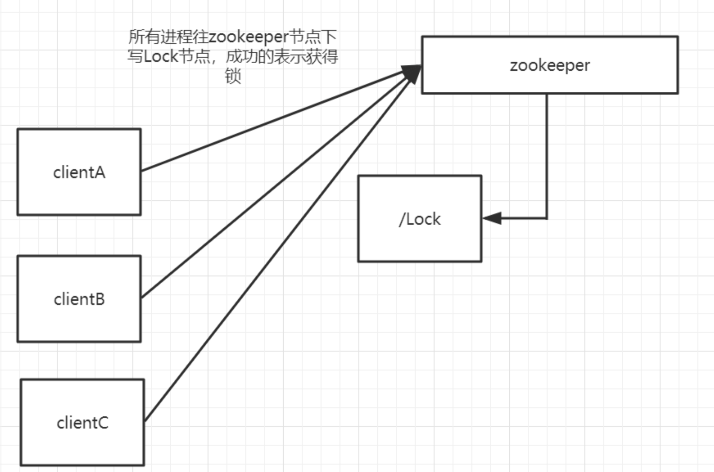
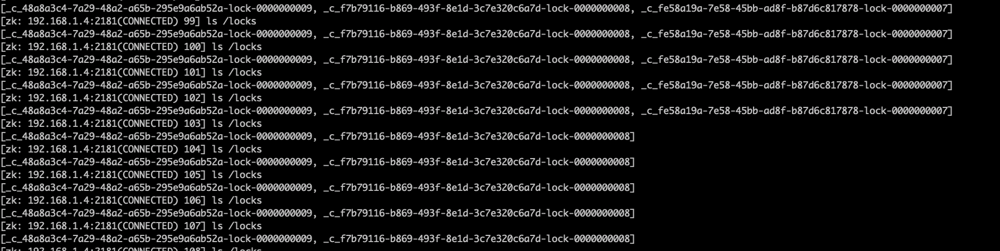

# 基于Curator实现分布式锁

## 分布式锁的基本场景

如果在多线程并行情况下去访问某一个共享资源，比如说共享变量，那么势必会造成线程安全问题。那么我们可以用很多种方法来解决，比如，synchronized、比如Lock之类的锁操作来解决线程安全问题，那么在分布式架构下，涉及到多个进程访问某一个资源的情况，比如说在电商平台中商品库存问题，在库存只有10个的情况下进来100个用户，如果能够避免超卖呢？所以这个时候我们需要一些互斥手段来防止彼此之间的干扰。

在分布式情况下，synchornized或者Lock之类的锁只能控制单一进程的资源访问，在多进程架构下，这些api就没办法解决我们的问题了，怎么办呢？

## 用zookeeper来实现分布式锁

### zookeeper**节点的特性来实现独占锁**

结合前面对zookeeper特性的分析和理解，我们可以利用zookeeper节点的特性来实现独占锁，就是同级节点的唯一性，多个进程往zookeeper的指定节点下创建一个相同名称的节点，只有一个能成功，另外一个是创建失败。创建失败的节点全部通过zookeeper的watcher机制来监听这个子节点的变化，一旦监听到子节点删除事件，则再次出发所有进程去竞争锁：



这种方式很简单，但是会产生**“惊群效应”**，简单来说就是如果存在许多客户端在等待获取锁，当成功获取到锁的进程释放该节点后，所有处于等待状态的客户端都会被唤醒，这个时候zookeeper在短时间内发送大量子节点变更事件给所有待获取锁的客户端，然后实际情况是只有一个客户端能获取到锁。如果在集群规模比较大的情况下，会最zookeeper服务器的性能产生较大的影响。

### 利用有序节点来实现分布式锁

我们可以通过有序节点来实现分布式锁，每个客户端都往指定的节点下注册一个临时有序节点，越早创建的节点，节点的顺序编号就越小，那么我们可以判断子节点中最小的节点设置为获得锁。如果自己的节点不是所有子节点中最小的，意味着还没有获得锁。这个实现和前面单节点实现的差异性在于，每个节点值需要监听比自己小的节点，当比自己小的节点删除以后，客户端会受到watcher事件，此时再次判断自己的节点是不是所有子节点中最小的，如果是则获得锁，否则就不断重复这个过程，这样就不会导致**“惊群效应”**，因为每个客户端只需要监控一个节点。


## Curator分布式锁的基本使用

Curator对于锁这块做了一些封装，Curator提供了InterProcessMutex这样一个API。除了分布式锁之外还提供了Leader选举、分布式队列等常用的功能。

InterProcessMutext:分布式可重入排它锁。

InterProcessSemaphoreMutex：分布式排它锁。

InterProcessReadWriteLock：分布式读写锁。

```java
public class LockDemo {
    private static String CONNECTION_STR = "192.168.1.4:2181,192.168.1.4:2182,192.168.1.4:2183";


    public static void main(String[] args) {
        CuratorFramework curatorFramework = CuratorFrameworkFactory.builder()
                .connectString(CONNECTION_STR)
                .sessionTimeoutMs(5000)
                .retryPolicy(new ExponentialBackoffRetry(1000, 3))
                .build();

        curatorFramework.start();

        final InterProcessMutex lock = new InterProcessMutex(curatorFramework, "/locks");

        for (int i = 0; i < 10; i++) {
            new Thread(() -> {
                System.out.println(Thread.currentThread().getName() + "->尝试竞争锁");


                try {
                    lock.acquire(); // 阻塞竞争锁

                    System.out.println(Thread.currentThread().getName() + "->成功获得锁");
                    Thread.sleep(4000);
                } catch (Exception e) {
                    e.printStackTrace();
                } finally {
                    try {
                        lock.release(); //释放锁
                    } catch (Exception e) {
                        e.printStackTrace();
                    }
                }

            }, "Thread-" + i).start();
        }
    }
}
```

执行结果：


zookeeper中部分节点的变化：



