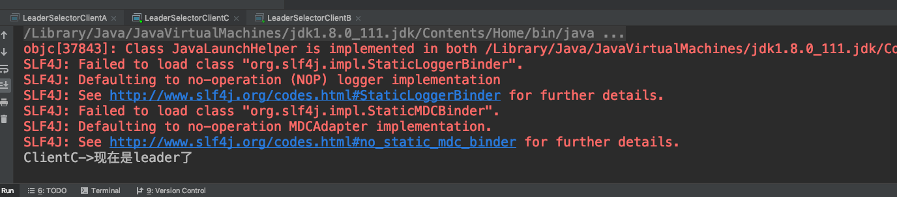

# zookeeper实现Leader选举

在分布式计算中，Leader Election是很重要的一个功能，选举的过程：指派一个进程作为组织者，将任务分发给各个节点。在任务开始前，那个节点都不知道谁是Leader或者coordinator。当选举算法开始执行后，每个节点最终会得到一个唯一节点作为任务Leader。除此之外，选举还经常会发生在leader以外宕机的情况下，新的leader要被选举出来。

Curator有两种选举机制（Leader Latch 和 Leader Selector）

## Leader Latch

参与选举的所有节点，会创建一个顺序节点，其中最小的节点会这只为Master节点，没抢到Leader的节点都监听前一个节点的删除事件，在前一个节点删除后进行重新抢主，当master节点手调用close()方法或者master节点挂了之后，后续的子节点会抢占master。

其中spark使用的就是这种方法。

## Leader Selector

LeaderSelector 和 Leader Latch最大的差别在于，Leader可以释放领导权之后，还可以继续参与竞争。

### Leader Selector演示

#### LeaderSelectorClientA

```java
public class LeaderSelectorClientA extends LeaderSelectorListenerAdapter implements Closeable {

    private  String name;  //表示当前的进程
    private  LeaderSelector leaderSelector;  //leader选举的API
    private CountDownLatch countDownLatch=new CountDownLatch(1);

    public LeaderSelectorClientA(){

    }

    public LeaderSelectorClientA(String name) {
        this.name = name;
    }

    public LeaderSelector getLeaderSelector() {
        return leaderSelector;
    }

    public void setLeaderSelector(LeaderSelector leaderSelector) {
        this.leaderSelector = leaderSelector;
    }

    public void start(){
        leaderSelector.start(); //开始竞争leader
    }

    @Override
    public void takeLeadership(CuratorFramework client) throws Exception {
        //如果进入当前的方法，意味着当前的进程获得了锁。获得锁以后，这个方法会被回调
        //这个方法执行结束之后，表示释放leader权限
        System.out.println(name+"->现在是leader了");
        countDownLatch.await(); //阻塞当前的进程防止leader丢失
    }

    @Override
    public void close() throws IOException {
        leaderSelector.close();
    }
    private static String CONNECTION_STR="192.168.1.4:2181,192.168.1.4:2182,192.168.1.4:2183";

    public static void main(String[] args) throws IOException {
        CuratorFramework curatorFramework = CuratorFrameworkFactory.builder().
                connectString(CONNECTION_STR).sessionTimeoutMs(50000000).
                retryPolicy(new ExponentialBackoffRetry(1000, 3)).build();
        curatorFramework.start();
        LeaderSelectorClientA leaderSelectorClient=new LeaderSelectorClientA("ClientA");
        LeaderSelector leaderSelector=new LeaderSelector(curatorFramework,"/leader",leaderSelectorClient);
        leaderSelectorClient.setLeaderSelector(leaderSelector);
        leaderSelectorClient.start(); //开始选举
        System.in.read();
    }
}
```

#### LeaderSelectorClientB

```java
public class LeaderSelectorClientB extends LeaderSelectorListenerAdapter implements Closeable {

    private  String name;  //表示当前的进程
    private  LeaderSelector leaderSelector;  //leader选举的API
    private CountDownLatch countDownLatch=new CountDownLatch(1);

    public LeaderSelectorClientB(){

    }

    public LeaderSelectorClientB(String name) {
        this.name = name;
    }

    public LeaderSelector getLeaderSelector() {
        return leaderSelector;
    }

    public void setLeaderSelector(LeaderSelector leaderSelector) {
        this.leaderSelector = leaderSelector;
    }

    public void start(){
        leaderSelector.start(); //开始竞争leader
    }

    @Override
    public void takeLeadership(CuratorFramework client) throws Exception {
        //如果进入当前的方法，意味着当前的进程获得了锁。获得锁以后，这个方法会被回调
        //这个方法执行结束之后，表示释放锁
        System.out.println(name+"->现在是leader了");
        countDownLatch.await(); //阻塞当前的进程防止leader丢失
    }

    @Override
    public void close() throws IOException {
        leaderSelector.close();
    }
    private static String CONNECTION_STR="192.168.1.4:2181,192.168.1.4:2182,192.168.1.4:2183";

    public static void main(String[] args) throws IOException {
        CuratorFramework curatorFramework = CuratorFrameworkFactory.builder().
                connectString(CONNECTION_STR).sessionTimeoutMs(50000000).
                retryPolicy(new ExponentialBackoffRetry(1000, 3)).build();
        curatorFramework.start();
        LeaderSelectorClientB leaderSelectorClient=new LeaderSelectorClientB("ClientB");
        LeaderSelector leaderSelector=new LeaderSelector(curatorFramework,"/leader",leaderSelectorClient);
        leaderSelectorClient.setLeaderSelector(leaderSelector);
        leaderSelectorClient.start(); //开始选举
        System.in.read();
    }
}
```

#### LeaderSelectorClientC

```java
public class LeaderSelectorClientC extends LeaderSelectorListenerAdapter implements Closeable {

    private  String name;  //表示当前的进程
    private  LeaderSelector leaderSelector;  //leader选举的API
    private CountDownLatch countDownLatch=new CountDownLatch(1);

    public LeaderSelectorClientC(){

    }

    public LeaderSelectorClientC(String name) {
        this.name = name;
    }

    public LeaderSelector getLeaderSelector() {
        return leaderSelector;
    }

    public void setLeaderSelector(LeaderSelector leaderSelector) {
        this.leaderSelector = leaderSelector;
    }

    public void start(){
        leaderSelector.start(); //开始竞争leader
    }

    @Override
    public void takeLeadership(CuratorFramework client) throws Exception {
        //如果进入当前的方法，意味着当前的进程获得了锁。获得锁以后，这个方法会被回调
        //这个方法执行结束之后，表示释放锁
        System.out.println(name+"->现在是leader了");
        countDownLatch.await(); //阻塞当前的进程防止leader丢失
    }

    @Override
    public void close() throws IOException {
        leaderSelector.close();
    }
    private static String CONNECTION_STR="192.168.1.4:2181,192.168.1.4:2182,192.168.1.4:2183";

    public static void main(String[] args) throws IOException {
        CuratorFramework curatorFramework = CuratorFrameworkFactory.builder().
                connectString(CONNECTION_STR).sessionTimeoutMs(5000).
                retryPolicy(new ExponentialBackoffRetry(1000, 3)).build();
        curatorFramework.start();
        LeaderSelectorClientC leaderSelectorClient=new LeaderSelectorClientC("ClientC");
        LeaderSelector leaderSelector=new LeaderSelector(curatorFramework,"/leader",leaderSelectorClient);
        leaderSelectorClient.setLeaderSelector(leaderSelector);
        leaderSelectorClient.start(); //开始选举
        System.in.read();//
    }
}
```

全部启动A 是Leader：


当前zk 中的信息：


将A停止后C获得了leader,因为C在这里是第二个启动的:



当前zk中的信息：

