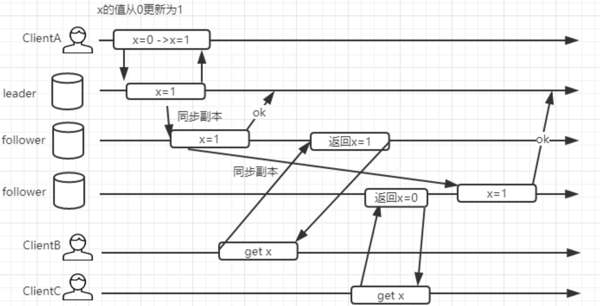
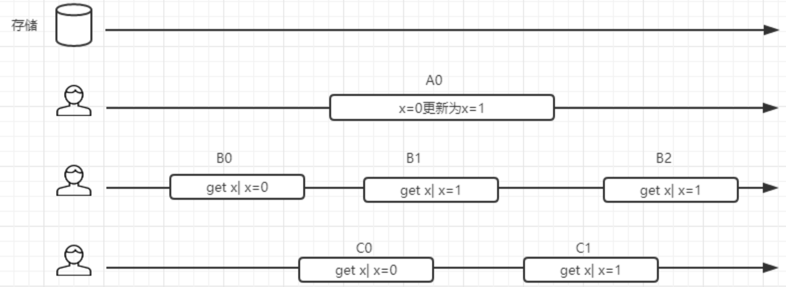
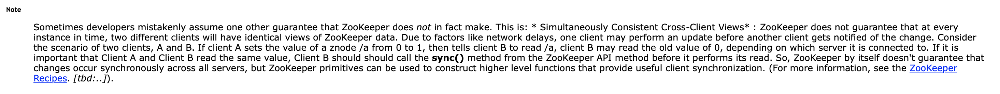
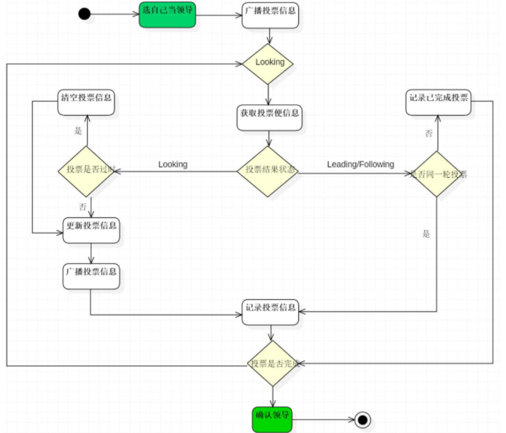
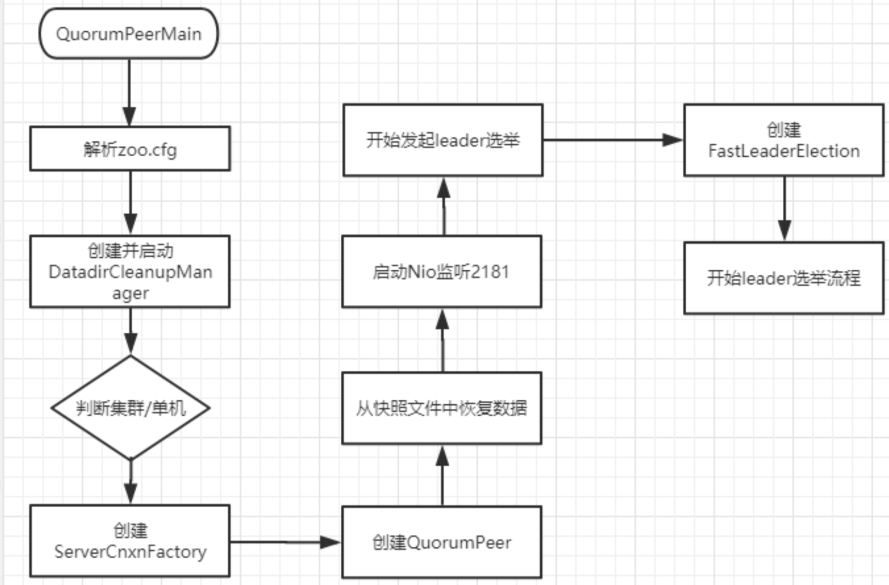
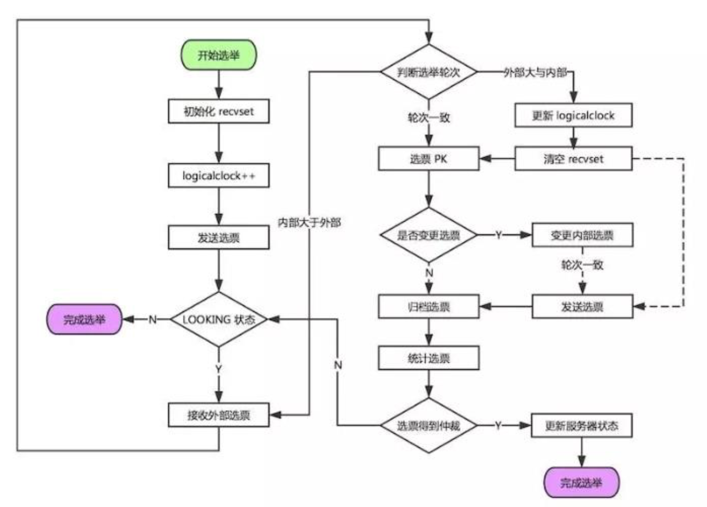
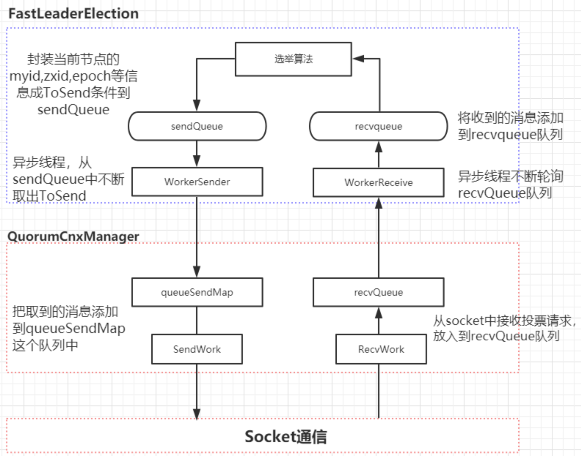
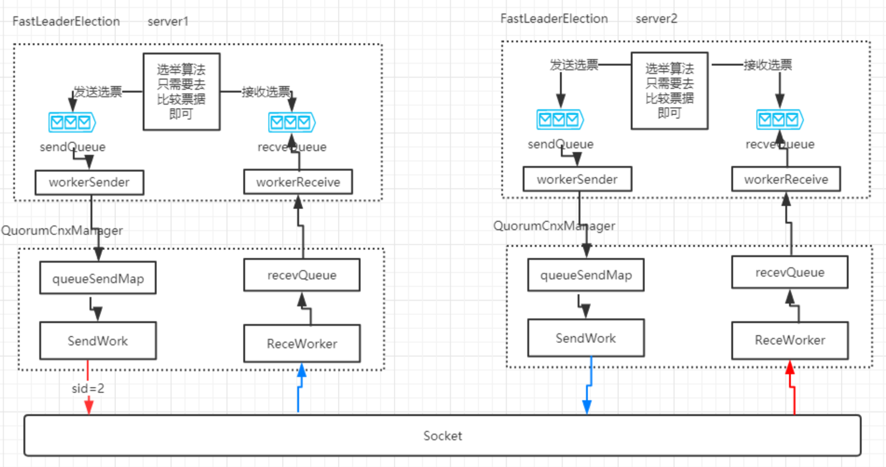

# zookeeper的Leader选举原理

## zookeeper的一致性

对于zookeeper的一致性问题，从来源层面梳理一下。

之前单独讨论过【[分布式系统与一致性协议](https://github.com/wenbin8/doc/blob/master/分布式/分布式协调服务/分布式系统与一致性协议.md)】，感兴趣的可以去看一下。根据之前我们讨论的ZAB协议，在zookeeper集群内部的数据副本同步，是基于过半提交的策略，意味着它是最终一致性。并不满足顺序一致性的要求。

其实正确来说，zookeeper是一个顺序一致性模型。由于zookeeper设计出来是提供分布式锁服务，那么意味着它本身需要实现顺序一致性。顺序一致性是在分布式环境中实现分布式锁的基本要求，比如当一个多个程序来争抢锁，如果clientA获得锁以后，后续所有来争抢锁的程序看的锁的状态都应该是被clientA锁定了，而不是其他状态。

### 顺序一致性

在说明顺序一致性之前，先思考一个问题，如果说zookeeper是一个最终一致性模型，那么它会发生什么情况？

ClientA/B/C假设只串行执行，clientA更新zookeeper上的一个值x。clientB和clientC分别读取集群的不同副本，返回的x的值是不一样的。clientC的读取操作是发生在clientB之后，但是却读到了过期的值。很明显，这是一种弱一致模型。如果用它来实现锁机制是有问题的。



顺序一致性提供了更强的一致性保证，我们来观察下面这个图，从时间轴来看，B0发生在A0之前，读取的值是0，B2发生在A0之后，读取到的x值为1。而读操作B1/C0/C1和写操作A0在时间轴上有重叠，因此他们可能读到旧的值为0，也可能读到新的值1.但是在强顺序一致性模型中，如果B1得到的x的值为1，那么C1看到的值也一定是1。



需要注意的是：由于网络的延迟以及系统本身执行请求的不确定性，会导致请求发起的早的客户端不一定会在服务端执行的早。最终以服务端执行的结果为准。

简单来说：顺序一致性是针对单个操作，单个数据对象。属于CAP中C这个范畴。一个数据被更新后，能够马上被后续的读操作读到。

但是，**zookeeper的顺序一致性实现是缩水版的**，在下面这张图里可以看到官网对于一致性这块做了解释：



zookeeper不保证在每个实例中，两个不同的客户端具有相同zookeeper数据视图，由于网络延迟等因素，一个客户端可能会在另一个客户端收到更改通知之前执行更新。

例如：2个客户端A和B的场景，如果A把znode /a的值从0设置为1，然后告诉客户端B读取/a，则客户端B可能会读取到旧的值0，具体取决于他连接到哪个服务器，如果客户端A和B要读取必须要读取到相同的值，那么clientB在读取操作之前执行sync方法。

除此之外，zookeeper基于zxid以及阻塞队列的方式来实现请求的顺序一致性。如果一个client连接到一个最新的follower上，那么它read读取到了最新的数据，然后client由于网络原因重新连接到了另外一个zookeeper节点，而这个时候连接到的是一个还没有完成同步的follower节点，那么这一次读到的数据就是旧的数据了。实际上zookeeper处理了这种情况，client会记录自己已经读取到的最大的zxid，如果client重连到server发现client的zxid比自己大。连接会失败。


### Single System Image的理解

zookeeper官网还说它保证了”Single System Image“，其解释为：”A client will see the same view of the service regardless of the server that it connects to. “。实际上来看这个解释还是有一些误导性的。其实由zxid原理可以看出，它表达的意思是”client只要连接过一次zookeeper，就不会有历史的倒退“。

## Leader选举的原理

我们基于源码来分析Leader选举的整个实现过程。

Leader选举存在于两个阶段中：

1. 服务器的启动时的Leader选举。
2. 运行过程中Leader节点宕机导致的Leader选举。

### 重要参数

在开发分析之前先了解几个重要的参数。

#### 服务器ID（myid）

比如服务器有三台服务器，编号分别是1，2，3。

编号越大在选择算法中的权重越大。

#### Zxid 事务ID

值越大说明数据越新，在选举算法中的权重也越大

#### 逻辑时钟（epoch-logicalclock）

或者叫投票次数，同一轮投票过程中的逻辑时钟值是相同的。每投完一次票这个数据就会增加，然后与接收到的其他服务器返回的投票信息中的数值相比，根据不同的值做出不同的判断。

#### 选举状态

- LOOKING：竞选状态。
- FOLLOWING：随从状态，同步Leader状态，参与投票。
- OBSERVING：观察状态，同步Leader状态，不参与投票。
- LEADING：领导者状态。

### 服务器启动时的Leader选举

每个节点启动的时候状态都是LOOKING，处于观望状态，接下来就开始进行选主流程。

若进行Leader选举，则至少需要两台机器，这里选取3台机器组成的服务器集群为例。在集群初始化阶段，当有一台服务器server1启动时，其单独无法进行和完成Leader选举，当第二台服务器server2启动时，此时两台机器可以相互通信，每台机器都视图找到Leader，于是进入Leader选举过程。选举过程如下：

#### 选举过程

1. 每个Server发出一个投票。由于是初始情况，server1和server2都会将自己作为Leader服务器来进行投票，每次投票会包含所推举的服务器的myid、zxid、epoch，使用（myid、zxid、epoch）来表示投票。此时server1的投票为（1，0），server2的投票为（2，0），然后各自将这个投票发给集群中其他机器。

2. 接收来自各个服务器的投票。集群的每个服务器收到投票后，首先判断该投票的有效性，如：检查是否是本轮投票（epoch）、是否来自LOOKING状态的服务器。

3. 处理投票。针对每一个投票，服务器都需要将别人的投票和自己的投票进行PK，PK规则如下：

   - 优先比较epoch
   - 其次检查zxid。zxid比较大的服务器有限作为Leader。
   - 如果zxid相同，那么比较myid。myid较大的服务器作为Leader服务器。

   对于server1而言，它的投票是（1，0），接收server2的投票为（2，0），首先会比较两者的zxid，均为0，在比较myid，此时server2的myid最大，于是更新自己的投票为（2，0），然后重新投票，对于server2而言，其无须更新自己的投票，只是再次向集群中所有机器发出上一次投票信息即可。

4. 统计投票。每次投票后，服务器都会统计投票信息，判断是否已经有过半机器接收到相同的投票信息，对于server1、server2而言，都统计出集群中已经有2台机器接收了（2，0）的投票信息，此时便任务已经选出了Leader。

5. 改变服务器状态。一旦确定了Leader，每个服务器就会更新自己的状态，如果是Follower，那么久变更为FOLLOWING，如果是Leader就变更为LEADING。

### 运行过程中的Leader选举

当集群中的Leader服务器出现宕机或者不可用的情况时，那么整个集群将无法对外提供服务，而是进入新一轮的Leader选举，服务器运行期间的Leader选举和启动时期的Leader选举基本过程是一致的。

#### 选举过程

1. 变更状态。Leader挂了以后，余下的非Observer服务器都会将自己的服务器状态变更为LOOKING,然后开始进入Leader选举过程。
2. 每个server会发出一个投票。在运行期间，每个服务器上的zxid可能不同，此时假定server1的zxid为123，server3的zxid为122。在第一轮投票中，server1和server3都会投自己，产生投票（1，123），（3，122），然后各自将投票发送给集群所有机器。接收来自各个服务器的投票。与启动时过程相同。
3. 处理投票。与启动时过程相同。此时，server1将会成为Leader。
4. 统计投票。与启动时过程相同。
5. 改变服务器的状态。与启动时过程相同。



## Leader选举的源码分析

源码分析，最关键的是要找到一个入口，对于 zk 的 leader 选举，并不 由客户端来触发，而是在启动的时候会触发一次选举。因此我们可以直 去看启动脚本 zkServer.sh 中的运行命令。

### 初始化流程

#### QuorumPeerMain.main 方法 

```java
public static void main(String[] args) {
    QuorumPeerMain main = new QuorumPeerMain();
    try {
        //zoo.cfg
        main.initializeAndRun(args);
    } catch (IllegalArgumentException e) {
        LOG.error("Invalid arguments, exiting abnormally", e);
        LOG.info(USAGE);
        System.err.println(USAGE);
        System.exit(2);
    } catch (ConfigException e) {
        LOG.error("Invalid config, exiting abnormally", e);
        System.err.println("Invalid config, exiting abnormally");
        System.exit(2);
    } catch (Exception e) {
        LOG.error("Unexpected exception, exiting abnormally", e);
        System.exit(1);
    }
    LOG.info("Exiting normally");
    System.exit(0);
}
```

main 方法中，调用了 initializeAndRun 进行初始化并且运行 :

```java
protected void initializeAndRun(String[] args)
    throws ConfigException, IOException
{
    //保存zoo.cfg文件解析之后的所有参数（一定在后面有用到）
    QuorumPeerConfig config = new QuorumPeerConfig();
    if (args.length == 1) {
        config.parse(args[0]);
    }

     // 这里启动了一个线程，来定时对日志进行清理，从命名来看也很容易理解
    DatadirCleanupManager purgeMgr = new DatadirCleanupManager(config
            .getDataDir(), config.getDataLogDir(), config
            .getSnapRetainCount(), config.getPurgeInterval());
    purgeMgr.start();

    // 如果是集群模式，会调用runFromConfig.servers实际就是我们在zoo.cfg里面配置的集群节点
    if (args.length == 1 && config.servers.size() > 0) {
        runFromConfig(config);//如果args==1，走这段代码
    } else { // 否则直接运行单机模式
        LOG.warn("Either no config or no quorum defined in config, running "
                + " in standalone mode");
        // there is only server in the quorum -- run as standalone
        ZooKeeperServerMain.main(args);
    }
}
```

#### runFromConfig 

从名字可以看出来，是基于配置文件来进行启动。 所以整个方法都是对参数进行解析和设置 ，因为这些参数暂时还没用 所以没必要去看。直接看核心的代码quorumPeer.start()，启动一个线程，那么从这句代码可以看出 QuorumPeer实际是继承了线程。那么它里面一定有一个run方法 

```java
public void runFromConfig(QuorumPeerConfig config) throws IOException {
  try {
      ManagedUtil.registerLog4jMBeans();
  } catch (JMException e) {
      LOG.warn("Unable to register log4j JMX control", e);
  }

  LOG.info("Starting quorum peer");
  try {
      ServerCnxnFactory cnxnFactory = ServerCnxnFactory.createFactory();
      cnxnFactory.configure(config.getClientPortAddress(),
                            config.getMaxClientCnxns());

      quorumPeer = getQuorumPeer();
      //getView()
      quorumPeer.setQuorumPeers(config.getServers()); // zoo.cfg里面解析的servers节点
      quorumPeer.setTxnFactory(new FileTxnSnapLog(
              new File(config.getDataLogDir()),
              new File(config.getDataDir())));
      quorumPeer.setElectionType(config.getElectionAlg());
      quorumPeer.setMyid(config.getServerId());
      quorumPeer.setTickTime(config.getTickTime());
      quorumPeer.setInitLimit(config.getInitLimit());
      quorumPeer.setSyncLimit(config.getSyncLimit());// 投票决定方式，默认超过半数就通过
      quorumPeer.setQuorumListenOnAllIPs(config.getQuorumListenOnAllIPs());
      quorumPeer.setCnxnFactory(cnxnFactory);// 设置cnxnFacotory
      quorumPeer.setQuorumVerifier(config.getQuorumVerifier());
      quorumPeer.setClientPortAddress(config.getClientPortAddress());
      quorumPeer.setMinSessionTimeout(config.getMinSessionTimeout());
      quorumPeer.setMaxSessionTimeout(config.getMaxSessionTimeout());
      quorumPeer.setZKDatabase(new ZKDatabase(quorumPeer.getTxnFactory()));
      quorumPeer.setLearnerType(config.getPeerType());
      quorumPeer.setSyncEnabled(config.getSyncEnabled());

      // sets quorum sasl authentication configurations
      quorumPeer.setQuorumSaslEnabled(config.quorumEnableSasl);
      if(quorumPeer.isQuorumSaslAuthEnabled()){
          quorumPeer.setQuorumServerSaslRequired(config.quorumServerRequireSasl);
          quorumPeer.setQuorumLearnerSaslRequired(config.quorumLearnerRequireSasl);
          quorumPeer.setQuorumServicePrincipal(config.quorumServicePrincipal);
          quorumPeer.setQuorumServerLoginContext(config.quorumServerLoginContext);
          quorumPeer.setQuorumLearnerLoginContext(config.quorumLearnerLoginContext);
      }

      quorumPeer.setQuorumCnxnThreadsSize(config.quorumCnxnThreadsSize);
      quorumPeer.initialize();
	  // 启动主线程
      quorumPeer.start();
      quorumPeer.join();
  } catch (InterruptedException e) {
      // warn, but generally this is ok
      LOG.warn("Quorum Peer interrupted", e);
  }
}
```

#### quorumPeer.start()

QuorumPeer.start 方法，重写了 Thread 的 start。也就是在线程启动前，会做以下操作:

1. 通过loadDataBase恢复快照数据。
2. cnxnFactory.start()启动zkServer，相当于用户可以通过2181这个端口进行通信了，这块后续在分析。我们还是以Leader选举为主线。

```java
@Override
public synchronized void start() {
    loadDataBase(); //加载数据()
    cnxnFactory.start();      //cnxnFacotory?  跟通信有关系. ->暴露一个2181的端口号
    startLeaderElection();  //开始leader选举-> 启动一个投票的监听、初始化一个选举算法FastLeader.
    super.start(); //当前的QuorumPeer继承Thread，调用Thread.start() ->QuorumPeer.run()
}
```

#### startLeaderElection 

看到这个方法，有没有两眼放光的感觉?没错，前面铺垫了这么长，终于进入leader选举的方法了。

```java
synchronized public void startLeaderElection() {
   try {
       //构建一个票据， （myid ,zxid ,epoch）,用来投票的。
      currentVote = new Vote(myid, getLastLoggedZxid(), getCurrentEpoch());
   } catch(IOException e) {
      RuntimeException re = new RuntimeException(e.getMessage());
      re.setStackTrace(e.getStackTrace());
      throw re;
   }
   //这个 getView 返回的就是在配置文件中配置的 server.myid=ip:port:port。
    for (QuorumServer p : getView().values()) {
        //获得当前 zkserver myid 对应的ip地址
        if (p.id == myid) {
            myQuorumAddr = p.addr; //地址： 1 ->myQuorumAddr=192.168.13.102
            break;
        }
    }
    if (myQuorumAddr == null) {
        throw new RuntimeException("My id " + myid + " not in the peer list");
    }
    //根据electionType匹配对应的选举算法,electionType 默认值为 3.可以在配置文件中动态配置
    if (electionType == 0) { //选举的策略
        try {
            udpSocket = new DatagramSocket(myQuorumAddr.getPort());
            responder = new ResponderThread();
            responder.start();
        } catch (SocketException e) {
            throw new RuntimeException(e);
        }
    }
    //
    this.electionAlg = createElectionAlgorithm(electionType);
}
```

#### quorumPeer. createElectionAlgorithm 

根据对应的标识创建选举算法:

```java
protected Election createElectionAlgorithm(int electionAlgorithm){
    Election le=null;
            
    //TODO: use a factory rather than a switch
    switch (electionAlgorithm) {
    case 0:
        le = new LeaderElection(this);
        break;
    case 1:
        le = new AuthFastLeaderElection(this);
        break;
    case 2:
        le = new AuthFastLeaderElection(this, true);
        break;
    case 3:
        //跟选举有关系，用来接收投票的。
        qcm = createCnxnManager();
        QuorumCnxManager.Listener listener = qcm.listener;
        if(listener != null){
            listener.start();
            // 创建一个FastLeaderElection选举算法
            le = new FastLeaderElection(this, qcm);
        } else {
            LOG.error("Null listener when initializing cnx manager");
        }
        break;
    default:
        assert false;
    }
    return le;
}
```

#### FastLeaderElection 

初始化 FastLeaderElection，QuorumCnxManager 是一个很核心的对象，用来实现领导选举中的网络连接管理功能，这个后面会用到 

```java
public FastLeaderElection(QuorumPeer self, QuorumCnxManager manager){
    this.stop = false;
    this.manager = manager;
    starter(self, manager);
}
```

#### FastLeaderElection. starter 

starter方法里面，设置了一些成员属性，并且构建了两个阻塞队列，分别是sendQueue和recvqueue。并且实例化了一个 Messager 

```java
private void starter(QuorumPeer self, QuorumCnxManager manager) {
    this.self = self;
    proposedLeader = -1;
    proposedZxid = -1;

    sendqueue = new LinkedBlockingQueue<ToSend>();
    recvqueue = new LinkedBlockingQueue<Notification>();
    this.messenger = new Messenger(manager);
}
```

#### Messenger 

在Messenger里面构建了两个线程，一个是WorkerSender，一个是WorkerReceiver。这两个线程是分别用来发送和接收消息的线程。具体做什么，暂时先不分析。 

```java
Messenger(QuorumCnxManager manager) {

    this.ws = new WorkerSender(manager); //发送票据的线程（用于消费sendQueue）

    Thread t = new Thread(this.ws,
            "WorkerSender[myid=" + self.getId() + "]");
    t.setDaemon(true); //守护线程
    t.start();

    this.wr = new WorkerReceiver(manager);//接收票据的线程

    t = new Thread(this.wr,
            "WorkerReceiver[myid=" + self.getId() + "]");
    t.setDaemon(true);
    t.start();
}
```

#### 阶段性总结

分析到这里，先做一个简单的总结，通过一个流程图把前面部分的功能串联起来。 



### **getView** **的解析流程** 

```java
public Map<Long,QuorumPeer.QuorumServer> getView() {
    return Collections.unmodifiableMap(this.quorumPeers);
}
```

getView 里面实际上返回的是一个 quorumPeers，就是参与本次投票的成员有哪些。这个属性在哪里赋值的呢?
 我们又得回到 runFromConfig 方法中 ：

#### QuorumPeerMain.runFromConfig 

设置了一个值为 config.getServers() 

```java
public void runFromConfig(QuorumPeerConfig config) throws IOException {
    ...
    //getView()
    quorumPeer.setQuorumPeers(config.getServers()); //zoo.cfg里面解析的servers节点    
    ...
}
```

config 这个配置信息又是通过在 initializeAndRun 方法中初始化的， 

```java
protected void initializeAndRun(String[] args)
    throws ConfigException, IOException
{
    //保存zoo.cfg文件解析之后的所有参数（一定在后面有用到）
    QuorumPeerConfig config = new QuorumPeerConfig();
    if (args.length == 1) {
        config.parse(args[0]);
    }

	....
}
```

#### QuorumPeerConfig.parse 

这里会根据一个外部的文件去进行解析，然后其中有一段是这样，解析对应的集群配置数据放到 servers 这个集合中：

```java
else if (key.startsWith("server.")) {
    int dot = key.indexOf('.');
    long sid = Long.parseLong(key.substring(dot + 1));
    String parts[] = splitWithLeadingHostname(value);
    if ((parts.length != 2) && (parts.length != 3) && (parts.length !=4)) {
        LOG.error(value
           + " does not have the form host:port or host:port:port " +
           " or host:port:port:type");
    }
    LearnerType type = null;
    String hostname = parts[0];
    Integer port = Integer.parseInt(parts[1]);
    Integer electionPort = null;
    if (parts.length > 2){
       electionPort=Integer.parseInt(parts[2]);
    }
    if (parts.length > 3){
        if (parts[3].toLowerCase().equals("observer")) {
            type = LearnerType.OBSERVER;
        } else if (parts[3].toLowerCase().equals("participant")) {
            type = LearnerType.PARTICIPANT;
        } else {
            throw new ConfigException("Unrecognised peertype: " + value);
        }
    }
    if (type == LearnerType.OBSERVER){
        observers.put(Long.valueOf(sid), new QuorumServer(sid, hostname, port, electionPort, type));
    } else {
        servers.put(Long.valueOf(sid), new QuorumServer(sid, hostname, port, electionPort, type));
    }
}
```

### **ZkServer** **服务启动的逻辑** 

在分析Leader选举的时候，有一个 cnxnFactory.start()方法来启动zk服务， 这块具体做了什么呢?我们来分析看看。

#### QuorumPeerMain.runFromConfig 

在runFromConfig中，有构建了一个ServerCnxnFactory。

```java
public void runFromConfig(QuorumPeerConfig config) throws IOException {
  try {
      ManagedUtil.registerLog4jMBeans();
  } catch (JMException e) {
      LOG.warn("Unable to register log4j JMX control", e);
  }

  LOG.info("Starting quorum peer");
  try {
      ServerCnxnFactory cnxnFactory = ServerCnxnFactory.createFactory();
      cnxnFactory.configure(config.getClientPortAddress(),
                            config.getMaxClientCnxns());

      ....
          
      quorumPeer.setCnxnFactory(cnxnFactory);// 设置cnxnFacotory
      
      ....
}
```

#### ServerCnxnFactory.createFactory 

这个方法里面是根据 **ZOOKEEPER_SERVER_CNXN_FACTORY** 来决定创建NIO server还是Netty Server。

而默认情况下，应该是创建一个NIOServerCnxnFactory。

```java
static public ServerCnxnFactory createFactory() throws IOException {
    String serverCnxnFactoryName =
        System.getProperty(ZOOKEEPER_SERVER_CNXN_FACTORY);
    if (serverCnxnFactoryName == null) {
        serverCnxnFactoryName = NIOServerCnxnFactory.class.getName();
    }
    try {
        ServerCnxnFactory serverCnxnFactory = (ServerCnxnFactory) Class.forName(serverCnxnFactoryName)
                .getDeclaredConstructor().newInstance();
        LOG.info("Using {} as server connection factory", serverCnxnFactoryName);
        return serverCnxnFactory;
    } catch (Exception e) {
        IOException ioe = new IOException("Couldn't instantiate "
                + serverCnxnFactoryName);
        ioe.initCause(e);
        throw ioe;
    }
}
```

#### QuorumPeer.start 

因此，我们再回到 QuorumPeer.start()方法中，cnxnFactory.start()，应该啊会调用 NIOServerCnxnFactory 这个类去启动一个线程。

```java
@Override
public synchronized void start() {
    loadDataBase(); //加载数据()
    cnxnFactory.start();      //cnxnFacotory?  跟通信有关系. ->暴露一个2181的端口号
    startLeaderElection();  //开始leader选举-> 启动一个投票的监听、初始化一个选举算法FastLeader.
    super.start(); //当前的QuorumPeer继承Thread，调用Thread.start() ->QuorumPeer.run()
}
```

#### NIOServerCnxnFactory.start 

这里通过thread.start启动一个线程，那 thread 是一个什么对象呢? 

```java
@Override
public void start() {
    // ensure thread is started once and only once
    if (thread.getState() == Thread.State.NEW) {
        thread.start();
    }
}
```

#### NIOServerCnxnFactory.configure 

thread其实构建的是一个 zookeeperThread 线程，并且线程的参数为this，表示当前 NIOServerCnxnFactory也是实现了线程的类，那么它必须要重写run 方法，因此定位到 NIOServerCnxnFactory.run。 

到此，NIOServer的初始化以及启动过程就完成了。并且对2181的这个端口进行监听。一旦发现有请求进来，就执行相应的处理即可。这块后续在分析数据同步的时候再做详细了解 

```java
public void configure(InetSocketAddress addr, int maxcc) throws IOException {
    configureSaslLogin();

    thread = new ZooKeeperThread(this, "NIOServerCxn.Factory:" + addr);
    thread.setDaemon(true);
    maxClientCnxns = maxcc;
    this.ss = ServerSocketChannel.open();
    ss.socket().setReuseAddress(true);//端口可复用
    LOG.info("binding to port " + addr);
    ss.socket().bind(addr); //绑定ip和端口
    ss.configureBlocking(false); //非阻塞
    ss.register(selector, SelectionKey.OP_ACCEPT); //注册一个accept
}
```

### **选举流程分析** 

前面分析这么多，还没有正式分析到leader选举的核心流程，前期准备工作做好了以后，接下来就开始正式分析leader选举的过程。

```java
public synchronized void start() {
    ....
    // 选举流程入口
    super.start(); //当前的QuorumPeer继承Thread，调用Thread.start() ->QuorumPeer.run()
}
```

很明显，super.start() 表示当前类QuorumPeer继承了线程，线程必须要重写run方法，所以我们可以在 QuorumPeer中找到一个run方法。

#### QuorumPeer.run 

这段代码的逻辑比较长。粗略看一下，好像也不难 

PeerState有几种状态，分别是：

1. LOOKING，竞选状态。
2. FOLLOWING，随从状态，同步Leader状态，参与投票。
3. OBSERVING，观察状态，同步Leader状态，不参与投票。
4. LEADING，领导者状态。

对于选举来说，默认都是LOOKING状态。只有LOOKING状态才会去执行选举算法。每个服务器在启动时都会选择自己作为领导，然后将投票信息发送出去，循环一直到选举出领导为止。

```java
public void run() {
    setName("QuorumPeer" + "[myid=" + getId() + "]" +
            cnxnFactory.getLocalAddress());

    LOG.debug("Starting quorum peer");
    
	....

    try {
        /*
         * Main loop
         * 死循环，根据选举状态，选择不同处理方式
         */
        while (running) {
            switch (getPeerState()) {//第一次启动的时候，LOOKING
            case LOOKING:
                LOG.info("LOOKING");

                // 判断是否为只读模式，通过”readonlymode.enabled“开启
                if (Boolean.getBoolean("readonlymode.enabled")) {
                    // 只读模式的启动流程。 
                    ....
                } else {
                    try {
                        setBCVote(null);
                        // 设置当前的投票，通过策略模式来决定当前用哪个选举算法来进行领导选举
                        setCurrentVote(makeLEStrategy().lookForLeader());
                    } catch (Exception e) {
                        LOG.warn("Unexpected exception", e);
                        setPeerState(ServerState.LOOKING);
                    }
                }
                break;
           // 后续逻辑暂时不管
           ...
}
```

#### FastLeaderElection.lookForLeader 

开始发起投票流程 

```java
public Vote lookForLeader() throws InterruptedException {
    try {
        self.jmxLeaderElectionBean = new LeaderElectionBean();
        MBeanRegistry.getInstance().register(
                self.jmxLeaderElectionBean, self.jmxLocalPeerBean);
    } catch (Exception e) {
        LOG.warn("Failed to register with JMX", e);
        self.jmxLeaderElectionBean = null;
    }
    if (self.start_fle == 0) {
       self.start_fle = Time.currentElapsedTime();
    }
    try {
        //接收到的票据的集合
        HashMap<Long, Vote> recvset = new HashMap<Long, Vote>();

        //
        HashMap<Long, Vote> outofelection = new HashMap<Long, Vote>();

        int notTimeout = finalizeWait;

        synchronized(this){
            //逻辑时钟->epoch
            logicalclock.incrementAndGet();// 更新逻辑时钟，用来判断是否在同一轮选举周期
            //proposal，初始化选票数据：这里其实就是把当前节点的myid,zxid,epoch更新到本地的成员属性
            updateProposal(getInitId(), getInitLastLoggedZxid(), getPeerEpoch());
        }

        LOG.info("New election. My id =  " + self.getId() +
                ", proposed zxid=0x" + Long.toHexString(proposedZxid));
        sendNotifications();//我要广播自己的票据

        /*
         * Loop in which we exchange notifications until we find a leader
         */

        //接收到了票据，这里就是不断循环，根据投票信息进行进行leader选举
        while ((self.getPeerState() == ServerState.LOOKING) &&
                (!stop)){
            /*
             * Remove next notification from queue, times out after 2 times
             * the termination time
             */
            //recvqueue是从网络上接收到的其他机器的Notification
            Notification n = recvqueue.poll(notTimeout,
                    TimeUnit.MILLISECONDS);

            /*
             * Sends more notifications if haven't received enough.
             * Otherwise processes new notification.
             */
            //如果没有获取到外部的投票，有可能是集群之间的节点没有真正连接上
            if(n == null){
                // 判断发送队列是否有数据，如果发送队列为空，再发一次自己的选票
                if(manager.haveDelivered()){
                    sendNotifications();
                } else {
                    manager.connectAll();// 重新连接集群中的所有节点
                }

                /*
                 * Exponential backoff
                 */
                int tmpTimeOut = notTimeout*2;
                notTimeout = (tmpTimeOut < maxNotificationInterval?
                        tmpTimeOut : maxNotificationInterval);
                LOG.info("Notification time out: " + notTimeout);
            }
            
			....
}
```

#### 选票的判断逻辑(核心代码)

```java
//判断收到的选票中的sid和选举的leader的sid是否存在于我们集群所配置的myid范围
else if(validVoter(n.sid) && validVoter(n.leader)) {//判断是否是一个有效的票据
    /*
     * Only proceed if the vote comes from a replica in the
     * voting view for a replica in the voting view.
     */
    switch (n.state) {
    case LOOKING: //第一次进入到这个case
        // If notification > current, replace and send messages out
        if (n.electionEpoch > logicalclock.get()) { //
            logicalclock.set(n.electionEpoch);
            recvset.clear();//清空
            //收到票据之后，当前的server要听谁的。
            //可能是听server1的、也可能是听server2，也可能是听server3
            //zab  leader选举算法
            if(totalOrderPredicate(n.leader, n.zxid, n.peerEpoch,
                    getInitId(), getInitLastLoggedZxid(), getPeerEpoch())) {
                //把自己的票据更新成对方的票据，那么下一次，发送的票据就是新的票据
                updateProposal(n.leader, n.zxid, n.peerEpoch);
            } else {
                //收到的票据小于当前的节点的票据，下一次发送票据，仍然发送自己的
                updateProposal(getInitId(),
                        getInitLastLoggedZxid(),
                        getPeerEpoch());
            }
            //继续发送通知
            sendNotifications();
        } else if (n.electionEpoch < logicalclock.get()) { //说明当前的数据已经过期了
            if(LOG.isDebugEnabled()){
                LOG.debug("Notification election epoch is smaller than logicalclock. n.electionEpoch = 0x"
                        + Long.toHexString(n.electionEpoch)
                        + ", logicalclock=0x" + Long.toHexString(logicalclock.get()));
            }
            break;
        } else if (totalOrderPredicate(n.leader, n.zxid, n.peerEpoch,
                proposedLeader, proposedZxid, proposedEpoch)) {
            updateProposal(n.leader, n.zxid, n.peerEpoch);
            sendNotifications();
        }

        if(LOG.isDebugEnabled()){
            LOG.debug("Adding vote: from=" + n.sid +
                    ", proposed leader=" + n.leader +
                    ", proposed zxid=0x" + Long.toHexString(n.zxid) +
                    ", proposed election epoch=0x" + Long.toHexString(n.electionEpoch));
        }

        // 将收到的投票信息放入投票的集合recvset中, 用来作为最终的"过半原则"判断
        recvset.put(n.sid, new Vote(n.leader, n.zxid, n.electionEpoch, n.peerEpoch));
        // 决断时刻（当前节点的更新后的vote信息，和recvset集合中的票据进行归纳，）
        if (termPredicate(recvset,
                new Vote(proposedLeader, proposedZxid,
                        logicalclock.get(), proposedEpoch))) {

            // Verify if there is any change in the proposed leader
            //进入这个判断，说明选票达到了leader选举的要求
            //在更新状态之前，服务器会等待finalizeWait毫秒时间来接收新的选票，以防止漏下关键选票。如果收到可能改变Leader的新选票，则重新进行计票
            while((n = recvqueue.poll(finalizeWait,
                    TimeUnit.MILLISECONDS)) != null){
                if(totalOrderPredicate(n.leader, n.zxid, n.peerEpoch,
                        proposedLeader, proposedZxid, proposedEpoch)){
                    recvqueue.put(n);
                    break;
                }
            }

            /*
             * This predicate is true once we don't read any new
             * relevant message from the reception queue
             */
            // 如果notifaction为空，说明Leader节点是可以确定好了。
            if (n == null) {
                // 设置当前节点的状态
                // 判断Leader节点是不是我自己，如果是，直接更新当前节点的state为LEADING。
                // 否则，根据当前节点的特性进行判断，决定是FOLLOWING还是OBSERVING。
                self.setPeerState((proposedLeader == self.getId()) ?
                        ServerState.LEADING: learningState());

                //组装生成这次Leader选举最终的投票的结果
                Vote endVote = new Vote(proposedLeader,
                                        proposedZxid,
                                        logicalclock.get(),
                                        proposedEpoch);
                // 清空recvqueue
                leaveInstance(endVote);
                //返回最终的票据
                return endVote;
            }
        }
        break;
    case OBSERVING: //OBSERVING不参与leader选举
        LOG.debug("Notification from observer: " + n.sid);
        break;
    case FOLLOWING:
    case LEADING:
        /*
         * Consider all notifications from the same epoch
         * together.
         */
        if(n.electionEpoch == logicalclock.get()){
            recvset.put(n.sid, new Vote(n.leader,
                                          n.zxid,
                                          n.electionEpoch,
                                          n.peerEpoch));
           
            if(ooePredicate(recvset, outofelection, n)) {
                self.setPeerState((n.leader == self.getId()) ?
                        ServerState.LEADING: learningState());

                Vote endVote = new Vote(n.leader, 
                        n.zxid, 
                        n.electionEpoch, 
                        n.peerEpoch);
                leaveInstance(endVote);
                return endVote;
            }
        }

        /*
         * Before joining an established ensemble, verify
         * a majority is following the same leader.
         */
        outofelection.put(n.sid, new Vote(n.version,
                                            n.leader,
                                            n.zxid,
                                            n.electionEpoch,
                                            n.peerEpoch,
                                            n.state));

        if(ooePredicate(outofelection, outofelection, n)) {
            synchronized(this){
                logicalclock.set(n.electionEpoch);
                self.setPeerState((n.leader == self.getId()) ?
                        ServerState.LEADING: learningState());
            }
            Vote endVote = new Vote(n.leader,
                                    n.zxid,
                                    n.electionEpoch,
                                    n.peerEpoch);
            leaveInstance(endVote);
            return endVote;
        }
        break;
    default:
        LOG.warn("Notification state unrecognized: {} (n.state), {} (n.sid)",
                n.state, n.sid);
        break;
    }
}
```


#### 投票处理的流程图 



#### termPredicate 

这个方法是使用过半原则来判断选举是否结束，如果返回 true，说明能够选出leader服务器
 votes 表示收到的外部选票的集合
 vote 表示但前服务器的选票 


```java
protected boolean termPredicate(
        HashMap<Long, Vote> votes,
        Vote vote) {

    HashSet<Long> set = new HashSet<Long>();

    /*
     * First make the views consistent. Sometimes peers will have
     * different zxids for a server depending on timing.
     *
     */
     //遍历接收到的所有选票数据
    for (Map.Entry<Long,Vote> entry : votes.entrySet()) {
        if (vote.equals(entry.getValue())){ //对票据进行归纳
            set.add(entry.getKey()); //如果存在2票，set里面是不是有2个？
        }
    }

    return self.getQuorumVerifier().containsQuorum(set); //验证
}
```

QuorumMaj. containsQuorum 

判断当前节点的票数是否是大于一半，默认采用QuorumMaj来实现 

```java
public boolean containsQuorum(Set<Long> set){
    return (set.size() > half); //已经归纳的票据是否大于half .2>1  -> leader选举、 数据同步
}
```

这个 half 的值是多少呢?
 可以在 QuorumPeerConfig.parseProperties 这个方法中，找到如下代码。 

```java
LOG.info("Defaulting to majority quorums");
quorumVerifier = new QuorumMaj(servers.size());
```

也就是说，在构建QuorumMaj的时候，传递了当前集群节点的数量，这里是3那么，hafl=3/2=1 

```java
public QuorumMaj(int n){
    this.half = n/2;
}
```

那么 set.size()>1. 意味着至少要有两个节点的票据是选择你当 leader，否则，还得继续投票。


### **投票的网络通信流程** 

#### 通信流程图






接收数据Notification和发送ToSend

| ToSender                                 | Notification                             |
| ---------------------------------------- | ---------------------------------------- |
| Leader:被推荐的服务器sid                 | Leader：被推荐的服务器sid                |
| Zxid：被推荐的服务器当前最新的事务ID     | Zxid：被推荐的服务器最新事务ID           |
| peerEpoch：被推荐的服务器当前所处的epoch | peerEpoch：被推荐的服务器当前所处的epoch |
| electionEpoch：当前服务器所处的epoch。   | electionEpoch：当前服务器所处的epoch。   |
| stat：当前服务器状态。                   | stat：当前服务器状态。                   |
| sid：接收消息的服务器 sid(myid)          | sid：选举服务器的sid                     |

#### 通信过程源码分析

##### **每个** **zk** **服务启动后创建** **socket** **监听** 

```java
public synchronized void start() {
    loadDataBase(); //加载数据()
    cnxnFactory.start();      //cnxnFacotory?  跟通信有关系. ->暴露一个2181的端口号
    startLeaderElection();  //开始leader选举-> 启动一个投票的监听、初始化一个选举算法FastLeader.
    super.start(); //当前的QuorumPeer继承Thread，调用Thread.start() ->QuorumPeer.run()
}
```

```java
synchronized public void startLeaderElection() {
   try {
       //构建一个票据， （myid ,zxid ,epoch）,用来投票的。
      currentVote = new Vote(myid, getLastLoggedZxid(), getCurrentEpoch());
   } catch(IOException e) {
      RuntimeException re = new RuntimeException(e.getMessage());
      re.setStackTrace(e.getStackTrace());
      throw re;
   }
  
    for (QuorumServer p : getView().values()) {
        if (p.id == myid) {
            myQuorumAddr = p.addr; //地址： 1 ->myQuorumAddr=192.168.13.102
            break;
        }
    }
    if (myQuorumAddr == null) {
        throw new RuntimeException("My id " + myid + " not in the peer list");
    }
    if (electionType == 0) { //选举的策略
        try {
            udpSocket = new DatagramSocket(myQuorumAddr.getPort());
            responder = new ResponderThread();
            responder.start();
        } catch (SocketException e) {
            throw new RuntimeException(e);
        }
    }
    //
    this.electionAlg = createElectionAlgorithm(electionType);
}
```

org.apache.zookeeper.server.quorum.QuorumPeer#createElectionAlgorithm

```java
protected Election createElectionAlgorithm(int electionAlgorithm){
    Election le=null;
            
    //TODO: use a factory rather than a switch
    switch (electionAlgorithm) {
    case 0:
        le = new LeaderElection(this);
        break;
    case 1:
        le = new AuthFastLeaderElection(this);
        break;
    case 2:
        le = new AuthFastLeaderElection(this, true);
        break;
    case 3:
        //跟选举有关系，用来接收投票的。
        qcm = createCnxnManager();
        QuorumCnxManager.Listener listener = qcm.listener;
        if(listener != null){
            listener.start();
            //创建一个FastLeaderElection选举算法
            le = new FastLeaderElection(this, qcm);
        } else {
            LOG.error("Null listener when initializing cnx manager");
        }
        break;
    default:
        assert false;
    }
    return le;
}

```

org.apache.zookeeper.server.quorum.QuorumCnxManager.Listener#run

listener实现了线程，所以在run方法中可以看到构建 ServerSocket 的请求，这里专门用来接收其他 zkServer 的投票请求，这块后续再分析。

```java
@Override
public void run() {
    int numRetries = 0;
    InetSocketAddress addr;
    while((!shutdown) && (numRetries < 3)){
        try {
            ss = new ServerSocket(); //不是NIO， socket io
            ss.setReuseAddress(true);
			// ....省略代码后续分析
}
```

##### **FastLeaderElection.lookForLeader** 

这个方法在前面分析过，里面会调用sendNotifications来发送投票请求。

```java
public Vote lookForLeader() throws InterruptedException {
    	// ....省略部分代码....
    	//这个方法，会把当前 zk 服务器的信息添加到 sendqueue
        sendNotifications();//我要广播自己的票据

        /*
         * Loop in which we exchange notifications until we find a leader
         */

        //接收到了票据
        while ((self.getPeerState() == ServerState.LOOKING) &&
                (!stop)){
        // ....省略部分代码....
}
```

##### **FastLeaderElection.sendqueue** 

sendQueue这个队列的数据，是通过WorkerSender来进行获取并发送的。而这个WorkerSender线程，在构建fastLeaderElection时，会启动 

```java
class WorkerSender extends ZooKeeperThread {
    volatile boolean stop;
    QuorumCnxManager manager;

    WorkerSender(QuorumCnxManager manager){
        super("WorkerSender");
        this.stop = false;
        this.manager = manager;
    }

    public void run() {
        while (!stop) {
            try {
                // 带有超时阻塞的机制去从阻塞队列中获得数据
                ToSend m = sendqueue.poll(3000, TimeUnit.MILLISECONDS);
                if(m == null) continue;

                process(m);
            } catch (InterruptedException e) {
                break;
            }
        }
        LOG.info("WorkerSender is down");
    }

    /**
     * Called by run() once there is a new message to send.
     *
     * @param m     message to send
     */
    void process(ToSend m) {
        ByteBuffer requestBuffer = buildMsg(m.state.ordinal(), 
                                                m.leader,
                                                m.zxid, 
                                                m.electionEpoch, 
                                                m.peerEpoch);
        // 这里是调用QuorumCnxManager进行消息发送
        manager.toSend(m.sid, requestBuffer);
    }
}
```

##### **QuorumCnxManager.toSend** 

```java
public void toSend(Long sid, ByteBuffer b) {
    /*
     * If sending message to myself, then simply enqueue it (loopback).
     */
    // 如果接受者是自己，直接放置到接收队列
    if (this.mySid == sid) {
         b.position(0);
         addToRecvQueue(new Message(b.duplicate(), sid));
        /*
         * Otherwise send to the corresponding thread to send.
         */
    } else { // 否则发送到对应的发送队列上
         /*
          * Start a new connection if doesn't have one already.
          */
         ArrayBlockingQueue<ByteBuffer> bq = new ArrayBlockingQueue<ByteBuffer>(SEND_CAPACITY);
        // 判断当前的sid是否已经存在于发送队列，如果是，则直接把已经存在的数据发送出去。
         ArrayBlockingQueue<ByteBuffer> bqExisting = queueSendMap.putIfAbsent(sid, bq);
         if (bqExisting != null) {
             addToSendQueue(bqExisting, b);
         } else {
             addToSendQueue(bq, b);
         }
        //连接申请，调用链 connectOne-->initiateConnection-->startConnection ， startConnection 就是发送 方启动入口
         connectOne(sid);//目标机器的sid
            
    }
}
```

org.apache.zookeeper.server.quorum.QuorumCnxManager#connectOne

```java
synchronized public void connectOne(long sid){
		// ...省略部分代码
            if (quorumSaslAuthEnabled) {
                initiateConnectionAsync(sock, sid);
            } else {
                initiateConnection(sock, sid);
            }
        // ...省略部分代码
}
```

org.apache.zookeeper.server.quorum.QuorumCnxManager#initiateConnection

```java
public void initiateConnection(final Socket sock, final Long sid) {
    try {
        startConnection(sock, sid);
    } catch (IOException e) {
        LOG.error("Exception while connecting, id: {}, addr: {}, closing learner connection",
                 new Object[] { sid, sock.getRemoteSocketAddress() }, e);
        closeSocket(sock);
        return;
    }
}
```

##### **startConnection** 

org.apache.zookeeper.server.quorum.QuorumCnxManager#startConnection

```java
private boolean startConnection(Socket sock, Long sid)
        throws IOException {
    // .... 省略部分代码
    if (sid > this.mySid) {
        LOG.info("Have smaller server identifier, so dropping the " +
                 "connection: (" + sid + ", " + this.mySid + ")");
        // 为了防止重复建立连接，只允许sid大的主动连接sid小的。
        closeSocket(sock);
        // Otherwise proceed with the connection
    } else {
        // 构建一个发送线程和接收线程，负责针对当前连接的数据传递，后续的逻辑比较简单，就不做分析
        SendWorker sw = new SendWorker(sock, sid);
        RecvWorker rw = new RecvWorker(sock, din, sid, sw);
        sw.setRecv(rw);

        SendWorker vsw = senderWorkerMap.get(sid);
        
        if(vsw != null)
            vsw.finish();
        
        senderWorkerMap.put(sid, sw);
        queueSendMap.putIfAbsent(sid, new ArrayBlockingQueue<ByteBuffer>(SEND_CAPACITY));
        
        sw.start();
        rw.start();
        
        return true;    
        
    }
    return false;
}
```

SendWorker 会监听对应sid的阻塞队列，启动的时候回如果队列为空时会重新发送一次最前最后的消息，以防上一次处理是服务器异常退出，造成上一条消息未处理成功。然后就是不停监听队列，发现有消息时调用send 方法 

RecvWorker：RecvWorker不停监听socket的inputstream，读取消息放到消息接收队列中,消息放入队列中，qcm的流程就完毕了。 

##### **QuorumCnxManager.Listener** 

org.apache.zookeeper.server.quorum.QuorumCnxManager.Listener#run

listener监听到客户端请求之后，开始处理消息 

```java
@Override
public void run() {
    int numRetries = 0;
    InetSocketAddress addr;
    while((!shutdown) && (numRetries < 3)){
			// ...省略部分代码
            while (!shutdown) {
                Socket client = ss.accept();
                setSockOpts(client);
                LOG.info("Received connection request "
                        + client.getRemoteSocketAddress());

                // Receive and handle the connection request
                // asynchronously if the quorum sasl authentication is
                // enabled. This is required because sasl server
                // authentication process may take few seconds to finish,
                // this may delay next peer connection requests.
                if (quorumSaslAuthEnabled) {
                    receiveConnectionAsync(client);
                } else {
                    // 接收客户端请求
                    receiveConnection(client);
                }

                numRetries = 0;
            }
        // ...省略部分代码
}
```

##### **QuorumCnxManager.receiveConnection** 

```java
public void receiveConnection(final Socket sock) {
    DataInputStream din = null;
    try {
        // 获取客户端的数据包
        din = new DataInputStream(
                new BufferedInputStream(sock.getInputStream()));

        handleConnection(sock, din);
    } catch (IOException e) {
        LOG.error("Exception handling connection, addr: {}, closing server connection",
                 sock.getRemoteSocketAddress());
        closeSocket(sock);
    }
}
```

##### **handleConnection** 

```java
private void handleConnection(Socket sock, DataInputStream din)
        throws IOException {
    Long sid = null;
    try {
        // Read server id
        // 获取客户端sid，也就是myid
        sid = din.readLong();
        // ....省略部分代码
        
    if (sid < this.mySid) {
        /*
         * This replica might still believe that the connection to sid is
         * up, so we have to shut down the workers before trying to open a
         * new connection.
         */
        //为了防止重复建立连接，只允许 sid 大的主动连接 sid 小的
        SendWorker sw = senderWorkerMap.get(sid);
        if (sw != null) {
            sw.finish();
        }

        /*
         * Now we start a new connection
         */
        LOG.debug("Create new connection to server: " + sid);
        closeSocket(sock); //关闭连接
        connectOne(sid);  //向sid发起连接

        // Otherwise start worker threads to receive data.
    } else {//同样，构建一个 SendWorker和RecvWorker进行发送和接收数据
        SendWorker sw = new SendWorker(sock, sid);
        RecvWorker rw = new RecvWorker(sock, din, sid, sw);
        sw.setRecv(rw);

        SendWorker vsw = senderWorkerMap.get(sid);
        
        if(vsw != null)
            vsw.finish();
        
        senderWorkerMap.put(sid, sw);
        queueSendMap.putIfAbsent(sid, new ArrayBlockingQueue<ByteBuffer>(SEND_CAPACITY));
        
        sw.start();
        rw.start();
        
        return;
    }
}
```

### **leader选举完成之后的处理逻辑** 

通过lookForLeader方法选举完成以后，会设置当前节点的PeerState， 要么为LEADEING、要么就是 FOLLOWING、或者 OBSERVING 到这里，只是表示当前的leader选出来了，但是QuorumPeer.run 方法里面还没执行完，我们再回过头看看后续的处理过程。

#### QuorumPeer.run 

分别来看看case为FOLLOWING和LEADING，会做什么事情 

```java
@Override
public void run() {
    // .....省略部分代码
    try {
        /*
         * Main loop
         * 死循环
         */
        while (running) {
            switch (getPeerState()) {//第一次启动的时候，LOOKING
            case LOOKING:
                // .....省略部分代码
                break;
            case OBSERVING:
                 // .....省略部分代码
                break;
            case FOLLOWING:
                try {
                    LOG.info("FOLLOWING");
                    setFollower(makeFollower(logFactory));
                    follower.followLeader(); //连接到leader
                } catch (Exception e) {
                    LOG.warn("Unexpected exception",e);
                } finally {
                    follower.shutdown();
                    setFollower(null);
                    setPeerState(ServerState.LOOKING);
                }
                break;
            case LEADING:
                LOG.info("LEADING");
                try {
                    setLeader(makeLeader(logFactory));
                    leader.lead(); //lead 状态
                    setLeader(null);
                } catch (Exception e) {
                    LOG.warn("Unexpected exception",e);
                } finally {
                    if (leader != null) {
                        leader.shutdown("Forcing shutdown");
                        setLeader(null);
                    }
                    setPeerState(ServerState.LOOKING);
                }
                break;
            }
        }
    // .....省略部分代码
}
```

#### makeFollower 

初始化一个 Follower 对象，构建一个FollowerZookeeperServer，表示 follower 节点的请求处理服务。

```java
protected Follower makeFollower(FileTxnSnapLog logFactory) throws IOException {
    return new Follower(this, new FollowerZooKeeperServer(logFactory, 
            this,new ZooKeeperServer.BasicDataTreeBuilder(), this.zkDb));
}
```

#### follower.followLeader

```java
void followLeader() throws InterruptedException {
    self.end_fle = Time.currentElapsedTime();
    long electionTimeTaken = self.end_fle - self.start_fle;
    self.setElectionTimeTaken(electionTimeTaken);
    LOG.info("FOLLOWING - LEADER ELECTION TOOK - {}", electionTimeTaken);
    self.start_fle = 0;
    self.end_fle = 0;
    fzk.registerJMX(new FollowerBean(this, zk), self.jmxLocalPeerBean);
    try {
        //根据sid找到对应leader，拿到lead连接信息
        QuorumServer leaderServer = findLeader();            
        try {
            //follower要去连接到leader
            connectToLeader(leaderServer.addr, leaderServer.hostname);
            // 将Follower的zxid及myid等信息封装好发送到Leader，同步epoch。
			// 也就是意味着接下来follower节点只同步新epoch的数据信息。
            long newEpochZxid = registerWithLeader(Leader.FOLLOWERINFO);

            //check to see if the leader zxid is lower than ours
            //this should never happen but is just a safety check
            //如果leader的epoch比当前follow节点的poch还小，抛异常
            long newEpoch = ZxidUtils.getEpochFromZxid(newEpochZxid);
            if (newEpoch < self.getAcceptedEpoch()) {
                LOG.error("Proposed leader epoch " + ZxidUtils.zxidToString(newEpochZxid)
                        + " is less than our accepted epoch " + ZxidUtils.zxidToString(self.getAcceptedEpoch()));
                throw new IOException("Error: Epoch of leader is lower");
            }
            //和leader进行数据同步
            syncWithLeader(newEpochZxid);                
            QuorumPacket qp = new QuorumPacket();
            //接受Leader消息，执行并反馈给leader，线程在此自旋
            while (this.isRunning()) {
                //从leader读取数据包
                readPacket(qp);
                //处理packet
                processPacket(qp);
            }
        } catch (Exception e) {
            LOG.warn("Exception when following the leader", e);
            try {
                sock.close();
            } catch (IOException e1) {
                e1.printStackTrace();
            }

            // clear pending revalidations
            pendingRevalidations.clear();
        }
    } finally {
        zk.unregisterJMX((Learner)this);
    }
}
```

#### makeLeader 

org.apache.zookeeper.server.quorum.QuorumPeer#makeLeader

初始化一个Leader对象，构建一个LeaderZookeeperServer，用于表leader节点的请求处理服务 

```java
protected Leader makeLeader(FileTxnSnapLog logFactory) throws IOException {
    return new Leader(this, new LeaderZooKeeperServer(logFactory,
            this,new ZooKeeperServer.BasicDataTreeBuilder(), this.zkDb));
}
```

#### leader.lead(); 

在Leader端, 则通过 lead()来处理与Follower的交互。leader和follower的处理逻辑这里就不再展开来分析。

