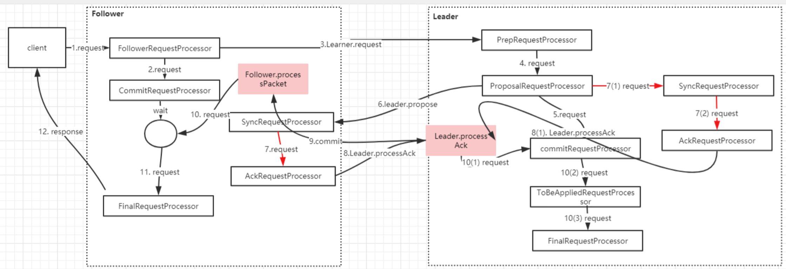

# zookeeper的watcher机制原理

## **Watcher** 的基本流程

zookeeper的watcher机制，总的来说可以分为三个过程：

- 客户端注册Watcher。
- 服务器处理Watcher。
- 客户端回调Watcher。

客户端注册 watcher有3种方式，getData、exists、getChildren。以如下代码为例,来分析整个触发机制的原理

### 基于zkclient客户端发起一个数据操作

```xml
<dependency>
    <groupId>com.101tec</groupId> 
    <artifactId>zkclient</artifactId> 
    <version>0.10</version>
</dependency>
```


```java
public class WatcherDemo {
    private static String CONNECTION_STR = "192.168.1.4:2181,192.168.1.4:2182,192.168.1.4:2183";


    public static void main (String[] args) throws KeeperException, InterruptedException, IOException {
        ZooKeeper zookeeper = new ZooKeeper(CONNECTION_STR, 4000, new Watcher() {
            @Override
            public void process(WatchedEvent event) {
                System.out.println("event.type" + event.getType());
            }
        });
        //创建节点
        zookeeper.create("/watch1", "0".getBytes(), ZooDefs.Ids.OPEN_ACL_UNSAFE, CreateMode.PERSISTENT);
        zookeeper.exists("/watch1", true); //注册监听
        Thread.sleep(1000);
        zookeeper.setData("/watch1", "1".getBytes(), -1); //修改节点的值触发监听
        System.in.read();
    }
}
```

### zookeeper客户端的初始化过程

```java
ZooKeeper zookeeper = new ZooKeeper(CONNECTION_STR, 4000, new Watcher() {
    @Override
    public void process(WatchedEvent event) {
        System.out.println("event.type" + event.getType());
    }
});
```

在创建一个zookeeper客户端对象实例时，我们通过new Watcher()向构造方法中传入一个默认的Watcher，这个Watcher将作为整个zookeeper会话期间默认Watcher，会一直被保存在客户端ZKWatchManager的defaultWatcher中，代码如下：

```java
public ZooKeeper(String connectString, int sessionTimeout, Watcher watcher, boolean canBeReadOnly) throws IOException {
    this.watchManager = new ZooKeeper.ZKWatchManager();
    LOG.info("Initiating client connection, connectString=" + connectString + " sessionTimeout=" + sessionTimeout + " watcher=" + watcher);
    this.watchManager.defaultWatcher = watcher;
    ConnectStringParser connectStringParser = new ConnectStringParser(connectString);
    HostProvider hostProvider = new StaticHostProvider(connectStringParser.getServerAddresses());
    this.cnxn = new ClientCnxn(connectStringParser.getChrootPath(), hostProvider, sessionTimeout, this, this.watchManager, getClientCnxnSocket(), canBeReadOnly);
    this.cnxn.start();
}
```

代码中ClientCnxn：是zookeeper客户端和zookeeper服务器端进行通信和事件通知处理的主要类，它内部包含两个类：

1. SendThread：负责客户端和服务器端的数据通信，也包括事件信息的传输。
2. EventThread：主要在客户端回调注册的Watcher进行通知处理。

### ClientCnxn初始化

```java
public ClientCnxn(String chrootPath, HostProvider hostProvider, int sessionTimeout, ZooKeeper zooKeeper, ClientWatchManager watcher, ClientCnxnSocket clientCnxnSocket, long sessionId, byte[] sessionPasswd, boolean canBeReadOnly) {
    this.authInfo = new CopyOnWriteArraySet();
    this.pendingQueue = new LinkedList();
    this.outgoingQueue = new LinkedList();
    this.sessionPasswd = new byte[16];
    this.closing = false;
    this.seenRwServerBefore = false;
    this.eventOfDeath = new Object();
    this.xid = 1;
    this.state = States.NOT_CONNECTED;
    this.zooKeeper = zooKeeper;
    this.watcher = watcher;
    this.sessionId = sessionId;
    this.sessionPasswd = sessionPasswd;
    this.sessionTimeout = sessionTimeout;
    this.hostProvider = hostProvider;
    this.chrootPath = chrootPath;
    this.connectTimeout = sessionTimeout / hostProvider.size();
    this.readTimeout = sessionTimeout * 2 / 3;
    this.readOnly = canBeReadOnly;
    // 初始化sendThread
    this.sendThread = new ClientCnxn.SendThread(clientCnxnSocket);
    // 初始化EventThread
    this.eventThread = new ClientCnxn.EventThread();
}

// 启动两个线程
public void start() {
    this.sendThread.start();
    this.eventThread.start();
}
```


## 服务器端接收请求处理流程

### NIOServerCnxnFactory#run

```java
//当收到客户端的请求时，会需要从这个方法里面来看-> create/delete/setdata
public void run() {
    while (!ss.socket().isClosed()) {
        try {
            selector.select(1000);
            Set<SelectionKey> selected;
            synchronized (this) {
                selected = selector.selectedKeys();
            }
            ArrayList<SelectionKey> selectedList = new ArrayList<SelectionKey>(
                    selected);
            Collections.shuffle(selectedList);
            for (SelectionKey k : selectedList) {
                if ((k.readyOps() & SelectionKey.OP_ACCEPT) != 0) {
                    SocketChannel sc = ((ServerSocketChannel) k
                            .channel()).accept();
                    InetAddress ia = sc.socket().getInetAddress();
                    int cnxncount = getClientCnxnCount(ia);
                    if (maxClientCnxns > 0 && cnxncount >= maxClientCnxns){
                        LOG.warn("Too many connections from " + ia
                                 + " - max is " + maxClientCnxns );
                        sc.close();
                    } else {
                        LOG.info("Accepted socket connection from "
                                 + sc.socket().getRemoteSocketAddress());
                        sc.configureBlocking(false);
                        SelectionKey sk = sc.register(selector,
                                SelectionKey.OP_READ);
                        NIOServerCnxn cnxn = createConnection(sc, sk);
                        sk.attach(cnxn);
                        addCnxn(cnxn);
                    }
                } else if ((k.readyOps() & (SelectionKey.OP_READ | SelectionKey.OP_WRITE)) != 0) {
                    NIOServerCnxn c = (NIOServerCnxn) k.attachment();
                    // 处理客户端发送的请求。
                    c.doIO(k);
                } else {
                    if (LOG.isDebugEnabled()) {
                        LOG.debug("Unexpected ops in select "
                                  + k.readyOps());
                    }
                }
            }
            selected.clear();
        } catch (RuntimeException e) {
            LOG.warn("Ignoring unexpected runtime exception", e);
        } catch (Exception e) {
            LOG.warn("Ignoring exception", e);
        }
    }
    closeAll();
    LOG.info("NIOServerCnxn factory exited run method");
}
```

其中```c.doIO(k);```处理客户端发送请求。


### NIOServerCnxn#doIO

```java
void doIO(SelectionKey k) throws InterruptedException {
    try {
        if (isSocketOpen() == false) {
            LOG.warn("trying to do i/o on a null socket for session:0x"
                     + Long.toHexString(sessionId));

            return;
        }
        if (k.isReadable()) {
            int rc = sock.read(incomingBuffer);
            if (rc < 0) {
                throw new EndOfStreamException(
                        "Unable to read additional data from client sessionid 0x"
                        + Long.toHexString(sessionId)
                        + ", likely client has closed socket");
            }
            if (incomingBuffer.remaining() == 0) {
                boolean isPayload;
                if (incomingBuffer == lenBuffer) { // start of next request
                    incomingBuffer.flip();
                    isPayload = readLength(k);
                    incomingBuffer.clear();
                } else {
                    // continuation
                    isPayload = true;
                }
                if (isPayload) { // not the case for 4letterword
                    // 处理请求。
                    readPayload();
                }
                else {
                    // four letter words take care
                    // need not do anything else
                    return;
                }
            }
        }
      // ....省略部分代码
}
```

### NIOServerCnxn#readPayload

```java
private void readPayload() throws IOException, InterruptedException {
    if (incomingBuffer.remaining() != 0) { // have we read length bytes?
        int rc = sock.read(incomingBuffer); // sock is non-blocking, so ok
        if (rc < 0) {
            throw new EndOfStreamException(
                    "Unable to read additional data from client sessionid 0x"
                    + Long.toHexString(sessionId)
                    + ", likely client has closed socket");
        }
    }

    if (incomingBuffer.remaining() == 0) { // have we read length bytes?
        packetReceived();
        incomingBuffer.flip();
        if (!initialized) {
            readConnectRequest();
        } else {
            // 处理请求
            readRequest();
        }
        lenBuffer.clear();
        incomingBuffer = lenBuffer;
    }
}
```

### NIOServerCnxn#readRequest

```java
private void readRequest() throws IOException {
    zkServer.processPacket(this, incomingBuffer);
}
```

### ZooKeeperServer#processPacket

处理客户端传送过来的数据包

```java
public void processPacket(ServerCnxn cnxn, ByteBuffer incomingBuffer) throws IOException {
    // We have the request, now process and setup for next
    InputStream bais = new ByteBufferInputStream(incomingBuffer);
    BinaryInputArchive bia = BinaryInputArchive.getArchive(bais);
    RequestHeader h = new RequestHeader();
    h.deserialize(bia, "header");
    // Through the magic of byte buffers, txn will not be
    // pointing
    // to the start of the txn
    incomingBuffer = incomingBuffer.slice();
    if (h.getType() == OpCode.auth) {
        LOG.info("got auth packet " + cnxn.getRemoteSocketAddress());
        AuthPacket authPacket = new AuthPacket();
        ByteBufferInputStream.byteBuffer2Record(incomingBuffer, authPacket);
        String scheme = authPacket.getScheme();
        AuthenticationProvider ap = ProviderRegistry.getProvider(scheme);
        Code authReturn = KeeperException.Code.AUTHFAILED;
        if(ap != null) {
            try {
                authReturn = ap.handleAuthentication(cnxn, authPacket.getAuth());
            } catch(RuntimeException e) {
                LOG.warn("Caught runtime exception from AuthenticationProvider: " + scheme + " due to " + e);
                authReturn = KeeperException.Code.AUTHFAILED;                   
            }
        }
        if (authReturn!= KeeperException.Code.OK) {
            if (ap == null) {
                LOG.warn("No authentication provider for scheme: "
                        + scheme + " has "
                        + ProviderRegistry.listProviders());
            } else {
                LOG.warn("Authentication failed for scheme: " + scheme);
            }
            // send a response...
            ReplyHeader rh = new ReplyHeader(h.getXid(), 0,
                    KeeperException.Code.AUTHFAILED.intValue());
            cnxn.sendResponse(rh, null, null);
            // ... and close connection
            cnxn.sendBuffer(ServerCnxnFactory.closeConn);
            cnxn.disableRecv();
        } else {
            if (LOG.isDebugEnabled()) {
                LOG.debug("Authentication succeeded for scheme: "
                          + scheme);
            }
            LOG.info("auth success " + cnxn.getRemoteSocketAddress());
            ReplyHeader rh = new ReplyHeader(h.getXid(), 0,
                    KeeperException.Code.OK.intValue());
            cnxn.sendResponse(rh, null, null);
        }
        return;
    } else {
        if (h.getType() == OpCode.sasl) {
            Record rsp = processSasl(incomingBuffer,cnxn);
            ReplyHeader rh = new ReplyHeader(h.getXid(), 0, KeeperException.Code.OK.intValue());
            cnxn.sendResponse(rh,rsp, "response"); // not sure about 3rd arg..what is it?
            return;
        }
        else {
            // 最终进入这个代码块进行处理
            // 封装请求对象
            Request si = new Request(cnxn, cnxn.getSessionId(), h.getXid(),
              h.getType(), incomingBuffer, cnxn.getAuthInfo());
            si.setOwner(ServerCnxn.me);
            // 负责在服务端提交当前请求
            submitRequest(si);
        }
    }
    cnxn.incrOutstandingRequests(h);
}
```

### ZooKeeperServer#submitRequest

负责在服务端提交当前请求

```java
public void submitRequest(Request si) {
    //processor处理器，request过来以后会经历一系列处理器的处理过程
    if (firstProcessor == null) {
        synchronized (this) {
            try {
                // Since all requests are passed to the request
                // processor it should wait for setting up the request
                // processor chain. The state will be updated to RUNNING
                // after the setup.
                while (state == State.INITIAL) {
                    wait(1000);
                }
            } catch (InterruptedException e) {
                LOG.warn("Unexpected interruption", e);
            }
            if (firstProcessor == null || state != State.RUNNING) {
                throw new RuntimeException("Not started");
            }
        }
    }
    try {
        touch(si.cnxn);
        boolean validpacket = Request.isValid(si.type);
        if (validpacket) {
            // 调用firstProcessor发起请求，而这个firstProcess是一个接口，有多个实现类，具体的调用链是怎么样的?
            firstProcessor.processRequest(si);
            if (si.cnxn != null) {
                incInProcess();
            }
        } else {
            LOG.warn("Received packet at server of unknown type " + si.type);
            new UnimplementedRequestProcessor().processRequest(si);
        }
    } catch (MissingSessionException e) {
        if (LOG.isDebugEnabled()) {
            LOG.debug("Dropping request: " + e.getMessage());
        }
    } catch (RequestProcessorException e) {
        LOG.error("Unable to process request:" + e.getMessage(), e);
    }
}
```

### **firstProcessor**的请求链组成

firstProcessor的初始化是在ZookeeperServer的setupRequestProcessor中完成的，代码如下:

```java
protected void setupRequestProcessors() {
    RequestProcessor finalProcessor = new FinalRequestProcessor(this);
    RequestProcessor syncProcessor = new SyncRequestProcessor(this,
            finalProcessor);
    ((SyncRequestProcessor)syncProcessor).start();
    firstProcessor = new PrepRequestProcessor(this, syncProcessor);
    ((PrepRequestProcessor)firstProcessor).start();
}
```

从上面我们可以看到firstProcessor的实例是一个PrepRequestProcessor，而这个构造方法中又传递了一个 Processor构成了一个调用链。 

RequestProcessor syncProcessor = new SyncRequestProcessor(this, finalProcessor); 

而 syncProcessor的构造方法传递的又是一个 Processor，对应的是FinalRequestProcessor。

**所以整个调用链是 PrepRequestProcessor -> SyncRequestProcessor - >FinalRequestProcessor** 


### PrepRequestProcessor#processRequest

通过上面了解到调用链关系以后，我们继续再看firstProcessor.processRequest(si)。会调用到 PrepRequestProcessor 

```java
public void processRequest(Request request) {
    // request.addRQRec(">prep="+zks.outstandingChanges.size());
    submittedRequests.add(request);
}
```

processRequest只是把request添加到submittedRequests中，根据前面的经验，很自然的想到这里又是一个异步操作。而 subittedRequests 又是一个阻塞队列 

```java
LinkedBlockingQueue<Request> submittedRequests = new LinkedBlockingQueue<Request>();
```

而PrepRequestProcessor这个类又继承了线程类，因此我们直接找到当前类中的run方法如下:

```java
@Override
public void run() {
    try {
        while (true) {
            Request request = submittedRequests.take();
            long traceMask = ZooTrace.CLIENT_REQUEST_TRACE_MASK;
            if (request.type == OpCode.ping) {
                traceMask = ZooTrace.CLIENT_PING_TRACE_MASK;
            }
            if (LOG.isTraceEnabled()) {
                ZooTrace.logRequest(LOG, traceMask, 'P', request, "");
            }
            if (Request.requestOfDeath == request) {
                break;
            }
            // 处理代码
            pRequest(request);
        }
    } catch (RequestProcessorException e) {
        if (e.getCause() instanceof XidRolloverException) {
            LOG.info(e.getCause().getMessage());
        }
        handleException(this.getName(), e);
    } catch (Exception e) {
        handleException(this.getName(), e);
    }
    LOG.info("PrepRequestProcessor exited loop!");
}
```

### PrepRequestProcessor#pRequest

找到这段代码继续往下看：

```java
nextProcessor.processRequest(request);
```

### SyncRequestProcessor#processRequest

这里也是一个异步处理：

```java
public void processRequest(Request request) {
    // request.addRQRec(">sync");
    queuedRequests.add(request);
}
```

### SyncRequestProcessor#run

其他代码省略。继续往下走调用：```org.apache.zookeeper.server.FinalRequestProcessor#processRequest```

```java
nextProcessor.processRequest(i);
```

### FinalRequestProcessor#processRequest

FinalRequestProcessor.processRequest 方法并根据 Request 对象中的操作更新内 存中Session信息或者 znode数据。 

这个方法代码太多这里只看关键代码：

```java
case OpCode.exists: {
    lastOp = "EXIS";
    // TODO we need to figure out the security requirement for this!
    ExistsRequest existsRequest = new ExistsRequest();
    // 反序列化 (将ByteBuffer反序列化成为ExitsRequest.这个就是我们在客户端发起请求的时候传递过来的 Request对象
    ByteBufferInputStream.byteBuffer2Record(request.request,
            existsRequest);
    String path = existsRequest.getPath();
    if (path.indexOf('\0') != -1) {
        throw new KeeperException.BadArgumentsException();
    }
    // 终于找到一个很关键的代码，判断请求的getWatch是否存在，如果存在，则传递cnxn(servercnxn)
	// 对于exists请求，需要监听data变化事件，添加watcher
    Stat stat = zks.getZKDatabase().statNode(path, existsRequest
            .getWatch() ? cnxn : null);
    // 在服务端内存数据库中根据路径得到结果进行组装，设置为ExistsResponse
    rsp = new ExistsResponse(stat);
    break;
}
```

## 客户端接收服务端处理完成响应

### ClientCnxnSocketNIO#doIO

服务端处理完成以后，会通过NIOServerCnxn.sendResponse发送返回的响应信息，客户端会在ClientCnxnSocketNIO.doIO接收服务端的返回，**注意一下SendThread.readResponse,接收服务端的信息进行读取** 

```java
void doIO(List<Packet> pendingQueue, LinkedList<Packet> outgoingQueue, ClientCnxn cnxn)
  throws InterruptedException, IOException {
    SocketChannel sock = (SocketChannel) sockKey.channel();
    if (sock == null) {
        throw new IOException("Socket is null!");
    }
    if (sockKey.isReadable()) {
        int rc = sock.read(incomingBuffer);
        if (rc < 0) {
            throw new EndOfStreamException(
                    "Unable to read additional data from server sessionid 0x"
                            + Long.toHexString(sessionId)
                            + ", likely server has closed socket");
        }
        if (!incomingBuffer.hasRemaining()) {
            incomingBuffer.flip();
            if (incomingBuffer == lenBuffer) {
                recvCount++;
                readLength();
            } else if (!initialized) {
                readConnectResult();
                enableRead();
                if (findSendablePacket(outgoingQueue,
                        cnxn.sendThread.clientTunneledAuthenticationInProgress()) != null) {
                    // Since SASL authentication has completed (if client is configured to do so),
                    // outgoing packets waiting in the outgoingQueue can now be sent.
                    enableWrite();
                }
                lenBuffer.clear();
                incomingBuffer = lenBuffer;
                updateLastHeard();
                initialized = true;
            } else {
                // 接收服务端的信息进行读取
                sendThread.readResponse(incomingBuffer);
                lenBuffer.clear();
                incomingBuffer = lenBuffer;
                updateLastHeard();
            }
        }
    }
    // ....省略部分代码
}
```

### ClientCnxn.SendThread#readResponse

```
这个方法里面主要的流程如下
```

首先读取 header，如果其xid == -2，表明是一个ping的 response，return 

如果 xid是 -4 ，表明是一个AuthPacket的 response return 

如果 xid 是 -1，表明是一个notification,此时要继续读取并构造一个 enent，通过 EventThread.queueEvent 发送，return 

其它情况下: 

从pendingQueue拿出一个 Packet，校验后更新packet信息 

```java
void readResponse(ByteBuffer incomingBuffer) throws IOException {
    ByteBufferInputStream bbis = new ByteBufferInputStream(
            incomingBuffer);
    BinaryInputArchive bbia = BinaryInputArchive.getArchive(bbis);
    ReplyHeader replyHdr = new ReplyHeader();

    replyHdr.deserialize(bbia, "header");
    // ping的 response，return 
    if (replyHdr.getXid() == -2) {
        // -2 is the xid for pings
        if (LOG.isDebugEnabled()) {
            LOG.debug("Got ping response for sessionid: 0x"
                    + Long.toHexString(sessionId)
                    + " after "
                    + ((System.nanoTime() - lastPingSentNs) / 1000000)
                    + "ms");
        }
        return;
    }
    // AuthPacket的 response return 
    if (replyHdr.getXid() == -4) {
        // -4 is the xid for AuthPacket               
        if(replyHdr.getErr() == KeeperException.Code.AUTHFAILED.intValue()) {
            state = States.AUTH_FAILED;                    
            eventThread.queueEvent( new WatchedEvent(Watcher.Event.EventType.None, 
                    Watcher.Event.KeeperState.AuthFailed, null) );                                  
        }
        if (LOG.isDebugEnabled()) {
            LOG.debug("Got auth sessionid:0x"
                    + Long.toHexString(sessionId));
        }
        return;
    }
    // notification,此时要继续读取并构造一个 enent，通过EventThread.queueEvent发送，return 
    if (replyHdr.getXid() == -1) {
        // -1 means notification
        if (LOG.isDebugEnabled()) {
            LOG.debug("Got notification sessionid:0x"
                + Long.toHexString(sessionId));
        }
        WatcherEvent event = new WatcherEvent();
        // 反序列化响应信息
        event.deserialize(bbia, "response");

        // convert from a server path to a client path
        if (chrootPath != null) {
            String serverPath = event.getPath();
            if(serverPath.compareTo(chrootPath)==0)
                event.setPath("/");
            else if (serverPath.length() > chrootPath.length())
                event.setPath(serverPath.substring(chrootPath.length()));
            else {
               LOG.warn("Got server path " + event.getPath()
                     + " which is too short for chroot path "
                     + chrootPath);
            }
        }

        WatchedEvent we = new WatchedEvent(event);
        if (LOG.isDebugEnabled()) {
            LOG.debug("Got " + we + " for sessionid 0x"
                    + Long.toHexString(sessionId));
        }

        eventThread.queueEvent( we );
        return;
    }

    // If SASL authentication is currently in progress, construct and
    // send a response packet immediately, rather than queuing a
    // response as with other packets.
    if (clientTunneledAuthenticationInProgress()) {
        GetSASLRequest request = new GetSASLRequest();
        request.deserialize(bbia,"token");
        zooKeeperSaslClient.respondToServer(request.getToken(),
          ClientCnxn.this);
        return;
    }

    Packet packet;
    synchronized (pendingQueue) {
        if (pendingQueue.size() == 0) {
            throw new IOException("Nothing in the queue, but got "
                    + replyHdr.getXid());
        }
        // 因为当前这个数据包已经收到了响应，所以将它从pendingQueued中移除
        packet = pendingQueue.remove();
    }
    /*
     * Since requests are processed in order, we better get a response
     * to the first request!
     */
    try {
        // 校验数据包信息，校验成功后将数据包信息进行更新(替换为服务端的信息)
        if (packet.requestHeader.getXid() != replyHdr.getXid()) {
            packet.replyHeader.setErr(
                    KeeperException.Code.CONNECTIONLOSS.intValue());
            throw new IOException("Xid out of order. Got Xid "
                    + replyHdr.getXid() + " with err " +
                    + replyHdr.getErr() +
                    " expected Xid "
                    + packet.requestHeader.getXid()
                    + " for a packet with details: "
                    + packet );
        }

        packet.replyHeader.setXid(replyHdr.getXid());
        packet.replyHeader.setErr(replyHdr.getErr());
        packet.replyHeader.setZxid(replyHdr.getZxid());
        if (replyHdr.getZxid() > 0) {
            lastZxid = replyHdr.getZxid();
        }
        if (packet.response != null && replyHdr.getErr() == 0) {
            //获得服务端的响应，反序列化以后设置到packet.response属性中。所以我们可以在exists 方法的最后一行通过packet.response拿到该果
            packet.response.deserialize(bbia, "response");
        }

        if (LOG.isDebugEnabled()) {
            LOG.debug("Reading reply sessionid:0x"
                    + Long.toHexString(sessionId) + ", packet:: " + packet);
        }
    } finally {
        // 把从Packet中取出对应的Watcher并注册到ZKWatchManager中去
        finishPacket(packet);
    }
}
```

### ClientCnxn#finishPacket

```java
private void finishPacket(Packet p) {
    if (p.watchRegistration != null) {
        //将事件注册到zkwatchemanager中
        p.watchRegistration.register(p.replyHeader.getErr());
    }

    //cb 就是 AsnycCallback，如果为 null，表明是同步调用的接口，不需要异 步回掉，因此，直接 notifyAll 即可。
    if (p.cb == null) {
        synchronized (p) {
            p.finished = true;
            p.notifyAll();
        }
    } else {
        p.finished = true;
        eventThread.queuePacket(p);
    }
}
```

watchRegistration，熟悉吗?在组装请求的时候，我们初始化了这个对象把watchRegistration子类里面的 Watcher实例放到ZKWatchManager的exists Watches中存储起来。 

#### WatchRegistration#register 

```java
public void register(int rc) {
    if (shouldAddWatch(rc)) {
        //通过子类的实现取得ZKWatchManager 中的 existsWatches
        Map<String, Set<Watcher>> watches = getWatches(rc);
        synchronized(watches) {
            Set<Watcher> watchers = watches.get(clientPath);
            if (watchers == null) {
                watchers = new HashSet<Watcher>();
                watches.put(clientPath, watchers);
            }
            //将Watcher对象放到ZKWatchManager中的existsWatches里面
            watchers.add(watcher);
        }
    }
}
```

下面这段代码是客户端存储watcher的几个map集合，分别对应三种注册监听事件 

```java
private final Map<String, Set<Watcher>> dataWatches =
    new HashMap<String, Set<Watcher>>();
private final Map<String, Set<Watcher>> existWatches =
    new HashMap<String, Set<Watcher>>();
private final Map<String, Set<Watcher>> childWatches =
    new HashMap<String, Set<Watcher>>();
```

总的来说，当使用 ZooKeeper 构造方法或者使用 getData、exists 和getChildren 三个接口来向ZooKeeper服务器注册Watcher的时候，首先将此消息传递给服务端，传递成功后，服务端会通知客户端，然后客户端将该路径和 Watcher 对应关系存储起来备用。 

#### EventThread#queuePacket

finishPacket方法最终会调用eventThread.queuePacket， 将当前的数据包添加到等待事件通知的队列中 

```
public void queuePacket(Packet packet) {
   if (wasKilled) {
      synchronized (waitingEvents) {
         if (isRunning) waitingEvents.add(packet);
         else processEvent(packet);
      }
   } else {
      waitingEvents.add(packet);
   }
}
```

## 事件触发

前面这么长的说明，只是为了清晰的说明事件的注册流程，最终的触发，还得需要通过事务型操作来完成。

在我们最开始的案例中，通过如下代码去完成了事件的触发

```zookeeper.setData(“/mic”, “1”.getByte(),-1) ; *//*修改节点的值触发监听```

前面的客户端和服务端对接的流程就不再重复讲解了，交互流程是一样的，唯一的 

差别在于事件触发了 

### 服务端的事件响应DataTree.setData

```java
public Stat setData(String path, byte data[], int version, long zxid,
            long time) throws KeeperException.NoNodeException {
        Stat s = new Stat();
        DataNode n = nodes.get(path);
        if (n == null) {
            throw new KeeperException.NoNodeException();
        }
        byte lastdata[] = null;
        synchronized (n) {
            lastdata = n.data;
            n.data = data;
            n.stat.setMtime(time);
            n.stat.setMzxid(zxid);
            n.stat.setVersion(version);
            n.copyStat(s);
        }
        // now update if the path is in a quota subtree.
        String lastPrefix;
        if((lastPrefix = getMaxPrefixWithQuota(path)) != null) {
          this.updateBytes(lastPrefix, (data == null ? 0 : data.length)
              - (lastdata == null ? 0 : lastdata.length));
        }
    	// 触发对应节点的NodeDataChanged事件
        dataWatches.triggerWatch(path, EventType.NodeDataChanged);
        return s;
    }
```

#### WatchManager#triggerWatch

```java
public Set<Watcher> triggerWatch(String path, EventType type, Set<Watcher> supress) {
    // 根据事件类型、连接状态、节点路径创建WatchedEvent
    WatchedEvent e = new WatchedEvent(type,KeeperState.SyncConnected, path);
    HashSet<Watcher> watchers;
    synchronized (this) {
        // 从watcher表中移除path，并返回其对应的watcher集合
        watchers = watchTable.remove(path);
        if (watchers == null || watchers.isEmpty()) {
            if (LOG.isTraceEnabled()) {
                ZooTrace.logTraceMessage(LOG,
                        ZooTrace.EVENT_DELIVERY_TRACE_MASK,
                        "No watchers for " + path);
            }
            return null;
        }
        // 遍历watcher集合
        for (Watcher w : watchers) {
            // 根据watcher从watcher表中取出路径集合
            HashSet<String> paths = watch2Paths.get(w);
            if (paths != null) {
                //移除路径
                paths.remove(path);
            }
        }
    }
    // 遍历watcher集合
    for (Watcher w : watchers) {
        if (supress != null && supress.contains(w)) {
            continue;
        }
        // 这里处理了什么？
        w.process(e);
    }
    return watchers;
}
```

#### NIOServerCnxn#process

w.process(e)，其实调用的应该是ServerCnxn的process方法。而servercnxn又是一个抽象方法，有两个实现类，分别是:NIOServerCnxn和NIOServerCnxn。那接下来我们看看NIOServerCnxn这个类的process方法看看究 竟。

```java
@Override
synchronized public void process(WatchedEvent event) {
    ReplyHeader h = new ReplyHeader(-1, -1L, 0);
    if (LOG.isTraceEnabled()) {
        ZooTrace.logTraceMessage(LOG, ZooTrace.EVENT_DELIVERY_TRACE_MASK,
                                 "Deliver event " + event + " to 0x"
                                 + Long.toHexString(this.sessionId)
                                 + " through " + this);
    }

    // Convert WatchedEvent to a type that can be sent over the wire
    WatcherEvent e = event.getWrapper();

    //这个地方发送了一个事件，事件对象为WatcherEvent。
    sendResponse(h, e, "notification");
}
```

接下里，客户端会收到这个response，触发SendThread.readResponse方法 

### 客户端处理事件

#### ClientCnxn.SendThread#readResponse

notifacation通知消息的 xid 为-1，意味着~直接找到-1的判断进行分析。

```java
void readResponse(ByteBuffer incomingBuffer) throws IOException {
    // ....省略部分代码
    if (replyHdr.getXid() == -1) {
        // -1 means notification
        if (LOG.isDebugEnabled()) {
            LOG.debug("Got notification sessionid:0x"
                + Long.toHexString(sessionId));
        }
        WatcherEvent event = new WatcherEvent();
        //这个地方，是反序列化服务端的WatcherEvent事件。
        event.deserialize(bbia, "response");

        // convert from a server path to a client path
        if (chrootPath != null) {
            String serverPath = event.getPath();
            if(serverPath.compareTo(chrootPath)==0)
                event.setPath("/");
            else if (serverPath.length() > chrootPath.length())
                event.setPath(serverPath.substring(chrootPath.length()));
            else {
               LOG.warn("Got server path " + event.getPath()
                     + " which is too short for chroot path "
                     + chrootPath);
            }
        }

        // 组装watchedEvent对象。
        WatchedEvent we = new WatchedEvent(event);
        if (LOG.isDebugEnabled()) {
            LOG.debug("Got " + we + " for sessionid 0x"
                    + Long.toHexString(sessionId));
        }
		// 通过eventThread进行事件处理
        eventThread.queueEvent( we );
        return;
    }

    // If SASL authentication is currently in progress, construct and
    // send a response packet immediately, rather than queuing a
    // response as with other packets.
    if (clientTunneledAuthenticationInProgress()) {
        GetSASLRequest request = new GetSASLRequest();
        request.deserialize(bbia,"token");
        zooKeeperSaslClient.respondToServer(request.getToken(),
          ClientCnxn.this);
        return;
    }

    Packet packet;
    synchronized (pendingQueue) {
        if (pendingQueue.size() == 0) {
            throw new IOException("Nothing in the queue, but got "
                    + replyHdr.getXid());
        }
        packet = pendingQueue.remove();
    }
    /*
     * Since requests are processed in order, we better get a response
     * to the first request!
     */
    try {
        if (packet.requestHeader.getXid() != replyHdr.getXid()) {
            packet.replyHeader.setErr(
                    KeeperException.Code.CONNECTIONLOSS.intValue());
            throw new IOException("Xid out of order. Got Xid "
                    + replyHdr.getXid() + " with err " +
                    + replyHdr.getErr() +
                    " expected Xid "
                    + packet.requestHeader.getXid()
                    + " for a packet with details: "
                    + packet );
        }

        packet.replyHeader.setXid(replyHdr.getXid());
        packet.replyHeader.setErr(replyHdr.getErr());
        packet.replyHeader.setZxid(replyHdr.getZxid());
        if (replyHdr.getZxid() > 0) {
            lastZxid = replyHdr.getZxid();
        }
        if (packet.response != null && replyHdr.getErr() == 0) {
            packet.response.deserialize(bbia, "response");
        }

        if (LOG.isDebugEnabled()) {
            LOG.debug("Reading reply sessionid:0x"
                    + Long.toHexString(sessionId) + ", packet:: " + packet);
        }
    } finally {
        finishPacket(packet);
    }
}
```

#### ClientCnxn.EventThread#queueEvent

SendThread接收到服务端的通知事件后，会通过调用EventThread类的queueEvent方法将事件传给 EventThread线程，queueEvent方法根据该通知事件，从ZKWatchManager中取出所有相关的Watcher，如果获取到相应的Watcher，就 会让Watcher移除失效。 

```java
public void queueEvent(WatchedEvent event) {
    // 判断类型
    if (event.getType() == EventType.None
            && sessionState == event.getState()) {
        return;
    }
    sessionState = event.getState();

    // materialize the watchers based on the event
    //封装WatcherSetEventPair对象，添加到waitngEvents队列中
    WatcherSetEventPair pair = new WatcherSetEventPair(
            watcher.materialize(event.getState(), event.getType(),
                    event.getPath()),
                    event);
    // queue the pair (watch set & event) for later processing
    waitingEvents.add(pair);
}
```

#### ZKWatchManager#materialize

通过dataWatches或者existWatches或者childWatches的remove取出对应的watch，表明客户端watch也是注册一次就移除，同时需要根据keeperState、eventType和path返回应该被通知的Watcher集合。 

```java
@Override
    public Set<Watcher> materialize(Watcher.Event.KeeperState state,
                                    Watcher.Event.EventType type,
                                    String clientPath)
    {
        Set<Watcher> result = new HashSet<Watcher>();

        switch (type) {
        case None:
            result.add(defaultWatcher);
            boolean clear = ClientCnxn.getDisableAutoResetWatch() &&
                    state != Watcher.Event.KeeperState.SyncConnected;

            synchronized(dataWatches) {
                for(Set<Watcher> ws: dataWatches.values()) {
                    result.addAll(ws);
                }
                if (clear) {
                    dataWatches.clear();
                }
            }

            synchronized(existWatches) {
                for(Set<Watcher> ws: existWatches.values()) {
                    result.addAll(ws);
                }
                if (clear) {
                    existWatches.clear();
                }
            }

            synchronized(childWatches) {
                for(Set<Watcher> ws: childWatches.values()) {
                    result.addAll(ws);
                }
                if (clear) {
                    childWatches.clear();
                }
            }

            return result;
        case NodeDataChanged:
        case NodeCreated:
            synchronized (dataWatches) {
                addTo(dataWatches.remove(clientPath), result);
            }
            synchronized (existWatches) {
                addTo(existWatches.remove(clientPath), result);
            }
            break;
        case NodeChildrenChanged:
            synchronized (childWatches) {
                addTo(childWatches.remove(clientPath), result);
            }
            break;
        case NodeDeleted:
            synchronized (dataWatches) {
                addTo(dataWatches.remove(clientPath), result);
            }
            // XXX This shouldn't be needed, but just in case
            synchronized (existWatches) {
                Set<Watcher> list = existWatches.remove(clientPath);
                if (list != null) {
                    addTo(existWatches.remove(clientPath), result);
                    LOG.warn("We are triggering an exists watch for delete! Shouldn't happen!");
                }
            }
            synchronized (childWatches) {
                addTo(childWatches.remove(clientPath), result);
            }
            break;
        default:
            String msg = "Unhandled watch event type " + type
                + " with state " + state + " on path " + clientPath;
            LOG.error(msg);
            throw new RuntimeException(msg);
        }

        return result;
    }
}
```

#### waitingEvents.add

waitingEvents是EventThread这个线程中的阻塞队列，很明显，又是在我们第一步操作的时候实例化的一个线程。 

从名字可以知道，waitingEvents是一个待处理Watcher的队列，EventThread的run()方法会不断从队列中取数据，交由processEvent方法处理: 

```java
@Override
public void run() {
   try {
      isRunning = true;
      while (true) {
         Object event = waitingEvents.take();
         if (event == eventOfDeath) {
            wasKilled = true;
         } else {
            processEvent(event);
         }
         if (wasKilled)
            synchronized (waitingEvents) {
               if (waitingEvents.isEmpty()) {
                  isRunning = false;
                  break;
               }
            }
      }
   } catch (InterruptedException e) {
      LOG.error("Event thread exiting due to interruption", e);
   }

    LOG.info("EventThread shut down for session: 0x{}",
             Long.toHexString(getSessionId()));
}
```

#### ClientCnxn.EventThread#processEvent

```java
private void processEvent(Object event) {
   try {
       if (event instanceof WatcherSetEventPair) {
           // each watcher will process the event
           WatcherSetEventPair pair = (WatcherSetEventPair) event;
           for (Watcher watcher : pair.watchers) {
               try {
                   watcher.process(pair.event);
               } catch (Throwable t) {
                   LOG.error("Error while calling watcher ", t);
               }
           }
       // ...省略部分代码
}
```

## 集群模式下的数据处理流程

集群模式下，涉及到 zab 协议，所以处理流程比较复杂，大家可以基于这个图来 定位代码的流程 ：



