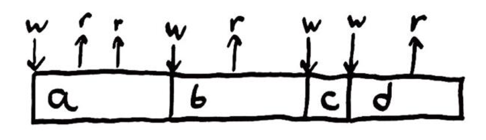
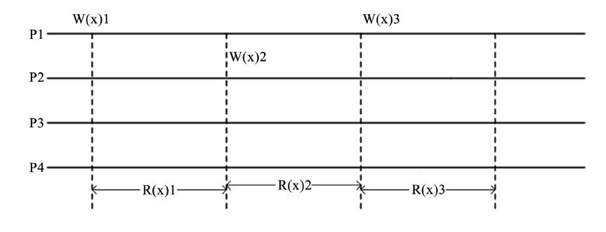
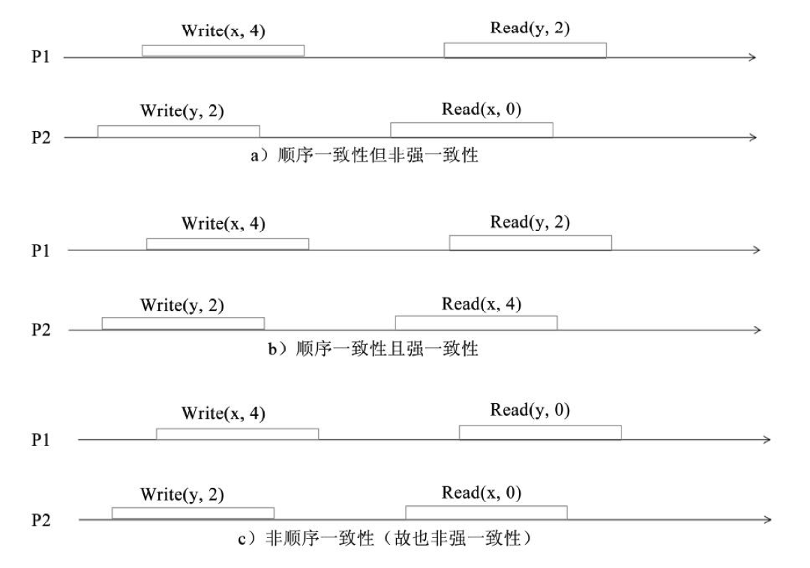
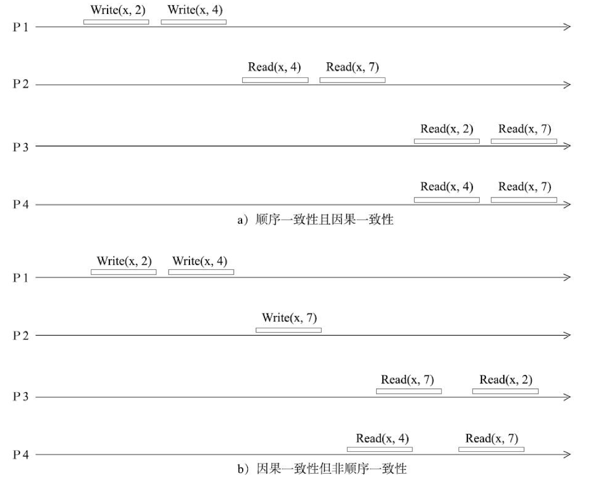
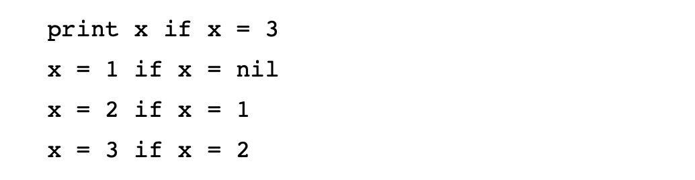
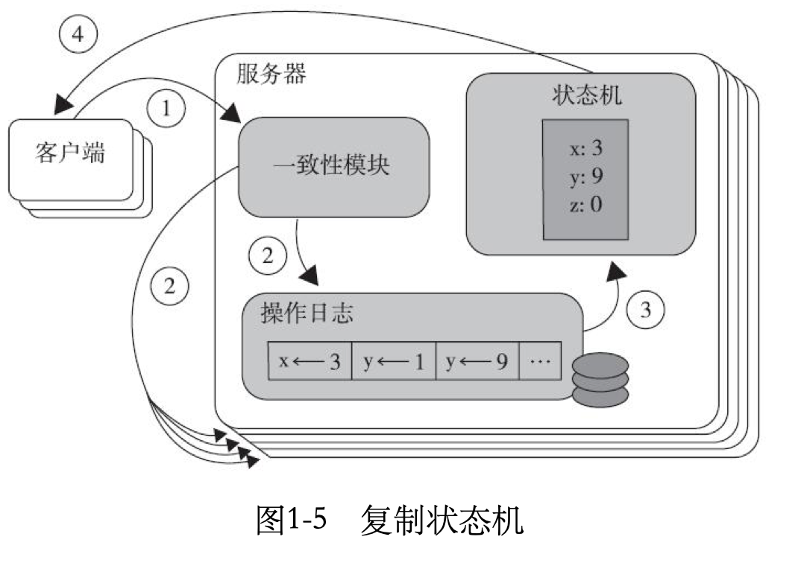

# 分布式系统与一致性协议

计算能力的提升在很多时候都是源于系统采用了分布式架构。分布式系统是一个硬件或软件组件分布在不同的网络计算机上，彼此之间仅仅通过消息传递进行通信和协调的系统。

简单来说，分布式系统就是一组计算机节点和软件共同对外提供服务的系统。但对于用户来说，操作分布式系统就好像是在请求一个服务器。因为在分布式系统中，各个节点之间的写作是通过网络进行的，所以分布式系统中的节点在空间分布上几乎没有任何限制。可以分布于不同的机柜、机房，甚至是不同的国家和地区。

分布式系统的设计目标一般包括以下几个方面。

- 可用性：可用性是分布式系统的核心需求，其用于衡量一个分布式系统持续对外提供服务的能力。
- 可扩展性：增加机器后不会改变或极少改变系统行为，并且能够获得近似线性的性能提升。
- 容错性：系统发生错误时，具有对错误进行规避以及从错误中恢复的能力。
- 性能：对外服务的响应延时和吞吐率要能满足用户的需求。

虽然分布式架构可以组件一个强大的集群，但实际工作中遇到的挑战要比传统单体架构大得多，具体表现如下：

1. 节点之间的网络通信是不可靠的，存在网络延时和丢包等情况。
2. 存在节点处理错误的情况，节点自身随时也有宕机的可能。
3. 同步调用使系统变得不具备可扩展性。

## CAP原理

提到分布式系统，就不得不提CAP原理。CAP原理在计算机科学领域广为人知，如果说系统架构师将CAP原理视作分布式系统的设计准则也一点不为过。

CAP原理的完整定义：

- C：Consistency（一致性）。这里一致性特指强一致，通俗的说，就是所有节点上的数据时刻保持同步。一致性严谨的表述是原子读写，即所有读写都应该看起来是“原子”的，或串行的。所有的读写请求都好像是经全局排序过一样，写后面的读一定能读到前面锁写的内容。
- A：Availabilit（可用性）。任何非故障节点都应该在有限的时间内给出请求的响应，不论请求是否成功。
- P：Tolerance to the partition of network(分区容忍性)。当发生网络分区时（即节点之间无法通信），在丢失任意多消息的情况下，系统仍然能够正常工作。

相信大家都非常清楚CAP原理的知道意义：在任何分布式系统中，可用性、一致性和分区容忍性这三个方面是相互矛盾的，三者不可兼得，最多只能取其二。例如：

1. AP满足但C不满足：如果即要求系统高可用又要求分区容错，那么就要放弃一致性了（C）。因为一旦发生网络分区（P），节点之间将无法通信，为什么满足高可用（A），每个节点只能用本地数据提供服务，这样就会导致数据不一致（！C）。一些遵守BASE原则数据库，（如：Cassandra、CouchDB等）往往会放宽对一致性的要求（满足最终一致性即可），一次来获取基本的可用性。
2. CP满足但A不满足：如果要求数据在各个服务器上是强一致的（C）,然而网络分区（P）会导致同步时间无限延长，那么如此一来可用性就得不到保障了（！A）。坚持事务ACID（原子性、一致性、隔离性和持久性）的传统数据库以及对结果一致性非常敏感的应用通常会做出这样的选择。
3. CA满足但P不满足：指的是如果不存在网络分区，那么强一致性和可用性可以同时满足的。

CAP原理明确指出了完美满足CAP三种属性的分布式系统是不存在的。了解CAP原理的目的在于，其能够帮助我们更好的理解实际分布式协议实现过程中的取舍。

### BASE理论

BASE：全称：Basically Available(基本可用)，Soft state（软状态）,和 Eventually consistent（最终一致性）三个短语的缩写，来自 ebay 的架构师提出。

Base 理论是对 CAP 中一致性和可用性权衡的结果，其来源于对大型互联网分布式实践的总结，是基于 CAP 定理逐步演化而来的。其核心思想是：

既是无法做到强一致性（Strong consistency），但每个应用都可以根据自身的业务特点，采用适当的方式来使系统达到最终一致性（Eventual consistency）。

####  Basically Available(基本可用)

什么是基本可用呢？假设系统，出现了不可预知的故障，但还是能用，相比较正常的系统而言：

1. 响应时间上的损失：正常情况下的搜索引擎 0.5 秒即返回给用户结果，而**基本可用**的搜索引擎可以在 1 秒作用返回结果。
2. 功能上的损失：在一个电商网站上，正常情况下，用户可以顺利完成每一笔订单，但是到了大促期间，为了保护购物系统的稳定性，部分消费者可能会被引导到一个降级页面。

#### Soft state（软状态）

什么是软状态呢？相对于原子性而言，要求多个节点的数据副本都是一致的，这是一种 “硬状态”。

软状态指的是：允许系统中的数据存在中间状态，并认为该状态不影响系统的整体可用性，即允许系统在多个不同节点的数据副本存在数据延时。

#### Eventually consistent（最终一致性）

这个比较好理解了哈。

上面说软状态，然后不可能一直是软状态，必须有个时间期限。在期限过后，应当保证所有副本保持数据一致性。从而达到数据的最终一致性。这个时间期限取决于网络延时，系统负载，数据复制方案设计等等因素。

稍微官方一点的说法就是：

系统能够保证在没有其他新的更新操作的情况下，数据最终一定能够达到一致的状态，因此所有客户端对系统的数据访问最终都能够获取到最新的值。

#### 总结

总的来说，BASE 理论面向的是大型高可用可扩展的分布式系统，和传统事务的 ACID 是**相反的**，它完全不同于 ACID 的强一致性模型，而是**通过牺牲强一致性**来获得可用性，并允许数据在一段时间是不一致的。

## 一致性

在阐述一致性模型和一致性协议之前，我们先来了解一下什么是一致性。分布式存储系统通常会通过维护多个副本来进行容错，以提高系统的可用性。这就引出了分布式存储系统的核心问题——如何保证多个副本的一致性？

“一致性”这个中文术语在计算机的不同领域具有不同的含义，不同的含义对应的英文术语也是不一样的，例如，Coherence、Consensus、Consistency等。就这三个术语尔雅，简单来说，它们之间的区别具体如下：

- Coherence这个单词只在Chche Coherence场景下出现过，其所关注的是多核共享内存的CPU架构下，各个核的Cache上的数据应如何保持一致。
- Consensus是共识，它强调的是多个提议者就某件事情达成共识，其所关注的是达成共识的过程，例如Paxos协议、Raft选举、Zab协议等。Consensus属于replication protocol的范畴。
- Consistency表达的含义相对复杂一些，广义上说，它描述了系统本身的不变量的维护程度对上层业务客户端的影响，以及该系统的并发状态会想客户端暴露什么样的异常行为。CAP、ACID中的C都有这层意思。

这里讨论的一致性问题属于上文中提到的Consensus和Consistency。分布式系统的一致性是一个具备容错能力的分布式系统要解决的基本问题。通俗的讲，一致性就是不同的副本服务器认可同一份数据。一旦这些服务器对某份数据达成了一致，那么该决定便是最终的决定，且未来也无法推翻。

一致性于结果的正确性没有关系，而是系统对外呈现的状态是否一致（统一）。例如，所有节点都达成一个错误的共识也是一致性的一种表现。

> 注意：一致性协议就是用来解决一致性问题的，它能使得一组机器像一个整体一样工作，即使其中一些机器发生了错误也能正常工作。正因为如此，一致性协议在大规模分布式系统中扮演关键角色。

同时，一致性协议衍生出了很多算法。衡量一个一致性算法的标准具体如下：

- 可终止性：非失败进程在有限时间内能够做出决定，等价于liveness。
- 一致性：所有的进程必须对最终的决定达成一致，等价于safety。
- 合法性：算法做出的决定值必须在其他进程（客户端）的期望值范围之内。

一致性协议是在复制状态机（Replicated State Machines，RSM）的背景下提出来的，通常也应用于具有复制状态机语义的场景。在了解复制状态机之前，让我们先了解一下一致性模型。

### 一致性模型

一致性问题一直以来都是分布式系统的痛点，因为很多场景都要求一致性，但并不是所有的系统都要求是强一致的。强一致需要极高的成本，我们需要根据系统的容忍度适当放宽一致性的要求。

在很多人看来，银行间装张应该是强一致性的，但是如果仔细分析一下就会发现，小王向小张转账1000元，小王的账户扣除了1000元，此时小张并不一定会同步收到1000元，可能会存在一个不一致的事件窗口。也就是小王的账户中扣除1000元，此时小张还么收到1000元。

另外一个常见的例子，12306网站上买票的功能也未必是强一致，如果你在12306上发现某车次的票还剩余10张，发起请求订了一张票，系统返回的信息可能是“正在排队，剩余10张票，现在有15人在购买”，而不是购买成功或者购买失败的结果，很可能你在收到上述信息之后，不得不去查询未完成订单，以进一步确认订票情况。如果有人退了一张票，通常这张票也不会立即返回到票池中。很明显这里也存在不一致的事件窗口。

这里重点讨论分布式系统的一致性模型。我们知道，分布式系统中网络分区在任何时刻、任何地点都有可能正在或即将发生。交换机、网卡、主机硬件、操作系统、硬盘、虚拟化层和语言运行时间更不用说程序语义本身，都会延误、丢失、复制或重新排序我们的消息。在一个不确定的世界里，我们肯定都是希望自己的软件能够按照确定的规则运行。

那么，很显然我们需要直观的正确性。做正确的事情！那么究竟什么是正确的呢？我们又该如何描述它呢？

#### 正确性

我们又很多种方法表达一个算法的抽象行为，比如前文中介绍的状态机模型——“一个系统是由状态以及改变这些状态的操作组成的”，随着系统的运行，它会通过一些操作历史从一个状态转移到另一个状态。

如果我们的状态是一个变量，状态上的操作可能是写入和读取该变量，那么，如下这个简单的Ruby程序将会多次写入和读取一个变量，并将其打印到屏幕上，以说明读取的内容。实例代码如下：

在上述代码示例里，我们已经有了这个程序正确性的直观模型：它应该答应“aabd”。为什么？应为每个陈述都是按顺序发生的。首先写入一个值a，然后是读取两次值a，再写入值b，然后读取值b等。上述寄存器系统读写数据具体如图：

我么能将这种一个变量携带一个值的系统成为寄存器。一旦我们将一个变量设置为某个值，该值就会立刻生效，知道我们再次更改该值，即读取变量应该返回最近写入的值。

从开始编写程序的第一天起，这种模式就已经深深的刻印在了我们的头脑之中，然而这并非变量唯一的工作方式。事实上，一个变量可以返回任何一个读取的值：a、d或the moon。如果发生这种情况，则认为系统是不正确的，因为这些操作与我们变量应该如何工作的模型不一致。**这也暗示了系统正确性的定义：在更定了与操作和状态相关的一些规则的情况下，系统中的操作历史应该总是遵循这些规则。我们称这些规则为一致性模型。**

**更正式的说法是，一致性模型是所有允许的操作历史的集合。如果运行一个程序，它经历了”允许操作集“中的一系列操作，那么任意一次执行都是一致的。如果程序偶尔发生故障并且出现了不是一致性模型中的历史操作，那么我们就说历史记录是不一致的。如果每个可能的执行都落入允许的集合中，则系统满足该一致性模型。**

我们希望真正的系统能够满足”直观正确“的一致性模型，以便编写可预测的程序。

#### 一致性模型

在讨论了一致性模型的正确性之后，下面就来分类概述各种类型的一致性模型。对于一致性，可以分别从客户端和服务端两个不同的视角来理解。从客户端来看，一致性主要是指多并发访问时如何获取更新过的数据问题。从服务端来看，则是更新如何复制分布到整个系统，以保证数据最终的一致性。因此，可以从两个角度来看一致性模型。

一致性是基于并发读写才有的问题，因此在理解一致性的问题时，一定要注意结合考虑并发读写的场景。

##### 以数据为中心的一致性模型

实现以下几种一致性模型的难度会一次递减，对一致性强度的要求也一次递减：

###### 严格一致性（Strong Consistency）

严格一致性也称为强一致性，原子一致性或者可线性化（Linearizability），是要求最高的一致性模型。严格一致性的要求具体如下：

1. 任何一次读都能读到某数据的最近一次写的数据。
2. 系统中的所有进程，看到的操作顺序，都与全局时钟下的顺序一致。

从上图可以看到，在时间轴上，一旦数据x被重新写入了，其他进程要求读到的必须是最新的值。

对于严格一致性的存储器，要求写操作在任意时刻对所有的进程都是可见的，同时还要维护一个决定全局时间顺序。一旦存储器中的值发生改变，那么不管读写之间的事件间隔有多小，不管是哪个进程执行了读操作，也不管进程在何处，以后读出的都是最新更改的值。同样，如果执行了读操作，那么不管后面写操作有多迅速，该读操作扔应读出原来的值。

传统意义上，单处理机遵守严格一致性。但是**在分布式计算机系统中为每个操作都分配一个准确的全局时间戳是不可能实现的。因此，严格一致性，只是存在于理论中的一致性模型。**

幸运的是，通常编程方式是语句执行的确切时间（实际上是存储器访问的时间）并不重要，而当事件（读或写）的顺序至关重要时，可以使用信号量等方法实现同步操作。接收这种意见意味着采用较弱的一致性模式来编程。

按照定义来看，强一致模型是可组合的，也就是说如果一个操作由两个满足强一致的子操作组成，那么父操作也是强一致的。强一致提供了一系列很好的特性，也非常易于理解，但问题在于它基本很难得到高效的实现。因此，研究人员放松了要求，从而得到了在单机多线程环境下实际上普遍存在的顺序一致性模型。

###### 顺序一致性（Sequential Consistency）

顺序一致性，也称为可序列化，比严格一致性要求弱一点，但也是能够实现的最高级别的一致性模型。

因为全局时钟导致严格一致性很难实现，因此**顺序一致性放弃了全局时钟的约束，改为分布式逻辑时钟实现。顺序一致性是指所有的进程都以相同的顺序看到所有的修改。读操作未必能够及时得到此前其他进程对同一数据的写更新，但是每个进程读到的该数据不同值的顺序却是一致的。可见，顺序一致性在顺序要求上并没有那么严格，它只要求系统中的所有进程达成自己认为的一致就可以了，即“错的话一起错，对的话一起对”，且不违反程序的顺序即可，并不需要整个全局顺序保持一致。**

- a满足顺序一致性，但是不满足强一致性。原因在于，从全局时钟的观点来看，P2进程对变量X的读操作在P1进程对变量X的写操作之后，然而读出来的却是旧的数据。但是这个图却是满足顺序一致性的，因为两个进程P1、P2的一致性并没有冲突。从这两个进程的角度来看，顺序应该是这样的：Write(y，2)→Read(x，0)→Write(x，4)→Read(y，2)，每个进程内部的读写顺序都是合理的，但是显然这个顺序与全局时钟下看到的顺序并不一样。
- b满足强一致性，因为每个读操作都读到了该变量最新写的结果，同时两个进程看到的操作顺序与全局时钟的顺序一样，都是Write(y，2)→Read(x，4)→Write(x，4)→Read(y，2)。
- c不满足顺序一致性，当然也就不满足强一致性了。因为从进程P1的角度来看，它对变量Y的读操作返回了结果0。也就是说，P1进程的对变量Y的读操作在P2进程对变量Y的写操作之前，这意味着它认为的顺序是这样的：Write(x，4)→Read(y，0)→Write(y，2)→Read(x，0)，显然这个顺序是不能满足的，因为最后一个对变量x的读操作读出来的也是旧的数据。因此这个顺序是有冲突的，不满足顺序一致性。通常，满足顺序一致性的存储系统需要一个额外的逻辑时钟服务。

###### 因果一致性（Causal Consitency）

简单地说，因果关系可以描述成如下情况。

- 本地顺序：本进程中，事件执行的顺序即为本地因果顺序。
- 异地顺序：如果读操作返回的是写操作的值，那么该写操作在顺序上一定在读操作之前。
- 闭包传递：与时钟向量里面定义的一样，如果a→b且b→c，那么肯定也有a→c。

否则，操作之间的关系为并发（Concurrent）关系。对于具有潜在因果关系的写操作，所有进程看到的执行顺序应相同。并发写操作（没有因果关系）在不同主机上被看到的顺序可以不同。不严格地说，因果一致性弱于顺序一致性。如图14所示的是因果一致性与顺序一致性的对比。

腾讯在设计数据一致性的时候，使用了因果一致性这个模型，用于保证对同一条朋友圈的回复的一致性，比如下面这样的情况。

A发了朋友圈，内容为梅里雪山的图片。

B针对A的内容回复了评论：“这是哪里？”

C针对B的评论进行了回复：“这是梅里雪山”。

那么，这条朋友圈的显示中，显然C针对B的评论，应该在B的评论之后，这是一个因果关系，而其他没有因果关系的数据，可以允许不一致。

###### 可串行化一致性（SerializableConsistency）

如果说操作的历史等同于以某种单一原子顺序发生的历史，但对调用和完成时间没有说明，那么就可以获得称为可序列化的一致性模型。这个模型很有意思，一致性要么比你想象的强得多，要么弱得多。可串行化一致性很弱，由于它没有按时间或顺序排列界限，因此这就好像消息可以任意发送到过去或未来。例如，在一个可序列化的系统中，有如下所示的这样一个程序：

在这里，我们假设每行代表一个操作，并且所有的操作都成功。因为这些操作可以以任何顺序进行，所以可能打印出nil、1或2。因此，一致性显得很弱。但在另一方面，串行化的一致性又很强，因为它需要一个线性顺序。例如，下面的这个程序：

它可能不会严格地以我们编写的顺序发生，但它能够可靠地将x从nil→1→2，更改为3，最后打印出3。因此，可序列化允许对操作重新进行任意排序，只要顺序看起来是原子的即可。

#### 以用户为中心的一致性模型

在实际业务需求中，很多时候并不会要求系统内所有的数据都保持一致，例如在线的日记本，业务只要求基于这个用户满足一致性即可，而不需要关心整体。这就是所谓的以用户为中心的一致性。

##### 最终一致性

在读多写少的场景中，例如CDN，读写之比非常悬殊，如果网站的运营人员修改了一张图片，最终用户延迟了一段时间才看到这个更新实际上问题并不是很大。我们把这种一致性归结为最终一致性。**最终一致性是指如果更新的间隔时间比较长，那么所有的副本都能够最终达到一致性。**

最终一致性是弱一致性的一种特例，在弱一致性情况下，用户读到某一操作对系统特定数据的更新需要一段时间，我们将这段时间称为“不一致性窗口”。在最终一致性的情况下，系统能够保证用户最终将读取到某操作对系统特定数据的更新（读取操作之前没有该数据的其他更新操作）。此种情况下，如果没有发生失败，那么“不一致性窗口”的大小将依赖于交互延迟、系统的负载，以及复制技术中副本的个数（可以理解为master/slave模式中slave的个数）。DNS系统在最终一致性方面可以说是最出名的系统，当更新一个域名的IP以后，根据配置策略以及缓存控制策略的不同，最终所有的客户都会看到最新的值。

最终一致性模型根据其提供的不同保证可以划分为更多的模型，比如上文提到的因果一致性（CausalConsistency）就是其中的一个分支。其他还包括：

- **读己之所写（Read your writes）**节点 A 更新一个数据后，它自身总是能访问到自身更新过的最新值，而不会看到旧值。其实也算一种因果一致性。
- **会话一致性（Session consistency）**会话一致性将对系统数据的访问过程框定在了一个会话当中：系统能保证在同一个有效的会话中实现 “读己之所写” 的一致性，也就是说，执行更新操作之后，客户端能够在同一个会话中始终读取到该数据项的最新值。
- **单调读一致性（Monotonic read consistency）**单调读一致性是指如果一个节点从系统中读取出一个数据项的某个值后，那么系统对于该节点后续的任何数据访问都不应该返回更旧的值。
- **单调写一致性（Monotonic write consistency）**指一个系统要能够保证来自同一个节点的写操作被顺序的执行。

然而，在实际的实践中，这 5 种系统往往会结合使用，以构建一个具有最终一致性的分布式系统。

### 复制状态机

当同一份数据存在多个副本的时候，怎么管理它们就成了问题。复制状态机用于支持那些允许数据修改的场景，比如分布式系统中的元数据。典型的例子是一个目录下的那些文件，虽然文件本身可以做到一次写入永不修改，但是目录的内容总是随文件的不断写入而发生动态变化的。

**复制状态机的基本思想是：一个分布式的复制状态机系统由多个复制单元组成，每个复制单元均是一个状态机，它的状态保存在一组状态变量中。状态机的状态能够并且只能通过外部命令来改变。**

上文提到的“一组状态变量”通常是基于操作日志来实现的。每一个复制单元存储一个包含一系列指令的日志，并且严格按照顺序逐条执行日志上的指令。因为每个状态机都是确定的，所以每个外部命令都将产生相同的操作序列（日志）。又因为每一个日志都是按照相同的顺序包含相同的指令，所以每一个服务器都将执行相同的指令序列，并且最终到达相同的状态。综上所述，在复制状态机模型下，一致性算法的主要工作就变成了如何保证操作日志的一致性。

服务器上的一致性模块负责接收外部命令，然后追加到自己的操作日志中。它与其他服务器上的一致性模块进行通信以保证每一个服务器上的操作日志最终都以相同的顺序包含相同的指令。一旦指令被正确复制，那么每一个服务器的状态机都将按照操作日志的顺序来处理它们，然后将输出结果返回给客户端。

复制状态机之所以能够工作是基于下面这样的假设：**如果一些状态机具有相同的初始状态，并且它们接收到的命令也相同，处理这些命令的顺序也相同，那么它们处理完这些命令后的状态也应该相同。因为所有的复制节点都具有相同的状态，它们都能独立地从自己的本地日志中读取信息作为输入命令，所以即使其中一些服务器发生故障，也不会影响整个集群的可用性。不论服务器集群包含多少个节点，从外部看起来都只像是单个高可用的状态机一样。**

复制状态机在分布式系统中常被用于解决各种容错相关的问题，例如，GFS、HDFS、Chubby、ZooKeeper和etcd等分布式系统都是基于复制状态机模型实现的。

需要注意的是，**指令在状态机上的执行顺序并不一定等同于指令的发出顺序或接收顺序。复制状态机只是保证所有的状态机都以相同的顺序执行这些命令。**基于复制状态机模型实现的主备系统中，如果主机发生了故障，那么理论上备机有权以任意顺序执行未提交到操作日志的指令。但实际实现中一般不会这么做。**以ZooKeeper为例，它采用的是原子化的广播协议及增量式的状态更新。状态更新的消息由主机发给备机，一旦主机发生故障，那么备机必须依然执行主机的“遗嘱”。**

### 拜占庭将军问题

拜占庭将军问题（TheByzantineGeneralsProblem或ByzantineFailure）是一个共识问题。ByzantineFailure这个概念最早是由LeslieLamport于1980年发表的“Reachingagreementinthepresenceoffaults”论文中提出的。

拜占庭位于如今土耳其的伊斯坦布尔，是东罗马帝国的首都。由于当时拜占庭罗马帝国幅员辽阔，出于防御的原因，每个军队都相隔甚远，将军与将军之间只能靠信差来传递消息。发生战争时，拜占庭军队内所有将军必需达成共识，决定是否攻击敌人。但是军队内可能存在叛徒和敌军的间谍扰乱将军们的决定，因此在进行共识交流时，结果可能并不能真正代表大多数人的意见。这时，在已知有成员不可靠的情况下，其余忠诚的将军如何排除叛徒或间谍的影响来达成一致的决定，就是著名的拜占庭将军问题。

拜占庭将军问题是对现实世界的模型化。由于硬件错误、网络拥塞、连接断开或遭到恶意攻击等原因，计算机和网络可能会出现不可预料的行为。**拜占庭错误（ByzantineFailure）在计算机科学领域特指分布式系统中的某些恶意节点扰乱系统的正常运行，包括选择性不传递消息，选择性伪造消息等。很显然，拜占庭错误是一个overly pessimistic模型（最悲观、最强的错误模型），因为这种错误在实际环境里很罕见。那么为什么还要研究这个模型呢？因为如果某个一致性协议能够保证系统在出现N个拜占庭错误时，依旧可以做出一致性决定，那么这个协议也就能够处理系统出现N个其他任意类型的错误。**

反之，**进程失败错误（fail-stop Failure，如同宕机）则是一个overly optimistic模型（最乐观、最弱的错误模型）。这个模型假设当某个节点出错时，这个节点会停止运行，并且其他所有节点都知道这个节点发生了错误。提出这个错误模型的意义在于，如果某个一致性协议在系统出现N个进程失败错误时都无法保证做出一致性决定，那么这个协议也就无法处理系统出现N个其他任意类型的错误。**

对于一个通用的、具有复制状态机语义的分布式系统，如果要做到N个节点的容错，理论上最少需要2N+1个复制节点。这也是典型的一致性协议都要求半数以上（N/2+1）的服务器可用才能做出一致性决定的原因。例如，在一个5节点的服务器集群中要求至少其中3个可用；如果小于3个可用，则会无法保证返回一致的结果。

### FLP不可能性

在异步通信场景下，任何一致性协议都不能保证，即使只有一个进程失败，其他非失败进程也不能达成一致。这里的“unannounced process death”指的是一个进程发生了故障，但其他节点并不知道，继续认为这个进程还没有处理完成或发生消息延迟了，要强于上文提到的“fail-stop Failure”。下面用一个小例子来帮助大家直观地理解FLP定理。

甲、乙、丙三个人各自分开进行投票（投票结果是0或1）。他们彼此可以通过电话进行沟通，但有人会睡着。例如：甲投票0，乙投票1，这时候甲和乙打平，丙的选票就很关键。然而丙睡着了，在他醒来之前甲和乙都将无法达成最终的结果。即使重新投票，也有可能陷入无尽的循环之中。

FLP定理实际上说明了在允许节点失效的场景下，基于异步通信方式的分布式协议，无法确保在有限的时间内达成一致性。换句话说，结合CAP理论和上文提到的一致式算法正确性衡量标准，一个正确的一致性算法，能够在异步通信模型下（P）同时保证一致性（C）和可终止性（A）——这显然是做不到的！

请注意，**这个结论的前提是异步通信。**在分布式系统中，**“异步通信”与“同步通信”的最大区别是没有时钟、不能时间同步、不能使用超时、不能探测失败、消息可任意延迟、消息可乱序等。**

可能会有读者提到TCP。在分布式系统的协议设计中，不能简单地认为基于TCP的所有通信都是可靠的。一方面，尽管TCP保证了两个TCP栈之间的可靠通信，但无法保证两个上层应用之间的可靠通信。另一方面，TCP只能保证同一个TCP连接内网络报文不乱序，而无法保证不同TCP连接之间的网络报文顺序。在分布式系统中，节点之间进行通信，可能先后会使用多个TCP连接，也有可能并发建立多个TCP连接。

根据FLP定理，实际的一致性协议（Paxos、Raft、ZAB等）在理论上都是有缺陷的，最大的问题是理论上存在不可终止性！至于Paxos和Raft协议在工程的实现上都做了哪些调整（例如，Paxos和Raft都通过随机的方式显著降低了发生算法无法终止的概率）。

