# HTTP及HTTPS协议原理

我们知道应用层是OSI七层网络模型的第七层，不同类型的网络应用有不同的通信规则，因此应用层协议是多种多样的，比如DNS、FTP、Telnet、SMTP、HTTP等协议都是用于解决其各自的一类问题。

## http通信协议基本原理

http协议在远程通信场景中的应用还是挺广泛的，包括现在主流的微服务架构的通信都是基于http协议。由于经常使用的关系，在这里就梳理一下http协议的基本原理。

### 一次http请求的通信流程

我们先来思考一个问题，我们在浏览器上输入一个网址后，浏览器是如何展示目标网址的内容的？内容是从哪里来的呢？

来通过图形把这个过程画一下：


DNS（Domain Name System）：是和HTTP协议一样位于应用层的协议。它提供域名到IP地址之间的解析服务，用户通常使用主机名或域名来访问对方的计算机，而不是直接通过IP地址访问。因为与IP地址的一组纯数字相比，用字母配合数字的表示形式来指定计算机名更符合人类的记忆习惯。

但要让计算机去理解名称，相对而言就变得困难了。因为计算机更擅长处理一长串数字。为了解决上述问题，DNS服务应运而生。DNS协议提供通过域名查找IP地址，或逆向从IP地址反查域名的服务。

## http通信协议的组成

刚刚了解了http协议的工作过程，同时也知道了http协议是基于应用层的协议，并且在传输层使用的TCP的可靠性通信协议。既然是协议，那么久应该符合协议的定义：协议是两个需要通过网络通信的程序达成的一种约定，它规定了报文的交换方式和包含的意义。所以，接下来我们来深入去剖析http协议的原理和组成。

### 请求URI定位资源

我们在浏览器中输入一个地址，浏览器是如何根据地址去找到服务器对应的资源并做返回的？以及这个地址包含哪些有价值的信息呢？

这就需要我们了解URL（Uniform Resource Locator），统一资源定位符，用于描述一个网络上的资源，具体格式是：

schema://host[:port#]/path/.../?[url-params]#[query-string]

- schema：指定应用层使用的协议（例如：http、https、ftp）。
- host：http服务器的IP地址或者域名
- port#：http服务器的默认端口是80，这种情况下端口可以省略。如果使用了别的端口，必须指明。例如：http://www.cnblogs.com:8080。
- path：访问资源的路径
- Query-string：查询字符串
- ```#```：片段标识符（使用片段标识符通常可标记处已获取资源中的子资源）

通过这个url地址，我们就可以读到，当前用户要使用http协议访问指定服务器上对应进程中的资源，并且携带了请求参数。

### MIME Type

服务器根据用户请求的资源找到对应的文件以后，会返回一个资源给到客户端浏览器，浏览器会对这个资源解析并且渲染。但是服务器上的资源类型有很多，比如图片类型、视频类型、js、css、文本等。浏览器如何识别当前类型做不同的渲染呢？

MIME Type：是描述消息内容类型的因特网标准，常见的几种类型：

- 文本文件：text/html,text/plain,text/css,application/xhtml+xml,application/xml
- 图片文件：image/jpeg,image/gif,image/png
- 视频文件：video/mpeg,video/quicktime

我们可以通过两种方式来设置文件的渲染类型，第一种是Accept，第二种是Context-Type。

- Accept：表示客户端希望接收的数据类型，即告诉服务器我需要什么媒体类型的数据，此时服务器应该根据Accept请求头生产指定媒体类型的数据。
- Content-Type：表示发送端发送的实体数据类型，比如我们应该写过类似的：```resposne.setContentType("application/json;charset=utf-8")```的代码，表示服务器端返回的数据格式是json。

如果Accept和Content-Type不一致，假如说Accept要接收的类型是image/gif，但是服务端返回的数据是text/html，那么浏览器将会无法解析。

### 如果用户访问一个不存在的地址呢？

如果用户访问的地址没问题，或者服务器也能正常解析及处理当前用户的请求，那就能够返回正确的信息给到客户端。但是如果用户访问的地址有问题，或者服务端在解析用户请求以及处理请求逻辑时出现问题，怎么办呢？浏览器应该怎么告诉用户当前是处理失败的呢？

因此这里就设计到一个状态码的概念：

状态码的职责是当客户端向服务端发送请求时，描述服务端返回的请求处理结果，通过状态码，浏览器可以知道服务器是正常处理请求还是出现了错误。

|      | 类别                             | 原因短语                   |
| ---- | -------------------------------- | -------------------------- |
| 1XX  | Informational(信息性状态码)      | 接收的请求正在处理         |
| 2XX  | Success（成功状态）              | 请求正常处理完毕           |
| 3XX  | Redirection（重定向状态码）      | 需要进行附加操作以完成请求 |
| 4XX  | Client Error（客户端错误状态码） | 服务器无法处理请求         |
|      | Server Error（服务器错误状态码） | 服务器处理请求出错         |

大家见的比较多的错误码：

- 200：一切正常
- 301：永久重定向
- 404：请求资源不存在
- 500：服务器端内部错误

有了状态码，在用户访问某个网站出现非正常状态时，浏览器就可以很友好的提示用户。

### 告诉服务器端当前请求的意图

有了url、mimetype、状态码，能够基本满足用户的需求，但是，很多时候一个网站不单纯只是不断从服务端获取资源并做渲染，可能还需要做一些数据的提交、删除等功能。所以浏览器定义了8中方法来表示对于不同请求的操作方式，当然最常用的还是Get和Post，我觉得，要不是Get方法不支持大数据的传输，估计很多人Post都不会去用。

- GET：一般是用于客户端发送一个URI地址去获取服务端的资源（一般用于查询操作），Get支持的传输数据长度有限制，具体限制由浏览器决定。
- POST：一般用户客户端传输一个实体给到服务端，让服务端去保存（一般用于创建操作）。
- PUT：向服务器发送数据，一般用于更新数据的操作。
- DELETE：客户端发起一个Delete请求要求服务端把某个数据删除（一般用于删除操作）。
- HEAD：获得报文首部。
- OPTIONS：询问支持的方法。
- TRACE:追踪路径。
- CONNECT：用隧道协议连接代理。

在REST架构风格中，有严格规定对于不同的请求类型要设置合适的请求方法。也是避免出现因为乱用导致混乱的问题。这里提到了REST架构，那什么是REST架构风格呢？

### REST架构风格

- 随着服务化架构的普及，http协议的使用频率越来越高。
- 很多人在错误的使用http协议定义接口，比如各种各样的命名，什么getUserInfoById,deleteById之类，的，有状态和无状态请求混用。
- 对于http协议本身提供的规则并没有很好的利用。所以，为了更好的解决这些问题，干脆就定义一套规则，这套规则并没有引入新的东西，无非就是http协议本身的使用做了一些约束，比如说：
  1. REST是面向资源，每一个URI代表一个资源。
  2. 强调无状态变化，服务器端不能存储来自某个客户的某个请求中的信息，并在该客户的其他请求中使用。
  3. 强调URL暴露资源时，不要在URI中出现动词。
  4. 合理的利用http状态码、请求方法。

因此大家在参照这种标准去使用REST风格时，要明白你遵循的是什么以及要解决什么问题。

### http协议的完成组成

http洗衣包含两个报文，一个是请求报文，一个是相应报文。

#### 请求报文

请求报文格式包含三个部分：起始行、首部字段、主体。


#### 响应报文

响应报文的格式也是一样，分为三部分：


### http协议中的扩展

http协议除了这两种基本组成以外，还有很多大家比较常见的属性或者配置，简单罗列一些：

#### 如果传输文件过大怎么办

服务器上返回的资源文件比较大，比如有些js文件大小可能就有几兆。文件过大就会影响传输的效率，同时也会带来带宽的消耗。怎么办呢？

1. 常见的手段是，对文件进行压缩，减少文件大小。那压缩和解压缩的流程怎么实现呢？首先服务端需要能支持文件的压缩功能，其次浏览器能够针对被压缩的文件进行解压缩。浏览器可以指定Accept-Encoding来告诉服务器我当前支持的编码类型。如：```Accept-Encoding:gzip,deflate```。那服务端会根据支持的编码类型，选择合适的类型进行压缩。常见的编码方式有：gzip/deflate。
2. 分割传输，在传输大容量数据时，通过把数据分割成多块，能够让浏览器逐步显示页面。这种把实体主体分块的功能称为分块传输编码（Chunked Transger Coding）。

#### 每次请求都要建立连接吗？

在最早的http协议中，每进行一次http通信，就需要做一次tcp的连接。而一次连接需要进行3次握手，这种通信方式会增加通信量的开销。


所以在HTTP/1.1中改用了持久连接，就是在一次连接建立之后，只要客户端或者服务端没有明确提出断开连接，那么这个tcp连接会一直保持连接状态。

持久连接的一个最大的好处是：大大减少了连接的建立以及关闭时延。

HTTP/1.1中有一个Transport段。会携带一个Connection:Keep-Alive，表示希望将此条连接作为持久连接。

HTTP/1.1持久连接在默认情况下是激活的，除非特别指明，否则HTTP/1.1假定所有的连接都是持久的，要在事务处理结束之后连接关闭，HTTP/1.1应用程序必须向报文中显示的添加一个Connection:close首部。

HTTP/1.1客户端加载在收到响应后，除非响应中包含了Connection:close首部，不然HTTP/1.1连接就仍然维持在打开状态。但是，客户端和服务器仍然可以随时关闭空闲的连接。不发送Connection:close并不意味着服务器承诺永远将连接保持在打开状态。

管道化连接：HTTP/1.1允许在持久连接上使用请求管道。以前发送请求后需等待并收到响应，才能发送下一个请求。管线化技术出现后，不用等待响应亦可直接发送一个请求。这样就能够做到同时并行发送多个请求，而不需要一个接一个的等待响应了。


## http协议的特点

### http无状态协议

HTTP协议是无状态的，什么是无状态呢？就是说HTTP协议本身不会对请求和响应之间的通信状态做保存。

但是现在的应用都是有状态的，如果是状态，那这些应用基本没人用，你想想，访问一个电商网站，先登录，然后去选购商品，当点击一个商品加入购物车以后又提示你登录。这种用户体验根本不会有人去使用。那我们如何实现带状态的协议呢？

### 客户端支持的cookie

http协议中引入了cookie技术，用来解决http协议无状态的问题。通过在请求和响应报文中写入Cookie信息来控制客户端的状态。Cookie会根据从服务器端发送的响应报文内的一个叫做Set-Cookie的首部字段信息，通知客户端保存Cookie。当下次客户端再往该服务器发送请求时，客户端会自动在请求报文中加入Cookie值后发送出去。

### 服务器端支持的session

服务端是通过什么方式来保存状态的呢？在基于tomcat这类的jsp/servlet容器中，会提供session这样的机制来保存服务端的对象状态，服务器使用一种类似于散列表的结构来保存信息，当程序需要为某个客户的请求创建一个session的时候，服务器首先检查这个客户端的请求是否包含一个session标识：sessionId。

如果已包含一个sessionId则说明以前已经为客户端创建过session，服务器就按照sessionId把这个session检索出来使用（如果检索不到，会新建一个）。

如果客户端请求不包含sessionId，则为此客户端创建一个session并且生成一个与此session相关联的sessionId，sessionId的值是一个既不会重复，又不容易被找到规律的仿造字符串，这个sessionId将会返回给客户端保存。


#### Tomcat实现session的代码逻辑分析

我们以HttpServletRequest#getSession()作为切入点，对Session的创建过程进行分析我们的应用程序拿到的HttpServletRequest是```org.apache.catalina.connector.RequestFacade```（除非某些Filter进行了特殊处理），它是```ort.apache.catalina.connector.Request```的门面模式。首先，会判断Request对象中是否存在Session，如果存在并且未失效则直接返回。

如果不存在Session，则尝试根据requestSessionId查找Session，如果存在Session的话直接返回，如果不存在的话，则创建新的Session，并且把sessionId添加到Cookie中，后续的请求便会携带该Cookie，这样便可以根据Cookie中的sessionId找到原来创建的Session了。


## Https协议基本分析

由于HTTP协议在通信过程中，是基于明文通信，并且底层是基于TCP/IP协议进行通信，那么按照TCP/IP协议族的工作机制，通信内容在所有的通信线路上都有可能遭到拦截和窃取。窃取的整个过程其实很简单，通过抓包工具Wireshark就可以接货请求和响应的内容。

### https安全传输协议

由于HTTP协议通信的不安全性，所以为了防止信息在传输过程中遭到泄漏或者篡改，就想出来对传输通道进行加密的方式https。

https是一种加密的超文本传输协议，它于HTTP在协议的差异在于对数据传输的过程中，https对数据做了完全加密。由于http和https协议都是处于TCP传输层之上，同时网络协议又是一个分层的结构，所以在tcp协议之上增加了一层SSL（Secure Socket Layer,安全层）或者TLS（Transport Layer Security）安全层传输协议组合使用用于构造加密通道。

SSL（Secure Socket Layer）是netscape公司设计的，后来互联网标准化组织ISOC接替了NETScape公司，发布了SSL的升级版TLS。接着TLS的版本又进行了多次升级。实际上我们现在的https都是用TLS协议，但是由于SSL出现的时间比较早，并且依旧被现在浏览器所支持，因此SSL依然是https的代码名词。

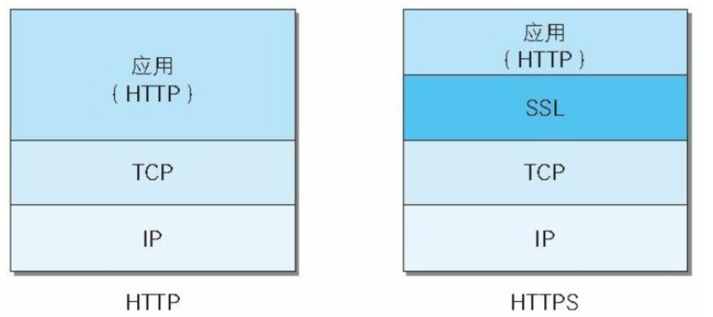

### 推导https的设计过程

我们从设计者的角度去思考如何建立一个安全的传输通道。

#### 从第一个消息开始

客户端A向服务端B发送一条消息，这个消息可能会被拦截以及篡改，我们如果做到A发送给B的数据包，即使被拦截了，也没办法得知消息内容并且不能查看呢？

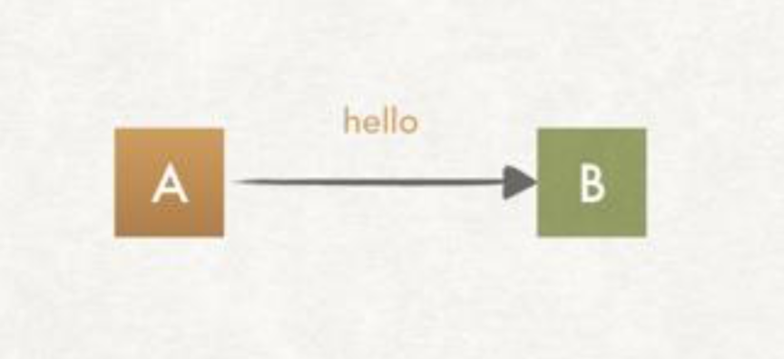

#### 利用对称加密

要做到消息不能被第三方查看以及篡改，那么第一个想法就是对内容进行加密，同时，该消息还需要能被服务端进行解密。所以我们可以使用对称加密算法来实现，密钥S用来加密和解密。在密钥S不公开的情况下，就可以保证消息不能被第三方查看和篡改。如下图：

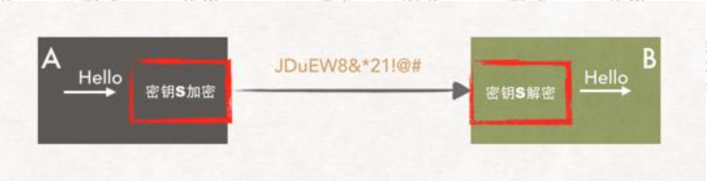

#### 没那么简单

在互联网的世界，通信不会这么简单，也许情况是这样。如下图：

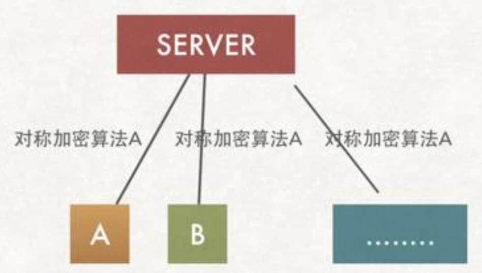

服务端会存在要和多个客户端产生连接的场景，而这些客户端中的其中一个也许是潜伏者，如果他也有对称加密的密钥S，那就相当于上面的方案和明文传输没有区别。如果服务端和每个客户端通信的时候使用不同的加密算法呢？

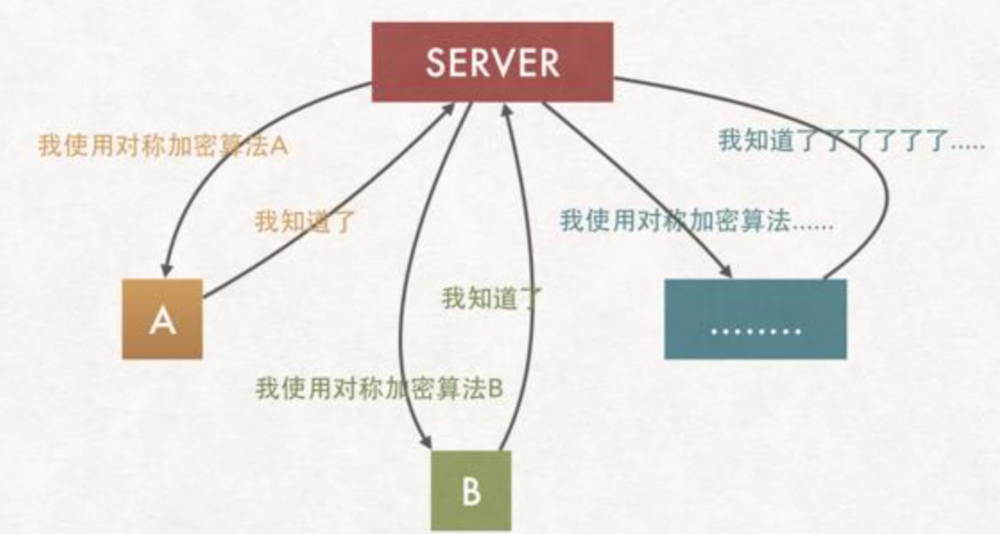

这样似乎能够完美解决问题，然后，密钥如何分配呢？也就是服务端怎么告诉客户端该使用哪种对称加密算法呢？解决办法似乎只能通过建立会话以后进行协商了。

#### 协商过程又是不安全的

协商过程，意味着基于一个网络传输的情况下去动态分配密钥，这个协商过程是不安全的，怎么破？

#### 非对称加密

非对称加密算法的特点是：私钥加密后的密文，只要有公钥，都能解密，但是公钥加密后的密文，只有私钥可以解密。私钥只有一个人有，而公钥可以法给所有人。

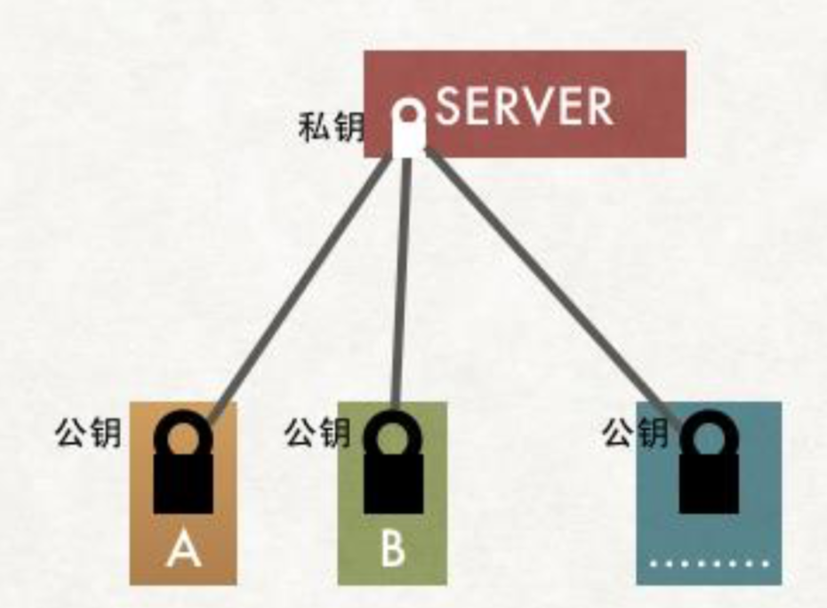

如果，有了公钥就可以保证图中A/B向服务器端方向发送的消息是安全。似乎我们通过非对称加密算法解决了密钥的协商问题？但是公钥怎么拿？

#### 公钥怎么拿？

使用非对称加密算法，那么如何让A、B客户端安全的持有公钥呢？

有两种我能想到的方案：

1. 服务器端将公钥发送给每一个客户端。
2. 服务器端将公钥放到一个远程服务器，客户端可以请求到。（多了一次请求，还得解决公钥放置问题）

方案一似乎不可行，因为，传输过程又是不安全的？公钥可能会被调包：

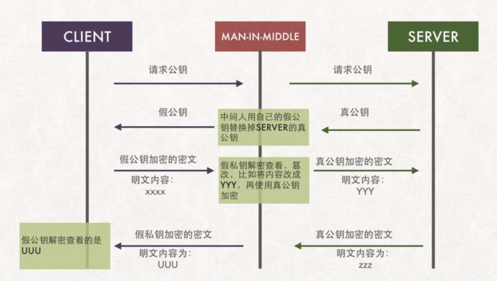


#### 引入第三方机构

到上面这一步，最关键的问题是，客户端如何知道给我公钥的是黄蓉还是小龙女？只能找本人去证实？或者有一个第三方来帮你证实，并且第三方是绝对公正的。

所以引入一个可信任的第三方是一个号的方案。

服务端把需要传递给客户端的公钥，通过第三方机构提供的私钥对公钥进行加密后，在传递给客户端？通过第三方机构私钥对服务端公钥加密以后的内容，就是一个简陋版本的“数字证书”。这个证书中包含【服务器公钥】


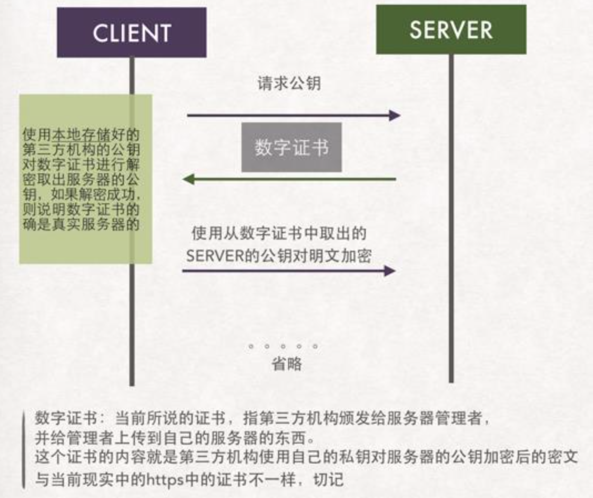

客户端拿到这个证书以后，因为证书是第三方机构使用私钥加密的。客户端必须要有第三方机构提供的公钥才能解密证书。这块又涉及到第三方机构的公钥怎么传输？（假设是先内置在系统中）还有一个问题，第三方机构颁发的证书是面向所有用户，不会只针对一家发放。**如果不发分子也去申请一个证书呢？**

#### 如果不发分子也拿到了证书

如果不发分子也申请了证书，那它可以对证书进行调包。客户端在这种情况下是无法分辨出收到的是服务端发送的证书，还是中间人的。因为不论是中间人的、还是服务端的证书都能使用第三方机构的公钥进行解密。

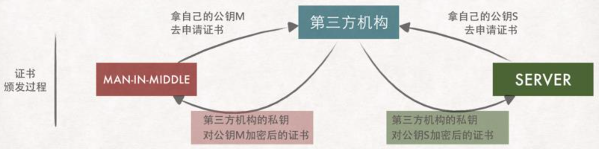

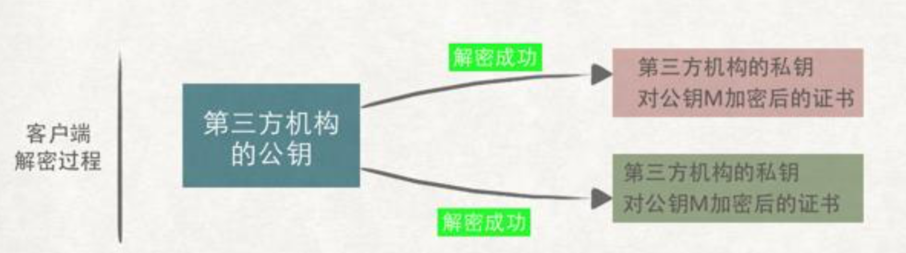

#### 验证证书的有效性

事情发展到现在，问题演变成了，客户端如何识别证书的真伪？在现实生活中，要验证一个东西的真伪，绝大部分都是基于编号去验证（比如大学毕业证书，比如买的数码产品是否是山寨），计算机领域的解决方案都是人为去实现的，所以在这里，解决方案也是一样，如果给这个数字证书添加一个证书编号？是不是就能达到目的了呢？

**证书上写了如何根据证书的内容生成证书编号。客户端拿到证书后根据证书上的方法自己生成一个证书编号，如果生成的证书编号于证书上的证书编号相同，那么说明这个证书是真实的。**这段有点类似于md5的验证，我们下载一个软件包，都会提供一个md5值，我们可以拿到这个软件包以后通过一个第三方软件去生成一个MD5值去做比较，是不是一样如果一样表示这个软件包没被篡改过

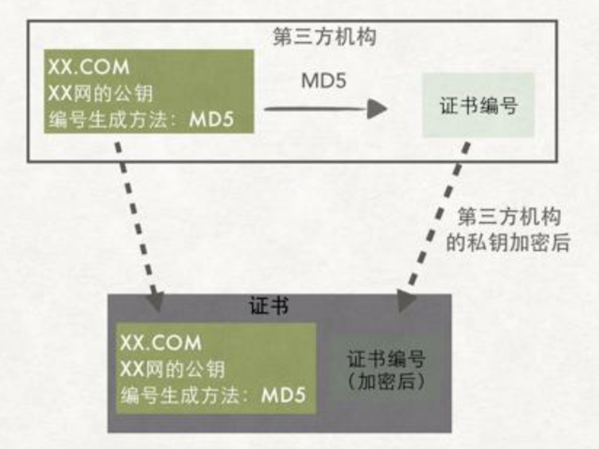

对服务端的数据进行md5算法得到一个MD5的值，生成证书编号，使用第三方机构的私钥对这个证书编号进行加密，并且会在证书中添加证书编号的生成算法。

浏览器内置的CA公钥可以解密服务端CA私钥加密的证书，通过浏览器内置的CA证书的证书编号算法对服务端返回的证书编号进行验签。

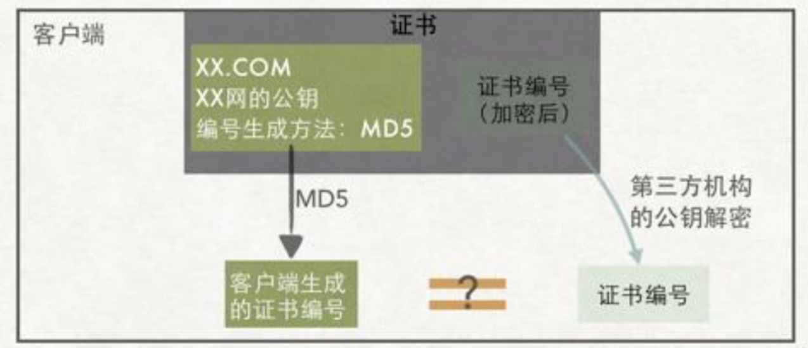

#### 第三方机构的公钥证书存在哪里？

浏览器和操作系统都会维护一个权威的第三方机构列表（包括他们的公钥）

因为客户端接收到的证书中会写颁发机构，客户端就根据这个颁发机构的值在本地找到相应的公钥。

证书就是HTTPS中的数字证书，证书编号就是数字签名，而第三方就够就是数字证书的签发机构（CA）。

## https原理分析

### https证书的申请过程

1. 服务器上生成的CSR文件（证书申请文件，内容包括：证书公钥、使用的Hash签名算法、申请的域名、公司名称、职位等信息）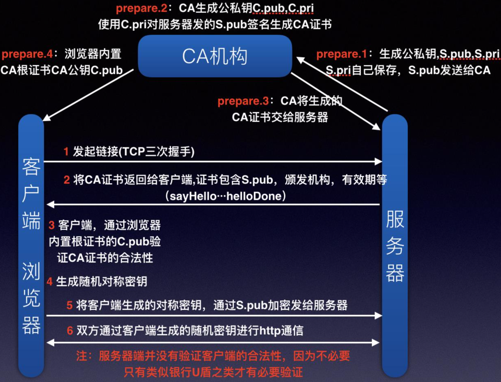
2. 把CSR文件和其他可能的证件上传到CA认证机构，CA机构收到证书申请之后，使用申请中的Hash算法，对部分内容进行摘要，然后使用CA机构自己的私钥对这段摘要信息进行前面（相当于证书的唯一编号）
3. 然后CA机构把签名过的证书通过邮件形式发送申请者手中。
4. 申请者收到证书之后部署到自己的web服务器中。

### 客户端请求交互流程

1. 客户端发起请求（Client Hello包）
   1. 三次握手，建立TCP连接
   2. 支持的协议版本（TLS/SSL）
   3. 客户端生成的随机数client.random,后续用于生成“对话密钥”
   4. 客户端支持的加密算法
   5. sessionId，用于保持同一个会话（如果客户端与服务器费尽周折建立了一个HTTPS链接，刚建完就端了，也太可惜了。）
2. 服务端收到请求，然后响应（Server Hello）
   1. 确认加密通道协议版本
   2. 服务端生成的随机数server.random，后续用于生成“对话密钥”
   3. 确认使用的加密算法（用于后续的握手消息进行签名防止篡改）
   4. 服务器证书（CA机构颁发给服务端的证书）
3. 客户端收到证书进行验证
   1. 验证证书是否是上级CA签发的，在验证证书的时候，浏览器会调用系统的证书管理器接口对证书路径中的所有证书一级一级的进行验证，只有路径中所有的证书都是授信的，整个验证的结构才是受信的。
   2. 服务端返回的证书中会包含证书的有效期，可以通过失效日期来验证证书是否过期
   3. 验证证书是否被吊销了
   4. 我们知道CA机构在签发证书的时候，都会使用自己的私钥对证书进行签名证书里面的签名算法字段sha256RSA表示CA机构使用sha256对证书进行摘要，然后使用RSA算法对摘要进行私钥签名，而我们也知道RSA算法中，使用私钥签名之后，只有公钥才能进行验签。
   5. 浏览器使用内置在操作系统上的CA机构的公钥对服务器的证书进行验签。确定这个证书是不是由正规的机构颁发。验签之后得知CA机构使用sha256进行证书摘要，然后客户端在使用sha256对证书内容进行一次摘要，如果得到的值和服务端返回的证书验签之后的摘要相同，表示证书没有被修改过。
   6. 验证通过后，就会显示绿色的安全字样。
   7. 客户端生成随机数，验证通过之后，客户端生成一个随机数pre-master secret，客户端根据之前的：Client.random + server.random + pre-master生成对称密钥然后使用证书中的公钥进行加密，同时利用前面协商好的Hash算法，把握手消息取Hash值，然后用随机数加密”握手消息+握手消息Hash值（签名）“并一起发送给服务端。（在这里之所以要取握手消息的Hash值，主要是把握手消息做一个签名，用于验证握手消息在传输过程中没有被篡改过。）
4. 服务端接收随机数
   1. 服务端收到客户端的加密数据以后，用自己的私钥对密文进行解密。然后得到client.random/server.random/pre-master-secret，计算Hash值，并与传过来的Hash值做对比确认是否一致。
   2. 然后用随机密码加密一段握手消息（握手消息+握手消息Hash值）给客户端。
5. 客户端接收消息
   1. 客户端用随机数解密并计算握手消息的Hash,如果与服务端发来的Hash一致，此时握手过程结束。
   2. 之后所有的通信数据将由之前**交互过程中生成的pre-master-secret/client.random/server.random通过算法得出session Key，作为后续交互过程中的对称密钥**

## https实战

我们基于Nginx配置一个https的证书。在生产环境中的SSL证书都需要通过第三方认证机构购买，分为专业版OV证书（浏览器地址栏上不显示企业名称）和高级版EV（可以显示企业名称）证书，证书所保护的域名数不同也会影响价格（比如只对www认证和通配*认证，价格是不一样的），且不支持三级域名。

浏览器提示：如果是红色代表证书过期或者无效，如果是黄色代表网站有部分连接使用的仍然是http协议。如果大家自己买了域名的话，可以在阿里云上申请一个免费的证书来使用。

演示证书的申请过程，直接使用openssl，自己作为证书颁发机构来制作证书，但是这个证书是不受信任的，所以大偶时候演示的结果浏览器会提示证书不受信的错误。

### 证书的申请过程

#### 生成服务器证书的申请文件和私钥文件

在nginx的conf目录下创建cert文件夹，在该文件夹中生成公钥。

``````bash
openssl req -nodes -newkey rsa:2048 -out myreq.csr -keyout privatekey.key
``````

req：表示发出一个申请数字证书的请求

Rsa:2048：表示加密算法以及长度

out：表示输出一个请求文件

keyout：生成私钥

myreq.csr：证书签名请求，这个并不是一个证书，而是向权威机构获取签名证书申请，它的主要内容是一个公钥

privatekey.key：与公钥匹配的私钥

CSR（证书请求文件），用来向CA机构申请的文件，一般以CSR结尾，包含申请证书所需要的相关信息，其中最重要的是域名，填写的域名必须是你要https方式访问的那个域名。一个是key文件，这个文件一定要保存好，这个文件就是对应server端的私钥，这个信息首先是重要，如果这个key文件没有保存好，是无法找回的，因为key生成的过程不可逆，即使填写的过程都一样，生成的key是不一样的，具有随机性。

命令运行以后，需要输入很多信息：

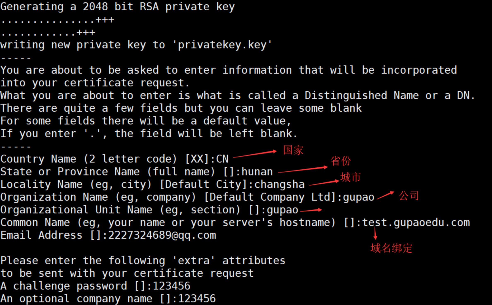

#### 模拟CA机构制作CA机构证书

CA机构有自己的公钥，**CA会只用自己的公私钥对证书申请者提交的公钥进行加密。**所以为了模拟CA机构的工作流程，需要先创建一个CA证书。

**openssl的配置文件：**/etc/pki/tls/openssl.cnf

以下是openssl CA的默认配置，我们需要配置CA的证书，就需要在执行的目录下创建对应的文件：

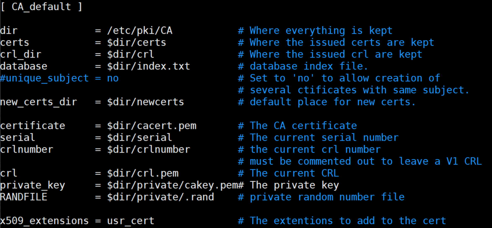

1. 创建所需要的文件：
   1. ```touch /etc/pki/CA/index.txt```：生成证书索引数据库文件。
   2. ```echo 01 > /etc/pki/CA/serial ```：指定第一个颁发证书的序列号，必须是两位十六进制数，99之后是9A。
2. CA自签证书-生成私钥
   1. ```cd /etc/pki/CA/```
   2. ```openssl genrsa -out /etc/pki/CA/private/cakey.pem 2048```
3. 生成自签名证书：```open req -new -x509 -key /etc/pki/CA/private/cakey.pem -days 365 -out /etc/pki/CA/cacert.pem```,提示输入：国家、省、市、公司名称、部门名称、CA主机名（颁发者名称）
4. 颁发证书
   1. ```openssl ca -policy policy_anything -in myreq.csr -out mycert.crt -day 365```:policy policy_anything，policy参数允许签名的CA和网站证书可以有不同的国家、地名等信息
   2. out：ca颁发的证书文件
   3. days：证书有效期

### nginx配置https

在nginx.conf中配置server段，将证书mycert.pem和私钥pem添加到指定文件中：

```json
server {
    listen 443 ssl;
    ssl on;
    ssl_certificate cert/mycert.crt; 
    ssl_certificate_key cert/privatekey.key;
    ssl_session_cache shared:SSL:1m; 
    ssl_session_timeout 5m;
    ssl_ciphers HIGH:!aNULL:!MD5; 
    ssl_prefer_ser ver_ciphers on;
    location / {
        root html;
        index index.html index.htm; 
    }
}
```

#### tips

x.509标准的证书，有两种编码格式，一种是PEM、一种是DER。

但实际上我们在创建证书和私钥的时候，并不一定要以PEM或者DER作为扩展名。

比如证书的表示方式有：PEM、DER、CRT、CER

私钥或者公钥的标识形式：PEM、DER、KEY

只是对应的编码格式不同而已。

### nginx添加https支持

要给已经安装好的nginx添加证书支持，需要按照以下步骤来进行：

1. ```/data/program/nginx/sbin/nginx -V```：查看之前nginx编译安装了哪些模块，避免遗漏掉一些模块配置导致出现问题。
2. ```cd /data/program/nginx-1.11```：进入之前下载Nginx源码包目录中。
3. ```./configure --prefix=/data/program/nginx --with-http_stub_status_module --with-http_ssl_module```：重新编译，添加ssl模块支持。
4. ```make```：执行make命令，千万不能执行make install，不然会把之前安装的nginx覆盖掉。
5. ```cp /data/program/nginx/sbin/nginx/data/program/nginx/sbin/nginx.bak```：备份原来的启动脚本。
6. ```cp objs/nginx /data/program/nginx/sbin/```：替换nginx的二进制脚本。
7. ```/data/program/nginx/sbin/nginx -V```：再次验证是否把需要的模块编译进去。


