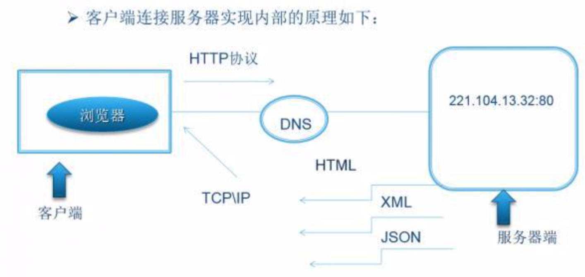
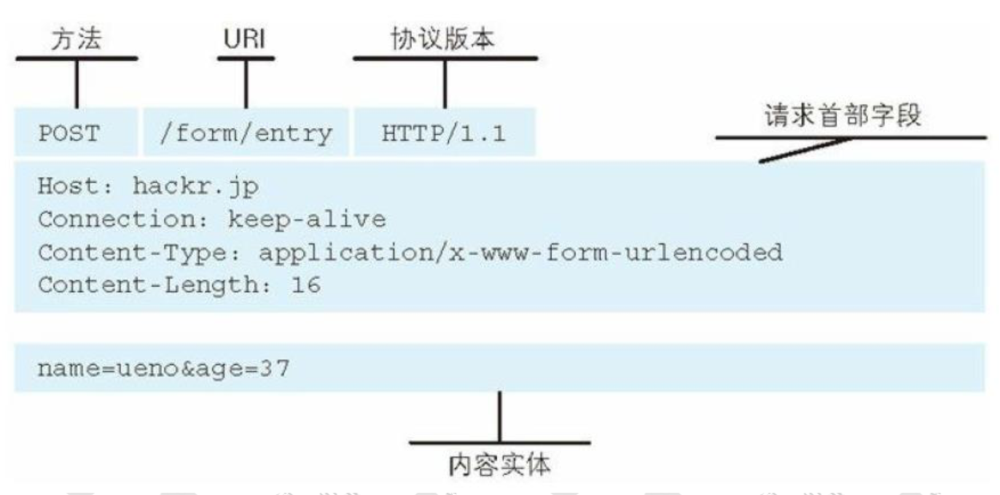
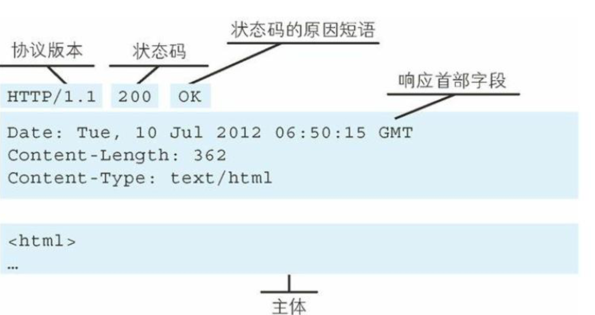
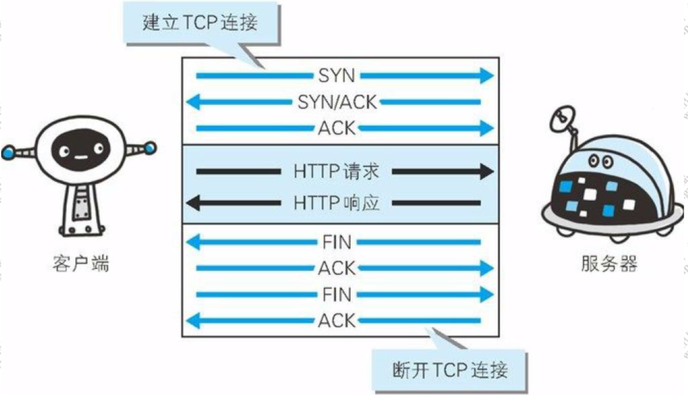
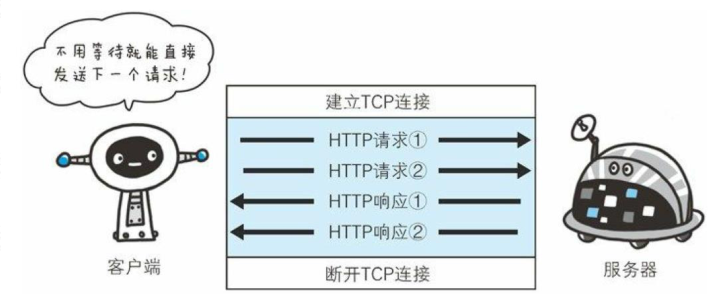
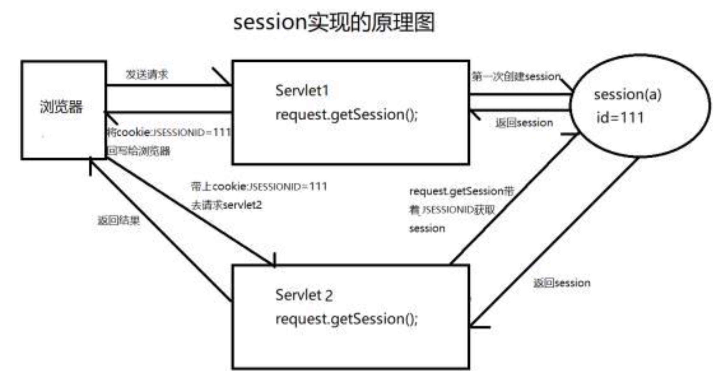
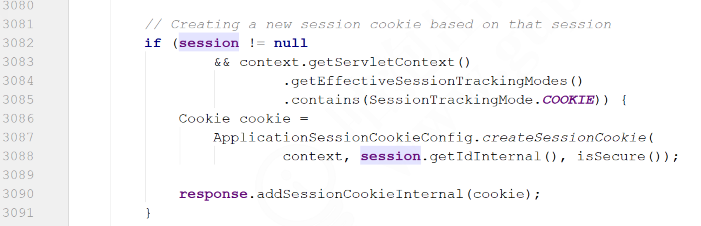

# HTTP及HTTPS协议原理

我们知道应用层是OSI七层网络模型的第七层，不同类型的网络应用有不同的通信规则，因此应用层协议是多种多样的，比如DNS、FTP、Telnet、SMTP、HTTP等协议都是用于解决其各自的一类问题。

## http通信协议基本原理

http协议在远程通信场景中的应用还是挺广泛的，包括现在主流的微服务架构的通信都是基于http协议。由于经常使用的关系，在这里就梳理一下http协议的基本原理。

### 一次http请求的通信流程

我们先来思考一个问题，我们在浏览器上输入一个网址后，浏览器是如何展示目标网址的内容的？内容是从哪里来的呢？

来通过图形把这个过程画一下：



DNS（Domain Name System）：是和HTTP协议一样位于应用层的协议。它提供域名到IP地址之间的解析服务，用户通常使用主机名或域名来访问对方的计算机，而不是直接通过IP地址访问。因为与IP地址的一组纯数字相比，用字母配合数字的表示形式来指定计算机名更符合人类的记忆习惯。

但要让计算机去理解名称，相对而言就变得困难了。因为计算机更擅长处理一长串数字。为了解决上述问题，DNS服务应运而生。DNS协议提供通过域名查找IP地址，或逆向从IP地址反查域名的服务。

## http通信协议的组成

刚刚了解了http协议的工作过程，同时也知道了http协议是基于应用层的协议，并且在传输层使用的TCP的可靠性通信协议。既然是协议，那么久应该符合协议的定义：协议是两个需要通过网络通信的程序达成的一种约定，它规定了报文的交换方式和包含的意义。所以，接下来我们来深入去剖析http协议的原理和组成。

### 请求URI定位资源

我们在浏览器中输入一个地址，浏览器是如何根据地址去找到服务器对应的资源并做返回的？以及这个地址包含哪些有价值的信息呢？

这就需要我们了解URL（Uniform Resource Locator），统一资源定位符，用于描述一个网络上的资源，具体格式是：

schema://host[:port#]/path/.../?[url-params]#[query-string]

- schema：指定应用层使用的协议（例如：http、https、ftp）。
- host：http服务器的IP地址或者域名
- port#：http服务器的默认端口是80，这种情况下端口可以省略。如果使用了别的端口，必须指明。例如：http://www.cnblogs.com:8080。
- path：访问资源的路径
- Query-string：查询字符串
- ```#```：片段标识符（使用片段标识符通常可标记处已获取资源中的子资源）

通过这个url地址，我们就可以读到，当前用户要使用http协议访问指定服务器上对应进程中的资源，并且携带了请求参数。

### MIME Type

服务器根据用户请求的资源找到对应的文件以后，会返回一个资源给到客户端浏览器，浏览器会对这个资源解析并且渲染。但是服务器上的资源类型有很多，比如图片类型、视频类型、js、css、文本等。浏览器如何识别当前类型做不同的渲染呢？

MIME Type：是描述消息内容类型的因特网标准，常见的几种类型：

- 文本文件：text/html,text/plain,text/css,application/xhtml+xml,application/xml
- 图片文件：image/jpeg,image/gif,image/png
- 视频文件：video/mpeg,video/quicktime

我们可以通过两种方式来设置文件的渲染类型，第一种是Accept，第二种是Context-Type。

- Accept：表示客户端希望接收的数据类型，即告诉服务器我需要什么媒体类型的数据，此时服务器应该根据Accept请求头生产指定媒体类型的数据。
- Content-Type：表示发送端发送的实体数据类型，比如我们应该写过类似的：```resposne.setContentType("application/json;charset=utf-8")```的代码，表示服务器端返回的数据格式是json。

如果Accept和Content-Type不一致，假如说Accept要接收的类型是image/gif，但是服务端返回的数据是text/html，那么浏览器将会无法解析。

### 如果用户访问一个不存在的地址呢？

如果用户访问的地址没问题，或者服务器也能正常解析及处理当前用户的请求，那就能够返回正确的信息给到客户端。但是如果用户访问的地址有问题，或者服务端在解析用户请求以及处理请求逻辑时出现问题，怎么办呢？浏览器应该怎么告诉用户当前是处理失败的呢？

因此这里就设计到一个状态码的概念：

状态码的职责是当客户端向服务端发送请求时，描述服务端返回的请求处理结果，通过状态码，浏览器可以知道服务器是正常处理请求还是出现了错误。

|      | 类别                             | 原因短语                   |
| ---- | -------------------------------- | -------------------------- |
| 1XX  | Informational(信息性状态码)      | 接收的请求正在处理         |
| 2XX  | Success（成功状态）              | 请求正常处理完毕           |
| 3XX  | Redirection（重定向状态码）      | 需要进行附加操作以完成请求 |
| 4XX  | Client Error（客户端错误状态码） | 服务器无法处理请求         |
|      | Server Error（服务器错误状态码） | 服务器处理请求出错         |

大家见的比较多的错误码：

- 200：一切正常
- 301：永久重定向
- 404：请求资源不存在
- 500：服务器端内部错误

有了状态码，在用户访问某个网站出现非正常状态时，浏览器就可以很友好的提示用户。

### 告诉服务器端当前请求的意图

有了url、mimetype、状态码，能够基本满足用户的需求，但是，很多时候一个网站不单纯只是不断从服务端获取资源并做渲染，可能还需要做一些数据的提交、删除等功能。所以浏览器定义了8中方法来表示对于不同请求的操作方式，当然最常用的还是Get和Post，我觉得，要不是Get方法不支持大数据的传输，估计很多人Post都不会去用。

- GET：一般是用于客户端发送一个URI地址去获取服务端的资源（一般用于查询操作），Get支持的传输数据长度有限制，具体限制由浏览器决定。
- POST：一般用户客户端传输一个实体给到服务端，让服务端去保存（一般用于创建操作）。
- PUT：向服务器发送数据，一般用于更新数据的操作。
- DELETE：客户端发起一个Delete请求要求服务端把某个数据删除（一般用于删除操作）。
- HEAD：获得报文首部。
- OPTIONS：询问支持的方法。
- TRACE:追踪路径。
- CONNECT：用隧道协议连接代理。

在REST架构风格中，有严格规定对于不同的请求类型要设置合适的请求方法。也是避免出现因为乱用导致混乱的问题。这里提到了REST架构，那什么是REST架构风格呢？

### REST架构风格

- 随着服务化架构的普及，http协议的使用频率越来越高。
- 很多人在错误的使用http协议定义接口，比如各种各样的命名，什么getUserInfoById,deleteById之类，的，有状态和无状态请求混用。
- 对于http协议本身提供的规则并没有很好的利用。所以，为了更好的解决这些问题，干脆就定义一套规则，这套规则并没有引入新的东西，无非就是http协议本身的使用做了一些约束，比如说：
  1. REST是面向资源，每一个URI代表一个资源。
  2. 强调无状态变化，服务器端不能存储来自某个客户的某个请求中的信息，并在该客户的其他请求中使用。
  3. 强调URL暴露资源时，不要在URI中出现动词。
  4. 合理的利用http状态码、请求方法。

因此大家在参照这种标准去使用REST风格时，要明白你遵循的是什么以及要解决什么问题。

### http协议的完成组成

http洗衣包含两个报文，一个是请求报文，一个是相应报文。

#### 请求报文

请求报文格式包含三个部分：起始行、首部字段、主体。



#### 响应报文

响应报文的格式也是一样，分为三部分：



### http协议中的扩展

http协议除了这两种基本组成以外，还有很多大家比较常见的属性或者配置，简单罗列一些：

#### 如果传输文件过大怎么办

服务器上返回的资源文件比较大，比如有些js文件大小可能就有几兆。文件过大就会影响传输的效率，同时也会带来带宽的消耗。怎么办呢？

1. 常见的手段是，对文件进行压缩，减少文件大小。那压缩和解压缩的流程怎么实现呢？首先服务端需要能支持文件的压缩功能，其次浏览器能够针对被压缩的文件进行解压缩。浏览器可以指定Accept-Encoding来告诉服务器我当前支持的编码类型。如：```Accept-Encoding:gzip,deflate```。那服务端会根据支持的编码类型，选择合适的类型进行压缩。常见的编码方式有：gzip/deflate。
2. 分割传输，在传输大容量数据时，通过把数据分割成多块，能够让浏览器逐步显示页面。这种把实体主体分块的功能称为分块传输编码（Chunked Transger Coding）。

#### 每次请求都要建立连接吗？

在最早的http协议中，每进行一次http通信，就需要做一次tcp的连接。而一次连接需要进行3次握手，这种通信方式会增加通信量的开销。



所以在HTTP/1.1中改用了持久连接，就是在一次连接建立之后，只要客户端或者服务端没有明确提出断开连接，那么这个tcp连接会一直保持连接状态。

持久连接的一个最大的好处是：大大减少了连接的建立以及关闭时延。

HTTP/1.1中有一个Transport段。会携带一个Connection:Keep-Alive，表示希望将此条连接作为持久连接。

HTTP/1.1持久连接在默认情况下是激活的，除非特别指明，否则HTTP/1.1假定所有的连接都是持久的，要在事务处理结束之后连接关闭，HTTP/1.1应用程序必须向报文中显示的添加一个Connection:close首部。

HTTP/1.1客户端加载在收到响应后，除非响应中包含了Connection:close首部，不然HTTP/1.1连接就仍然维持在打开状态。但是，客户端和服务器仍然可以随时关闭空闲的连接。不发送Connection:close并不意味着服务器承诺永远将连接保持在打开状态。

管道化连接：HTTP/1.1允许在持久连接上使用请求管道。以前发送请求后需等待并收到响应，才能发送下一个请求。管线化技术出现后，不用等待响应亦可直接发送一个请求。这样就能够做到同时并行发送多个请求，而不需要一个接一个的等待响应了。



## http协议的特点

### http无状态协议

HTTP协议是无状态的，什么是无状态呢？就是说HTTP协议本身不会对请求和响应之间的通信状态做保存。

但是现在的应用都是有状态的，如果是状态，那这些应用基本没人用，你想想，访问一个电商网站，先登录，然后去选购商品，当点击一个商品加入购物车以后又提示你登录。这种用户体验根本不会有人去使用。那我们如何实现带状态的协议呢？

### 客户端支持的cookie

http协议中引入了cookie技术，用来解决http协议无状态的问题。通过在请求和响应报文中写入Cookie信息来控制客户端的状态。Cookie会根据从服务器端发送的响应报文内的一个叫做Set-Cookie的首部字段信息，通知客户端保存Cookie。当下次客户端再往该服务器发送请求时，客户端会自动在请求报文中加入Cookie值后发送出去。

### 服务器端支持的session

服务端是通过什么方式来保存状态的呢？在基于tomcat这类的jsp/servlet容器中，会提供session这样的机制来保存服务端的对象状态，服务器使用一种类似于散列表的结构来保存信息，当程序需要为某个客户的请求创建一个session的时候，服务器首先检查这个客户端的请求是否包含一个session标识：sessionId。

如果已包含一个sessionId则说明以前已经为客户端创建过session，服务器就按照sessionId把这个session检索出来使用（如果检索不到，会新建一个）。

如果客户端请求不包含sessionId，则为此客户端创建一个session并且生成一个与此session相关联的sessionId，sessionId的值是一个既不会重复，又不容易被找到规律的仿造字符串，这个sessionId将会返回给客户端保存。



#### Tomcat实现session的代码逻辑分析

我们以HttpServletRequest#getSession()作为切入点，对Session的创建过程进行分析我们的应用程序拿到的HttpServletRequest是```org.apache.catalina.connector.RequestFacade```（除非某些Filter进行了特殊处理），它是```ort.apache.catalina.connector.Request```的门面模式。首先，会判断Request对象中是否存在Session，如果存在并且未失效则直接返回。

如果不存在Session，则尝试根据requestSessionId查找Session，如果存在Session的话直接返回，如果不存在的话，则创建新的Session，并且把sessionId添加到Cookie中，后续的请求便会携带该Cookie，这样便可以根据Cookie中的sessionId找到原来创建的Session了。



## Https协议基本分析