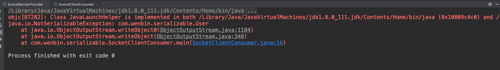
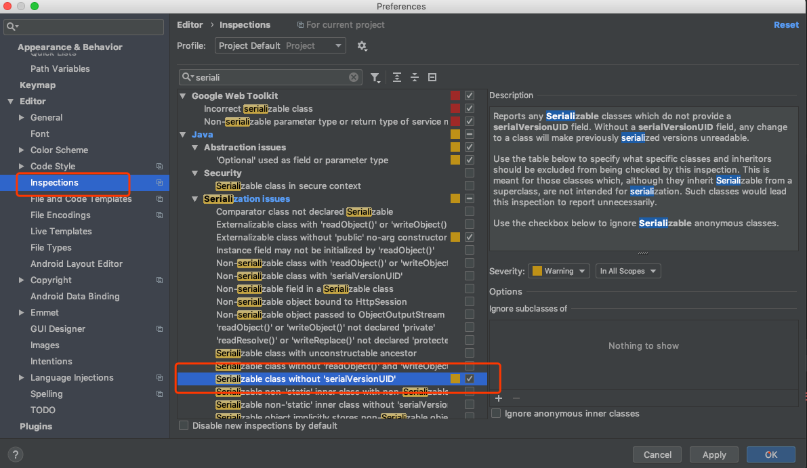
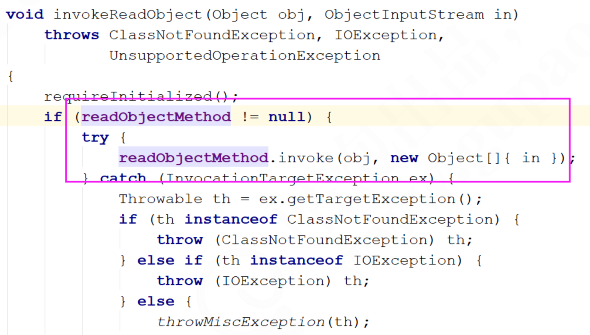

# 序列化和反序列化

## Java领域的对象如何传输

### 基于socket进行对象传输

先举个简单的例子，基于我们前面几次课程知识，写一个socket通信的代码：

**User**:

```java
package com.wenbin.serializable;


import lombok.Data;

@Data
public class User {

    private String name;
}
```
**SocketServerProvider**

```java
package com.wenbin.serializable;

import java.io.BufferedReader;
import java.io.IOException;
import java.io.ObjectInputStream;
import java.net.ServerSocket;
import java.net.Socket;
import java.nio.Buffer;

public class SocketServierProvider {
    public static void main(String[] args) throws ClassNotFoundException, IOException {
        ServerSocket serverSocket = null;

        BufferedReader in = null;

        try {
            serverSocket = new ServerSocket(8080);
            Socket socket = serverSocket.accept();
            ObjectInputStream objectInputStream = new ObjectInputStream(socket.getInputStream());

            User user = (User) objectInputStream.readObject();

            System.out.println(user);
        } catch (IOException e) {
            e.printStackTrace();
        } finally {
            if (in != null) {
                try {
                    in.close();
                } catch (IOException e) {
                    e.printStackTrace();
                }
            }

            if (serverSocket != null) {
                serverSocket.close();
            }
        }
    }
}
```

**SocketClientConsumer** 

```java
package com.wenbin.serializable;

import java.io.IOException;
import java.io.ObjectOutputStream;
import java.net.Socket;

public class SocketClientConsumer {
    public static void main(String[] args) {
        Socket socket = null;
        ObjectOutputStream out = null;

        try {
            socket = new Socket("127.0.0.1", 8080);
            User user = new User();
            out = new ObjectOutputStream(socket.getOutputStream());
            out.writeObject(user);
        } catch (IOException e) {
            e.printStackTrace();
        } finally {
            if (out != null) {
                try {
                    out.close();
                } catch (IOException e) {
                    e.printStackTrace();
                }
            }

            if (socket != null) {
                try {
                    socket.close();
                } catch (IOException e) {
                    e.printStackTrace();
                }
            }
        }

    }
}
```

### 运行结果

这段代码运行以后，不能实现Java对象的正常传输，会报错：



对User这个对象实现一个Serializable接口，再次运行就可以看到对象能够正常传输了。

```java
package com.wenbin.serializable;


import lombok.Data;

import java.io.Serializable;

@Data
public class User implements Serializable {

    private String name;
}
```

## 了解序列化的意义

之前的例子对User这个类增加一个Serializable，就可以解决Java对象的网络传输问题。这就是序列化的意义。

Java平台允许我们在内存中创建可复用的Java对象，但一般情况下，只有当JVM处于运行时，这些对象才可能存在，即，这些对象的生命周期不会比JVM生命周期更长。但在现实应用中，就可能要求在JVM停止运行之后能够保存（持久化）指定的对象，并在将来重新读取被保存的对象。Java对象序列化就能够帮助我们实现该功能。

简单来说：

### 序列化

序列化是把对象的状态信息转化为可存储或传输的形式过程，也就是把对象转化为字节序列的过程称为对象的序列化。

### 反序列化

反序列化是序列化的逆向过程，把字节数组反序列化为对象，把字节序列恢复为对象的过程称为反序列化。

## 序列化的进阶认识

### 简单认识一下Java原生序列化

前面的代码中演示了，如何通过JDK提供了Java对象的序列化方式实现对象序列化传输，主要通过输出流```java.io.ObjectOutputStream```和对象输入流```java.io.ObjectInputStream```来实现。

```java.io.ObjectOutputStream```:表示对象输出流，它的```writeObject(Object obj)```方法可以对参数指定的obj对象进行序列化，把得到的字节序列写到一个目标输出流中。

```java.io.ObjectInputStream```:表示对象输入流，它的```readObject()```方法从输入六中读取字节序列，在把他们反序列化称为一个对象，并将其返回。

需要注意的是，被序列化的对象需要实现```java.io.Serializable```接口。

### 序列化的进阶认识

#### serialVersionUID的作用

在IDEA中通过如下设置可以生成serializeid



字面上的意思是是序列化的版本号，凡是实现Serializable接口的类都有一个标识序列化版本标识符的静态变量。

试验步骤：

1. 先将user对象序列化到文件中。
2. 然后修改user对象，增加serialVersionUID字段。
3. 然后通过反序列化把对象提取出来。
4. 试验的预期结果：提示无法反序列化。

结论：

Java的序列化机制是通过判断类的serialVersion来验证版本一致性的。在进行反序列化时，JVM会把传来的字节流中的serialVersionUID于本地响应实体类的serialVersionUID进行比较，如果相同就任务是一致的，可以进行反复序列化，否则就会出现序列化版本不一致的异常，即是InvalidCastException。

从结果可以看出，文件流中class和classpath中的class,也就是修改过后的class，不兼容了，处于安全机制考虑，程序抛出了错误，并且拒绝载入。从错误结果来看，如果没有为指定的class配置serialVersionUID，那么java编译器会自动给这个class进行一个摘要算法，类似于指纹算法，只要这个文件有任何改动，得到的UID就会截然不同的，可以保证在这么多类中，这个编号是唯一的。所以，由于没有显示指定serialVersionUID，编译器又为我们生成了一个UID，当然和前面保存在文件中的那个不会一样了，于是就出现了2个序列化版本号不一致的错误。因此，**只要我们自己指定了serialVersionUID，就可以在序列化后，去添加一个字段；或者方法，而不会影响到后期的还原，还原后的对象照样可以使用，而且还多了方法或者属性可以用。**

##### tips:

serialVersionUID有两种显示生成的方式：

1. 默认的1L,比如：```private static final long serialVersionUID = 1L```.
2. 根据类名、接口名、成员方法及属性等来生成一个64位的哈希字段。

当实现```java.io.Serializable```接口的类**没有显示的定义一个serialVersionUID变量的时候，Java序列化机制会根据编译的Class自动生成一个serialVersionUID做序列化版本比较用，这种情况下，如果Class文件（类名，方法名等）没有发生变化（增加空格，换行，增加注释等等），就算编译在多次，serialVersionUID也不会变化的。**

#### Transient关键字

Transient关键字的作用是控制变量的序列化，在变量声明前加上该关键字，可以阻止该变量被序列化到文件中，在被反序列化后，transient变量的值被设为初始值，如int型的是0，对象型的是null。

##### 绕开transient机制的办法

加入name被transient修饰，但是通过我们写的两个方法依然能够使得name字段正确被序列化和反序列化。

##### wirteObject和readObject原理

wirteObject和readObject是两个私有方法，它们是什么时候被调用的呢？从运行结果来看，它确实被调用。而且它们并不存在于```java.lang.Object```，也没有在Serializable中去声明。我们唯一的猜想应该还是和ObjectInputStream合ObjectOutputStream有关系，所以基于这个入口去看看在哪个地方有调用。



从源码层面来分析可以看到，readObject是通过反射来调用的。

其实我们可以在很多地方看到readObject和wreteObject的使用，比如HashMap。

### Java序列化的简单总结

1. Java序列化只是针对对象的状态进行保存，至于对象中的方法，序列化不关心。
2. 当一个父类实现了序列化，那么子类会自动实现序列化，不需要显示实现序列化接口。
3. 当一个对象的实例变量引用了其他对象，序列化这个对象的时候会自动把引用的对象也进行序列化（实现深克隆）。
4. 当某个字段被声明为transient后，默认的序列化机制会忽略这个字段。
5. 被声明为transient的字段，如果需要序列化，可以添加两个私有方法：writeObject和readObject。

## 分布式架构下常见序列化技术

初步了解了Java序列化的机制以后，我们回到分布式架构中，了解序列化的发展过程。

### 了解序列化的发展

随着分布式架构、微服务架构的普及。服务于服务之间的通信成了最基本的需求。这个时候，不仅需要考虑通信的性能，也需要考虑语言多元化问题。

所以，对于序列化来说，如何去提升序列化性能以及解决跨语言问题，就成了一个重点考虑的问题。

由于Java本身提供的序列化机制存在两个问题：

1. 序列化的数据比较大，传输效率低。
2. 其他语言无法识别和对接。

以至于在后来很长一段时间，基于XML格式编码的对象序列化机制称为了主流，一方面解决了多语言兼容问题，另一方面比二进制的序列化更容易理解（XML格式没有解决传输效率低的问题，反而传输效率更低）。以至于基于XML的SOAP协议及对应的WebService框架很长一段时间内成为各个主流开发语言的必备技术。

再到后来，基于JSON的简单文本格式编码的HTTP REST Full 接口又基本上渠道了复杂的WebService接口，成为分布式架构中远程通信的首要选择。但是JSON序列化存在存储占用空间大、性能低等问题，同时移动客户端应用需要更高效的传输数据来来提升用户体验。在这种情况下与语言无关并且高效的二进制序列化框架-MessagePack。它比google的Protocol Buffers出现的还要早。

### 简单了解各种序列化技术

#### XML序列化框架介绍

XML序列化的好处在于可读性好，方便阅读和调试。但是序列化以后的字节码文件比较大，而且效率不高，适用于对性能要求不高，而且QPS较低的企业级内部系统之间的数据交换场景。同时XML又具有语言无关性，所以还可以用于异构系统之间的数据交换和协议。比如我们熟知的WebService,就是采用XML格式对数据进行序列化的。XML序列化/反序列化的实现方式有很多，熟知的方式有XStream和Java自带的XML序列化和反序列化两种。

#### JSON序列化框架

JSON（JavaScript Object Notation）是一种轻量级的数据交换格式，相对于XML来说，JSON的字节流更小，而且可读性也非常好。现在JSON数据格式在企业运用是最普遍的。

JSON序列化常用的开源工具有很多：

1. Jackson（https://github.com/FasterXML/jackson ）
2. 阿里开源的FastJson（https://github.com/alibaba/fastjon）
3. 谷歌的GSON(https://github.com/google/gson)

这几种json的序列化工具中，jackson与fastjson要比GSON的性能好，但是jackson、GSON的稳定性腰比Fastjson好。而fastjson的优势在于提供的api非常容易使用。

#### Hession序列化框架

Hessian是一个支持跨语言传输的二进制序列化协议，相对于Java默认的序列化机制来说，Hession具有更好的性能和易读性，而且支持多种不同的语言。

实际上Dubbo采用的就是Hessian序列化来实现，只不过Dubbo对Hessian进行了重构，性能更高。

#### Avro序列化

Avro是一个数据序列化系统，设计用于支持大批量数据交换的应用。它的主要特点有：支持二进制序列化方式，可以便捷，快速地处理大量数据。动态语言友好，Avro提供的机制是动态语言可以方便的处理Avro数据。

#### Kryo序列化框架

Kryo是一种非常成熟的序列化实现，已经在Hive、Storm中使用的比较广泛，不过它不能夸语言。目前Dubbo已经在2.6版本支持kyro的序列化机制。它的性能要由于之前的hessian2。

#### Protobuf序列化框架

Protobuf是Google的一种数据交换格式，它独立于语言、独立于平台。Google提供了多种语言来实现，比如Java、C、Go、Python，每一种实现都包含了相应语言的编译器和库文件，Protobuf是一个纯粹的表示层协议，可以和各种传输层协议一起使用。

Protobuf使用比较广泛，主要是空间开销小和性能比较好，非常适合用于公司内部对性能要求高的RPC调用。另外由于解析性能比较高，序列化以后数据量相对较少，所以也可以应用在对象的持久化场景中。

但是要使用Protobuf会相对来说麻烦些，因为他有自己的语法，有自己的编译器，如果需要用到的话必须要去投入成本在这个技术的学习中。

Protobuf有个缺点就是要传输每一个类的结构都要生成对应的proto文件，如果某个类发生修改，还得重新生成该类对应的proto文件。

## 序列化技术的选型

### 技术层面

1. 序列化空间开销，也就是序列化产生的结果大小，这个影响到传输性能。
2. 序列化过程中消耗的时长，序列化消耗时间过长影响到业务的响应时间。
3. 序列化协议是否支持夸平台，跨语言。因为现在的架构更加灵活，如果存在异构系统通信需求，那么这个是必须要考虑的。
4. 可扩展性、兼容性，在实际业务开发中，系统往往需要随着需求的快速迭代来实现快速更新，这就要求我们来采用序列化协议具有良好的可扩展性、兼容性，比如现有的序列化数据结构中新增一个业务字段，不会影响到现有的服务。
5. 技术的流行程度，越流行的技术意味着使用的公司越多，那么很多坑都已经淌过并且得到了解决，技术解决方案也相对成熟。
6. 学习难度和易用性。

### 选型建议

1. 对性能要求不高的场景，可以采用基于XML的SOAP协议
2. 性能和间接性有比较高要求的场景，那么Hessian、Protobuf、Thrift、Avro都可以。
3. 基于前后端分离，或者独立的对外API服务，选用JSON是比较好的，对于调试、可读性都很不错。
4. Avro设计理念偏于动态类型语言，那么这类的场景使用Avro是可以的。


