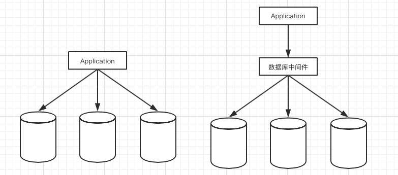
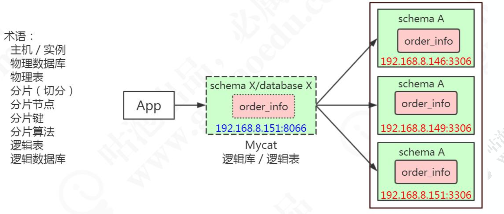
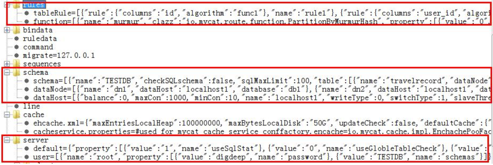
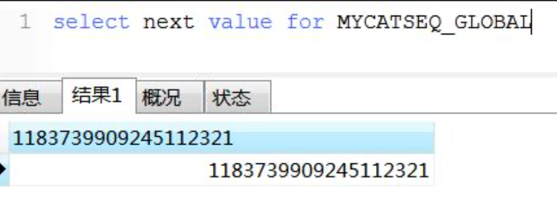
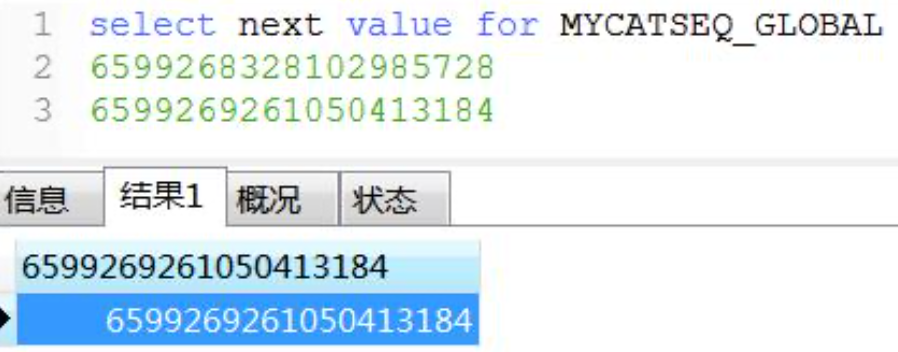
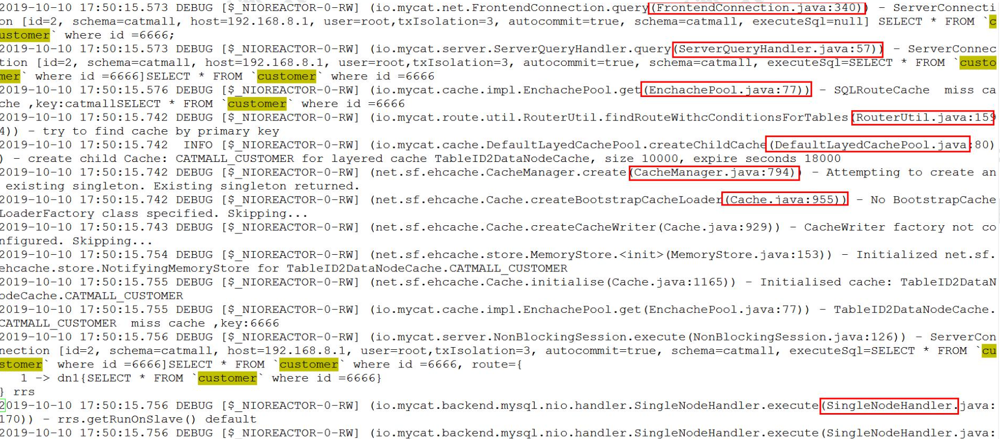

<table/>
# Mycat基础

官网 http://www.mycat.io/

 Mycat 概要介绍 https://github.com/MyCATApache/Mycat-Server

入门指南 https://github.com/MyCATApache/Mycat-doc/tree/master/%E5%85%A5%E9%97%A8%E6%8C%87%E5%8D%97

## Mycat 概念

### 基本介绍

历史:从阿里 cobar 升级而来，由开源组织维护，2.0 正在开发中。

定位:运行在应用和数据库之间，可以当做一个 MySQL 服务器使用，实现对 MySQL 数据库的分库分表，也可以通过 JDBC 支持其他的数据库。



Mycat 的关键特性(官网首页)

支持SQL92标准

支持MySQL、Oracle、DB2、SQL Server、PostgreSQL等DB的常见SQL语法

遵守Mysql原生协议，跨语言，跨平台，跨数据库的通用中间件代理。

基于心跳的自动故障切换，支持读写分离，支持MySQL主从，以及galera cluster集群。

支持Galera for MySQL集群，Percona Cluster或者MariaDB cluster

基于Nio实现，有效管理线程，解决高并发问题。

支持数据的多片自动路由与聚合，支持sum,count,max等常用的聚合函数,支持跨库分页。

支持单库内部任意join，支持跨库2表join，甚至基于caltlet的多表join。

支持通过全局表，ER关系的分片策略，实现了高效的多表join查询。

支持多租户方案。

支持分布式事务（弱xa）。

支持XA分布式事务（1.6.5）。

支持全局序列号，解决分布式下的主键生成问题。

分片规则丰富，插件化开发，易于扩展。

强大的web，命令行监控。

支持前端作为MySQL通用代理，后端JDBC方式支持Oracle、DB2、SQL Server 、 mongodb 、巨杉。

支持密码加密

支持服务降级

支持IP白名单

支持SQL黑名单、sql注入攻击拦截

支持prepare预编译指令（1.6）

支持非堆内存(Direct Memory)聚合计算（1.6）

支持PostgreSQL的native协议（1.6）

支持mysql和oracle存储过程，out参数、多结果集返回（1.6）

支持zookeeper协调主从切换、zk序列、配置zk化（1.6）

支持库内分表（1.6）

集群基于ZooKeeper管理，在线升级，扩容，智能优化，大数据处理（2.0开发版）。

### 核心概念



| 概念       | 含义                                                         |
| ---------- | ------------------------------------------------------------ |
| 主机       | 物理主机，一台服务器，一个数据库服务，一个 3306 端口         |
| 物理数据库 | 真实的数据库，例如 146、150、151 的 gpcat 数据库             |
| 物理表     | 真实的表，例如 146、150、151 的 gpcat 数据库的 order_info 表 |
| 分片       | 分片以后数据存储的节点                                       |
| 分片键     | 分片依据的字段，例如 order_info 表以 id 为依据分片,id 就是分片键，通常是主键 |
| 分片算法   | 分片的规则，例如随机、取模、范围、哈希、枚举以及各种组合算法 |
| 逻辑表     | 相对于物理表，是分片表聚合后的结果，对于客户端来说跟真实的表没有区别 |
| 逻辑数据库 | 相对于物理数据库，是数据节点聚合后的结果，例如 catmall       |

下载、解压 Mycat(有 Windows 版本，可以在本地数据库测试)

http://dl.mycat.io/

```
wget http://dl.mycat.io/1.6.7.3/20190927161129/Mycat-server-1.6.7.3-release-20190927161129-linux.tar.gz tar -xzvf Mycat-server-1.6.7.3-release-20190927161129-linux.tar.gz
```

Mycat 解压以后有 5 个目录:

| 目录   | 作用      |
| ------ | --------- |
| bin    | 启动目录  |
| catlet | 空目录    |
| conf   | 配置目录  |
| lib    | jar包依赖 |
| logs   | 日志目录  |

## Mycat配置详解

主要的配置文件 server.xml、schema.xml、rule.xml 和具体的分片配置文件。

坑非常多，配置错误会导致无法启动，这个时候要看日志!

注意备份，不知道什么时候就跑不起来了.......

### server.xml

包含系统配置信息。

system 标签:例如字符集、线程数、心跳、分布式事务开关等等。

user 标签:配置登录用户和权限。

```xml
<user name="root" defaultAccount="true">
    <property name="password">123456</property> 
    <property name="schemas">catmall</property>
</user>
```

mycat 对密码加密:

```shell
java -cp Mycat-server-1.6.7.3-release.jar io.mycat.util.DecryptUtil 0:root:123456
```

### schema.xml

schema 在 MySQL 里面跟数据库是等价的。

schema.xml 包括逻辑库、表、分片规则、分片节点和数据源，可以定义多个 schema。

这里面有三个主要的标签(table、dataNode、dataHost):

#### `<table/>`

表名和库名最好都用小写

定义了逻辑表，以及逻辑表分布的节点和分片规则:

```xml
<schema name="catmall" checkSQLschema="false" sqlMaxLimit="100"> 
    <!-- 范围分片 -->
    <table name="customer" primaryKey="id" dataNode="dn1,dn2,dn3" rule="rang-long-cust" /> 
    <!-- 取模分片 -->
    <table name="order_info" dataNode="dn1,dn2,dn3" rule="mod-long-order" >
    <!-- ER 表 -->
    <childTable name="order_detail" primaryKey="id" joinKey="order_id" parentKey="order_id"/> </table>
    <!-- 全局表 -->
    <table name="student" primaryKey="sid" type="global" dataNode="dn1,dn2,dn3" /> </schema>
```

| 配置          | 作用                                                         |
| ------------- | ------------------------------------------------------------ |
| primaryKey    | 指定该逻辑表对应真实表的主键。MyCat 会缓存主键(通过 primaryKey 属性配置)与具体 dataNode的信息。当分片规则(rule)使用非主键进行分片时，那么在使用主键进行查询时，MyCat 就会通过缓存先确定记录在哪个dataNode上，然后再在该dataNode上执行查询。 如果没有缓存/缓存并没有命中的话，还是会发送语句给所有的dataNode。 |
| dataNode      | 数据分片的节点                                               |
| autoIncrement | 自增长(全局序列)，true 代表主键使用自增长策略                |
| type          | 全局表:global。其他:不配置                                   |

#### `<dataNode/>`

```xml
<dataNode name="dn1" dataHost="host1" database="gpcat" />
```

数据节点与物理数据库的对应关系。

#### `<dataHost/>`

配置物理主机的信息，readhost 是从属于 writehost 的。

```xml
<dataHost name="host1" maxCon="1000" minCon="10" balance="0" writeType="0" dbType="mysql" dbDriver="native" switchType="1" slaveThreshold="100">
    <heartbeat>select user()</heartbeat>
    <!-- can have multi write hosts -->
    <writeHost host="hostM1" url="localhost:3306" user="root" password="123456">
    <!-- can have multi read hosts -->
    <readHost host="hostS2" url="192.168.8.146:3306" user="root" password="xxx"/> </writeHost>
    <writeHost host="hostS1" url="localhost:3316" user="root" password="123456"/>
    <!-- <writeHost host="hostM2" url="localhost:3316" user="root" password="123456"/> -->
</dataHost>
```

balance:负载的配置，决定 select 语句的负载

| 值   | 作用                                                         |
| ---- | ------------------------------------------------------------ |
| 0    | 不开启读写分离机制，所有读操作都发送到当前可用的 writeHost 上。 |
| 1    | 所有读操作都随机发送到当前的 writeHost 对应的 readHost 和备用的 writeHost |
| 2    | 所有的读操作都随机发送到所有的 writeHost,readHost 上         |
| 3    | 所有的读操作都只发送到 writeHost 的 readHost 上              |

writeType:读写分离的配置，决定 update、delete、insert 语句的负载

| 值   | 作用                                                         |
| ---- | ------------------------------------------------------------ |
| 0    | 所有写操作都发送到可用的 writeHost 上(默认第一个，第一个挂了以后发到第二个) |
| 1    | 所有写操作都随机的发送到 writeHost                           |

switchType:主从切换配置

| 值   | 作用                                                         |
| ---- | ------------------------------------------------------------ |
| -1   | 表示不自动切换                                               |
| 1    | 默认值，表示自动切换                                         |
| 2    | 基于 MySQL 主从同步的状态决定是否切换,心跳语句为 show slave status |
| 3    | 基于 MySQL galary cluster 的切换机制(适合集群)(1.4.1)，心跳语句为 show status like 'wsrep%'。 |

### rule.xml

定义了分片规则和算法

分片规则:

```xml
<tableRule name="rang-long-cust"> 
    <rule>
        <columns>id</columns>
        <algorithm>func-rang-long-cust</algorithm> 
    </rule>
</tableRule>
```

分片算法:

```xml
<function name="func-rang-long-cust" class="io.mycat.route.function.AutoPartitionByLong"> 
	<property name="mapFile">rang-long-cust.txt</property>
</function>
```

分片配置:rang-long-cust.txt

```xml
10001-20000=1 
0-10000=0 
20001-100000=2
```

### ZK 配置

https://www.cnblogs.com/leeSmall/p/9551038.html

Mycat 也支持 ZK 配置(用于管理配置和生成全局 ID)，执行 bin 目录下 init_zk_data.sh,会自动将 zkconf 下的所有配置文件上传到 ZK(先拷贝到这个目录)。

```shell
cd /usr/local/soft/mycat/conf
cp *.txt *.xml *.properties zkconf/ 
cd /usr/local/soft/mycat/bin 
./init_zk_data.sh
```

启用 ZK 配置:

mycat/conf/myid.properties

```properties
loadZk=true
zkURL=127.0.0.1:2181
clusterId=010
myid=01001
clusterSize=1
clusterNodes=mycat_gp_01
#server booster ; booster install on db same server,will reset all minCon to 2 type=server
boosterDataHosts=dataHost1
```

注意如果执行 init_zk_data.sh 脚本报错的话，代表未写入成功，此时不要启用 ZK 配置并重启，否则本地文件会被覆盖。

启动时如果 loadzk=true 启动时，会自动从 zk 下载配置文件覆盖本地配置。

在这种情况下如果修改配置，需要先修改 conf 目录的配置，copy 到 zkconf，再执行上传。



### 启动停止

进入 mycat/bin 目录(注意要先启动物理数据库):

| 操作     | 命令            |
| -------- | --------------- |
| 启动     | ./mycat start   |
| 停止     | ./mycat stop    |
| 重启     | ./mycat restart |
| 查看状态 | ./mycat status  |
| 前台运行 | ./mycat console |

连接:

```shell
mysql -uroot -p123456 -h 192.168.8.151 -P8066 catmall
```


## Mycat全局ID

Mycat 全局序列实现方式主要有 4 种:本地文件方式、数据库方式、本地时间戳 算法、ZK。也可以自定义业务序列。

注意获取全局 ID 的前缀都是:MYCATSEQ_

### 文件方式

配置文件 server.xml sequnceHandlerType 值:

0 文件 1数据库 2 本地时间戳 3ZK

```xml
<property name="sequnceHandlerType">0</property>
```

文件方式，配置 conf/sequence_conf.properties

```properties
CUSTOMER.HISIDS= 
CUSTOMER.MINID=10000001 
CUSTOMER.MAXID=20000000 
CUSTOMER.CURID=10000001
```

语法:select next value for MYCATSEQ_CUSTOMER

```sql
INSERT INTO `customer` (`id`, `name`) VALUES (next value for MYCATSEQ_CUSTOMER, 'qingshan');
```

优点:本地加载，读取速度较快。

缺点:当 Mycat 重新发布后，配置文件中的 sequence 需要替换。Mycat 不能 做集群部署。

### 数据库方式

```xml
<property name="sequnceHandlerType">1</property>
```

配置: sequence_db_conf.properties

把这张表创建在 146 上，所以是 dn1

```properties
#sequence stored in datanode
GLOBAL=dn1 
CUSTOMER=dn1
```

在第一个数据库节点上创建 MYCAT_SEQUENCE 表:

```mysql
DROP TABLE IF EXISTS MYCAT_SEQUENCE; 
CREATE TABLE MYCAT_SEQUENCE (
    name VARCHAR(50) NOT NULL,
    current_value INT NOT NULL,
    increment INT NOT NULL DEFAULT 1, 
    remark varchar(100),
PRIMARY KEY(name)) ENGINE=InnoDB;
```

注:可以在 schema.xml 配置文件中配置这张表，供外部访问。

```xml
<table name="mycat_sequence" dataNode="dn1" autoIncrement="true" primaryKey="id"></table>
```

创建存储过程——获取当前 sequence 的值

```mysql
DROP FUNCTION IF EXISTS `mycat_seq_currval`;
DELIMITER ;;
CREATE DEFINER=`root`@`%` FUNCTION `mycat_seq_currval`(seq_name VARCHAR(50)) RETURNS varchar(64) CHARSET latin1
DETERMINISTIC
BEGIN
DECLARE retval VARCHAR(64);
SET retval="-999999999,null";
SELECT concat(CAST(current_value AS CHAR),",",CAST(increment AS CHAR) ) INTO retval FROM MYCAT_SEQUENCE WHERE name = seq_name;
RETURN retval ;
END
;;
DELIMITER ;
```

创建存储过程，获取下一个 sequence

```mysql
DROP FUNCTION IF EXISTS `mycat_seq_nextval`;
DELIMITER ;;
CREATE DEFINER=`root`@`%` FUNCTION `mycat_seq_nextval`(seq_name VARCHAR(50)) RETURNS varchar(64) CHARSET latin1
DETERMINISTIC
BEGIN
UPDATE MYCAT_SEQUENCE
SET current_value = current_value + increment WHERE name = seq_name; 
RETURN mycat_seq_currval(seq_name);
END
;;
DELIMITER ;
```

创建存储过程，设置 sequence

```mysql
DROP FUNCTION IF EXISTS `mycat_seq_setval`;
DELIMITER ;;
CREATE DEFINER=`root`@`%` FUNCTION `mycat_seq_setval`(seq_name VARCHAR(50), value INTEGER) RETURNS varchar(64) CHARSET latin1
DETERMINISTIC
BEGIN
UPDATE MYCAT_SEQUENCE
SET current_value = value
WHERE name = seq_name;
RETURN mycat_seq_currval(seq_name);
END
;;
DELIMITER ;
```

插入记录

```mysql
INSERT INTO MYCAT_SEQUENCE(name,current_value,increment,remark) VALUES ('GLOBAL', 1, 100,''); INSERT INTO MYCAT_SEQUENCE(name,current_value,increment,remark) VALUES ('ORDERS', 1, 100,'订单表使 用');
```

测试

```mysql
select next value for MYCATSEQ_ORDERS
```

### 本地时间戳方式

ID= 64 位二进制 (42(毫秒)+5(机器 ID)+5(业务编码)+12(重复累加) ，长度为 18 位

```xml
<property name="sequnceHandlerType">2</property>
```

配置文件 sequence_time_conf.properties

```properties
#sequence depend on TIME
WORKID=01 
DATAACENTERID=01
```

验证:select next value for MYCATSEQ_GLOBAL



### ZK 方式

修改 conf/myid.properties

设置 loadZk=true(启动时会从 ZK 加载配置，一定要注意备份配置文件，并且先用 bin/init_zk_data.sh,把配置文件写入到 ZK)

```xml
<property name="sequnceHandlerType">3</property>
```

配置文件:sequence_distributed_conf.properties

```properties
# 代表使用 zk
INSTANCEID=ZK
# 与 myid.properties 中的 CLUSTERID 设置的值相同 
CLUSTERID=010
```

复制配置文件

```shell
cd /usr/local/soft/mycat/conf
cp *.txt *.xml *.properties zkconf/ 
chown -R zkconf/
cd /usr/local/soft/mycat/bin 
./init_zk_data.sh
```

验证:select next value for MYCATSEQ_GLOBAL



使用

在 schema.xml 的 table 标签上配置 autoIncrement="true"，不需要获取和指定 序列的情况下，就可以使用全局 ID 了。

## Mycat 监控与日志查看

### 监控

#### 命令行监控

```shell
mysql -uroot -h127.0.0.1 -p123456 -P9066
```

全部命令:

```mysql
mysql>show @@help;
```

| 命令              | 作用                                                         |
| ----------------- | ------------------------------------------------------------ |
| show @@server     | 查看服务器状态，包括占用内存等                               |
| show @@database   | 查看数据库                                                   |
| show @@datanode   | 查看数据节点                                                 |
| show @@datasource | 查看数据源                                                   |
| show @@connection | 该命令用于获取 Mycat 的前端连接状态，即 应用与 mycat 的连接  |
| show @@backend    | 查看后端连接状态                                             |
| show @@cache      | 查看缓存使用情况<br/> SQLRouteCache:sql 路由缓存。<br/>TableID2DataNodeCache : 缓存表主键与分片对应关系。<br/>ER_SQL2PARENTID :缓存 ER 分片中子表与父表关系 |
| reload @@config   | 重新加载基本配置，使用这个命令时 mycat 服务不可用            |
| show @@sysparam   | 查看参数                                                     |
| show @@sql.high   | 执行频率高的 SQL                                             |
| show @@sql.slow   | 慢 SQL<br/>设置慢 SQL 的命令:reload @@sqlslow=5 ;            |

#### 命令行监控 mycatweb 监控

https://github.com/MyCATApache/Mycat-download/tree/master/mycat-web-1.0

Mycat-eye 是 mycat 提供的一个监控工具，它依赖于 ZK。 本地必须要运行一个 ZK，必须先启动 ZK。

参考:[zk的安装](https://github.com/wenbin8/doc/blob/master/分布式/分布式协调服务/zookeeper/01-zookeeper的安装部署.md)

下载 mycat-web

```shell
cd /usr/local/soft
wget http://dl.mycat.io/mycat-web-1.0/Mycat-web-1.0-SNAPSHOT-20170102153329-linux.tar.gz tar -xzvf Mycat-web-1.0-SNAPSHOT-20170102153329-linux.tar.gz
```

启动 mycat-web

```shell
cd mycat-web nohup 
./start.sh &
```

停止:kill start.jar 相关的进程

访问端口 8082

http://192.168.8.151:8082/mycat/

mycat server.xml 配置

```xml
<!-- 1 为开启实时统计、0 为关闭 --> 
<property name="useSqlStat">1</property>
```

重启 mycat 服务生效

### 日志

log4j 的 level 配置要改成 debug

#### wrapper.log 日志

wrapper 日志:mycat 启动，停止，添加为服务等都会记录到此日志文件，如果系统环境配置错误或缺少配置时，导致 Mycat 无法启动，可以通过查看 wrapper.log 定位具体错误原因。

#### mycat.log 日志

mycat.log 为 mycat 主要日志文件，记录了启动时分配的相关 buffer 信息，数据源连接信息，连接池，动态类加载信息等等。

在 conf/log4j2.xml 文件中进行相关配置，如保留个数，大小，字符集，日志文件大小等。

以 select 为例。



