# Mycat进阶

## MySQL 主从复制

### 主从复制的含义

在 MySQL 多服务器的架构中，至少要有一个主节点(master)，跟主节点相对的， 我们把它叫做从节点(slave)。主从复制，就是把主节点的数据复制到一个或者多个从节点。主服务器和从服务器可以在不同的 IP 上，通过远程连接来同步数据，这个是异步的过程。

### 主从复制的形式

一主一从/一主多从

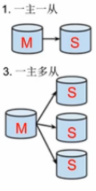

多主一从

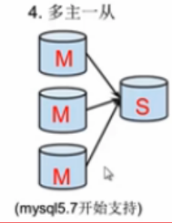

主主复制

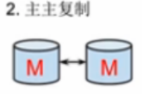

级联复制

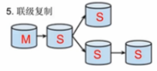

### 主从复制的用途

数据备份:把数据复制到不同的机器上，以免单台服务器发生故障时数据丢失。 

读写分离:让主库负责写，从库负责读，从而提高读写的并发度。

高可用 HA:当节点故障时，自动转移到其他节点，提高可用性。 

扩展:结合负载的机制，均摊所有的应用访问请求，降低单机 IO。

### binlog

客户端对 MySQL 数据库进行操作的时候，包括 DDL 和 DML 语句，服务端会在日志文件中用事件的形式记录所有的操作记录，这个文件就是 binlog 文件(属于逻辑日志， 跟 Redis 的 AOF 文件类似)。

基于 binlog，我们可以实现主从复制和数据恢复。

Binlog 默认是不开启的，需要在服务端手动配置。注意有一定的性能损耗。

#### binlog 配置

编辑 /etc/my.cnf

```properties
log-bin=/var/lib/mysql/mysql-bin 
server-id=1
```

重启 MySQL 服务

```shell
service mysqld stop 
service mysqld start
## 如果出错查看日志
vi /var/log/mysqld.log 
cd /var/lib/mysql
```

是否开启 binlog

```mysql
show variables like 'log_bin%';
```

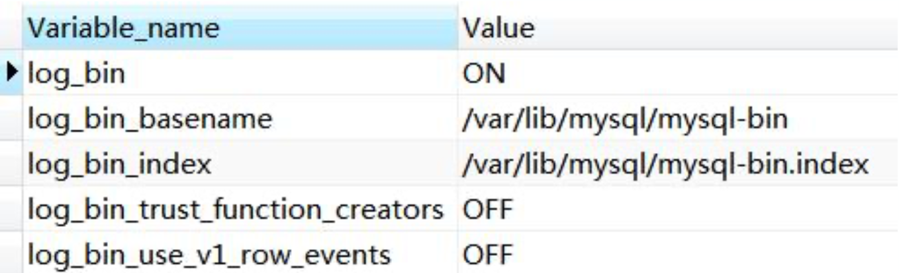

#### binlog 格式

STATEMENT:记录每一条修改数据的 SQL 语句(减少日志量，节约 IO)。

ROW:记录哪条数据被修改了，修改成什么样子了(5.7 以后默认)。

MIXED:结合两种方式，一般的语句用 STATEMENT，函数之类的用 ROW。

##### 查看 binlog 格式

```mysql
show global variables like '%binlog_format%';
```

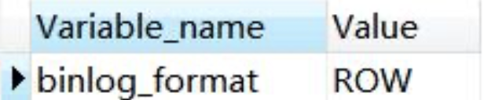

##### 查看 binlog 列表

```mysql
show binary logs;
```

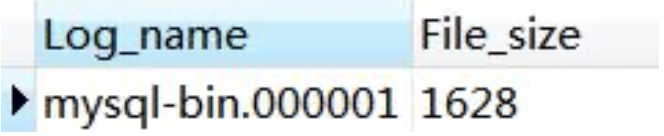

##### 查看 binlog 内容

```mysql
show binlog events in 'mysql-bin.000001';
```

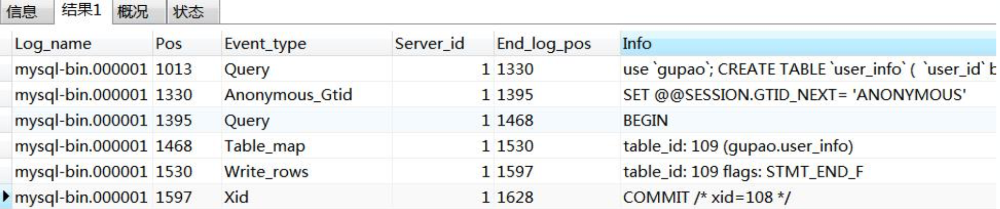

用 mysqlbinlog 工具，基于时间查看 binlog

```shell
/usr/bin/mysqlbinlog --start-datetime='2019-08-22 13:30:00' --stop-datetime='2019-08-22 14:01:01' -d gupao /var/lib/mysql/mysql-bin.000001
```

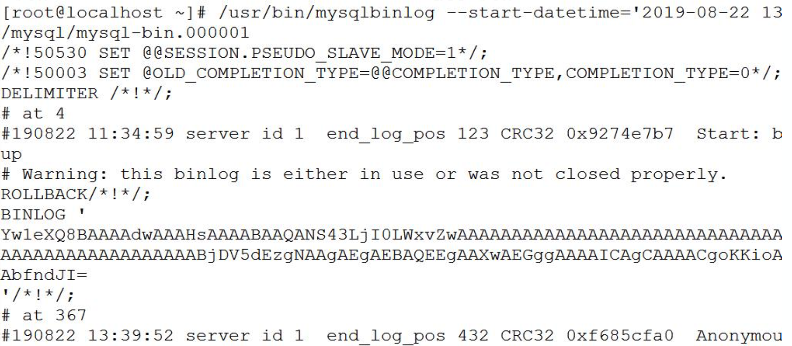

### 主从复制原理

#### 主从复制配置

1. 主库开启 binlog，设置 server-id

2. 在主库创建具有复制权限的用户，允许从库连接

   ```mysql
   GRANT REPLICATION SLAVE, REPLICATION CLIENT ON *.* TO 'repl'@'192.168.8.147' IDENTIFIED BY '123456';
   FLUSH PRIVILEGES;
   ```

3. 从库/etc/my.cnf 配置，重启数据库

   ```properties
   server-id=2 
   log-bin=mysql-bin 
   relay-log=mysql-relay-bin 
   read-only=1 
   log-slave-updates=1
   ```

   log-slave-updates 决定了在从 binlog 读取数据时，是否记录 binlog，实现双主和级联的关键。

4. 在从库执行

   ```mysql
   stop slave;
   change master to master_host='192.168.8.146',master_user='repl',master_password='123456',master_log_file='mysql-bin.000001', master_log_pos=4;
   start slave;
   ```

5. 查看同步状态

   ```
   SHOW SLAVE STATUS \G
   ```

   以下为正常:

   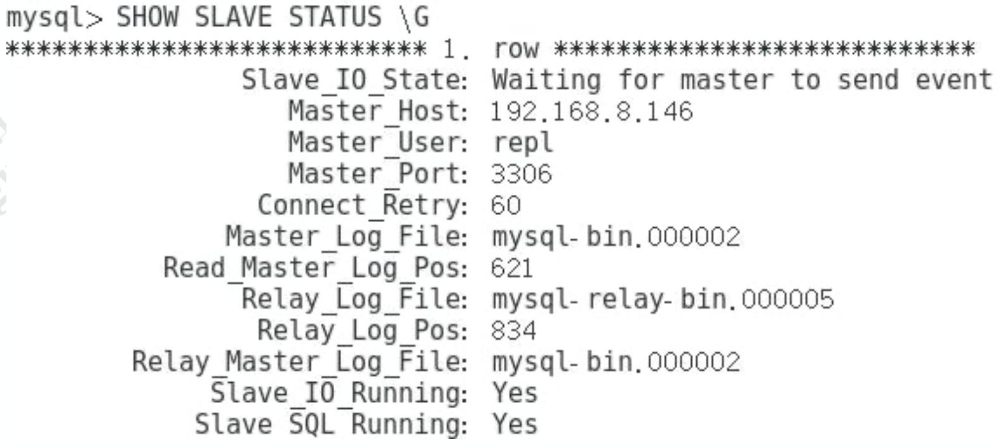


#### 主从复制原理

这里面涉及到几个线程:

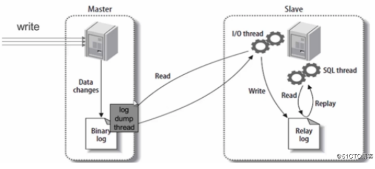

1. slave 服务器执行 start slave，开启主从复制开关， slave 服务器的 IO 线程请求从 master 服务器读取 binlog(如果该线程追赶上了主库，会进入睡眠状态)。
2. master 服务器创建 Log Dump 线程，把 binlog 发送给 slave 服务器。slave 服务器把读取到的 binlog 日志内容写入中继日志 relay log(会记录位置信息，以便下次继续读取)。
3. slave 服务器的 SQL 线程会实时检测 relay log 中新增的日志内容，把 relay log 解析成 SQL 语句，并执行。

## Mycat 高可用

目前 Mycat 没有实现对多 Mycat 集群的支持，可以暂时使用 HAProxy 来做负载思路:HAProxy 对 Mycat 进行负载。Keepalived 实现 VIP。

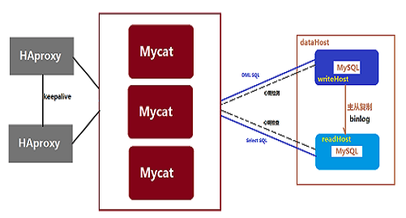

## Mycat 注解

### 注解的作用

当关联的数据不在同一个节点的时候，Mycat 是无法实现跨库 join 的。

Mycat 作为一个中间件，有很多自身不支持的 SQL 语句，比如存储过程，但是这些语句在实际的数据库节点上是可以执行的。==有没有办法让 Mycat 做一层透明的代理转发， 直接找到目标数据节点去执行这些 SQL 语句呢?==

那我们必须要有一种方式告诉 Mycat 应该在哪个节点上执行。这个就是 Mycat 的注解。我们在需要执行的 SQL 语句前面加上一段代码，帮助 Mycat 找到我们的目标节点。

### 注解的用法

注解的形式是 :

`/*!mycat: sql=注解 SQL 语句*/`

注解的使用方式是 :

`/*!mycat: sql=注解 SQL 语句*/ 真正执行的 SQL`

使用时将 = 号后的 "注解 SQL 语句" 替换为需要的 SQL 语句即可。

使用注解有一些限制，或者注意的地方:

| 原始 **SQL** | 注解 **SQL**                                                 |
| ------------ | ------------------------------------------------------------ |
| select       | 如果需要确定分片，则使用能确定分片的注解，比如/*!mycat: sql=select * from users where user_id=1*/<br/>如果要在所有分片上执行则可以不加能确定分片的条件 |
| insert       | 使用 insert 的表作为注解 SQL，必须能确定到某个分片 原始 SQL 插入的字段必须包括分片字段<br/>非分片表(只在某个节点上):必须能确定到某个分片 |
| delete       | 使用 delete 的表作为注解 SQL                                 |
| update       | 使用 update 的表作为注解 SQL                                 |

使用注解并不额外增加 MyCat 的执行时间;从解析复杂度以及性能考虑，注解 SQL 应尽量简单，因为它只是用来做路由的。

### 注解使用示例

#### 创建表或存储过程

customer.id=1 全部路由到 146

```mysql
-- 存储过程
/*!mycat: sql=select * from customer where id =1 */ CREATE PROCEDURE test_proc() BEGIN END ; 
-- 表
/*!mycat: sql=select * from customer where id =1 */ CREATE TABLE test2(id INT);
```

#### 特殊语句自定义分片

Mycat 本身不支持 insert select，通过注解支持

```mysql
/*!mycat: sql=select * from customer where id =1 */ INSERT INTO test2(id) SELECT id FROM order_detail;
```

#### 多表 ShareJoin

```mysql
/*!mycat:catlet=io.mycat.catlets.ShareJoin */
select a.order_id,b.price from order_info a, order_detail b where a.nums = b.goods_id;
```

#### 读写分离

读写分离 : 配置 Mycat 读写分离后，默认查询都会从读节点获取数据，但是有些场景需要获取实时数据，如果从读节点获取数据可能因延时而无法实现实时，Mycat 支持通过注解 `/*balance*/` 来强制从写节点(write host)查询数据。

```mysql
/*balance*/ select a.* from customer a where a.id=6666;
```

#### 读写分离数据库选择(1.6 版本之后)

```mysql
/*!mycat: db_type=master */ select * from customer; 
/*!mycat: db_type=slave */ select * from customer; 
/*#mycat: db_type=master */ select * from customer; 
/*#mycat: db_type=slave */ select * from customer;
```

注解支持的'! '不被 mysql 单库兼容 

注解支持的'#'不被 MyBatis 兼容

随着 Mycat 的开发，更多的新功能正在加入。

### 注解原理

Mycat 在执行 SQL 之前会先解析 SQL 语句，在获得分片信息后再到对应的物理节点上执行。如果 SQL 语句无法解析，则不能被执行。如果语句中有注解，则会先解析注解的内容获得分片信息，再把真正需要执行的 SQL 语句发送对对应的物理节点上。

所以我们在使用主机的时候，应该清楚地知道目标 SQL 应该在哪个节点上执行，注解的 SQL 也指向这个分片，这样才能使用。如果注解没有使用正确的条件，会导致原始 SQL 被发送到所有的节点上执行，造成数据错误。

## 分片策略详解

分片的目标是将大量数据和访问请求均匀分布在多个节点上，通过这种方式提升数据服务的存储和负载能力。

### Mycat分片策略详解

总体上分为**连续分片和离散分片**，还有一种是连续分片和离散分片的结合，例如先范围后取模。

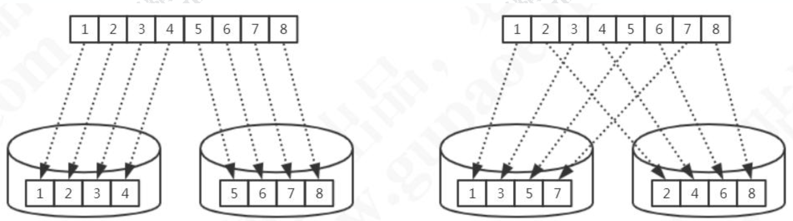

比如范围分片(id 或者时间)就是典型的连续分片，单个分区的数量和边界是确定的。离散分片的分区总数量和边界是确定的，例如对 key 进行哈希运算，或者再取模。

关键词:范围查询、热点数据、扩容

连续分片优点:

1. 范围条件查询消耗资源少(不需要汇总数据)
2. 扩容无需迁移数据(分片固定)

连续分片缺点:

1. 存在数据热点的可能性
2. 并发访问能力受限于单一或少量 DataNode(访问集中)

离散分片优点:

1. 并发访问能力增强(负载到不同的节点)
2. 范围条件查询性能提升(并行计算)

离散分片缺点:

1. 数据扩容比较困难，涉及到数据迁移问题
2. 数据库连接消耗比较多

### 连续分片

#### 范围分片

```xml
<tableRule name="auto-sharding-long"> 
    <rule>
        <columns>id</columns> 
        <algorithm>rang-long</algorithm>
    </rule> 
</tableRule>
```

```xml
<function name="rang-long" class="io.mycat.route.function.AutoPartitionByLong"> 	
	<property name="mapFile">autopartition-long.txt</property>
</function>
```

```properties
# range start-end ,data node index 
# K=1000,M=10000.
0-500M=0
500M-1000M=1 
1000M-1500M=2
```

特点:容易出现冷热数据

#### 按自然月分片

建表语句

```mysql
CREATE TABLE `sharding_by_month` (
    `create_time` timestamp NULL DEFAULT NULL ON UPDATE CURRENT_TIMESTAMP,
    `db_nm` varchar(20) DEFAULT NULL
) ENGINE=InnoDB DEFAULT CHARSET=utf8;
```

逻辑表

```xml
<schema name="catmall" checkSQLschema="false" sqlMaxLimit="100">
	<table name="sharding_by_month" dataNode="dn1,dn2,dn3" rule="qs-sharding-by-month" />
</schema>
```

分片规则

```xml
<tableRule name="sharding-by-month"> 
    <rule>
        <columns>create_time</columns>
        <algorithm>qs-partbymonth</algorithm> 
    </rule>
</tableRule>
```

分片算法

```xml
<function name="qs-partbymonth" class="io.mycat.route.function.PartitionByMonth"> 
    <property name="dateFormat">yyyy-MM-dd</property>
    <property name="sBeginDate">2019-10-01</property>
    <property name="sEndDate">2019-12-31</property>
</function>
```

columns 标识将要分片的表字段，字符串类型，与 dateFormat 格式一致。 

algorithm 为分片函数。

dateFormat 为日期字符串格式。

sBeginDate 为开始日期。

sEndDate 为结束日期 

注意:节点个数要大于月份的个数


另外还有按天分片(可以指定多少天一个分片)、按小时分片

### 离散分片

#### 枚举分片

将所有可能出现的值列举出来，指定分片。例如:全国 34 个省，要将不同的省的数据存放在不同的节点，可用枚举的方式。

建表语句:

```mysql
CREATE TABLE `sharding_by_intfile` (
`age` int(11) NOT NULL,
`db_nm` varchar(20) DEFAULT NULL
) ENGINE=InnoDB DEFAULT CHARSET=utf8;
```

逻辑表:

```xml
<table name="sharding_by_intfile" dataNode="dn$1-3" rule="qs-sharding-by-intfile" />
```

分片规则:

```xml
<tableRule name="sharding-by-intfile"> 
    <rule>
        <columns>sharding_id</columns>
        <algorithm>hash-int</algorithm> 
    </rule>
</tableRule>
```

分片算法:

```xml
<function name="hash-int" class="org.opencloudb.route.function.PartitionByFileMap"> 
    <property name="mapFile">partition-hash-int.txt</property>
    <property name="type">0</property>
    <property name="defaultNode">0</property>
</function>
```

type:默认值为 0，0 表示 Integer，非零表示 String。

PartitionByFileMap.java，通过 map 来实现。

策略文件:partition-hash-int.txt

```properties
16=0
17=1
18=2
```

特点:适用于枚举值固定的场景。

#### 一致性哈希

一致性 hash 有效解决了分布式数据的扩容问题。

建表语句:

```mysql
CREATE TABLE `sharding_by_murmur` (
`id` int(10) DEFAULT NULL,
`db_nm` varchar(20) DEFAULT NULL
) ENGINE=InnoDB DEFAULT CHARSET=utf8;
```

逻辑表

```xml
<schema name="test" checkSQLschema="false" sqlMaxLimit="100">
    <table name="sharding_by_murmurhash" primaryKey="id" dataNode="dn$1-3" rule="sharding-by-murmur" />
</schema>
```

分片规则

```xml
<tableRule name="sharding-by-murmur"> 
    <rule>
        <columns>id</columns>
        <algorithm>qs-murmur</algorithm> 
    </rule>
</tableRule>
```

分片算法

```xml
<function name="qs-murmur" class="io.mycat.route.function.PartitionByMurmurHash"> 
    <property name="seed">0</property>
    <property name="count">3</property>
    <property name="virtualBucketTimes">160</property>
</function>
```

特点:可以一定程度减少数据的迁移。

#### 十进制取模分片

根据分片键进行十进制求模运算。

分片规则

```xml
<tableRule name="mod-long">
    <rule>
        <columns>sid</columns>
        <algorithm>mod-long</algorithm> 
    </rule>
</tableRule>
```

分片算法

```xml
<function name="mod-long" class="io.mycat.route.function.PartitionByMod"> 
    <!-- how many data nodes -->
    <property name="count">3</property>
</function>
```

特点:分布均匀，但是迁移工作量比较大

#### 固定分片哈希

这是先求模得到逻辑分片号，再根据逻辑分片号直接映射到物理分片的一种散列算法。

建表语句:

```mysql
CREATE TABLE `sharding_by_long` ( 
`id` int(10) DEFAULT NULL,
`db_nm` varchar(20) DEFAULT NULL
) ENGINE=InnoDB DEFAULT CHARSET=utf8;
```

逻辑表

```xml
<schema name="test" checkSQLschema="false" sqlMaxLimit="100">
	<table name="sharding_by_long" dataNode="dn$1-3" rule="qs-sharding-by-long" />
</schema>
```

分片规则

```xml
<tableRule name="qs-sharding-by-long"> <rule>
    <columns>id</columns>
    <algorithm>qs-sharding-by-long</algorithm> </rule>
</tableRule>
```

平均分成 8 片(%1024 的余数，1024=128*8):

```xml
<function name="qs-sharding-by-long" class="io.mycat.route.function.PartitionByLong"> 
    <property name="partitionCount">8</property>
	<property name="partitionLength">128</property>
</function>
```

- partitionCount 为指定分片个数列表。 
- partitionLength 为分片范围列表。

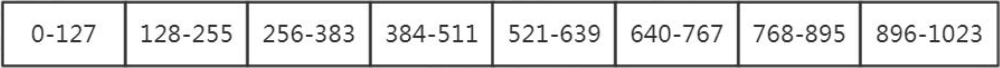

#### 取模范围分片

逻辑表

```xml
<schema name="test" checkSQLschema="false" sqlMaxLimit="100">
    <table name="sharding_by_pattern" primaryKey="id" dataNode="dn$0-10" rule="qs-sharding-by-pattern" />
</schema>
```

建表语句

```mysql
CREATE TABLE `sharding_by_pattern` (
`id` varchar(20) DEFAULT NULL,
`db_nm` varchar(20) DEFAULT NULL
) ENGINE=InnoDB DEFAULT CHARSET=utf8;
```

分片规则

```xml
<tableRule name="sharding-by-pattern"> 
    <rule>
		<columns>user_id</columns> 
        <algorithm>sharding-by-pattern</algorithm>
	</rule> 
</tableRule>
```

分片算法

```xml
<function name="sharding-by-pattern" class=" io.mycat.route.function.PartitionByPattern"> 
    <property name="patternValue">100</property>
    <property name="defaultNode">0</property>
    <property name="mapFile">partition-pattern.txt</property>
</function>
```

patternValue 取模基数，这里设置成 100

partition-pattern.txt，一共 3 个节点

id=19%100=19，在 dn1; 

id=222%100=22，dn2; 

id=371%100=71，dn3

```properties
# id partition range start-end ,data node index ###### first host configuration
1-20=0
21-70=1
71-100=2 0-0=0
```

特点:可以调整节点的数据分布。

#### 范围取模分片

建表语句

```mysql
CREATE TABLE `sharding_by_rang_mod` (
`id` bigint(20) DEFAULT NULL,
`db_nm` varchar(20) DEFAULT NULL
) ENGINE=InnoDB DEFAULT CHARSET=utf8;
```

逻辑表

```xml
<schema name="test" checkSQLschema="false" sqlMaxLimit="100">
	<table name="sharding_by_rang_mod" dataNode="dn$1-3" rule="qs-sharding-by-rang-mod" />
</schema>
```

分片规则

```xml
<tableRule name="qs-sharding-by-rang-mod"> 
    <rule>
        <columns>id</columns>
        <algorithm>qs-rang-mod</algorithm> 
    </rule>
</tableRule>
```

分片算法

```xml
<function name="qs-rang-mod" class="io.mycat.route.function.PartitionByRangeMod"> 
	<property name="mapFile">partition-range-mod.txt</property>
</function>
```

partition-range-mod.txt

```properties
# range start-end ,data node group size
0-20000=1 
20001-40000=2
```

解读:先范围后取模。Id 在 20000 以内的，全部分布到 dn1。Id 在 20001-40000 的，%2 分布到 dn2,dn3。

特点:扩容的时候旧数据无需迁移

#### 其他分片规则

应用指定分片 PartitionDirectBySubString

日期范围哈希 PartitionByRangeDateHash

冷热数据分片 PartitionByHotDate


也可以自定义分片规则:extends AbstractPartitionAlgorithm implements

RuleAlgorithm。

### 切分规则的选择

步骤:

1. 找到需要切分的大表，和关联的表
2. 确定分片字段(尽量使用主键)，一般用最频繁使用的查询条件
3. 考虑单个分片的存储容量和请求、数据增长(业务特性)、扩容和数据迁移问题。


例如:按照什么递增?序号还是日期?主键是否有业务意义?

一般来说，分片数要比当前规划的节点数要大。

总结:根据业务场景，合理地选择分片规则。

## Mycat 离线扩缩容

当我们规划了数据分片，而数据已经超过了单个节点的存储上线，或者需要下线节 点的时候，就需要对数据重新分片。

### Mycat自带的工具

#### 准备工作

1. mycat 所在环境安装 mysql 客户端程序。
2. mycat 的 lib 目录下添加 mysql 的 jdbc 驱动包。
3. 对扩容缩容的表所有节点数据进行备份，以便迁移失败后的数据恢复。

#### 步骤

以取模分片表 sharding-by-mod 缩容为例。

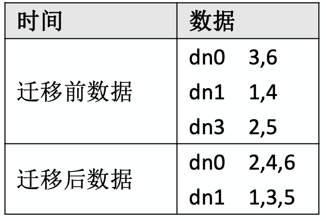

1. 复制 schema.xml、rule.xml 并重命名为 newSchema.xml、newRule.xml 放 于 conf 目录下。

2. 修改 newSchema.xml 和 newRule.xml 配置文件为扩容缩容后的  配置参数(表的节点数、数据源、路由规则)。

   注意:

   只有节点变化的表才会进行迁移。仅分片配置变化不会迁移。

   newSchema.xml

   ```xml
   <table name="sharding_by_mod" dataNode="dn1,dn2,dn3" rule="qs-sharding-by-mod" />
   ```

   改成(减少了一个节点):

   ```xml
   <table name="sharding_by_mod" dataNode="dn1,dn2" rule="qs-sharding-by-mod" />
   ```

   newRule.xml 修改 count 个数

   ```xml
   <function name="qs-sharding-by-mod-long" class="io.mycat.route.function.PartitionByMod"> 
   <property name="count">2</property>
   </function>
   ```

   

3. 修改 conf 目录下的 migrateTables.properties 配置文件，告诉工具哪些表需要进行扩容或缩容,没有出现在此配置文件的 schema 表不会进行数据迁移，格式:

   ```properties
   catmall=sharding-by-mod
   ```

   注意:

   1. 不迁移的表，不要修改 dn 个数，否则会报错。
   2. ER 表，因为只有主表有分片规则，子表不会迁移。

4. dataMigrate.sh 中这个必须要配置

   通过命令 "find / -name mysqldump" 查找 mysqldump 路径为 "/usr/bin/mysqldump"，指定#mysql bin 路径为"/usr/bin/"

   ```properties
   #mysql bin 路径
   RUN_CMD="$RUN_CMD -mysqlBin= /usr/bin/"
   ```

5. 停止 mycat 服务

6. 执行 bin/ dataMigrate.sh 脚本

   注意:必须要配置 Java 环境变量，不能用 openjdk

7. 脚本执行完成，如果最后的数据迁移验证通过，就可以将之前的 newSchema.xml 和 newRule.xml 替换之前的 schema.xml 和 rule.xml 文 件，并重启 mycat 即可。


注意事项:

1. 保证分片表迁移数据前后路由规则一致(取模——取模)。
2. 保证分片表迁移数据前后分片字段一致。
3. 全局表将被忽略。
4. 不要将非分片表配置到 migrateTables.properties 文件中。
5. 暂时只支持分片表使用 MySQL 作为数据源的扩容缩容。

migrate 限制比较多，还可以使用 mysqldump。

### mysqldump方式

系统第一次上线，把单张表迁移到 Mycat，也可以用 mysqldump。

**MySQL 导出**

```shell
mysqldump -uroot -p123456 -h127.0.0.1 -P3306 -c -t --skip-extended-insert gpcat > mysql-1017.sql
```

-c 代表带列名

 -t 代表只要数据，不要建表语句

--skip-extended-insert 代表生成多行 insert(mycat childtable 不支持多行插入ChildTable multi insert not provided)


**Mycat 导入**

```shell
mysql -uroot -p123456 -h127.0.0.1 -P8066 catmall < mysql-1017.sql
```

**Mycat 导出**

```shell
mysqldump -h192.168.8.151 -uroot -p123456 -P8066 -c -t --skip-extended-insert catmall customer > mycat-cust.sql
```

## 核心流程总结

官网的架构图:

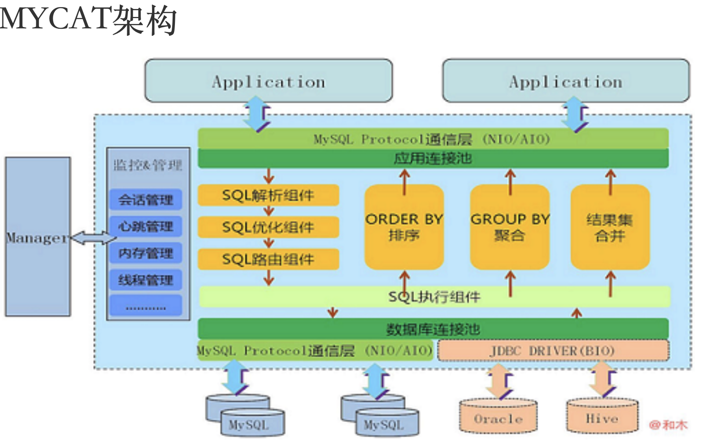

### 启动

1. MycatServer 启动，解析配置文件，包括服务器、分片规则等
2. 创建工作线程，建立前端连接和后端连接

### 执行SQL

1. 前端连接接收 MySQL 命令

2. 解析 MySQL，Mycat 用的是 Druid 的 DruidParser

3. 获取路由

4. 改写 MySQL，例如两个条件在两个节点上，则变成两条单独的 SQL 例如 select * from customer where id in(5000001, 10000001);

   改写成:

   select * from customer where id = 5000001;(dn2 执行)

   select * from customer where id = 10000001;(dn3 执行)

   又比如多表关联查询，先到各个分片上去获取结果，然后在内存中计算

5. 与后端数据库建立连接

6. 发送 SQL 语句到 MySQL 执行

7. 获取返回结果

8. 处理返回结果，例如排序、计算等等

9. 返回给客户端

