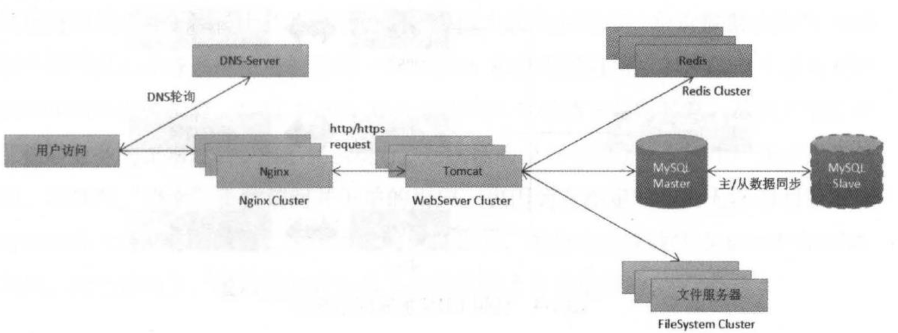
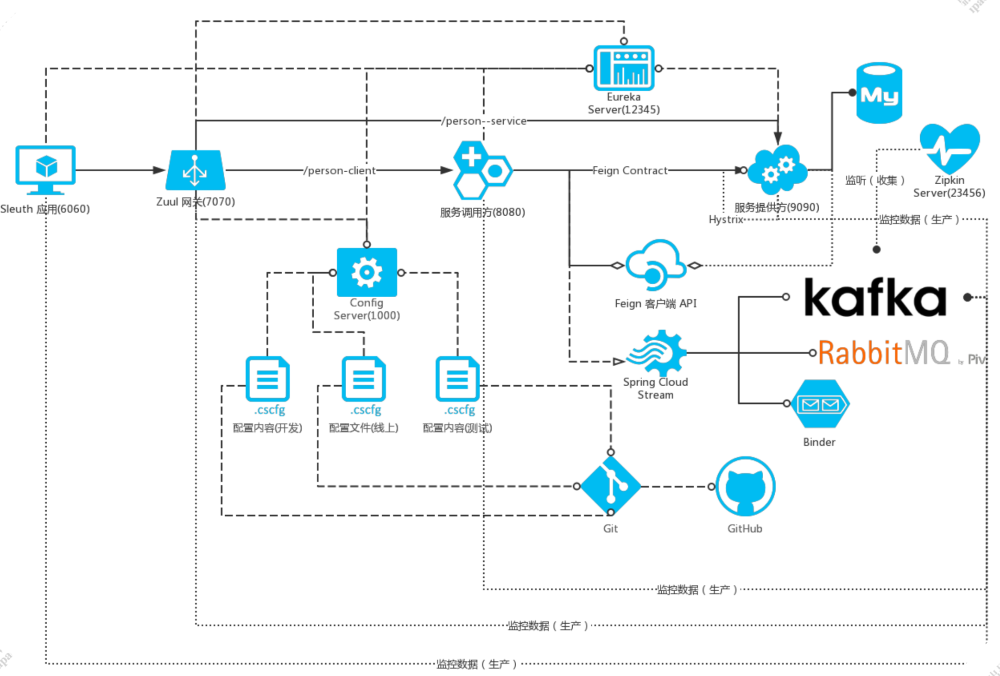
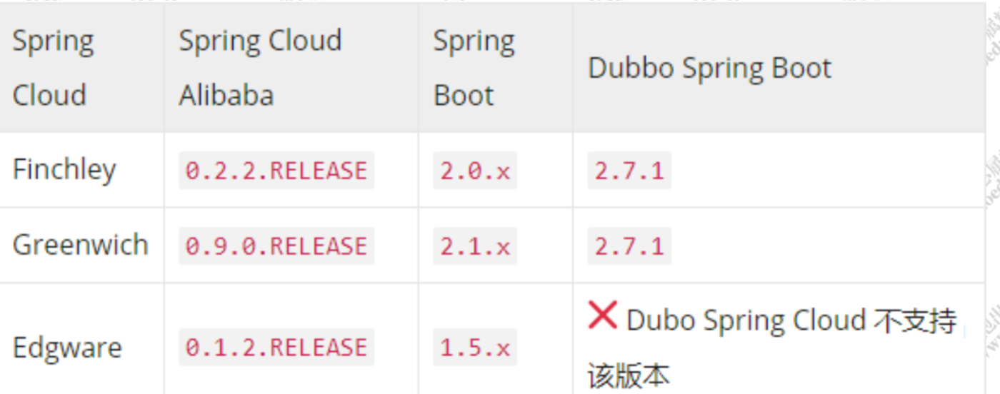
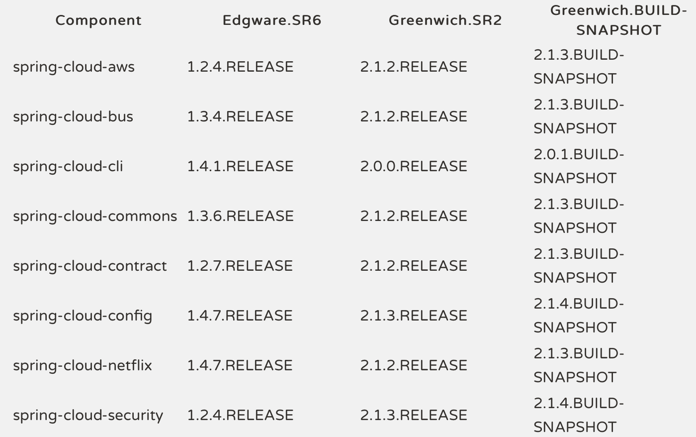

# 微服务的发展

## 从单体架构到微服务

### 单体架构

任何一个网站在发布初期都不能立马就拥有庞大的用户流量和海量数据，都是在不停的试错过程中一步一步演变其自身架构，满足自身业务。比如现在能够抗住双十一这么大流量的淘宝，它的技术最早用的LAMP （Linux+Apache+MySQL+PHP）。实际上架构越复杂，意味着业务的体量约庞大。

对于一个刚起步的项目，我们会选择简单快速的方式来实现。而单体架构是最好的选择，目前很多传统软件行业仍然采用这类架构。

一般的实施方案是，把所有的功能模块都打包在一个（jar\war），并且部署在一个web容器下，比如tomcat\weblogic\jboss中运行。

### 集群架构

一旦用户量以及流量开始增加，服务器的性能就会遇到瓶颈，这个时候必须要对系统架构做调整以及优化。而在这个阶段主要需要解决的问题是提升业务系统并行处理能力，降低单机系统负载，以便支撑更多的用户访问操作。

集群就是一种很好的方式，它可以**把多台独立的服务器通过网络连接进行组合，对外形成一个整体提供服务。**当一台服务器的处理能力接近或已超出其容量上限时，我们不会去尝试换一个更高性能的服务器，因为投入产出比不高，一般的做法就是采用集群技术，通过增加新的服务器来分散并发访问流量，**只要业务系统能够随意支持服务器的横向扩容，那么理论上来说就应该无惧任何挑战，从而实现可伸缩性和高可用性架构。**

### 业务垂直化拆分

虽然通过集群可以提升并行处理能力以及对于高可用的实现，但是同时还需要考虑到业务的复杂度，如果仍然把所有的业务逻辑全部耦合在一起放在一个war包中来管理，那对于代码的维护和扩展来说是非常困难的。而且如果某个业务功能出现故障，会导致整个系统不可用。所以这个阶段要做的是减低和业务的耦合度，提升系统容错性。

所以这个时候可以对业务进行垂直化拆分，简单来说，就是可以按照系统的业务功能拆分多个业务模块，比如电商网站会拆分出：首页、用户、搜索、订单、支付、商品等子系统。

每个子系统由不同的业务团队负责。

### 服务化改造

随着对业务系统进行垂直化改造之后，以业务功能维度拆分出来多个子系统，而在各个子系统中，会存在比较多的共享业务，比如用户信息查询，在支付业务中会涉及到、在首页中也会涉及到。那么势必会造成重复开发产生非常多的冗余代码。那么这个时候就引入了服务化改造思想，也就是SOA。

把一些通用的、会被多个上层服务调用的模块独立拆分出来，形成一些共享的基础服务。这些被拆分出来的共享服务相对来说是比较独立，并且可重用。比如用户管理服务，包含用户注册、用户查询等功能。比如单点登录服务；

**SOA的核心目标就是通过服务的流程化来实现业务的灵活性，形成一些共享的基础服务。这些被拆分出来的共享服务相对来说是比较独立，并且可重用。**比如用户管理服务，包含用户注册、用户查询等功能。比如单点登录服务；

**SOA面向服务架构，从语义上说，它于面向过程、面向对象、面向组件一样，是一种软件组建及开发的方式。所以在SOA中，服务是最核心的抽象手段，业务被划分为一些粗粒度的业务服务和业务流程。**

**SOA中更强调ESB企业服务总线，企业服务总线可以使得服务之间的交互是动态的，以及服务位置是透明的。这样的好处是服务的调用者和服务提供者之间是高度解耦的。从而使得服务有更高灵活性以及隔离性。**

**ESB：是从面相服务架构（SOA）发展过来的，主要是对多个系统中的服务调用者和服务提供者的解耦。ESB本身提供了服务暴露、接入、协议转化、数据格式转化、路由等功能。**

**SOA主要解决的问题：**

1. 信息孤岛
2. 互联互通
3. 业务重用

### 微服务架构

业务系统实施服务化改造后，原本共享的业务被拆分，形成可复用服务，可以在最大程度上避免共享业务的重复建设、资源链接瓶颈等问题出现。那么那些被拆分出来的服务，是否也需要以业务功能为维度进行拆分，使之能够独立进行部署，以减低业务耦合和提升，以降低业务耦合提升容错性呢？

**微服务并不是一种新思想的方法。它更像是一种思想的精炼，是一种服务化思想的最佳实践方向而已。**所以我认为微服务其实是在SOA思路下，随着各个企业对于服务化治理上不断的完善，以及对软件的交付链路以及基础设施逐步成熟之下的一种自然产物。**微服务也是一种面向服务的架构模型，只是它更强调服务的粒度。也就是服务的职责更加单一更加精炼我们也可以把SOA看成是微服务的超集。也就是多个微服务可以组成一个SOA服务。**

### 微服务和SOA架构的区别

这个区别要从架构的发展过程来了解。这两种架构模式，其实本质上应该是在分布式架构这条时间线上，基于服务化思想的不断完善，以及基础设施的逐步成熟之下的一种升级。既然存在于时间线的先后，那也就意味着这两种架构模式所关注的点不一样：

1. SOA关注的是服务的重用性、以及解决企业内部信息孤岛问题。
2. 微服务关注的是解耦，解耦和可用性在特定的角度来看是一样，但本质上是不同的。解耦是降低业务之间的耦合度（也就是微服务关注的服务粒度），可重用性关注的是服务的复用。
3. 微服务会使用更轻量级的通信协议，使用REST Ful风格的API。轻量级协议可以很好的支持夸语言，使得语言生态更加丰富。
4. 微服务会更多的关注DevOps的持续交付，因为服务粒度更细使得开发运维变得更加重要。所以微服务对于容器化技术的结合更加紧密。
5. SOA应该微服务的超集。

## Spring Cloud生态

提到微服务技术体系，大家第一个想到的应该是spring-cloud。什么是Spring Cloud？

### 微服务架构的实施现状

现在，微服务相关的技术生态以及社区都很成熟，所以很多公司也都逐步往微服务体系进行转型。我们来了解一下微服务的技术生态。

#### 什么是Spring Cloud

我们知道Spring Cloud可以用来开发微服务，应该很少有人真正了解过Spring Cloud是什么。

官方的解释是：Spring Cloud提供了一些可以让开发者快速构建分布式应用的工具，这些服务可以很好的工作在任何分布式环境下。

既然提供的是一些快速构建微服务应用的工具，那么我们需要了解微服务开发过程中需要解决那些问题？

##### 网关

在微服务实施之后，各个服务的拆分粒度很小，对于客户端来说，做一个操作可能会涉及到后端的多个服务组件的调用，那意味着它需要频繁的发起多次访问才能进行数据聚合实现用户功能。

如果我们在所有的微服务之前增加一个网关，对于客户端来说它需要做什么功能操作直接调用网关并且告诉网关所要做的事情即可，网关根据请求的功能对后端的多个服务的数据进行聚合，从而减少客户端的调用次数。

并且，由于有了网关的聚合，我们还可以在网关层对请求进行统一鉴权和认证；还可以实现限流、请求日志统一记录、灰度发布等。

##### 服务的通信和服务发现

服务拆分以后就会涉及到服务的远程通信，比如http协议或者rpc协议。在满足基础通信的基础上，如何做到服务的统一管理以及服务的动态感知，就需要涉及到服务注册中心来实现服务注册和发现功能。

##### 负载

假设服务提供者为了扩大吞吐量，采用10台机器的集群部署，这个时候客户端从注册中心获得服务以后，应该调用哪台机器呢？

所以必然有一种负载均衡机制，来实现客户端请求的分发。

##### 熔断、限流、降级

**在分布式架构中，各个服务节点一定需要满足高可用，所以对于服务本身来说，一方面是在有准备的前提下做好充足的扩容。另一方面，服务需要有熔断、限流、降级的能力。**

当一个服务调用另外一个服务，可能因为网络原因、或者连接池满等问题导致频繁出现错误，需要有一种熔断机制，来防止因为请求堆积导致整个应用雪崩。

当发现这个系统负载过高的时候，可以选择降级某些功能或某些调用，保证最重要的甲乙流程的通过，以及最重要的资源全部用于保证最核心的流程。

在设置了熔断以及降级策略后，还有一种手段来保护系统，就是限流算法。

我们能够通过全链路压测了解到整个系统的吞吐量，但实际上的流量可能会超过我们预期的值，比如存在恶意攻击、或者突然的高峰流量。在这种情况下可以通过限流来保护系统不崩溃，但是对于部分用户来说，会出现被限流导致体验不好的情况。

##### 统一配置中心

服务拆分以后，服务的数量非常多，如果所有的配置都以配置文件的方式放在应用本地的话，非常难以管理，可以想象当有几百上千个进程中有一个配置出现了问题，是很难将它找出来的，因而需要有统一的配置中心，来管理所有的配置，进行统一的配置下发。

在微服务中，配置往往分为三类：

- 第一类是几乎不变的配置，这种配置可以直接打在容器镜像里面。
- 第二类是启动时就会确定配置，这种配置往往通过环境变量，在容器启动的时候传进去。
- 第三类就是统一的配置，需要通过配置中心进行下发，例如在大促的情况下，有些功能需要降级，哪些功能可以降级吗，哪些功能不能降级，都可以在配置文件中统一配置。

#### 微服务架构下的组件需求

下面是基于一个请求进来之后，所需要用到的组件和功能：

从图可以看到，如果要实施微服务，我们需要解决很多问题，比如：

1. 服务注册发现
2. 远程服务调用
3. 负载均衡
4. 断路器
5. 分布式消息
6. 配置中心
7. 链路监控

所以，Spring Cloud提供了一些解决这类问题的工具。

比如服务注册提供了Eureka/Consoul/zookeeper，远程调用基于RestTemplate针对http协议调用的封装。负债均衡采用Ribbon、断路器采用Hystrix。分布式消息基于kafka\rabbitMQ。配置中心基于config。链路监控基于sleuth。

从这些组件中，可以发现一个问题，这些组件并不是Spring提供的。比如：eureka、ribbon、hystrix是netflix开源的。而kafka、zookeeper是一些独立的组件，和Spring似乎没有关系。没错，这就是Spring团队的强大之处，它们很少重复造轮子，而是它们利用别人造好的轮子来进行封装使得用户在使用的时候更加方便。

举个简单的例子，比如：最早的Spring只提供了IOC和AOP的核心功能，而像ORM框架、缓存、MVC框架，Spring只是提供了一种兼容以支持，所以当时大家说Spring是万能胶，可以把各种各样的框架整合进来。

当然，Spring也会对一些市面上做的不好的技术进行替代，比如Struts2，经常出现各种漏洞，所以Spring MVC才被创造出来并且很快代替了Struts。成为了现在的主流框架。

所以，对于Spring Cloud来说也是如此，Spring Cloud并不是一个框架，因为Spring Cloud的核心并没有实现服务注册、熔断、配置中心等功能，它提供了以标准规范。而Spring Cloud Netflix才是Spring Cloud规范的一种实现。

#### Spring Cloud生态的构建

Spring Cloud的生态是基于Spring Boot这个微框架来构建的，所以Spring Cloud可以说是基于Spring Boot来对其他框架进行整合，那么什么是Spring Boot？或者为什么要基于Spring Boot来整合呢？

首先，Spring Boot并不是一个新技术，它是基于Spring框架下对于”约定优于配置（Convention Over Configuration）“理念下的产物，主要是帮助开发人员更容易快速的创建独立运行和产品级别的基于Spring框架的应用。

为什么说Spring Boot是微框架呢？如果大家玩过Spring Boot，应该就会有体会，只需要非常少的配置就可以快速构建一个web项目。

而Spring Boot中并没有新的技术，如果大家对Spring框架比较熟悉，那么在学习Spring Boot的时候回更加容易。

围绕Spring Boot构建的Spring Cloud生态下，目前有两类比较成熟的实现，一个基于netflix,另一基于alibaba.

##### Spring Cloud netflix

Spring Cloud netflix，实际上就是netflix公司的开源组件，然后基于Spring Cloud的标准规范，在Spring Boot的基础上进行整合。也是最早基于Spring Cloud标准规范实现的微服务工具集，上面介绍的技术大部分都是Spring Cloud netflix的实现。

###### 常见的服务组件

融合在每个微服务中、依赖其他组件并为其提供服务：

- Ribbon，客户端负载均衡，特性有区域亲和、重试机制。
- Hystrix，客户端容错保护，特性有服务降级、服务熔断、请求缓存、请求合并、依赖隔离。
- Feign，声明式服务调用，本质上就是Ribbon+Hystrix。
- Stream，消息驱动，有Sink、Source、Processor三种通道，特性有订阅发布、消费组、消息分区。
- Bus，消息总线，配置Config仓库修改的一种Stream实现。
- Sleuth，分布式服务追踪，需要搞清楚TraceID和SpanID以及抽样，如何与ELK整合。

独自启动不需要依赖其他组件，单枪匹马都能干：

- Eureka，服务注册中心，特性有失效剔除、服务保护。
- Dashboard，Hytrix仪表盘：监控集群模式和单点模式，其中集群模式需要收集器Turbine配合。
- Zuul，API服务网关，功能有路由分发和过滤。
- Config，分布式配置中心，支持本地仓库、SVN、Git、Jar包内配置等模式。

###### 各个组件的职责

每个组件都不是平白无故产生的，是为了解决某一特定的问题而存在。

Eureka和Ribbon，是最基础的组件，一个注册服务，一个消费服务。

Hystrix为了优化Ribbon、防止整个微服务架构因为某个服务节点的问题导致崩溃，是个保险丝的作用。

Dashboard给Hystrix统计和展示用的，而且监控服务节点的整体眼里和健康情况。

Turbine是集群收集器，服务于Dashboard的。

Feign是方便我们程序员写更优美代码的。

Zuul是加在整个微服务最前沿的防火墙和代理器，隐藏微服务节点IP端口信息，加强安全保护的。

Config是为了解决所有微服务各自维护各自的配置，设置一个统一的配置中心，方便修改配置的。

Bus是因为Config修改完配置后各个节点都要refresh才能生效实在太麻烦，所以交给Bus来通知服务节点刷新配置的。

Stream是为了简化研发人员对MQ使用的复杂度，弱化MQ的差异性，达到程序和MQ松耦合。

Sleuth是因为单词请求在微服务节点中的跳转无法追溯，解决任务链日志追踪问题的。

##### Spring Cloud alibaba

[官方版本](https://spring.io/blog/2018/10/30/spring-cloud-for-alibaba-0-2-0-released)

alibaba的Spring Cloud生态中，提供了微服务开发中必须要用到的组件，就像Spring Cloud netflix一样，通过这些组件以及简化的编程模型使得开发者对于微服务架构的开发变得更简单。

目前Spring Cloud Alibaba这个生态中，已经有先对成熟的体系：

1. Dubbo，用于实现高性能Java RPC通信。
2. Nacos，服务注册发现、配置管理、服务管理。
3. Sentinel，流量控制、熔断降级、系统负载保护。
4. RocketMQ，分布式消息系统，提供低延时的、高可靠的消息发布与订阅服务。
5. Seata，高性能微服务分布式事务解决方案。
6. 【商业】Alibaba Cloud OSS阿里云对象存储服务（Object Storage Service，简称：OSS），是阿里云提供的海量、安全、低成本、高可靠的云存储服务。您可以在任何应用、任何时间、任何地点存储和访问任意类型的数据。
7. 【商业】Alibaba Cloud SchedulerX阿里中间件团队开发的一款分布式任务调度产品，支持周期性的任务与固定时间点触发任务。
8. 【商业】Alibaba Cloud SMS覆盖全球的短信服务，友好、高效、智能的互联化通讯能力，帮助企业迅速搭建客户触达通道。

从18年Dubbo加入到apache进行孵化，以及阿里对于开源这块的重新重视，我相信Spring Cloud alibaba未来应该会成为国内主流的问服务解决方案。主要的猜想根据是阿里的技术架构是经历过多次双十一的考验，意味着Spring Cloud Alibaba有着强大的抗压能力。

###### 开源地址

https://github.com/spring-cloud-incubator/spring-cloud-alibaba 

###### 项目的组成部分

项目有两部分组成，一部分是开源组件，另一部分是云产品

开源组件，它的项目前缀是：spring-cloud-alibaba，它有以下几个特性：

1. 服务发现
2. 配置管理
3. 安全高可用性

云产品项目的前缀是：spring-cloud-alicloud，它有以下几个特性：

1. 对象存储服务（OSS）
2. 任务调度（SchedulerX）
3. 日志服务（SLS）

#### Spring Cloud版本支持

Spring Cloud Alibaba在2019年4越19号，发布了两个版本，分别是0.2.2.RELEASE、0.9.9.RELEASE，分别对应Spring Cloud Finchley和Greenwich。

由于Spring官方宣布对于Spring Cloud Edgware在2019年8月1号以后停止维护，所以Spring Cloud Dubbo并没有对E版本提供支持。

在下面这个网址可以看到Spring-Cloud的版本你支持，它并不像传统意义上的版本命名，而是采用了伦敦地铁站的名称，根据字母表的顺序来对应版本的时间顺序。

https://spring.io/projects/spring-cloud

原因是Spring Cloud是由多个独立项目组成的整体项目，而每个独立的项目有不同的发布节奏，各个子项目都维护这自己的发布版本号。Spring Cloud通过一个资源清单BOM（Bill of Materials）来管理每个版本的子项目清单。为避免与子项目的发布号混淆，所以没有采用版本号的方式，而是通过命名方式。

比如：最早的Release版本：Angel，第二个Release版本：Brixton，然后是Camden、Dalston、Edgware、Finchley、Greenwich到现在最新版本Hoxton。

当一个版本的Spring Cloud项目的发布内容积累到临界点或者解决了一个严重BUG后，就会发布一个”service releases“版本，简称SRX版本，其中X是一个递增数字。当前官网上最新的稳定版本是Edgware.SR6，里程碑版本Finchley.SR2。

下面这个表分别对应的是Edgware.SR6和Finchley.SR2对应各个子项目的版本号。

对于Spring Boot版本拿到兼容如下：

- Greenwich和Spring Boot 2.1.x兼容。
- Finchley和Spring Boot 2.0.x兼容，不支持Spring  Boot 1.5.x
- Edgware和Spring Boot 1.5.x兼容。

## 下一代微服务（Service Mesh）

### 什么是Service Mesh

简单来说，它可以直接翻译成服务网格。它是一个基础设施层，用于处理服务之间的通信，并且负责请求的可靠传输。

#### Service Mesh演进

在第一代网络计算机系统时代，那个时候的程序员需要完成服务的网络通信，需要自己写代码来处理网络通信的细节，比如数据包的顺序、流量控制。导致网络处理逻辑和业务逻辑混合在一起，同时对于开发人员来说要求较高。为了解决这个问题，把网络层的处理逻辑进行抽象。实现了TCP/IP技术。对于用户而言，并不需要关心底层的网络通信环节。

到了微服务时代，我们也面临了类似的问题。业务人员在做微服务开发时需要处理一系列比较基础的事情，比如服务注册、服务发现、负载均衡、服务熔断和重试等。

这些功能对于么一个业务程序员而言，都必须要了解和掌握，而实际上这些和业务功能并没有太大关系，它理应是一个基础组件。

所以，有些公司就开始开发基础组件，典型的Netflix OSS套件(eureka/hystrix/feign/ribbon/zuul) 。有了这些组件，开发人员就可以使用很少的代码来实现这些服务治理的功能。而恰恰是因为这个原因，使得Spring Cloud的普及非常快，几乎成了微服务的代名词。

但是到这一步之后，还不是很完美，虽然Spring Cloud这个生态中的各种组件能够解决微服务开发中的各种问题，但是对于一个业务开发而言，需要掌握这么多的技术组件，门槛比较高。同时在落地的过程中任何一个组件出现问题，都需要较长时间来解决。要完全吃透Spring Cloud和Netlix OSS的各种套件是很困难的。

#### Spring Cloud微服务带来的问题

##### 业务团队的痛点

1. 对于业务开发团队而言，最强的是技术吗？一定不是，业务团队最强的一定是对于业务的理解和熟悉程度。
2. 而业务应用的核心价值，就是为了实现业务场景，而不是写微服务，微服务只是一种实现业务的手段。
3. 业务团队除了关心业务之外，它们锁面临的最大的挑战在于，如何保证系统的稳定性和可扩展性、如何设计一个安全的open api。如果对服务进行拆分、如何保证跨库的数据一致性。以及对于旧系统的改造。
4. 于公司层面而言，业务团队的压力还来自于时间人力的投入，我们被各种deadline赶着走。所以作为一个业务程序员，如果在这个deadline之前还需要花更多的时间投入在Spring Cloud这些工具的学习上，那无疑是雪上加霜。公司对于业务团队的考核，永远只看结果。

##### 服务治理功能不齐全

Spring Cloud对于服务治理的功能是不够强大的，如果需要实现企业级微服务落地以及服务治理，那么我们还需要基于Spring Cloud这套体系上来解决灰度发布、滚动发布、蓝绿发布、动态扩容、动态缩容等问题。

##### 跨语言带来的问题

微服务有一个很重要的特性，就是不同的微服务可以采用自己擅长的语言来编写程序。这种特性在企业中落地的时候又会带来一些问题。

比如公司内部会开发一些公共的类库或者框架，也或者会使用第三方的类库或者框架来实现某些功能。

但是由于公司的微服务用了各种各样的语言，那意味者这些类库需要针对不同的语言开发兼容版本。如果是主流语言还好，如果是一些小众语言，那对于这些基础组件的开发者尔雅无疑是晴天霹雳。

##### 总结

从这些痛点中可以发现，我们所做的所有非业务类的事情，都是为了保证把请求发送到正确的地方，并且能够及时获得正确的结果。那对于业务开发人员而言，是否有必要去关心这些呢？

回到最开始我们说的一个例子，在进行计算机网络通信的时候，开发人员有必要去关心网络通信的细节吗？我们在使用http协议进行数据传输时，关心过底层是使用TCP还是UDP？数据是怎么传输的？

既然我们不需要关心这些，那对于微服务架构中的这些问题，业务开发人员为什么一定要关心服务的通讯呢？

#### 技术栈下沉

那么对于微服务实施来说，能不能像网络协议的下沉一样，增加一个微服务层来完成这个事情呢？这就引出了service mesh。

在每个服务中，会有一个service mesh实例，客户端发起一个请求，首先会把请求发送到本地的service mesh实例，service mesh实例中会完成完整的服务之间的调用流程，比如服务发现、负载均衡。最终发送给目标服务。而这个service mesh实例的名字是：sidecar，简单来说，它是原有的客户端和服务端之间的一个代理。

在多个服务的调用中，这种通信方式的表现形式就像一个网格，sidecar之间的链接形成了一个网络，这个就是service mesh的由来

Service Mesh为业务开发团队降低了门槛，提供了稳定的基础设施，最重要的是，**让业务开发团队从微服务实现的具体技术细节中解放出来回归到业务。**

