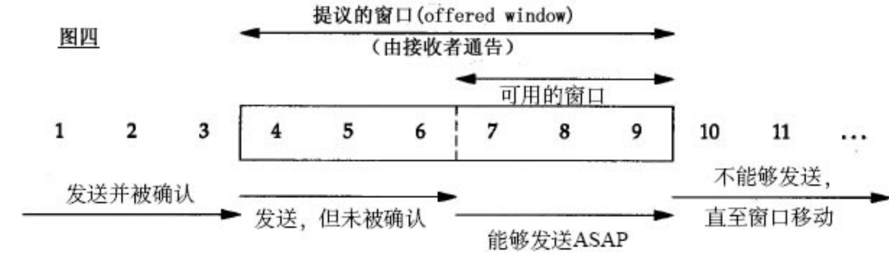
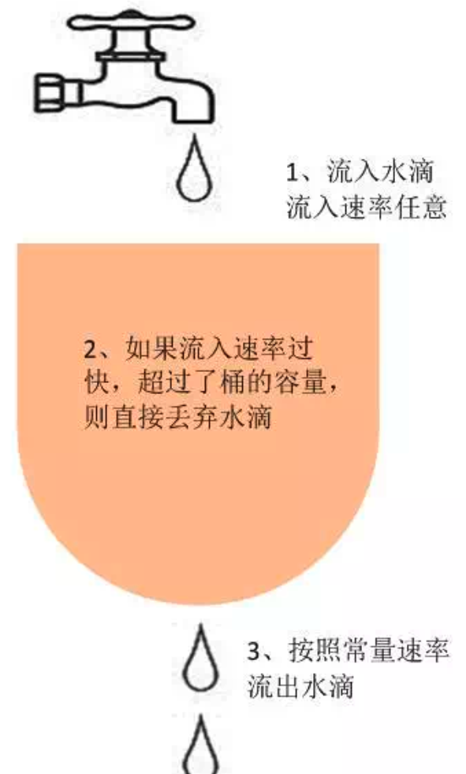
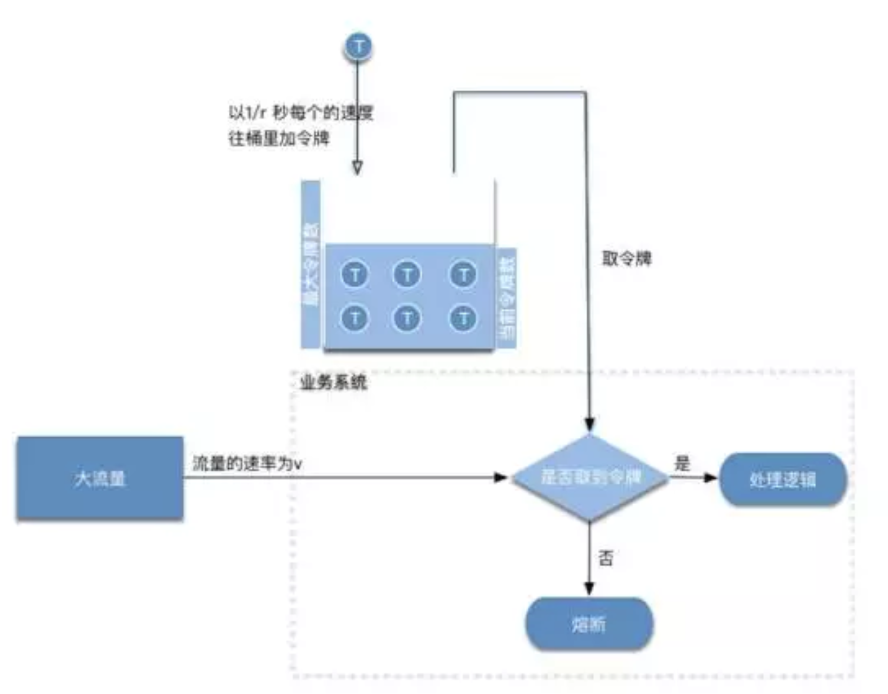

# 限流的基本认识

## 限流的原理

限流的基本原理是通过对并发访问、请求进行限速或者一个事件窗口内的请求进行限速来保护系统，一旦达到限制速率则可以拒绝服务（定向到错误页或者告知资源没有了）、排队或等待（秒杀、下单）、降级（返回兜底数据或默认数据，如果商品闲情也库存默认有货。）

一般常见的限流有：限制总并发数（如数据库连接池、线程池）、限制瞬时并发数（nginx的limit_conn模块，用来限制瞬时并发连接数）、限制时间窗口内的平均速率（如Guava的RateLimiter、nginx的limit_req模块，限制每秒平均速率）。其他的还有限制远程接口调用速率、限制MQ的消费速率。另外还可以根据网络连接数、网络流量、CPU或内存负载等来限流。

有了限流，就意味着处理高并发的时候多了一种保护机制，不用担心瞬间流量导致系统挂掉或雪崩，最终做到有损服务而不是不服务。但是限流需要评估好，不能乱用，否则一些正常流量出现一些奇怪的问题而导致用户体验很差造成用户流失。

## 常见的限流算法

### 滑动窗口

发送和接受方都会维护一个数据帧的序列，这个序列被称作窗口。发送方的窗口大小由接收方决定，目的在于控制发送速度，以免接受方的缓存不够大，而导致溢出，同时控制流量也可以避免网络拥塞。下面图中的`4，5，6`号数据帧已经发送出去，但是未收到关联的ACK，`7，8，9`帧则是等待发送。可以看出发送端的窗口大小为6，这是由接受端告知的。此时如果发送端收到4号ACK，则串口的左边缘向右收缩，窗口的右边缘则向右扩展，此时窗口就向前“滑动了”，即数据帧10也可以被发送。

[滑动窗口演示地址](https://media.pearsoncmg.com/aw/ecs_kurose_compnetwork_7/cw/content/interactiveanimations/selective-repeat-protocol/index.html)

### 漏桶（控制传输速率Leaky Bucket）

漏桶算法思路是，不断的网通里面注水，无论注水的速度是大还是小，水都是按固定的速率往外漏水。如果桶满了，水会溢出。

桶本身具有一个恒定的速率往下漏水，而上方时快时慢的会有水进入桶内。当桶还未满时，上方的水可以加入。一旦水满，上方的水就无法加入。桶满正式算法中的一个关键的触发条件（即流量异常判断成立的条件）。而此条件下如何处理上方留下来的水，有两种方式：

1. 暂时拦截住上方水向下流动，等待桶中的一部分水漏走后，在放行上方的水。
2. 溢出的上方水直接抛弃。

 **特点：**

1. 漏水的速率是固定的
2. 即使存在突然注水量变大的情况，漏水的速率也是固定的。

### 令牌桶（能够解决突发流量）

令牌桶算法是网路流量整形（Traffic Shaping）和速率限制（Rate Limiting）中最常使用的一种算法。典型情况下，令牌桶算法用来控制发送到网络上的数据的数目，并允许突发数据的发送。

令牌桶是一个存放固定容量令牌（token）的桶，按照固定速率往桶里添加令牌。令牌桶算法实际上由三分部分组成：两个流和一个桶，分别是令牌流、数据流和令牌桶。

#### 令牌流与令牌桶

系统会以一定的速度生成令牌，并将其放置到令牌桶中，可以将令牌桶想象成一个缓冲区（可以用队列这种数据结构来实现），当缓冲区填满的时候，新生成的令牌会被扔掉。这里有两个变量很重要：

第一个是生成令牌的速度，一般称为rate。比如，我们设定rata=2,即每秒钟生成2个令牌，也就是没0.5秒生成一个令牌。

第二个是令牌桶的大小，一般称为burst。比如，我们设定burst=10，即令牌桶最大只能容纳10个令牌。

有一下三种情形可能发生：

- **数据流的速率 等于 令牌流的速率**。这种情况下，每个到来的数据包或者请求都能对应一个令牌，然后无延迟的通过队列。
- **数据流的速率 小于 令牌流的速率。**通过队列的数据包或者请求只消耗了一部分令牌，剩下的令牌会在令牌桶里积累下来，知道桶被装满。剩下的令牌可以在突发请求的时候消耗掉。
- **数据流的速率 大于 令牌流的速率。**这意味着桶里的令牌很快就会被耗尽。导致服务中断一段时间，如果数据包或者请求持续到来，将发生丢包或者拒绝响应。