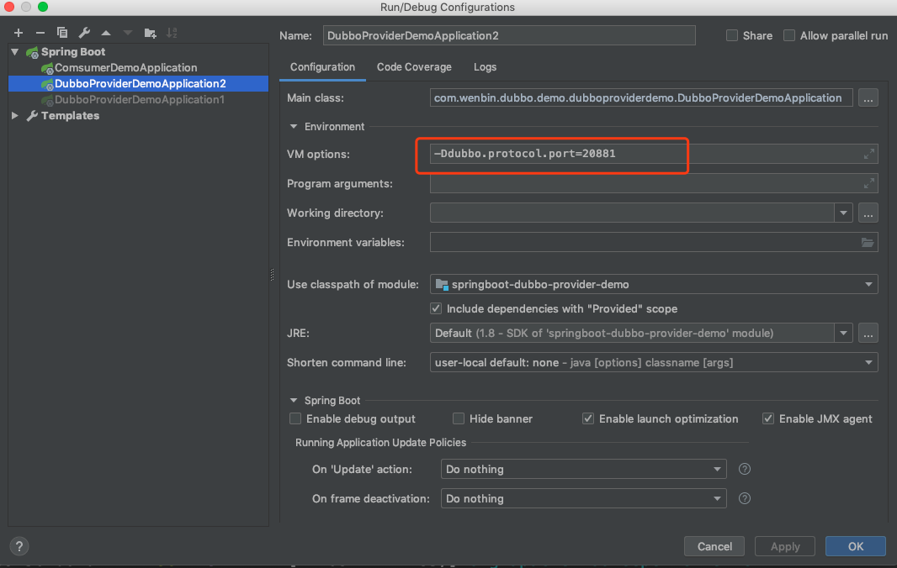
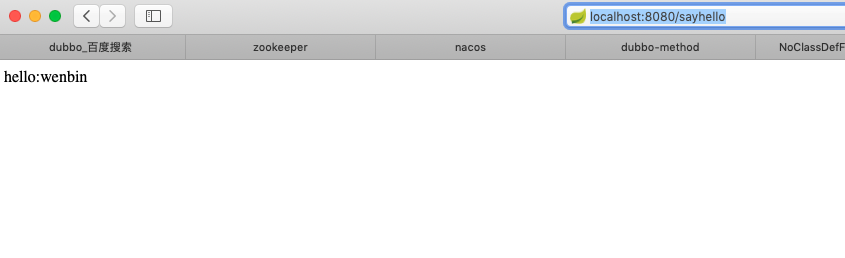
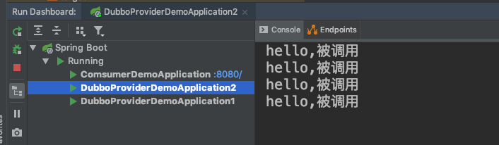
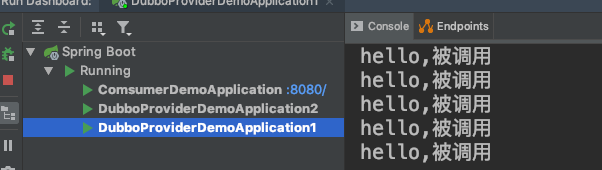
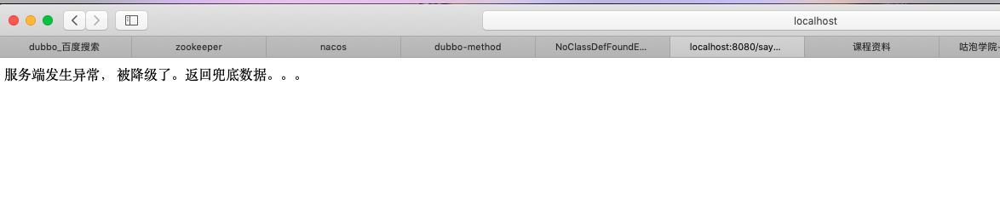
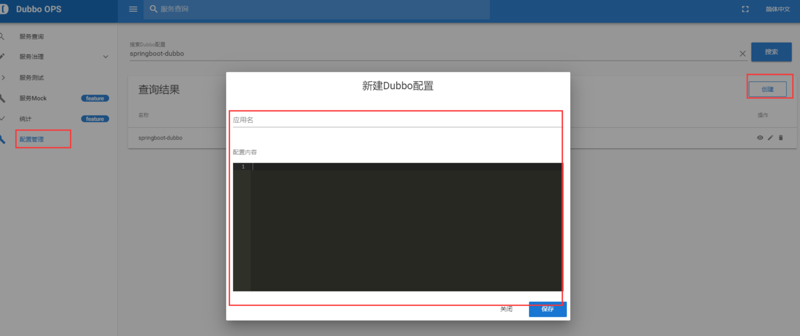
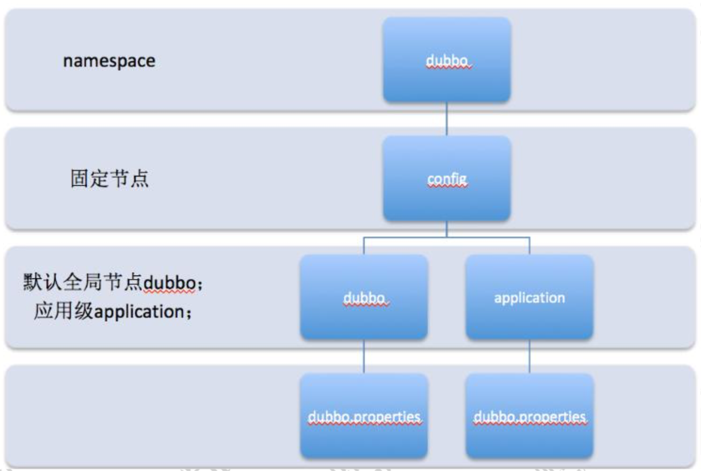

# Apache Dubbo的服务治理功能

## 环境介绍

zookeeper环境。在之前的文章中又介绍。[参考链接](https://github.com/wenbin8/doc/blob/master/分布式/分布式协调服务/zookeeper/01-zookeeper的安装部署.md)。

代码工程名：springboot-dubbo，github地址为：https://github.com/wenbin8/myCode/tree/master/springboot-dubbo

工程使用SpringBoot继承Dubbo。其中

- springboot-dubbo-provider-demo为服务提供方。
- springboot-dubbo-comsumer-demo为服务消费方。
- springboot-dubbo-api-demo为共享接口，通过maven引用。

## 负载均衡

### 负载均衡的背景

到目前为止，dubbo继承zookeeper解决了服务注册以及服务动态感知的问题。那么当服务端存在多个节点集群时，zookeeper上会维护不同集群节点，对于客户端而言，他需要一种负载均衡机制来实现目标服务的请求负载。通过负载均衡，可以让每个服务器节点获得适合自己处理能力的负载。

负载均衡可以分为软件负载和硬件负载，在实际开发中，我们基础软件负载比较多，比如nginx，硬件负载现在用的比较少而且需要有专门的人来维护。

Dubbo里面默认就集成了负载均衡的算法和实现，默认提供了4中负载均衡实现。

### Dubbo中负载均衡的应用

配置的属性名称：roundrobin/random/leastactive/consistenthash

```xml
<dubbo:service interface="..." loadbalance="roundrobin" /> 
<dubbo:reference interface="..." loadbalance="roundrobin" />
```

可以在服务端配置，也可以在客户端配置。 

如果是基于注解，配置如下：

```java
@Service(loadbalance = "roundrobin")
public class HelloServiceImpl implements IHelloService{
```

或者：

```java
@Reference(loadbalance = "random")
IHelloService helloService;	
```

### 演示

服务消费方代码如下：

```java
@RestController
public class DubboController {
    //Dubbo提供的注解
    @Reference(timeout = 5000, loadbalance = "random")
    SayHelloService sayHelloService; //dubbo://

    @GetMapping("/sayhello")
    public String sayHello(){
        //我调用这个服务可能失败，如果失败了，我要怎么处理
        return sayHelloService.hello("wenbin");
    }
}
```

这里```@Reference```注解中配置了```loadbalance = "random"```。


服务提供方代码如下：

```java
@Service(interfaceClass = SayHelloService.class)
public class SayHelloServiceImpl implements SayHelloService {
    @Override
    public String hello(String name) {
        System.out.println("hello,被调用");
        return "hello:" + name;
    }
}
```

在run configurations中，配置多个springboot application，添加jvm参数是的两个程序启动的端口不一样。然后客户端发起多次调用实现请求的负载均衡 -Ddubbo.protocol.port=20881 



启动完成后调用结果



多调用几次查看后台日志输出。



图中DubboProviderDemoApplication2被调用了4次。



图中DubboProviderDemoApplication2被调用了5次。

### Dubbo负载均衡算法

#### RandomLoadBalance 权重随机算法

权重随机算法，根据权重值进行随机负载。

它的算法思想很简单。假设我们有一组服务器 servers=[A,B,C]，它们对应的权重为weights=[5,3,2]，权重总和为10。现在把这些权重值平铺在一位坐标值上，[0,5)区间属于服务器A，[5,8)区间舒服服务器B，[8,10）区间属于服务器C。接下来通过随机数生成器生成一个范围在[0,10)之间的随机数，然后计算这个随机数会落到那个区间上。比如数字3会落到服务器A对应的区间上，此时返回服务器A即可。权重越大的机器，在坐标轴上对应的区间范围就越大，因此随机数生成器生成的数据就会有更大的概率躲到此区间内。只要随机数生成器产生的随机数分布性很好，在经过多次选择后，每个服务器被选中的次数比例接近其权重比例。

#### LeastActiveLoadBalance 最少活跃调用数算法

最少活跃调用数算法，活跃调用数越小，表明服务提供者效率越高，单位时间内可处理更多的请求这个是比较科学的负载均衡算法。

每个服务提供者对应一个活跃数active。初始情况下，所有服务提供者活跃数均为0.没收到一个请求，活跃数加1，完成请求或则将活跃数减1.在服务运行一段时间后，性能好的服务提供者处理请求的速度更快，因此活跃数下降也越快，此时这样的服务提供者能够优先获取到新的服务请求。

#### ConsistentHashLoadBalance hash一致性算法

hash一致性算法，相同参数的请求总是发到统一提供者。

当某一台提供者挂时，原本发往该提供者的请求，基于虚拟节点，平摊到其他提供者，不会引起剧烈变动。

一致性hash算法原理参考博客： https://www.jianshu.com/p/e968c081f563

#### RoundRobinLoadBalance 加权轮询算法

加权轮询算法

所谓轮询是指将请求轮流分配给每台服务器。举个例子，我们有三台服务器A、B、C。我们将第一个请求分配给A，第二个请求分配个服务器B，第三个请求分配给服务器C,第四个请求再次分配给服务器A。这个过程就叫做轮询。轮询是一种无状态负载均衡算法，实现简单，适用于每台服务器性能相近的场景下。但现实情况下，我们并不能保证每台服务器性能均相近。如果我们将等量的请求分配给性能较差的服务器，这显然是不合理的。因此，这个时候我们需要对轮询过程进行加权，以调控每台服务器的负载。经过加权后，每天服务器能够得到的请求数比例，接近或等于他们的权重比。比如服务器A、B、C权重比为5：2：1.那么在8次请求中，服务器A将受到5次请求，服务器B会受到其中的2次请求，服务器C则收到其中的次请求。

## 集群容错

在分布式系统网络通信中，容错能力是必须要具备的，网络通信中会有很多不确定因素，比如：网络延迟、网络中断、服务异常等，会造成当前这次请求出现失败。当服务通信出现这个问题时，需要采取一定的措施应对。而dubbo中提供了容错机制来优雅处理这种错误。

在集群调用失败时，Dubbo提供了多种容错方案，缺省为failvoer重试。

```java
@Service(loadbalance = "random", cluster = "failsafe")
```

### Failover Cluster 失败自动切换

失败自动切换，当出现失败，重试其他服务器。（缺省）

通常用于读操作，但重试会带来更长的延迟。

可通过retries="2"来设置重试次数（不含第一次）。

### Failfast Cluster 快速失败

快速失败，值发起一次调用，失败立即报错。

通常用于非幂等性的写操作，比如新增记录。

### Failsafe Cluster 失败安全

失败安全，出现异常时，直接忽略。

通常用于写入审计日志等操作。

### Failback Cluster 失败自动回复

失败自动回复，后台记录失败请求，定时重发。

通常用于消息通知操作。

### Forking Cluster 并行调用多个服务器

并行调用多个服务器，只要一个返回成功即返回。

通常用于实时性要求较高的读操作，但需要浪费更多的服务资源。

可通过forks="2"来设置最大并行数。

### Broadcast Cluster 广播调用所有提供者

广播调用所有提供者，逐个调用，任意一台报错则报错。（2.1.0开始支持）

通常用于通知所有提供者更新缓存或日志等本地资源信息。


在实际应用中查询语句容错策略建议使用默认Failover Cluster，而增删改建议使用Failfast Cluster或者使用Failover Cluster(retries="0")策略，防止出现数据重复添加等等其他问题！建议在设计接口的时候把查询接口方法单独做一个接口提供查询。

## 服务降级

### 降级的概念

当某个非关键服务出现错误时，可以通过降级功能来临时屏蔽这个服务。降级可以有几个层面的分类：自动降级和人工降级。按照功能可以分为：读服务降级和写服务降级。

1. 对一些非核心服务进行人工降级，在大促之前通过降级开关关闭那些推荐内容、评价等对主流程没有影响的功能。
2. 故障降级，比如调用远程服务挂了，网络故障、或者RPC服务返回异常。那么可以直接降级，降级的方案比如设置默认值、采用兜底数据（系统推荐的行为广告挂了，可以提前准备静态页面做返回）等等。
3. 限流降级，在秒杀这种力量比较集中并且流量特别大的情况下，因为突发访问量特别大可能会导致系统支撑不了。这个时候可以采用限流来限制访问量。当达到阈值时，后续的请求被降级，比如进入排队页面，比如跳转错误页。

Dubbo中是如何实现服务降级呢？Dubbo中提供了一个mock的配置，可以通过mock来实现当服务提供方出现网络异常或者挂掉以后，客户端不抛出异常，而是通过mock数据返回自定义数据。

### Dubbo实现服务降级

在实例程序中```springboot-dubbo-comsumer-demo```项目中创建了```SayHelloServiceMock```类。

```java
package com.wenbin.dubbo.demo.comsumerdemo;

import com.wenbin.demo.dubbo.api.SayHelloService;

/**
 * 降级处理的类
 */
public class SayHelloServiceMock implements SayHelloService {

    @Override
    public String hello(String name) {
        return "服务端发生异常， 被降级了。返回兜底数据。。。";
    }
}
```

修改客户端注解，增加mock配置，以及修改timeout=1，表示本次调用的超时时间是1毫秒，这样可以模拟出失败的场景。

还需要配置cluster="failfast"，否则因为是默认是failover导致客户端会发起3次重试，等待的时间比较常。

```java
//Dubbo提供的注解
@Reference(timeout = 1, loadbalance = "random", cluster = "failfast"
            , mock = "com.wenbin.dubbo.demo.comsumerdemo.SayHelloServiceMock", check = false)
SayHelloService sayHelloService;
```

降级效果：



### 启动检查

Dubbo缺省会在启动时检查依赖的服务是否可用，不可用时会抛出异常，阻止Spring初始化完成，以便上线时能及早发现问题，默认check="true"。

可以通过check="false"关闭检查，比如，测试时，有些服务不关心，或者出现了循环依赖，必须有一方先启动。

registry、reference、consumer 都可以配置 check 这个属性. 

### 多版本支持

当一个接口实现，出现不兼容升级时，可以用版本号过渡，版本号不同的服务相互将不引用。

可以按照以下步骤进行版本迁移：

1. 在低压力时间段，先升级一半提供者为新版本。
2. 再将所有消费者升级为新版本。
3. 然后将剩下的一半提供者升级为新版本。

### 主机绑定

#### 默认的主机绑定方式

1. 通过LocalHost.getLocalHost()获取本机地址。
2. 如果是127.*等loopback（环路地址）地址，则扫描各网卡，获取网卡IP。
   1. 如果是SpringBoot，修改配置：dubbo.protocol.host=""
   2. 如果注册地址获取不正确，可以通过dubbo.xml中加入主机地址的配置```<dubbo:protocal host=""/>```

#### 缺省主机端口

dubbo:20880

rmi:1099

http:80

Hessian:80

Webservice:80

Memcached:11211

Redis:6379


## Dubbo新的功能

### 动态配置规则

动态配置是dubbo2.7版本引入的一个新的功能，简单来说，就是把dubbo.properites中的属性进行集中式存储，存储在其他服务器上。

如果需要用到集中式存储，还需要一些配置中心的组件来支撑。

目前Dubbo能支持的配置中心有：apollo\nacos\zookeeper。

其实从另外一个角度来看，我们之前用zookeeper实现服务注册和发现、本质上就是使用zookeeper实现了配置中心，这个配置中心只是维护了服务注册和服务感知的功能。在2.7版本中，dubbo对配置中心做了延展，除了服务注册和服务感知之外，还可以把其他的数据存储在zookeeper上，从而更好的进行维护。

### 在dubbo admin添加配置

应用名称可以使global，或者对应当前服务的应用名。如果是global表示全局配置，针对所有应用可见。

配置的内容，实际就是dubbo.properties中配置的基本信息。只是统一存储在了zookeeper上。



### 本地的配置文件添加配置中心

在application.properties中添加配置中心的配置项，app-name对应的是上一步创建的配置项中的应用名。

```properties
dubbo.config-center.address=zookeeper://192.168.13.106:2181 
dubbo.config-center.app-name=spring-boot-provider
```

需要注意的是，存在于配置中心上的配置项，本地仍然需要配置一份。所以下面这些配置一定要加上。否则启动不了。这样做的目的是保证可靠性

```properties
dubbo.application.name=springboot-dubbo
dubbo.protocol.name=dubbo
dubbo.protocol.port=20880
dubbo.registry.address=zookeeper://192.168.1.4:2181?backup=192.168.1.4:2182,192.168.1.4:2183
```

### 配置的优先级

引入配置中心后，配置的优先级就需要关注了，默认情况下，外部配置的优先级最高，也就是意味着配置中心上的配置会覆盖本地的配置。当然我们也可以调整优先级。

```properties
dubbo.config-center.highest-priority=false
```

### 配置中心的原理

默认所有的配置都存储在/dubbo/config节点，具体节点结构图如下。



- Namespace:用于不同配置的环境隔离
- config:Duboo约定的固定节点，不可更改，所有配置和服务治理规则都存储在此节点下。
- Dubbo/application：分别用来隔离全局配置、应用级别配置。dubbo是默认group值，application对应应该用名。
- dubbo.properties，此节点的node value存储具体配置内容

## 元数据中心

Dubbo2.7的另外一个新的功能，就是增加了元数据配置。

在Dubbo2.7之前，多有的配置信息，比如服务接口名称、重试次数、版本号、负载策略、容错策略等等，所有参数都是基于url形式配置在zookeeper上的。这种方式会造成一些问题：

1. url内容过多，导致数据存储空间增大。

2. rul需要涉及到网络传输，数据量过大会造成网络传输过慢。

3. 网路传输慢，会造成服务地址感知延迟变大，影响服务的正常响应。

   服务提供者这边的配置参数有30多个，有一般是不需要作为注册中心进行存储和传输的。而消费者这边可配置的参数有25个以上，只有个别是需要传递到注册中心的。所以，在Dubbo2.7中对元数据进行了改造，简单来说，就是把属于服务治理的数据发布到注册中心，其他的配置数据统一发布到元数据中心。这样大大降低了注册中心的负载。

### 元数据中心配置

   元数据中心目前支持redis和zookeeper。官方推荐是采用redis。毕竟redis本省对于非结构化存储的数据读写性能比较高。当然，也可以使用zookeeper来实现。

   在配置文件中添加元数据中心的地址：

   ```properties
   dubbo.metadata-report.address=zookeeper://192.168.1.4:2181?backup=192.168.1.4:2182,192.168.1.4:2183
   dubbo.registry.simplified=true //注册到注册中心的URL是否采用精简模式的 (与低版本兼容)
   ```


