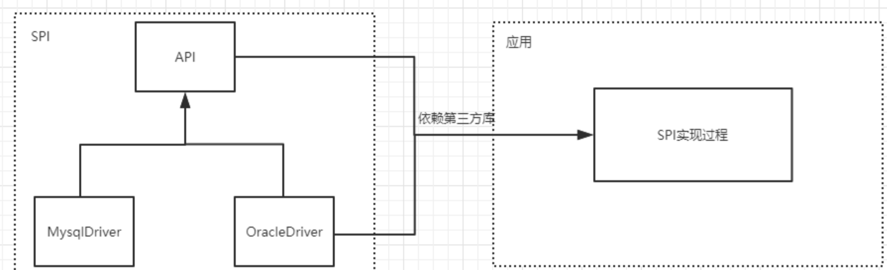
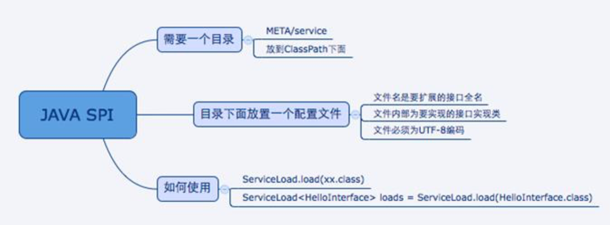
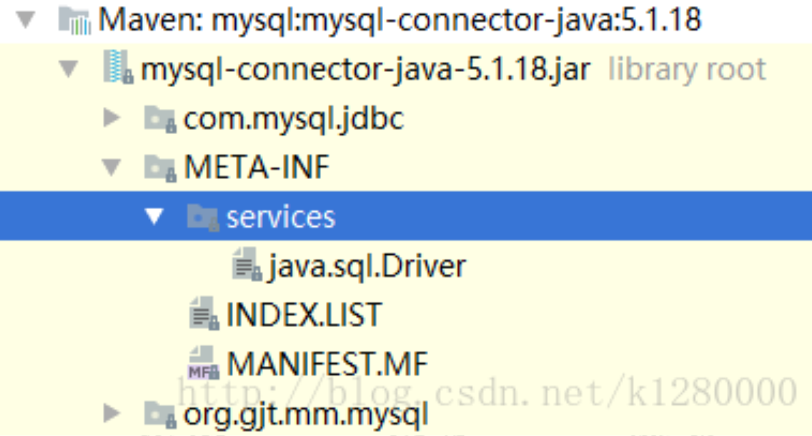
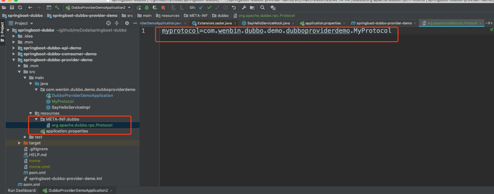
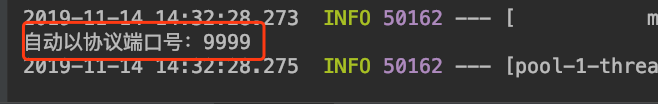
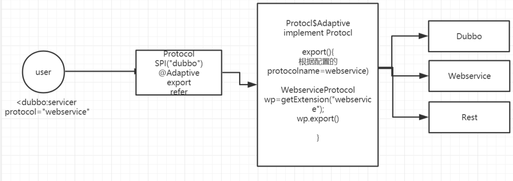
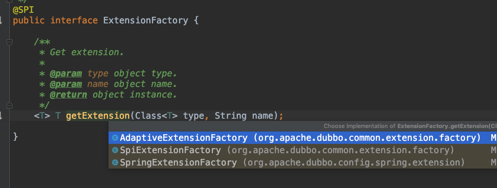

# Apache Dubbo内核剖析

源码是基于Dubbo2.7.2版本进行的分析。

## Dubbo中的SPI机制

在Dubbo中，SPI是贯穿整个Dubbo的核心。所以如果想读懂Dubbo源码SPI机制必须理解。

SPI机制在很多地方都有用到，比如：SpringBoot的自动装配机制也是基于SPI来实现的。

### Java SPI

在了解Dubbo里面的SPI机制之前，我们先来了解一下Java提供的SPI（service provider interface）机制。SPI是JDK内置的一种服务提供发现机制。目前市面上有很多框架都是用它来做服务的扩展发现。简单来说，它是一种动态替换发现的机制。举个简单的例子，我们想在运行时动态给它添加实现，你只需要添加一个实现，然后把心的实现描述给JDK知道就行了。例如：JDBC、日志框架都有用到。



#### 实现SPI需要遵循的标准

我们如何去实现一个标准的SPI发现机制呢？

只需要满足以下几点就可以了：

1. 需要在classpath下创建一个目录，该目录命名必须是：META-INF/service。
2. 在该目录下创建一个properties文件，该文件需要满足以下几个条件：
   1. 文件名必须是扩展的接口的全路径名称。
   2. 文件内部描述的是该扩展接口的所有实现类。
   3. 文件的编码格式是UTF-8
3. 通过java.util.ServiceLoader的加载机制来发现



#### SPI的实际应用

SPI在很多地方有应用，可能大家都没有关注，最常用的就是JDBC驱动。

JDK本身提供了数据访问的api。在java.sql这个包里面。

我们在谅解数据库的时候，一定需要用到java.sql.Driver这个接口对吧。然后我们去看下java.sql.Driver这个接口没有实现，而是提供了一套标准的api接口。

因为我们在实际应用中用的比较多的是mysql，所以到mysql包里面可以看到一个如下图的目录结构：



这个文件里面写的就是mysql的驱动实现。通过SPI机制把Java.sql.Driver和mysql的驱动做了集成。这样就达到了各个数据库厂商自己去实现数据库连接，jdk本身不关心你怎么实现。

#### SPI的缺点

1. JDK标准的SPI会一次性加载实例化扩展点的所有实现，如果你在META-INF/service下的文件里面加了N个实现类，那么JDK启动的时候都会一次性全部加载。那么如果有的扩展点实现初始化很耗时或者如果有些实现类并没有用到，那么会很浪费资源。
2. 如果扩展点加载失败，会导致调用方报错，而且这个错误很难定位到原因。


### Dubbo优化后的的SPI机制

#### 基于Dubbo SPI实现自己的扩展

Dubbo 的SPI扩展机制，有两个规则：

1. 需要在resource目录下配置META-INF/dubbo或者META-INF/internal或者META-INF/service，并基于SPI接口去创建一个文件。
2. 文件名称和接口名称保持一致，文件内容和SPI有差异，内容是KEY对应value。

Dubbo针对的扩展点非常多，可以针对协议、拦截、集群、路由、负载均衡、序列化、容器...几乎里面用到的所有功能，都可以实现自己的扩展，这个也是Dubbo比较强大的一点。

#### 扩展协议扩展点

1. 在我们之前springboot-dubbo项目中的springboot-dubbo-provider-demo的resources目录下新建```META-INF.dubbo```文件

2. 创建MyProtocal协议类，模拟实现，只修改了一个端口。

   ```java
   public class MyProtocol implements Protocol {
       @Override
       public int getDefaultPort() {
           return 9999;
       }
   
       @Override
       public <T> Exporter<T> export(Invoker<T> invoker) throws RpcException {
           return null;
       }
   
       @Override
       public <T> Invoker<T> refer(Class<T> type, URL url) throws RpcException {
           return null;
       }
   
       @Override
       public void destroy() {
   
       }
   }
   ```


3. 在调用处执行如下代码：

   ```java
   public static void main(String[] args) {
       SpringApplication.run(DubboProviderDemoApplication.class, args);
   
       Protocol protocol= ExtensionLoader.getExtensionLoader(Protocol.class)
               .getExtension("myprotocol");
       System.out.println("自动以协议端口号：" + protocol.getDefaultPort());
   }
   ```

4. 输出结果，可以看到运行结果，是执行自定义的协议扩展点。

总结：Dubbo的SPI机制总的来说，思路和JDK的SPI是差不多的。都是基于约定的路径下指定配置文件。目的，通过配置的方式轻松实现功能的扩展。

如果实现Dubbo的SPI机制，一定有一个地方通过读取指定路径下的所有文件进行load。然后将对应的结果保存到一个map中，key对应为名称，value对应为实现类。那么这个实现一定就在ExtensionLoader中了。接下来我们就可以基于这个猜想去看看代码的实现。

#### Dubbo的扩展点原理实现

在看它的实现代码之前，先思考一个问题，所谓的扩展点，就是通过制定目录配置一个对应接口的实现类，然后程序会进行查找和解析，找到对应的扩展点。那么这里就涉及到两个问题：

1. 怎么解析。
2. 被加载的类如何存储和使用？

##### **ExtensionLoader.getExtensionLoader.getExtension** 

我们从这段代码着首，去看看到底做了什么事情，能够通过这样一段代码实现扩展协议的查找和加载。

```java
public static <T> ExtensionLoader<T> getExtensionLoader(Class<T> type) {
    if (type == null) {
        throw new IllegalArgumentException("Extension type == null");
    }
    if (!type.isInterface()) {
        throw new IllegalArgumentException("Extension type (" + type + ") is not an interface!");
    }
    if (!withExtensionAnnotation(type)) {
        throw new IllegalArgumentException("Extension type (" + type +
                ") is not an extension, because it is NOT annotated with @" + SPI.class.getSimpleName() + "!");
    }

    ExtensionLoader<T> loader = (ExtensionLoader<T>) EXTENSION_LOADERS.get(type);
    if (loader == null) {
        EXTENSION_LOADERS.putIfAbsent(type, new ExtensionLoader<T>(type));
        loader = (ExtensionLoader<T>) EXTENSION_LOADERS.get(type);
    }
    return loader;
}
```

##### 实例化ExtensionLoader

如果当前的```type=ExtensionFactory.type```,那么```objectFactory=null```，否则会创建一个自适应扩展点给到```objectFacotry```，目前来说具体做什么暂时先不关心。

```java
private ExtensionLoader(Class<?> type) {
    this.type = type;
    objectFactory = (type == ExtensionFactory.class ? null : ExtensionLoader.getExtensionLoader(ExtensionFactory.class).getAdaptiveExtension());
}
```

**objectFactory**在这里赋值了，并且是返回一个**AdaptiveExtension().** 这个暂时不展开，后面再分析 

##### getExtension

这个方法就是根据一个名字来获得一个对应类的实例，所以我们来猜想一下，回想一下前面咱们配置的自定义协议，name实际上就是myprotocol，而返回的实现类应该就是MyProtocol。 

```java
public T getExtension(String name) {
    if (StringUtils.isEmpty(name)) {
        throw new IllegalArgumentException("Extension name == null");
    }
    // 如果name=true，表示返回一个默认的扩展点。
    if ("true".equals(name)) {
        return getDefaultExtension();
    }
    // 缓存一下，如果实例已经加载过了，直接从缓存读取。
    Holder<Object> holder = getOrCreateHolder(name);
    Object instance = holder.get();
    if (instance == null) {
        synchronized (holder) {
            instance = holder.get();
            if (instance == null) {
                // 根据名称创建实例
                instance = createExtension(name);
                holder.set(instance);
            }
        }
    }
    return (T) instance;
}
```

##### createExtension

仍然是根据名称创建扩展:getExtensionClasses() 加载指定路径下的所有文件 

```java
private T createExtension(String name) {
    Class<?> clazz = getExtensionClasses().get(name);
    // 如果没有找到，则抛出异常
    if (clazz == null) {
        throw findException(name);
    }
    try {
        // 这里用一个chm来保存实例，做缓存。
        T instance = (T) EXTENSION_INSTANCES.get(clazz);
        if (instance == null) {
            EXTENSION_INSTANCES.putIfAbsent(clazz, clazz.newInstance());
            instance = (T) EXTENSION_INSTANCES.get(clazz);
        }
        // 实例注入，可以猜到，这里应该是对这个实例中的成员属性来实现依赖注入的功能。
        injectExtension(instance);
        Set<Class<?>> wrapperClasses = cachedWrapperClasses;
        if (CollectionUtils.isNotEmpty(wrapperClasses)) {
            for (Class<?> wrapperClass : wrapperClasses) {
                instance = injectExtension((T) wrapperClass.getConstructor(type).newInstance(instance));
            }
        }
        return instance;
    } catch (Throwable t) {
        throw new IllegalStateException("Extension instance (name: " + name + ", class: " +
                type + ") couldn't be instantiated: " + t.getMessage(), t);
    }
}
```

##### getExtensionClasses

```java
private Map<String, Class<?>> getExtensionClasses() {
    Map<String, Class<?>> classes = cachedClasses.get();
    if (classes == null) {
        synchronized (cachedClasses) {
            classes = cachedClasses.get();
            if (classes == null) {
                // 这里的代码就是加载的过程
                classes = loadExtensionClasses();
                cachedClasses.set(classes);
            }
        }
    }
    return classes;
}
```

##### loadExtensionClasses

这个方法，会查找指定目录```/META-INF/dubbo || /META-INF/services``` 下对应的 type->也就是本次演示案例的Protocol的properties文件，然后扫描这个文件下的所有配置信息。然后保存到一个HashMap中(classes)，key=name(对应protocol文件中配置的myprotocol), value=对应配置的类的实例。

```java
private Map<String, Class<?>> loadExtensionClasses() {
    cacheDefaultExtensionName();

    Map<String, Class<?>> extensionClasses = new HashMap<>();
    loadDirectory(extensionClasses, DUBBO_INTERNAL_DIRECTORY, type.getName());
    loadDirectory(extensionClasses, DUBBO_INTERNAL_DIRECTORY, type.getName().replace("org.apache", "com.alibaba"));
    loadDirectory(extensionClasses, DUBBO_DIRECTORY, type.getName());
    loadDirectory(extensionClasses, DUBBO_DIRECTORY, type.getName().replace("org.apache", "com.alibaba"));
    loadDirectory(extensionClasses, SERVICES_DIRECTORY, type.getName());
    loadDirectory(extensionClasses, SERVICES_DIRECTORY, type.getName().replace("org.apache", "com.alibaba"));
    return extensionClasses;
}
```

##### injectExtension

这个方法是用来实现依赖注入的，如果被加载的实例中，有成员属性本身也是一个扩展点，则会通过set方法进行注入。 

```java
private T injectExtension(T instance) {
    try {
        // objectFacotry在这里用到了。
        if (objectFactory != null) {
            //获得实例对应的方法，判断方法是否是一个set方法
            for (Method method : instance.getClass().getMethods()) {
                if (isSetter(method)) {
                    /**
                     * Check {@link DisableInject} to see if we need auto injection for this property
                     */
                    //可以选择禁用依赖注入
                    if (method.getAnnotation(DisableInject.class) != null) {
                        continue;
                    }
                    //获得方法的参数，这个参数必须是一个对象类型并且是一个扩展点
                    Class<?> pt = method.getParameterTypes()[0];
                    if (ReflectUtils.isPrimitives(pt)) {
                        continue;
                    }
                    try {
                        //获得set方法中的属性名字，根据属性名字进行加载
                        String property = getSetterProperty(method);
                        Object object = objectFactory.getExtension(pt, property);
                        if (object != null) {
                            //调用set方法进行赋值
                            method.invoke(instance, object);
                        }
                    } catch (Exception e) {
                        logger.error("Failed to inject via method " + method.getName()
                                + " of interface " + type.getName() + ": " + e.getMessage(), e);
                    }
                }
            }
        }
    } catch (Exception e) {
        logger.error(e.getMessage(), e);
    }
    return instance;
}
```

分析到这里我们发现，所谓的扩展点，套路都一样，不管是SpringFactorieyLoader，还是Dubbo的spi。实际上，Dubbo的功能会更加强大，比如自适应扩展点，比如依赖注入。

#### Adaptive自适应扩展点

什么叫做自适应扩展点呢？我们先演示一个例子，在下面这个例子中，我们传入一个Compiler接口，他会返回一个AdaptiveCompiler。

```java
Compiler compiler=ExtensionLoader.getExtensionLoader(Compiler.class).getAdaptiveExtension(); System.out.println(compiler.getClass());	
```

它是怎么实现的呢? 我们根据返回的AdaptiveCompiler这个类，看到这个类上面有一个注解@Adaptive。 这个就是一个自适应扩展点的标识。它可以修饰在类上，也可以修饰在方法上面。这两者有什么区别呢? 简单来说，放在类上，说明当前类是一个确定的自适应扩展点的类。如果是放在方法级别，那么需要生成一个动态字节码，来 进行转发。

比如拿Protocol这个接口来说，它里面定义了export和refer两个抽象方法，这两个方法分别带有@Adaptive 的标识，标识是一个自适应方法。

我们知道Protocol是一个通信协议的接口，具体有多种实现，那么这个时候选择哪一种呢? 取决于我们在使用 dubbo的时候所配置的协议名称。而这里的方法层面的Adaptive就决定了当前这个方法会采用何种协议来发布服务。 

```java
public T getAdaptiveExtension() {
    // cacheAdaptiveInstance，是一个缓存，在dubbo中大量用到这种内存缓存
    Object instance = cachedAdaptiveInstance.get();
    if (instance == null) {
        if (createAdaptiveInstanceError == null) {
            synchronized (cachedAdaptiveInstance) {
                instance = cachedAdaptiveInstance.get();
                if (instance == null) {
                    try {
                        // 很明显，这里是创建一个自适应扩展点的实现
                        instance = createAdaptiveExtension();
                        cachedAdaptiveInstance.set(instance);
                    } catch (Throwable t) {
                        createAdaptiveInstanceError = t;
                        throw new IllegalStateException("Failed to create adaptive instance: " + t.toString(), t);
                    }
                }
            }
        } else {
            throw new IllegalStateException("Failed to create adaptive instance: " + createAdaptiveInstanceError.toString(), createAdaptiveInstanceError);
        }
    }

    return (T) instance;
}
```

##### createAdaptiveExtension

这个方法中做两个事情：

1. 获得一个自适应扩展点实例
2. 实现依赖注入

```java
private T createAdaptiveExtension() {
    try {
        return injectExtension((T) getAdaptiveExtensionClass().newInstance());
    } catch (Exception e) {
        throw new IllegalStateException("Can't create adaptive extension " + type + ", cause: " + e.getMessage(), e);
    }
}
```

##### getAdaptiveExtensionClass

```java
private Class<?> getAdaptiveExtensionClass() {
    getExtensionClasses();
    if (cachedAdaptiveClass != null) {
        return cachedAdaptiveClass;
    }
    return cachedAdaptiveClass = createAdaptiveExtensionClass();
}
```

getExtensionClasses()这个方法在前面分析过了，会加载当前传入的类型的所有扩展点，保存在一个hashMap中这里有一个判断逻辑，如果```cachedAdaptiveClass != null```，直接返回这个```cachedAdaptiveClass```，这里大家可以猜一下，这个```cachedAdaptiveClass```是个什么东西？

cachedAdaptiveClass，还记得前面讲过Adaptive可以方在两个位置，一个是类级别，一个是方法级别。那么这个cachedAdaptiveClass很显然，就是放在类级别的Adaptive，表示告诉dubbo spi loader，“我是一个自适应扩展点，你来加载我吧”。

cachedAdaptiveClass是在加载解析/META-INF/dubbo下的扩展点的时候加载进来的。在加载完之后如果这个类有@Adaptive标识，则会赋值赋值而给cachedAdaptiveClass。

如果cachedAdaptiveClass不存在，dubbo会动态生成一个代理类Protocol$Adaptive. 前面的名字protocol 是根据当前ExtensionLoader所加载的扩展点来定义的。

##### createAdaptiveExtensionClass

动态生成字节码，然后进行动态加载。那么这个时候所返回的class,如果加载的是Protocol.class，应该是 Protocol$Adaptive 这个cachedDefaultName实际上就是扩展点接口的@SPI注解对应的名字，如果此时加载的是 Protocol.class，那么cachedDefaultName=dubbo。

```java
private Class<?> createAdaptiveExtensionClass() {
    String code = new AdaptiveClassCodeGenerator(type, cachedDefaultName).generate();
    ClassLoader classLoader = findClassLoader();
    org.apache.dubbo.common.compiler.Compiler compiler = ExtensionLoader.getExtensionLoader(org.apache.dubbo.common.compiler.Compiler.class).getAdaptiveExtension();
    return compiler.compile(code, classLoader);
}
```

##### **Protocol$Adaptive** 

动态生成的代理类，以下是我通过debug拿到的代理类。前面传入进来的cachedDefaultName，在这个动态生成的类中，会体现在下面标红的部分，也就是它的默认实现是DubboProtocol 

```java
package com.gupaoedu.dubbo.practice.practiceprovider;


import org.apache.dubbo.common.extension.ExtensionLoader;

public class Protocol$Adaptive implements org.apache.dubbo.rpc.Protocol {
    public void destroy() {
        throw new UnsupportedOperationException("The method public abstract void org.apache.dubbo.rpc.Protocol.destroy() of interface org.apache.dubbo.rpc.Protocol is not adaptive method!");
    }

    public int getDefaultPort() {
        throw new UnsupportedOperationException("The method public abstract int org.apache.dubbo.rpc.Protocol.getDefaultPort() of interface org.apache.dubbo.rpc.Protocol is not adaptive method!");
    }

    public org.apache.dubbo.rpc.Exporter export(org.apache.dubbo.rpc.Invoker arg0) throws org.apache.dubbo.rpc.RpcException {
        if (arg0 == null) throw new IllegalArgumentException("org.apache.dubbo.rpc.Invoker argument == null");
        if (arg0.getUrl() == null)
            throw new IllegalArgumentException("org.apache.dubbo.rpc.Invoker argument getUrl() == null");
        org.apache.dubbo.common.URL url = arg0.getUrl();

        //extName=webservice
        String extName = (url.getProtocol() == null ? "dubbo" : url.getProtocol());
        if (extName == null)
            throw new IllegalStateException("Failed to get extension (org.apache.dubbo.rpc.Protocol) name from url (" + url.toString() + ") use keys([protocol])");
        org.apache.dubbo.rpc.Protocol extension = (org.apache.dubbo.rpc.Protocol) ExtensionLoader.getExtensionLoader(org.apache.dubbo.rpc.Protocol.class).getExtension(extName);

        return extension.export(arg0);
    }

    public org.apache.dubbo.rpc.Invoker refer(java.lang.Class arg0, org.apache.dubbo.common.URL arg1) throws org.apache.dubbo.rpc.RpcException {
        if (arg1 == null) throw new IllegalArgumentException("url == null");
        org.apache.dubbo.common.URL url = arg1;
        String extName = (url.getProtocol() == null ? "dubbo" : url.getProtocol());
        if (extName == null)
            throw new IllegalStateException("Failed to get extension (org.apache.dubbo.rpc.Protocol) name from url (" + url.toString() + ") use keys([protocol])");
        org.apache.dubbo.rpc.Protocol extension = (org.apache.dubbo.rpc.Protocol) ExtensionLoader.getExtensionLoader(org.apache.dubbo.rpc.Protocol.class).getExtension(extName);
        return extension.refer(arg0, arg1);
    }
}
```

##### 图形理解 

简单来说，上面的基于方法层面的@Adaptive，基本实现原理的图形大概是这样。



##### **injectExtension** 

对于扩展点进行依赖注入，简单来说就是如果当前加载的扩展点中存在一个成员属性(对象)，并且提供了set 方法，那么这个方法就会执行依赖注入 

```java
private T injectExtension(T instance) {
    try {
        // objectFacotry在这里用到了。
        if (objectFactory != null) {
            //获得实例对应的方法，判断方法是否是一个set方法
            for (Method method : instance.getClass().getMethods()) {
                if (isSetter(method)) {
                    /**
                     * Check {@link DisableInject} to see if we need auto injection for this property
                     */
                    //可以选择禁用依赖注入
                    if (method.getAnnotation(DisableInject.class) != null) {
                        continue;
                    }
                    //获得方法的参数，这个参数必须是一个对象类型并且是一个扩展点
                    Class<?> pt = method.getParameterTypes()[0];
                    //如果不是对象类型，则跳过
                    if (ReflectUtils.isPrimitives(pt)) {
                        continue;
                    }
                    try {
                        //获得set方法中的属性名字，根据属性名字进行加载
                        String property = getSetterProperty(method);
                        //根据class以及name，使用自适应扩展点进行加载并且赋值到当前的set方法中
                        Object object = objectFactory.getExtension(pt, property);
                        if (object != null) {
                            //调用set方法进行赋值
                            method.invoke(instance, object);
                        }
                    } catch (Exception e) {
                        logger.error("Failed to inject via method " + method.getName()
                                + " of interface " + type.getName() + ": " + e.getMessage(), e);
                    }
                }
            }
        }
    } catch (Exception e) {
        logger.error(e.getMessage(), e);
    }
    return instance;
}
```

##### 关于objectFactory

在injectExtension这个方法中，我们发现入口出的代码首先判断了objectFactory这个对象是否为空。这个是在哪里初始化的呢? 实际上我们在获得ExtensionLoader的时候，就对objectFactory进行了初始化。 

```java
private ExtensionLoader(Class<?> type) {
    this.type = type;
    objectFactory = (type == ExtensionFactory.class ? null : ExtensionLoader.getExtensionLoader(ExtensionFactory.class).getAdaptiveExtension());
}
```

然后通过ExtensionLoader.getExtensionLoader(ExtensionFactory.class).getAdaptiveExtension()去获得一个自适应的扩展点，进入ExtensionFactory这个接口中，可以看到它是一个扩展点，并且有一个自己实现的自适应扩展点AdaptiveExtensionFactory; 

注意:@Adaptive加载到类上表示这是一个自定义的适配器类，表示我们再调用getAdaptiveExtension方法的时候，不需要走上面这么复杂的过程。会直接加载到AdaptiveExtensionFactory。然后在getAdaptiveExtensionClass()方法处有判断。



我们可以看到除了自定义的自适应适配器类以外，还有两个实现类，一个是 SPI，一个是Spring，AdaptiveExtensionFactory轮询这2个，从一个中获取到就返回。 

```java
@Override
public <T> T getExtension(Class<T> type, String name) {
    for (ExtensionFactory factory : factories) {
        T extension = factory.getExtension(type, name);
        if (extension != null) {
            return extension;
        }
    }
    return null;
}
```

#### Activate自动激活扩展点

自动激活扩展点，有点类似我们讲springboot的时候用到的conditional，根据条件进行自动激活。但是这里设计的初衷是，对于一个类会加载多个扩展点的实现，这个时候可以通过自动激活扩展点进行动态加载， 从而简化配置我们的配置工作。

@Activate提供了一些配置来允许我们配置加载条件，比如group过滤，比如key过滤。 

举个例子，我们可以看看org.apache.dubbo.Filter这个类，它有非常多的实现，比如说CacheFilter，这个缓存过滤器，配置信息 

如下:

group表示客户端和和服务端都会加载，value表示url中有cache_key的时候  

```java
@Activate(group = {CONSUMER, PROVIDER}, value = CACHE_KEY) public class CacheFilter implements Filter {
```

通过下面这段代码，演示关于Filter的自动激活扩展点的效果。没有添加注释的代码时，list的结果是10，添加之后list的结果是11. 会自动把cacheFilter加载进来 

```java
    public static void main(String[] args) {
        URL url = new URL("", "", 0);
//        url = url.addParameter("cache", "cache");
        List<Filter> list = ExtensionLoader.getExtensionLoader(Filter.class).getActivateExtension(url, "cache");
        System.out.println(list.size());
    }
```