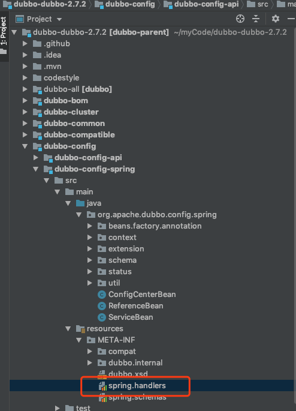
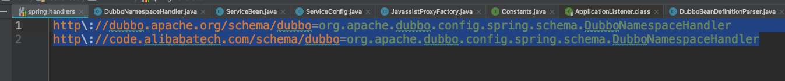
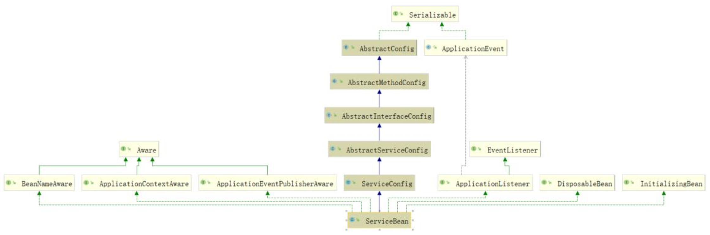
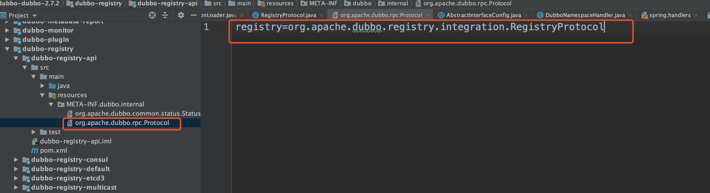

# Apache Dubbo服务发布源码分析

## Dubbo对于Spring的扩展

最早的例子里我们使用Spring 的xml配置来实现Dubbo的服务发布。为什么Spring配置文件中可以使用Dubbo的配置呢？

### Spring标签的扩展

在Spring中定义了两个接口

NamespaceHandler：注册一个BeanDefinitionParser，利用他们来进行解析。

BeandDifinitionParser：用于解析每个element的内容。

Spring默认会加载jar包下的META-INF/spring.handlers文件寻找对应的NamespaceHandler。如：Dubbo-config模块下的dubbo-config-spring，中如下图：



文件内容为：



### Dubbo的接入实现

Dubbo中spring扩展就是使用spring的自定义类型，所以同样也有NamespaceHandler、BeanDefinitionParser。而NamesspaceHandler是DubboNamespaceHandler。

代码实现为：

```java
public class DubboNamespaceHandler extends NamespaceHandlerSupport {

    static {
        Version.checkDuplicate(DubboNamespaceHandler.class);
    }

    @Override
    public void init() {
        registerBeanDefinitionParser("application", new DubboBeanDefinitionParser(ApplicationConfig.class, true));
        registerBeanDefinitionParser("module", new DubboBeanDefinitionParser(ModuleConfig.class, true));
        registerBeanDefinitionParser("registry", new DubboBeanDefinitionParser(RegistryConfig.class, true));
        registerBeanDefinitionParser("config-center", new DubboBeanDefinitionParser(ConfigCenterBean.class, true));
        registerBeanDefinitionParser("metadata-report", new DubboBeanDefinitionParser(MetadataReportConfig.class, true));
        registerBeanDefinitionParser("monitor", new DubboBeanDefinitionParser(MonitorConfig.class, true));
        registerBeanDefinitionParser("metrics", new DubboBeanDefinitionParser(MetricsConfig.class, true));
        registerBeanDefinitionParser("provider", new DubboBeanDefinitionParser(ProviderConfig.class, true));
        registerBeanDefinitionParser("consumer", new DubboBeanDefinitionParser(ConsumerConfig.class, true));
        registerBeanDefinitionParser("protocol", new DubboBeanDefinitionParser(ProtocolConfig.class, true));
        registerBeanDefinitionParser("service", new DubboBeanDefinitionParser(ServiceBean.class, true));
        registerBeanDefinitionParser("reference", new DubboBeanDefinitionParser(ReferenceBean.class, false));
        registerBeanDefinitionParser("annotation", new AnnotationBeanDefinitionParser());
    }

}
```

BeanDefinitionParser全部都使用了DubboBeanDefinitionParser，如果我们想看```<dubbo:service/>```的配置，就直接看```new DubboBeanDefinitionParser(ServiceBean.class, true)```。

在本段代码里主要做了一件事，把不同的配置分别转化成spring容器中的bean对象：

- application 对应 ApplicationConfig 
- registry 对应 RegistryConfig 
- monitor 对应 MonitorConfig 
- provider 对应 ProviderConfig 
- consumer 对应 ConsumerConfig


我们发现，涉及到服务发布和服务调用的配置的解析，使用的是ServiceBean和ReferenceBean。并不是config结尾的，这两个类稍微特殊些，当然他们同时也分别继承了ServiceConfig和ReferenceConfig。

```java
registerBeanDefinitionParser("service", new DubboBeanDefinitionParser(ServiceBean.class, true));
registerBeanDefinitionParser("reference", new DubboBeanDefinitionParser(ReferenceBean.class, false));
```

### **DubboBeanDefinitionParser** 

这里面是实现具体配置文件解析的入口，它重写了parse方法，对spring的配置进行解析。我们关注一下serviceBean的解析，实际就是解析```<dubbo:service>```这个标签中的属性：

```java
 else if (ServiceBean.class.equals(beanClass)) {
    String className = element.getAttribute("class");
    if (className != null && className.length() > 0) {
        RootBeanDefinition classDefinition = new RootBeanDefinition();
        classDefinition.setBeanClass(ReflectUtils.forName(className));
        classDefinition.setLazyInit(false);
        parseProperties(element.getChildNodes(), classDefinition);
        beanDefinition.getPropertyValues().addPropertyValue("ref", new BeanDefinitionHolder(classDefinition, id + "Impl"));
    }
}
```


### ServiceBean的实现

ServiceBean这个类，分别实现了```InitializingBean, DisposableBean, ApplicationContextAware, ApplicationListener<ContextRefreshedEvent>, BeanNameAware,ApplicationEventPublisherAware```

#### InitializingBean

InitializingBean接口为bean提供了初始化方法的方式，它只包括afterPropertiesSet方法，凡是继承该接口的类，在初始化Bean的时候会执行该方法。被重写的方法为afterPropertiesSet。

#### DisposableBean

被重写的方法为destroy，bean被销毁的时候，spring容器会自动执行destory方法，比如释放资源。

#### ApplicationContextAware

实现了这个接口的bean，当spring容器初始化的时候，会自动的将ApplicationContext注入进来。

#### ApplicationListener

ApplicationEvent事件监听，spring容器启动后会发一个事件通知。被重写的方法为：onApplicationEvent.onApplicationEvent方法传入的对象是contextRefreshedEvent。**这个对象是当Spring的上下文被刷新或者加载完毕的时候触发的。因此服务就是在Spring的上下文刷新后进行导出操作的。**

#### BeanNameAware

获得自身初始化时，本身的bean的id属性，被重写的方法为setBeanName。

#### ApplicationEventPublisherAware

这个是一个异步事件发送器。被重写的方法为setApplicationEventPublisher，简单来说，在spring里面提供了类似于消息队列的异步事件解耦功能。

##### **spring** 事件发送监听由 **3** 个部分组成 

1. ApplicationEvent:表示事件本身，自定义事件需要继承该类 
2. ApplicationEventPublisherAware:事件发送器，需要实现该接口 
3. ApplicationListener:事件监听器接口 


## ServiceBean中服务暴露过程

在 ServiceBean 中，我们暂且只需要关注两个方法，分别是: 

- 在初始化 bean 的时候会执行该方法 afterPropertiesSet。
- spring 容器启动后会发一个事件通知 onApplicationEvent。



### **afterPropertiesSet** 

```java
public void afterPropertiesSet() throws Exception {
    //config初始化
    if (getProvider() == null) {
        Map<String, ProviderConfig> providerConfigMap = applicationContext == null ? null : BeanFactoryUtils.beansOfTypeIncludingAncestors(applicationContext, ProviderConfig.class, false, false);
        if (providerConfigMap != null && providerConfigMap.size() > 0) {
            Map<String, ProtocolConfig> protocolConfigMap = applicationContext == null ? null : BeanFactoryUtils.beansOfTypeIncludingAncestors(applicationContext, ProtocolConfig.class, false, false);
            if (CollectionUtils.isEmptyMap(protocolConfigMap)
                    && providerConfigMap.size() > 1) { // backward compatibility
                List<ProviderConfig> providerConfigs = new ArrayList<ProviderConfig>();
                for (ProviderConfig config : providerConfigMap.values()) {
                    if (config.isDefault() != null && config.isDefault()) {
                        providerConfigs.add(config);
                    }
                }
                if (!providerConfigs.isEmpty()) {
                    setProviders(providerConfigs);
                }
            } else {
                ProviderConfig providerConfig = null;
                for (ProviderConfig config : providerConfigMap.values()) {
                    if (config.isDefault() == null || config.isDefault()) {
                        if (providerConfig != null) {
                            throw new IllegalStateException("Duplicate provider configs: " + providerConfig + " and " + config);
                        }
                        providerConfig = config;
                    }
                }
                if (providerConfig != null) {
                    setProvider(providerConfig);
                }
            }
        }
    }
    if (getApplication() == null
            && (getProvider() == null || getProvider().getApplication() == null)) {
        Map<String, ApplicationConfig> applicationConfigMap = applicationContext == null ? null : BeanFactoryUtils.beansOfTypeIncludingAncestors(applicationContext, ApplicationConfig.class, false, false);
        if (applicationConfigMap != null && applicationConfigMap.size() > 0) {
            ApplicationConfig applicationConfig = null;
            for (ApplicationConfig config : applicationConfigMap.values()) {
                if (applicationConfig != null) {
                    throw new IllegalStateException("Duplicate application configs: " + applicationConfig + " and " + config);
                }
                applicationConfig = config;
            }
            if (applicationConfig != null) {
                setApplication(applicationConfig);
            }
        }
    }
    if (getModule() == null
            && (getProvider() == null || getProvider().getModule() == null)) {
        Map<String, ModuleConfig> moduleConfigMap = applicationContext == null ? null : BeanFactoryUtils.beansOfTypeIncludingAncestors(applicationContext, ModuleConfig.class, false, false);
        if (moduleConfigMap != null && moduleConfigMap.size() > 0) {
            ModuleConfig moduleConfig = null;
            for (ModuleConfig config : moduleConfigMap.values()) {
                if (config.isDefault() == null || config.isDefault()) {
                    if (moduleConfig != null) {
                        throw new IllegalStateException("Duplicate module configs: " + moduleConfig + " and " + config);
                    }
                    moduleConfig = config;
                }
            }
            if (moduleConfig != null) {
                setModule(moduleConfig);
            }
        }
    }

    if (StringUtils.isEmpty(getRegistryIds())) {
        if (getApplication() != null && StringUtils.isNotEmpty(getApplication().getRegistryIds())) {
            setRegistryIds(getApplication().getRegistryIds());
        }
        if (getProvider() != null && StringUtils.isNotEmpty(getProvider().getRegistryIds())) {
            setRegistryIds(getProvider().getRegistryIds());
        }
    }

    if ((CollectionUtils.isEmpty(getRegistries()))
            && (getProvider() == null || CollectionUtils.isEmpty(getProvider().getRegistries()))
            && (getApplication() == null || CollectionUtils.isEmpty(getApplication().getRegistries()))) {
        Map<String, RegistryConfig> registryConfigMap = applicationContext == null ? null : BeanFactoryUtils.beansOfTypeIncludingAncestors(applicationContext, RegistryConfig.class, false, false);
        if (CollectionUtils.isNotEmptyMap(registryConfigMap)) {
            List<RegistryConfig> registryConfigs = new ArrayList<>();
            if (StringUtils.isNotEmpty(registryIds)) {
                Arrays.stream(COMMA_SPLIT_PATTERN.split(registryIds)).forEach(id -> {
                    if (registryConfigMap.containsKey(id)) {
                        registryConfigs.add(registryConfigMap.get(id));
                    }
                });
            }

            if (registryConfigs.isEmpty()) {
                for (RegistryConfig config : registryConfigMap.values()) {
                    if (StringUtils.isEmpty(registryIds)) {
                        registryConfigs.add(config);
                    }
                }
            }
            if (!registryConfigs.isEmpty()) {
                super.setRegistries(registryConfigs);
            }
        }
    }
    if (getMetadataReportConfig() == null) {
        Map<String, MetadataReportConfig> metadataReportConfigMap = applicationContext == null ? null : BeanFactoryUtils.beansOfTypeIncludingAncestors(applicationContext, MetadataReportConfig.class, false, false);
        if (metadataReportConfigMap != null && metadataReportConfigMap.size() == 1) {
            super.setMetadataReportConfig(metadataReportConfigMap.values().iterator().next());
        } else if (metadataReportConfigMap != null && metadataReportConfigMap.size() > 1) {
            throw new IllegalStateException("Multiple MetadataReport configs: " + metadataReportConfigMap);
        }
    }

    if (getConfigCenter() == null) {
        Map<String, ConfigCenterConfig> configenterMap = applicationContext == null ? null : BeanFactoryUtils.beansOfTypeIncludingAncestors(applicationContext, ConfigCenterConfig.class, false, false);
        if (configenterMap != null && configenterMap.size() == 1) {
            super.setConfigCenter(configenterMap.values().iterator().next());
        } else if (configenterMap != null && configenterMap.size() > 1) {
            throw new IllegalStateException("Multiple ConfigCenter found:" + configenterMap);
        }
    }

    if (getMonitor() == null
            && (getProvider() == null || getProvider().getMonitor() == null)
            && (getApplication() == null || getApplication().getMonitor() == null)) {
        Map<String, MonitorConfig> monitorConfigMap = applicationContext == null ? null : BeanFactoryUtils.beansOfTypeIncludingAncestors(applicationContext, MonitorConfig.class, false, false);
        if (monitorConfigMap != null && monitorConfigMap.size() > 0) {
            MonitorConfig monitorConfig = null;
            for (MonitorConfig config : monitorConfigMap.values()) {
                if (config.isDefault() == null || config.isDefault()) {
                    if (monitorConfig != null) {
                        throw new IllegalStateException("Duplicate monitor configs: " + monitorConfig + " and " + config);
                    }
                    monitorConfig = config;
                }
            }
            if (monitorConfig != null) {
                setMonitor(monitorConfig);
            }
        }
    }

    if (getMetrics() == null) {
        Map<String, MetricsConfig> metricsConfigMap = applicationContext == null ? null : BeanFactoryUtils.beansOfTypeIncludingAncestors(applicationContext, MetricsConfig.class, false, false);
        if (metricsConfigMap != null && metricsConfigMap.size() > 0) {
            MetricsConfig metricsConfig = null;
            for (MetricsConfig config : metricsConfigMap.values()) {
                if (metricsConfig != null) {
                    throw new IllegalStateException("Duplicate metrics configs: " + metricsConfig + " and " + config);
                }
                metricsConfig = config;
            }
            if (metricsConfig != null) {
                setMetrics(metricsConfig);
            }
        }
    }

    if (StringUtils.isEmpty(getProtocolIds())) {
        if (getProvider() != null && StringUtils.isNotEmpty(getProvider().getProtocolIds())) {
            setProtocolIds(getProvider().getProtocolIds());
        }
    }

    if (CollectionUtils.isEmpty(getProtocols())
            && (getProvider() == null || CollectionUtils.isEmpty(getProvider().getProtocols()))) {
        Map<String, ProtocolConfig> protocolConfigMap = applicationContext == null ? null : BeanFactoryUtils.beansOfTypeIncludingAncestors(applicationContext, ProtocolConfig.class, false, false);
        if (protocolConfigMap != null && protocolConfigMap.size() > 0) {
            List<ProtocolConfig> protocolConfigs = new ArrayList<ProtocolConfig>();
            if (StringUtils.isNotEmpty(getProtocolIds())) {
                Arrays.stream(COMMA_SPLIT_PATTERN.split(getProtocolIds()))
                        .forEach(id -> {
                            if (protocolConfigMap.containsKey(id)) {
                                protocolConfigs.add(protocolConfigMap.get(id));
                            }
                        });
            }

            if (protocolConfigs.isEmpty()) {
                for (ProtocolConfig config : protocolConfigMap.values()) {
                    if (StringUtils.isEmpty(protocolIds)) {
                        protocolConfigs.add(config);
                    }
                }
            }

            if (!protocolConfigs.isEmpty()) {
                super.setProtocols(protocolConfigs);
            }
        }
    }
    if (StringUtils.isEmpty(getPath())) {
        if (StringUtils.isNotEmpty(beanName)
                && StringUtils.isNotEmpty(getInterface())
                && beanName.startsWith(getInterface())) {
            setPath(beanName);
        }
    }
    if (!supportedApplicationListener) {
        export();
    }
}
```

我们发现这个方法里面，就是把 dubbo 中配置的 application、registry、service、protocol 等信息，加载到对应的 config 实体中，便于后续的使用。

### **onApplicationEvent** 

spring容器启动之后，会收到一个这样的事件通知，这里面做了两个事情:

- 判断服务是否已经发布过。
- 如果没有发布，**则调用export进行服务发布的流程(这里就是入口)** 。

```java
//监听  spring上下文被刷新或者加载的时候触发
@Override
public void onApplicationEvent(ContextRefreshedEvent event) {
    if (!isExported() && !isUnexported()) {
        if (logger.isInfoEnabled()) {
            logger.info("The service ready on spring started. service: " + getInterface());
        }
        export(); //导出、发布
    }
}
```

### export

serviceBean中，重写了export方法，实现了一个事件的发布。并且调用了super.export() ，也就是会调用父类的export方法，也就是**ServiceConfig**类的export()方法。

```java
@Override
public void export() {
    super.export();
    // Publish ServiceBeanExportedEvent
    publishExportEvent();
}
```

### ServiceConfig配置类 

先整体来看一下这个类的作用，**从名字来看，它应该和其他所有config类一样去实现对配置文件中service的配置信息的存储。 实际上这个类并不单纯，所有的配置它都放在了一个AbstractServiceConfig的抽象类，自己实现了很多对于服务发布之前要做的操作逻辑。**

#### export

```java
public synchronized void export() {
    checkAndUpdateSubConfigs(); //检查或这个更新配置

    if (!shouldExport()) { //当前服务是否要发布
        return;
    }

    if (shouldDelay()) {//检查是否需要延时发布，通过配置@Service(delay = 1000)实现，单位毫秒
        //这里的延时是通过定时器来实现
        delayExportExecutor.schedule(this::doExport, getDelay(), TimeUnit.MILLISECONDS);
    } else {
        //如果没有配置 delay，则直接调用 export 进行发布
        doExport();
    }
}
```

#### doExport

这里仍然还是在实现发布前的各种判断，

```java
protected synchronized void doExport() {
    if (unexported) {
        throw new IllegalStateException("The service " + interfaceClass.getName() + " has already unexported!");
    }
    //服务是否已经发布过了
    if (exported) {
        return;
    }
    //设置发布状态
    exported = true;

    //path表示服务路径，默认使用interfaceName
    if (StringUtils.isEmpty(path)) { //path=interfaceName
        path = interfaceName;
    }
    doExportUrls();
}
```

#### doExportUrls

1. 记载所有配置的注册中心地址。
2. 遍历所有配置的协议，protocols。
3. 针对每种协议发布一个对应协议的服务。

```java
private void doExportUrls() {
    //（N）加载注册中心，并且声称URL地址
    //URL(来驱动流程的执行)->[  registry://192.168.13.106:2181/org.apache.dubbo.registry.RegsitryService/....]
    //
    List<URL> registryURLs = loadRegistries(true);
    for (ProtocolConfig protocolConfig : protocols) {
        //iterface , version ,group组成的key
        String pathKey = URL.buildKey(getContextPath(protocolConfig).map(p -> p + "/" + path).orElse(path), group, version);
        //存储服务发布的元数据
        ProviderModel providerModel = new ProviderModel(pathKey, ref, interfaceClass);
        ApplicationModel.initProviderModel(pathKey, providerModel);
        doExportUrlsFor1Protocol(protocolConfig, registryURLs);
    }
}
```

#### doExportUrlsFor1Protocol

发布执行协议的服务，以Dubbo服务为例：

1. 省略的代码是为了把当前服务所配置的`<dubbo:method>`参数进行解析，保存到map集合中。
2. 获得当前服务需要暴露的IP和端口。
3. 把解析到的所有数据，组装成一个URL，大概应该是：dubbo://192.168.13.1:20881/com.gupaoedu.dubbo.practice.ISayHelloService 

```java
private void doExportUrlsFor1Protocol(ProtocolConfig protocolConfig, List<URL> registryURLs) {
    // ..........省略部分代码，（用于解析<dubbo:method> 配置）
    // export service
    //主机绑定
    String host = this.findConfigedHosts(protocolConfig, registryURLs, map);
    Integer port = this.findConfigedPorts(protocolConfig, name, map);
    URL url = new URL(name, host, port, getContextPath(protocolConfig).map(p -> p + "/" + path).orElse(path), map);
    //TODO 动态配置修改
    if (ExtensionLoader.getExtensionLoader(ConfiguratorFactory.class)
            .hasExtension(url.getProtocol())) {
        url = ExtensionLoader.getExtensionLoader(ConfiguratorFactory.class)
                .getExtension(url.getProtocol()).getConfigurator(url).configure(url);
    }

    //url已经组装好了，接下来只需要发布。（context->url）
    //scope 选择服务发布的范围（local/remote）
    //同一个jvm里面调用，没必要走远程通信  ； injvm://ip:port..
    //remote :  dubbo://ip:port
    //默认情况下，如果是配置remote（registry），默认发布远程和本地
    String scope = url.getParameter(SCOPE_KEY);
    // don't export when none is configured
    // 如果scope!="none"则发布服务，默认scope为null。如果scope不为none，判断是否为local或remote，从而发布Local服务或Remote服务，默认两个都会发布
    if (!SCOPE_NONE.equalsIgnoreCase(scope)) {

        // 发布本地服务
        // 如果是本地发布，则直接调用exportLocal
        if (!SCOPE_REMOTE.equalsIgnoreCase(scope)) {
            exportLocal(url);  //TODO
        }
        // export to remote if the config is not local (export to local only when config is local)
        // 发布远程服务
        if (!SCOPE_LOCAL.equalsIgnoreCase(scope)) {
            if (!isOnlyInJvm() && logger.isInfoEnabled()) {
                logger.info("Export dubbo service " + interfaceClass.getName() + " to url " + url);
            }
            if (CollectionUtils.isNotEmpty(registryURLs)) {
                for (URL registryURL : registryURLs) { //registryURL: registry://ip:port...
                    //if protocol is only injvm ,not register
                    if (LOCAL_PROTOCOL.equalsIgnoreCase(url.getProtocol())) {
                        continue;
                    }
                    url = url.addParameterIfAbsent(DYNAMIC_KEY, registryURL.getParameter(DYNAMIC_KEY));
                    URL monitorUrl = loadMonitor(registryURL);
                    if (monitorUrl != null) {
                        url = url.addParameterAndEncoded(MONITOR_KEY, monitorUrl.toFullString());
                    }
                    if (logger.isInfoEnabled()) {
                        logger.info("Register dubbo service " + interfaceClass.getName() + " url " + url + " to registry " + registryURL);
                    }

                    // For providers, this is used to enable custom proxy to generate invoker
                    String proxy = url.getParameter(PROXY_KEY);
                    if (StringUtils.isNotEmpty(proxy)) {
                        registryURL = registryURL.addParameter(PROXY_KEY, proxy);
                    }
                    //TODO  invoker -> 代理类
                    Invoker<?> invoker = proxyFactory.getInvoker(ref, (Class) interfaceClass, registryURL.addParameterAndEncoded(EXPORT_KEY, url.toFullString()));
                    //MetaData元数据的委托
                    DelegateProviderMetaDataInvoker wrapperInvoker = new DelegateProviderMetaDataInvoker(invoker, this);
                    //wrapperInvoker : registry:///
                    //Protocol$Adaptive(->做适配)
                    // RegistryProtocol-> getExtension("registry")
                    Exporter<?> exporter = protocol.export(wrapperInvoker);
                    exporters.add(exporter);
                }
            } else {
                Invoker<?> invoker = proxyFactory.getInvoker(ref, (Class) interfaceClass, url);
                DelegateProviderMetaDataInvoker wrapperInvoker = new DelegateProviderMetaDataInvoker(invoker, this);

                Exporter<?> exporter = protocol.export(wrapperInvoker);
                exporters.add(exporter);
            }
            /**
             * @since 2.7.0
             * ServiceData Store
             */
            MetadataReportService metadataReportService = null;
            if ((metadataReportService = getMetadataReportService()) != null) {
                metadataReportService.publishProvider(url);
            }
        }
    }
    this.urls.add(url);
}
```

##### local服务

local服务知识injvm服务，提供一种消费者和提供者都在一个jvm内的调用方式。使用了injvm协议，是一个伪协议，它不开启端口，不发起远程调用，只在JVM内直接关联，荣国集合的方式保存了发布的服务信息。但执行Dubbo的filter链。简单来说，就是你本地的Dubbo服务调用，都依托于dubbo来标准进行。这样可以享受到Dubbo的一些配置服务。

##### remote

remote表示根据配置的注册中心进行远程发布。遍历多个注册中心。进行协议的发布：

1. Invoker是一个代理类，它是Dubbo的核心模型，其他模型都向它靠拢，转换成它，它代表一个可执行体，可向它发起invoke调用，它有可能是一个本地的实现，也可能是一个远程的实现，也可能是一个集群实现。
2. DelegateProviderMetaDataInvoker，因为2.7引入了元数据，所以这里对invoker做了委托，把Invoker交给DelegateproviderMetaDataInvoker来处理。
3. 调用protocol.export(invoker)来发布这个代理。
4. 添加到exporters集合。

#### protocol.export

protocol.export是一个自适应扩展点：

```java
private static final Protocol protocol = ExtensionLoader.getExtensionLoader(Protocol.class).getAdaptiveExtension();
```

打开 Protocol这个扩展点，又可以看到它 是一个在方法层面上的自适应扩展，意味着它实现了对于export这个方法的适配。

```java
@Adaptive
<T> Exporter<T> export(Invoker<T> invoker) throws RpcException;
```

也就意味着这个Protocol是一个动态代理类， Protocol$Adaptive 

```java
public class Protocol$Adaptive implements org.apache.dubbo.rpc.Protocol {
    public void destroy() {
        throw new UnsupportedOperationException("The method public abstract void org.apache.dubbo.rpc.Protocol.destroy() of interface org.apache.dubbo.rpc.Protocol is not adaptive method!");
    }

    public int getDefaultPort() {
        throw new UnsupportedOperationException("The method public abstract int org.apache.dubbo.rpc.Protocol.getDefaultPort() of interface org.apache.dubbo.rpc.Protocol is not adaptive method!");
    }

    public org.apache.dubbo.rpc.Exporter export(org.apache.dubbo.rpc.Invoker arg0) throws org.apache.dubbo.rpc.RpcException {
        if (arg0 == null) throw new IllegalArgumentException("org.apache.dubbo.rpc.Invoker argument == null");
        if (arg0.getUrl() == null)
            throw new IllegalArgumentException("org.apache.dubbo.rpc.Invoker argument getUrl() == null");
        org.apache.dubbo.common.URL url = arg0.getUrl();

        //extName=webservice
        String extName = (url.getProtocol() == null ? "dubbo" : url.getProtocol());
        if (extName == null)
            throw new IllegalStateException("Failed to get extension (org.apache.dubbo.rpc.Protocol) name from url (" + url.toString() + ") use keys([protocol])");
        org.apache.dubbo.rpc.Protocol extension = (org.apache.dubbo.rpc.Protocol) ExtensionLoader.getExtensionLoader(org.apache.dubbo.rpc.Protocol.class).getExtension(extName);

        return extension.export(arg0);
    }

    public org.apache.dubbo.rpc.Invoker refer(Class arg0, org.apache.dubbo.common.URL arg1) throws org.apache.dubbo.rpc.RpcException {
        if (arg1 == null) throw new IllegalArgumentException("url == null");
        org.apache.dubbo.common.URL url = arg1;
        String extName = (url.getProtocol() == null ? "dubbo" : url.getProtocol());
        if (extName == null)
            throw new IllegalStateException("Failed to get extension (org.apache.dubbo.rpc.Protocol) name from url (" + url.toString() + ") use keys([protocol])");
        org.apache.dubbo.rpc.Protocol extension = (org.apache.dubbo.rpc.Protocol) ExtensionLoader.getExtensionLoader(org.apache.dubbo.rpc.Protocol.class).getExtension(extName);
        return extension.refer(arg0, arg1);
    }
}
```

当前的场景中，protocol 会是调用谁呢?目前发布的 invoker(URL)，实际上是一个registry://协议，所以 Protocol$Adaptive，会通过getExtension(extName)得到一个RegistryProtocol 。扩展的定义如下图：



#### RegistryProtocol.export

这个RegistryProtocol是用来实现服务注册的。

这里面会有很多逻辑：

- 实现把对应协议的服务发布
- 实现服务注册
- 订阅服务重写

```java
public <T> Exporter<T> export(final Invoker<T> originInvoker) throws RpcException {
    // 这里获得的是zookeeper注册中心的url
    // registryUrl -> zookeeper://ip:port
    URL registryUrl = getRegistryUrl(originInvoker);
    // 这里是获得服务提供者的url
    // providerUrl -> dubbo:// ip:port
    URL providerUrl = getProviderUrl(originInvoker);

    // Subscribe the override data
    // FIXME When the provider subscribes, it will affect the scene : a certain JVM exposes the service and call
    //  the same service. Because the subscribed is cached key with the name of the service, it causes the
    //  subscription information to cover.
    //订阅override数据。在admin控制台可以针对服务进行治理，比如修改权重，修改路由机制等，当注册中心有此服务的覆盖配置 注册进来时，推送消息给提供者，重新暴露服务
    final URL overrideSubscribeUrl = getSubscribedOverrideUrl(providerUrl);
    final OverrideListener overrideSubscribeListener = new OverrideListener(overrideSubscribeUrl, originInvoker);
    overrideListeners.put(overrideSubscribeUrl, overrideSubscribeListener);

    providerUrl = overrideUrlWithConfig(providerUrl, overrideSubscribeListener);

    /***********************************/
    // 这里就交给了具体的协议去暴露服务
    //doLocalExport 本质就是去启动一个netty服务
    final ExporterChangeableWrapper<T> exporter = doLocalExport(originInvoker, providerUrl);

    // 获取要注册到注册中心的 URL
    // 把dubbo:// url注册到zk上
    final Registry registry = getRegistry(originInvoker);
    final URL registeredProviderUrl = getRegisteredProviderUrl(providerUrl, registryUrl);
    ProviderInvokerWrapper<T> providerInvokerWrapper = ProviderConsumerRegTable.registerProvider(originInvoker,
            registryUrl, registeredProviderUrl);
    //to judge if we need to delay publish
    boolean register = registeredProviderUrl.getParameter("register", true);
    //是否配置了注册中心，如果是， 则需要注册
    if (register) {
        //注册到注册中心的 URL
        register(registryUrl, registeredProviderUrl);
        providerInvokerWrapper.setReg(true);
    }

    // Deprecated! Subscribe to override rules in 2.6.x or before.
    //设置注册中心的订阅
    registry.subscribe(overrideSubscribeUrl, overrideSubscribeListener);

    exporter.setRegisterUrl(registeredProviderUrl);
    exporter.setSubscribeUrl(overrideSubscribeUrl);
    //Ensure that a new exporter instance is returned every time export
    //保证每次export都返回一个新的exporter实例
    return new DestroyableExporter<>(exporter);
}
```

#### doLocalExport

先通过dolocalExport来暴露一个服务，本质上应该是启动一个通信服务，主要的步骤是将本地IP和20880端口打开，进行监听originInvoker，应该是registry://ip:port/com.alibaba.dubbo.registry.RegistryService

key：从originInvoker中获得发布协议的url:dubbo://ip:port/....

bounds:一个providerUrl服务export之后，缓存bounds中，所以一个providerUrl只会对应一个exporter。

```java
private <T> ExporterChangeableWrapper<T> doLocalExport(final Invoker<T> originInvoker, URL providerUrl) {
    String key = getCacheKey(originInvoker);
    //bounds -chm  ->computeIfAbsent  if(map.get(key)==null){map.put()}
    return (ExporterChangeableWrapper<T>) bounds.computeIfAbsent(key, s -> {
        //orginInvoker->   InvokerDelegate(DelegateProviderMetaDataInvoker(invoker))
        //对原有的invoker,委托给了InvokerDelegate
        Invoker<?> invokerDelegate = new InvokerDelegate<>(originInvoker, providerUrl);
        //protocol.export -> DubboProtocol.export(本质上就是 暴露一个 20880的端口）
        //protocol- >Protocol$Apaptive ->QosProtocolWrapper(ProtocolListenerWrapper(ProtocolFilterWrapper(DubboProtocol(invoker))))
        //将invoker转换为exporter并启动netty服务
        return new ExporterChangeableWrapper<>((Exporter<T>) protocol.export(invokerDelegate), originInvoker);
    });
}
```

**InvokerDelegete**: 是RegistryProtocol的一个静态内部类，该类是一个originInvoker的委托类，该类存储了 originInvoker，其父类InvokerWrapper还会存储providerUrl，InvokerWrapper会调用originInvoker的invoke方法，也会销毁invoker。可以管理invoker的生命周期。

#### **DubboProtocol.export** 

基于动态代理的适配，很自然的就过渡到了DubboProtocol这个协议类中，但是实际上是DubboProtocol 吗? 这里并不是获得一个单纯的DubboProtocol扩展点，而是会通过Wrapper对Protocol进行装饰，装饰器分别为: 

QosProtocolWrapper/ProtocolListenerWrapper/ProtocolFilterWrapper/DubboProtocol 

为什么是这样?我们再来看看spi的代码 

##### **Wrapper** 包装 

在ExtensionLoader.loadClass这个方法中，有一段这样的判断，如果当前这个类是一个wrapper包装类，也就是这个wrapper中有构造方法，参数是当前被加载的扩展点的类型，则把这个wrapper类加入到cacheWrapperClass缓存中。 

```java
private void loadClass(Map<String, Class<?>> extensionClasses, java.net.URL resourceURL, Class<?> clazz, String name) throws NoSuchMethodException {
    if (!type.isAssignableFrom(clazz)) {
        throw new IllegalStateException("Error occurred when loading extension class (interface: " +
                type + ", class line: " + clazz.getName() + "), class "
                + clazz.getName() + " is not subtype of interface.");
    }
    if (clazz.isAnnotationPresent(Adaptive.class)) {
        cacheAdaptiveClass(clazz);
    } else if (isWrapperClass(clazz)) {
        cacheWrapperClass(clazz);
    } else {
        clazz.getConstructor();
        if (StringUtils.isEmpty(name)) {
            name = findAnnotationName(clazz);
            if (name.length() == 0) {
                throw new IllegalStateException("No such extension name for the class " + clazz.getName() + " in the config " + resourceURL);
            }
        }

        String[] names = NAME_SEPARATOR.split(name);
        if (ArrayUtils.isNotEmpty(names)) {
            cacheActivateClass(clazz, names[0]);
            for (String n : names) {
                cacheName(clazz, n);
                saveInExtensionClass(extensionClasses, clazz, name);
            }
        }
    }
}
```

我们可以在 dubbo 的配置文件中找到三个 Wrapper：

- **QosprotocolWrapper**， 如果当前配置了注册中心，则会启动一个 Qos server.qos 是 dubbo 的在线运维命令，dubbo2.5.8 新版本重构了 telnet 模块，提供了新的 telnet 命令支持，新版本的 telnet 端口与 dubbo 协议的端口是不同的端口，默认为 22222 
- **ProtocolFilterWrapper**，对 invoker 进行 filter 的包装，实现请求的过滤 
- **ProtocolListenerWrapper**， 用于服务 export 时候插入监听机制，暂未实现 

```
qos=org.apache.dubbo.qos.protocol.QosProtocolWrapper filter=org.apache.dubbo.rpc.protocol.ProtocolFilterWrapper listener=org.apache.dubbo.rpc.protocol.ProtocolListenerWrapper
```

接着，在 getExtension->createExtension 方法中，会对 cacheWrapperClass 集合进行判断，如果集合不为空，则进行包装 

```java
Set<Class<?>> wrapperClasses = cachedWrapperClasses;
if (CollectionUtils.isNotEmpty(wrapperClasses)) {
    for (Class<?> wrapperClass : wrapperClasses) {
        instance = injectExtension((T) wrapperClass.getConstructor(type).newInstance(instance));
    }
}
```

##### **ProtocolFilterWrapper** 

这个是一个过滤器的包装，使用责任链模式，对 invoker 进行了包装 

```java
@Override
public <T> Exporter<T> export(Invoker<T> invoker) throws RpcException {
    if (REGISTRY_PROTOCOL.equals(invoker.getUrl().getProtocol())) {
        return protocol.export(invoker);
    }
    return protocol.export(buildInvokerChain(invoker, SERVICE_FILTER_KEY, CommonConstants.PROVIDER));
}
```

```java
private static <T> Invoker<T> buildInvokerChain(final Invoker<T> invoker, String key, String group) {
    Invoker<T> last = invoker;
    //构建责任链，基于激活扩展点
    List<Filter> filters = ExtensionLoader.getExtensionLoader(Filter.class).getActivateExtension(invoker.getUrl(), key, group);
    // .......省略部分代码
}
```

我们看如下文件: 

/dubbo-rpc-api/src/main/resources/META-INF/dubbo/internal/com.alibaba.dubbo.rpc.Filter 

```properties
echo=org.apache.dubbo.rpc.filter.EchoFilter
generic=org.apache.dubbo.rpc.filter.GenericFilter
genericimpl=org.apache.dubbo.rpc.filter.GenericImplFilter
token=org.apache.dubbo.rpc.filter.TokenFilter
accesslog=org.apache.dubbo.rpc.filter.AccessLogFilter
activelimit=org.apache.dubbo.rpc.filter.ActiveLimitFilter
classloader=org.apache.dubbo.rpc.filter.ClassLoaderFilter
context=org.apache.dubbo.rpc.filter.ContextFilter
consumercontext=org.apache.dubbo.rpc.filter.ConsumerContextFilter
exception=org.apache.dubbo.rpc.filter.ExceptionFilter
executelimit=org.apache.dubbo.rpc.filter.ExecuteLimitFilter
deprecated=org.apache.dubbo.rpc.filter.DeprecatedFilter
compatible=org.apache.dubbo.rpc.filter.CompatibleFilter
timeout=org.apache.dubbo.rpc.filter.TimeoutFilter
```

默认提供了非常多的过滤器。 然后基于条件激活扩展点，来对 invoker 进行包装，从而在实现远程调用的时候，会经过这些 filter 进行过滤。 

##### export

DubboProtocol#export

```java
@Override
public <T> Exporter<T> export(Invoker<T> invoker) throws RpcException {
    URL url = invoker.getUrl();

    //获取服务标识，理解成服务坐标也行。由服务组名，服务名，服务版本号以及端口组成。比如
    //${group}/copm.gupaoedu.practice.dubbo.ISayHelloService:${version}:20880
    String key = serviceKey(url);
    //创建 DubboExporter
    DubboExporter<T> exporter = new DubboExporter<T>(invoker, key, exporterMap);
    // 将 <key, exporter> 键值对放入缓存中
    exporterMap.put(key, exporter);

    //export an stub service for dispatching event
    Boolean isStubSupportEvent = url.getParameter(STUB_EVENT_KEY, DEFAULT_STUB_EVENT);
    Boolean isCallbackservice = url.getParameter(IS_CALLBACK_SERVICE, false);
    if (isStubSupportEvent && !isCallbackservice) {
        String stubServiceMethods = url.getParameter(STUB_EVENT_METHODS_KEY);
        if (stubServiceMethods == null || stubServiceMethods.length() == 0) {
            if (logger.isWarnEnabled()) {
                logger.warn(new IllegalStateException("consumer [" + url.getParameter(INTERFACE_KEY) +
                        "], has set stubproxy support event ,but no stub methods founded."));
            }

        } else {
            stubServiceMethodsMap.put(url.getServiceKey(), stubServiceMethods);
        }
    }

    //启动服务
    openServer(url); //openServer（url） 开启一个服务 ，暴露20880端口
    optimizeSerialization(url);  //优化序列化

    return exporter;
}
```

#### **openServer** 

去开启一个服务，并且放入到缓存中->在同一台机器上(单网卡)，同一个端口上仅允许启动一个服务器实例 

```java
private void openServer(URL url) {
    // 获取 host:port，并将其作为服务器实例的 key，用于标识当前的服务器实例
    String key = url.getAddress();
    //client can export a service which's only for server to invoke
    //client 也可以暴露一个只有 server 可以调用的服务
    boolean isServer = url.getParameter(IS_SERVER_KEY, true);
    if (isServer) {
        //缓存， 一个key只对应一个exchangeServer
        ExchangeServer server = serverMap.get(key);
        if (server == null) {
            synchronized (this) {
                server = serverMap.get(key);
                if (server == null) {
                    // 创建服务器实例
                    serverMap.put(key, createServer(url));
                }
            }
        } else {
            // server supports reset, use together with override
            // 服务器已创建，则根据 url 中的配置重置服务器
            server.reset(url);
        }
    }
}
```

#### createServer

创建服务,开启心跳检测，默认使用 netty。组装 url 

```java
private ExchangeServer createServer(URL url) {
    //组装 url，在 url 中添加心跳时间、编解码参数
    url = URLBuilder.from(url)
            // 当服务关闭以后，发送一个只读的事件，默认是开启状态
            .addParameterIfAbsent(CHANNEL_READONLYEVENT_SENT_KEY, Boolean.TRUE.toString())
            // 启动心跳配置
            .addParameterIfAbsent(HEARTBEAT_KEY, String.valueOf(DEFAULT_HEARTBEAT))
            .addParameter(CODEC_KEY, DubboCodec.NAME)
            .build();
    //获得当前应该采用什么样的方式来发布服务， netty3, netty4, mina , grizzy,
    String str = url.getParameter(SERVER_KEY, DEFAULT_REMOTING_SERVER);

    //通过 SPI 检测是否存在 server 参数所代表的 Transporter 拓展，不存在则抛出异常
    if (str != null && str.length() > 0 && !ExtensionLoader.getExtensionLoader(Transporter.class).hasExtension(str)) {
        throw new RpcException("Unsupported server type: " + str + ", url: " + url);
    }

    //创建 ExchangeServer.
    ExchangeServer server;
    try {
        server = Exchangers.bind(url, requestHandler);
    } catch (RemotingException e) {
        throw new RpcException("Fail to start server(url: " + url + ") " + e.getMessage(), e);
    }

    str = url.getParameter(CLIENT_KEY);
    if (str != null && str.length() > 0) {
        Set<String> supportedTypes = ExtensionLoader.getExtensionLoader(Transporter.class).getSupportedExtensions();
        if (!supportedTypes.contains(str)) {
            throw new RpcException("Unsupported client type: " + str);
        }
    }

    return server;
}
```

#### Exchangers.bind

```java
public static ExchangeServer bind(URL url, ExchangeHandler handler) throws RemotingException {
    if (url == null) {
        throw new IllegalArgumentException("url == null");
    }
    if (handler == null) {
        throw new IllegalArgumentException("handler == null");
    }
    //获取 Exchanger，默认为 HeaderExchanger。
    //调用 HeaderExchanger 的 bind 方法创建 ExchangeServer 实例
    url = url.addParameterIfAbsent(Constants.CODEC_KEY, "exchange");

    //HeaderExchanger.
    return getExchanger(url).bind(url, handler);
}
```

#### HeaderExchanger.bind

这里面包含多个逻辑 :

- new DecodeHandler(new HeaderExchangeHandler(handler)) 
- Transporters.bind 
- new HeaderExchangeServer 目前我们只需要关心 transporters.bind 方法即可 

```java
public ExchangeServer bind(URL url, ExchangeHandler handler) throws RemotingException {
    /**
     * new DecodeHandler(new HeaderExchangeHandler())
     * Transporters.bind
     * new HeaderExchangeServer
     */
    return new HeaderExchangeServer(Transporters.bind(url, new DecodeHandler(new HeaderExchangeHandler(handler))));
}
```

#### Transporters.bind

```java
public static Server bind(URL url, ChannelHandler... handlers) throws RemotingException {
    if (url == null) {
        throw new IllegalArgumentException("url == null");
    }
    if (handlers == null || handlers.length == 0) {
        throw new IllegalArgumentException("handlers == null");
    }
    ChannelHandler handler;
    if (handlers.length == 1) {
        handler = handlers[0];
    } else {
        // 如果 handlers 元素数量大于1，则创建 ChannelHandler 分发器
        handler = new ChannelHandlerDispatcher(handlers);
    }
    // 获取自适应 Transporter 实例，并调用实例方法
    //getTransporter() -> ExtensionLoader.getExtension(Transport.class).getExtension("netty");
    return getTransporter().bind(url, handler);
}
```

#### getTransporter

getTransporter 是一个自适应扩展点，它针对 bind 方法添加了自适应注解，意味着，bing 方法的具体实现，会基于 Transporter$Adaptive 方法进行适配，那么在这里面默认的通信协议是 netty，所以它会采用 netty4 的实现，也就是：

org.apache.dubbo.remoting.transport.netty4.NettyTransporter 

```java
public static Transporter getTransporter() {
    return ExtensionLoader.getExtensionLoader(Transporter.class).getAdaptiveExtension();
}
```

#### **NettyServer** 

初始化一个 nettyserver，并且从 url 中获得相应的 ip/ port。然后调用 doOpen(); 

##### NettyTransporter#bind

```java
@Override
public Server bind(URL url, ChannelHandler listener) throws RemotingException {
    return new NettyServer(url, listener);
}
```

##### NettyServer#NettyServer

```java
public NettyServer(URL url, ChannelHandler handler) throws RemotingException {
    super(url, ChannelHandlers.wrap(handler, ExecutorUtil.setThreadName(url, SERVER_THREAD_POOL_NAME)));
}
```

##### AbstractServer#AbstractServer

```java
public AbstractServer(URL url, ChannelHandler handler) throws RemotingException {
    super(url, handler);
    localAddress = getUrl().toInetSocketAddress();

    String bindIp = getUrl().getParameter(Constants.BIND_IP_KEY, getUrl().getHost());
    int bindPort = getUrl().getParameter(Constants.BIND_PORT_KEY, getUrl().getPort());
    if (url.getParameter(ANYHOST_KEY, false) || NetUtils.isInvalidLocalHost(bindIp)) {
        bindIp = ANYHOST_VALUE;
    }
    bindAddress = new InetSocketAddress(bindIp, bindPort);
    this.accepts = url.getParameter(ACCEPTS_KEY, DEFAULT_ACCEPTS);
    this.idleTimeout = url.getParameter(IDLE_TIMEOUT_KEY, DEFAULT_IDLE_TIMEOUT);
    try {
        // 调用模板方法 doOpen 启动服务器
        doOpen();
        if (logger.isInfoEnabled()) {
            logger.info("Start " + getClass().getSimpleName() + " bind " + getBindAddress() + ", export " + getLocalAddress());
        }
    } catch (Throwable t) {
        throw new RemotingException(url.toInetSocketAddress(), null, "Failed to bind " + getClass().getSimpleName()
                + " on " + getLocalAddress() + ", cause: " + t.getMessage(), t);
    }
    //fixme replace this with better method
    DataStore dataStore = ExtensionLoader.getExtensionLoader(DataStore.class).getDefaultExtension();
    executor = (ExecutorService) dataStore.get(Constants.EXECUTOR_SERVICE_COMPONENT_KEY, Integer.toString(url.getPort()));
}
```

##### doOpen

开启 netty 服务,这个又是大家熟悉的内容了 

```java
protected void doOpen() throws Throwable {
    bootstrap = new ServerBootstrap();

    bossGroup = new NioEventLoopGroup(1, new DefaultThreadFactory("NettyServerBoss", true));
    workerGroup = new NioEventLoopGroup(getUrl().getPositiveParameter(IO_THREADS_KEY, Constants.DEFAULT_IO_THREADS),
            new DefaultThreadFactory("NettyServerWorker", true));

    final NettyServerHandler nettyServerHandler = new NettyServerHandler(getUrl(), this);
    channels = nettyServerHandler.getChannels();

    bootstrap.group(bossGroup, workerGroup)
            .channel(NioServerSocketChannel.class)
            .childOption(ChannelOption.TCP_NODELAY, Boolean.TRUE)
            .childOption(ChannelOption.SO_REUSEADDR, Boolean.TRUE)
            .childOption(ChannelOption.ALLOCATOR, PooledByteBufAllocator.DEFAULT)
            .childHandler(new ChannelInitializer<NioSocketChannel>() {
                @Override
                protected void initChannel(NioSocketChannel ch) throws Exception {
                    // FIXME: should we use getTimeout()?
                    int idleTimeout = UrlUtils.getIdleTimeout(getUrl());
                    NettyCodecAdapter adapter = new NettyCodecAdapter(getCodec(), getUrl(), NettyServer.this);
                    ch.pipeline()//.addLast("logging",new LoggingHandler(LogLevel.INFO))//for debug
                            .addLast("decoder", adapter.getDecoder())
                            .addLast("encoder", adapter.getEncoder())
                            .addLast("server-idle-handler", new IdleStateHandler(0, 0, idleTimeout, MILLISECONDS))
                            .addLast("handler", nettyServerHandler);
                }
            });
    // bind
    ChannelFuture channelFuture = bootstrap.bind(getBindAddress());
    channelFuture.syncUninterruptibly();
    channel = channelFuture.channel();

}
```

然后大家要注意的是，它这里用到了一个 handler 来处理客户端传递过来的请求: nettyServerHandler 

NettyServerHandler nettyServerHandler = **new** NettyServerHandler(getUrl(), **this**); 这个 handler 是一个链路，它的正确组成应该是 

MultiMessageHandler(heartbeatHandler(AllChannelHandler(DecodeHandler(HeaderExchangeHeadler(dubboProtocol 

后续接收到的请求，会一层一层的处理。