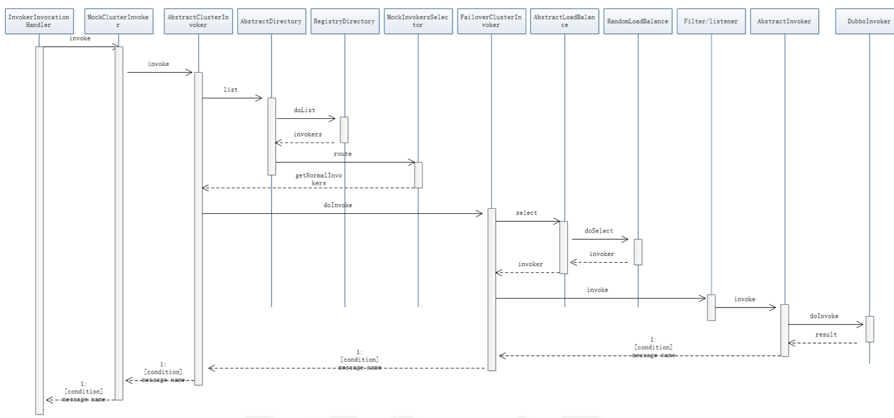
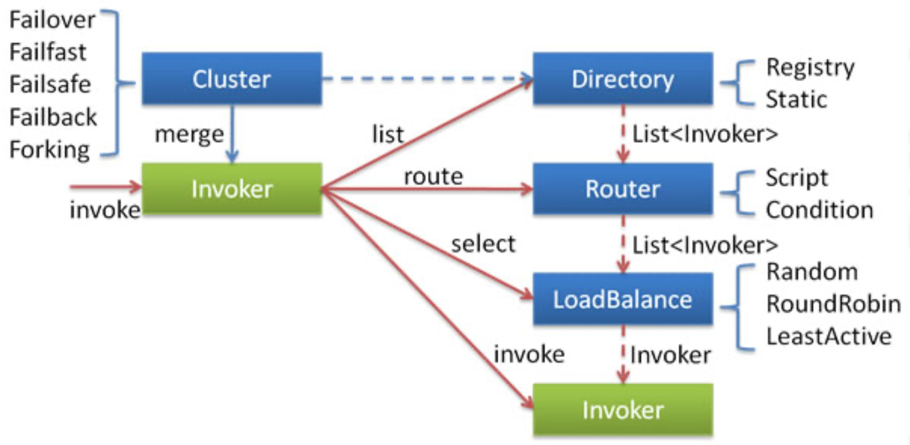
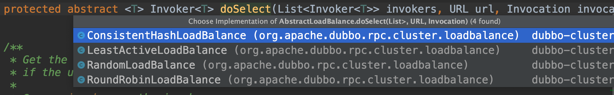
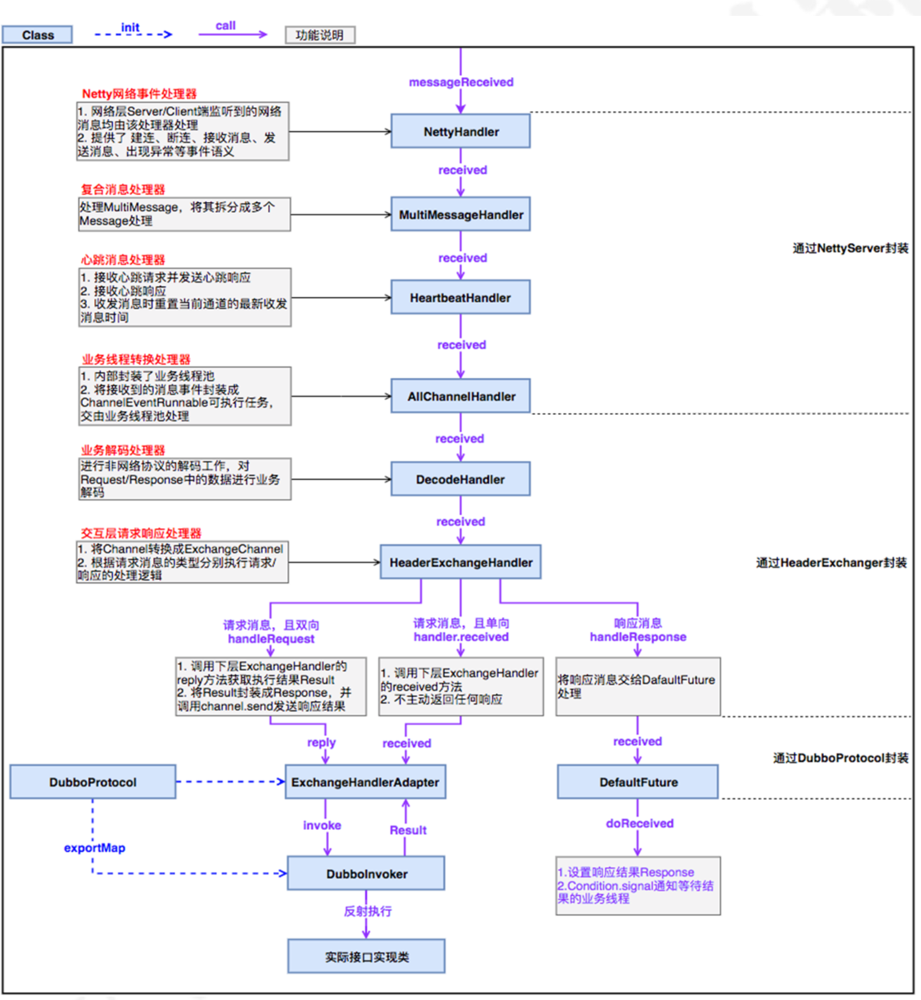
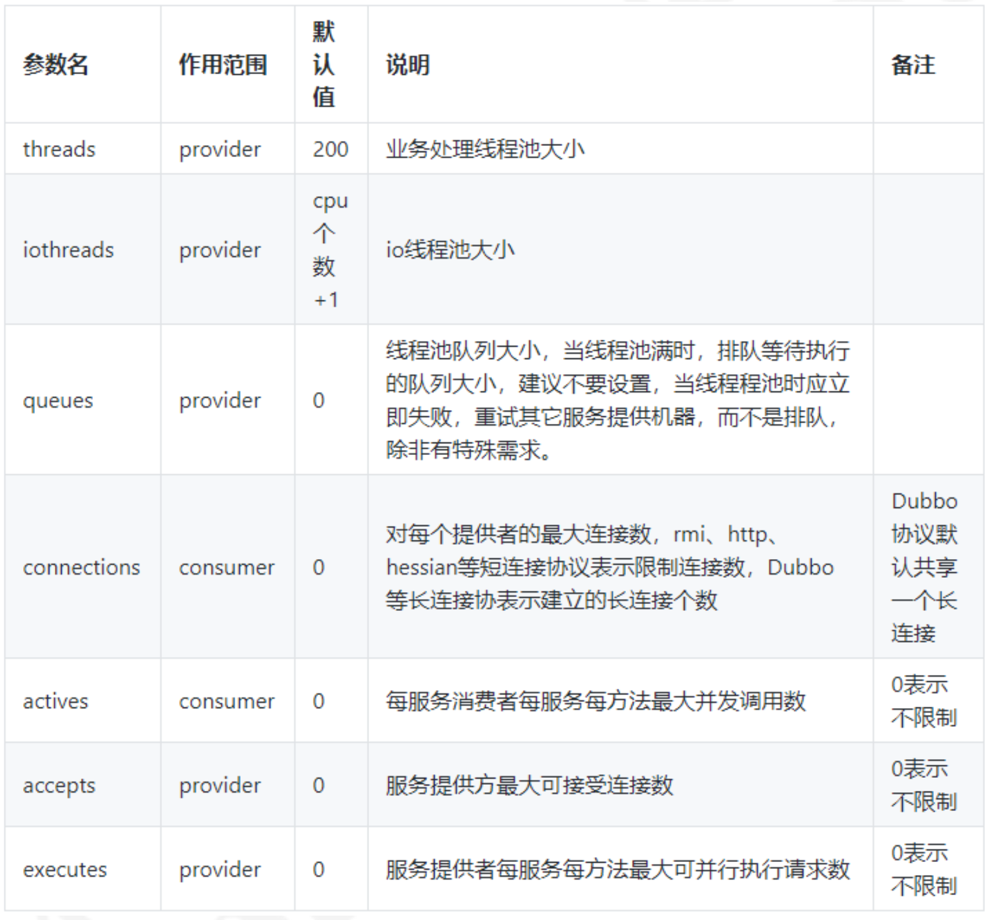
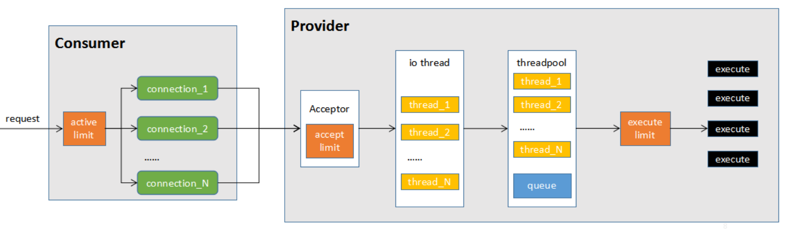

# Apache Dubbo服务通信及负载均衡

## 客户端生成的proxy

上次，我们分析到消费者初始化完成之后，会生成一个proxy，而这个proxy本质上是一个动态代理类。 

### **JavassistProxyFactory.getProxy** 

```java
@Override
@SuppressWarnings("unchecked")
public <T> T getProxy(Invoker<T> invoker, Class<?>[] interfaces) {
    return (T) Proxy.getProxy(interfaces).newInstance(new InvokerInvocationHandler(invoker));
}
```

首先我们来分解一下，这个invoker实际上是:MockClusterWrapper(FailoverCluster(directory)) 然后通过InvokerInvocationHandler做了一层包装变成了 InvokerInvocationHandler(MockClusterWrapper(FailoverCluster(directory))) 

### proxy.getProxy

这个方法里面，会生成一个动态代理的方法，我们通过debug可以看到动态字节码的拼接过程。它代理了当前这个接口的方法 sayHello , 并且方法里面是使用handler.invoke进行调用的。 

而handler又是这样一个实现: InvokerInvocationHandler(MockClusterWrapper(FailoverCluster(directory))) 

```java
public java.lang.String sayHello(java.lang.String arg0) {
    Object[] args = new Object[1];
    args[0] = ($w) $1;
    Object ret = handler.invoke(this, methods[0], args);
    return (java.lang.String) ret;
}
```

## **消费端调用的过程** 

handler的调用链路为: InvokerInvocationHandler(MockClusterWrapper(FailoverCluster(directory))) 

### **图解调用链** 




### **InvokerInvocationHandler.invoke** 

这个方法主要判断当前调用的远程方法，如果是tostring、hashcode、equals，就直接返回否则，调用invoker.invoke,进入到MockClusterWrapper.invoke方法 

```java
@Override
public Object invoke(Object proxy, Method method, Object[] args) throws Throwable {
    String methodName = method.getName();
    Class<?>[] parameterTypes = method.getParameterTypes();
    if (method.getDeclaringClass() == Object.class) {
        return method.invoke(invoker, args);
    }
    if ("toString".equals(methodName) && parameterTypes.length == 0) {
        return invoker.toString();
    }
    if ("hashCode".equals(methodName) && parameterTypes.length == 0) {
        return invoker.hashCode();
    }
    if ("equals".equals(methodName) && parameterTypes.length == 1) {
        return invoker.equals(args[0]);
    }

    //createInvocation,参数为目标方法名称和目标方法的参数，看起来似乎是组装一个传输的对象
    return invoker.invoke(new RpcInvocation(method, args)).recreate();
}
```

### **MockClusterInvoker.invoke** 

Mock，在这里面有两个逻辑：

1. 是否客户端强制配置了mock调用，那么在这种场景中主要可以用来解决服务端还没开发好的时候直接使用本地数据进行测试 
2. 是否出现了异常，如果出现异常则使用配置好的Mock类来实现服务的降级 

```java
@Override
public Result invoke(Invocation invocation) throws RpcException {
    Result result = null;

    //从url中获得MOCK_KEY对应的value
    String value = directory.getUrl().getMethodParameter(invocation.getMethodName(), MOCK_KEY, Boolean.FALSE.toString()).trim();
    //如果没有配置mock，则直接传递给下个invoker调用
    if (value.length() == 0 || value.equalsIgnoreCase("false")) {
        // 不走mock操作
        result = this.invoker.invoke(invocation);
    } else if (value.startsWith("force")) { //如果强制为本地调用，则执行mockInvoke
        if (logger.isWarnEnabled()) {
            logger.warn("force-mock: " + invocation.getMethodName() + " force-mock enabled , url : " + directory.getUrl());
        }
        //force:direct mock
        result = doMockInvoke(invocation, null);
    } else { //调用服务失败.
        //fail-mock
        try {
            result = this.invoker.invoke(invocation); //远程调用
        } catch (RpcException e) {
            if (e.isBiz()) { //业务异常，直接抛出
                throw e;
            }

            //如果远程调用出现异常，则使用Mock进行处理
            if (logger.isWarnEnabled()) {
                logger.warn("fail-mock: " + invocation.getMethodName() + " fail-mock enabled , url : " + directory.getUrl(), e);
            }
            result = doMockInvoke(invocation, e); //调用Mock类进行返回
        }
    }
    return result;
}
```

### **AbstractClusterInvoker.invoke** 

下一个invoke，应该进入FailoverClusterInvoke，但是在这里它又用到了模版方法，所以直接进入到父 类的invoke方法中 

1. 绑定attachments，Dubbo中，可以通过 RpcContext 上的 setAttachment 和 getAttachment 在服务消费方和提供方之间进行参数的隐式传递，所以这段代码中会去绑定attachments 

   ```java
   RpcContext.getContext().setAttachment("index", "1")
   ```

2. 通过list获得invoker列表，这个列表基本可以猜测到是从directory里面获得的、但是这里面还实现 了服务路由的逻辑，简单来说就是先拿到invoker列表，然后通过router进行服务路由，筛选出符合路由规则的服务提供者(暂时不细讲，属于另外一个逻辑) 

3. initLoadBalance初始化负载均衡机制 

4. 执行doInvoke 

```java
@Override
public Result invoke(final Invocation invocation) throws RpcException {
    checkWhetherDestroyed();

    // attachments -> 隐式传参
    //RpcContext.getContext().setAttachment("key","value");
    Map<String, String> contextAttachments = RpcContext.getContext().getAttachments();
    if (contextAttachments != null && contextAttachments.size() != 0) {
        ((RpcInvocation) invocation).addAttachments(contextAttachments);
    }

    /**
     *  去哪里拿到所有的目标服务呢？（RegistryDirectory）
     *  route 路由
     *  invokers.size = 2 ->
     *
     */
    List<Invoker<T>> invokers = list(invocation);
    //invokers -> route决定了invokers返回多少的问题(tag->a(2), tag->b)
    /**
     * 通过在server端和client端都可以配置 loadbalance="random"  "roundrobin"
     *     获得url里面配置的负载均衡策略，如果没有，默认为random
     *     spi -> 通过自适应扩展点进行适配->得到真正意义上的实现
     *     容错 -> failover重试 -> 已经调用过失败的节点，如果下次重试，肯定不会再次调用。
     */
    // 初始化负载均衡的机制
    //loadbalace ->RandomLoadBalance
    LoadBalance loadbalance = initLoadBalance(invokers, invocation);
    RpcUtils.attachInvocationIdIfAsync(getUrl(), invocation);
    return doInvoke(invocation, invokers, loadbalance);
}
```

### **initLoadBalance** 

不用看这个代码，基本也能猜测到，会从url中获得当前的负载均衡算法，然后使用spi机制来获得负载均衡的扩展点。然后返回一个具体的实现 

```java
protected LoadBalance initLoadBalance(List<Invoker<T>> invokers, Invocation invocation) {
    if (CollectionUtils.isNotEmpty(invokers)) {
        return ExtensionLoader.getExtensionLoader(LoadBalance.class).getExtension(invokers.get(0).getUrl()
                .getMethodParameter(RpcUtils.getMethodName(invocation), LOADBALANCE_KEY, DEFAULT_LOADBALANCE));
    } else {
        return ExtensionLoader.getExtensionLoader(LoadBalance.class).getExtension(DEFAULT_LOADBALANCE);
    }
}
```


###  **FailoverClusterInvoker.doInvoke** 

这段代码逻辑也很好理解，因为我们之前在讲Dubbo的时候说过容错机制，而failover是失败重试，所以这里面应该会实现容错的逻辑 

- 获得重试的次数，并且进行循环 
- 获得目标服务，并且记录当前已经调用过的目标服务防止下次继续将请求发送过去 
- 如果执行成功，则返回结果 
- 如果出现异常，判断是否为业务异常，如果是则抛出，否则，进行下一次重试 



- 这里的Invoker是Provider的一个可调用Service的抽象， Invoker封装了Provider地址及Service接口信息 
- Directory代表多个Invoker，可以把它看成`List<Invoker> `，但与List不同的是，它的值可能是动态变化的，比如注册中心推送变更 
- Cluster 将 Directory 中的多个 Invoker 伪装成一个 Invoker ，对上层透明，伪装过程包含了容错逻辑，调用失败后，重试另一个 
- Router 负责从多个 Invoker 中按路由规则选出子集，比如读写分离，应用隔离等 
- LoadBalance 负责从多个 Invoker 中选出具体的一个用于本次调用，选的过程包含了负载均衡 算法，调用失败后，需要重选 

```java
@Override
@SuppressWarnings({"unchecked", "rawtypes"})
public Result doInvoke(Invocation invocation, final List<Invoker<T>> invokers, LoadBalance loadbalance) throws RpcException {
    List<Invoker<T>> copyInvokers = invokers;
    checkInvokers(copyInvokers, invocation);
    String methodName = RpcUtils.getMethodName(invocation);
    //重试次数 默认2
    int len = getUrl().getMethodParameter(methodName, RETRIES_KEY, DEFAULT_RETRIES) + 1;
    if (len <= 0) {
        len = 1;
    }
    // retry loop.
    RpcException le = null; // 异常信息
    //invoked ->表示调用过的服务（记录调用过的服务）
    List<Invoker<T>> invoked = new ArrayList<Invoker<T>>(copyInvokers.size()); // invoked invokers.
    Set<String> providers = new HashSet<String>(len);
    for (int i = 0; i < len; i++) {
        //Reselect before retry to avoid a change of candidate `invokers`.
        //NOTE: if `invokers` changed, then `invoked` also lose accuracy.
        if (i > 0) {
            checkWhetherDestroyed();
            copyInvokers = list(invocation);
            // check again
            checkInvokers(copyInvokers, invocation);
        }
        //select -> 通过负载均衡算法之后，得到一个真正的目标invoker
        Invoker<T> invoker = select(loadbalance, invocation, copyInvokers, invoked);
        invoked.add(invoker);
        RpcContext.getContext().setInvokers((List) invoked);
        try {
            //invoker -> InvokerDelegate(ProtocolFilterWrapper(ListenerInvokerWrapper(DubboInvoker)
            Result result = invoker.invoke(invocation); //发起一个远程调用
            if (le != null && logger.isWarnEnabled()) {
                logger.warn("Although retry the method " + methodName
                        + " in the service " + getInterface().getName()
                        + " was successful by the provider " + invoker.getUrl().getAddress()
                        + ", but there have been failed providers " + providers
                        + " (" + providers.size() + "/" + copyInvokers.size()
                        + ") from the registry " + directory.getUrl().getAddress()
                        + " on the consumer " + NetUtils.getLocalHost()
                        + " using the dubbo version " + Version.getVersion() + ". Last error is: "
                        + le.getMessage(), le);
            }
            return result;
        } catch (RpcException e) {
            if (e.isBiz()) { // 业务异常，不进行重试
                throw e;
            }
            le = e; //保存异常信息
        } catch (Throwable e) {
            le = new RpcException(e.getMessage(), e);
        } finally {
            providers.add(invoker.getUrl().getAddress());
        }
    }
    throw new RpcException(le.getCode(), "Failed to invoke the method "
            + methodName + " in the service " + getInterface().getName()
            + ". Tried " + len + " times of the providers " + providers
            + " (" + providers.size() + "/" + copyInvokers.size()
            + ") from the registry " + directory.getUrl().getAddress()
            + " on the consumer " + NetUtils.getLocalHost() + " using the dubbo version "
            + Version.getVersion() + ". Last error is: "
            + le.getMessage(), le.getCause() != null ? le.getCause() : le);
}
```

## 负载均衡

### select

在调用invoker.invoke之前，会需要通过select选择一个合适的服务进行调用，而这个选择的过程其实 就是负载均衡的实现。

所有负载均衡实现类均继承自 AbstractLoadBalance，该类实现了 LoadBalance 接口，并封装了一些 公共的逻辑。所以在分析负载均衡实现之前，先来看一下 AbstractLoadBalance 的逻辑。首先来看一 下负载均衡的入口方法 select，如下: 

```java
    @Override
    public <T> Invoker<T> select(List<Invoker<T>> invokers, URL url, Invocation invocation) {
        if (CollectionUtils.isEmpty(invokers)) {
            return null;
        }
        if (invokers.size() == 1) { //目标服务只有一个1， 直接返回这一个
            return invokers.get(0);
        }
        //调用 doSelect 方法进行负载均衡，该方法为抽象方法，由子类实现
        return doSelect(invokers, url, invocation);
    }
```

负载均衡的子类实现有四个，默认情况下是RandomLoadBalance 




### RandomLoadBalance.doSelect

doSelect 方法进行负载均衡，该方法为抽象方法，由子类实现


```java
@Override
    protected <T> Invoker<T> doSelect(List<Invoker<T>> invokers, URL url, Invocation invocation) {
        // Number of invokers
        int length = invokers.size(); //集合大小
        // Every invoker has the same weight?
        boolean sameWeight = true; //是不是所有的服务都是相同的权重
        // the weight of every invokers
        int[] weights = new int[length];
        // the first invoker's weight
        int firstWeight = getWeight(invokers.get(0), invocation);
        weights[0] = firstWeight;
        // The sum of weights
        int totalWeight = firstWeight;
        //所有逻辑是去判断权重是否相同
        for (int i = 1; i < length; i++) {
            //getWeight 并不仅仅是根据我们的url中配置来实现，还有个服务的启动时间
            int weight = getWeight(invokers.get(i), invocation);
            // save for later use
            weights[i] = weight;
            //累加权重
            totalWeight += weight;
            // 检测当前服务提供者的权重与上一个服务提供者的权重是否相同， 
            // 不相同的话，则将sameWeight置为false。
            if (sameWeight && weight != firstWeight) {
                sameWeight = false;
            }
        }
        // 下面的 if 分支主要用于获取随机数，并计算随机数落在哪个区间上
        if (totalWeight > 0 && !sameWeight) { //权重不一样的情况
            // 循环让 offset 数减去服务提供者权重值，当 offset 小于0时，返回相应的Invoker。
            // 举例说明一下，我们有 servers = [A, B, C]，weights = [5, 3, 2]，offset=7。
            // 第一次循环，offset - 5 = 2 > 0，即 offset > 5，
            // 表明其不会落在服务器 A 对应的区间上。
            // 第二次循环，offset-3=-1<0，即 5<offset<8， // 表明其会落在服务器 B 对应的区间上
            int offset = ThreadLocalRandom.current().nextInt(totalWeight);
            // Return a invoker based on the random value.
            for (int i = 0; i < length; i++) {
                // 让随机值 offset 减去权重值
                offset -= weights[i];
                if (offset < 0) {
                    // 返回相应的 Invoker
                    return invokers.get(i); 
                }
            }
        }
        // 如果所有服务提供者权重值相同，此时直接随机返回一个即可
        return invokers.get(ThreadLocalRandom.current().nextInt(length));
    }
}
```

通过从RegistryDirectory中获得的invoker是什么呢?这个很重要，因为它决定了接下来的调用过程。 这个时候我们需要去了解这个invoker是在哪里初始化的? 


## 可调用的Invoker初始化过程

### **RegistryDirectory** 

在RegistryDirectory中有一个成员属性，保存了服务地方地址对应的invoke信息 

```java
private volatile Map<String, Invoker<T>> urlInvokerMap;
```

### **toInvokers** 

这个invoker是动态的，基于注册中心的变化而变化的。它的初始化过程的链路是RegistryDirectory.notify->refreshInvoker->toInvokers里面的这段代码中 

```java
if (invoker == null) { // Not in the cache, refer again
    try {
        boolean enabled = true;
        if (url.hasParameter(DISABLED_KEY)) {
            enabled = !url.getParameter(DISABLED_KEY, false);
        } else {
            enabled = url.getParameter(ENABLED_KEY, true);
        }
        if (enabled) {
            invoker = new InvokerDelegate<>(protocol.refer(serviceType, url), url, providerUrl);
        }
    } catch (Throwable t) {
        logger.error("Failed to refer invoker for interface:" + serviceType + ",url:(" + url + ")" + t.getMessage(), t);
    }
    if (invoker != null) { // Put new invoker in cache
        newUrlInvokerMap.put(key, invoker);
    }
}
```

是基于protocol.refer来构建的invoker，并且使用InvokerDelegate进行了委托,在dubboProtocol中， 是这样构建invoker的。返回的是一个DubboInvoker对象 

调用链路为：AbstractProtocol#refer->DubboProtocol#protocolBindingRefer

```java
@Override
public <T> Invoker<T> protocolBindingRefer(Class<T> serviceType, URL url) throws RpcException {
    optimizeSerialization(url);

    // create rpc invoker.
    //getClients(url)
    DubboInvoker<T> invoker = new DubboInvoker<T>(serviceType, url, getClients(url), invokers);
    invokers.add(invoker);

    return invoker;
}
```

所以这个invoker应该是: InvokerDelegate(ProtocolFilterWrapper(ListenerInvokerWrapper(DubboInvoker()) 

ProtocolFilterWrapper->这个是一个invoker的过滤链路 ListenerInvokerWrapper-> 这里面暂时没做任何的实现 所以我们可以直接看到DubboInvoker这个类里面来。

## **DubboInvoker** 

### **AbstractInvoker.invoke** 

这里面也是对Invocation的attachments进行处理，把attachment加入到Invocation中这里的attachment，实际上是目标服务的接口信息以及版本信息 

### **DubboInvoker.doInvoker** 

这里面看到一个很熟悉的东西，就是ExchangeClient，这个是客户端和服务端之间的连接。然后如果当前方法有返回值，也就是isOneway=false,则执行else逻辑，然后通过异步的形式进行通信。

```java
@Override
protected Result doInvoke(final Invocation invocation) throws Throwable {
    RpcInvocation inv = (RpcInvocation) invocation;
    final String methodName = RpcUtils.getMethodName(invocation);
    //将目标方法以及版本准备好作为参数放入到Invocation中
    inv.setAttachment(PATH_KEY, getUrl().getPath());
    inv.setAttachment(VERSION_KEY, version);

    ExchangeClient currentClient; //初始化invoker的时候，构建的一个远程通信连接
    if (clients.length == 1) { //默认
        currentClient = clients[0];
    } else {
        //通过取模获得其中一个连接
        currentClient = clients[index.getAndIncrement() % clients.length];
    }
    try {
        //表示当前的方法是否存在返回值
        boolean isOneway = RpcUtils.isOneway(getUrl(), invocation);
        //获得超时时间， 默认是1s
        int timeout = getUrl().getMethodParameter(methodName, TIMEOUT_KEY, DEFAULT_TIMEOUT);
        if (isOneway) {//不存在返回值
            boolean isSent = getUrl().getMethodParameter(methodName, Constants.SENT_KEY, false);
            currentClient.send(inv, isSent);
            RpcContext.getContext().setFuture(null);
            return AsyncRpcResult.newDefaultAsyncResult(invocation);
        } else { //存在返回值
            //是否采用异步
            AsyncRpcResult asyncRpcResult = new AsyncRpcResult(inv);
            //timeout ->超时时间
            //currentClient -> ReferenceCountExhcangeClient(HeaderExchangeClient(HeaderExchangeChannel( ->request)
            CompletableFuture<Object> responseFuture = currentClient.request(inv, timeout);
            responseFuture.whenComplete((obj, t) -> {
                if (t != null) {
                    asyncRpcResult.completeExceptionally(t);
                } else {
                    asyncRpcResult.complete((AppResponse) obj);
                }
            });
            RpcContext.getContext().setFuture(new FutureAdapter(asyncRpcResult));
            return asyncRpcResult;
        }
    } catch (TimeoutException e) {
        throw new RpcException(RpcException.TIMEOUT_EXCEPTION, "Invoke remote method timeout. method: " + invocation.getMethodName() + ", provider: " + getUrl() + ", cause: " + e.getMessage(), e);
    } catch (RemotingException e) {
        throw new RpcException(RpcException.NETWORK_EXCEPTION, "Failed to invoke remote method: " + invocation.getMethodName() + ", provider: " + getUrl() + ", cause: " + e.getMessage(), e);
    }
}
```

### **currentClient.request** 

currentClient还记得是一个什么对象吗? 

它实际是一个ReferenceCountExchangeClient(HeaderExchangeClient()) 

所以它的调用链路是 

ReferenceCountExchangeClient->HeaderExchangeClient->HeaderExchangeChannel->(request方 法) 

最终，把构建好的RpcInvocation，组装到一个Request对象中进行传递 

```java
@Override
public CompletableFuture<Object> request(Object request, int timeout) throws RemotingException {
    if (closed) {
        throw new RemotingException(this.getLocalAddress(), null, "Failed to send request " + request + ", cause: The channel " + this + " is closed!");
    }
    // 组装一个request
    Request req = new Request();
    req.setVersion(Version.getProtocolVersion()); //
    req.setTwoWay(true);
    req.setData(request); //Invocation ->
    DefaultFuture future = DefaultFuture.newFuture(channel, req, timeout);
    try {
        //NettyClient
        channel.send(req);
    } catch (RemotingException e) {
        future.cancel();
        throw e;
    }
    return future;
}
```

### channel.send

channel.send的调用链路:

AbstractPeer.send ->AbstractClient.send->NettyChannel.send 

通过NioSocketChannel把消息发送出去 

```java
@Override
public void send(Object message, boolean sent) throws RemotingException {
    super.send(message, sent);

    boolean success = true;
    int timeout = 0;
    try {
        ChannelFuture future = channel.writeAndFlush(message);//发送请求的数据
        if (sent) {
            timeout = getUrl().getPositiveParameter(TIMEOUT_KEY, DEFAULT_TIMEOUT);
            success = future.await(timeout);
        }
        Throwable cause = future.cause();
        if (cause != null) {
            throw cause;
        }
    } catch (Throwable e) {
        throw new RemotingException(this, "Failed to send message " + message + " to " + getRemoteAddress() + ", cause: " + e.getMessage(), e);
    }

    if (!success) {
        throw new RemotingException(this, "Failed to send message " + message + " to " + getRemoteAddress()
                + "in timeout(" + timeout + "ms) limit");
    }
}
```

通过NioSocketChannel把消息发送出去：`channel.writeAndFlush(message); `

## 服务端接收消息的处理流程

客户端把消息发送出去之后，服务端会收到消息，然后把执行的结果返回到客户端 

### **服务端接收到消息** 

服务端这边接收消息的处理链路，也比较复杂，我们回到NettServer中创建io的过程. 

### NettyServer#doOpen

```java
@Override
protected void doOpen() throws Throwable {
    bootstrap = new ServerBootstrap();

    bossGroup = new NioEventLoopGroup(1, new DefaultThreadFactory("NettyServerBoss", true));
    workerGroup = new NioEventLoopGroup(getUrl().getPositiveParameter(IO_THREADS_KEY, Constants.DEFAULT_IO_THREADS),
            new DefaultThreadFactory("NettyServerWorker", true));

    final NettyServerHandler nettyServerHandler = new NettyServerHandler(getUrl(), this);
    channels = nettyServerHandler.getChannels();

    bootstrap.group(bossGroup, workerGroup)
            .channel(NioServerSocketChannel.class)
            .childOption(ChannelOption.TCP_NODELAY, Boolean.TRUE)
            .childOption(ChannelOption.SO_REUSEADDR, Boolean.TRUE)
            .childOption(ChannelOption.ALLOCATOR, PooledByteBufAllocator.DEFAULT)
            .childHandler(new ChannelInitializer<NioSocketChannel>() {
                @Override
                protected void initChannel(NioSocketChannel ch) throws Exception {
                    // FIXME: should we use getTimeout()?
                    int idleTimeout = UrlUtils.getIdleTimeout(getUrl());
                    NettyCodecAdapter adapter = new NettyCodecAdapter(getCodec(), getUrl(), NettyServer.this);
                    ch.pipeline()//.addLast("logging",new LoggingHandler(LogLevel.INFO))//for debug
                            .addLast("decoder", adapter.getDecoder())
                            .addLast("encoder", adapter.getEncoder())
                            .addLast("server-idle-handler", new IdleStateHandler(0, 0, idleTimeout, MILLISECONDS))
                            .addLast("handler", nettyServerHandler);
                }
            });
    // bind
    ChannelFuture channelFuture = bootstrap.bind(getBindAddress());
    channelFuture.syncUninterruptibly();
    channel = channelFuture.channel();

}
```

handler配置的是nettyServerHandler 

server-idle-handler 表示心跳处理的机制 

`final NettyServerHandler nettyServerHandler = new NettyServerHandler(getUrl(), this);`

Handler与Servlet中的filter很像，通过Handler可以完成通讯报文的解码编码、拦截指定的报文、统一 对日志错误进行处理、统一对请求进行计数、控制Handler执行与否 

### **handler.channelRead()** 

服务端收到读的请求是，会进入这个方法。 接着通过handler.received来处理msg，这个handle的链路很长，比较复杂，我们需要逐步剖析 

```java
@Override
public void channelRead(ChannelHandlerContext ctx, Object msg) throws Exception {
    NettyChannel channel = NettyChannel.getOrAddChannel(ctx.channel(), url, handler);
    try {
        handler.received(channel, msg); //接收到客户端的请求时候
    } finally {
        NettyChannel.removeChannelIfDisconnected(ctx.channel());
    }
}
```

MultiMessageHandler: 复合消息处理 

HeartbeatHandler:心跳消息处理，接收心跳并发送心跳响应 

AllChannelHandler:业务线程转化处理器，把接收到的消息封装成ChannelEventRunnable可执行任 务给线程池处理 

DecodeHandler:业务解码处理器 

### ExchangeHandlerAdapter#received

handler->MultiMessageHandler->HeartbeatHandler->AllChannelHandler->DecodeHandler- >HeaderExchangeHandler

最后进入这个方法->DubboProtocol.received

```java
@Override
public void received(Channel channel, Object message) throws RemotingException {
    if (message instanceof Invocation) {
        reply((ExchangeChannel) channel, message);

    } else {
        super.received(channel, message);
    }
}
```

### ExchangeHandlerAdapter#reply

```java
@Override
public CompletableFuture<Object> reply(ExchangeChannel channel, Object message) throws RemotingException {

    if (!(message instanceof Invocation)) {
        throw new RemotingException(channel, "Unsupported request: "
                + (message == null ? null : (message.getClass().getName() + ": " + message))
                + ", channel: consumer: " + channel.getRemoteAddress() + " --> provider: " + channel.getLocalAddress());
    }

    Invocation inv = (Invocation) message;
    Invoker<?> invoker = getInvoker(channel, inv);
    // need to consider backward-compatibility if it's a callback
    if (Boolean.TRUE.toString().equals(inv.getAttachments().get(IS_CALLBACK_SERVICE_INVOKE))) {
        String methodsStr = invoker.getUrl().getParameters().get("methods");
        boolean hasMethod = false;
        if (methodsStr == null || !methodsStr.contains(",")) {
            hasMethod = inv.getMethodName().equals(methodsStr);
        } else {
            String[] methods = methodsStr.split(",");
            for (String method : methods) {
                if (inv.getMethodName().equals(method)) {
                    hasMethod = true;
                    break;
                }
            }
        }
        if (!hasMethod) {
            logger.warn(new IllegalStateException("The methodName " + inv.getMethodName()
                    + " not found in callback service interface ,invoke will be ignored."
                    + " please update the api interface. url is:"
                    + invoker.getUrl()) + " ,invocation is :" + inv);
            return null;
        }
    }
    RpcContext.getContext().setRemoteAddress(channel.getRemoteAddress());
    //invoker-> ProtocolFilterWrapper(InvokerDelegate(DelegateProviderMetaInvoker(AbstractProxyInvoker)
    Result result = invoker.invoke(inv);
    return result.completionFuture().thenApply(Function.identity());
}
```

这里看到`Invoker<?> invoker = getInvoker(channel, inv);`我们去看一下

### DubboProtocol#getInvoker

```java
Invoker<?> getInvoker(Channel channel, Invocation inv) throws RemotingException {
    boolean isCallBackServiceInvoke = false;
    boolean isStubServiceInvoke = false;
    int port = channel.getLocalAddress().getPort();
    String path = inv.getAttachments().get(PATH_KEY);

    // if it's callback service on client side
    isStubServiceInvoke = Boolean.TRUE.toString().equals(inv.getAttachments().get(STUB_EVENT_KEY));
    if (isStubServiceInvoke) {
        port = channel.getRemoteAddress().getPort();
    }

    //callback
    isCallBackServiceInvoke = isClientSide(channel) && !isStubServiceInvoke;
    if (isCallBackServiceInvoke) {
        path += "." + inv.getAttachments().get(CALLBACK_SERVICE_KEY);
        inv.getAttachments().put(IS_CALLBACK_SERVICE_INVOKE, Boolean.TRUE.toString());
    }

    String serviceKey = serviceKey(port, path, inv.getAttachments().get(VERSION_KEY), inv.getAttachments().get(GROUP_KEY));
    //什么时候设置的exporterMap
    DubboExporter<?> exporter = (DubboExporter<?>) exporterMap.get(serviceKey);

    if (exporter == null) {
        throw new RemotingException(channel, "Not found exported service: " + serviceKey + " in " + exporterMap.keySet() + ", may be version or group mismatch " +
                ", channel: consumer: " + channel.getRemoteAddress() + " --> provider: " + channel.getLocalAddress() + ", message:" + inv);
    }

    return exporter.getInvoker();
}
```

这里看到`DubboExporter<?> exporter = (DubboExporter<?>) exporterMap.get(serviceKey);`这段代码。在服务发布的时候我们的服务最终是exprot到`exporter`这个map中了。现在根据key来获取我们发布到服务进行调用。

我们继续回到reply方法中

`Result result = invoker.invoke(inv);`

那么再回忆一下，此时的invoker是一个什么呢? 

invoker=ProtocolFilterWrapper(InvokerDelegate(DelegateProviderMetaDataInvoker(AbstractProxy Invoker))) 

### **AbstractProxyInvoker** 


```java
@Override
    public Result invoke(Invocation invocation) throws RpcException {
        try {
            Object value = doInvoke(proxy, invocation.getMethodName(), invocation.getParameterTypes(), invocation.getArguments());
            CompletableFuture<Object> future = wrapWithFuture(value, invocation);
            AsyncRpcResult asyncRpcResult = new AsyncRpcResult(invocation);
            future.whenComplete((obj, t) -> {
                AppResponse result = new AppResponse();
                if (t != null) {
                    if (t instanceof CompletionException) {
                        result.setException(t.getCause());
                    } else {
                        result.setException(t);
                    }
                } else {
                    result.setValue(obj);
                }
                asyncRpcResult.complete(result);
            });
            return asyncRpcResult;
        } catch (InvocationTargetException e) {
            if (RpcContext.getContext().isAsyncStarted() && !RpcContext.getContext().stopAsync()) {
                logger.error("Provider async started, but got an exception from the original method, cannot write the exception back to consumer because an async result may have returned the new thread.", e);
            }
            return AsyncRpcResult.newDefaultAsyncResult(null, e.getTargetException(), invocation);
        } catch (Throwable e) {
            throw new RpcException("Failed to invoke remote proxy method " + invocation.getMethodName() + " to " + getUrl() + ", cause: " + e.getMessage(), e);
        }
    }
```

在AbstractProxyInvoker里面，doInvoker本质上调用的是wrapper.invokeMethod() 

### doInvoker

```java
@Override
public <T> Invoker<T> getInvoker(T proxy, Class<T> type, URL url) {
    // TODO Wrapper cannot handle this scenario correctly: the classname contains '$'
    final Wrapper wrapper = Wrapper.getWrapper(proxy.getClass().getName().indexOf('$') < 0 ? proxy.getClass() : type);
    return new AbstractProxyInvoker<T>(proxy, type, url) {
        @Override
        protected Object doInvoke(T proxy, String methodName,
                                  Class<?>[] parameterTypes,
                                  Object[] arguments) throws Throwable {
            return wrapper.invokeMethod(proxy, methodName, parameterTypes, arguments);
        }
    };
}
```

### invokeMethod

wrapper.invokeMethod() 是在服务发布getInvoker方法中动态生成的方法：

```java
public Object invokeMethod(Object o, String n, Class[] p, Object[] v) throws java.lang.reflect.InvocationTargetException {
    com.wenbin.demo.dubbo.api.SayHelloService w;
    try {
        w = ((com.wenbin.demo.dubbo.api.SayHelloService) $1);
    } catch (Throwable e) {
        throw new IllegalArgumentException(e);
    }
    try {
        if ("hello".equals($2) && $3.length == 1) {
            return ($w) w.hello((java.lang.String) $4[0]);
        }
    } catch (Throwable e) {
        throw new java.lang.reflect.InvocationTargetException(e);
    }
    throw new org.apache.dubbo.common.bytecode.NoSuchMethodException("Not found method \"" + $2 + "\" in class com.wenbin.demo.dubbo.api.SayHelloService.");
}
```

### 服务端处理链路



## **性能调优相关参数** 

### **常用的性能调优参数** 



### **各个参数的作用** 



1. 当consumer发起一个请求时，首先经过active limit(参数actives)进行方法级别的限制，其实现方式为CHM中存放计数器(AtomicInteger)，请求时加1，请求完成(包括异常)减1,如果超过actives则等待有其他请求完成后重试或者超时后失败。
2. 从多个连接(connections)中选择一个连接发送数据，对于默认的netty实现来说，由于可以复用连 接，默认一个连接就可以。不过如果你在压测，且只有一个consumer,一个provider，此时适当的加大 connections确实能够增强网络传输能力。但线上业务由于有多个consumer多个provider，因此不建议 增加connections参数。
3. 连接到达provider时(如dubbo的初次连接)，首先会判断总连接数是否超限(acceps)，超过限 制连接将被拒绝。
4. 连接成功后，具体的请求交给io thread处理。io threads虽然是处理数据的读写，但io部分为异步， 更多的消耗的是cpu，因此iothreads默认cpu个数+1是比较合理的设置，不建议调整此参数。
5. 数据读取并反序列化以后，交给业务线程池处理，默认情况下线程池为fixed，且排队队列为 0(queues)，这种情况下，最大并发等于业务线程池大小(threads)，如果希望有请求的堆积能力，可以 调整queues参数。如果希望快速失败由其他节点处理(官方推荐方式)，则不修改queues，只调整 threads。
6. execute limit(参数executes)是方法级别的并发限制，原理与actives类似，只是少了等待的过程，即受限后立即失败。

