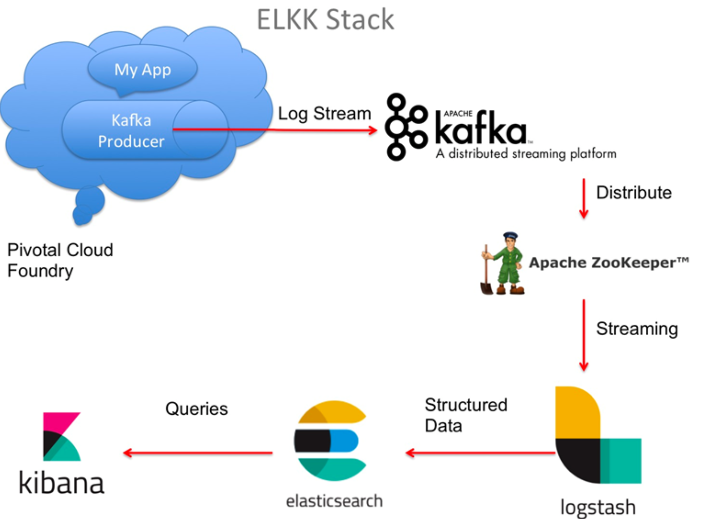

# kafka基础及安装部署

kafka基于2.0。

## 什么是kafka

kafka是一款分布式消息发布和订阅系统，它的特点是高性能、高吞吐量。

最早设计的目的是作为Linked In的活动流和运营数据的处理管道。这些数据主要是用来对用户做用户画像分析以及服务性能数据的一些监控。

所以kafka一开始设计的目标就是一个作为分布式、高吞吐量的消息系统，所以适合运用在大数据传输场景。kafka在我们主要了解kafka作为分布式消息中间件。还有数据流的处理这块没有涉及到。

## kafka的应用场景

由于kafka具有更好的吞吐量、内置分区、冗余及容错性的优点（kafaka每秒可以处理几十万消息），让kafka成为了一个很好的大规模消息处理应用解决方案。所以在企业级应用中，主要会应用于一下几个方面：

### 行为跟踪

kafka可以用于跟踪用户浏览页面、搜索及其他行为。通过发布-订阅模式实时记录到对应的topic中，通过后端大数据平台接入处理分析，并做更进一步的实时处理和监控。

### 日志搜集

日志搜集方面，有很多比较优秀的产品，比如Apache Flume，很多公司使用kafka代理日志聚合。日志聚合表示从服务器上搜集日志文件，然后放到一个几种的平台（文件服务器）进行处理。在实际应用开发中，我们应用程序的log都会输出到本地磁盘上，排查问题的话通过linux命令来搞定，如果应用程序组成了负载均衡集群，并且集群的机器有几十台以上，那么像通过日志快速定位到问题，就是很麻烦的事情了。所以一般都会做一个日志统一收集平台管理log日志用来快速查询重要应用的问题。所以很多公司的套路都是把应用日志几种到kafka上，然后分别导入到es和hdfs上，用来做实时检索分析和离线统计数据备份等。而另一方面，kafka本身又提供了很好的API来集成日志并且做日志收集



## kafka本身的架构

一个典型的kafka集群包含若干Producer（可以是应用节点产生的消息，也可以是通过Flume收集日志产生的事件），若干个Broker（kafka支持水平扩展）、若干个Consumer Group，以及一个zookeeper集群。kafka通过zookeeper管理集群配置及服务协同。Producer使用push模式将消息发布到broker，consumer通过监听使用pull模式broker订阅并消费消息。

多个broker协同工作，producer和consumer部署在各个业务逻辑中。三者通过zookeeper管理协调请求和转发。这样就组成了一个高性能的分布式消息帆布和订阅系统。


图上有一个细节是和其他MQ中间件不同的点，producer发送消息到broker的过程是push，而consumer从broker消费消息的过程是pull，主动去拉去数据，而不是broker把数据主动发送给consumer。

### 名词解释

#### Broker

kafka集群包含一个或多个服务器，这种服务器被称为broker。broker端不维护数据的消费状态，提升了性能。直接使用磁盘进行存储，线性读写，速度快：避免了数据在JVM内存和系统内存之间的复制，减少耗性能的创建对象和垃圾回收。

#### Producer

负责发布消息到kafka broker。

#### Consumer

消息消费者，向kafka broker读取消息的客户端，consumer从broker拉取（pull）数据并进行处理。

#### Topic

每条发布到kafka集群的消息都有一个类别，这个类别被称为topic。(物理上不同Topic的消息分开存储，逻辑上一个Topic的消息虽然保存于一个或多个broker上单用户值需指定消息的Topic即可生产或消费数据而不必关心数据存于何处。)

#### Partition

Partition是物理上的概念，每个Topic包含一个或多个Partition。

#### Consumer Group

每个Consumer属于一个特定的Consumer Group（可为每个Consumer指定group name ，若不指定group name则属于默认的Group）

#### Topic & Partition

Topic在逻辑上可以被认为是一个queue，每条消费都必须指定它的Topic，可以简单理解为必须指明把这条消息放进那个queue里。为了使得kafka的吞吐率可以线性提高，物理上把Topic分成一个或多个Partition，每个Partition在物理上对应一个文件夹，该文件夹下存储这个Partition的所有消息和索引文件。若创建topic1和topic2两个topic，且分别有13个和19个分区，则这个集群上会相应生成共32个文件夹（）


## Kafka的安装部署

### 单机环境安装

#### 下载kafka

https://archive.apache.org/dist/kafka/2.0.0/kafka_2.11-2.0.0.tgz 

#### 安装过程

安装过程非常简单，只需要解压就行，因为这个是编译好之后的可执行程序 

**tar -zxvf kafka_2.11-2.0.0.tgz 解压** 

#### 配置zookeeper

因为kafka依赖于zookeeper来做master选举一起其他数据的维护，所以需要先启动zookeeper节点 

kafka内置了zookeeper的服务，所以在bin目录下提供了这些脚本 

```sh
zookeeper-server-start.sh 
zookeeper-server-stop.sh
```

在config目录下，存在一些配置文件 

```shell
 zookeeper.properties 
 server.properties
```

所以我们可以通过下面的脚本来启动zk服务，当然，也可以自己搭建zk的集群来实现 

```shell
sh zookeeper-server-start.sh -daemon ../config/zookeeper.properties
```

#### 启动和停止kafka

修改server.properties，增加zookeeper的配置

```properties
zookeeper.connect=localhost:2181
```

启动kafka 

```shell
sh kafka-server-start.sh -damoen config/server.properties
```

停止kafka

```shell
sh kafka-server-stop.sh -daemon config/server.properties
```

### 集群环境安装

#### 环境准备

- 准备三台虚拟机
- 分别把kafka的安装包部署在3台机器上。

#### 修改配置

**以下配置修改均为server.properties** 

- 分别修改三台机器的servier.properties配置，同一个集群中的每个机器id必须唯一。

```properties
broker.id=0 
broker.id=1 
broker.id=2
```

**修改zookeeper的连接配置** 

```properties
zookeeper.connect=zookeeperHost:2181
```

**修改listeners配置** 

如果配置了listeners，那么消息生产者和消费者会使用listeners的配置来进行消息的收发，否则， 会使用localhost 

PLAINTEXT表示协议，默认是明文，可以选择其他加密协议 

```properties
listeners=PLAINTEXT://192.168.13.102:9092
```

**分别启动三台服务器** 

```shell
sh kafka-server-start.sh -daemon ../config/server.properties
```

## kafka的基本操作

### 创建topic

```shell
sh kafka-topics.sh --create --zookeeper localhost:2181 --replication-factor 1 -- partitions 1 --topic test
```

Replication-factor表示该topic需要在不同的broker中保存几份，这里设置成1，表示在两个broker中保存两份。

partition分区数

### 查看topic

```shell
sh kafka-topics.sh --list --zookeeper localhost:2181
```

### 查看topic属性

```shell
sh kafka-topics.sh --describe --zookeeper localhost:2181 --topic first_topic
```

### **消费消息** 

```shell
sh kafka-console-consumer.sh --bootstrap-server 192.168.13.106:9092 --topic test --from-beginning
```

### 发送消息

```shell
 sh kafka-console-producer.sh --broker-list 192.168.244.128:9092 --topic first_topic
```

