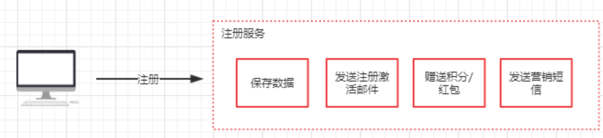
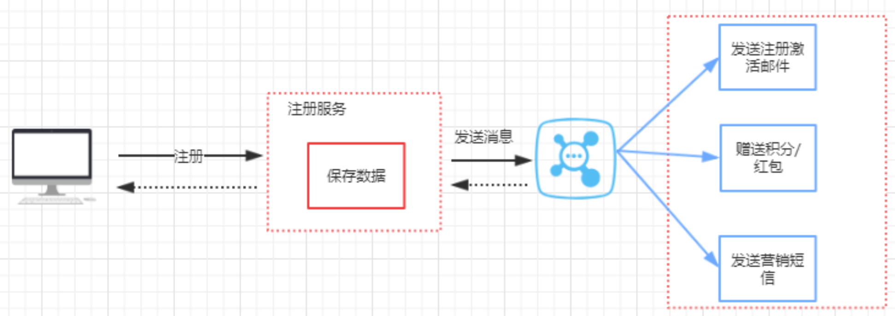
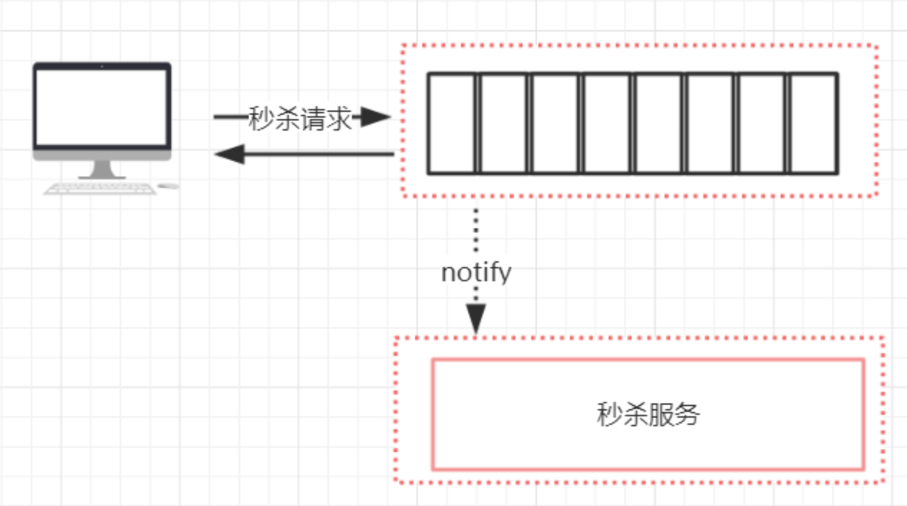
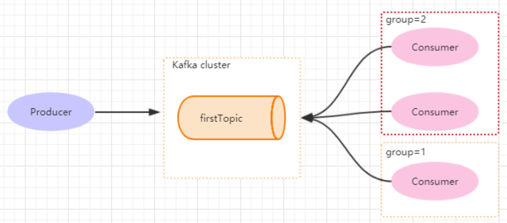
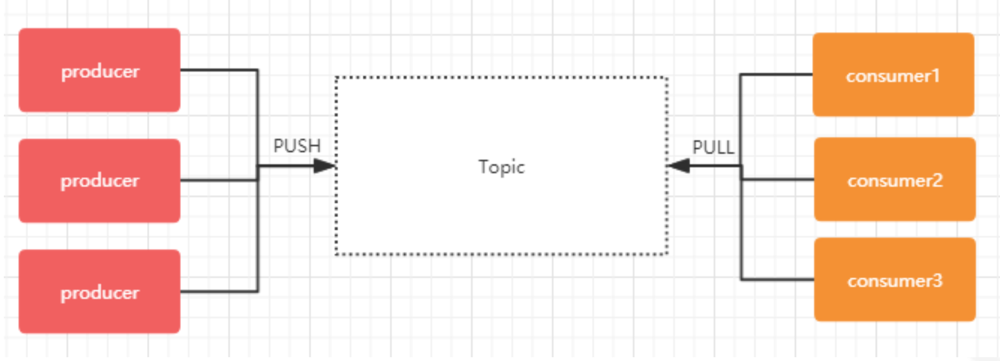
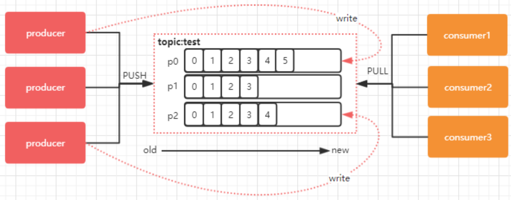
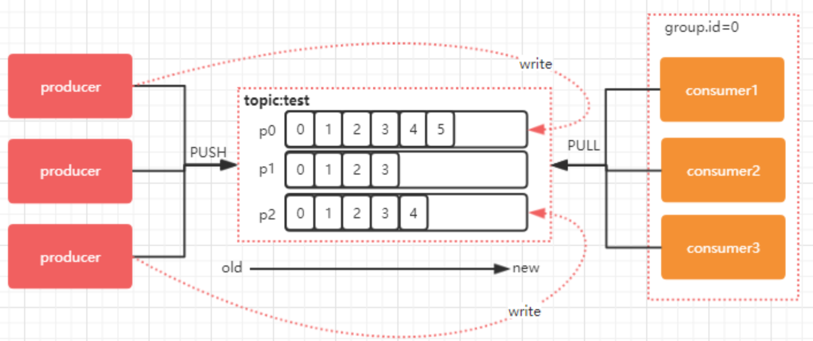
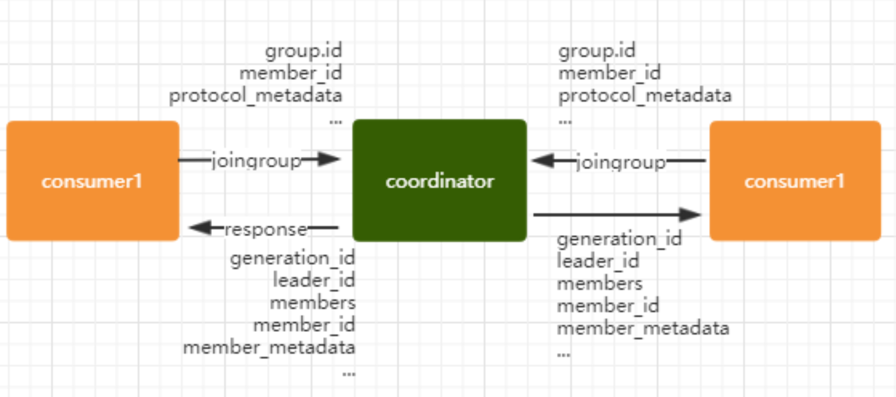
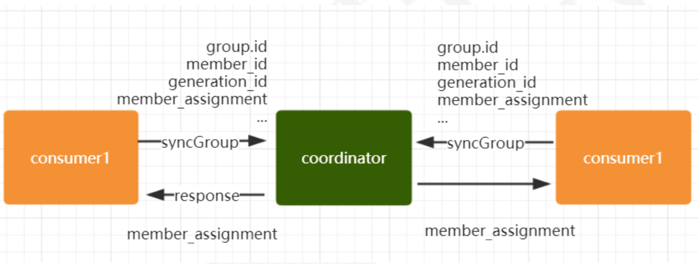
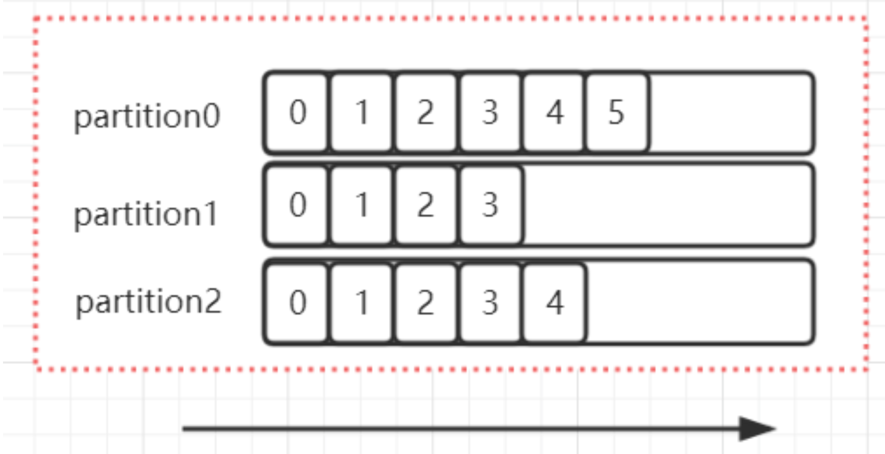

# kafka应用及原理

## 消息中间件能做什么

消息中间件主要解决的是分布式系统之间的消息传递问题，它能够屏蔽各种平台以及协议之间的特性，实现应用程序之间的协同。举个非常简单的例子，就拿一个电商平台的注册功能来简单分析一下，用户注册这一个服务，不单单只是insert一条数据到数据库里面就完事了，还需要发送激活邮件、发送新人红包或者积分、发送营销短信等一系列操作。假如说这里面的每个一个操作，都需要消耗1秒，那么整个注册过程就需要耗时4秒才能响应给用户。



但是我们从注册这个服务可以看到，每一个子操作都是相对独立的。同时，基于领域划分以后，发送激活邮件、发送营销短信、赠送积分及红包都属于不同的子域。所以我们可以对这些子操作进行异步化执行，类似于多线程并行处理的概念。

如果实现异步化呢？用多线程能实现吗？多线程淡然可以实现，只是，消息的持久化、消息的重发这些条件，多线程并不能满足。所以需要借助一些开源中间件来解决。而分布式消息队列就是一个非常好的解决办法，引入分布式消息队列以后，架构图就变成这样了（下图是异步消息队列的场景）。通过引入分布式队列，就能够大大提升程序处理的效率，并且还决绝了各个模块之间的耦合问题。在瞬时流量爆增的时候队列还能起到一定缓冲作用。可以做到削峰填谷的一个效果。



我们在来看一种场景，通过分布式消息队列来实现流量整形，比如在电商平台的秒杀场景下，流量会非常大。通过消息队列的方式是很好的缓解高流量的问题。



- 用户提交过来的请求，先写入到消息队列。消息队列是有长度的，如果消息队列长度超过指定长度，直接抛弃。
- 秒杀的具体核心处理业务，接收消息队列中消息进行处理，这里消息处理能力取决于消费端本身的吞吐量。

当然，消息中间件还有更多应用场景，比如在弱一致性事务中，可以采用分布式消息队列来实现最大能力通知方式来实现数据的最终一致性等等。

## Java中使用kafka进行通信

### 依赖

```xml
<dependencies>
    <dependency>
        <groupId>org.apache.kafka</groupId>
        <artifactId>kafka-clients</artifactId>
        <version>2.0.0</version>
    </dependency>
</dependencies>
```

### 发送端代码

```java
public class Producer extends Thread {
    private final KafkaProducer<Integer, String> producer;
    private final String topic;

    public Producer(String topic) {
        Properties properties = new Properties();

        properties.put(ProducerConfig.BOOTSTRAP_SERVERS_CONFIG, "192.168.1.51:9092,192.168.1.52:9092,192.168.1.53:9092");
        properties.put(ProducerConfig.CLIENT_ID_CONFIG, "practice-producer");
        properties.put(ProducerConfig.KEY_SERIALIZER_CLASS_CONFIG, IntegerSerializer.class.getName());
        properties.put(ProducerConfig.VALUE_SERIALIZER_CLASS_CONFIG, StringSerializer.class.getName());
        producer = new KafkaProducer<Integer, String>(properties);

        this.topic = topic;
    }

    @Override
    public void run() {
        int num = 0;
        while (num < 50) {
            String msg = "pratice test message:" + num;

            try {
                producer.send(new ProducerRecord<Integer, String>(topic, msg)).get();
                TimeUnit.SECONDS.sleep(2);
                num++;
            } catch (InterruptedException e) {
                e.printStackTrace();
            } catch (ExecutionException e) {
                e.printStackTrace();
            }

        }
    }

    public static void main(String[] args) {
        new Producer("test").start();
    }
}
```

### 消费端代码

```java
public class Consumer extends Thread {

    private final KafkaConsumer<Integer, String> consumer;

    private final String topic;

    public Consumer(String topic) {
        Properties properties = new Properties();

        properties.put(ConsumerConfig.BOOTSTRAP_SERVERS_CONFIG, "192.168.1.51:9092,192.168.1.52:9092,192.168.1.53:9092");

        properties.put(ConsumerConfig.GROUP_ID_CONFIG, "practice-consumer");
        // 设置offset自动提交
        properties.put(ConsumerConfig.ENABLE_AUTO_COMMIT_CONFIG, "true");
        // 自动提交时间间隔
        properties.put(ConsumerConfig.AUTO_COMMIT_INTERVAL_MS_CONFIG, "1000");
        properties.put(ConsumerConfig.SESSION_TIMEOUT_MS_CONFIG, "30000");
        properties.put(ConsumerConfig.KEY_DESERIALIZER_CLASS_CONFIG, IntegerDeserializer.class.getName());
        properties.put(ConsumerConfig.VALUE_DESERIALIZER_CLASS_CONFIG, StringDeserializer.class.getName());
        // 对于当前groupID来说，消息的offset从最早的消息开始消费
        properties.put(ConsumerConfig.AUTO_OFFSET_RESET_CONFIG, "earliest");

        consumer = new KafkaConsumer<Integer, String>(properties);

        this.topic = topic;

    }

    public static void main(String[] args) {
        new Consumer("test").start();

    }

    @Override
    public void run() {
        while (true) {
            consumer.subscribe(Collections.singleton(this.topic));

            ConsumerRecords<Integer, String> records = consumer.poll(Duration.ofSeconds(1));

            records.forEach(record -> {
                System.out.println("key:" + record.key() + ",value: " + record.value() + ",offset:" + record.offset());
            });
        }
    }

}
```

### 异步发送

kafka对于消息的发送，可以支持同步和异步，前面演示的案例中，我们是基于同步发送消息。同步会需要阻塞，而异步不需要等待阻塞的过程。

从本质上来说，kafka都是采用异步的方式来发送消息到broker，但是kafka并不是每次发送消息都会直接发送到broker上，而是把消息放到了一个发送队列中，然后通过一个后台线程不断从队列取出消息进行发送，发送成功后悔触发callback。**kafka客户端会积累一定量的消息后统一组装成一个批量消息发送出去，触发条件是batch.size和linger.ms。**

而同步发送的方法，无非就是通过future.get()来等待消息发送的返回结果，但是这种方法会严重影响消息发送的性能。

```java
public class AsynchronizationProducer extends Thread {
    private final KafkaProducer<Integer, String> producer;
    private final String topic;

    public AsynchronizationProducer(String topic) {
        Properties properties = new Properties();

        properties.put(ProducerConfig.BOOTSTRAP_SERVERS_CONFIG, "192.168.1.51:9092,192.168.1.52:9092,192.168.1.53:9092");
        properties.put(ProducerConfig.CLIENT_ID_CONFIG, "practice-producer");
        properties.put(ProducerConfig.KEY_SERIALIZER_CLASS_CONFIG, IntegerSerializer.class.getName());
        properties.put(ProducerConfig.VALUE_SERIALIZER_CLASS_CONFIG, StringSerializer.class.getName());
        // 默认大小是16384byte,也就是16kb， 意味着当一批消息大小达到指定的batch.size的时候会统一发送
        properties.put(ProducerConfig.BATCH_SIZE_CONFIG, "16384");
        properties.put(ProducerConfig.LINGER_MS_CONFIG, "1");
        producer = new KafkaProducer<Integer, String>(properties);

        this.topic = topic;
    }

    @Override
    public void run() {
        int num = 0;
        while (num < 50) {
            String msg = "pratice test message:" + num;

            producer.send(new ProducerRecord<Integer, String>(topic, msg), new Callback() {
                @Override
                public void onCompletion(RecordMetadata metadata, Exception exception) {
                    System.out.println("callback:" + metadata.offset()+ "->" + metadata.partition());
                }
            });
            num++;
        }
    }

    public static void main(String[] args) throws IOException {
        new AsynchronizationProducer("test").start();
        System.in.read();
    }
}
```

#### batch.size

生产者发送多个消息到broker上的同一个分区时，为了减少网络请求带来的性能开销，通过批量的方式来提交消息，可以通过这个参数来控制批量提交的字节数大小，默认大小是16384byte，也就是16kb，意味着当一批消息大小达到指定batch.size的时候回统一发送。

#### linger.ms

Producer默认会把两次发送时间间隔内手机到的所有Request进行一次聚合然后在发送，以此提高吞吐量，而linger.ms就是为每次发送到broker的请求增加一些delay，以此来聚合更多的Message请求。这个有点像TCP里面的Nagle算法，在TCP协议的传输中，为了减少大量小数据包的发送，采用了Nagle算法，也就是基于小包的等-停协议。

batch.size和linger.ms这两个参数是kafka性能优化的关键参数，我们发现batch.size和linger.ms这两者的作用是一样，如果两个都配置了，那么怎么工作的呢？实际上，当两者都配置的时候，只要满足其中一个要求，就会发送请求到broker上。

## 基础配置分析

### group.id

Consumer group是kafka提供的可扩展且具有容错性的消费者机制。既然是一个组，那么组内必然可以有多个消费者或消费者实例（consumer instance），它们共享一个公共的ID，即Group ID。组内所有消费者协调在一起来消费订阅主题（subscribed topics）的所有分区（partition）。当然，每个分区只能由同一个消费组内的一个consumer来消费。如下图所示，分别有三个消费者，属于两个不同的group，那么对于fistTopic这个Topic来说，这两个的消费者都能同时消费这个topic中的消息，对于此时的架构来说，这个firstTopic就类似于ActiveMQ中的topic概念。



如下图所示，如果3个消费者都属于同一个 group，那么此时firstTopic就是一个Queue的概念 


### enable.auto.commit

消费者消费消息以后自动提交，只有当消息提交以后，该消息才不会被再次接受到，还可以配合auto.commit.interval.ms控制自动提交的频率。

当然，也可以通过consumer.conmitSync()的方式实现手动提交。

### auto.offset.reset

这个参数是针对新的groupId中的消费者而言的，当有新groupId的消费者来消费指定topic，对于该参数的配置，会有不同的语义：

- auto.offset.reset=latest情况下，新的消费者将会从其他消费者最后消费的offset处开始消费Topic下的消息。
- auto.offset.reset=earliest情况下，新的消费者会从该topic最早的消息开始消费。
- auto.offset.reset=none情况下，新的消费者加入以后，由于之前不存在offset，则会直接抛出异常。

### max.poll.records

此设置限制每次调用poll返回的消息数，这样可以更容易的预测每次poll间隔要处理的最大值。通过调整此值，可以减少poll间隔。

## SpringBoot+kafka

Spring Boot的版本和kafka的版本，有一个对照表，如果没有按照正确的版本来引入，那么会存在版本问题导致ClassNotFound的问题，具体请参考：https://spring.io/projects/spring-kafka 

### jar包依赖

```xmL
<dependency>
    <groupId>org.springframework.kafka</groupId>
    <artifactId>spring-kafka</artifactId>
    <version>2.3.0.RELEASE</version>
</dependency>
```

### Consumer

```java
@Component
public class MyKafkaConsumer {

    @KafkaListener(topics = {"test","first_topic"})
    public void listener(ConsumerRecord record){
        Optional msg=Optional.ofNullable(record.value());
        System.out.println("消息接收");
        if(msg.isPresent()){
            System.out.println(msg.get());
        }
    }
}
```

### Producer

```java
@Component
public class MyKafkaProducer {
    @Autowired
    private KafkaTemplate<Integer, String> kafkaTemplate;


    public void send() {
        kafkaTemplate.send("test", 1, "msgData");
        System.out.println("消息发送完成");
    }
}
```

### application配置

```properties
spring.kafka.bootstrap-servers=192.168.1.51:9092,192.168.1.52:9092,192.168.1.53:9092
spring.kafka.producer.key-serializer=org.apache.kafka.common.serialization.IntegerSerializer
spring.kafka.producer.value-serializer=org.apache.kafka.common.serialization.StringSerializer


spring.kafka.consumer.group-id=consumer-groupId
spring.kafka.consumer.auto-offset-reset=earliest
spring.kafka.consumer.enable-auto-commit=true
spring.kafka.consumer.key-deserializer=org.apache.kafka.common.serialization.IntegerDeserializer
spring.kafka.consumer.value-deserializer=org.apache.kafka.common.serialization.StringDeserializer
```

### 测试

```java
public static void main(String[] args) throws InterruptedException {
    ConfigurableApplicationContext ctx
            = SpringApplication.run(ProducerApplication.class, args);

    MyKafkaProducer producer = ctx.getBean(MyKafkaProducer.class);

    for (int i = 0; i < 10; i++) {
        producer.send();

        TimeUnit.SECONDS.sleep(2);
    }
}
```


## Producer原理分析

从前面的整个演示过程来看，只要不是超大规模的使用kafka，那么基本上没什么太大问题，否则，对于kafka本身的运维的挑战会很大，同时，针对每一个参数的调优也显得很总要。

据我了解，快手在使用kafka集群规模是挺大的，它们在19年的开发者大会上有提到，`总机器数大概2000台。30多个集群。topic有12000个。一共有大概20万TP（topic partition）。每天总处理的消息数超过4万亿条。峰值超过1亿条。

[文章连接](https://www.infoq.cn/article/Q0o*QzLQiay31MWiOBJH)

技术的使用是最简单的，要想掌握核心价值，就势必要了解一些原理，我们从最基础的消息通讯的原理着手。

### 关于Topic和Partition

#### Topic

在kafka中，topic是一个存储消息的逻辑概念，可以认为是一个消息集合。每条消息发送到kafka集群的消息都有一个类别。物理上来说，不同的topic的消息是分开存储的。

每个topic可以有多个生产者向它发送消息，也可以有多个消费者去消费其中的消息。



#### Partition

每个topic可有划分多个分区（每个Topic至少有一个分区），同一个topic下的不同分区包含的消息是不同的。每个消息在被添加到分区时，都会被分配一个offset（称之为偏移量），它是消息在分区中的位置编号，kafka通过offset保证消息在分区的的顺序，offset的顺序不跨分区，即kafka只保证在同一个分区内的消息是有序的。

下图中，对于名字为test的topic，做了3个分区，分别是：p0、p1、p2。



每一条消息发送到broker时，会根据partition的规则选择存储到哪一个partition。如果partition规则设置合理，那么所有的消息会均匀分布在不同的partition中，这样就有点类似数据库的分库分表的概念，把数据做了分片处理。

#### Topic&Partition的存储

Partition是以文件的形式存储在文件系统中，比如创建一个名为firstTopic的topic，其中有个3个partition，那么在kafka的数据目录（/tmp/kafka-log）中就有3个目录，firstTopic-0-3，命名规则是`<topic_name>-<partion_id>`

```shell
sh kafka-topics.sh --create --zookeeper 192.168.1.4:2181 --replication-factor 1 --partitions 3 --topic firstTopic 
```

### 消息分发

#### kafka的消息分发策略

消息是kafka中最基本的数据单元，在kafka中，一条消息有key、value两部分构成，在发送一条消息时，我们可以指定这个key，那么producer会根据key和partition机制来判断当前这条消息应该发送并存储到哪个partition中。我们可以根据需要进行扩展producer的partition机制。

#### 消息默认的分发机制

默认情况下，kafka采用的是hash取模的分区算法。如果Key为null，则会随机分配一个分区。这个随机是在这个参数`metadata.max.age.ms`的事件范围内选择一个。对于这个时间段内，如果key为null，则只会发送到唯一的分区。这个值默认情况下是10分钟更新一次。

关于metadata，简单的理解绝世Topic/Partition和broker的映射关系，每一个topic的每一个Partition，需要知道对应的broker列表是什么，leader是谁、follower是谁。这些信息都是存储在Metadata这个类里面。

#### 自定义的分发策略

##### 代码演示

###### 自定义Partitioner

```java
public class MyPartitioner implements Partitioner {
    private Random random = new Random();

    @Override
    public int partition(String topic, Object key, byte[] keyBytes, Object value, byte[] valueBytes, Cluster cluster) {
        // 获取集群中指定topic的所有分区信息
        List<PartitionInfo> partitionInfoList = cluster.partitionsForTopic(topic);
        int numOfPartition = partitionInfoList.size();
        int partitionNum = 0;

        // key没有值
        if (key == null) {
            partitionNum = random.nextInt(numOfPartition); // 随机指定分区
        } else {
            partitionNum = Math.abs(key.hashCode()) % numOfPartition;
        }

        System.out.println("key:" + key + ",value:" + value + "->send to partition:" + partitionNum);

        return partitionNum;
    }
}
```

###### Producer代码添加自定义分区

```java
public class Producer extends Thread {
    private final KafkaProducer<Integer, String> producer;
    private final String topic;

    public Producer(String topic) {
        Properties properties = new Properties();

        properties.put(ProducerConfig.BOOTSTRAP_SERVERS_CONFIG, "192.168.1.51:9092,192.168.1.52:9092,192.168.1.53:9092");
        properties.put(ProducerConfig.CLIENT_ID_CONFIG, "practice-producer");
        properties.put(ProducerConfig.KEY_SERIALIZER_CLASS_CONFIG, IntegerSerializer.class.getName());
        properties.put(ProducerConfig.VALUE_SERIALIZER_CLASS_CONFIG, StringSerializer.class.getName());
        // 自定义Partitioner
        properties.put(ProducerConfig.PARTITIONER_CLASS_CONFIG, MyPartitioner.class.getName());
        producer = new KafkaProducer<Integer, String>(properties);

        this.topic = topic;
    }

    @Override
    public void run() {
        int num = 0;
        while (num < 50) {
            String msg = "pratice test message:" + num;

            try {
                producer.send(new ProducerRecord<Integer, String>(topic, msg)).get();
                TimeUnit.SECONDS.sleep(2);
                num++;
            } catch (InterruptedException e) {
                e.printStackTrace();
            } catch (ExecutionException e) {
                e.printStackTrace();
            }

        }
    }

    public static void main(String[] args) {
        new Producer("test").start();
    }
}
```

#### 消费端如何消费指定的分区

通过下面的代码，就可以消费指定该Topic下的0号分区。其他分区的数据就无法接收。

```java
// 消费指定分区的时候，不需要在订阅
//consumer.subscribe(Collections.singleton(this.topic));
TopicPartition topicPartition=new TopicPartition(topic,0);

consumer.assign(Arrays.asList(topicPartition));
```

## Consumer原理分析

### Kafka消息消费原理演示

在实际生产过程中，每个Topic都会有多个partitions，多个partitions的好处在于，一方面能够对broker上面的数据进行分片有效减少了消息的容量从而提升io性能。另外一方面，为了提高消费端的消费能力，一般会通过多个Consumer区消费同一个Topic，也就是消费端的负载均衡机制，我们接下来介绍这一部分，在多个Partition以及多个Consumer的情况下，消费者是如何消费消息的。

在我们之前的示例和介绍中，我们知道Kafka存在Consumer Group的概念，也就是group.id一样的consumer，这些Consumer属于一个Consumer Group，组内所有消费者协调在一起来消费订阅主题的所有分区。当然每一个分区只能由同一个消费组内的consumer来消费，那么同一个consumer group里面的consumer是怎么去分配该消费那个分区里的数据的呢？如下图所示，3个分区，3个消费者，那么那个消费者消费那个分区？



对于上面这个图来说，这3个消费者会分别消费test这个topic的3个分区，也就是每个consumer消费一个partition。

如果是2个consumer消费3个partition：consumer1会消费partition0/partition1分区、consumer2会消费partition2分区 

如果是4个consumer消费3个partition：仍然只有3个consumer对应3个partition，其他的consumer无法消费消息 

### consumer和partition的数量建议

1. 如果Consumer比partition多，是浪费，因为kafka的设计是在一个partition上是不允许并发的，所以consumer数不要大于partition数。
2. 如果Consumer比partition少，一个consumer会对应多个partition，这里需要合理分配consumer数partition数，否则会导致partition里面的数据被取的不均匀。最好partition数目是consumer的整数倍，所以partition数目很重要，不如取24，就很容易设定consumer的数目。
3. 如果consumer从多个partition读到数据，不保证数据间的顺序性，kafka值保证一个partition上数据是有序的，但多个partition，根据读取的顺序会有不同。
4. 增减consumer，broker，partition，会导致rebalance，所以rebalance后consumer对应的partition会发生变化。

#### 什么时候触发rebalance？

当出现一下几种情况时，kafka会进行一次分区分配操作，也就是kafka consumer的rebalance：

1. 同一个consumer group内新增了消费者
2. 消费者离开当前所属的consumer group，比如主动停机或者宕机
3. topic新增了分区（也就是分区数量发生了变化）。

kafka Consumer的rebalance机制规定了一个consumer group下的所有consumer如何达成一致来分配订阅topic的每个分区。kafka对于分配策略这块，提供了可插拔的实现方式，也就是说我们还可以创建自己的分配机制。

### kafka的分区分配策略 

在kafka中，存在三种分区分配策略，一种是Range（默认）、另一种是RoundRobin（轮询）、StickyAssignor（粘性）。在消费端中的ConsumerConfig中，通过这个属性来指定分区分配策略。

```java
 public static final String PARTITION_ASSIGNMENT_STRATEGY_CONFIG = "partition.assignment.strategy";
```

#### RangeAssignor

Range策略是对每个主题而言的，首先对同一主题里面的分区按照序号进行排序，并对消费者按照字母顺序进行排序。

> 假设n= 分区数 / 消费者数量
>
> m=分区数%消费者数量
>
> 那么前m个消费者每个分配n+1个分区，后面的（消费者数量-m）个消费者每个分配n个分区。

假设我们有10个分区，3个消费者。排序后的分区将会是0，1，2，3，4，5，6，7，8，9。消费者线程排完序将会是C1-0，C2-0，C3-0。然后将partitions的个数除于消费者线程的总数来决定每个消费者线程消费几个分区。如果除不尽，那么前面几个消费者线程将会多消费一个分区。在我们的例子里面，我们有10个分区，3个消费者线程， 10/3=3，而且除不尽，那么消费者线程C1-0将会多消费一个分区。

结果是这样的：

C1-0将消费0，1，2，3分区

C2-0将消费4，5，6分区

C3-0将消费7，8，9分区

假如我们有11个分区，那么最后分区分配的结果看起来是这样的：

C1-0将消费0，1，2，3分区

C2-0将消费4，5，6，7分区

C3-0将消费8，9，10分区

假如我们有2个主题(T1和T2)，分别有10个分区，那么最后分区分配的结果看起来是这样的:*

C1-0 将消费 T1主题的 0，1，2，3 分区以及 T2主题的 0，1，2，3分区 

C2-0 将消费 T1主题的 4，5，6 分区以及 T2主题的 4，5，6分区 

C3-0 将消费 T1主题的 7，8，9 分区以及 T2主题的 7，8，9分区 

可以看出，C1-0 消费者线程比其他消费者线程多消费了2个分区，这就是Range strategy的一个很明显的弊端。

#### RoundRobinAssignor（轮询分区）

轮询分区策略是把所有Partition和所有consumer线程都列出来，然后按照hashcode进行排序，最后通过轮询算法分配partition给消费线程。如果所有consumer实例的订阅是相同的，那么partition会均匀分布。

在我们的例子里面，加入按照hashcode排序完的topic-partitions组依次为：T1-5, T1-3, T1-0, T1-8, T1- 2, T1-1, T1-4, T1-7, T1-6, T1-9，我们消费者线程排序为：C1-0, C1-1, C2-0, C2-1 ，最后分区分配的结果为：

C1-0  将消费 T1-5, T1-2, T1-6 分区; 

C1-1  将消费 T1-3, T1-1, T1-9 分区; 

C2-0  将消费 T1-0, T1-4 分区; 

C2-1  将消费 T1-8, T1-7 分区; 


使用轮询分区策略必须满足两个条件：

1. 每个主题的消费者实例具有相同数量的流。

2. 每个消费者订阅的主题必须是相同的。

#### StrickyAssignor分配策略

kafka在0.11.x版本支持了StrickyAssignor, 翻译过来叫粘滞策略，它主要有两个目的：

-  分区的分配尽可能的均匀。
-  分区的分配尽可能和上次分配保持相同。

当两者发生冲突时，第一个目标优先于第二个目标。鉴于者两个目标，stickyAssignor分配策略的具体实现要比RangeAssignor和RoundRobinAssign这两种分配策略要复杂的多，假设我们有这样一个场景：

> 假设消费组有3个消费者：C0,C1,C2,它们分别订阅了4个Topic（t0,t1,t2,t3），并且每个主题有两个分区（p0,p1），也就是，整个消费组订阅了8个分区：（t0p0、t0p1、t1p0、t1p1、t2p0、t2p1、t3p0、t3p1）那么最终分配的场景结果为：
>
> C0: t0p0、t1p1 、 t3p0
>
> C1: t0p1、t2p0 、 t3p1
>
> C2: t1p0、t2p1 
>
> 这种分配方式有点类似于轮询策略，但实际上并不是，因为假设这个时候，C1这个消费者挂了，就势必会造成重新分区（rebalance），如果是轮询，那么结果应该是：
>
> C0: t0p0、t1p0、t2p0、t3p0
>
> C2: t0p1、t1p1、t2p1、t3p1 
>
> 然后，strickyAssignor它是一种粘滞策略，所以它会满足`分区的分配尽可能和上次分配保持相同`，所以分配结果应该是：
>
> C0: t0p0、t1p1、t3p0、t2p0
>
> C2: t1p0、t2p1、t0p1、t3p1 
>
> 也就是说，C0和C2保留了上一次的分配结果，并且办原来C1的分区分配给了C0和C2。这种策略的好处是使得分区发生变化时，由于分区的”粘性“，酱烧了不必要的分区移动。

#### **coordinator** 

Kafka提供了一个角色：coordinator来执行对于consumer group的管理，Kafka提供了一个角色：coordinator来执行对于consumer group的管理，当consumer group的第一个consumer启动的时候，它会去和kafka确定岁是它们组的coordinator。之后该group内的所有成员都会和该coordinator进行协调通信。

##### 如何确定coordinator

consumer group如何确定自己的coordinator是谁呢？消费者向kafka集群中的任意一个broker发送一个GroupCoordinatorReque请求，服务端会返回一个负载最小的broker节点的id，并将broker设置为coordinator。

在rebalance之前，需要保证coordinator是已经确定好了的，整个Rebalance的过程分为两个步骤，Join和Sync。

##### JoinGroup的过程

**Join**:表示加入到consumer group 中，在这一步中，所有的成员都会向coordinator发送joinGroup的请求。一旦所有成员都发送了joinGroup请求，那么coordinator会选择一个consumer担任一个leader角色。并把组成员信息和订阅信息发送给消费者。

Leader选举算法比较简单，如果消费组内没有leader，那么第一加入消费组的消费者就是消费者Leader，如果这个时候Leader消费者退出了消费组，那么重新选举一个Leader，这个选举和你随意，类似于随机算法。



protocol_metadata：序列化后的消费者的订阅信息。

leader_id：消费组中的消费者，coordinator会选择一个作为Leader，对应的就是memeber_id。

memeber_metadata：对应消费者的订阅信息。

memebers：consumer group中全部的消费者订阅信息。

generation_id：年代信息，类似zookeeper的的epoch是一样的，对于每一轮rebalance，generation_id都会递增。主要用拉力保护consumer group。隔离无效的offset提交。也就是上一轮的consumer成员无法提交offset到新的consumer group中。

每个消费者都可以设置自己的分区策略，对于消费组而言，会从各个消费者上报过来的分区分配策略中选举一个彼此都赞同的策略来实现整体的分区分配，这个”赞同“的规则是，消费组内的各个消费者会通过投票来决定：

- 在join group阶段，每个consumer都会把自己支持的分区分配策略发送到coordinator。
- coordinator收集到所有消费者的分配策略，组成一个候选集。
- 每个消费者需要从候选集里找出一个自己支持的策略，并且为这个策略投票。
- 最终计算候选集中各个策略的选票数，票数最多的就是当前消费组的分配策略。

##### Synchronizing Group State阶段

完成分区分配之后，就进入了Synchronizing Group State阶段，主要逻辑是向GroupConsumer发送SyncGroupRequest请求，并且处理SyncGroupResponse响应，简单来说，就是leader将消费者对应的partition分配方案同步给consumer group中的所有consumer。



每个消费者都会向coordinator发送syncGroup请求，不过只有了Leader节点会发送分配方案，其他消费者只是打打酱油而已。当Leader把方案发给coordinator以后，coordinator会把结果设置到SyncGroupResponse中。这样所有成员都知道自己应该消费那个分区。

Consumer group得分区分配方案是在客户端执行的！Kafka将这个权利下方给客户端主要是因为这样做可以有更好的灵活性。

#### 总结

总结一下consumer group Rebalance的过程：

- 对于每个consumer group子集，都会在服务端对应一个GroupCoordinator进行管理，GroupCoordinator会在zookeeper上添加watcher，当消费者加入或者退出consumer group时，会修改zookeeper上保存的数据，从而触发GroupCoordinator开始Rebalance操作。
- 当消费者准备加入某个Consumer group或者GroupCoordinator发生故障转移时，消费者并不知道GroupCoordinator在网络中的位置，这个时候就需要确定GroupCoordinator，消费者会向集群中的任意一个broker节点发送ConsumerMetadataRequest请求，收到请求的broker会返回一个response作为响应，其中包含管理当前ConsumerGroup的GroupCoordinator。
- 消费者会根据broker的返回信息，连接到GrouCoordinator，并且发送HeartbeatRequest，发送心跳的目的是要告诉GroupCoordinator这个消费者是正常在线的。当消费者在指定时间内没有发送心跳请求，则GroupCoordinator会触发Rebalance操作。
- 发起join group请求，两种情况：
  - 如果GroupCoordinator返回的心跳包数据包含异常，说明GroupCoordinator因为前面说的几种情况导致Rebalance操作，那这个时候，consumer会发起join group请求。
  - 新加入到consumer group的consumer确定好了GroupCoordinator以后消费者回想GroupCoordinator发起join group请求，GroupCoordinator收集全部消费者信息之后，来确认可用的消费者，并从中选取一个消费者成为group leader。并把相应的信息（分区分配策略、Leader_id、.....）封装成一个response返回给所有消费者，但是只有group leader会受到当前Consumer group中的所有消费者信息。当消费者确定自己是group leader后，会根据消费者的信息以及选定分区分配策略进行分区分配。
- 接着进入Synchronizing Group State阶段，每个消费者会发送SyncGroupRequest请求到GroupCoordinator，但是只有Group Leader的请求会存在分区分配结果，GroupCoordinator会根据Group Leader的分区分配结果形成SyncGroupResponse返回给所有的consumer。
- consumer根据分配结果，执行响应的操作。

到这里为止，我们已经知道了消息的发送分区策略，以及消费者的分区消费策略和Rebalance。对于应用层面来说，还有一个最重要的东西没有介绍，就是offset，它类似一个游标，表示当前消费的消息的位置。

#### offset

前面在介绍partition的时候，提到过offset，每个topic可以划分多个分区（每个Topic至少有一个分区），同一topic下不同分区包含的消息是不同的。每个消息在被添加到分区时，都会被分配一个offset（称之为偏移量），它是消息在此分区中的唯一编号，kafka通过offset保证消息在分区内的熟悉怒，offset的顺序不跨分区，即kafka值保证在同一个分区内的消息是有序的。对于应用层的消费来说，每次消费一个消息并且提交以后，会保存当前消费到的最近的一个offset。那么offset保存在哪里？



##### offset在哪里维护？

**在kafka中，提供了一个consumer_offset_*的一个topic，把offset信息写入到这个topic中。**consumser_offset——保存了每个consumer group某一时刻提交的offset信息。

__consumer_offsets默认有50个分区。

根据前面我们演示的案例，我们设置了一个KafkaConsumerDemo的groupid。首先我们需要找到这个 consumer_group保存在哪个分区中 

```java
properties.put(ConsumerConfig.GROUP_ID_CONFIG,"KafkaConsumerDemo");
```

计算公式 

- Math.abs(“groupid”.hashCode())%groupMetadataTopicPartitionCount ; 由于默认情况下 groupMetadataTopicPartitionCount有50个分区，计算得到的结果为:35, 意味着当前的 consumer_group的位移信息保存在__consumer_offsets的第35个分区 

- 执行如下命令，可以查看当前consumer_goup中的offset位移提交的信息 

  ```shell
  kafka-console-consumer.sh --topic __consumer_offsets --partition 35 -- bootstrap-server 192.168.1.51:9092,192.168.1.52:9092,192.168.1.53:9092 --formatter 'kafka.coordinator.group.GroupMetadataManager$OffsetsMessageFormatter'
  ```

  从输出结果中，我们就可以看到KafkaConsumerDemo这个topic的offset的位移日志。

