# kafka分区副本及消息存储原理

## 分区副本机制

我们已经知道kafka的每个topic都可以分为多个Partition，并且多个Partition会均匀分布在集群的各个节点下。虽然这种方式能够有效的对数据进行分片，但是对于每个partition来说，都是单点的，当其中一个partition不可用的时候，那么这部分消息就没办法消费。所以kafka为了提高partition的可靠性而提供了副本的概念（Replica），通过副本机制来实现冗余备份。

每个分区可以有多个副本，并且在副本集合中会存在一个Leader的副本，所有的读写请求都是有leader副本来进行处理。剩余的其他副本都作为follower副本，follower副本会从leader副本同步消息日志。这个有点类似zookeeper中leader和follower的概念，但是具体的事件方式还是有比较大的差异。所以我们可以认为，副本集会存在一主多从的关系。

一般情况下，同一个分区的多个副本会被均匀分配到集群中的不同broker上，当leader副本所在的broker出现故障后，可以重新选举新的leader副本继续对外提供服务。通过这样的副本机制来提高kafka的可用性。

### 创建一个带副本机制的topic

通过下面命令去创建带2个副本的topic

```shell
sh kafka-topics.sh --create --zookeeper 192.168.1.4:2181 --replication-factor 2 --partitions 3 --topic secondTopic
```

然后我们可以在`/tmp/kafka-log`路径下看到对应topic的副本信息了。我们通过一个图形的方式来表达。

针对secondTopic这个topic的3个分区对应的3个副本

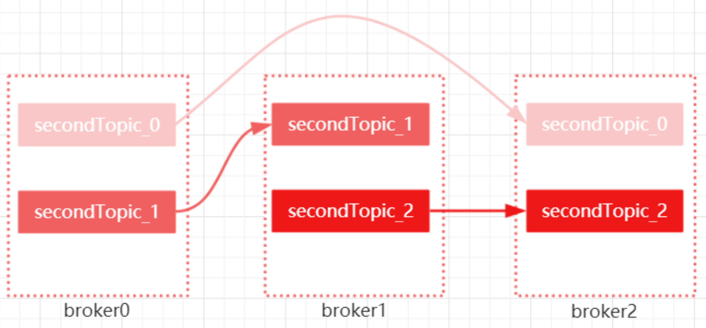

**如何知道那个各个分区中对应的leader是谁呢?** 

在zookeeper服务器上，通过如下命令去获取对应分区的信息，比如下面这个是获取secondTopic第一个分区的状态信息。

get /brokers/topics/secondTopic/partitions/1/state 

{"controller_epoch":12,"leader":0,"version":1,"leader_epoch":0,"isr":[0,1]} 

或者通过这个命令`sh kafka-topics.sh --zookeeper 192.168.1.4:2181 --describe --topic test_partition` 

leader表示当前分区的leader是那个broker-id。下图中。绿色线条的表示该分区中的leader节点。其他 节点就为follower 

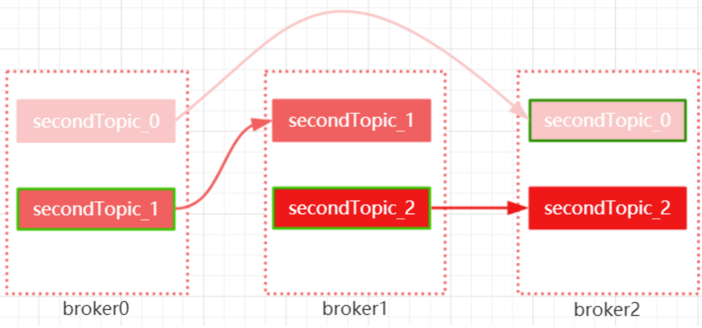

**需要注意的是，kafka集群中的一个broker中最多只能有一个副本，leader副本所在的broker节点的 分区叫leader节点，follower副本所在的broker节点的分区叫follower节点**。

### 副本的leader选举

kafka提供了数据复制算法保证，如果leader副本所在的broker节点宕机或者出现故障，或者分区的leader节点发生故障，这个时候怎么处理呢？

kefka必须要保证从follwer副本哪种选择一个新的leader副本。那么kafka是如何实现选举的呢？要了解leader选举，我们需要了解几个概念。

kafka分区下有可能有很多副本（replica）用于实现冗余，从而进一步实现高可用。副本根据角色的不同可分为3类：

- Leader副本：响应clients端读写请求的副本。
- follower副本：被动的备份leader副本中的数据，不能响应clients端的读写请求。
- ISR副本：包含了leader副本和所有与leader副本保持同步的follower副本——如何判定是否与leader同步后面会提到，每个kafka父辈对象都有两个重要的属性：LEO和HW。注意是所有的副本，而不只是leader副本。
- LEO：即日志末端位移（log end offset），记录了该副本底层日志（log）中下一条消息的位移值。注意是下一条消息！也就是说，如果LEO=10,那么表示该副本保存了10条消息，位移值范围是[0,9]。另外，leader LEO和follower LEO的更新是有区别的。后面详细说。
- HW：即上面提到的水位值。对于同一副本对象而言，其HW值不会大于LEO值。小于等于HW值的所有消息都被认为是”已备份“的（repllicated）。同理，leader副本和follower副本的HW更新是有却别的。

> 从生产者发出的一条消息首先会被写入分区的leader 副本，不过还需要等待ISR集合中的所有follower副本都同步完之后才能被认为已经提交，之后才会更新分区的HW, 进而消费者可以消费到这条消息。 

#### 副本协同机制

刚刚提到了，消息的读写操作都只会由leader节点来接收和处理。follower副本只负责同步数据以及当 leader副本所在的broker挂了以后，会从follower副本中选取新的leader。 

写请求首先由Leader副本处理，之后follower副本会从leader上拉取写入的消息，这个过程会有一定的延迟，导致follower副本中保存的消息略少于leader副本，但是只要没有超出阈值都可以容忍。如果一个follower副本出现异常，比如宕机、网络断开等原因长时间没有同步到消息，那这个时候， leader就会把它踢出去。kafka通过ISR集合来维护一个分区副本信息。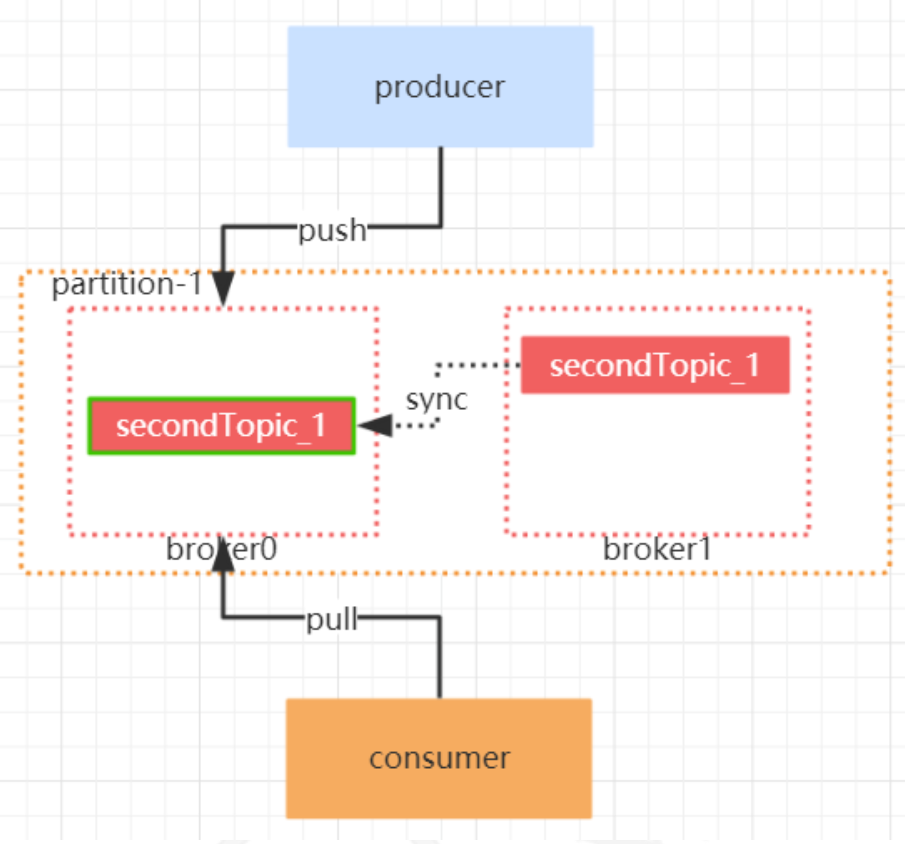

一个新leader被选举并被接受客户端的消息成功写入。Kafka确保从同步副本列表中选举一个副本为 leader。leader负责维护和跟踪ISR(in-Sync replicas ， 副本同步队列)中所有follower滞后的状态。当producer发送一条消息到broker后，leader写入消息并复制到所有follower。消息提交之后才被成功复制到所有的同步副本。 

#### ISR

ISR表示目前`可用且消息量与leader相差不多的副本集合，这是整个副本集合的一个子集`。怎么去理解可用和相差不多这两个词呢?具体来说，ISR集合中的副本必须满足两个条件:

1. 副本所在节点必须维持着与zookeeper的连接 

2. 副本最后一条消息的offset与leader副本的最后一条消息的offset之间的差值不能超过指定的阈值 (replica.lag.time.max.ms) replica.lag.time.max.ms:如果该follower在此时间间隔内一直没有追 上过leader的所有消息，则该follower就会被剔除isr列表 

ISR数据保存在Zookeeper的 `/brokers/topics/<topic>/partitions/<partitionId>/state `节点中。

follower副本把leader副本LEO之前的日志全部同步完成时，则认为follower副本已经追赶上了leader 副本，这个时候会更新这个副本的`lastCaughtUpTimeMs`标识，kafka副本管理器会启动一个副本过期检查的定时任务，这个任务会定期检查当前时间与副本的`lastCaughtUpTimeMs`的差值是否大于参数`replica.lag.time.max.ms` 的值，如果大于，则会把这个副本踢出ISR集合。

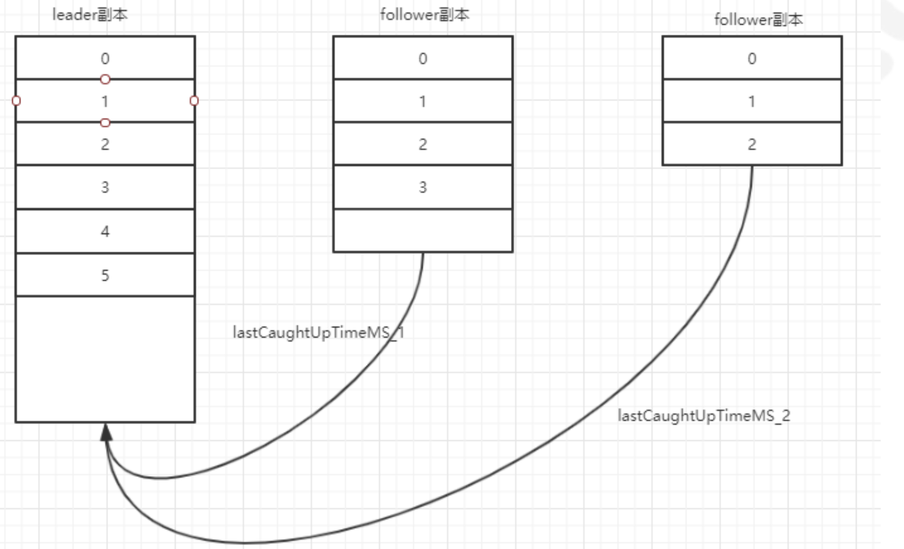

#### 副本的选举过程

1. KafkaController会监听ZooKeeper的/brokers/ids节点路径，一旦发现有broker挂了，执行下面 的逻辑。这里暂时先不考虑KafkaController所在broker挂了的情况，KafkaController挂了，各个 broker会重新leader选举出新的KafkaController。

2. leader副本在该broker上的分区就要重新进行leader选举，目前的选举策略是。
   1. 优先从isr列表中选出第一个作为leader副本，这个叫优先副本，理想情况下有限副本就是该分 区的leader副本。
   2. 如果isr列表为空，则查看该topic的unclean.leader.election.enable配置。 unclean.leader.election.enable:为true则代表允许选用非isr列表的副本作为leader，那么此 时就意味着数据可能丢失，为false的话，则表示不允许，直接抛出NoReplicaOnlineException异常，造成leader副本选举失败。 
   3. 如果上述配置为true，则从其他副本中选出一个作为leader副本，并且isr列表只包含该leader副本。一旦选举成功，则将选举后的leader和isr和其他副本信息写入到该分区的对应的zk路径上。 
3.  

### 副本数据同步原理

了解了副本的协同过程以后，还有一个重要的机制，就是数据的同步过程。它需要解决

1. 怎么传播消息。
2. 在向消息发送端返回ack之前需要保证多少个replica已经接受到这个消息。

**数据处理的过程是：**

下图中，深红色部分表示test_replica分区的leader副本，另外两个节点上浅色部分表示follower副本 

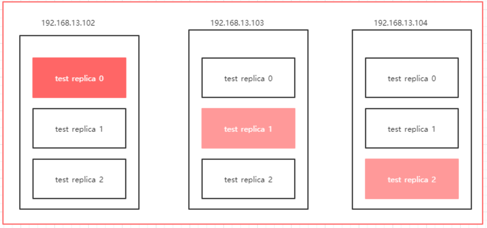

producer在发布消息到某个partition时：

- 先通过zookeeper找到该partition的Leader,`get /brokers/topics/<topic>/partitions/2/state`，然后无论该Topic的replication Factor为多少（也即该Partition有多少个replica），Producer只讲消息发送到该Partition的Leader。
- Leader会将该消息写入器本地Log。每个follower都从Leader pull数据。这种方式上，Follower存储的数据顺序与Leader保持一致。
- Follower在收到该消息并写入其Log后，向Leader发送ACK。 
- 一旦Leader收到了ISR中的所有Replica的ACK，该消息就被认为已经commit了，Leader将增加 HW(HighWatermark)并且向Producer发送ACK。 

**LEO**:即日志末端位移(log end offset)，记录了该副本底层日志(log)中下一条消息的位移值。注意是下 一条消息!也就是说，如果LEO=10，那么表示该副本保存了10条消息，位移值范围是[0, 9]。另外， leader LEO和follower LEO的更新是有区别的。我们后面会详细说 

**HW**:即上面提到的水位值(Hight Water)。对于同一个副本对象而言，其HW值不会大于LEO值。小 于等于HW值的所有消息都被认为是“已备份”的(replicated)。同理，leader副本和follower副本的 HW更新是有区别的 通过下面这幅图来表达LEO、HW的含义，随着follower副本不断和leader副本进行数据同步，follower 副本的LEO会主键后移并且追赶到leader副本，这个追赶上的判断标准是当前副本的LEO是否大于或者 等于leader副本的HW，这个追赶上也会使得被踢出的follower副本重新加入到ISR集合中。 

另外， 假如说下图中的最右侧的follower副本被踢出ISR集合，也会导致这个分区的HW发生变化，变成 了3 

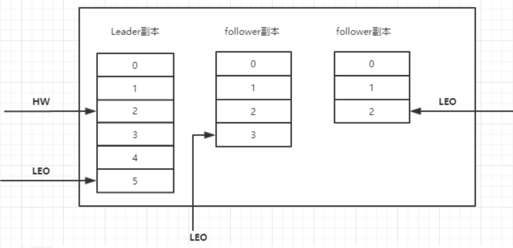

#### 初始状态

初始状态下，leader和follower的HW和LEO都是0，leader副本会保存remote LEO，表示所有follower LEO，也会被初始化为0，这个时候，producer没有发送消息。follower会不断地给leader发送FETCH 请求，但是因为没有数据，这个请求会被leader寄存，当在指定的时间之后会强制完成请求，这个时间配置是(replica.fetch.wait.max.ms)，如果在指定时间内producer有消息发送过来，那么kafka会唤醒 fetch请求，让leader继续处理。

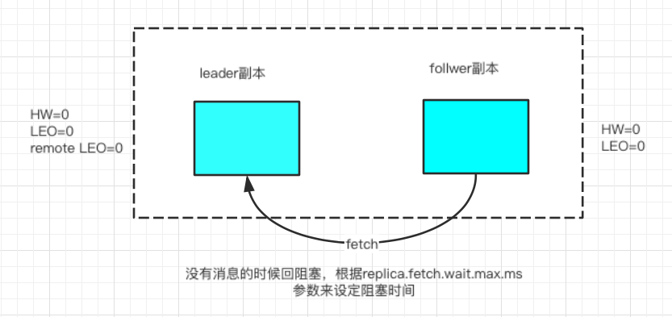

数据的同步处理会分两种情况，这两种情况下处理方式是不一样的 

- 第一种是leader处理完producer请求之后，follower发送一个fetch请求过来 
- 第二种是follower阻塞在leader指定时间之内，leader副本收到producer的请求。 

#### 第一种情况

**生产者发送一条消息** 

leader处理完producer请求之后，follower发送一个fetch请求过来 。状态图如下：

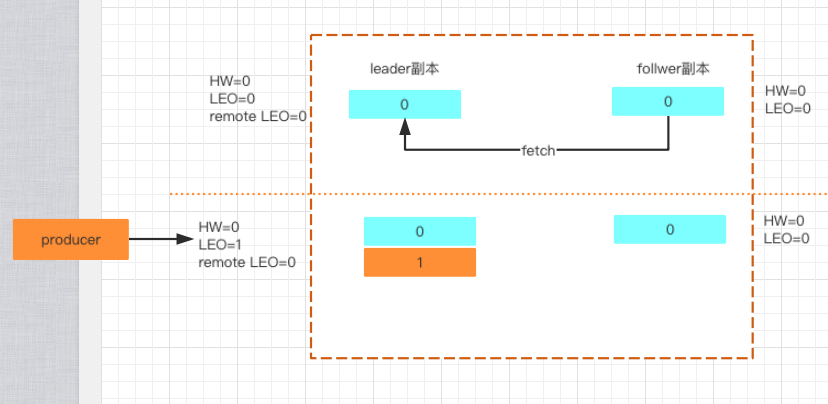

leader副本收到请求以后，会做几件事情 

1. 把消息追加到log文件，同时更新leader副本的LEO
2. 尝试更新leader HW值。这个时候由于follower副本还没有发送fetch请求，那么leader的remote LEO仍然是0。leader会比较自己的LEO以及remote LEO的值发现最小值是0，与HW的值相同，所 以不会更新HW 

**follower fetch消息** 

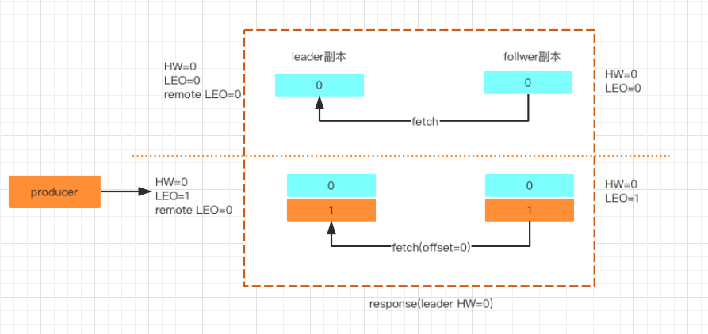

follower发送fetch请求，leader副本的处理逻辑是: 

1. 读取log数据、更新remote LEO=0(follower还没有写入这条消息，这个值是根据follower的fetch请求中的offset来确定的) 
2. 尝试更新HW，因为这个时候LEO和remoteLEO还是不一致，所以仍然是HW=0 
3. 把消息内容和当前分区的HW值发送给follower副本 

follower副本收到response以后:

1. 将消息写入到本地log，同时更新follower的LEO 

2. 更新follower HW，本地的LEO和leader返回的HW进行比较取小的值，所以仍然是0 

第一次交互结束以后，HW仍然还是0，这个值会在下一次follower发起fetch请求时被更新。

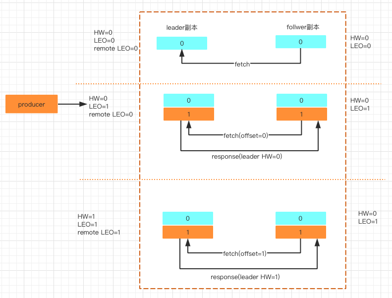

follower发第二次fetch请求，leader收到请求以后：

1. 读取log数据。
2. 更新remote LEO=1， 因为这次fetch携带的offset是1。
3. 更新当前分区的HW，这个时候leader LEO和remote LEO都是1，所以HW的值也更新为1 。
4. 把数据和当前分区的HW值返回给follower副本，这个时候如果没有数据，则返回为空 。

follower副本收到response以后：

1. 如果有数据则写本地日志，并且更新LEO 

2. 更新follower的HW值 

到目前为止，数据的同步就完成了，意味着消费端能够消费offset=1这条消息。 

#### 第二种情况

前面说过，由于leader副本暂时没有数据过来，所以follower的fetch会被阻塞，直到等待超时或者leader接收到新的数据。当leader收到请求以后会唤醒处于阻塞的fetch请求。处理过程基本上和前面说 的一致 

1. leader将消息写入本地日志，更新Leader的LEO 
2. 唤醒follower的fetch请求
3. 更新HW 

kafka使用HW和LEO的方式来实现副本数据的同步，本身是一个好的设计，但是在这个地方会存在一个数据丢失的问题，当然这个丢失只出现在特定的背景下。我们回想一下，HW的值是在新的一轮FETCH中才会被更新。我们分析下这个过程为什么会出现数据丢失 

#### 数据丢失问题

**前提**

> min.insync.replicas=1 // 设定ISR中的最小副本数是多少，默认值为1(在server.properties中配 置)， 并且acks参数设置为-1表示需要所有副本确认)时，此参数才生效。 

表达的含义是，至少需要多少个副本同步才能表示消息是提交的， 所以，当 min.insync.replicas=1 的时候，一旦消息被写入leader端log即被认为是“已提交”，而延迟一轮FETCH RPC更新HW值的设计使 得follower HW值是异步延迟更新的，倘若在这个过程中leader发生变更，那么成为新leader的 follower的HW值就有可能是过期的，使得clients端认为是成功提交的消息被删除。 


##### producer的ack

acks配置表示producer发送消息到broker上以后的确认值。有三个可选项 :

0:表示producer不需要等待broker的消息确认。这个选项时延最小但同时风险最大(因为当server宕 

机时，数据将会丢失)。 

1:表示producer只需要获得kafka集群中的leader节点确认即可，这个选择时延较小同时确保了 

leader节点确认接收成功。 

all(-1):需要ISR中所有的Replica给予接收确认，速度最慢，安全性最高，但是由于ISR可能会缩小到仅 

包含一个Replica，所以设置参数为all并不能一定避免数据丢失， 

#### **数据丢失的解决方案** 

在kafka0.11.0.0版本之后，引入了一个leader epoch来解决这个问题，所谓的leader epoch实际上是 一对值(epoch，offset)，epoch代表leader的版本号，从0开始递增，当leader发生过变更，epoch 就+1，而offset则是对应这个epoch版本的leader写入第一条消息的offset，比如:(0,0), (1,50) ,表示第一个leader从offset=0开始写消息，一共写了50条。第二个leader版本号是1，从 offset=50开始写，这个信息会持久化在对应的分区的本地磁盘上，文件名是`/tmp/kafka-log/topic/leader-epoch-checkpoint`。

leader broker中会保存这样一个缓存，并且定期写入到checkpoint文件中 。

当leader写log时它会尝试更新整个缓存: 如果这个leader首次写消息，则会在缓存中增加一个条目。否则就不做更新。而每次副本重新成为leader时会查询这部分缓存，获取出对应leader版本的offset。


我们基于同样的情况来分析，follower宕机并且恢复之后，有两种情况，如果这个时候leader副本没有挂，也就是意味着没有发生leader选举，那么follower恢复之后并不会去截断自己的日志，而是先发送一个OffsetsForLeaderEpochRequest请求给到leader副本，leader副本收到请求之后返回当前的LEO。 

如果follower副本的leaderEpoch和leader副本的epoch相同， leader的leo只可能大于或者等于 follower副本的leo值，所以这个时候不会发生截断。

如果follower副本和leader副本的epoch值不同，那么leader副本会查找follower副本传过来的 epoch+1在本地文件中存储的StartOffset返回给follower副本，也就是新leader副本的LEO。这样也避免了数据丢失的问题。

如果leader副本宕机了重新选举新的leader，那么原本的follower副本就会变成leader，意味着epoch从0变成1，使得原本follower副本中LEO的值的到了保留。 

## 消息的存储

消息发送端发送消息到broker上以后，消息是如何持久化的呢?那么接下来去分析下消息的存储。

首先我们需要了解的是，**kafka是使用日志文件的方式来保存生产者和发送者的消息，每条消息都有一 个offset值来表示它在分区中的偏移量。**Kafka中存储的一般都是海量的消息数据，为了避免日志文件过大，Log并不是直接对应在一个磁盘上的日志文件，而是对应磁盘上的一个目录，这个目录的命名规则 是`<topic_name>_<partition_id> `

### 消息的文件存储机制

一个topic的多个partition在物理磁盘上的保存路径，路径保存在 `/tmp/kafka-logs/topic_partition`，包 含日志文件、索引文件和时间索引文件 

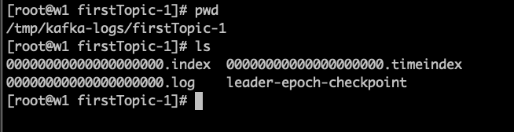

kafka是通过分段的方式将Log分为多个LogSegment，LogSegment是一个逻辑上的概念，一个 LogSegment对应磁盘上的一个日志文件和一个索引文件，其中日志文件是用来记录消息的。索引文件 是用来保存消息的索引。那么这个LogSegment是什么呢? 

### **LogSegment** 

假设kafka以partition为最小存储单位，那么我们可以想象当kafka producer不断发送消息，必然会引起partition文件的无限扩张，这样对于消息文件的维护以及被消费的消息的清理带来非常大的挑战，所以kafka 以segment为单位又把partition进行细分。每个partition相当于一个巨型文件被平均分配到多个大小相等的segment数据文件中(每个segment文件中的消息不一定相等)，这种特性方便已经被消费的消息的清理，提高磁盘的利用率。 

- log.segment.bytes=107370 (设置分段大小),默认是1gb，我们把这个值调小以后，可以看到日志 分段的效果
- 抽取其中3个分段来进行分析 

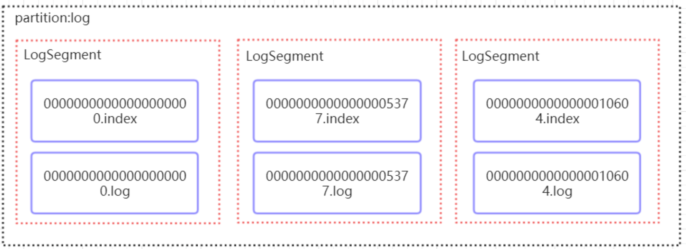

segment file由2大部分组成，分别为index file和data file，此2个文件一一对应，成对出现，后 缀".index"和“.log”分别表示为segment索引文件、数据文件. 

segment文件命名规则:partion全局的第一个segment从0开始，后续每个segment文件名为上一个 segment文件最后一条消息的offset值进行递增。数值最大为64位long大小，20位数字字符长度，没有数字用0填充。

#### 查看segment文件命名规则

通过下面这条命令可以看到kafka消息日志的内容：

```shell
sh kafka-run-class.sh kafka.tools.DumpLogSegments --files /tmp/kafka-logs/test- 0/00000000000000000000.log --print-data-log
```

假如第一个log文件的最后一个offset为:5376,所以下一个segment的文件命名为: 00000000000000005376.log。对应的index为00000000000000005376.index 

#### segment中index和log的对应关系

从所有分段中，找一个分段进行分析。

为了提高查找消息的性能，为每一个日志文件添加2个索引索引文件:OffsetIndex 和TimeIndex，分别对应*.index* .timeindex, TimeIndex索引文件格式:它是映射时间戳和相对offset。

查看索引内容: 

```shell
sh kafka-run-class.sh kafka.tools.DumpLogSegments --files /tmp/kafka-logs/test- 0/00000000000000000000.index --print-data-log
```

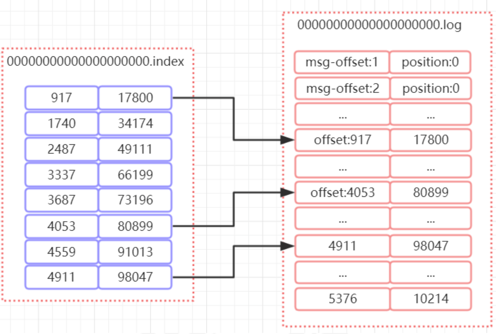

如图所示，index中存储了索引以及物理偏移量。 log存储了消息的内容。索引文件的元数据执行对应数据文件中message的物理偏移地址。举个简单的案例来说，以[4053,80899]为例，在log文件中，对应的是第4053条记录，物理偏移量(position)为80899. position是ByteBuffer的指针位置。

#### 在partition中如何通过offset查找message

查找的算法是：

1. 根据offset的值，查找segment段中的index索引文件。由于索引文件命名是以上一个文件的最后一个offset进行命名的，所以，使用二分查找算法能够根据offset快速定位到指定的索引文件。 
2. 找到索引文件后，根据offset进行定位，找到索引文件中的符合范围的索引。(kafka采用稀疏索引的方式来提高查找性能) 
3. 得到position以后，再到对应的log文件中，从position处开始查找offset对应的消息，将每条消息的offset与目标offset进行比较，直到找到消息。

比如说，我们要查找offset=2490这条消息，那么先找到00000000000000000000.index, 然后找到 [2487,49111]这个索引，再到log文件中，根据49111这个position开始查找，比较每条消息的offset是否大于等于2490。最后查找到对应的消息以后返回。

#### Log文件的消息内容分析

前面我们通过kafka提供的命令，可以查看二进制的日志文件信息，一条消息，会包含很多的字段。 

```
 offset: 5371 position: 102124 CreateTime: 1531477349286 isvalid: true keysize: -1 valuesize: 12 magic: 2 compresscodec: NONE producerId: -1 producerEpoch: -1 sequence: -1 isTransactional: false headerKeys: [] payload: message_5371
```

offset和position这两个前面已经讲过了、 createTime表示创建时间、keysize和valuesize表示key和 value的大小、 compresscodec表示压缩编码、payload:表示消息的具体内容 

#### 日志的清除策略以及压缩策略

##### **日志清除策略** 

前面提到过，日志的分段存储，一方面能够减少单个文件内容的大小，另一方面，方便kafka进行日志清理。日志的清理策略有两个。

1. 根据消息的保留时间，当消息在kafka中保存的时间超过了指定的时间，就会触发清理过程。
2. 根据topic存储的数据大小，当topic所占的日志文件大小大于一定的阀值，则可以开始删除最旧的消息。kafka会启动一个后台线程，定期检查是否存在可以删除的消息。

**通过log.retention.bytes和log.retention.hours这两个参数来设置，当其中任意一个达到要求，都会执行删除。** 

默认的保留时间是:7天 

##### 日志压缩策略

Kafka还提供了“日志压缩(Log Compaction)”功能，通过这个功能可以有效的减少日志文件的大小， 缓解磁盘紧张的情况，在很多实际场景中，消息的key和value的值之间的对应关系是不断变化的，就像数据库中的数据会不断被修改一样，消费者只关心key对应的最新的value。因此，我们可以开启kafka的日志压缩功能，服务端会在后台启动启动Cleaner线程池，定期将相同的key进行合并，只保留最新的value值。日志的压缩原理是：

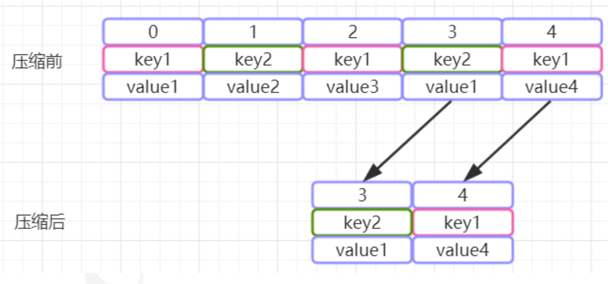

## **磁盘存储的性能问题** 

### **磁盘存储的性能优化** 

我们现在大部分企业仍然用的是机械结构的磁盘，如果把消息以随机的方式写入到磁盘，那么磁盘首先要做的就是寻址，也就是定位到数据所在的物理地址，在磁盘上就要找到对应的柱面、磁头以及对应的扇区;这个过程相对内存来说会消耗大量时间，为了规避随机读写带来的时间消耗，kafka采用顺序写的方式存储数据。即使是这样，但是频繁的I/O操作仍然会造成磁盘的性能瓶颈。

### **零拷贝** 

消息从发送到落地保存，broker维护的消息日志本身就是文件目录，每个文件都是二进制保存，生产者和消费者使用相同的格式来处理。在消费者获取消息时，服务器先从硬盘读取数据到内存，然后把内存中的数据原封不动的通过socket发送给消费者。虽然这个操作描述起来很简单，但实际上经历了很多步骤。 

- 操作系统将数据从磁盘读入到内核空间的页缓存
- 应用程序将数据从内核空间读入到用户空间缓存中
- 应用程序将数据写回到内核空间到socket缓存中
- 操作系统将数据从socket缓冲区复制到网卡缓冲区，以便将数据经网络发出 

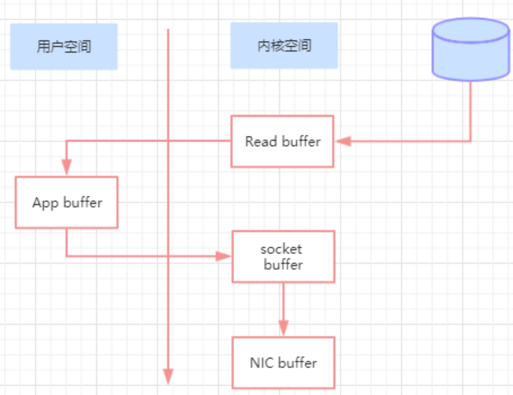

通过“零拷贝”技术，可以去掉这些没必要的数据复制操作，同时也会减少上下文切换次数。**现代的unix操作系统提供一个优化的代码路径，用于将数据从页缓存传输到socket。在Linux中，是通过sendfile系统调用来完成的。Java提供了访问这个系统调用的方法:FileChannel.transferTo API** 

使用sendfile，只需要一次拷贝就行，允许操作系统将数据直接从页缓存发送到网络上。所以在这个优化的路径中，只有最后一步将数据拷贝到网卡缓存中是需要的：

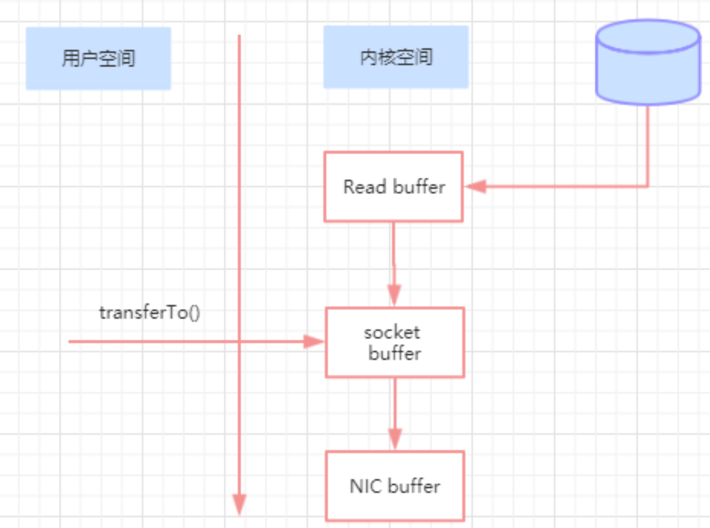

### 页缓存

页缓存是操作系统实现的一种主要的磁盘缓存，但凡设计到缓存的，基本都是为了提升i/o性能，所以页缓存是用来减少磁盘I/O操作的。 

磁盘高速缓存有两个重要因素:

- 第一，访问磁盘的速度要远低于访问内存的速度，若从处理器L1和L2高速缓存访问则速度更快。 
- 第二，数据一旦被访问，就很有可能短时间内再次访问。正是由于基于访问内存比磁盘快的多，所以磁盘的内存缓存将给系统存储性能带来质的飞越。 

当 一 个进程准备读取磁盘上的文件内容时， 操作系统会先查看待读取的数据所在的页(page)是否在页缓存(pagecache)中，如果存在(命中)则直接返回数据， 从而避免了对物理磁盘的I/0操作;如果没有命中， 则操作系统会向磁盘发起读取请求并将读取的数据页存入页缓存， 之后再将数据返回给进程。 同样，如果一个进程需要将数据写入磁盘， 那么操作系统也会检测数据对应的页是否在页缓存中，如果不存在， 则会先在页缓存中添加相应的页， 最后将数据写入对应的页。 被修改过后的页也就变成了脏页， 操作系统会在合适的时间把脏页中的数据写入磁盘， 以保持数据的一致性。

Kafka中大量使用了页缓存，这是Kafka实现高吞吐的重要因素之 一 。**虽然消息都是先被写入页缓存，然后由操作系统负责具体的刷盘任务的，但在Kafka中同样提供了同步刷盘及间断性强制刷盘(fsync), 可以通过 log.flush.interval.messages 和 log.flush.interval.ms 参数来控制。** 

同步刷盘能够保证消息的可靠性，避免因为宕机导致页缓存数据还未完成同步时造成的数据丢失。但是实际使用上，我们没必要去考虑这样的因素以及这种问题带来的损失，消息可靠性可以由多副本来解决，同步刷盘会带来性能的影响。刷盘的操作由操作系统去完成即可。

## Kafka消息的可靠性

没有一个中间件能够做到百分之百的完全可靠，可靠性更多的还是基于几个9的衡量指标，比如4个9、5 个9. 软件系统的可靠性只能够无限去接近100%，但不可能达到100%。所以kafka如何是实现最大可能的可靠性呢? 

- 分区副本， 你可以创建更多的分区来提升可靠性，但是分区数过多也会带来性能上的开销，一般来说，3个副本就能满足对大部分场景的可靠性要求。
- acks，生产者发送消息的可靠性，也就是我要保证我这个消息一定是到了broker并且完成了多副本的持久化，但这种要求也同样会带来性能上的开销。它有几个可选项：
  - 1 ，生产者把消息发送到leader副本，leader副本在成功写入到本地日志之后就告诉生产者消息提交成功，但是如果isr集合中的follower副本还没来得及同步leader副本的消息，leader挂了，就会造成消息丢失。
  - -1 ，消息不仅仅写入到leader副本，并且被ISR集合中所有副本同步完成之后才告诉生产者已经提交成功，这个时候即使leader副本挂了也不会造成数据丢失。 
  - 0:表示producer不需要等待broker的消息确认。这个选项时延最小但同时风险最大(因为当server宕机时，数据将会丢失)。 
- 保障消息到了broker之后，消费者也需要有一定的保证，因为消费者也可能出现某些问题导致消息没有消费到。
  - enable.auto.commit默认为true，也就是自动提交offset，自动提交是批量执行的，有一个时间窗口，这种方式会带来重复提交或者消息丢失的问题，所以对于高可靠性要求的程序，要使用手动提交。对于高可靠要求的应用来说，宁愿重复消费也不应该因为消费异常而导致消息丢失。


