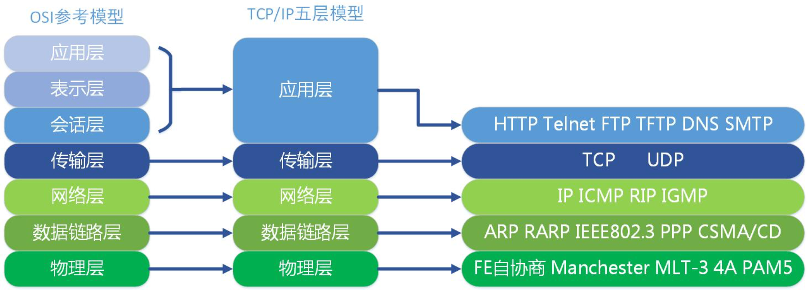
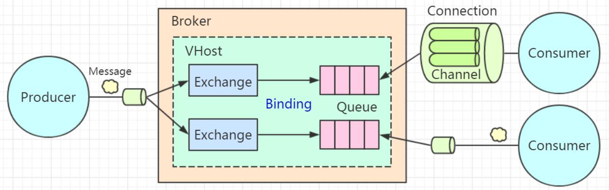
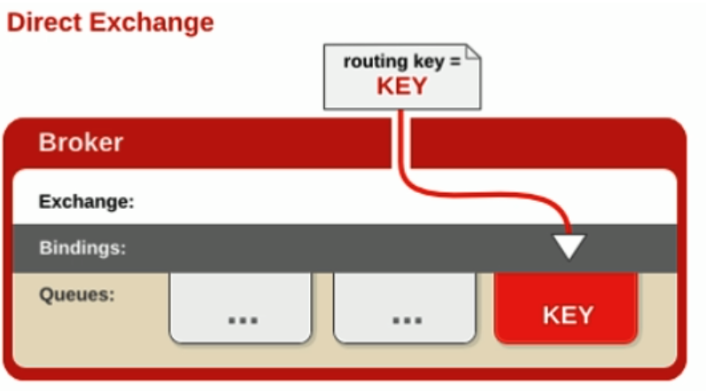
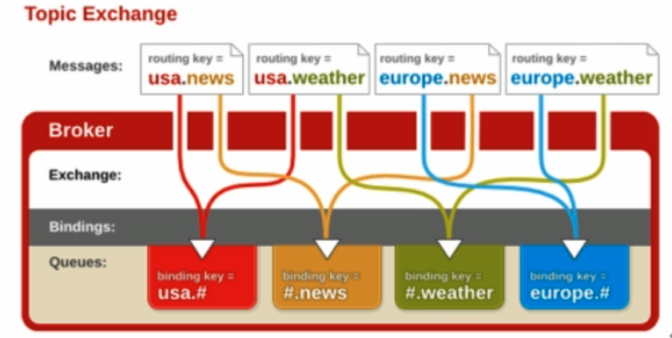
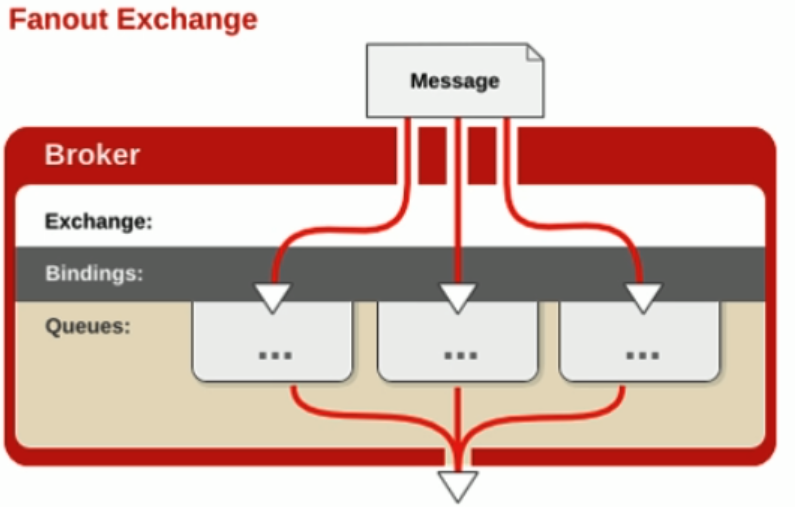
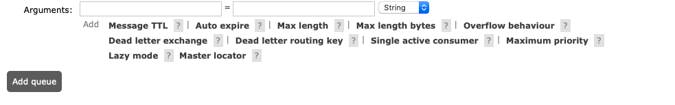
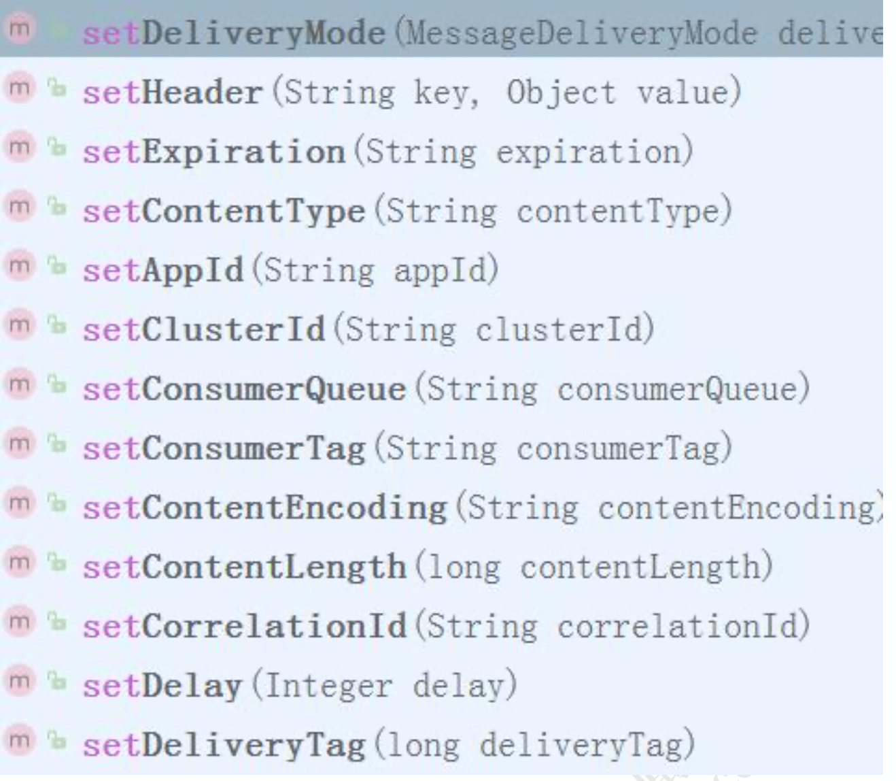
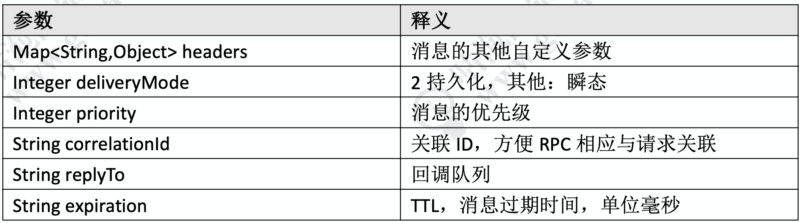

# rabbitMQ简介即基本使用

## RabbitMQ简介

### 基本特性

官网 https://www.rabbitmq.com/getstarted.html 

**高可靠**:RabbitMQ提供了多种多样的特性让你在可靠性和性能之间做出权衡，包括持久化、发送应答、发布确认以及高可用性。 

**灵活的路由**:通过交换机(Exchange)实现消息的灵活路由。 

**支持多客户端**:对主流开发语言(Python、Java、Ruby、PHP、C#、JavaScript、 Go、Elixir、Objective-C、Swift 等)都有客户端实现。 

**集群与扩展性**:多个节点组成一个逻辑的服务器，支持负载。 

**高可用队列**:通过镜像队列实现队列中数据的复制。 

**权限管理**:通过用户与虚拟机实现权限管理。 

**插件系统**:支持各种丰富的插件扩展，同时也支持自定义插件。 

**与Spring集成**:Spring 对 AMQP 进行了封装。 

### AMQP协议 

http://www.amqp.org/sites/amqp.org/files/amqp.pdf 

AMQP:高级消息队列协议，是一个工作于应用层的协议，最新的版本是1.0版本。 



除了 RabbitMQ 之外，AMQP 的实现还有 OpenAMQ、Apache Qpid、Redhat Enterprise MRG、AMQP Infrastructure、Zyre。 

除了 AMQP 之外，RabbitMQ 支持多种协议，STOMP、MQTT、HTTP and WebSockets。 

### 工作模型 

由于RabbitMQ实现了AMQP协议，所以RabbitMQ的工作模型也是基于AMQP的。理解这张图片至关重要。 



#### **Broker** 

我们要使用RabbitMQ来收发消息，必须要安装一个RabbitMQ的服务，可以安装在Windows上面也可以安装在Linux上面，默认是5672的端口。这台RabbitMQ的服务器我们把它叫做Broker，中文翻译是代理/中介，因为**MQ服务器帮助我们做的事情就是存储、转发消息。** 

#### **Connection** 

无论是生产者发送消息，还是消费者接收消息，都必须要跟Broker之间建立一个连接，这个连接是一个TCP的长连接。 

#### Channel

如果所有的生产者发送消息和消费者接收消息，都直接创建和释放TCP长连接的话，对于Broker来说肯定会造成很大的性能损耗，因为TCP连接是非常宝贵的资源，创建和释放也要消耗时间。 

所以在AMQP里面引入了Channel的概念，它是一个虚拟的连接。我们把它翻译成通道，或者消息信道。这样我们就可以在保持的TCP长连接里面去创建和释放Channel，大大了减少了资源消耗。另外一个需要注意的是，Channel是RabbitMQ原生API里面的最重要的编程接口，也就是说我们定义交换机、队列、绑定关系，发送消息消费消息，调用的都是Channel接口上的方法。 

[参考链接](https://stackoverflow.com/questions/18418936/rabbitmq-and-relationship- between-channel-and-connection
)

#### **Queue** 

现在我们已经连到Broker了，可以收发消息了。在其他一些MQ里面，比如ActiveMQ和Kafka，我们的消息都是发送到队列上的。 

队列是真正用来存储消息的，是一个独立运行的进程，有自己的数据库(Mnesia)。 

消费者获取消息有两种模式，一种是Push模式，只要生产者发到服务器，就马上推送给消费者。另一种是Pull模式，消息存放在服务端，只有消费者主动获取才能拿到消息。消费者需要写一个while循环不断地从队列获取消息吗?不需要，我们可以基于事件机制，实现消费者对队列的监听。 

由于队列有FIFO的特性，只有确定前一条消息被消费者接收之后，才会把这条消息从数据库删除，继续投递下一条消息。 

#### **Exchange** 

在RabbitMQ里面永远不会出现消息直接发送到队列的情况。因为在AMQP里面引入了交换机(Exchange)的概念，用来实现消息的灵活路由。 

交换机是一个绑定列表，用来查找匹配的绑定关系。

队列使用绑定键(Binding Key)跟交换机建立绑定关系。 

生产者发送的消息需要携带路由键(Routing Key)，交换机收到消息时会根据它保存的绑定列表，决定将消息路由到哪些与它绑定的队列上。 

注意:交换机与队列、队列与消费者都是多对多的关系。 

#### **Vhost** 

我们每个需要实现基于RabbitMQ的异步通信的系统，都需要在服务器上创建自己要用到的交换机、队列和它们的绑定关系。如果某个业务系统不想跟别人混用一个系统，怎么办?再采购一台硬件服务器单独安装一个RabbitMQ服务?这种方式成本太高了。 在同一个硬件服务器上安装多个RabbitMQ的服务呢?比如再运行一个5673的端口? 没有必要，因为RabbitMQ提供了虚拟主机VHOST。 

VHOST除了可以提高硬件资源的利用率之外，还可以实现资源的隔离和权限的控制。它的作用类似于编程语言中的namespace和package，不同的是VHOST中可以有同名的Exchange和 Queue，它们是完全透明的。 

这个时候，我们可以为不同的业务系统创建不同的用户(User)，然后给这些用户分配VHOST的权限。比如给风控系统的用户分配风控系统的VHOST的权限，这个用户可以访问里面的交换机和队列。给超级管理员分配所有VHOST的权限。 

### 路由方式 

我们说到RabbitMQ引入Exchange是为了实现消息的灵活路由，到底有哪些路由方式? 

#### **直连 Direct** 

队列与直连类型的交换机绑定，需指定一个精确的绑定键。 

生产者发送消息时会携带一个路由键。只有当路由键与其中的某个绑定键完全匹配时，这条消息才会从交换机路由到满足路由关系的此队列上。



#### 主题 Topic

队列与主题类型的交换机绑定时，可以在绑定键中使用通配符。两个通配符: 

`*` 不多不少一个单词

`#` 0 个或者多个单词

单词(word)指的是用英文的点“.”隔开的字符。例如 abc.def 是两个单词。 



#### 广播 Fanout

广播类型的交换机与队列绑定时，不需要指定绑定键。因此生产者发送消息到广播类型的交换机上，也不需要携带路由键。消息达到交换机时，所有与之绑定了的队列， 都会收到相同的消息的副本。 



## 基本使用

### 安装 

使用[Docker Hub](https://hub.docker.com/_/rabbitmq)的镜像直接运行在docker。

docker pull rabbitmq

拉取完镜像以后使用命令启动，我们需要使用插件Management，暴露了端口8080：

```shell
docker run -d --hostname my-rabbit --name some-rabbit -p 8080:15672 -p 5672:5672 rabbitmq:3-management
```

启动后可以使用 `http://localhost:8080` 或者 `http://host-ip:8080` 访问后台管理。

### Java API 编程 

#### 引入依赖 

创建 Maven 工程，pom.xml 引入依赖 

```xml
<dependency>
    <groupId>com.rabbitmq</groupId>
    <artifactId>amqp-client</artifactId>
    <version>5.6.0</version>
</dependency>
```

#### 生产者 

```java
public class MyProducer {
    private final static String EXCHANGE_NAME = "SIMPLE_EXCHANGE";

    public static void main(String[] args) throws Exception {
        ConnectionFactory factory = new ConnectionFactory();
        // 连接IP
        factory.setHost("192.168.1.4");
        // 连接端口
        factory.setPort(5672);
        // 虚拟机
        factory.setVirtualHost("/");
        // 用户
        factory.setUsername("guest");
        factory.setPassword("guest");

        // 建立连接
        Connection conn = factory.newConnection();
        // 创建消息通道
        Channel channel = conn.createChannel();

        // 发送消息
        String msg = "Hello world, Rabbit MQ";

        // String exchange, String routingKey, BasicProperties props, byte[] body
        channel.basicPublish(EXCHANGE_NAME, "my.best", null, msg.getBytes());

        channel.close();
        conn.close();
    }
}
```

#### 消费者 

```java
/**
 * 消息消费者
 */
public class MyConsumer {
    private final static String EXCHANGE_NAME = "SIMPLE_EXCHANGE";
    private final static String QUEUE_NAME = "SIMPLE_QUEUE";

    public static void main(String[] args) throws Exception {
        ConnectionFactory factory = new ConnectionFactory();
        // 连接IP
        factory.setHost("192.168.1.4");
        // 默认监听端口
        factory.setPort(5672);
        // 虚拟机
        factory.setVirtualHost("/");

        // 设置访问的用户
        factory.setUsername("guest");
        factory.setPassword("guest");
        // 建立连接
        Connection conn = factory.newConnection();
        // 创建消息通道
        Channel channel = conn.createChannel();

        // 声明交换机
        // String exchange, String type, boolean durable, boolean autoDelete, Map<String, Object> arguments
        channel.exchangeDeclare(EXCHANGE_NAME,"direct",false, false, null);

        // 声明队列
        // String queue, boolean durable, boolean exclusive, boolean autoDelete, Map<String, Object> arguments
        channel.queueDeclare(QUEUE_NAME, false, false, false, null);
        System.out.println(" Waiting for message....");

        // 绑定队列和交换机
        channel.queueBind(QUEUE_NAME,EXCHANGE_NAME,"my.best");

        // 创建消费者
        Consumer consumer = new DefaultConsumer(channel) {
            @Override
            public void handleDelivery(String consumerTag, Envelope envelope, AMQP.BasicProperties properties,
                                       byte[] body) throws IOException {
                String msg = new String(body, "UTF-8");
                System.out.println("Received message : '" + msg + "'");
                System.out.println("consumerTag : " + consumerTag );
                System.out.println("deliveryTag : " + envelope.getDeliveryTag() );
            }
        };

        // 开始获取消息
        // String queue, boolean autoAck, Consumer callback
        channel.basicConsume(QUEUE_NAME, true, consumer);
    }
}
```

#### 参数详解 

1. 声明交换机的参数
    String type:交换机的类型，direct, topic, fanout 中的一种。
    boolean durable:是否持久化，代表交换机在服务器重启后是否还存在。 

2. 声明队列的参数 :

   boolean durable:是否持久化，代表队列在服务器重启后是否还存在。 

   boolean exclusive:是否排他性队列。排他性队列只能在声明它的Connection中使用(可以在同一个 Connection 的不同的 channel 中使用)，连接断开时自动删 除。 

   boolean autoDelete:是否自动删除。如果为 true，至少有一个消费者连接到这个队列，之后所有与这个队列连接的消费者都断开时，队列会自动删除。 

   Map<String, Object> arguments:队列的其他属性，例如: 

3. 消息属性 BasicProperties 

   以下列举了一些主要的参数: 



