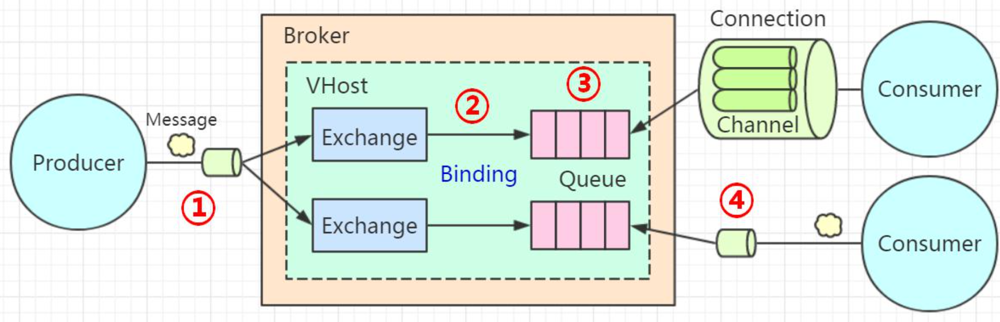
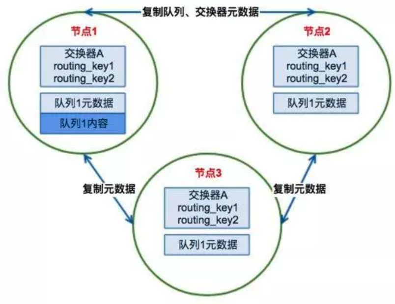
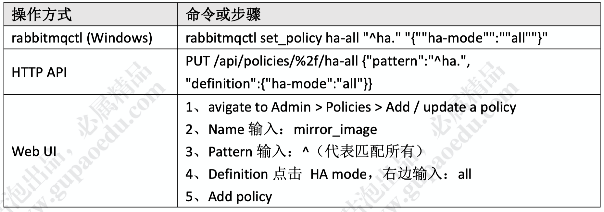
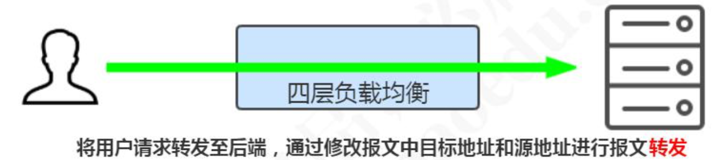

# rabbitMQ可靠性投递与高可用

## 可靠性投递 

在使用RabbitMQ实现异步通信的时候，消息丢了怎么办，消息重复消费怎么办? 

在RabbitMQ里面提供了很多保证消息可靠投递的机制，这个也是RabbitMQ的一个特性。 

我们在讲可靠性投递的时候，必须要明确一个问题，因为效率与可靠性是无法兼得的，如果要保证每一个环节都成功，势必会对消息的收发效率造成影响。所以如果是一些业务实时一致性要求不是特别高的场合，可以牺牲一些可靠性来换取效率。 

比如发送通知或者记录日志的这种场景，如果用户没有收到通知，不会造成业务影响，只要再次发送就可以了。 

我们再来回顾一下RabbitMQ的工作模型。 



在我们使用 RabbitMQ 收发消息的时候，有几个主要环节: 

1. 代表消息从生产者发送到Broker。生产者把消息发到Broker之后，怎么知道自己的消息有没有被Broker 成功接收? 
2. 代表消息从Exchange路由到Queue。Exchange是一个绑定列表，如果消息没有办法路由到正确的队列，会发生什么事情?应该怎么处理?

3. 代表消息在 Queue 中存储。队列是一个独立运行的服务，有自己的数据库(Mnesia)，它是真正用来存储消息的。如果还没有消费者来消费，那么消息要一直存储在队列里面。如果队列出了问题，消息肯定会丢失。怎么保证消息在队列稳定地存储呢? 
4. 代表消费者订阅Queue并消费消息。队列的特性是什么?FIFO。队列里面的消息是一条一条的投递的，也就是说，只有上一条消息被消费者接收以后，才能把这一条消息从数据库删掉，继续投递下一条消息。那么问题来了，Broker怎么知道消费者已经接收了消息呢? 

### 消息发送到RabbitMQ服务器 

第一个环节是生产者发送消息到Broker。可能因为网络或者Broker的问题导致消息发送失败，生产者不能确定Broker有没有正确的接收。 

在RabbitMQ里面提供了两种机制**服务端确认机制**，也就是在生产者发送消息给RabbitMQ的服务端的时候，服务端会通过某种方式返回一个应答，只要生产者收到了这个应答，就知道消息发送成功了。 

**第一种是Transaction(事务)模式，第二种 Confirm(确认)模式。** 

#### Transaction(事务)模式

我们通过一个channel.txSelect()的方法把信道设置成事务模式，然后就可以发布消息给RabbitMQ了，如果 channel.txCommit();的方法调用成功，就说明事务提交成功， 则消息一定到达了RabbitMQ中。 

如果在事务提交执行之前由于RabbitMQ异常崩溃或者其他原因抛出异常，这个时候我们便可以将其捕获，进而通过执行channel.txRollback()方法来实现事务回滚。 

```java
try {
    channel.txSelect();
    // 发送消息
    // String exchange, String routingKey, BasicProperties props, byte[] body
    channel.basicPublish("", QUEUE_NAME, null, (msg).getBytes());
    // int i =1/0;
    channel.txCommit();
    System.out.println("消息发送成功");
} catch (Exception e) {
    channel.txRollback();
    System.out.println("消息已经回滚");
}
```

在事务模式里面，只有收到了服务端的Commit-OK的指令，才能提交成功。所以可以解决生产者和服务端确认的问题。**但是事务模式有一个缺点，它是阻塞的，一条消息没有发送完毕，不能发送下一条消息，它会榨干 RabbitMQ服务器的性能。所以不建议大家在生产环境使用。** 

Spring Boot 中的设置: 

```java
rabbitTemplate.setChannelTransacted(true);
```

那么有没有其他可以保证消息被 Broker 接收，但是又不大量消耗性能的方式呢?这个就是第二种模式，叫做确认(Confirm)模式。 

#### Confirm(确认)模式 

确认模式有三种，一种是普通确认模式。 

在生产者这边通过调用 `channel.confirmSelect()`方法将信道设置为Confirm模式， 然后发送消息。一旦消息被投递到所有匹配的队列之后，RabbitMQ就会发送一个确认 (Basic.Ack)给生产者，也就是调用 channel.waitForConfirms()返回true，这样生产者就知道消息被服务端接收了。 

这种发送1条确认1条的方式效率还不是太高，所以我们还有一种批量确认的方式。 批量确认，就是在开启 Confirm模式后，先发送一批消息。只要channel.waitForConfirmsOrDie();方法没有抛出异常，就代表消息都被服务端接收了。 

批量确认的方式比单条确认的方式效率要高，但是也有两个问题，第一个就是批量的数量的确定。对于不同的业务，到底发送多少条消息确认一次?数量太少，效率提升 不上去。数量多的话，又会带来另一个问题，比如我们发1000条消息才确认一次，如果前面999条消息都被服务端接收了，如果第1000条消息被拒绝了，那么前面所有的消息都要重发。 

有没有一种方式，可以一边发送一边确认的呢?这个就是异步确认模式。 

异步确认模式需要添加一个ConfirmListener，并且用一个SortedSet来维护没有被确认的消息。 

Confirm 模式是在 Channel 上开启的，因为 RabbitTemplate 对 Channel 进行了封 装，叫做 ConfimrCallback。 

```java
rabbitTemplate.setConfirmCallback(new RabbitTemplate.ConfirmCallback() {
    public void confirm(CorrelationData correlationData, boolean ack, String cause) {
        if (!ack) {
            System.out.println("发送消息失败：" + cause);
            throw new RuntimeException("发送异常：" + cause);
        }
    }
});
```

### 消息从交换机路由到队列 

第二个环节就是消息从交换机路由到队列。在什么情况下，消息会无法路由到正确 的队列?可能因为路由键错误，或者队列不存在。 

我们有两种方式处理无法路由的消息，一种就是让服务端重发给生产者，一种是让交换机路由到另一个备份的交换机。 

消息回发的方式:使用mandatory参数和ReturnListener(在 Spring AMQP 中是 ReturnCallback)。 

```java
RabbitTemplate rabbitTemplate = new RabbitTemplate(connectionFactory);
rabbitTemplate.setMandatory(true);
rabbitTemplate.setReturnCallback(new RabbitTemplate.ReturnCallback(){
    public void returnedMessage(Message message,
                                int replyCode,
                                String replyText,
                                String exchange,
                                String routingKey){
        System.out.println("回发的消息：");
        System.out.println("replyCode: "+replyCode);
        System.out.println("replyText: "+replyText);
        System.out.println("exchange: "+exchange);
        System.out.println("routingKey: "+routingKey);
    }
});
```

消息路由到备份交换机的方式:在创建交换机的时候，从属性中指定备份交换机。 

```java
// 在声明交换机的时候指定备份交换机
Map<String,Object> arguments = new HashMap<String,Object>();
arguments.put("alternate-exchange","ALTERNATE_EXCHANGE");
channel.exchangeDeclare("TEST_EXCHANGE","topic", false, false, false, arguments);
```

(注意区别，队列可以指定死信交换机;交换机可以指定备份交换机) 

### 消息在队列存储 

第三个环节是消息在队列存储，如果没有消费者的话，队列一直存在在数据库中。 

如果RabbitMQ的服务或者硬件发生故障，比如系统宕机、重启、关闭等等，可能会导致内存中的消息丢失，所以我们要把消息本身和元数据(队列、交换机、绑定)都保存到磁盘。 

解决方案: 

1、队列持久化 

```java
@Bean("queue")
public Queue queue() {
    return new Queue("QUEUE", true, false, false, new HashMap<>());
}
```

2、交换机持久化 

```java
@Bean("exchange")
public DirectExchange exchange() {
    return new DirectExchange("EXCHANGE", true, false, new HashMap<>());
}
```

3、消息持久化

```java
messageProperties.setDeliveryMode(MessageDeliveryMode.PERSISTENT);
messageProperties.setContentType("UTF-8");
Message message = new Message("持久化消息".getBytes(), messageProperties);

rabbitTemplate.send("EXCHANGE", "my.test", message);
```

4、集群 

如果只有一个RabbitMQ的节点，即使交换机、队列、消息做了持久化，如果服务崩溃或者硬件发生故障，RabbitMQ的服务一样是不可用的，所以为了提高MQ服务的可用性，保障消息的传输，我们需要有多个RabbitMQ的节点，在下一节会详细讲到。 

### 消息投递到消费者 

如果消费者收到消息后没来得及处理即发生异常，或者处理过程中发生异常，会导致④失败。服务端应该以某种方式得知消费者对消息的接收情况，并决定是否重新投递这条消息给其他消费者。 

RabbitMQ提供了消费者的消息确认机制(message acknowledgement)，消费者可以自动或者手动地发送ACK给服务端。 

没有收到ACK的消息，消费者断开连接后，RabbitMQ会把这条消息发送给其他消费者。如果没有其他消费者，消费者重启后会重新消费这条消息，重复执行业务逻辑。 

消费者在订阅队列时，可以指定autoAck参数，当autoAck等于false时，RabbitMQ会等待消费者显式地回复确认信号后才从队列中移去消息。 

如何设置手动 ACK?

SimpleRabbitListenerContainer 或者 SimpleRabbitListenerContainerFactory 

```java
factory.setAcknowledgeMode(AcknowledgeMode.MANUAL);
```

application.properties 

```properties
spring.rabbitmq.listener.direct.acknowledge-mode=manual 
spring.rabbitmq.listener.simple.acknowledge-mode=manual
```

注意这三个值的区别: 

- NONE:自动 ACK 
- MANUAL: 手动 ACK
- AUTO:如果方法未抛出异常，则发送 ack。

当抛出 AmqpRejectAndDontRequeueException 异常的时候，则消息会被拒绝，且不重新入队。当抛出 ImmediateAcknowledgeAmqpException异常，则消费者会发送ACK。其他的异常，则消息会被拒绝，且 requeue = true会重新入队。 


在Spring Boot中，消费者又怎么调用ACK，或者说怎么获得Channel参数呢? 引入 com.rabbitmq.client.Channel。

```java
public class SecondConsumer {
    @RabbitHandler
    public void process(String msgContent,Channel channel, Message message) throws IOException {
        System.out.println("Second Queue received msg : " + msgContent );
        channel.basicAck(message.getMessageProperties().getDeliveryTag(), false);
    }
}
```

如果消息无法处理或者消费失败，也有两种拒绝的方式，Basic.reject()拒绝单条， Basic.Nack()批量拒绝。如果requeue参数设置为 true，可以把这条消息重新存入队列， 以便发给下一个消费者(当然，只有一个消费者的时候，这种方式可能会出现无限循环重复消费的情况。可以投递到新的队列中，或者只打印异常日志)。 

## 集群与高可用

### 为什么要做集群? 

集群主要用于实现高可用与负载均衡。 

高可用:如果集群中的某些MQ服务器不可用，客户端还可以连接到其他MQ服务器。 

负载均衡:在高并发的场景下，单台MQ服务器能处理的消息有限，可以分发给多台MQ服务器。 

RabbitMQ 有两种集群模式:普通集群模式和镜像队列模式。 

### RabbitMQ如何支持集群? 

用做集群，需要面对数据同步和通信的问题。因为Erlang天生具备分布式的特性， 所以RabbitMQ天然支持集群，不需要通过引入ZK或者数据库来实现数据同步。 

RabbitMQ通过/var/lib/rabbitmq/.erlang.cookie来验证身份，需要在所有节点上保持一致。 

### RabbitMQ的节点类型? 

集群有两种节点类型，一种是磁盘节点(Disc Node)，一种是内存节点(RAM Node)。 

磁盘节点:将元数据(包括队列名字属性、交换机的类型名字属性、绑定、vhost) 放在磁盘中。 

内存节点:将元数据放在内存中。 

PS:内存节点会将磁盘节点的地址存放在磁盘(不然重启后就没有办法同步数据了)。 如果是持久化的消息，会同时存放在内存和磁盘。 

集群中至少需要一个磁盘节点用来持久化元数据，否则全部内存节点崩溃时，就无法同步元数据。未指定类型的情况下，默认为磁盘节点。 

我们一般把应用连接到内存节点(读写快)，磁盘节点用来备份。 

集群通过25672端口两两通信，需要开放防火墙的端口。 

需要注意的是，RabbitMQ 集群无法搭建在广域网上，除非使用federation或者shovel等插件(没这个必要，在同一个机房做集群)。 

#### 普通集群 

普通集群模式下，不同的节点之间只会相互同步元数据。 



为什么不直接把队列的内容(消息)在所有节点上复制一份? 

主要是出于存储和同步数据的网络开销的考虑，如果所有节点都存储相同的数据， 就无法达到线性地增加性能和存储容量的目的(堆机器)。 

假如生产者连接的是节点 3，要将消息通过交换机 A 路由到队列 1，最终消息还是会 转发到节点 1 上存储，因为队列 1 的内容只在节点 1 上。 

同理，如果消费者连接是节点 2，要从队列 1 上拉取消息，消息会从节点 1 转发到 节点 2。其它节点起到一个路由的作用，类似于指针。 

普通集群模式不能保证队列的高可用性，因为队列内容不会复制。如果节点失效将 导致相关队列不可用，因此我们需要第二种集群模式。 

#### 镜像集群 

第二种集群模式叫做镜像队列。 

镜像队列模式下，消息内容会在镜像节点间同步，可用性更高。不过也有一定的副作用，系统性能会降低，节点过多的情况下同步的代价比较大。 



### 高可用 

集群搭建成功后，如果有多个内存节点，那么生产者和消费者应该连接到哪个内存 节点?如果在我们的代码中根据一定的策略来选择要使用的服务器，那每个地方都要修改，客户端的代码就会出现很多的重复，修改起来也比较麻烦。 

所以需要一个负载均衡的组件(例如 HAProxy，LVS，Nignx)，由负载的组件来做 路由。这个时候，只需要连接到负载组件的 IP 地址就可以了。 


负载分为四层负载和七层负载。 




四层负载:工作在OSI模型的第四层，即传输层(TCP 位于第四层)，它是根据IP端口进行转发(LVS 支持四层负载)。RabbitMQ 是 TCP 的 5672 端口。 

七层负载:工作在第七层，应用层(HTTP 位于第七层)。可以根据请求资源类型分 配到后端服务器(Nginx 支持七层负载;HAProxy 支持四层和七层负载)。 

但是，如果这个负载的组件也挂了呢?客户端就无法连接到任意一台 MQ 的服务器 了。所以负载软件本身也需要做一个集群。新的问题又来了，如果有两台负载的软件， 客户端应该连哪个? 

负载之上再负载?陷入死循环了。这个时候我们就要换个思路了。 

我们应该需要这样一个组件: 

1. 它本身有路由(负载)功能，可以监控集群中节点的状态(比如监控 HAProxy)，如果某个节点出现异常或者发生故障，就把它剔除掉。 
2. 为了提高可用性，它也可以部署多个服务，但是只有一个自动选举出 来的 MASTER 服务器(叫做主路由器)，通过广播心跳消息实现。 
3. MASTER 服务器对外提供一个虚拟 IP，提供各种网络功能。也就是 谁抢占到 VIP，就由谁对外提供网络服务。应用端只需要连接到这一 个 IP 就行了。 

这个协议叫做VRRP协议(虚拟路由冗余协议 Virtual Router Redundancy Protocol)，这个组件就是 Keepalived，它具有Load Balance和High Availability的功能。 