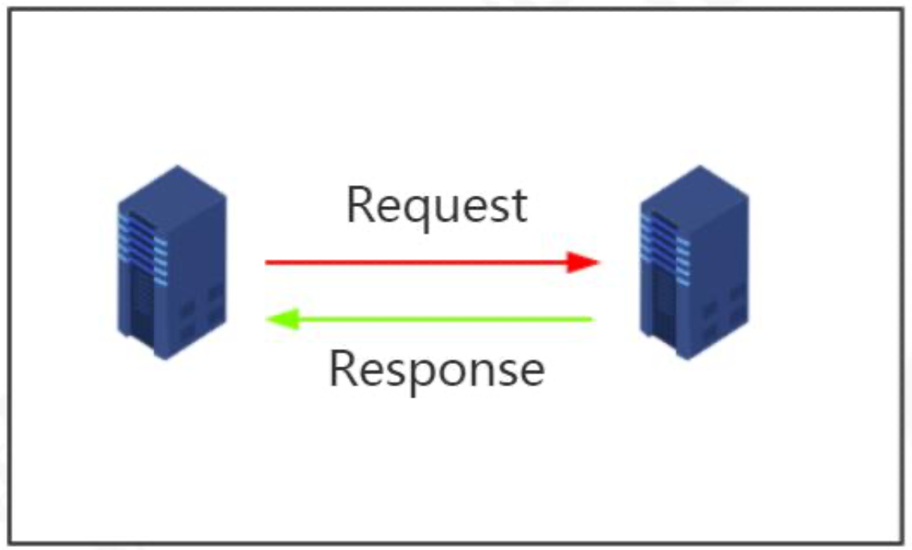
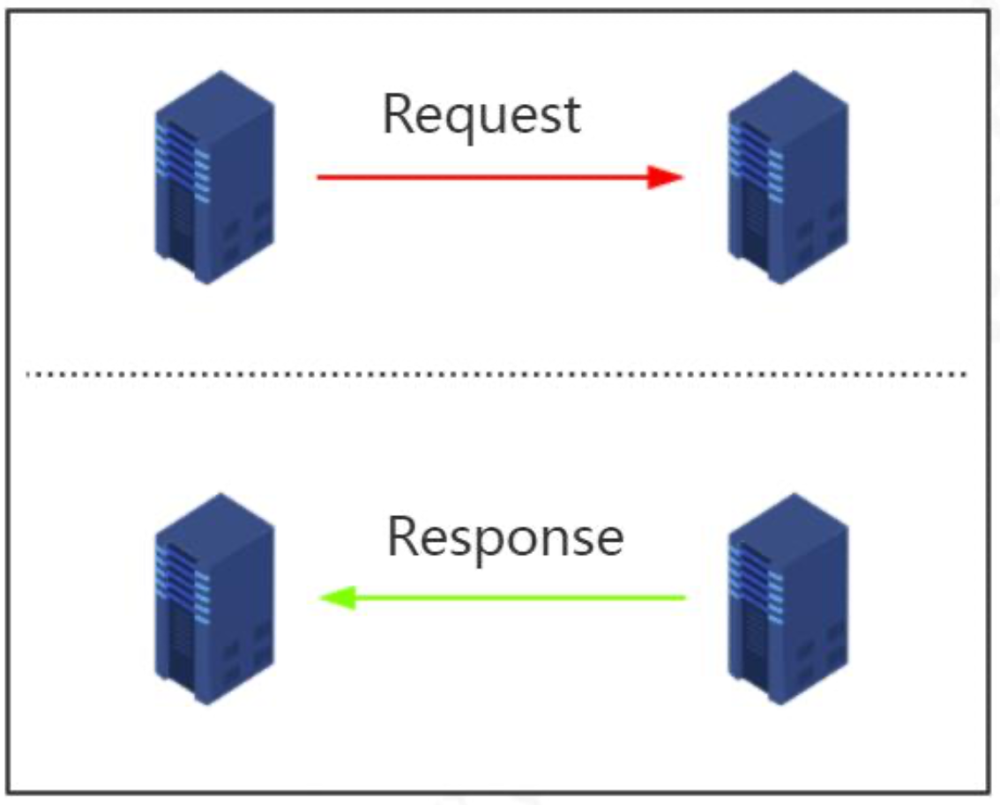
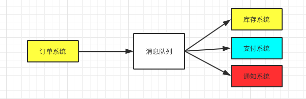

# 消息中间件的背景分析

我们知道并发编程中可以使用阻塞式队列+线程池来实现生产者消费者模式。比如说在一个应用中，A方法调用B方法去执行一些任务处理。我们可以同步调用。但是如果这个时候请求比较多的情况下，同步调用比较耗时会导致请求阻塞。我们会使用阻塞队列加线程池来实现异步任务处理。


那么，问题来了。如果是在分布式系统中，两个服务之间需要通过这种异步队列的方式来处理任务，那单进程级别的队列就无法解决这个问题了。

因此，引入了消息中间件，也就是把消息处理交给第三方的服务，这个服务能够实现数据的存储以及传输，使得在分布式架构下实现跨进程的远程消息通信。

所以，简单来说：消息中间件是指利用高效可靠的消息传输机制进行平台无关的数据交流，并且基于数据通信来进行分布式系统的集成。

## 思考一下消息中间件的设计

基本的需求：

- 能支持消息的发送和接受，需要涉及到网络通信就一定会涉及到NIO。
- 消息中心的消息存储（持久化、非持久化）
- 消息的序列化和反序列化
- 是否跨语言
- 消息的确认机制，如何避免消息重发

高级功能：

- 消息的有序性
- 是否支持事务消息
- 消息手法的性能，对高并发大数据量的支持
- 是否支持集群
- 消息的可靠性存储
- 是否支持多协议

这个思考的过程其实就是做需求的整理，然后在使用已有的技术体系进行技术实现。现在我们学习的中间件无非就是别人根据实际需求进行实现之后，我们如何使用他们提供的API进行应用而已。但是有了这样的一个全局的思考，那么对于后续学习这个技术本身而言，就会非常容易了。

## 发展过程

实际上消息中间件的发展也是挺有意思的，我们知道任何一个技术的出现都是为了解决问题，**这个问题是通过一种通用的软件”总线“也就是一种通信机制，解决应用程序之间繁重的信息通信工作。**最早的小白鼠就是金融交易领域，因为在当时这个领域中，交易员需要通过不同的终端完成交易，每台终端显示不同的信息。如果接入消息总线，那么交易员只需要在一台终端上操作，然后订阅其他终端感兴趣的消息。于是就诞生了发布订阅模型（pubsub），同时诞生了世界上第一个现代消息队列软件（TIB）The information Bus, TIB允许开发者建立一系列规则去描述消息内容，只要消息按照这些规则发布出去，任何消费者应用都能订阅感兴趣的消息。随着TIB带来的好处，被广泛应用在各大领域，IBM也开始研究开发自己的消息中间件，3年后IBM的消息队列IBM MQ产品系列发布，之后的一段时间MQ系列进化成了WebSphere MQ通知商业消息队列平台市场。

包括后期微软也研发了自己的消息队列（MSMQ）。

各大厂商纷纷研究自己的MQ，但是他们是以商业化模式运营自己的MQ软件，商业MQ想要解决的是应用互通的问题，而不是创建标准接口来允许不同MQ产品互通。所以有些大型的金融公司可能会使用来自多个供应商的MQ产品，来服务企业内部不同的应用。那么问题来了，如果应用已经订阅了TIB MQ的消息然后突然需要消费IBM MQ的消息，那么整个实现过程会很麻烦。为了解决这个问题，在2001年诞生了Java Message Service(JMS)，JMS通过提供公共的java API的方式，影藏单独MQ产品供应商的实现接口，从而跨越了不同MQ消费和解决互通问题。从技术层面来说，Java应用程序值需要针对JMS API编程，选择合适的MQ驱动即可。JMS会处理其他部分。这种方案实际是通过单独标准化接口来整合很多不同的接口，效果还是不错的，**但是碰到了互用性问题。两套使用两种不同编程语言的程序如何通过它们的异步消息传递机制相互通信呢。这个时候就需要定义一个异步消息传递的通用标准。**

所以AMQP（Advanced Message Queueing Protocol）高级消息队列协议产生了，它使用了一套标准的底层协议，加入了许多其他特征来支持互用性，为现代应用丰富了消息传递需求，针对标准编码的任何人都可以和任意AMQP供应商提供的MQ服务器进行交互。

除了JMS和AMQP规范以外，还有一种MQTT（Message Queueing Telemetry Transport）,它是专门为小设备设计的。因为计算性能不高的设备不能适应AMQP上的复杂操作，它们需要一种简单而且可互用的方式进行通信。这个MQTT的基本要求，而如今，MQTT是物联网（IOT）生态系统中主要成分之一。

## 为什么要使用MQ？

为什么要使用 MQ 呢?这是一个很常见的面试题，如果你在项目里面用了MQ，还不知道这个问题的答案，说明你自己从来没有思考总结过，因为这个项目是别人架构设计的，你可能只是做了些维护的工作。有一天让你自己去做项目架构的时候，你搞一个MQ进去，理由就是以前的项目也是这么干的，这是很危险的。 

### 实现异步通信 

同步的通信是什么样的? 

发出一个调用请求之后，在没有得到结果之前，就不返回。由调用者主动等待这个调用的结果。 

而异步是相反的，调用在发出之后，这个调用就直接返回了，所以没有返回结果。 也就是说，当一个异步过程调用发出后，调用者不会马上得到结果。而是在调用发出后， 被调用者通过状态、通知来通知调用者，或通过回调函数处理这个调用。 

同步：



异步：



举个例子: 

大家都用过手机银行的跨行转账功能。大家用 APP 的转账功能的时候，有一个实时模式，有一个非实时模式。 

实时转账实际上是异步通信，因为这个里面涉及的机构比较多，调用链路比较长，本行做了一些列的处理之后，转发给银联或者人民银行的支付系统，再转发给接收行， 接受行处理以后再原路返回。 

所以转账以后会有一行小字提示:具体到账时间以对方行处理为准，也就是说转出行只保证了这个转账的消息发出。那为什么到账时间又这么快呢?很多时候我们转账之后，不用几秒钟对方就收到了。是因为大部分的MQ都有一个低延迟的特性，能在短时间内处理非常多的消息。 

很多理财软件提现也是一样，先提交请求，到账时间不定。这个是用MQ实现系统间异步通信的一个场景。 

### 实现系统解耦 

第二个主要的功能，是用来实现系统解耦。既然说到解耦，那我们要先来了解一下耦合的概念。 

耦合是系统内部或者系统之间存在相互作用，相互影响和相互依赖。 

在我们的分布式系统中，一个业务流程涉及多个系统的时候，他们之间就会形成一 个依赖关系。 

比如我们以12306网站退票为例，在传统的通信方式中，订单系统发生了退货的动 作，那么要依次调用所有下游系统的API，比如调用库存系统的API恢复库存，因为这张火车票还要释放出去给其他乘客购买;调用支付系统的API，不论是支付宝微信还是银行卡，要把手续费扣掉以后，原路退回给消费者;调用通知系统API通知用户退货成功。 

```java
// 伪代码
public void returnGoods(){
    stockService.updateInventory (); 
    payService.refund(); 
    noticeService.notice();
}
```

这个过程是串行执行的，如果在恢复库存的时候发生了异常，那么后面的代码都不会执行。由于这一系列的动作，恢复库存，资金退还，发送通知，本质上没有一个严格的先后顺序，也没有直接的依赖关系，也就是说，只要用户提交了退货的请求，后面的这些动作都是要完成的。库存有没有恢复成功，不影响资金的退还和发送通知。 

如果把串行改成并行，我们有什么思路?

(多线程) 

多线程或者线程池是可以实现的，但是每一个需要并行执行的地方都引入线程，又会带来线程或者线程池的管理问题。
 所以，这种情况下，我们可以引入MQ实现系统之间依赖关系的解耦合。 



订单系统只需要把退货的消息发送到消息队列上，由各个下游的业务系统自己创建队列，然后监听队列消费消息。 

在这种情况下订单系统里面就不需要配置其他系统的IP、端口、接口地址了，因为它不需要关心消费者在网络上的什么位置，所以下游系统改IP没有任何影响。甚至不需要关心消费者有没有消费成功，它只需要把消费发到消息队列的服务器上就可以了。 

这样，我们就实现了系统之间依赖关系的解耦。 

### 实现流量削峰 

第三个主要功能，是实现流量削峰。 

在很多的电商系统里面，有一个瞬间流量达到峰值的情况，比如京东的618，淘宝的双11，还有小米抢购。普通的硬件服务器肯定支撑不了这种百万或者千万级别的并发量，就像2012年的小米一样，动不动服务器就崩溃。 

如果通过堆硬件的方式去解决，那么在流量峰值过去以后就会出现巨大的资源浪费。 那要怎么办呢?如果说要保护我们的应用服务器和数据库，限流也是可以的，但是这样又会导致订单的丢失，没有达到我们的目的。 

为了解决这个问题，我们就可以引入MQ，**MQ既然是队列，一定有队列的特性，我们知道队列的特性是先进先出FIFO。**

这样，我们就可以先把所有的流量承接下来，转换成MQ消息发送到消息队列服务器上，业务层就可以根据自己的消费速率去处理这些消息，处理之后再返回结果。就像我们在火车站排队一样，大家只能一个一个买票，不会因为人多就导致售票员忙不过来。 如果要处理快一点，大不了多开几个窗口(增加几个消费者)。 

这个是我们利用 MQ 实现流量削峰的一个案例。


### 总结

1. 对于数据量大或者处理耗时长的操作，我们可以引入MQ实现异步通信，减少客户端的等待，提升响应速度。 
2. 对于改动影响大的系统之间调用，可以引入MQ实现解耦，减少系统之间的直接依赖。 
3. 对于会出现瞬间的流量峰值的系统，我们可以引入MQ实现流量削峰，达到保护应用和数据库的目的。 

所以对于一些特定的业务场景，MQ对于优化我们的系统还是有很大的帮助的，那 么大家想一下，把传统的RPC通信改成MQ通信会不会带来一些问题呢? 

### 使用消息队列带来的一些问题 

系统可用性降低:原来是两个节点的通信，现在还需要独立运行一个服务，如果MQ服务器或者通信网络出现问题，就会导致请求失败。 

系统复杂性提高: 为什么说复杂?第一个就是你必须要理解相关的模型和概念，才能正确地配置和使用MQ。第二个，使用MQ发送消息必须要考虑消息丢失和消息重复消费的问题。一旦消息没有被正确地消费，就会带来数据一致性的问题。 

所以，我们在做系统架构的时候一定要根据实际情况来分析，不要因为我们说了这么多的MQ能解决的问题，就盲目地引入MQ。 