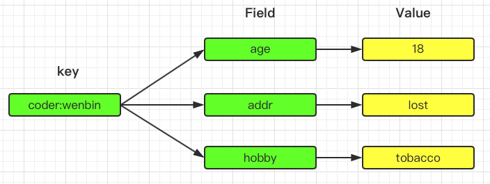
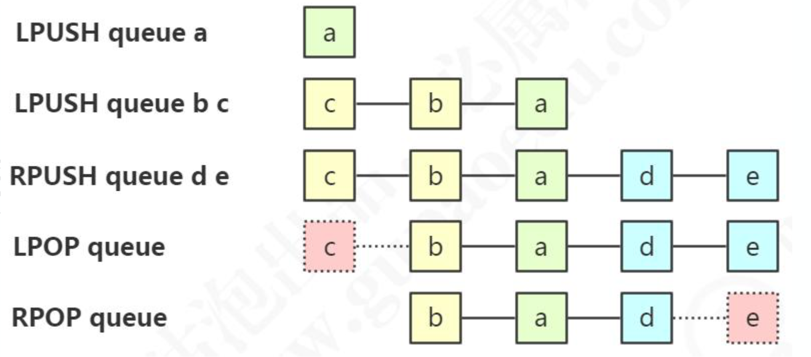
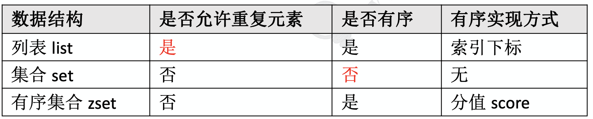

# Redis基础

## Redis定位与特性

在绝大部分时候，我们都会首先考虑用关系型数据库存储我们的数据，比如SQLServer，Oracle，MySQL等等。

关系型数据库的特点：

1. 它以表格的形式，基于行存储数据，是一个二维的模式。
2. 它存储的是结构化的数据，数据存储有固定的模式(schema)，数据需要适应表结构。
3. 表与表之间存在关联(Relationship)。
4. 大部分关系型数据库都支持SQL(结构化查询语言)的操作，支持复杂的关联查询。
5. 通过支持事务(ACID 酸)来提供严格或者实时的数据一致性。

但是使用关系型数据库也存在一些限制，比如:

1. 要实现扩容的话，只能向上(垂直)扩展，比如磁盘限制了数据的存储，就要扩大磁盘容量，通过堆硬件的方式，不支持动态的扩缩容。水平扩容需要复杂的技术来实现，比如分库分表。
2. 表结构修改困难，因此存储的数据格式也受到限制。
3. 在高并发和高数据量的情况下，我们的关系型数据库通常会把数据持久化到磁盘， 基于磁盘的读写压力比较大。

为了规避关系型数据库的一系列问题，我们就有了非关系型的数据库，我们一般把 它叫做“non-relational”或者“Not Only SQL”。NoSQL 最开始是不提供 SQL 的数 据库的意思，但是后来意思慢慢地发生了变化。

非关系型数据库的特点:

1. 存储非结构化的数据，比如文本、图片、音频、视频。
2. 表与表之间没有关联，可扩展性强。
3. 保证数据的最终一致性。遵循 BASE(碱)理论。 
   - Basically Available(基本可用); 
   - Soft-state(软状态);
   -  Eventually Consistent(最终一致性)。
4. 支持海量数据的存储和高并发的高效读写。
5. 支持分布式，能够对数据进行分片存储，扩缩容简单。

对于不同的存储类型，我们又有各种各样的非关系型数据库，比如有几种常见的类型:

1. KV存储，用Key Value的形式来存储数据。比较常见的有 Redis 和 MemcacheDB。
2. 文档存储，MongoDB。
3. 列存储，HBase。
4. 图存储，这个图(Graph)是数据结构，不是文件格式。Neo4j。
5. 对象存储。
6. XML 存储等等等等。

这个网页列举了各种各样的 NoSQL 数据库 http://nosql-database.org/ 。

## Redis特性

官网介绍:https://redis.io/topics/introduction

中文网站:http://www.redis.cn

硬件层面有 CPU 的缓存;浏览器也有缓存;手机的应用也有缓存。我们把数据缓存起来的原因就是从原始位置取数据的代价太大了，放在一个临时位置存储起来，取回就可以快一些。

Redis 的特性:

1. 更丰富的数据类型
2. 进程内与跨进程;单机与分布式
3. 功能丰富:持久化机制、过期策略
4. 支持多种编程语言
5. 高可用，集群

## 基本操作

Redis默认有 16 个库(0-15)，可以在配置文件中修改，默认使用第一个 db0。

因为没有完全隔离，不像数据库的 database，不适合把不同的库分配给不同的业务使用。

### 切换数据库

```
127.0.0.1:6379> select 1
OK
```

### 清空当前数据库

```
127.0.0.1:6379[1]> flushdb
OK
```

### 清空所有数据库

```
127.0.0.1:6379> flushall
OK
```

### 命令参考

Redis 是字典结构的存储方式，采用 key-value 存储。key 和 value 的最大长度限制 是 512M(来自官网 https://redis.io/topics/data-types-intro/)。

[命令参考](http://redisdoc.com/index.html)

#### 存值

```
127.0.0.1:6379> set wenbin 123
OK
```

#### 取值

```
127.0.0.1:6379> get wenbin
"123"
```

#### 查看所有键

```
127.0.0.1:6379> keys *
1) "wenbin"
```

#### 获取键总数

```
127.0.0.1:6379> dbsize
(integer) 1
```

#### 查看键是否存在

```
127.0.0.1:6379> exists wenbin
(integer) 1
```

#### 删除键

```
127.0.0.1:6379> del wenbin
(integer) 1
```

#### 重命名键

```
127.0.0.1:6379> rename wenbin wenbin1
OK
```

#### 查看类型

```
127.0.0.1:6379> type wenbin1
string
```


## Redis基本数据类型

### String字符串

最基本也是最常用的数据类型就是String。set和get命令就是String的操作命令。 

#### 存储类型

设置多个值(批量操作，原子性)

#### 操作命令

##### 设置多个值(批量操作，原子性)

```
127.0.0.1:6379> mset wenbin2 222 wenbin3 333
OK
```

##### 设置值，如果 key 存在，则不成功

```
127.0.0.1:6379> setnx wenbin1
(error) ERR wrong number of arguments for 'setnx' command
127.0.0.1:6379> setnx wenbin4 444
(integer) 1
```

基于此可实现分布式锁。用 del key 释放锁。 但如果释放锁的操作失败了，导致其他节点永远获取不到锁，怎么办? 加过期时间。单独用 expire 加过期，也失败了，无法保证原子性，怎么办?多参数

```shell
set key value [expiration EX seconds|PX milliseconds][NX|XX]
```

使用参数的方式

```
127.0.0.1:6379> set lock1 1 EX 10 NX
OK
```

##### (整数)值递增

```shell
127.0.0.1:6379> set wenbin 1
OK
127.0.0.1:6379> incr wenbin
(integer) 2
127.0.0.1:6379> incrby wenbin 10
(integer) 12
```

##### (整数)值递减

```shell
127.0.0.1:6379> decr wenbin
(integer) 11
127.0.0.1:6379> decrby wenbin 10
(integer) 1
```

##### 浮点数增量

```
127.0.0.1:6379> set f 2.6
OK
127.0.0.1:6379> incrbyfloat f 0.1
"2.7"
```

##### 获取多个值

```
127.0.0.1:6379> mget wenbin1 wenbin2 wenbin3
1) "234"
2) "222"
3) "333"
```

##### 获取值长度

```
127.0.0.1:6379> strlen wenbin
(integer) 1
```

##### 字符串追加内容

```
127.0.0.1:6379> append wenbin3 good
(integer) 7
127.0.0.1:6379> get wenbin3
"333good"
```

##### 获取指定范围的字符

```
127.0.0.1:6379> getrange wenbin3 2 6
"3good"
```

#### 应用场景

##### 缓存

String 类型，例如:热点数据缓存(例如报表，明星出轨)，对象缓存，全页缓存。可以提升热点数据的访问速度。

##### 数据共享分布式

STRING类型，因为Redis是分布式的独立服务，可以在多个应用之间共享

例如:分布式 Session

```xml
<dependency> 
    <groupId>org.springframework.session</groupId> 
    <artifactId>spring-session-data-redis</artifactId>
</dependency>
```

##### 分布式锁

STRING类型setnx方法，只有不存在时才能添加成功，返回 true。

 建议用参数的形式，[参数说明](http://redisdoc.com/string/set.html)

##### 全局 ID

INT类型，INCRBY，利用原子性

```
incrby userid 1000
```

(分库分表的场景，一次性拿一段)

##### 计数器

INT类型，INCR方法。

例如:文章的阅读量，微博点赞数，允许一定的延迟，先写入 Redis 再定时同步到数据库。

##### 限流

INT 类型，INCR 方法。

以访问者的IP和其他信息作为 key，访问一次增加一次计数，超过次数则返回false。

##### 位统计

String 类型的 BITCOUNT(1.6.6 的bitmap数据结构介绍)。

字符是以 8 位二进制存储的。

```
127.0.0.1:6379> set k1 a
OK
127.0.0.1:6379> setbit k1 6 1
(integer) 0
127.0.0.1:6379> setbit k1 7 0
(integer) 1
127.0.0.1:6379> get k1
"b"
```

- a 对应的 ASCII 码是 97，转换为二进制数据是 01100001 
- b 对应的 ASCII 码是 98，转换为二进制数据是 01100010

因为bit非常节省空间(1 MB=8388608 bit)，可以用来做大数据量的统计。

例如:在线用户统计，留存用户统计

```
setbit onlineusers 0 1 
setbit onlineusers 1 1 
setbit onlineusers 2 0
```

支持按位与、按位或等等操作。

```
BITOP AND destkey key [key ...] ，对一个或多个 key 求逻辑并，并将结果保存到 destkey 。 
BITOP OR destkey key [key ...] ，对一个或多个 key 求逻辑或，并将结果保存到 destkey 。 
BITOP XOR destkey key [key ...] ，对一个或多个 key 求逻辑异或，并将结果保存到 destkey 。 
BITOP NOT destkey key ，对给定 key 求逻辑非，并将结果保存到 destkey 。
```

计算出 7 天都在线的用户

```
BITOP "AND" "7_days_both_online_users" "day_1_online_users" "day_2_online_users" ... "day_7_online_users"
```

### Hash哈希



#### 存储类型

包含键值对的无序散列表。value 只能是字符串，不能嵌套其他类型。

同样是存储字符串，Hash 与 String 的主要区别?

- 把所有相关的值聚集到一个 key 中，节省内存空间
- 只使用一个 key，减少 key 冲突
- 当需要批量获取值的时候，只需要使用一个命令，减少内存/IO/CPU 的消耗

Hash 不适合的场景:

1. Field 不能单独设置过期时间
2. 没有 bit 操作
3. 需要考虑数据量分布的问题(value 值非常大的时候，无法分布到多个节点)

#### 操作命令

#### 设置值

```
127.0.0.1:6379> hset coder:wenbin age 18
(integer) 1
127.0.0.1:6379> hset coder:wenbin addr lost hobby tobacco
(integer) 2
```

#### 获取值

```
127.0.0.1:6379> hget coder:wenbin age
"18"
127.0.0.1:6379> hmget coder:wenbin addr hobby
1) "lost"
2) "tobacco"
```

##### 查看命令

```
127.0.0.1:6379> hkeys coder:wenbin
1) "age"
2) "addr"
3) "hobby"
127.0.0.1:6379> hvals coder:wenbin
1) "18"
2) "lost"
3) "tobacco"
127.0.0.1:6379> hgetall coder:wenbin
1) "age"
2) "18"
3) "addr"
4) "lost"
5) "hobby"
6) "tobacco"
```

#### 应用场景

##### String

String 可以做的事情，Hash 都可以做。

##### 存储对象类型的数据

比如对象或者一张表的数据，比 String 节省了更多 key 的空间，也更加便于集中管 理。

### List列表

存储有序的字符串(从左到右)，元素可以重复。可以充当队列和栈的角色。

#### 操作命令

##### 元素增减

```
lpush queue a 
lpush queue b c
rpush queue d e 

lpop queue 
rpop queue
```



阻塞：

```
blpop queue 
brpop queue
```

##### 取值

```
lindex queue 0 
lrange queue 0 -1
```

#### 应用场景

##### 消息队列

List 提供了两个阻塞的弹出操作:BLPOP/BRPOP，可以设置超时时间。

BLPOP:BLPOP key1 timeout 移出并获取列表的第一个元素， 如果列表没有元素 会阻塞列表直到等待超时或发现可弹出元素为止。

BRPOP:BRPOP key1 timeout 移出并获取列表的最后一个元素， 如果列表没有元 素会阻塞列表直到等待超时或发现可弹出元素为止。

队列:先进先出:rpush blpop，左头右尾，右边进入队列，左边出队列。

栈:先进后出:rpush brpop

### Set 集合

String 类型的无序集合，最大存储数量 2^32-1(40 亿左右)。

#### 操作命令

##### 添加一个或者多个元素

```
127.0.0.1:6379> sadd myset a b c d e f g
(integer) 7
```

##### 获取所有元素

```
127.0.0.1:6379> smembers myset
1) "c"
2) "d"
3) "e"
4) "g"
5) "b"
6) "a"
7) "f"
```

##### 统计元素个数

```
127.0.0.1:6379> scard myset
(integer) 7
```

##### 随机获取一个元素

```
127.0.0.1:6379> srandmember myset
"b"
```

##### 随机弹出一个元素

```
127.0.0.1:6379> spop myset
"f"
```

##### 移除一个或者多个元素

```
127.0.0.1:6379> srem myset d e f
(integer) 2
```

##### 查看元素是否存在

```
127.0.0.1:6379> sismember myset a
(integer) 1
```

#### 应用场景

##### 抽奖

随机获取元素 spop myset

##### 点赞、签到、打卡


这条微博的 ID 是 t1001，用户 ID 是 u3001。

用 like:t1001 来维护 t1001 这条微博的所有点赞用户。

点赞了这条微博:sadd like:t1001 u3001

取消点赞:srem like:t1001 u3001

是否点赞:sismember like:t1001 u3001

点赞的所有用户:smembers like:t1001

点赞数:scard like:t1001

比关系型数据库简单许多。

### ZSet 有序集合

sorted set，有序的 set，每个元素有个 score。

score 相同时，按照 key 的 ASCII 码排序。

数据结构对比:

#### 操作命令

##### 添加元素

```
127.0.0.1:6379> zadd myzset 10 java 20 php 30 ruby 40 cpp 50 python
(integer) 5
```

##### 获取全部元素

```
127.0.0.1:6379> zrange myzset 0 -1 withscores
 1) "java"
 2) "10"
 3) "php"
 4) "20"
 5) "ruby"
 6) "30"
 7) "cpp"
 8) "40"
 9) "python"
10) "50"
127.0.0.1:6379> zrevrange myzset 0 -1 withscores
 1) "python"
 2) "50"
 3) "cpp"
 4) "40"
 5) "ruby"
 6) "30"
 7) "php"
 8) "20"
 9) "java"
10) "10"
```

##### 根据分值区间获取元素

```
127.0.0.1:6379> zrangebyscore myzset 20 30
1) "php"
2) "ruby"
```

##### 移除元素

也可以根据 score rank 删除

```
127.0.0.1:6379> zrem myzset php cpp
(integer) 2
```

##### 统计元素个数

```
127.0.0.1:6379> zcard myzset
(integer) 3
```

##### 分值递增

```
127.0.0.1:6379> zincrby myzset 5 python
"55"
```

##### 根据分值统计个数

```
127.0.0.1:6379> zcount myzset 20 60
(integer) 2
```

##### 获取元素 rank

```
127.0.0.1:6379> zrank myzset java
(integer) 0
```

#### 应用场景

id 为 6001 的新闻点击数加 1:zincrby hotNews:20190926 1 n6001

获取今天点击最多的 15 条:zrevrange hotNews:20190926 0 15 withscores


### 其他数据结构简介

https://redis.io/topics/data-types-intro

#### BitMaps

Bitmaps 是在字符串类型上面定义的位操作。一个字节由 8 个二进制位组成。在介绍String的时候介绍过。

应用场景:
    用户访问统计
    在线用户统计

#### Hyperloglogs

Hyperloglogs:提供了一种不太准确的基数统计方法，比如统计网站的 UV，存在 一定的误差。

#### **Streams**

5.0 推出的数据类型。支持多播的可持久化的消息队列，用于实现发布订阅功能，借 鉴了 kafka 的设计。